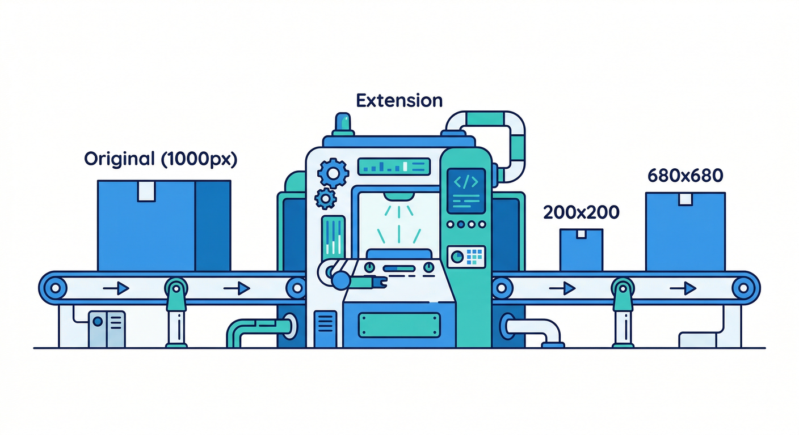
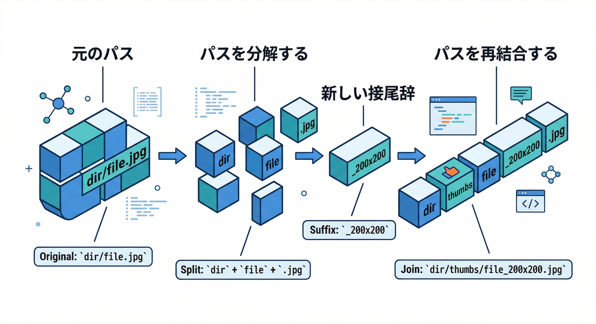
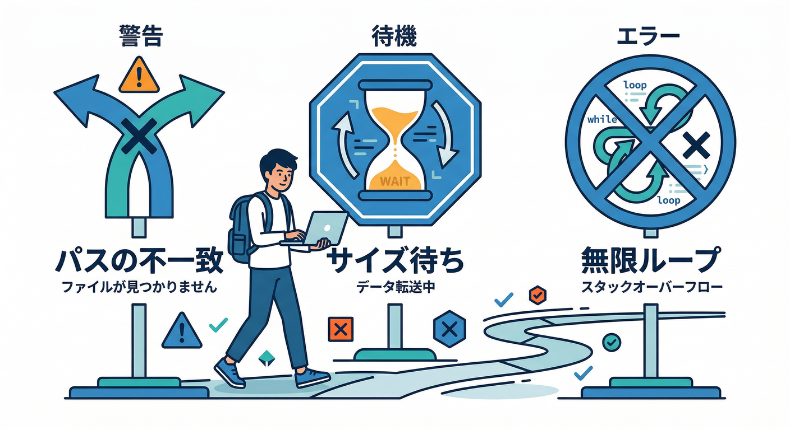
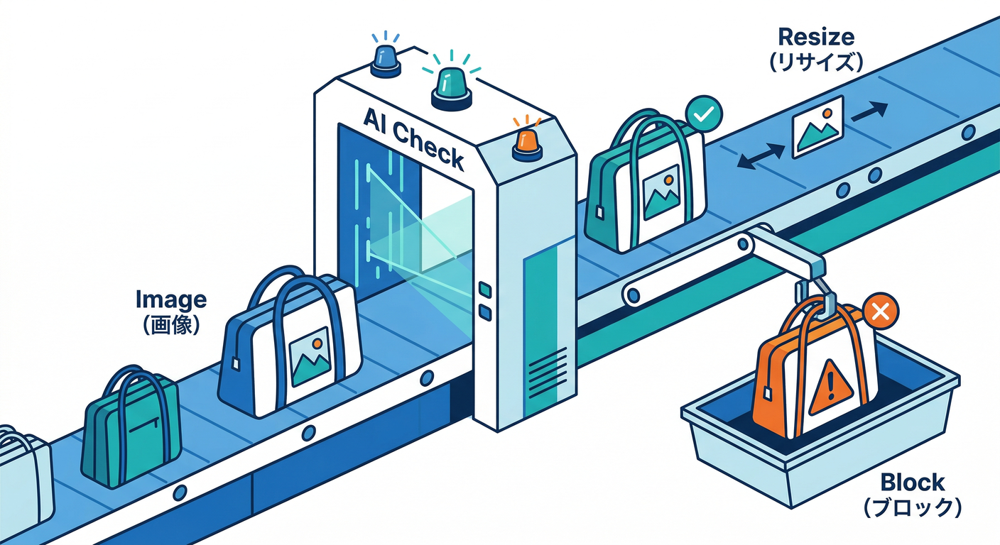
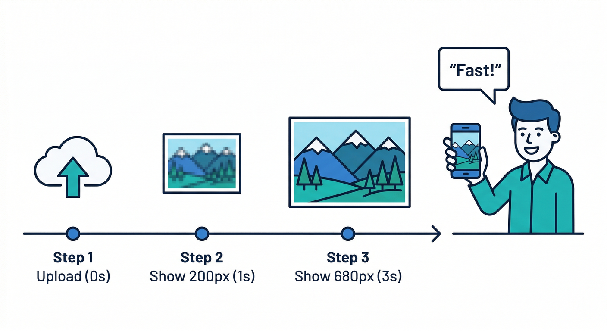

# 第11章：Resize Images実践（アップロード→サムネ→表示）📷➡️🖼️➡️🧑‍💻

この章は「**画像をアップロードしたら、勝手にサムネが増えて、Reactで表示できる**」ところまで一気にやるよ〜😆✨
できるようになること👇

* アップロードした元画像から、指定サイズのサムネが自動生成される流れを説明できる🧠⚙️ ([extensions.dev][1])
* 生成されたサムネの“置き場所＆名前”を予測して、URLを取って表示できる🧭🖼️ ([GitHub][2])
* 200px→680pxみたいに「軽い順」に出して、体感速度を上げられる🚀✨

---

## 1) まず“どう増えるか”を1分で理解🧠



Resize Images は、指定したバケットに画像が上がると👇こう動くよ📦

1. 画像かどうか判定
2. 指定サイズ（例：200x200, 680x680）のリサイズ画像を生成
3. **元ファイル名に「_幅x高さ」を付けた名前**で保存（同じバケット） ([extensions.dev][1])

さらに重要ポイント👇

* リサイズは **縦横比を保ったまま**、指定した最大幅・最大高さに収まるよう縮小される（“ピッタリ200x200”とは限らないよ）📐 ([extensions.dev][1])
* 出力は JPEG/PNG/WebP/GIF/AVIF/TIFF など対応で、複数形式出力もできる📦 ([extensions.dev][1])

---

## 2) ここだけ確認すればOKな「拡張の設定」🎛️✅


この章でのUI表示は、拡張のパラメータ次第で「どこに・どういう名前で」サムネができるかが決まるよ🧩

最低限ここ👇

* **IMG_SIZES**：生成したいサイズ（例：`200x200,680x680`） ([GitHub][2])
* **RESIZED_IMAGES_PATH**：サムネの置き場所（例：`thumbs`）

  * 例：`/images/original.jpg` → `/images/thumbs/original_200x200.jpg` ([GitHub][2])
* **MAKE_PUBLIC**：サムネを自動で公開するか（基本はNoでOK） ([GitHub][2])
* **INCLUDE_PATH_LIST / EXCLUDE_PATH_LIST**：対象パスを絞る（事故防止に超おすすめ）🧯 ([GitHub][2])

💡地味に大事：この拡張は「指定バケットの変更を全部監視」しがちなので、画像用バケット分離が推奨されてるよ（無駄に関数が回るのを防ぐ）🧯📉 ([extensions.dev][1])

---

## 3) Reactで「アップロード→URL取得→表示」🧑‍💻✨


## 3-1) アップロード（元画像）📤

ポイントは👇

* Storageへアップロードするとき、**contentType を付ける**（画像判定の助けにもなる）🧷
* まずは元画像を表示できるようにする（サムネが遅れてもUIが止まらない）🙂

```ts
// firebase.ts（例）
import { initializeApp } from "firebase/app";
import { getStorage } from "firebase/storage";

const firebaseConfig = {
  // your config
};

export const app = initializeApp(firebaseConfig);
export const storage = getStorage(app);
```

```tsx


// AvatarUpload.tsx（例）
import React, { useMemo, useState } from "react";
import { storage } from "./firebase";
import { ref, uploadBytesResumable, getDownloadURL } from "firebase/storage";

type Thumb = { size: string; url: string };

function splitPath(path: string) {
  const idx = path.lastIndexOf("/");
  return { dir: idx >= 0 ? path.slice(0, idx) : "", name: idx >= 0 ? path.slice(idx + 1) : path };
}

function addSizeSuffix(filename: string, size: string) {
  const dot = filename.lastIndexOf(".");
  if (dot <= 0) return `${filename}_${size}`; // 拡張子なし想定の保険
  const base = filename.slice(0, dot);
  const ext = filename.slice(dot);
  return `${base}_${size}${ext}`;
}

function makeThumbPath(originalPath: string, resizedImagesPath: string, size: string) {
  // RESIZED_IMAGES_PATH が空なら、同じフォルダに *_200x200 を置く想定
  const { dir, name } = splitPath(originalPath);
  const sized = addSizeSuffix(name, size);

  if (!resizedImagesPath) {
    return dir ? `${dir}/${sized}` : sized;
  }
  return dir ? `${dir}/${resizedImagesPath}/${sized}` : `${resizedImagesPath}/${sized}`;
}

async function waitDownloadURL(path: string, maxMs = 30_000, intervalMs = 1_000) {
  const start = Date.now();
  while (true) {
    try {
      return await getDownloadURL(ref(storage, path));
    } catch (e: any) {
      // まだサムネが生成されてないだけ…が多いので待つ
      if (Date.now() - start > maxMs) throw e;
      await new Promise((r) => setTimeout(r, intervalMs));
    }
  }
}

export function AvatarUpload() {
  const [file, setFile] = useState<File | null>(null);
  const [progress, setProgress] = useState<number>(0);
  const [originalUrl, setOriginalUrl] = useState<string>("");
  const [thumbs, setThumbs] = useState<Thumb[]>([]);
  const [status, setStatus] = useState<string>("");

  const previewUrl = useMemo(() => (file ? URL.createObjectURL(file) : ""), [file]);

  async function onUpload() {
    if (!file) return;

    setStatus("アップロード中…📤");
    setProgress(0);
    setThumbs([]);

    // 例：ユーザー別に分ける（uidは適宜）
    const uid = "demoUid";
    const ext = file.name.split(".").pop()?.toLowerCase() || "jpg";
    const id = crypto.randomUUID();
    const originalPath = `users/${uid}/avatars/${id}.${ext}`;

    const storageRef = ref(storage, originalPath);
    const uploadTask = uploadBytesResumable(storageRef, file, { contentType: file.type });

    uploadTask.on(
      "state_changed",
      (snap) => setProgress((snap.bytesTransferred / snap.totalBytes) * 100),
      (err) => setStatus(`失敗…😭 ${String(err)}`),
      async () => {
        // 元画像URL（まず表示できるようにする）
        const url = await getDownloadURL(uploadTask.snapshot.ref);
        setOriginalUrl(url);

        setStatus("サムネ生成待ち…🖼️⏳");

        // 拡張の設定に合わせてここを揃える！
        const RESIZED_IMAGES_PATH = "thumbs";       // extensionの RESIZED_IMAGES_PATH
        const IMG_SIZES = ["200x200", "680x680"];   // extensionの IMG_SIZES

        // 軽い順に並べる（体感速度アップ）
        const sorted = [...IMG_SIZES].sort((a, b) => {
          const [aw, ah] = a.split("x").map(Number);
          const [bw, bh] = b.split("x").map(Number);
          return aw * ah - bw * bh;
        });

        const results: Thumb[] = [];
        for (const size of sorted) {
          const thumbPath = makeThumbPath(originalPath, RESIZED_IMAGES_PATH, size);
          const thumbUrl = await waitDownloadURL(thumbPath);
          results.push({ size, url: thumbUrl });
          setThumbs([...results]); // 1枚ずつ出して“速く感じさせる”
        }

        setStatus("完成！🎉");
      }
    );
  }

  return (
    <div style={{ maxWidth: 520 }}>
      <h3>プロフィール画像アップロード🧑‍💻✨</h3>

      <input
        type="file"
        accept="image/*"
        onChange={(e) => setFile(e.target.files?.[0] ?? null)}
      />

      {previewUrl && (
        <div style={{ marginTop: 12 }}>
          <div>プレビュー👀</div>
          
        </div>
      )}

      <button onClick={onUpload} disabled={!file} style={{ marginTop: 12 }}>
        アップロードする🚀
      </button>

      <div style={{ marginTop: 8 }}>進捗：{progress.toFixed(0)}%</div>
      <div style={{ marginTop: 8 }}>{status}</div>

      {originalUrl && (
        <div style={{ marginTop: 16 }}>
          <div>元画像（先に出す）📷</div>
          
        </div>
      )}

      {thumbs.length > 0 && (
        <div style={{ marginTop: 16 }}>
          <div>サムネ（軽い順に出る）🖼️⚡</div>
          <div style={{ display: "flex", gap: 12, flexWrap: "wrap", marginTop: 8 }}>
            {thumbs.map((t) => (
              <div key={t.size}>
                <div style={{ fontSize: 12 }}>{t.size}</div>
                
              </div>
            ))}
          </div>
        </div>
      )}
    </div>
  );
}
```

アップロードは公式も「uploadBytesResumable で進捗を取る」形が基本だよ📈 ([Firebase][3])
URL取得は getDownloadURL が王道📎 ([Firebase][4])

---

## 4) 「サムネが出ない！」ときのチェック🧯😵



よくある原因ランキング🏆

1. **RESIZED_IMAGES_PATH が違う**（thumbs なのに thumbnails を見に行ってた、など） ([GitHub][2])
2. **IMG_SIZES が違う**（200x200 だけ設定なのに 680x680 を待ってた） ([GitHub][2])
3. **バケット全部監視で無駄に回ってる**（関係ないファイルでも起動しちゃう）→ パス制限 or バケット分離が効く🧯 ([extensions.dev][1])
4. 「200x200」指定でも**縦横比維持で、結果サイズが想像と違う**（でも正常）📐 ([extensions.dev][1])

---

## 5) おまけ：AIで“安全＆運用ラク”にする🤖✨



## 5-1) 拡張のAIフィルタで「ヤバ画像」を止める🛑🖼️

Resize Images には **AIによるコンテンツフィルタ**が付いてて、厳しさも選べるよ（Off/Low/Medium/High）🧠 ([extensions.dev][1])
さらに「ロゴがある？」「暴力表現ある？」みたいな **Yes/No質問プロンプト**も使える👮‍♂️✨ ([extensions.dev][1])
この機能を使うとき、拡張定義では Gemini モデル利用向けの権限（aiplatform.user）が含まれてるよ🧾 ([GitHub][2])

## 5-2) Gemini CLIに“コードの下書き”を作らせる🧑‍💻🤝

Gemini CLI はターミナルで動くAIエージェントで、ツールを使いながら作業してくれるタイプ（ReActループ）だよ🛠️ ([Google Cloud Documentation][5])
例えば👇「thumbパス生成関数だけ作って」と頼む、みたいな使い方が相性いい😆

```bash
## 例：Gemini CLIにお願い（雰囲気）
gemini "Firebase Storage のパス users/{uid}/avatars/{id}.jpg から、RESIZED_IMAGES_PATH=thumbs と IMG_SIZES=200x200,680x680 のサムネパスを作るTypeScript関数を書いて。例も付けて。"
```

## 5-3) Console側は「Gemini in Firebase」でログ解読🧠🔍

エラー文やログが難解でも、Gemini in Firebase が噛み砕いたり、対処の候補を出してくれる🧯✨ ([Firebase][6])

---

## ミニ課題🎯



「軽い順に表示」をもう一段よくしよう🔥

* 200pxサムネが出たら、**先にそれを表示して**
* 680pxは **あとから差し替える**（いまのコードはほぼそれ）
* できたら「生成待ち中はスケルトン表示」も入れてみよ🦴✨

---

## チェック✅

次を自分の言葉で言えたら勝ち〜😎✨

* サムネ名は「元ファイル名 + _幅x高さ」になる ([extensions.dev][1])
* RESIZED_IMAGES_PATH を入れると「同じフォルダ配下にthumbsを挟む」形になる ([GitHub][2])
* リサイズは縦横比を維持して“最大幅/最大高さに収める” ([extensions.dev][1])
* getDownloadURL でURLを取って React で表示できる ([Firebase][4])

---

次の第12章（ログ・失敗・リトライ🪵🧯）に進むと、**「出ない時にどこを見る？」**が強くなって運用が一気にラクになるよ〜😆🔥

[1]: https://extensions.dev/extensions/firebase/storage-resize-images "Resize Images | Firebase Extensions Hub"
[2]: https://raw.githubusercontent.com/firebase/extensions/next/storage-resize-images/extension.yaml "raw.githubusercontent.com"
[3]: https://firebase.google.com/docs/storage/web/upload-files "Upload files with Cloud Storage on Web  |  Cloud Storage for Firebase"
[4]: https://firebase.google.com/docs/storage/web/download-files "Download files with Cloud Storage on Web  |  Cloud Storage for Firebase"
[5]: https://docs.cloud.google.com/gemini/docs/codeassist/gemini-cli "Gemini CLI  |  Gemini for Google Cloud  |  Google Cloud Documentation"
[6]: https://firebase.google.com/docs/ai-assistance/gemini-in-firebase "Gemini in Firebase"
