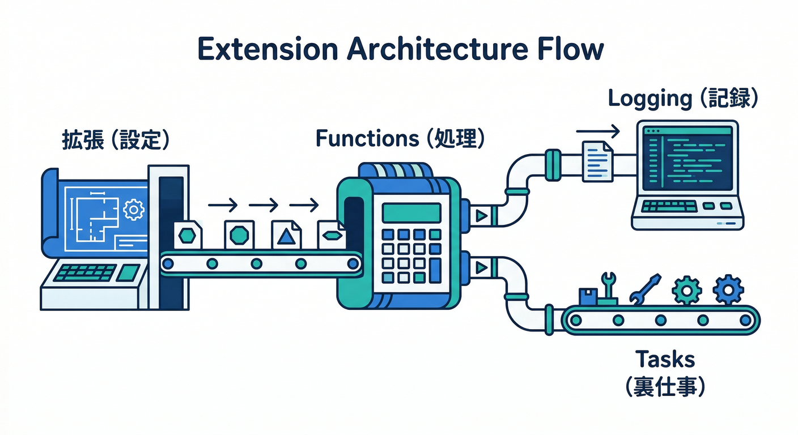
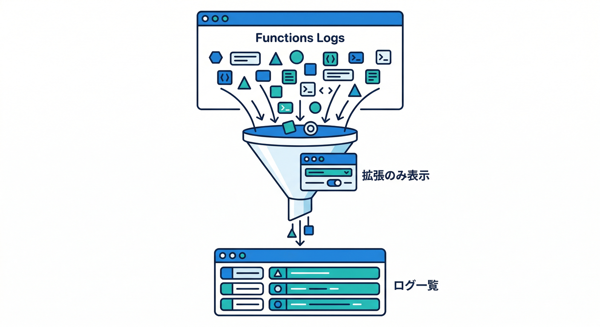
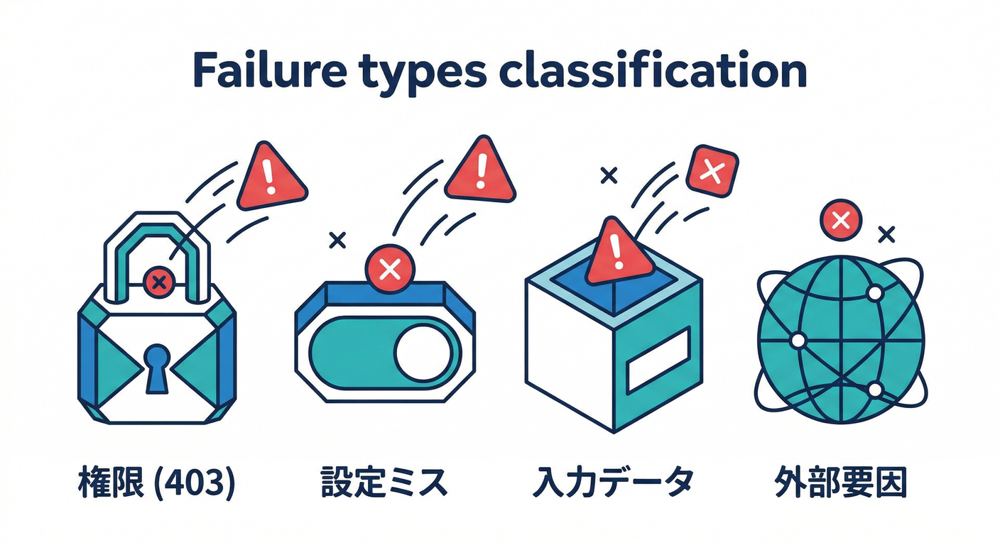
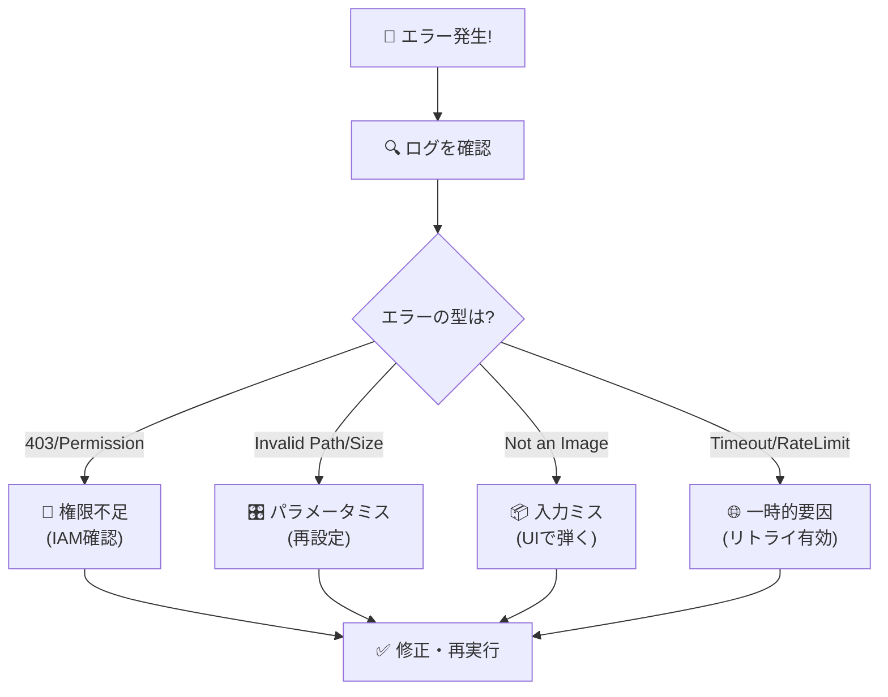
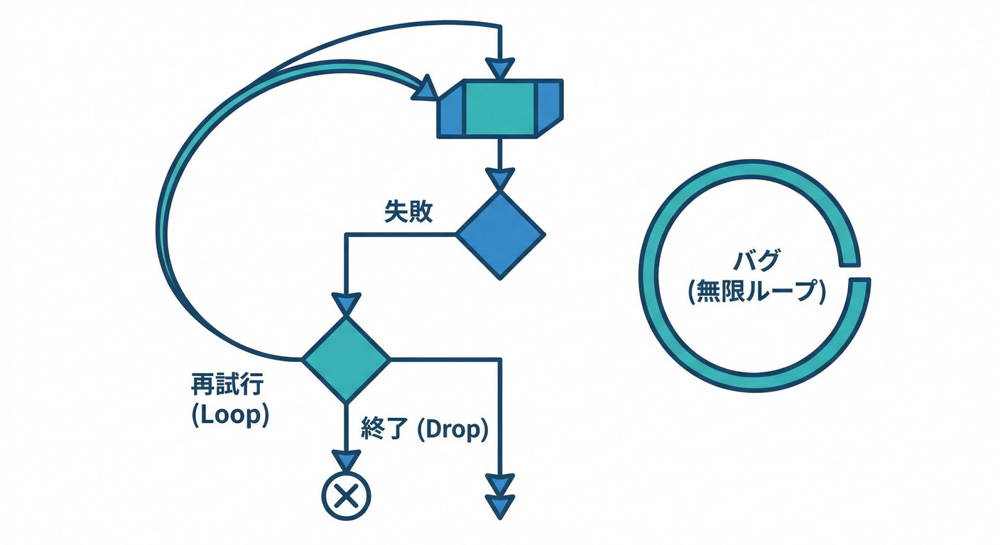
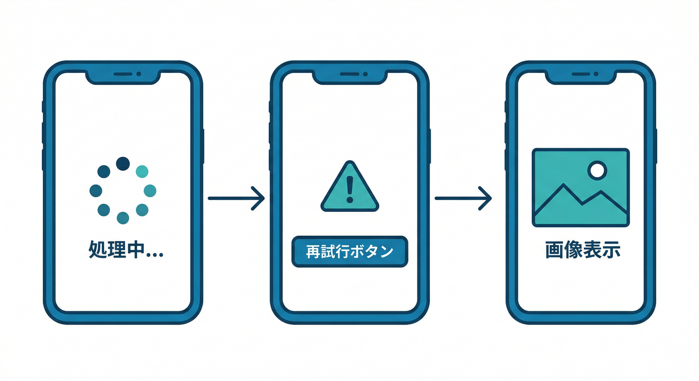

# 第12章：運用の基本（ログ・失敗・リトライ）🪵🧯

この章はね、ひとことで言うと👇
**「拡張がコケた時に、パニックにならずに“見る→直す→再発防止”できるようになる」** 章だよ😎✨

---

## 0) この章でできるようになること 🎯

* ✅ 拡張が作った Functions のログを **3つの方法** で見られる
* ✅ エラーの“よくある型”を見分けて、**直し方の方向性** を決められる
* ✅ 「リトライが効く失敗 / 効かない失敗」を区別して、**沼らない**
* ✅ 失敗時にユーザーへ出す表示（UX）を決められる🙂

---

## 1) まずは前提の「構造」を1枚で理解 🧩🧠



Extensions を入れると、だいたい裏側でこうなる👇

* **拡張インスタンス**（設定のかたまり）
* → **Cloud Functions（トリガー処理）** が作られる
* → ログは **Cloud Logging** に流れる
* → ものによっては **Cloud Tasks** で長い処理を回す（インストール/更新/再設定の裏仕事など）([Firebase][1])

「どこを見る？」は、ほぼこの3点で決まるよ🧭✨

---

## 2) ログを見る場所は3つ（これが“運用の地図”）🗺️🪵

## A. Firebase Consoleで「拡張が作った Functions」だけに絞る 🧠🔎



拡張のログを見る時は、**Functions のダッシュボードの Logs タブ**で、上のフィルタから「その拡張が作った関数」を選んで絞り込めるよ。([Firebase][1])

さらに、インストール済み拡張は Console 上で **health / usage / logs を監視**できる（＝“状態を見る導線”が最初からある）って覚えておくと強い🛠️✨([Firebase][1])

---

## B. Cloud Logging（Logs Explorer）で「ERROR だけ拾う」🧯🔥

ログが多いときは **Cloud Logging 側でエラー中心に絞る**のが最短だよ。

さらに 2nd gen（Cloud Runベース）だと **同じインスタンスが同時に複数処理**するのでログが混ざりがちなんだけど、最近の Firebase CLI だと **execution ID** をログに付けて追える（1回の実行を串刺しできる）仕組みがあるのが超便利🧵✨([Firebase][2])

---

## C. CLIで「特定関数だけ」ログを見る（運用メモに貼るやつ）💻🧾

ログは Console だけじゃなく、CLI でも見られるよ。([Firebase][2])
「この関数だけ見たい」が多いので、これを“お守りコマンド”にしよう🧿

```bash
## 全ログ（まずは雰囲気確認）
firebase functions:log

## 特定の関数だけ
firebase functions:log --only <FUNCTION_NAME>

## ヘルプ（オプション多いので、困ったら見る）
firebase help functions:log
```

> ちなみにログ（Cloud Logging）は無料枠を超えると課金対象になりうるので、**大量に吐く運用は避ける**のが吉だよ💸🧯([Firebase][2])

---

## 3) 「失敗の型」ベスト5（初心者がハマる順）🧨➡️🛠️



ここからが本題😆
ログを見たら、まずエラーを “型” に当てはめると解決が速いよ🏎️💨



## ① 権限（Permission denied / 403）🔐

* 症状：ログに permission / denied / not authorized っぽい単語
* 対応の方向性：

  * 拡張が必要とする権限（IAM）や API が足りないことが多い
  * 第9章で見た「extension.yaml の要求権限」もここで効く💪

## ② パラメータ間違い（パス、サイズ、出力先など）🎛️

* 症状：入力パスに一致しない、出力先が想定と違う、形式が合わない
* 対応：拡張インスタンスの **設定（パラメータ）を見直して再設定**

## ③ 入力データ問題（画像じゃない、デカすぎる、壊れてる）📦

* 症状：デコード失敗、unsupported、invalid など
* 対応：

  * 受け付ける contentType / サイズ上限を決める
  * UI で弾く（ユーザーに優しい🙂）

## ④ 外部サービス失敗（タイムアウト、ネットワーク、レート制限）🌐⏳

* 症状：timeout / deadline / rate limit
* 対応：これは **リトライが効く可能性が高い型**（後述）

## ⑤ “長い裏処理”が詰まる（Cloud Tasks）📮🧱

拡張によっては Cloud Tasks を使って、インストール/更新/再設定の裏処理を回すことがあるよ。([Firebase][1])
もしキューを手動で止めたり触るときは注意⚠️
**キューを長く pause すると、再開時に認証期限切れ（1時間）で失敗する可能性**があるって明記されてる。([Firebase][1])
（「止めたけど戻らない…😇」の原因になりやすい）

---

## 4) リトライの考え方（ここが一番沼りやすい）🌀🧠



## まず結論：リトライは“万能薬”じゃない💊❌

イベント駆動の関数は **at-least-once（最低1回は実行される）** の性質があるよ。([Firebase][3])
ただし **デフォルトでは失敗しても再実行されずイベントが捨てられる**、リトライを有効にした場合は **成功するか、リトライ窓が切れるまで再試行**する。([Firebase][3])

しかも注意点が強烈で👇
リトライを付けると、**バグや恒久的エラーだと再試行ループ**になる危険がある（複数日続くことも）って警告されてる。([Firebase][3])

2nd gen のリトライ窓は **24時間**、1st gen は **7日**。([Firebase][3])

---

## Extensions目線での“実戦ルール”🧩⚔️

拡張は中身の関数コードを自分でいじれないことが多いので、こう考えると安全👍

* ✅ **一時的な外部要因（ネットワーク、タイムアウト）**
  → リトライで救われる可能性あり
* ❌ **設定ミス・権限不足・入力が壊れてる**
  → リトライしても永遠に失敗する（＝先に原因を直す）

つまり「直すべき失敗」を先に潰すのが勝ち筋😆✨

---

## 5) “復旧手順テンプレ”を作ろう（これが運用力）🧾🛠️


ここ、教材としていちばん大事💥
困った時に脳みそが止まるから、**テンプレ化**しておくのが強いよ🧠➡️紙📝

## 失敗したらこの順番（3ステップ）🧯➡️🔍➡️🔧

1. **止血**：影響範囲を確認（特定ユーザーだけ？全員？）
2. **原因特定**：ログで ERROR を見つける

   * Console の Logs フィルタで拡張関数に絞る([Firebase][1])
   * 2nd gen なら execution ID で「1回の実行」を追う([Firebase][2])
3. **復旧**：型に応じてやることを決める

   * パラメータ修正
   * 権限/IAM/API 有効化
   * 入力の弾き（UI/ルール/制限）
   * 再実行（例：再アップロード、ファイル移動、対象データ更新など）

---

## 6) 失敗時のUI（ユーザーに見せるのは“安心感”🙂🫶）



拡張の処理って、ユーザーから見ると「なんか裏で勝手に起きてる」ので、失敗時に無言だと不安MAXになる😇

おすすめの“最低ライン”はこれ👇

* 🕒 処理中：

  * 「サムネ生成中…」表示（スケルトンでもOK）
* ⚠️ 失敗：

  * 代替表示（元画像だけ表示/プレースホルダ）
  * 「もう一度試す」ボタン（再アップロード or 再実行導線）
* ✅ 成功：

  * サムネ優先で表示（軽い順に出す）

“ユーザーの世界線”に合わせてあげるのが運用の優しさだよ🙂✨

---

## 7) AIをガチで運用に混ぜる（2026の勝ちパターン）🤖⚡


## A. Gemini in Firebaseで「ログの翻訳＋対策案」🧠➡️📘

Gemini in Firebase は、Firebase Console内で **エラーを解読して対策を提案**したり、**ログを分析して解決手順を提案**できるのが明記されてるよ。([Firebase][4])
（しかも 2026-01-23 更新で新しめ🆕）([Firebase][4])

おすすめプロンプト例👇

* 「このエラーを初心者向けに説明して。原因の可能性を3つ、確認手順を順番に」
* 「このログから、設定ミス/権限/入力不正/外部要因のどれっぽい？」

---

## B. Gemini CLI + Firebase拡張で「運用メモを自動生成」🛸💻🧾

Firebase 拡張を入れると、Gemini CLI が **Firebase プロジェクトに対してツールを使って作業**できたり、ドキュメント参照が強化されるよ。([Firebase][5])
インストール/更新コマンドも公式で案内されてる（しかも 2026-02-05 更新）🆕([Firebase][5])

```bash
## Firebase extension を追加（シェルで実行）
gemini extensions install https://github.com/gemini-cli-extensions/firebase/

## 更新
gemini extensions update firebase
```

そして、例として `/firebase:init` や `/firebase:deploy` みたいな“定型プロンプト”も用意されてる。([Firebase][5])
運用の観点だと👇が強い✨

* 「この拡張のパラメータ表を作って（危険そうな値も）」
* 「失敗時の復旧手順テンプレを作って（Console/Logs/Tasksの順で）」

Google のAI周り、2026は“運用の相棒”として普通に戦力だよ😎

---

## 8) 手を動かすパート 🖐️🔥（わざと失敗させて練習）

## やること（15分）⏱️

1. わざと失敗を作る

   * 例：Resize Images なら「画像じゃないファイル」を対象パスに置く
2. Console でログを見つける

   * Functions ダッシュボード Logs → 拡張関数にフィルタ([Firebase][1])
3. CLI でも同じログを確認

   * `firebase functions:log --only <FUNCTION_NAME>`([Firebase][2])
4. “復旧手順テンプレ”に1行追記

   * 「この型のエラーは、まず○○を見る」

---

## 9) ミニ課題 🎯

**「失敗時のユーザー表示」**を文章で決めてね🙂
（例）

* サムネ生成失敗→元画像だけ表示
* 「再試行」ボタン→再アップロード
* 裏で復旧中は「処理中」表示

---

## 10) チェック ✅（合格ライン）

* ✅ 拡張のログを **Console で絞って見つけられる**([Firebase][1])
* ✅ 同じログを **CLI でも拾える**([Firebase][2])
* ✅ 失敗を「権限 / パラメータ / 入力 / 外部要因 / Tasks」のどれかに分類できる
* ✅ リトライは“万能じゃない”と説明できる（ループ注意も言える）([Firebase][3])

---

次の第13章（料金の感覚💸🧠）に行くと、
「ログ・リトライ・Tasks が **どこでお金に繋がるか**」がスッと腹落ちするよ😆✨

[1]: https://firebase.google.com/docs/extensions/manage-installed-extensions "Manage installed Firebase Extensions"
[2]: https://firebase.google.com/docs/functions/writing-and-viewing-logs "Write and view logs  |  Cloud Functions for Firebase"
[3]: https://firebase.google.com/docs/functions/retries "Retry asynchronous functions  |  Cloud Functions for Firebase"
[4]: https://firebase.google.com/docs/ai-assistance/gemini-in-firebase "Gemini in Firebase"
[5]: https://firebase.google.com/docs/ai-assistance/gcli-extension "Firebase extension for the Gemini CLI  |  Develop with AI assistance"
