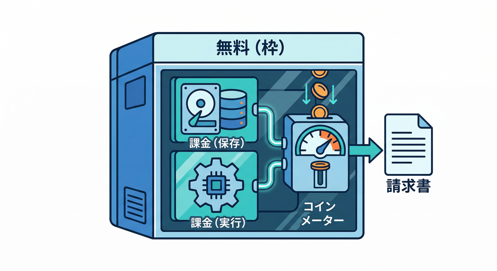
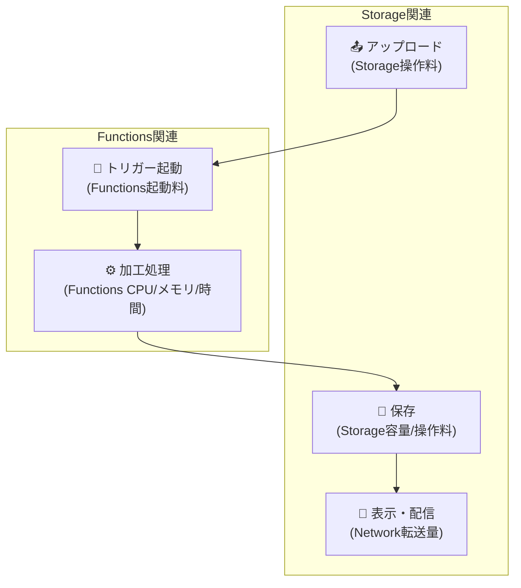
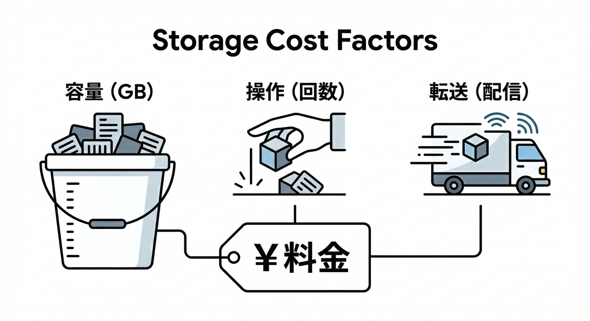
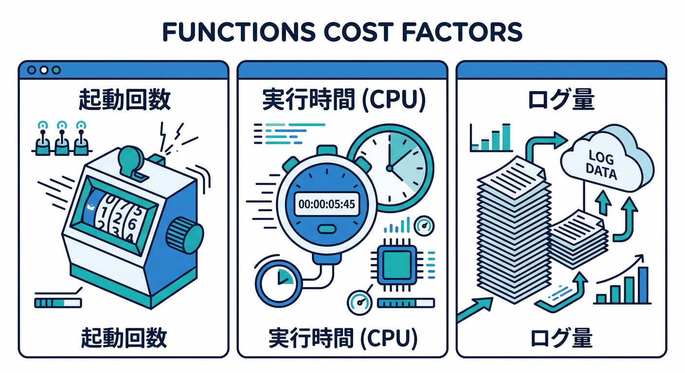
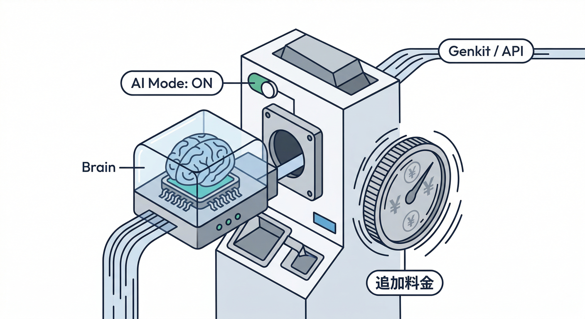
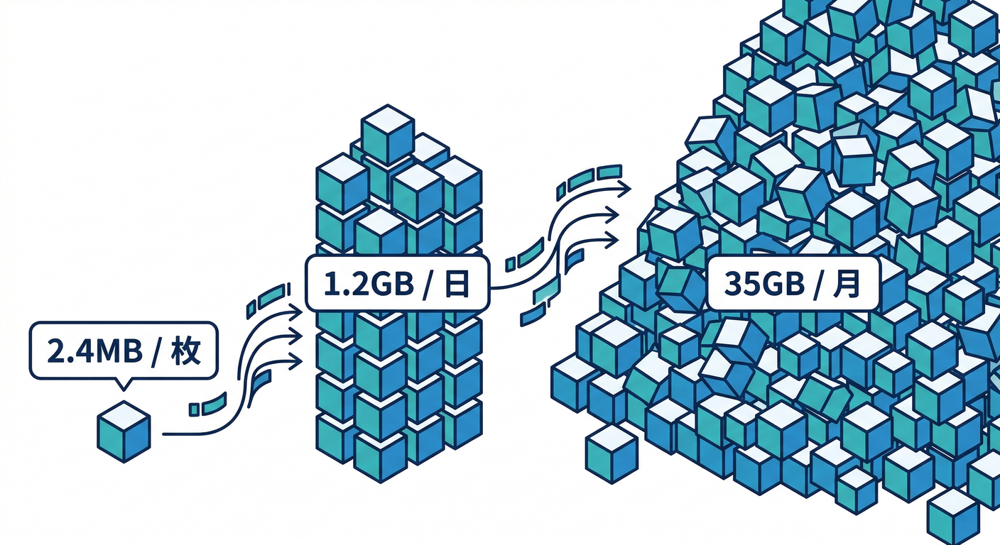

# 第13章：料金の感覚（どこで課金が起きる？）💸🧠

この章のゴールはこれ👇
**「Extensionsは“入れるだけ”だけど、どこでお金が発生するかを説明できる」** ようになること！😎✨
特に **Resize Images** を例にして、**“課金ポイントの地図”** を頭に入れちゃうよ〜🗺️🧩

---

## まず結論：Extensions自体が課金されるんじゃない🙅‍♂️➡️ “裏で動くサービス”が課金される💸



* Extensionsはたいてい **Blaze（従量課金）必須**。でも **「入れた瞬間に料金が発生」ではなく**、裏で使うサービス（Functions/Storageなど）の利用量で増えるイメージだよ📈 ([Firebase][1])
* つまり… **“便利さ”＝“自動で動く処理”＝“どこかのメーターが回る”** ってこと😆🧠

---

## Resize Images の “課金ポイント地図” 🧩📷➡️🖼️

Resize Images は、ざっくり言うと **「Storageに画像が来たら、Functionsで加工して、またStorageに保存する」** って流れ。だから課金ポイントも素直👇 ([Firebase][2])



## ① Cloud Storage（保存＋操作＋配信）🪣📦🌍



**増えるとコストが増えるもの**

* 保存容量：元画像＋サムネ（複数サイズだと増えやすい）📦
* 操作回数：アップロード/ダウンロード/メタデータ操作など🧾
* ネットワーク転送（配信）：表示回数が増えるほど増えがち🌍

**節約のコツ**

* サムネサイズを増やしすぎない（必要最小限でOK）🧠
* “全部の画像を常にフルサイズで配信”を避ける（まず軽いサムネ→必要なら元画像）⚡

---

## ② Cloud Functions（画像処理の実行）⚙️🔥



**増えるとコストが増えるもの**

* 実行回数（= 画像が来るたびに起動）🔁
* 実行時間・CPU/メモリ（重い処理ほど）⏱️
* ログ（大量に吐くと地味に増える）🪵

**節約のコツ**

* でかすぎる画像を最初から弾く（最大サイズを決める）🧯
* エラー時にログを出しすぎない（必要な情報だけ）🪵✂️

---

## ③ Eventarc（イベント配線）📣🧷

Resize Images の Billing欄でも明記されてるポイントで、**Eventarc の料金が発生することがある**よ📌 ([Firebase][2])
（「イベントを配る仕組み」の利用料、みたいな感覚）

---

## ④ “無駄な起動”がいちばん怖い😱（重要！）


Resize Images には注意書きがあって👇
**「バケット内の全変更を監視する設定だと、不要な関数呼び出しが増える」** ことがあるのね💥
なので、できれば **専用バケット** や **対象パスを絞る設計** が超効く！🧠🛡️ ([Firebase][2])

---

## ⑤ （オプション）AI系機能をONにすると…🤖✨



Resize Images には **Genkit を使った AI画像モデレーション**（内容チェック）もある。ONにすると便利だけど、**処理が増える＝利用量が増えやすい**のは感覚として持っておこう🧠⚖️ ([Firebase][2])
（課金の詳細は「使っているAI側の料金体系」に従うので、ONにする前に確認するのが安全👍）

---

## “無料枠”の感覚：Blazeでも「無料枠ゼロ」じゃない🙆‍♂️✨

Firebaseの料金ページを見ると、**Cloud Storage や Cloud Functions には no-cost（無料枠）がある**よ📌
しかも **日次でリセット**されるタイプもある（= 小さく始めるなら意外と無料枠に収まることもある）🌱 ([Firebase][2])

---

## 手を動かす🖐️：30分でできる “ざっくり見積もり” 🧾📏

## ステップ1：まず “前提” を数字で置く（ここが9割）🎛️

下の表を埋めるだけでOK！🙆‍♂️

| 項目           |     例 | メモ              |
| ------------ | ----: | --------------- |
| 1日の画像アップロード数 |   500 | 多い日で考えると安全📈    |
| 元画像の平均サイズ    |   2MB | スマホ写真は大きくなりがち📷 |
| サムネの数        |    2個 | 例：200px/600px   |
| サムネ1個の平均サイズ  | 0.2MB | 圧縮できると良い✨       |
| 画像の保存期間      |   30日 | 履歴を残すほど増える📦    |
| 1画像あたりの表示回数  |   10回 | 配信（転送）が増えやすい👀  |

---

## ステップ2：ざっくり容量を出す（例）📦



例の数字だと👇

* 1枚あたり：元2MB + サムネ(0.2MB×2)= **2.4MB**
* 1日：2.4MB × 500 = **1200MB ≒ 1.17GB/日**
* 30日保存：1.17GB × 30 = **約35.16GB** 📦

ここまで出せると、もう勝ち😆🔥
（「あ、無料枠5GBとかなら絶対超えるな」みたいに肌感が掴める）

---

## ステップ3：コスト事故を防ぐ “安全装置” を入れる🧯🔔


Firebaseの料金プラン側でも、**予算アラート（Budget alerts）** が推奨されてるよ📣
ただし **アラートは“通知”であって、料金を自動停止はしない**点が大事⚠️ ([Firebase][3])

✅ やること（超おすすめ）

* 予算アラートを小さめに設定（例：最初は低め）🔔
* 画像の最大サイズ制限（でかい画像は弾く）🧯
* 対象パス/専用バケットで “無駄な起動” を抑える🪣✂️ ([Firebase][2])

---

## さらに安全に：Emulatorで試すときの注意🧪⚠️

Extensions Emulator は「本番前に試して課金や事故を減らす」ための道具なんだけど…
**一部の拡張はエミュレートされないAPIを叩いて、実際に課金が発生する可能性がある**って公式にも注意があるよ😱 ([Firebase][4])
なので、Emulatorでも **“何が本当に呼ばれるか”** は意識しよ🧠

---

## AIも使って“見積もり＆事故予防”を速くする🤖⚡

## Gemini CLI：コストの洗い出しをAIに手伝わせる🧾🤝

Gemini CLI は、使うエディションによって利用枠があったり、**APIキーで従量課金（pay-as-you-go）** にもできるよ📌 ([Google Cloud Documentation][5])
だから「AIもタダじゃない」って意味でも、この章と相性いい😆💸

**プロンプト例（そのまま投げてOK）🗣️**

```text
Resize Images 拡張で課金が発生しうるポイントを
Storage / Functions / Eventarc / ログ / ネットワーク の観点で箇条書きにして。
初心者向けに、事故りやすい順で。
```

## Antigravity：AIエージェントに “チェックリスト作成係” をやらせる🛸✅

Antigravity は “エージェント前提の開発環境” として紹介されてるので、
「見積もりシート」や「運用チェックリスト」を作る係に向いてるよ🧩✨ ([Google Codelabs][6])

## Gemini in Firebase：エラーやクラッシュの説明をAIに噛み砕かせる🧠🪵

たとえば Crashlytics で Gemini を有効化すると、原因や修正案の説明を出してくれる方向があるよ（ログ読解の助けになる）📌 ([Firebase][7])

---

## ミニ課題🎯：無料枠を超えそうなポイントを1つ挙げよう🕵️‍♂️

次から1つ選んで、「なぜ超えそう？」を一言で書けたらOK🙆‍♂️

* A：サムネを5種類作ってた（保存も操作も増える）🖼️📈
* B：対象パスを絞らず全バケット監視（無駄起動が増える）😱 ([Firebase][2])
* C：画像がデカすぎる（処理が重くなる）📷💥
* D：表示回数が増えて配信（転送）が増える👀🌍

---

## チェック✅（言えたら勝ち😎）

* 「Extensionsはタダっぽく見えるけど、**裏のサービス利用で課金**される」って説明できる ([Firebase][1])
* Resize Images で **Storage / Functions / Eventarc** がメインの課金ポイントだと分かる ([Firebase][2])
* **無駄な起動（監視範囲が広い）** がコスト事故になりやすいと分かる ([Firebase][2])
* 予算アラートは便利だけど **自動停止ではない**と理解してる ([Firebase][3])

---

## おまけ：クラウド Functions 系のランタイム目安（2026）🧩⚙️

「拡張の裏側＝Functions」なので、バージョン感も軽く把握しとくと安心👍

* Cloud Functions for Firebase（Firebase側）

  * Node.js **22 / 20**（18は非推奨）([Firebase][8])
  * Python **3.10〜3.13**（3.13がデフォルト）([Firebase][9])
* Cloud Run functions（GCP側・より多言語）

  * **.NET 8** なども選べる

---

次の第14章が「2026の注意点（デフォルトバケットと課金要件）」だったよね📅⚠️
第13章で“料金の地図”ができたから、次は **「期限系の地雷を踏まない」** を固めると無敵になるよ😆🛡️

[1]: https://firebase.google.com/docs/extensions/install-extensions "Install a Firebase Extension  |  Firebase Extensions"
[2]: https://firebase.google.com/docs/storage/faqs-storage-changes-announced-sept-2024 "FAQs about changes to Cloud Storage for Firebase pricing and default buckets"
[3]: https://firebase.google.com/docs/projects/billing/firebase-pricing-plans "Firebase pricing plans  |  Firebase Documentation"
[4]: https://firebase.google.com/docs/emulator-suite/use_extensions "Use the Extensions Emulator to evaluate extensions  |  Firebase Local Emulator Suite"
[5]: https://docs.cloud.google.com/gemini/docs/codeassist/gemini-cli?utm_source=chatgpt.com "Gemini CLI | Gemini for Google Cloud"
[6]: https://codelabs.developers.google.com/getting-started-google-antigravity?utm_source=chatgpt.com "Getting Started with Google Antigravity"
[7]: https://firebase.google.com/docs/ai-assistance/gemini-in-firebase?utm_source=chatgpt.com "Gemini in Firebase - Google"
[8]: https://firebase.google.com/docs/functions/manage-functions?hl=ja "関数を管理する  |  Cloud Functions for Firebase"
[9]: https://firebase.google.com/docs/functions/get-started "Get started: write, test, and deploy your first functions  |  Cloud Functions for Firebase"
