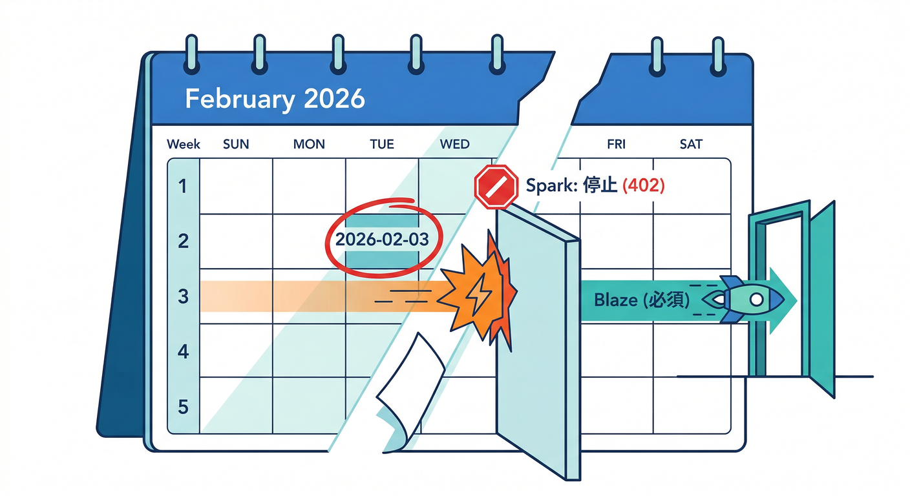
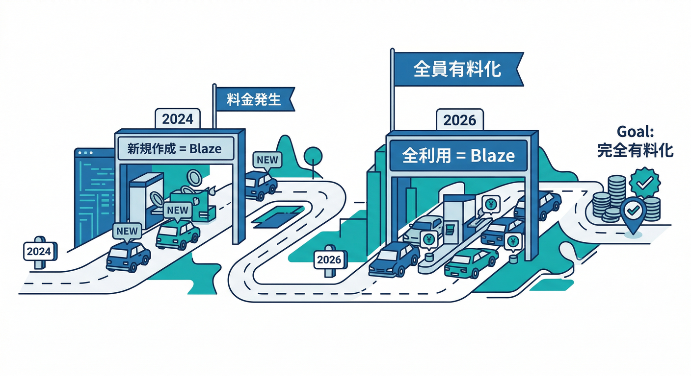
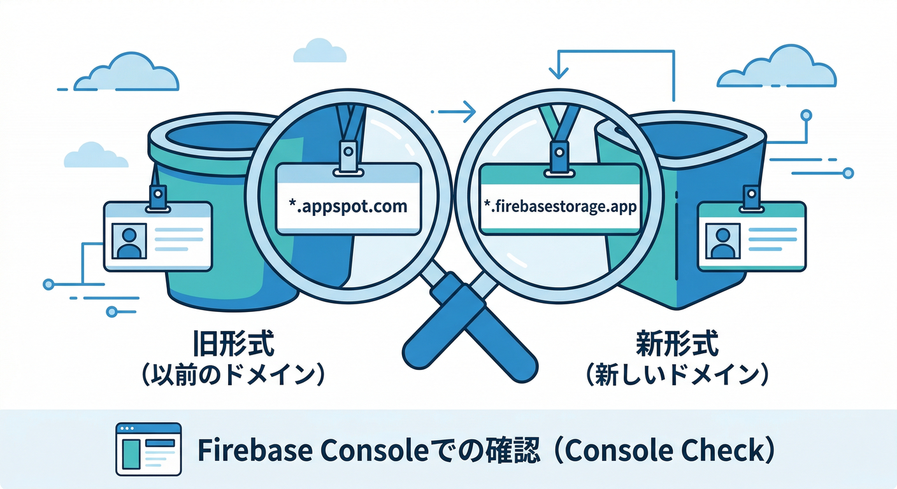
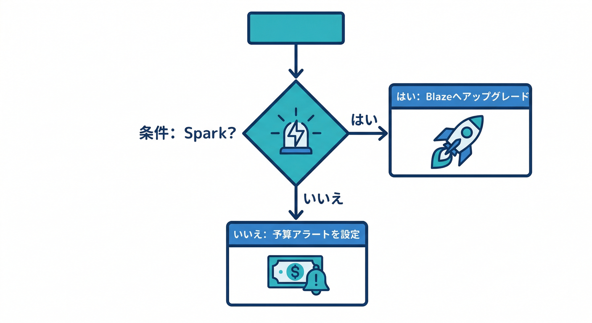
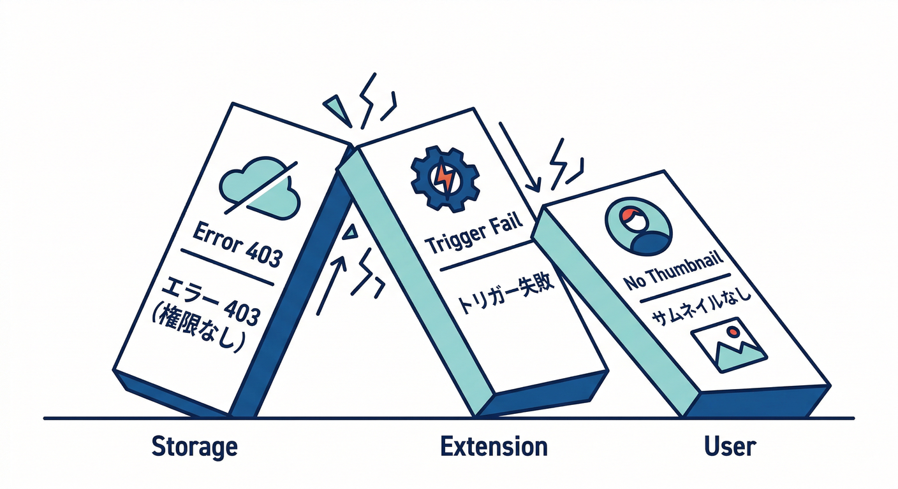
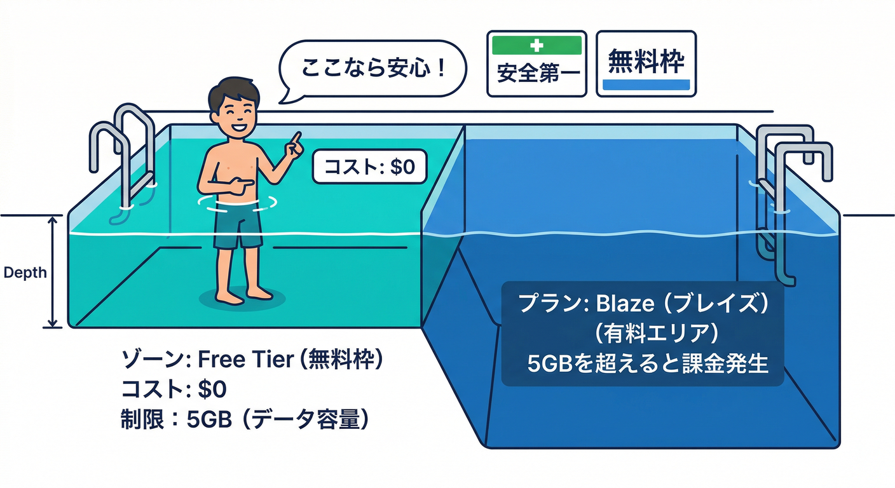

# 第14章：2026の注意点（デフォルトバケットと課金要件）📅⚠️🧨

この章は一言でいうと――**「期限系の地雷を踏まない（もう踏んでたら即回復する）」**回です😇💥
Extensions は裏側で Cloud Storage や Functions を使うことが多いので、**Storage 側の“条件変更”は Extensions の動作停止に直結**します🧩➡️🧯

---

## まず結論（超重要）✅



* **2026年2月3日以降**、Cloud Storage for Firebase を使い続けるには **Blaze（従量課金）必須**です。([Firebase][1])
* とくに **`*.appspot.com` のデフォルトバケット**を持っていて **Spark（無料）**のままだと、**Console で見えなくなったり、API が 402/403 を返したり**します。([Firebase][1])
* ただし救いもあって、`*.appspot.com` バケットは **Blaze に上げても“既存の無償枠水準”は維持**されます（上限超えだけ課金）。([Firebase][1])

> 今日（2026-02-20）時点だと、期限（2026-02-03）はもう過ぎてます📅💦
> もし Spark のまま Storage を触っていて「急に動かない😱」なら、これが原因の可能性が高いです。([Firebase][1])

---

## 何が変わったの？ざっくり年表🗓️✨



* **2024-10-30**：新しくデフォルトバケットを作るには **Blaze 必須**。新しい形式の名前は `PROJECT_ID.firebasestorage.app`。([Firebase][1])
* **2026-02-03**：Storage を使い続けるには **Blaze 必須**（デフォルトバケット＋他の Storage リソースも含む）。([Firebase][1])
* **Spark + `*.appspot.com`** だと、Console アクセス喪失や 402/403 が発生しうる。([Firebase][1])

---

## 手を動かす①：自分の“バケット名”を確認しよう🪣🔍



やることはこれだけ👇（迷子にならない版）

1. Firebase コンソール → **Storage** を開く
2. 上のほうに出てくるバケット名を見る

   * `PROJECT_ID.appspot.com` なら **旧形式（App Engine 系）**
   * `PROJECT_ID.firebasestorage.app` なら **新形式（GCS 標準寄り）** ([Firebase][1])

👍ポイント：**Blaze に上げてもバケット名は変わりません**（勝手に移行されない）ので安心してね。([Firebase][1])

---

## 手を動かす②：“料金プラン”を確認しよう💳👀

コンソールの **Usage and billing / プラン表示** で、

* Spark（無料）か
* Blaze（従量課金）か
  を確認します🧾

ここが分かれ道⚖️

---

## 1枚で判断！いま何をすべき？🧠🧩



| あなたの状況                          | 起きやすいこと                                         | いますぐやること                               |
| ------------------------------- | ----------------------------------------------- | -------------------------------------- |
| Spark ＋ `*.appspot.com`         | 2026-02-03以降、Consoleアクセス不可・APIが402/403などで止まる可能性 | **Blazeへアップグレード（回復策）** ([Firebase][1]) |
| Spark ＋ `*.firebasestorage.app` | 2026-02-03以降、Storage継続利用にBlaze必須                | **Blazeへアップグレード** ([Firebase][1])      |
| Blaze（どっちのバケットでも）               | 継続利用OK                                          | **予算アラート設定**＋運用チェック ([Firebase][1])    |

---

## Extensions視点：ここが“止まりポイント”😱🧩➡️🧯



たとえば **Resize Images** みたいな拡張は、ざっくりこう動きます👇
「画像アップロード（Storage）📤 → Functions が反応⚙️ → サムネ生成🖼️」

つまり…
Storage が読めない／書けない状態になると

* **アップロード自体が失敗**
* **拡張のトリガーが起動しない / 起動しても処理できない**
* 結果、サムネが作られず UI も崩れる😵‍💫

こういう “連鎖停止” が起きます。なので第14章は Extensions 学習の中でも超重要💥

---

## 対策：Blazeへ上げるときの「怖さ」を消す🧯✨

## 1) アップグレードの要点（ここだけ押さえればOK）🧩

* Blaze にするには **Cloud Billing アカウント連携**が必要
* アップグレード操作には **Owner 権限**が必要 ([Firebase][1])
* そして **予算アラート（Budget alerts）を強く推奨**（コンソールの導線でも促されます）([Firebase][1])

## 2) `*.appspot.com` の“無償枠水準”を理解する🆓📦



`PROJECT_ID.appspot.com` の場合、Blaze に上げても次の水準は維持されます（超えたら課金）👇

* 保存 5GB
* ダウンロード 1GB/日
* アップロード 20,000回/日
* ダウンロード 50,000回/日 ([Firebase][1])

「Blaze＝即課金地獄」じゃなくて、**“安全装置（アラート）を付けた上で、無料枠も活かす”**が現実的ムーブです😎🛡️

---

## よくある落とし穴（踏む人が多い）🕳️😵

* **「アップグレードしたらバケット名変わる？」** → 変わりません🙆‍♂️([Firebase][1])
* **「コード修正いる？」** → 基本いりません🙆‍♀️（既存 `*.appspot.com` はそのまま）([Firebase][1])
* **「消して作り直せば戻る？」** → `*.appspot.com` を削除すると、同形式で作り直せなくなる例外があるので慎重に⚠️([Firebase][1])

---

## AIで“確認と復旧”を加速する🤖⚡（Gemini活用）


## A) コンソール内でログや状況を噛み砕かせる（Gemini in Firebase）🧠✨

Google の **Gemini in Firebase** は、Firebase コンソール上で開発・デバッグを助ける AI アシスタントです。([Firebase][2])

おすすめの聞き方👇

* 「Storage が 402/403 になる原因を、いまのプロジェクト状況から推測してチェックリスト化して」
* 「Resize Images 拡張が動かない。Storage 側の前提条件（プラン/バケット）で怪しい点は？」

導入・使い方の入口：コンソールで Gemini を有効化して使えるガイドがあります。([Firebase][3])

## B) ターミナルでチェックリストを一瞬で作る（Gemini CLI）⌨️🧩

Gemini CLI は Cloud Shell だと追加設定なしで使える、と公式に案内されています。([Google Cloud Documentation][4])

Gemini CLI に投げるプロンプト例👇（コピペ用）

```text
Cloud Storage for Firebase の変更（2024-10-30 / 2026-02-03）を前提に、
「Extensions（Resize Images等）が止まる原因」チェックリストを作って。
特に、appspot.com / firebasestorage.app の差と、Spark/Blaze 判定を入れて。
最後に、最小手順（復旧手順）も。
```

---

## ミニ課題🎯📝（未来の自分を救うやつ）

次の3点を、メモに“1枚”でまとめてください👇

1. 自分のデフォルトバケット名（`appspot.com` or `firebasestorage.app`）
2. 料金プラン（Spark / Blaze）
3. 「Extensions が止まった時に最初に確認する順番」チェックリスト（5行でOK）

---

## チェック✅（ここまで到達したら勝ち）🏁✨

* [ ] **2026-02-03以降は Blaze が必須**だと説明できる ([Firebase][1])
* [ ] 自分の **バケット形式**（`appspot.com` / `firebasestorage.app`）を言える ([Firebase][1])
* [ ] Spark のままだと何が起きるか（特に `appspot.com` の 402/403）を言える ([Firebase][1])
* [ ] Blaze 化のとき **予算アラート**が重要だと分かっている ([Firebase][1])
* [ ] Gemini（コンソール/CLI）で“切り分け”を早くできるイメージがある ([Firebase][2])

---

次の章（第15章：セキュリティ目線🛡️🔐）では、この「Blaze必須」の現実を踏まえて、**最小権限・Secrets・権限要求の見抜き方**を Extensions の中身からやっていきます😎🔥

[1]: https://firebase.google.com/docs/storage/faqs-storage-changes-announced-sept-2024 "FAQs about changes to Cloud Storage for Firebase pricing and default buckets"
[2]: https://firebase.google.com/docs/ai-assistance/gemini-in-firebase?utm_source=chatgpt.com "Gemini in Firebase - Google"
[3]: https://firebase.google.com/docs/ai-assistance/gemini-in-firebase/try-gemini?utm_source=chatgpt.com "Try Gemini in the Firebase console"
[4]: https://docs.cloud.google.com/gemini/docs/codeassist/gemini-cli?utm_source=chatgpt.com "Gemini CLI | Gemini for Google Cloud"
