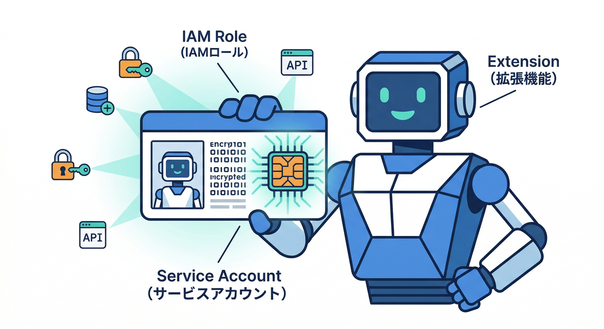
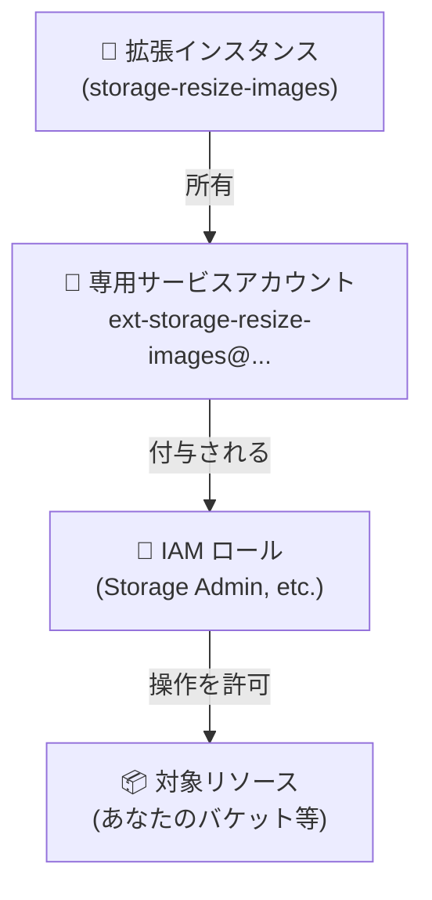
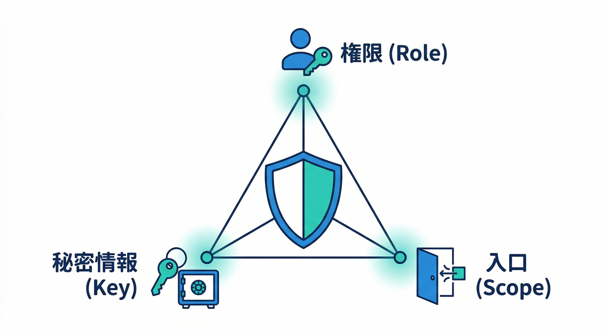
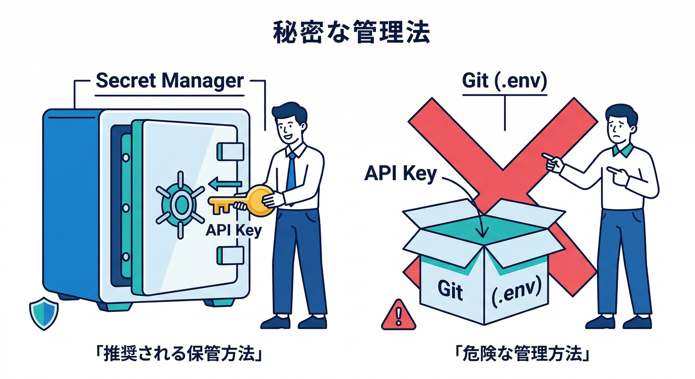

# 第15章：セキュリティ目線（権限・秘密情報・最小権限）🛡️🔐

この章のゴールはこれ👇✨
**「Extensions は便利。でも “何が許可されるのか” を読める人になる」**
（＝入れる前に事故を防げるし、入れた後も安心して運用できる😎）

---

## まず超重要：拡張は “専用のサービスアカウント” で動く🤖🔑



Firebase Extensions を入れると、**拡張インスタンスごとに専用のサービスアカウントが作られて**、そのアカウントに必要な **IAM ロール（権限の束）** が割り当てられます。([Firebase][1])
しかも、そのロールは「拡張が動くために必要なもの」なので、**勝手に削ったり足したりいじらない**のが原則（いじると動かなくなる可能性大）。([Firebase][1])

> ✅ つまり：**拡張のセキュリティ審査＝「このサービスアカウントに何を許可するか？」を読むこと**だよ🕵️‍♂️✨ ([Firebase][1])



---

## 1) セキュリティで見るべきポイントは3つだけ🧠🧩



## A. 権限（IAM ロール）🧾🔐

* 何のロールが付く？（例：Firestore 書き込み、Storage 管理、メール送信…）
* “広すぎる権限” になってない？（用途の割に強すぎない？）

## B. 秘密情報（Secrets / APIキー / パスワード）🗝️🧨

* SMTP パスワード、外部APIキー、Webhook URL などが出てくる拡張は要注意
* **Secret Manager を使う設計**か？（安全寄りだけど有料要素になりやすい）([Firebase][2])

## C. 入力の入口（トリガー範囲）🚪🧯

* Firestore のどのコレクションがトリガー？
* Storage のどのパスのアップロードがトリガー？
* “どこでも反応する” 設定は事故りやすい（DoS/コスト爆発にも直結）💸😇

---

## 2) 手順：インストール前の“秒速セキュリティレビュー”✅⚡


## ステップ1：拡張の詳細ページで「権限」を読む👀

Firebase Console の Extensions ダッシュボード（Installed Extensions の管理画面）や README で、**どんなアクセスが付与されるか**を確認できるよ。([Firebase][1])

見るときのコツ👇

* 「この拡張がやること」→「必要な権限」になってる？
* “書き込み” が必要な拡張なのに “admin” ロールが付いてたら理由を探す🔍

## ステップ2：秘密情報が出るか探す🕵️‍♀️🔎

パラメータ（設定項目）に、APIキーやパスワードっぽいものがあるなら **Secrets 扱い**が基本。
拡張（または拡張開発側）が `secret` 型のパラメータを使う場合、**Cloud Secret Manager を使う**設計になるよ。([Firebase][2])

> 💡注意：Secret Manager は有料サービス要素なので、コスト面も一緒にチェック🧾💸 ([Firebase][2])

## ステップ3：入口を狭める（パラメータ設計）🎛️🧯

例えば Storage トリガー系なら

* 入力パス：`/users/{uid}/uploads/` だけ
* 出力先：`/users/{uid}/thumbs/` だけ
  みたいに、**“反応する範囲” を狭くする**のが超効く💪✨
  （最小権限って、IAM だけじゃなく「対象範囲を狭くする」でも作れる！）

---

## 3) 手順：インストール後の“安全点検”🧰🔍


## ステップ1：サービスアカウントを確認する🤖📛

拡張ごとにサービスアカウントが作られる／確認できるよ。([Firebase][1])
フォーマット例：`ext-<instance-id>@<project-id>.iam.gserviceaccount.com` ([Firebase][1])

## ステップ2：更新してもID/サービスアカウントは変わらない前提で運用🔁🧠

拡張をアップデートしても、**インスタンスIDとサービスアカウントは基本そのまま**。([Firebase][3])
だから、運用メモには

* インスタンスID
* 付与ロール
* 使ってる Secrets
  をセットで残すと未来の自分が助かる📝✨

## ステップ3：アンインストール時の“消えるもの/残るもの”を理解🧹⚠️

アンインストールすると **その拡張用のサービスアカウントや拡張専用リソース（Functions など）は削除**される。([Firebase][1])
でも、拡張が作った成果物（例：生成された画像）や、共有リソース（例：既存バケット）は残ることがある。([Firebase][3])

> ✅ 「消したつもりでデータが残ってた」はありがち事故😇💥

---

## 4) “Secrets（秘密情報）”の鉄則5つ🗝️🧱



1. **Git に入れない**（`.env` も油断しない）🧨
2. 拡張が Secrets を扱うなら **Secret Manager かどうか**を確認([Firebase][2])
3. **最小人数だけが値を知る**（共有しない）🤫
4. “漏れた前提” で **ローテ（入れ替え）手順**を作る🔁
5. 外部サービス連携なら **キー権限も最小化**（読み取り専用キーがあるならそれ）🔐

---

## 5) ローカルで安全に観察する：Extensions Emulator🧪🧯

「この拡張、何をするの…？」を本番で試すの怖いよね。
Extensions Emulator なら、ローカル環境で拡張の Functions を動かして挙動を理解しやすい（課金や本番汚染も抑えやすい）💡([Firebase][4])

---

## 6) AI を“セキュリティ副操縦士”にする🛸🤖


## Antigravity：エージェントに「権限レビュー係」をやらせる📋✨

Antigravity はエージェント中心の開発環境として紹介されていて、調査・整理タスクと相性がいいよ。([Google Codelabs][5])

**やらせる仕事の例👇**

* 「この拡張が要求する IAM ロールを一覧化して、危険度コメント付けて」
* 「Secrets が必要なパラメータを抜き出して、保管先と運用案を作って」

## Gemini CLI：README を食わせて“監査メモ”を作る🧠📝

Gemini CLI はターミナルから使えるエージェントとして案内されてるので、README/設定を読み解く用途に使いやすい。([Google Cloud Documentation][6])

**プロンプト例（コピペ用）👇**

```text
このFirebase ExtensionのREADME（以下）を読んで、
1) 要求されるIAMロール一覧
2) Secretsっぽいパラメータ一覧
3) 想定される事故（権限過大/データ漏えい/コスト爆発）
4) 対策チェックリスト（インストール前/後）
を日本語で、超入門者向けに作って。
----
（README貼る）
```

## Gemini in Firebase：コンソール上での支援も使える🤝✨

Firebase コンソール側の AI 支援（Gemini in Firebase）は、設定や権限が必要な前提で案内されてるよ。([Firebase][7])
（ログや設定で詰まったときの“言語化”が速くなるやつ🧠⚡）

---

## ミニ課題🎯：あなたの“拡張セキュリティ審査シート”を1枚作ろう📝🛡️


どれか1つ拡張を選んで（画像/メール/AI系がわかりやすい）、下の表を埋めてみて👇

| 観点       | メモ             | リスク    | 対策                     |
| -------- | -------------- | ------ | ---------------------- |
| 要求ロール    | 例：Firestore書込系 | データ改ざん | 対象コレクションを狭める           |
| Secrets  | 例：SMTPパスワード    | 漏えい    | Secret Manager / ローテ手順 |
| 入口（トリガー） | 例：/uploads配下   | コスト爆発  | パス限定 + ルールで縛る          |
| アンインストール | 何が残る？          | データ残存  | 消す手順も書く                |

---

## チェック✅（今日ここまで分かれば勝ち😆）

* [ ] 拡張は **インスタンスごとのサービスアカウント**で動くと言える([Firebase][1])
* [ ] 付与ロールは基本いじらず、**入れる前に読む**のが正攻法と言える([Firebase][1])
* [ ] Secrets が出たら **保管場所とローテ手順**まで考える癖がついた([Firebase][2])
* [ ] アンインストールしても **成果物や共有リソースが残る場合がある**と知ってる([Firebase][3])

---

必要なら、こみやんまが「今入れようとしてる拡張名（extensions.dev のURLでもOK）」を投げてくれたら、**その拡張を題材に“審査シート”を完成版まで一緒に作る**よ🧩🔥

[1]: https://firebase.google.com/docs/extensions/permissions-granted-to-extension "Permissions granted to a Firebase Extension  |  Firebase Extensions"
[2]: https://firebase.google.com/docs/extensions/publishers/parameters "Set up and use parameters in your extension  |  Firebase Extensions"
[3]: https://firebase.google.com/docs/extensions/manage-installed-extensions "Manage installed Firebase Extensions"
[4]: https://firebase.google.com/docs/emulator-suite/use_extensions?utm_source=chatgpt.com "Use the Extensions Emulator to evaluate extensions - Firebase"
[5]: https://codelabs.developers.google.com/getting-started-google-antigravity?utm_source=chatgpt.com "Getting Started with Google Antigravity"
[6]: https://docs.cloud.google.com/gemini/docs/codeassist/gemini-cli?utm_source=chatgpt.com "Gemini CLI | Gemini for Google Cloud"
[7]: https://firebase.google.com/docs/ai-assistance/gemini-in-firebase/set-up-gemini?utm_source=chatgpt.com "Set up Gemini in Firebase - Google"
