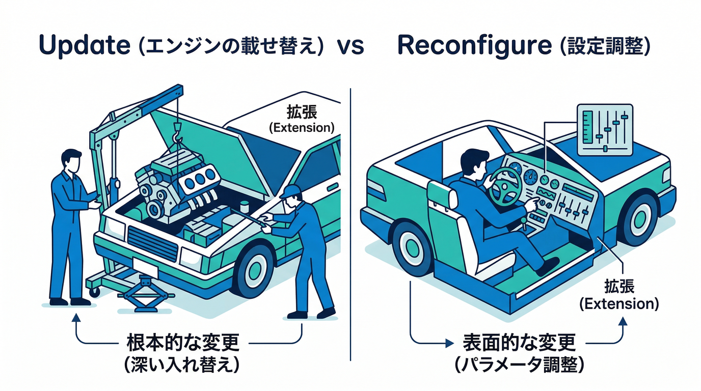
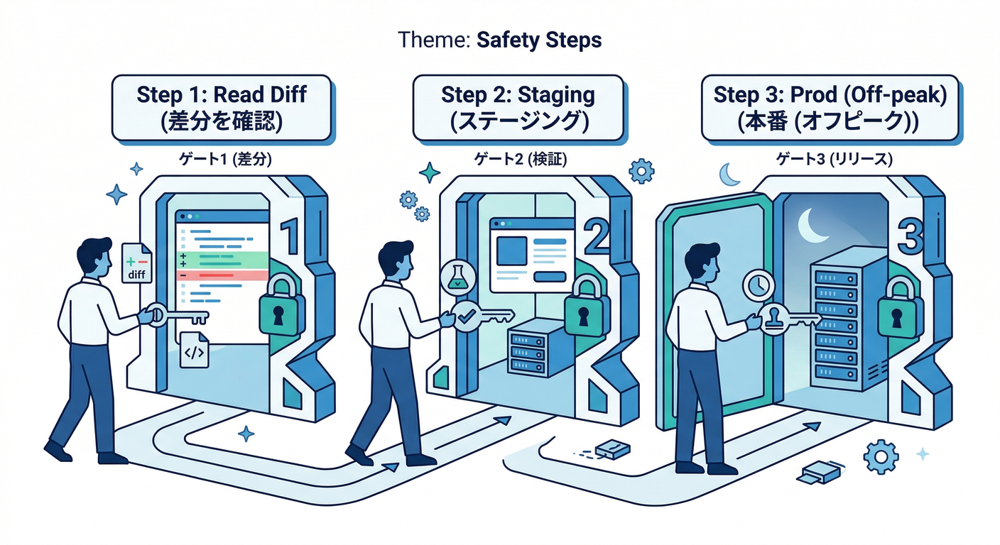
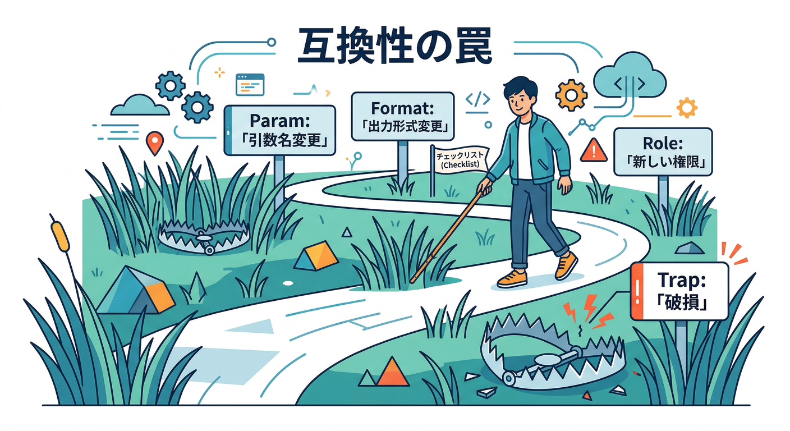
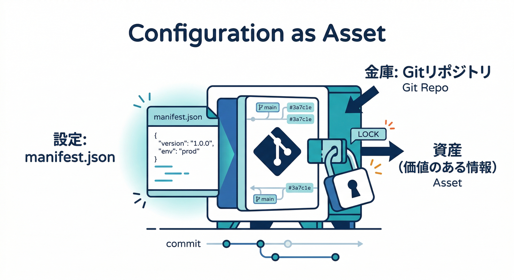
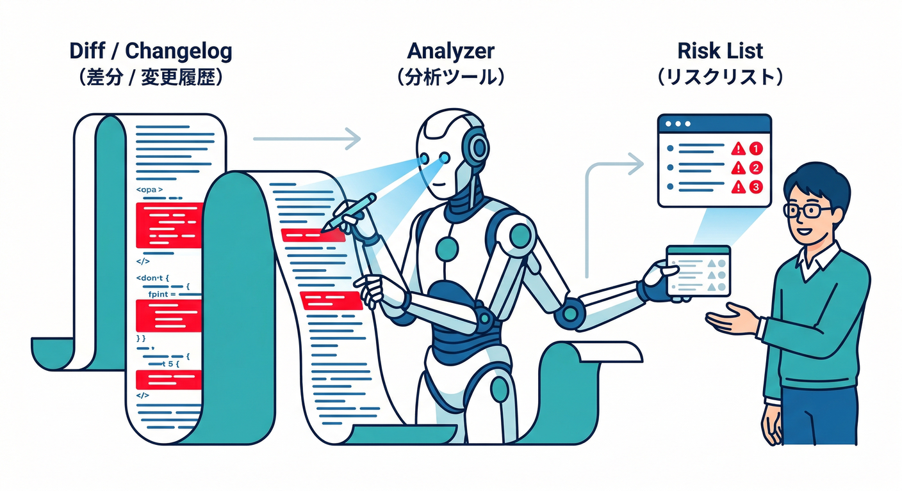

# 第16章：バージョン管理（更新・互換性・変更点）🔁🛠️

この章はひとことで言うと…
**「Extensionsの更新は“ボタン1つ”だけど、やることは“儀式”」** です🧙‍♂️✨
（儀式＝手順を決めて、毎回同じように安全にやること）

---

## まず押さえる：更新で何が起きる？🤔💡

## ✅ “更新（Update）”はけっこう強い

拡張を更新すると、**拡張が作ったリソースやロジックは上書き**されます。
ただし **インスタンスIDやサービスアカウントは基本そのまま**で進みます。更新中に「変更点」が通知されて、**新しいパラメータが増えたら値の入力**も求められます。保存して反映されるまで **数分（目安3〜5分）**かかることがあります。([Firebase][1])

## ✅ “再構成（Reconfigure）”は設定変更寄り

再構成は主に「パラメータの値を変える」操作で、**既存の成果物（例：生成済み画像や既に書き込まれたFirestoreのデータ）までは基本いじらない**、という感覚です。([Firebase][1])

## ✅ 更新の裏で「Cloud Tasks」が働くことがある🧵

拡張によっては **Cloud Tasks** を使って更新処理を進めます。
もし **Tasksを長時間止める**と、更新が失敗する可能性（トークン期限など）があるので、止めるなら短時間が安心です。([Firebase][1])

---

## ざっくり図：Update と Reconfigure の違い🪄

* **Update（更新）**：拡張そのものの“中身（バージョン）”を入れ替える🔁

  * 変更点の確認が必須👀
  * 追加パラメータがあれば入力✍️
  * ロジック上書き＝挙動が変わり得る⚠️([Firebase][1])

* **Reconfigure（再構成）**：設定（パラメータ）を変えてチューニング🎛️

  * ルールや保存先パス、サイズ、ログ量などを調整するイメージ🧩([Firebase][1])

---

## 更新を“儀式”にする：安全テンプレ（これだけやれば強い）🧾🛡️

## ステップ0：更新する理由を1行で書く📝

例）

* 「新バージョンで不具合修正が入った」
* 「コスト削減の改善が入った」
* 「セキュリティ改善が入った」

これがあると、後で自分を助けます😇

---

## ステップ1：変更点を読む（最重要）👀🔥

見るべきものはこの3つ：

1. **拡張の“変更点”表示（更新画面で出る差分）**
2. **パラメータの増減**（追加・削除・意味変更）
3. **新しく要求される権限（IAM）や作られるリソース**([Firebase][1])

ここで「怖い」を先に潰すのが勝ちです🏆

---

## ステップ2：検証（staging）で先に更新🧪➡️✅

いきなり本番更新しない！😆
検証用の拡張インスタンスで先に更新して、次を確認します👇

* 期待どおり動く？（出力先・生成物・Firestoreのフィールドなど）📦
* ログにエラー増えてない？🪵
* コストが増えそうな動きしてない？💸
* 権限追加が出てない？（最小権限を守る）🛡️([Firebase][2])

---

## ステップ3：本番更新は“短い時間帯”に🕒

更新後すぐに見るものは固定👇

* 拡張の状態：正常？エラー？🟢🔴
* 関連ログ：直近の失敗が増えてない？🪵
* 依存サービス：Storage/Firestore/Tasks などの異常は？🧯([Firebase][1])

---

## 「互換性」で事故りやすいポイント集⚠️（ここ当たると痛い）

更新で壊れがちなところを、先にチェックリスト化しておくよ📋✨

## 1) パラメータが増えた／意味が変わった🎛️

* 同じ名前でも意味が変わると、挙動が変わります😵‍💫
* 例：出力パス、対象ディレクトリ、画像サイズ、ログレベル…など

## 2) 出力フォーマットが変わる📦

* 生成ファイル名、Firestoreに書くフィールド、翻訳結果の保存先…
* UI側（React）が参照してる場所がズレると即バグります🧨

## 3) “権限追加”はコストより怖いこともある🛡️

* 追加ロール＝攻撃面が増える可能性もあるので、更新前に必ず確認👀([Firebase][2])

## 4) 更新処理が止まる（Cloud Tasks系）🧵

* 途中で止める／放置で失敗するケースがあるので、更新作業はテンポよくやるのが吉🏃‍♂️💨([Firebase][1])

---

## “バージョン管理”っぽくするコツ：設定をファイルで残す📁✨

Extensionsは「入れたら終わり」に見えるけど、運用では
**“今どういう設定で入ってるか”が資産**です💎

* 拡張の設定を **manifestとして管理**しておくと、

  * いつ設定を変えたか追える
  * レビューできる
  * 本番反映を再現できる
    みたいな“ちゃんとした運用”に寄せられます🧠🧩

---

## AIを絡める：更新の“怖いところ”を速攻で洗い出す🤖🔎

## 1) Console側のAI（Gemini in Firebase）で「ログを日本語で噛み砕く」🧠

Crashlytics等で、原因や修正案のヒントを出してくれるタイプの支援があります🧯✨([Firebase][3])

## 2) ターミナルでAI（Gemini CLI + Firebase拡張）📟✨

Gemini CLI はターミナルで使えるAIエージェントで、Firebase向けの拡張も用意されています。
「この拡張の更新前チェックリスト作って」「差分から危険点を3つ挙げて」みたいな雑務をガンガン任せられます🤝📝([Firebase][4])

## 3) MCPサーバーで“Firebaseに詳しい道具”をAIに持たせる🧰

Firebase MCP server を使うと、AIツールがFirebaseプロジェクトやコードベースと連携しやすくなります。
ただし最後は必ず人間が確認！⚠️（AIの提案＝そのまま実行は危険）([Firebase][5])

---

## 手を動かす🖐️：更新手順書テンプレを作ろう🧾✨

下をコピって、自分用に埋めればOK🙆‍♂️

* **更新対象拡張**：（例：storage-resize-images）
* **現行バージョン**：
* **更新後バージョン**：
* **更新理由（1行）**：
* **変更点の要約（3行）**：
* **影響が出そうな場所（UI/Firestore/Storage/権限）**：
* **検証で見る項目（5つ）**：
* **本番更新の予定時刻**：
* **更新後の監視（ログ/状態/失敗率）**：
* **ロールバック方針（最悪どう戻す？）**：

---

## ミニ課題🎯

**「更新で怖いところ」を1つだけ挙げて、対策を1行で書く**✍️
例）「出力パス変更が怖い → 検証でUI表示とStorage生成物をセットで確認する」

---

## チェック✅（これが言えたら合格！）

* Update と Reconfigure の違いを説明できる🔁🎛️([Firebase][1])
* 更新前に見るべき「差分・パラメータ・権限」を言える👀🛡️([Firebase][2])
* “検証→本番”の順で更新できる🧪➡️🏭
* AIは「要約・チェックリスト作成・ログ説明」に使い、実行は人間が握る🤝🧠([Firebase][4])

---

## （おまけ）クラウドFunctions系のバージョン目安（2026）📌

拡張の裏で動く処理や、周辺のFunctionsを自作するときに効いてくるやつ👇

* Cloud Functions for Firebase（Node）：**Node.js 20 / 22**（18は2025初頭に非推奨）([Firebase][6])
* Cloud Functions for Firebase（Python）：**Python 3.10〜3.13（デフォルト3.13）**([Firebase][6])
* Cloud Run functions（.NET）：**.NET 8 / 6**（runtime ID: dotnet8 / dotnet6）([Google Cloud Documentation][7])

---

次は「第17章：環境分離（検証・本番で“同じ拡張”を安全に）」で、ここで作った“更新の儀式”を **検証→本番の2段階に完全固定化**して、事故率をさらに下げます🧪➡️🏭✨

[1]: https://firebase.google.com/docs/extensions/manage-installed-extensions "Manage installed Firebase Extensions"
[2]: https://firebase.google.com/docs/extensions/publishers/access "Set up appropriate access for an extension  |  Firebase Extensions"
[3]: https://firebase.google.com/docs/ai-assistance/gemini-in-firebase?utm_source=chatgpt.com "Gemini in Firebase - Google"
[4]: https://firebase.google.com/docs/ai-assistance/gcli-extension?utm_source=chatgpt.com "Firebase extension for the Gemini CLI"
[5]: https://firebase.google.com/docs/ai-assistance/mcp-server?utm_source=chatgpt.com "Firebase MCP server | Develop with AI assistance - Google"
[6]: https://firebase.google.com/docs/functions/get-started "Get started: write, test, and deploy your first functions  |  Cloud Functions for Firebase"
[7]: https://docs.cloud.google.com/run/docs/runtimes/dotnet?hl=ja ".NET ランタイム  |  Cloud Run  |  Google Cloud Documentation"
