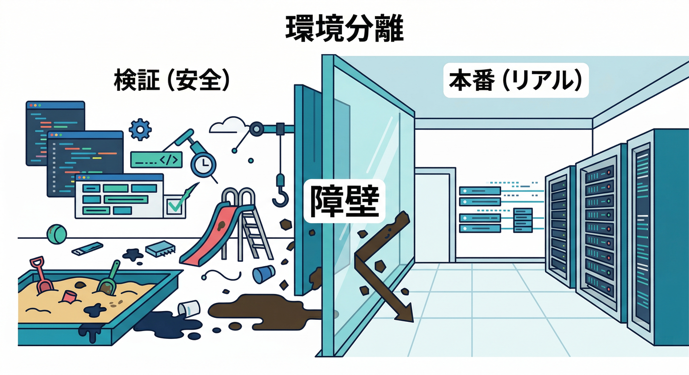
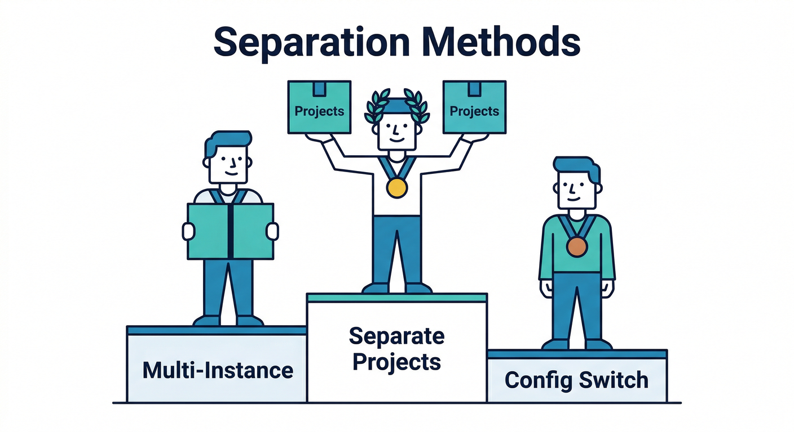
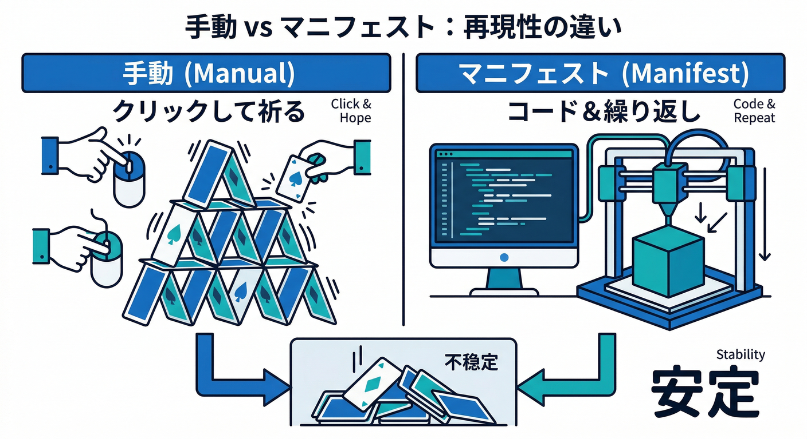
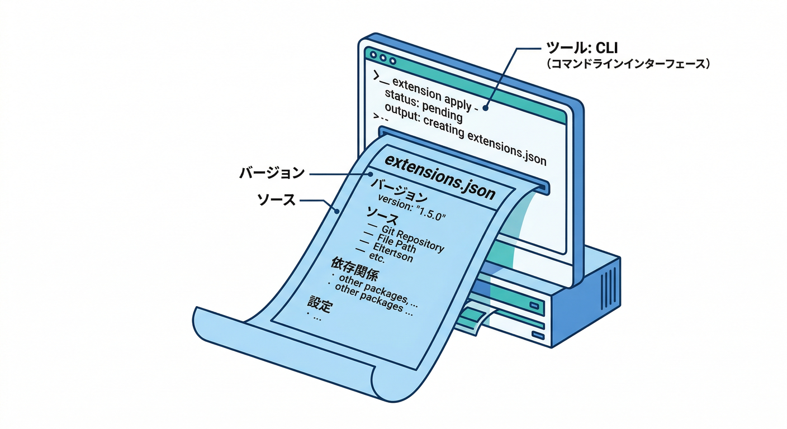
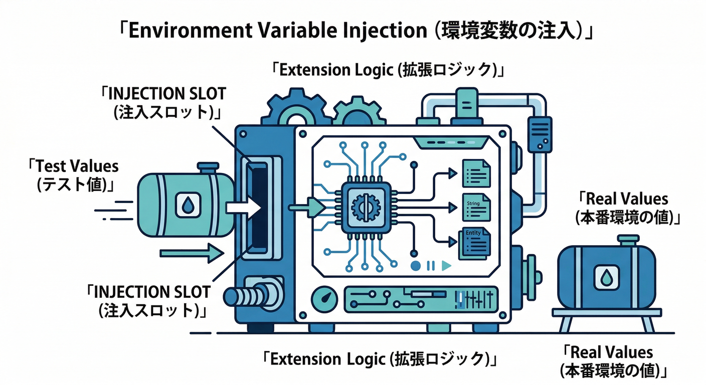
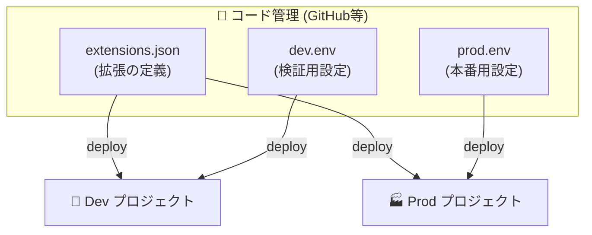
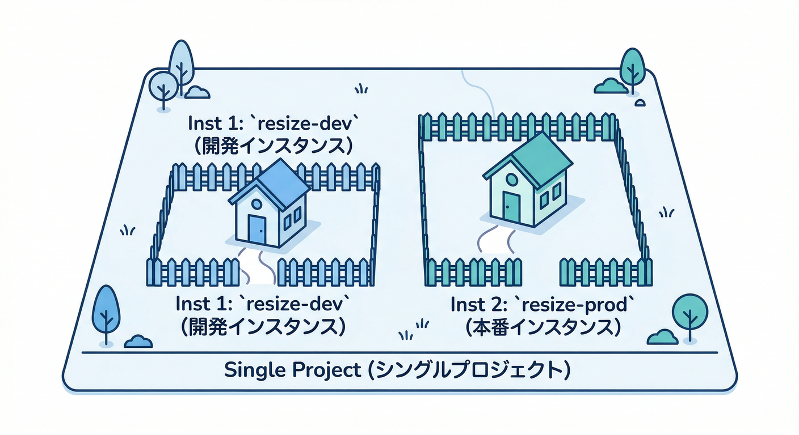
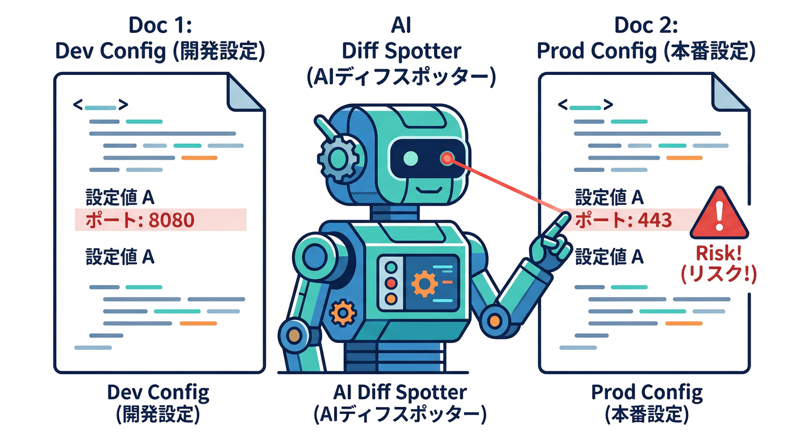

# 第17章：環境分離（検証・本番で“同じ拡張”を安全に）🧪➡️🏭

この章はひとことで言うと👇
**「拡張を“安全に試して→安全に本番へ運ぶ”ための型」**を身につける回だよ🧩✨
拡張って便利だけど、裏では Functions や Storage などのリソースが増えるので、**環境が混ざると事故が起きやすい**んだよね😇💥 ([Firebase][1])

---

## この章でできるようになること🎯

* **検証（staging）と本番（prod）を分ける理由**を説明できる🧠
* 「プロジェクト分離」or「同一プロジェクト内で複数インスタンス」どっちを選ぶべきか判断できる⚖️ ([Firebase][2])
* CLI＋マニフェスト（extensions.json）で、**“同じ拡張を別環境へ再現”**できる💻🔁 ([Firebase][3])
* AI（Gemini）にチェックリストや差分整理をやらせて、運用を軽くできる🤖🧾 

---

## まず30秒：環境分離って何？⏱️



**目的は2つだけ**👇

1. **検証で壊れても本番が無傷**（ユーザーに迷惑をかけない）🛡️
2. **コストやデータ汚染を封じ込める**（請求・ログ・生成物が混ざらない）💸🧯

公式にも「最初はテスト/開発プロジェクトに入れて試すの推奨」って明記されてるよ。 ([Firebase][1])

---

## 分離のやり方：おすすめ順（強い順）💪



## A. **プロジェクトを分ける（おすすめ）** 🥇

* dev 用プロジェクト / prod 用プロジェクトを別にする方式
* “環境”として一番キレイに分かれる（請求・DB・Storage・権限・拡張インスタンス全部）
* 公式でも「開発と本番で別プロジェクト」は典型例として説明されてるよ。 ([Firebase][2])

## B. **同じプロジェクト内で、拡張を2回入れる（複数インスタンス）** 🥈

* 同じ拡張を **同一プロジェクトに複数回インストール**できる
* **インスタンスID**で区別し、設定も作られるリソースも分かれる（＝小さな環境分離） ([Firebase][1])

## C. 1つの拡張インスタンスを“設定だけで切り替える” 🥉

* 事故りやすいので基本おすすめしない（切替ミスで即本番破壊😇）

---

## 用語メモ（超やさしく）📘

* **拡張インスタンス**：同じ拡張を入れた“1つ分”のこと
* **インスタンスID**：そのインスタンスの名前（同一プロジェクト内でユニーク）
* 同じ拡張を複数回入れると、**各インスタンスは別設定＆別リソース**で動けるよ。 ([Firebase][1])

---

## 読む📚（第17章の必読3つ）👀

* 複数インスタンス（同一プロジェクトに同じ拡張を複数回入れる） ([Firebase][1])
* マニフェスト（extensions.json）と env/secret の分け方 ([Firebase][3])
* 複数プロジェクト（dev/prodを分ける考え方） ([Firebase][2])

---

## 手を動かす🖐️：検証→本番へ“同じ拡張”を安全に運ぶ（CLI＋マニフェスト）🧩💻



ここは**再現性が命**🔥
「手でConsoleぽちぽち」だと、あとで**“あれ？本番だけ設定ちがう…”**が起きがちなので、**extensions.json + env/secretファイル**で管理するのが強い💪 ([Firebase][3])

## ① プロジェクトを dev / prod に分ける（エイリアス設定）🧭

まずは `.firebaserc`（プロジェクトの別名）で迷子を防ぐ🧠

```json
{
  "projects": {
    "dev": "YOUR_DEV_PROJECT_ID",
    "prod": "YOUR_PROD_PROJECT_ID"
  }
}
```

この「別プロジェクトで dev/prod を分ける」発想自体が公式の定番だよ。 ([Firebase][2])

---

## ② 検証プロジェクトに拡張を“ローカルに書き出す形で”追加する📝



CLI で拡張を入れるとき、**extensions.json（拡張マニフェスト）**として保存しておくのがポイント✨
マニフェスト方式は公式で **extensions.json と env/secret の扱い**まで説明されてるよ。 ([Firebase][3])

> ここで大事なのは「拡張を“デプロイ対象”としてコード管理できる状態にする」こと📦

（雰囲気例：コマンド名やオプションは公式に沿って使ってね）

```bash
## devプロジェクトを操作対象に
firebase use dev

## 拡張をローカル定義として追加（= extensions.json を作る/更新するイメージ）
firebase ext:install <publisher>/<extension-name> --local
```

---

## ③ インスタンスIDを「dev用」に決める（ここ超重要）🆔

同じ拡張を複数回入れるとき、**インスタンスIDで識別**するよ。
公式にも「同一プロジェクト内で同じ拡張を複数回入れられる」「インスタンスIDはプロジェクト内でユニーク」って書かれてる✅ ([Firebase][1])

おすすめ命名👇（誰が見ても分かる）

* `resize-images-dev`
* `resize-images-prod`

---

## ④ env/secret を「共通」「devだけ」「prodだけ」に分ける📂🔐





マニフェストは **パラメータ値を env ファイルで管理**できる。さらに **プロジェクト別の env** も持てる。これが環境分離のコア🔥 ([Firebase][3])

ファイル構成イメージ👇

```text
extensions/
  resize-images-dev.env                 # 共通値
  resize-images-dev.env.YOUR_DEV_PROJECT_ID   # devだけの値
  resize-images-prod.env
  resize-images-prod.env.YOUR_PROD_PROJECT_ID

  resize-images-prod.secret             # 本番のSecret参照（例：APIキー等）
  resize-images-dev.secret.local         # ローカル検証だけで使うSecret（事故防止）
```

* `.env` はパラメータ（例：サイズ、出力先など）
* `.secret` 系は秘密情報（例：APIキー）を分離しやすい
* **`.local` で「ローカルだけ」**が作れるので、うっかり本番キーを混ぜる事故が減るよ🧯 ([Firebase][3])

---

## ⑤ devにだけデプロイして動作確認🧪

拡張はインストール時に **作られるリソース（Functions等）や権限**が出るから、まず検証で観察するのが安全。 ([Firebase][1])

```bash
firebase deploy --only extensions --project dev
```

観察ポイント👀

* どんなリソースが増えた？（Functions名など）
* ログはどこに出る？
* Storage/Firestore の“書き込み先”が想定どおり？（devのデータだけに閉じてる？）

---

## ⑥ OKなら prod に“同じ定義”をデプロイ🏭

```bash
firebase deploy --only extensions --project prod
```

ここで「extensions.json は同じ」でも、**prod用 env/secret が読まれる**ので安全に差を付けられる、という仕組み✨ ([Firebase][3])

---

## 同一プロジェクトでの2インスタンス運用（小ワザ）🧩🧪🏭



「プロジェクト分離が理想」なんだけど、事情で同一プロジェクトにしたい場合もあるよね🙂
その場合は **同じ拡張を2回インストール**して、インスタンスIDを分ける。
各インスタンスは **別の設定・別の拡張リソース**を持てるよ。 ([Firebase][1])

ただし注意⚠️

* **データ（Firestore/Storage）の書き込み先まで必ず分離**してね（パスに `dev/` を入れるとか）
* 権限やサービスアカウントも絡むので、要求権限は毎回レビューしよう🛡️ ([Firebase][4])

---

## AIでラクする（Gemini CLI / コンソールAI）🤖✨



ここ、AIがめっちゃ効くところ😆

## 1) Gemini CLIに「環境差分の表」を作らせる📋

Google Cloud の Gemini CLI は「ドキュメントや設定を元に整理」をやらせやすい。 

例（プロンプト案）👇

```text
extensions.json と dev/prod の env を読んで、
「違う値だけ」を表にして。リスク（事故りやすい差分）もコメントして。
```

## 2) Gemini in Firebaseでログを“人間語”に翻訳🧠

「なんで失敗した？」をログから読むの、初心者はキツい😇
FirebaseのAI支援（Gemini in Firebase）で、ログやエラーの理解を助けられるよ。

## 3) チェックリスト生成→人間が最終責任🤝

「丸投げ」じゃなくて、**下書きをAIに作らせて、最後は人間がOK出す**のが最強ムーブ😎🧾

---

## ミニ課題🎯（10〜15分）

あなたが入れたい拡張を1つ選んで👇

1. **dev/prodで分けたいパラメータ**を3つ書く（例：サイズ、出力先、ログ量）📝
2. `INSTANCE_ID.env`（共通）と `INSTANCE_ID.env.PROJECT_ID`（差分）に、どう分けるか設計する📂
3. “事故るとヤバい差分”に 🔥 を付ける（例：書き込み先、秘密情報）🔥

---

## チェック✅（できたら勝ち🎉）

* [ ] 「プロジェクト分離」が一番安全だと説明できる ([Firebase][2])
* [ ] 同一プロジェクトでも「複数インスタンス」で分けられる理由を言える（インスタンスID） ([Firebase][1])
* [ ] extensions.json + env/secret で“再現性ある運用”にできる ([Firebase][3])
* [ ] 本番デプロイ前に「検証で観察するポイント」を挙げられる ([Firebase][1])

---

## おまけ：2026ランタイム早見（章末メモ）🧩⚙️

拡張の裏側は主に Functions が動くので、**ランタイムの感覚**も軽く持っておくと安心🙂

* Cloud Functions for Firebase：Node.js **22 / 20** が選べる（18はdeprecated） ([Firebase][5])
* Cloud Functions for Firebase（Python）：`python310` / `python311` の指定が可能 ([Firebase][5])
* .NET は Cloud Functions for Firebase というより、**Cloud Run functions 側（Google Cloud側）**で扱うのが基本（.NET 8 など） ([Google Cloud Documentation][6])

---

次の第18章（AI拡張）に行く前に、この第17章で「**拡張は“同じでも環境で設定を変える”が基本**」って体に染みると、以後ずっと運用がラクになるよ🧠✨

[1]: https://firebase.google.com/docs/extensions/install-extensions "Install a Firebase Extension  |  Firebase Extensions"
[2]: https://firebase.google.com/docs/projects/multiprojects "Configure multiple projects  |  Firebase"
[3]: https://firebase.google.com/docs/extensions/manifest "Manage project configurations with the Extensions manifest  |  Firebase Extensions"
[4]: https://firebase.google.com/docs/extensions/publishers/access "Set up appropriate access for an extension  |  Firebase Extensions"
[5]: https://firebase.google.com/docs/functions/manage-functions "Manage functions  |  Cloud Functions for Firebase"
[6]: https://docs.cloud.google.com/functions/docs/runtime-support "Runtime support  |  Cloud Run functions  |  Google Cloud Documentation"
