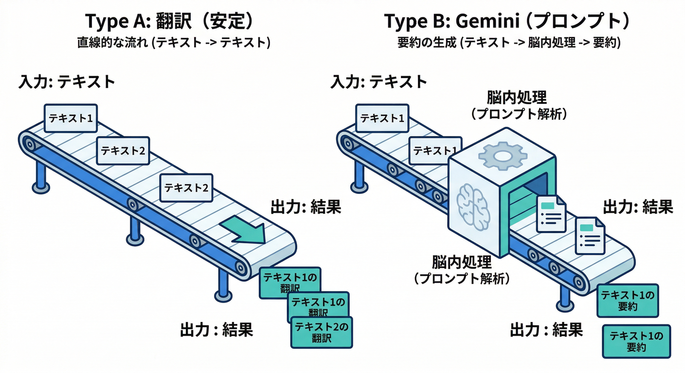
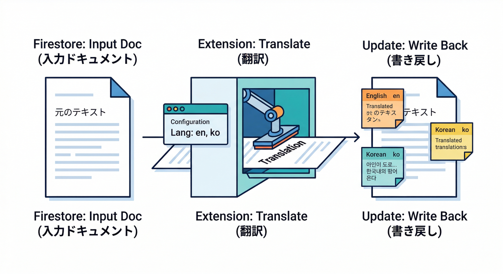
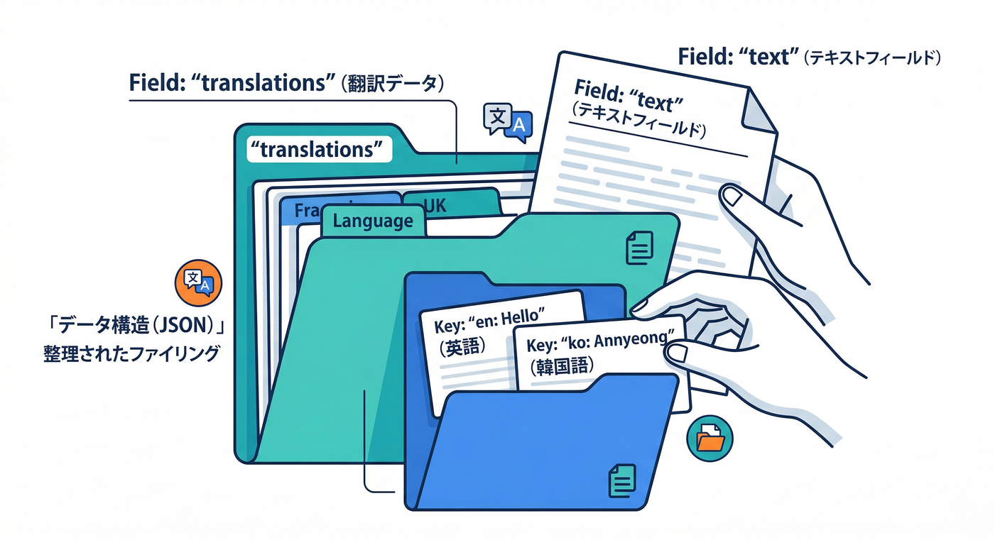
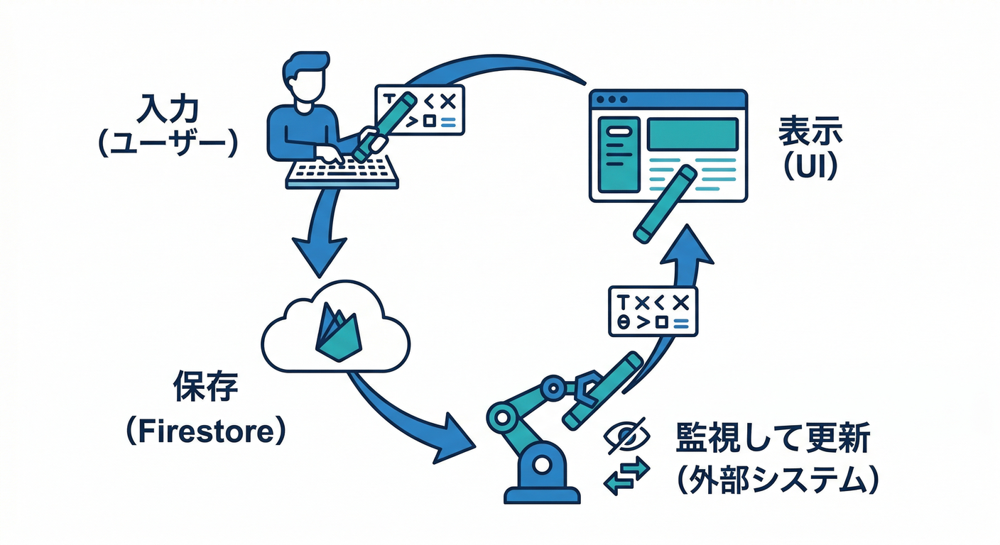
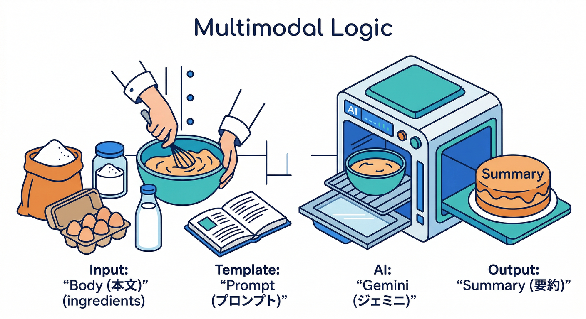
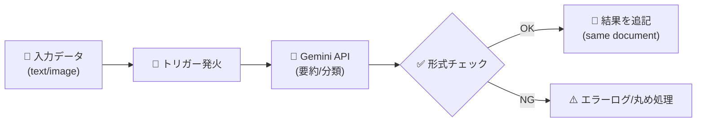
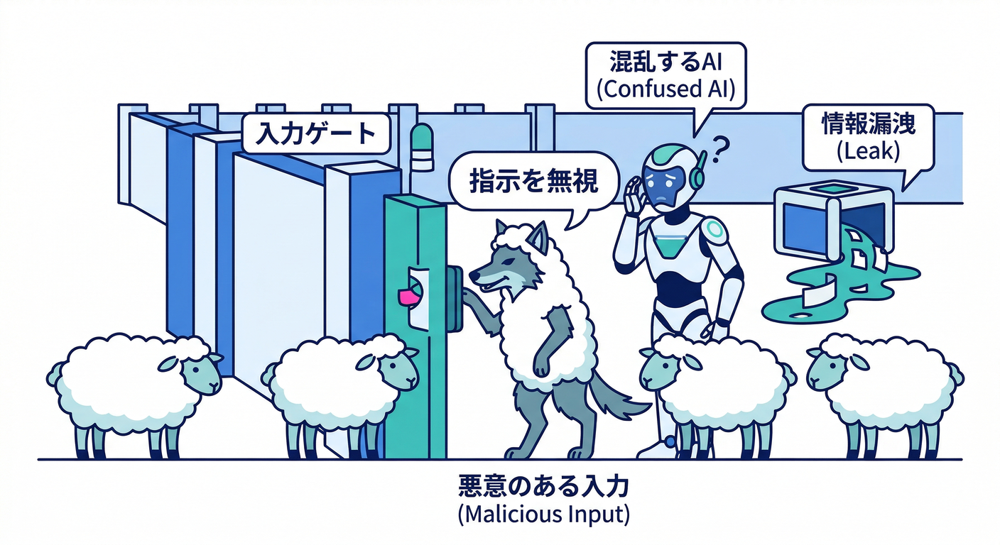
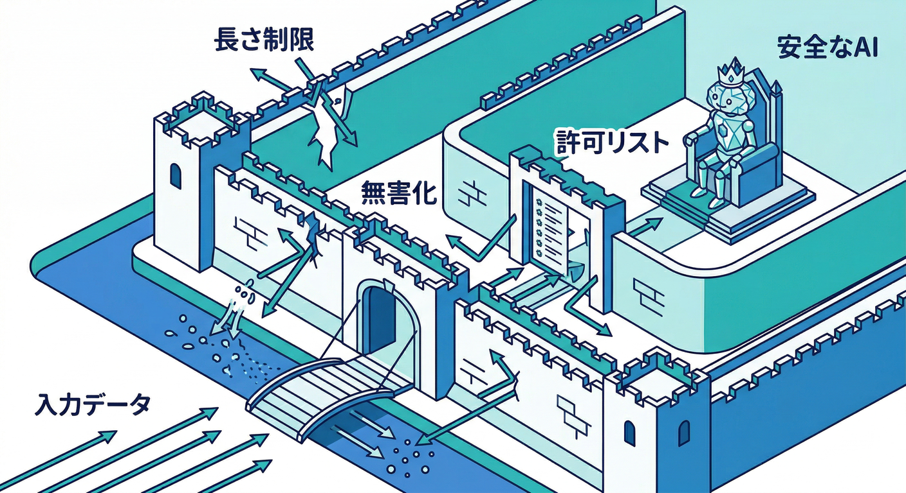

# 第18章：AI拡張を入れてみる（翻訳・要約・分類）🤖✨

この章のゴールはこれ👇
**「AIっぽい機能（翻訳・要約・分類）を “拡張で秒速導入” して、アプリに組み込める状態にする」** だよ🧩⚡

---

## 1) まず超ざっくり：AI拡張には2タイプあるよ🧠✨



## A. 翻訳みたいに“結果が安定しやすい”系🌍

代表が **Translate Text in Firestore**。
Firestoreに文章を書いたら、別フィールドに翻訳を書き足してくれる感じ✍️➡️📝（翻訳は Cloud Translation か Gemini を選べる）([Firebase 拡張機能ハブ][1])

## B. 要約・分類みたいに“プロンプトで形が変わる”系🧪

代表が **Multimodal Tasks with the Gemini API**。
Firestoreに入った文章（や画像）を、Geminiに投げて結果を別フィールドへ保存するタイプだよ🤖🧠([Firebase 拡張機能ハブ][2])

この章では **A（翻訳）→B（要約/分類）** の順で触って、「AI拡張ってこう組み込むのか〜」を体に入れるよ🏃‍♂️💨

---

## 2) ハンズオン①：Translate Text in Firestore を入れる🌍🧩

## 2-1. どう動くの？（最短イメージ）👀



* Firestoreの特定コレクションに、たとえば `text` フィールドで文章を保存📝
* 拡張が検知して翻訳を作る🌍
* 同じドキュメント内の別フィールドへ結果を書き足す（または指定した形で保存）✍️✨([GitHub][3])

裏側は Cloud Functions で動くよ（この拡張の runtime は **nodejs20**）。([GitHub][4])

---

## 2-2. インストール時に見るポイント（安全寄りの設定）🛡️✨

**最初は “翻訳プロバイダ” をどっちにするか決める**👇

* **Cloud Translation**：翻訳専用で挙動が読みやすい（まずはこっちが気楽）
* **Gemini**：自然で柔らかい翻訳になりやすいけど、生成AIの注意点が乗る（後で挑戦でもOK）([Firebase 拡張機能ハブ][1])

そして設定パラメータの核はこのへん👇（名前は拡張のパラメータとして存在するやつ）

* `COLLECTION_PATH`：監視するコレクション
* `INPUT_FIELD_NAME`：翻訳元のフィールド名（例：`text`）
* `LANGUAGES`：翻訳したい言語コード（スペース区切り）
* `TRANSLATE_PROVIDER`：`cloud_translation_api` か `gemini`
* `OUTPUT_FIELD_NAME`：翻訳結果の保存先（既定は `translations`）([GitHub][3])

Gemini を選んだ場合はさらに👇

* `GEMINI_API_PROVIDER`（Google AI / Vertex AI）
* `GEMINI_MODEL`（例：`gemini-2.5-flash` / `gemini-2.5-pro` など）([GitHub][3])

> 迷ったら：**まず Cloud Translation** → 仕組みを理解 → 次に Gemini に切り替え、が気持ちいいよ😆👍

---

## 2-3. Firestoreのデータ設計（例）📚🧱



**コレクション：** `comments`
**ドキュメント例：**

```ts
// /comments/{commentId}
{
  text: "こんにちは！今日は寒いね。",
  createdAt: serverTimestamp(),
  // 拡張が書き足す（例）
  translations: {
    en: "Hello! It's cold today.",
    ko: "안녕! 오늘 춥네."
  }
}
```

`translations` の中に言語コードでまとまる形がイメージしやすい👌（この形は `OUTPUT_FIELD_NAME` の設計で決まるよ）([GitHub][3])

---

## 2-4. React 側：入力→保存→翻訳表示（最小サンプル）⚛️✨



Firestoreに書き込む側（超ミニ）：

```ts
import { addDoc, collection, serverTimestamp } from "firebase/firestore";
import { db } from "./firebase"; // 初期化済みの想定

export async function postComment(text: string) {
  await addDoc(collection(db, "comments"), {
    text,
    createdAt: serverTimestamp(),
  });
}
```

表示側（翻訳が入ったら出す）：

```tsx
import { doc, onSnapshot } from "firebase/firestore";
import { useEffect, useState } from "react";
import { db } from "./firebase";

type CommentDoc = {
  text?: string;
  translations?: Record<string, string>;
};

export function CommentViewer({ commentId }: { commentId: string }) {
  const [data, setData] = useState<CommentDoc>({});

  useEffect(() => {
    const ref = doc(db, "comments", commentId);
    return onSnapshot(ref, (snap) => {
      setData((snap.data() ?? {}) as CommentDoc);
    });
  }, [commentId]);

  return (
    <div>
      <div>原文：{data.text ?? "..."}</div>

      <div style={{ marginTop: 12 }}>
        <div>翻訳：</div>
        <div>EN：{data.translations?.en ?? "（まだ）"}</div>
        <div>KO：{data.translations?.ko ?? "（まだ）"}</div>
      </div>
    </div>
  );
}
```

ポイントはこれだけ👇

* **翻訳は非同期で後から入る**（最初は空っぽでOK）🕒
* UI は「（まだ）」みたいに待ち状態を出すと親切🙂✨

---

## 3) ハンズオン②：要約・分類は “Multimodal Tasks with the Gemini API” で作る🧠🧪

翻訳拡張は「翻訳専用」だけど、要約・分類はアプリごとに欲しい形が違うよね？
そこでこの拡張は **“プロンプトで結果を作り、Firestoreへ書く”** という汎用タイプ💪🔥([Firebase 拡張機能ハブ][2])

## 3-1. ありがちな使い方（例）📌





* `notes/{id}` の `body` を

  * `summary`（1〜2行要約）
  * `category`（分類：仕事/雑談/予定 など）
    にして保存する📝➡️🤖➡️🏷️

この拡張は **Handlebars テンプレ**でプロンプトを組む作りになってるよ（つまり「入力をここに差し込む」を安全に設計しやすい）。([GitHub][4])

---

## 4) 超重要：AI入力はサニタイズ必須（プロンプトインジェクション対策）🧼🛡️



生成AI系（Gemini）を絡めるなら、ここは絶対おさえたい🙌
**プロンプトインジェクション**は「入力文の中に、AIへの命令が紛れ込む」タイプの攻撃だよ😈📨
（OWASP でも主要リスクとして整理されてる）([OWASP Gen AI Security Project][5])

Gemini API 側も「プロンプトインジェクションに備えよう」って明確に書いてるよ。([Google AI for Developers][6])
Vertex AI でも安全対策全体の考え方がまとまってる。([Google Cloud Documentation][7])

## “初心者でもできる” 守りの10箇条🔟🛡️



1. **ユーザー入力は “命令” じゃなくて “データ” 扱い**🧊
2. **プロンプトは固定（コード側）**、ユーザー入力は差し込みだけ🧩
3. **入力を区切り記号で囲う**（例：`---` で囲む）✂️
4. **長すぎる入力は切る**（例：最大 2,000 文字）✂️📏
5. **秘密情報を入力に混ぜない**（APIキー、トークン、個人情報）🔑🙅‍♂️
6. **出力をそのまま権限操作に使わない**（“AIがOKって言ったから削除”は禁止）🚫
7. **保存前に形式チェック**（JSONなら JSON.parse、分類なら許可リスト照合）✅
8. **レート制限/課金ガード**（連投でお金が燃えるのを防ぐ🔥💸）
9. **ログで監視**（異常な入力・急増を早期発見）🪵👀
10. **安全フィルタ/ポリシーを使う**（可能なら）🧯🧠([OWASP Cheat Sheet Series][8])

> 「AI拡張＝便利」だけど、**“入力は信用しない”** が基本姿勢だよ😎🛡️

---

## 5) ミニ課題🎯（15〜30分でOK）🧩✨

## 課題A（翻訳）：言語を2つ増やす🌍

* `LANGUAGES` を増やして

  * `en`（英語）
  * `zh`（中国語）
  * `ko`（韓国語）
    みたいに複数にする（UIで表示も増やす）🧠💪([GitHub][3])

## 課題B（要約/分類）：分類を “許可リスト” にする🏷️✅

* `category` は `["work","life","idea","other"]` だけ許可
* AIが変な値を返したら `other` に丸める
  （これだけで事故が激減するよ😆）([OWASP Cheat Sheet Series][8])

---

## 6) チェック✅（ここまで来たら勝ち！）🏁✨

* [ ] Firestoreに文章を入れると、**翻訳が後から追記される**のを確認できた🌍📝
* [ ] AI系は **入力＝データ** として扱う理由を説明できる🧼🧠([OWASP Gen AI Security Project][5])
* [ ] 要約/分類の結果を **許可リスト or 形式チェック**で守れる✅🛡️
* [ ] 「拡張で足りない要件なら自作へ」という判断ができそう⚖️🙂

---

## 7) （おまけ）自作に切り替える時の “2026ランタイム目安”🧩⚙️

拡張の裏側は Node.js が多いけど、要件が尖ってきたら Cloud Run functions 側で自作もアリ。
2026-02-18 時点の Cloud Run functions は **Node.js 24/22/20、Python 3.14/3.13/3.12、.NET 10/8** が見えるよ。([Google Cloud Documentation][9])

---

次章（第19章）は「AIで“開発・運用”もラクにする」側（Antigravity / Gemini CLI / Console AI）に寄せられるけど、
第18章までで **“AI拡張＝アプリの中で動く機能として扱える”** って感覚が付けば、もうかなり強いよ😎🔥

[1]: https://extensions.dev/extensions/firebase/firestore-translate-text "Translate Text in Firestore | Firebase Extensions Hub"
[2]: https://extensions.dev/extensions/googlecloud/firestore-multimodal-genai "Multimodal Tasks with the Gemini API | Firebase Extensions Hub"
[3]: https://raw.githubusercontent.com/firebase/extensions/704cacd0662a28eb00e2114183dbbd2d7b78104b/firestore-translate-text/README.md "raw.githubusercontent.com"
[4]: https://raw.githubusercontent.com/firebase/extensions/704cacd0662a28eb00e2114183dbbd2d7b78104b/firestore-translate-text/extension.yaml "raw.githubusercontent.com"
[5]: https://genai.owasp.org/llmrisk/llm01-prompt-injection/?utm_source=chatgpt.com "LLM01:2025 Prompt Injection - OWASP Gen AI Security Project"
[6]: https://ai.google.dev/gemini-api/docs/safety-guidance?utm_source=chatgpt.com "Safety guidance | Gemini API | Google AI for Developers"
[7]: https://docs.cloud.google.com/vertex-ai/generative-ai/docs/learn/safety-overview?utm_source=chatgpt.com "Safety in Vertex AI | Generative AI on ..."
[8]: https://cheatsheetseries.owasp.org/cheatsheets/LLM_Prompt_Injection_Prevention_Cheat_Sheet.html?utm_source=chatgpt.com "LLM Prompt Injection Prevention Cheat Sheet"
[9]: https://docs.cloud.google.com/functions/docs/runtime-support "Runtime support  |  Cloud Run functions  |  Google Cloud Documentation"
