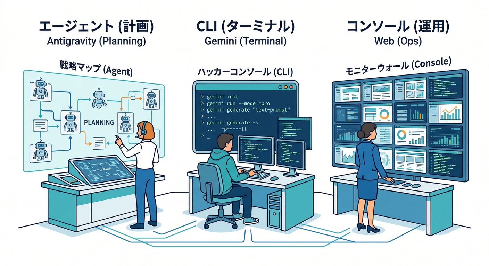
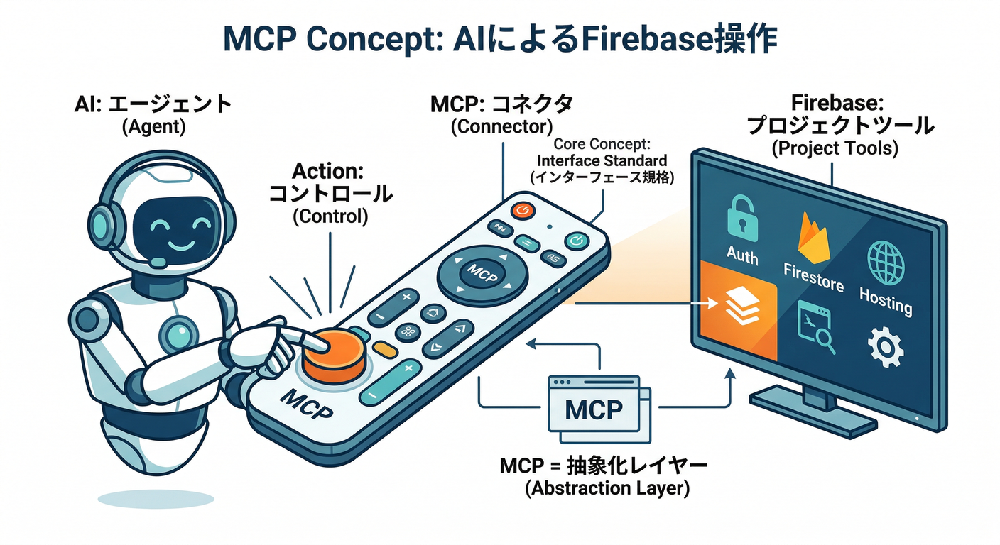
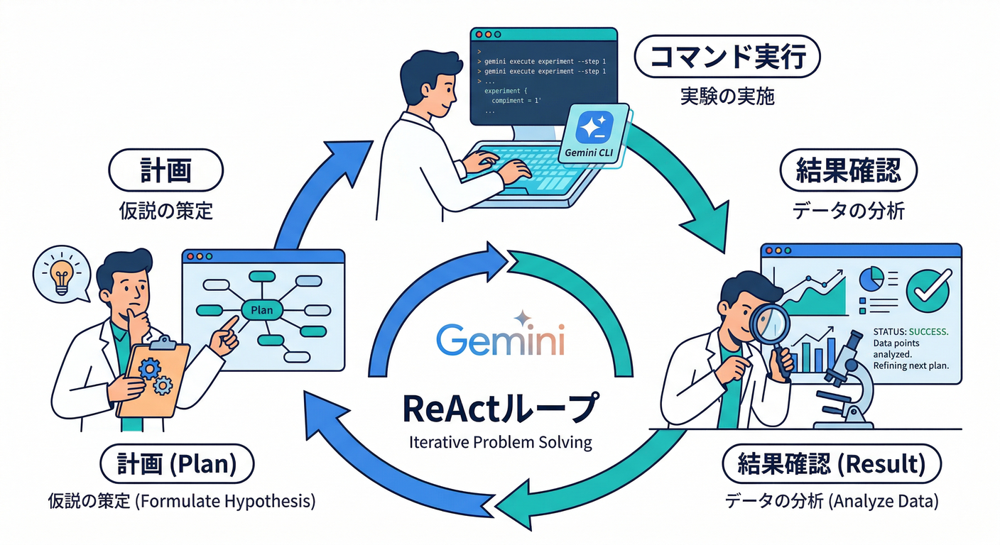
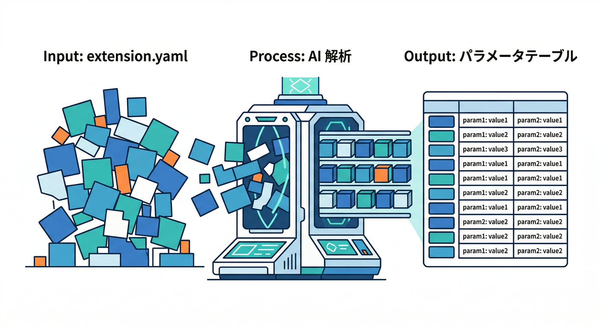
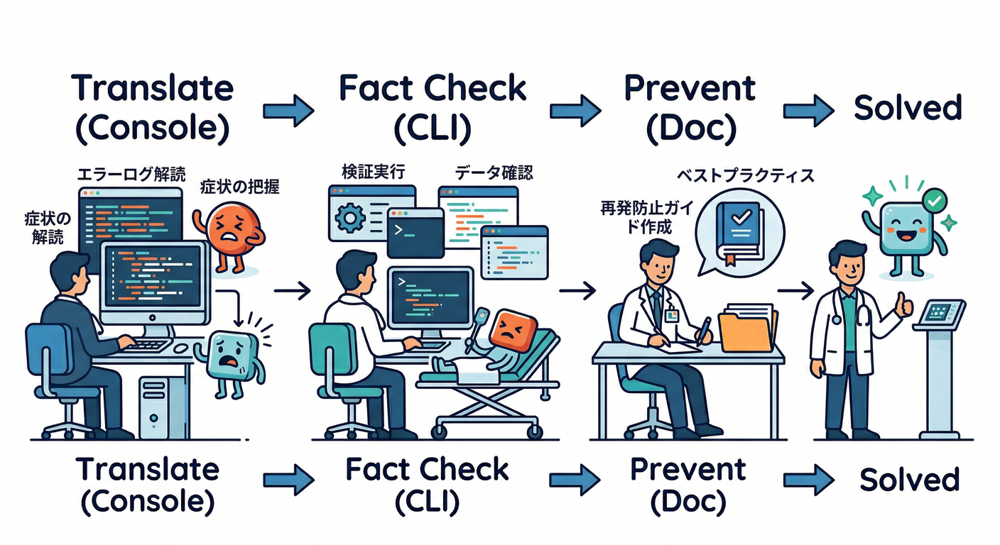
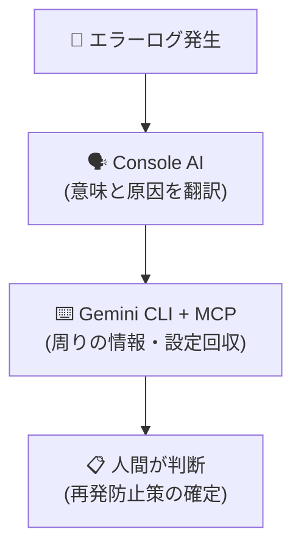
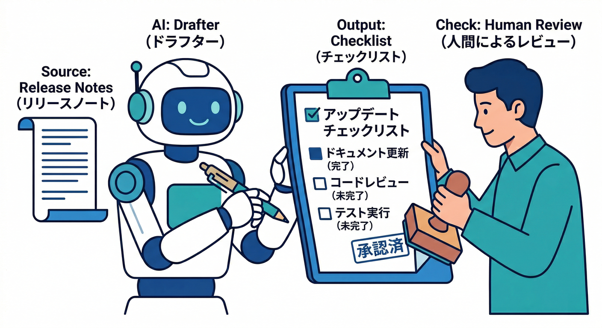
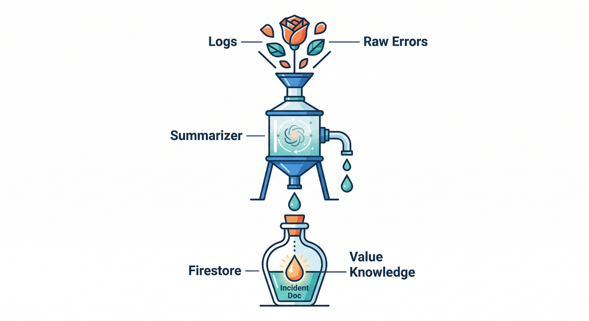

# 第19章：AIで開発も運用もラクにする（Antigravity / Gemini CLI / Console AI）🛸💻🧯

この章のゴールはこれ👇
**Extensions を「入れて終わり」にせず、AIで“調査・判断・運用”まで秒速化する**ことです😎✨
（特に「パラメータ地獄」「エラー調査」「更新前チェック」がラクになります）

---

## 1) まず全体像：AIは“3か所”で効かせる🧠🧩



## A. Antigravity のAI（エージェント）🛸

* 画面操作＋手順作成＋メモ整形が得意✨
* しかも **Firebase MCP server** を入れると、AIが Firebase の作業を“道具として”扱えるようになります🧰
  （プロジェクト管理、Authユーザー、Firestore、Rules、FCM送信…など）([Firebase][1])

## B. Gemini CLI（ターミナルAI）⌨️🤖

* ターミナルで動く **オープンソースのAIエージェント**。
* ReAct（考えて→道具を使って→また考える）ループで、バグ修正やテスト追加まで“作業として”やってくれます🔁([Google Cloud Documentation][2])
* MCPサーバー（Firebase MCP server）とも連携できます🧩([Firebase][1])

## C. Firebase Console の Gemini in Firebase（コンソールAI）🧯

* コンソール上で、ログや設定の“読解”が速くなります📋
* 有効化は **ユーザー単位＆プロジェクト単位**。権限（owner/editor など）も要ります🔐([Firebase][3])
* Crashlytics でもAI支援が使える導線があります🧯([Firebase][3])

---

## 2) 手を動かす：まず“AIの作業場”を用意する🛠️✨

## 2-1. Gemini in Firebase を有効化する（コンソール）✨

やることはシンプル👇

* Firebase console 右上の **「Gemini in Firebase」** から有効化
* 使える/有効化できる人は IAMロールに依存（owner/editor など）([Firebase][3])
* Workspaceユーザー/個人ユーザーで扱いが違う＆利用規約も違うので、表示される案内をちゃんと読む👀([Firebase][3])

> 💡コツ：最初は「ログの日本語解説」と「次の確認項目の提案」だけで十分“元が取れる”よ🙂

---

## 2-2. Antigravity に Firebase MCP server を入れる🧩🛸



Antigravity 側の手順は docs に明記されています👇([Firebase][1])

* Agentペインのメニュー → **MCP Servers** → **Firebase > Install**
* 自動で `mcp_config.json` が更新される（中身も確認できる）([Firebase][1])

> 🔐超重要：MCP server は **Firebase CLI と同じ認証情報**で動きます。
> つまり「AIに作業させる＝あなたの権限で作業する」ってこと！([Firebase][1])
> 権限が強すぎると事故りやすいので、まずは検証プロジェクト推奨🧯

---

## 2-3. Gemini CLI に Firebase 連携を入れる（推奨）🔌⌨️



Firebase MCP server のページに **“推奨の入れ方”** が載ってます👇([Firebase][1])

```bash
## Gemini CLI に Firebase 連携（拡張）を追加
gemini extensions install https://github.com/gemini-cli-extensions/firebase/
```

* これで **Firebase MCP server の設定も自動化**され、さらに **Firebase向けコンテキストファイル**も付いて精度が上がる、とされています([Firebase][1])

---

## 3) この章の“本題”：Extensions運用をAIでラクにするテンプレ🧩⚡

ここからが気持ちいいところ😆
「AIに丸投げ」じゃなくて、**“下書き→人間が確定”**の型でいきます🤝

---

## 3-1. パラメータ表をAIに作らせる📋✨（最優先）



Extensions は結局「設定（パラメータ）」が命🎛️
だからまず **拡張インスタンスのパラメータ表**を作る！

**Gemini CLI への指示例**👇

```bash
## 例：プロジェクト内にメモを作る（あなたの手でコピペしてOK）
## extension.yaml やインストール時パラメータを貼り付けて、表にしてもらう
```

**プロンプト例（そのまま使ってOK）**🧠

* 「この拡張のパラメータを、`名前 / 意味 / 変更したら起きること / 事故りやすさ / 推奨値` で表にして」
* 「“検証”と“本番”で変えるべき項目だけ抜き出して」
* 「秘密情報（Secrets）が関係する項目があるなら赤信号で教えて」

> ✅成果物：**parameters.md（運用の核）**
> これがあるだけで、引き継ぎも復旧も段違いになる🧯

---

## 3-2. エラー調査を“3段階”に分けてAIに振る🧯🔍





エラーが出たとき、初心者が詰まるのはだいたいここ👇

1. 何が悪いのか分からない😵‍💫
2. どこを見ればいいか分からない🫥
3. 直した後、再発防止が書けない😇

そこで **段階ごとにAIにやらせる**！

## (1) 症状の翻訳（Console AIが強い）🗣️

* Firebase console の Gemini に **エラー文＋状況**を貼る
* 「原因候補を3つ」「まず確認する順番」「放置すると起きる事故」を聞く
  （Gemini in Firebase の有効化や権限の前提は docs の通り）([Firebase][3])

## (2) 事実の回収（Gemini CLI + MCP が強い）🧰

* 「関係する設定・Rules・対象パス・最近の更新」を列挙させる
* MCPは Firebase CLI の認証で動くので、確認系タスクが速い([Firebase][1])

## (3) 再発防止（AIに“テンプレ”を書かせる）📝

* 「再発防止策をチェックリスト化して」
* 「“更新前チェック”に入れる項目だけ抽出して」

---

## 3-3. 更新前チェックリストをAIに下書きさせる🔁✅



Extensions 更新は怖い。だから“儀式化”する🧙‍♂️✨

**AIに作らせるチェック項目例**👇

* 変更点（リリースノート）を読んだ？
* 影響するリソースは？（Functions/Storage/Firestore/Secrets など）
* 失敗した時の戻し方は？（ロールバック方針）
* コスト増えない？（呼び出し回数・生成物増加など）

> 💡AIに「想定される最悪ケース」と「検知方法（どのログ/どの画面）」まで書かせると、運用が一気に強くなる🛡️

---

## 4) Firebase AIサービスも絡める：運用ログを“要約して保存”🧠📌



ここは“Extensionsそのもの”じゃないけど、運用にめっちゃ効くやつ✨

* エラーや重要ログを Firestore に貯める🗃️
* **Firebase AI Logic**（または Genkit 連携）で

  * 「原因っぽい要約」
  * 「次に見るべきURL/画面」
  * 「再発防止の一行」
    を自動生成して一緒に保存🤖📝

> ✅結果：未来の自分が助かる🤣（“あの時何したっけ？”が消える）

---

## 5) 2026-02-20 時点のランタイム目安（章末メモ）📌

AIで Functions や周辺の話が出てきたときの“迷子防止”です🙂

* **Cloud Functions for Firebase（Firebase側）**：Node.js は **22 / 20** を選べて、**18 は deprecated**([Firebase][4])
* **Cloud Run functions（GCP側）**：

  * Node.js：**24 / 22 / 20**（ベースイメージとして提示）([Google Cloud Documentation][5])
  * .NET：**.NET 8**（ほかに .NET 6 など）([Google Cloud Documentation][6])
  * Python：**3.13 / 3.12**（**3.14 はプレビュー**表記）([Google Cloud Documentation][7])

---

## ミニ課題🎯（15〜30分でOK）

**「AI運用3点セット」**を作って提出（自分用でOK）😆📦

1. `parameters.md`：拡張パラメータ表（推奨値つき）📋
2. `update_checklist.md`：更新前チェック（10項目）✅
3. `incident_note.md`：障害メモのテンプレ（原因/対応/再発防止）🧯

---

## チェック✅（できたら勝ち🏆）

* Extensions を「設定の塊」として説明できる🧩
* エラーが出たとき「翻訳→事実回収→再発防止」の順で動ける🧯
* AIに“下書き”を作らせて、人間が最後に確定する癖がついた🤝
* MCP は **Firebase CLI と同じ権限で動く**ので、扱いに注意できる🔐([Firebase][1])

---

必要なら次の一手も作れます👇😎
**「第19章で作った3点セットを、Antigravityエージェントに“雛形自動生成”させるプロンプト集」**（コピペで回るやつ）も作ろうか？🛸📋

[1]: https://firebase.google.com/docs/ai-assistance/mcp-server "Firebase MCP server  |  Develop with AI assistance"
[2]: https://docs.cloud.google.com/gemini/docs/codeassist/gemini-cli "Gemini CLI  |  Gemini for Google Cloud  |  Google Cloud Documentation"
[3]: https://firebase.google.com/docs/ai-assistance/gemini-in-firebase/set-up-gemini "Set up Gemini in Firebase"
[4]: https://firebase.google.com/docs/functions/manage-functions "Manage functions  |  Cloud Functions for Firebase"
[5]: https://docs.cloud.google.com/run/docs/runtimes/nodejs?hl=ja "Node.js ランタイム  |  Cloud Run  |  Google Cloud Documentation"
[6]: https://docs.cloud.google.com/run/docs/runtimes/dotnet?hl=ja ".NET ランタイム  |  Cloud Run  |  Google Cloud Documentation"
[7]: https://docs.cloud.google.com/run/docs/runtimes/python?hl=ja "Python ランタイム  |  Cloud Run  |  Google Cloud Documentation"
