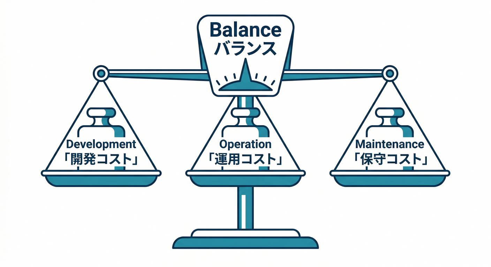
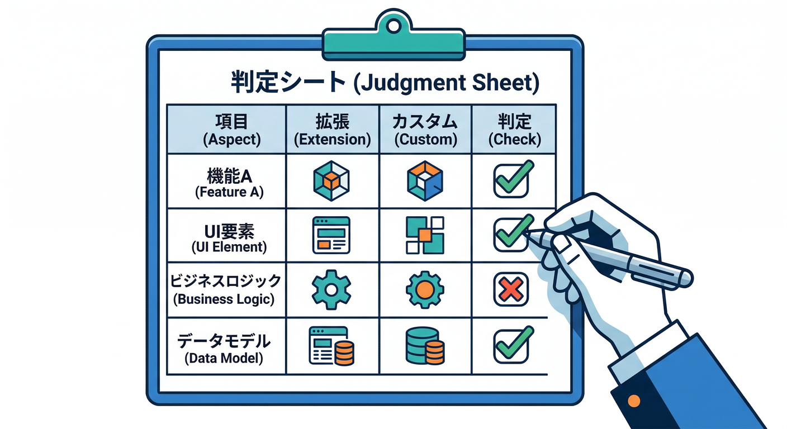
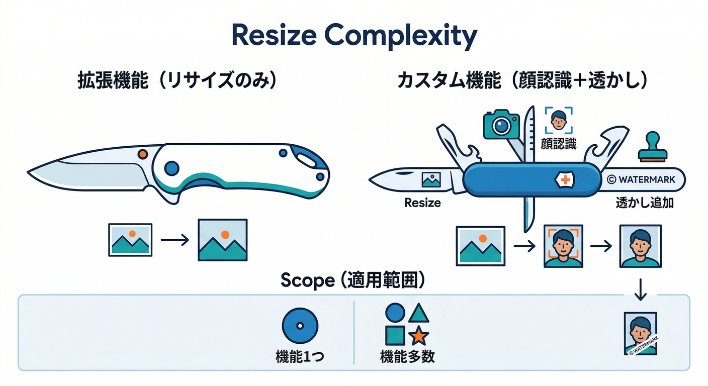
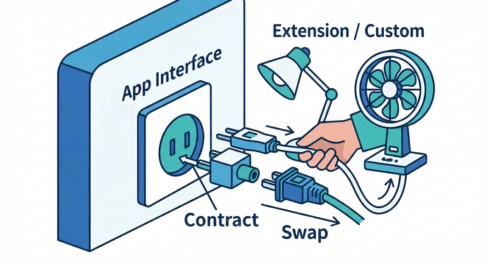
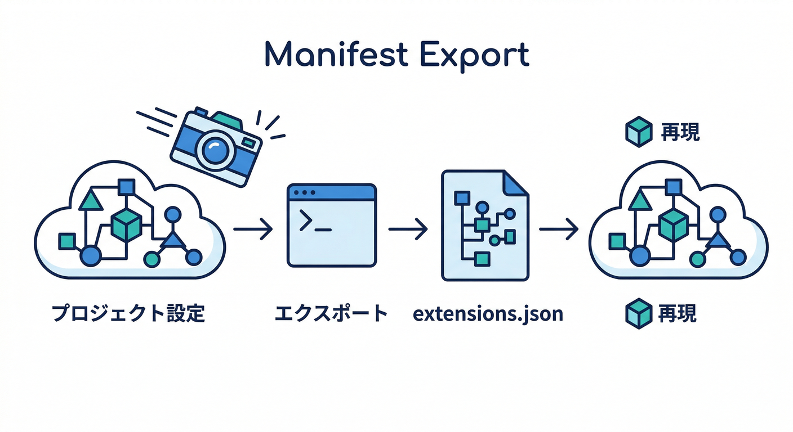

# 第20章：自作 vs Extensions の分岐点（ここが判断ライン⚖️）＋ランタイム表🧩⚙️

この章のゴールはこれ👇
**「Extensionsで秒速導入 → でも、いつ自作に切り替えるべきか？」を“迷わず”決められる状態**にすることだよ😎✨
（2026-02-20 時点の最新ドキュメントを参照して整理してるよ）([Firebase][1])

---

## 0) まず結論：判断のコアは “3つのコスト” 💸🧠🧯



Extensions は「最小メンテで動く」「必要な権限だけを付与する」思想で作られてて、インストール前に **有効化されるAPI / 作られるリソース / 付与権限 / 課金要件** を確認できるようになってるよ🧩🔍([Firebase][1])

でも、合わない時は合わない🙂
迷ったら、次の **3つのコスト**で比べるとブレない👇

1. **開発コスト**：仕様がExtensionに“そのまま”乗る？（乗らないなら自作が有利）
2. **運用コスト**：トラブル時に原因追える？更新・設定変更が怖くない？🪵
3. **将来コスト**：ロックイン・仕様変更・AIモデル変更に耐えられる？🔁

---

## 1) 10分で作れる「判断シート」テンプレ⚖️🧾



まずこれを1枚作ると、以後ずっとラクになるよ✨

| 観点     | Extensionsが勝つサイン🧩 | 自作が勝つサイン🛠️          | 自分の判定 |
| ------ | ------------------ | -------------------- | ----- |
| 要件フィット | ほぼそのまま使える          | 例外が多い / 特殊な分岐が多い     | ✅/❌   |
| 変更したい度 | パラメータ調整で十分🎛️      | ロジック改造が必要            | ✅/❌   |
| 障害対応   | ログ/リトライの方針が想像できる   | 失敗時の“復旧手順”が組めない      | ✅/❌   |
| セキュリティ | 付与権限が納得できる🔐       | 権限が強すぎて怖い            | ✅/❌   |
| コスト    | 使い方が単純で読みやすい💸     | トラフィック次第で読めない        | ✅/❌   |
| ロックイン  | 代替が効く / 乗り換え可能     | Extension依存のデータ構造になる | ✅/❌   |
| AI絡み   | モデル/仕様変更に耐えられる🤖   | モデル差し替えが頻繁に必要        | ✅/❌   |

✅が多いほど Extensions、❌が多いほど自作寄り。
**“引っかかった❌の数”** が、だいたい判断ラインになるよ😆

---

## 2) 判断のための「公式チェックポイント」3つ🔍🧩


ここはガチで効くやつ👇（公式のインストール導線にそのまま入ってる）

**(A) インストール時に表示される “仕様レビュー” を読む**
インストール中に **APIs enabled / resources created / access granted / billing requirements** を確認する画面が出るよ。ここを見ずに入れるのは危険⚠️([Firebase][1])

**(B) “付与権限（サービスアカウント）” を納得するまで見る**
Extension は専用のサービスアカウントに必要なロールを付けて動く。
そして重要ポイント：**そのサービスアカウントのロールを勝手に変更しないでね**、って公式に書かれてる（動かなくなる原因になる）🛡️([Firebase][2])

**(C) 更新・再設定・アンインストールの性質を知る**

* **Update**：更新すると *Extensionが作ったリソースやコードが上書き* される（でも instance ID とサービスアカウントは基本そのまま）🔁
* **Reconfigure**：設定変更もできる（反映に数分かかることがある）🎛️
* **Uninstall**：削除可能（ただしデータや作成物の扱いは要注意）🧯([Google Cloud Documentation][3])

ここまで見れば「Extensionsで行けるか / 自作が安全か」がかなりハッキリするよ🙂

---

## 3) 迷ったら使う “二択フローチャート” 🧭⚖️


次の質問に **YESが2つ以上**なら、自作を強く検討🛠️

* Q1：**ロジックを改造したい**（パラメータじゃ足りない）？
* Q2：**処理の失敗時**に「自分のアプリの要件に合う復旧」をしたい？（例：部分成功、手動承認、再実行のUI…）
* Q3：**データ構造がExtension依存**になりそう？（将来の乗り換えが痛い）
* Q4：**コストが読めない**（大量イベント・画像・AI呼び出しで跳ねそう）？
* Q5：**権限が強すぎる**と感じる？（最小権限にできない）([Firebase][2])

逆に、次が当てはまるなら Extensions が超強い🧩✨

* “よくある機能” で、仕様が典型パターン
* まず **最短で動くものを出したい**
* 運用を軽くしたい（自分の保守ポイントを減らしたい）([Firebase][4])

---

## 4) 具体例で腹落ち：Resize Images はどこまでExtensionsでいける？📷➡️🖼️



**Extensionsが向く**（例）😆

* サムネ生成が固定（例：200x200、400x400）
* 命名ルールが単純
* 「アップロード → 生成 → 保存」だけでOK

**自作が向く**（例）🛠️

* 顔検出してトリミングしたい🙂
* 画像ごとに可変サイズ（ユーザー設定で無限）
* 透かし、モザイク、複数派生、キュー制御…など“処理パイプライン”化したい
* 失敗時に「後でやり直す」「管理画面で再生成」みたいな運用が必要

ポイントはね、**“画像処理そのもの”じゃなくて、周辺要件（運用・例外・再実行）**が増えた瞬間に自作が勝ち始める、ってこと😎

---

## 5) 「まずExtensions → 後で自作」へ逃げ道を作る🏃‍♂️💨



Extensionsを採用するなら、最初から“逃げ道”を用意すると安心だよ🧠

**逃げ道の作り方（おすすめ）👇**

1. **入出力の契約を固定する**

   * Firestoreのフィールド名、Storageのパス規則などを “自分のアプリ側のルール” にしておく
2. **Extensionの生成物を「中間生成物」として扱う**

   * 例：`thumb/` は “今はExtensionが作るけど、将来は自作が作っても同じ場所に置く”
3. **設定（パラメータ）を記録しておく**（後で再現できるように）🧾

   * manifest で管理すると、環境差分を潰しやすい([Firebase][5])

---

## 6) 再現性の切り札：Extensions manifest で「設定をコード化」📦🧾



“人間の手作業”だと、いつか必ずズレる😂
manifest を使うと、Extensionsの構成や設定を **エクスポートして再現**できるよ（CLIで扱える）💻✨([Firebase][5])

Windows（PowerShell）の雰囲気例👇

```powershell
## いま入ってる拡張の構成を manifest として書き出す（例）
firebase ext:export

## ローカルに入れる（まだデプロイしない）例：--local
firebase ext:install --local <publisher>/<extension-name>

## （ローカル評価後に）manifest から本番へ反映…みたいな運用につなげやすい
```

※コマンドの役割（export / install --local / configure / update）がまとめて説明されてるよ([Firebase][5])

---

## 7) “試すだけ”でも注意：Extensions Emulator は万能じゃない🧪⚠️

Extensions Emulator は **本番を汚さずに**評価できるのが最高なんだけど、拡張によっては **実際のAPIを呼ぶ**ケースがある（＝課金や外部影響の可能性）ので、そこだけは要注意だよ🧯([Firebase][6])

---

## 8) AI時代の追加ルール：AIが絡むなら「モデル寿命」も判断材料🤖📅

AI系のExtensionsやAI Logicを絡めるときは、**モデルの提供状況・置き換えやすさ**が超重要🧠

たとえば Firebase AI Logic のドキュメントには、特定モデル（例：Gemini 2.0 Flash / Flash-Lite）が **2026-03-31 に retire**予定、みたいな明確な期限が書かれてる。
こういうのがあると「将来モデル差し替えが必要 → 自作の方が柔軟」って判断になることもあるよ⚖️([Firebase][4])

さらに、ログ読解や原因切り分けは AI が強い💪

* Firebase コンソール上の **Gemini in Firebase** で、エラーやログの理解を支援できる
* 生成AIで環境構築や雛形作成をラクにする動きとして、`firebase init` で AI 連携をセットアップする流れも公式に出てるよ（Gemini CLIの話題もここに絡む）🛸💻([Firebase][7])

---

## 9) ランタイム目安（2026）📌⚙️

「自作に切り替える」となった時に困りがちなのが“何のランタイムで書く？”問題。ここを表で固定しちゃおう😆

**Cloud Functions for Firebase（Firebase側）**

* Node.js：**22 / 20**（18はdeprecated）([Firebase][8])
* Python：`firebase.json` でランタイム指定できる（例：`python310` / `python311` など）([Firebase][8])

**Cloud Run functions（Google Cloud側。多言語で書きやすい）**

* Node.js：**24 / 22 / 20** など（runtime ID も明記）([Google Cloud Documentation][3])
* Python：**3.14 / 3.13 / 3.12** …([Google Cloud Documentation][3])
* .NET：**8**（ほか 10 なども記載）([Google Cloud Documentation][3])

> 迷ったら：**TypeScript/Nodeで揃える** → どうしても必要になった時だけ .NET / Python へ、が事故りにくい👍

---

## 手を動かす🖐️（この章のワーク）🧾⚖️

1. Extensions Hub で、気になる拡張を1つ選ぶ🧩
2. インストール画面で出る **APIs enabled / resources created / access granted / billing requirements** をメモ📝([Firebase][1])
3. さっきの「判断シート」を✅/❌で埋める
4. ❌が2つ以上なら「自作にした場合の設計メモ」を3行で書く（例：入出力、再実行、ログ）

---

## ミニ課題🎯

**「拡張で行く or 自作にする」判断を1つ確定**して、理由を **“3つのコスト（開発/運用/将来）”**で説明してみてね😆

---

## チェック✅（できたら勝ち🏆）

* インストール前に **何をレビューすべきか**言える（API/リソース/権限/課金）([Firebase][1])
* 「権限が強すぎる＝自作検討」の理由を説明できる🔐([Firebase][2])
* “まずExtensions→後で自作”の逃げ道（契約固定・中間生成物・設定記録）が言える🧠
* 2026のランタイム目安（Node / Python / .NET）をパッと出せる⚙️([Firebase][8])

[1]: https://firebase.google.com/docs/extensions/install-extensions?utm_source=chatgpt.com "Install a Firebase Extension"
[2]: https://firebase.google.com/docs/extensions/permissions-granted-to-extension?utm_source=chatgpt.com "Permissions granted to a Firebase Extension - Google"
[3]: https://docs.cloud.google.com/run/docs/runtimes/function-runtimes "Cloud Run functions runtimes  |  Google Cloud Documentation"
[4]: https://firebase.google.com/docs/extensions?utm_source=chatgpt.com "Firebase Extensions - Google"
[5]: https://firebase.google.com/docs/extensions/manifest "Manage project configurations with the Extensions manifest  |  Firebase Extensions"
[6]: https://firebase.google.com/docs/emulator-suite/use_extensions "Use the Extensions Emulator to evaluate extensions  |  Firebase Local Emulator Suite"
[7]: https://firebase.google.com/docs/projects/billing/firebase-pricing-plans?utm_source=chatgpt.com "Firebase pricing plans - Google"
[8]: https://firebase.google.com/docs/functions/manage-functions "Manage functions  |  Cloud Functions for Firebase"
