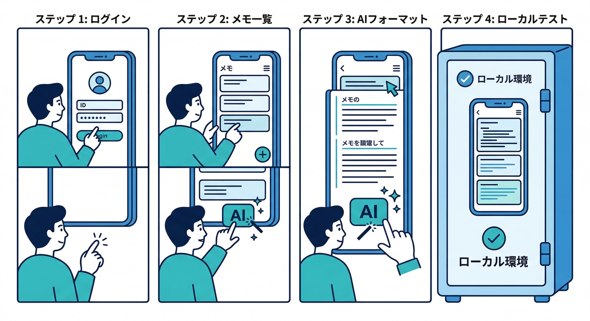
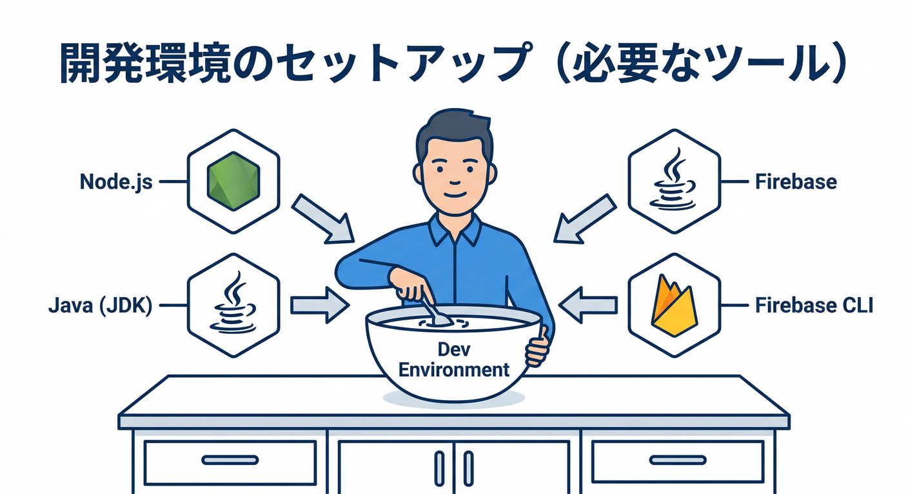
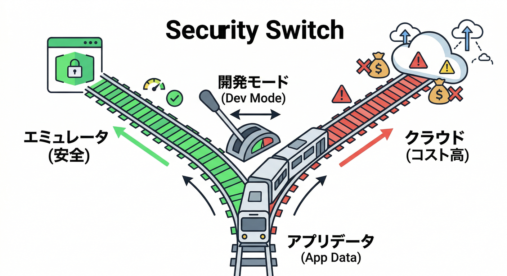
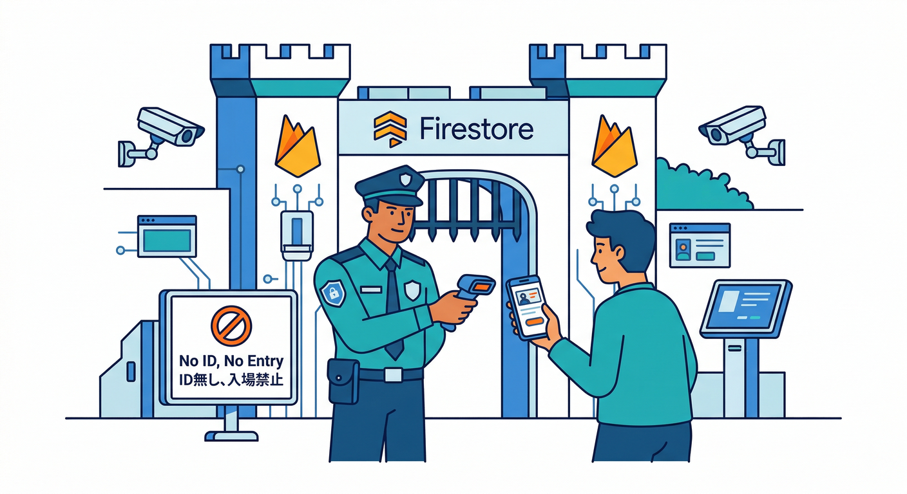
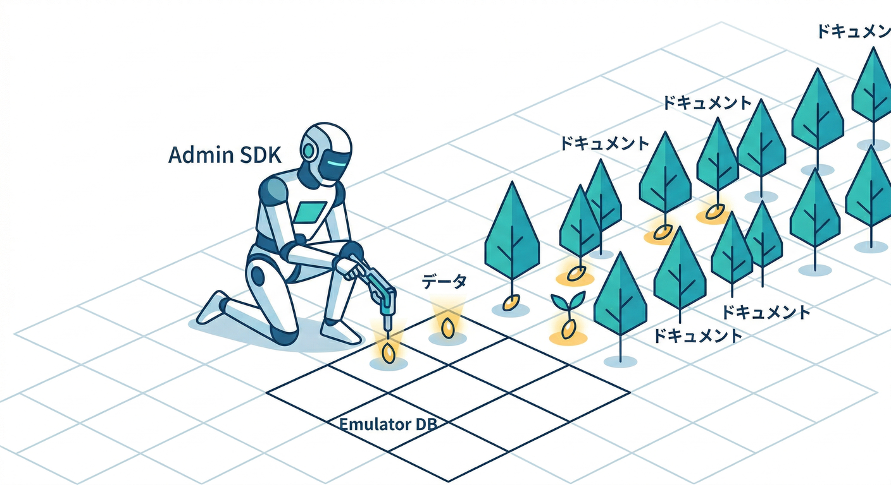
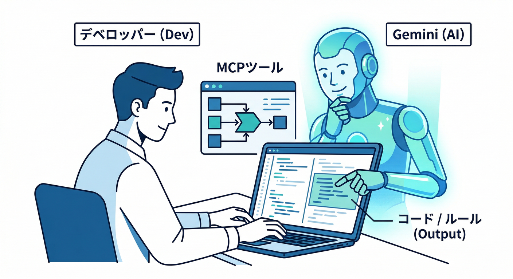

# ローカル開発：Emulator Suiteで安全に爆速開発🧪🧯：20章アウトライン

## この教材で作るミニ題材アプリ🎯



**「ログイン → メモCRUD（Firestore） → 自動整形ボタン（Functions） → ローカルで安全にテスト」**
エミュレータ上で全部回して、最後に本番へ“昇華”します🔥

---

## まず押さえる超重要ポイント3つ🧠✨


* **Emulator Suite**は、Firestore / Auth / Functions などをローカルで動かして安全に開発できるセットだよ🧪（UIも付いてる！）([Firebase][1])
* インストール要件として **Node.js と Java（JDK）** が必要（CLIでエミュレータを動かすため）([Firebase][2])
* 本番の Functions ランタイムは時期で変わるので、**“今の対応ランタイム”を前提に学ぶ**：Firebase Functions は **Node.js 22/20**、Python は **3.11/3.10** などが案内されてるよ（Node 18 は非推奨の流れ）([Firebase][3])

---

※ 1章10〜20分想定 ⏱️😄

### 1章　エミュレータって何がうれしいの？🧪✨

* **読む📖**：ローカルで安全に試せる理由、どのサービスが動くか
* **手を動かす🖐️**：Emulator Suite のUIを眺めて「何が見えるか」確認
* **ミニ課題🎯**：「本番でやると怖い操作」を3つ書き出す😱➡️🧪
* **チェック✅**：Emulator Suite が “ローカル版の各Firebase” だと説明できる([Firebase][1])

### 2章　インストール＆初期セットアップ⚙️



* **読む📖**：インストールに必要なもの、CLIの役割
* **手を動かす🖐️**：Firebase CLI導入 → プロジェクトで初期化
* **ミニ課題🎯**：`firebase init` で必要な項目を選べる
* **チェック✅**：Node/Java要件を理解してる([Firebase][2])

### 3章　起動コマンド入門：まずは動かす！🚀

* **読む📖**：`firebase emulators:start` の意味、`--only` の使いどころ
* **手を動かす🖐️**：Auth/Firestore/Functions を起動→UIへアクセス
* **ミニ課題🎯**：Functions だけ起動してみる
* **チェック✅**：`--only` を説明できる([Firebase][4])

```bash
firebase emulators:start --only auth,firestore,functions
```

### 4章　“安全スイッチ”を作る：接続先を切り替えよう🔀🧠



* **読む📖**：アプリが「本番」へ行かない工夫（開発時だけエミュレータへ）
* **手を動かす🖐️**：React側に“エミュ接続コード”を追加
* **ミニ課題🎯**：起動時にエミュへ接続できたら画面に表示
* **チェック✅**：接続切替の目的が言える

### 5章　Auth Emulator：ログインをローカルで成立させる🔐🙂

* **読む📖**：Auth Emulatorの特徴（トークンの扱いなど）
* **手を動かす🖐️**：Web SDK で Auth を Emulator に向ける
* **ミニ課題🎯**：UIからテストユーザーを作成してログイン
* **チェック✅**：`connectAuthEmulator` を使える([Firebase][5])

```ts
import { getAuth, connectAuthEmulator } from "firebase/auth";
const auth = getAuth();
connectAuthEmulator(auth, "http://127.0.0.1:9099");
```

### 6章　Firestore Emulator：CRUDをローカルで爆速体験🗃️⚡

* **読む📖**：Firestore エミュの基本と REST 入口
* **手を動かす🖐️**：メモの追加/一覧/更新/削除
* **ミニ課題🎯**：メモに「状態（下書き/公開）」フィールド追加
* **チェック✅**：Firestore emulator のRESTエンドポイントの存在を知ってる([Firebase][6])

### 7章　Emulator UIでデバッグ：目で追う👀🔍

* **読む📖**：UIで何が見える？（リクエスト、ログ、データ）
* **手を動かす🖐️**：Firestore の Requests を見て、どの操作が飛んだか確認
* **ミニ課題🎯**：1回の画面操作で “どんな読み書き” が起きたかメモ
* **チェック✅**：Requests Monitor の意味が言える（Rules評価の追跡もできる）([Firebase][6])

### 8章　Rules入門：まず“事故らない形”を覚える🛡️😇



* **読む📖**：Rules＝入口の門番、考え方
* **手を動かす🖐️**：自分のメモは読める・他人のは読めない、をRulesで作る
* **ミニ課題🎯**：必須フィールド（title等）が無い書き込みを拒否
* **チェック✅**：Rulesを変えて挙動が変わるのを確認できた

### 9章　Rulesの“見える化”：評価トレースを読む🧠🧾

* **読む📖**：なぜ拒否された？を “推理” できるように
* **手を動かす🖐️**：わざと弾かれる書き込みをして、UIで評価を追う
* **ミニ課題🎯**：弾かれた理由を「1文」で説明
* **チェック✅**：UIでRules評価シーケンスを追える([Firebase][6])

### 10章　データの初期化と再現：同じ状態から何度でも🧪🔁

* **読む📖**：テストは「同じ初期状態」が正義
* **手を動かす🖐️**：エミュのデータを保存→復元（import/export系）
* **ミニ課題🎯**：毎回同じユーザー＋同じメモ10件から開始できるようにする
* **チェック✅**：シナリオテストが安定する理由を言える

### 11章　Functions Emulator：裏側コードをローカルで動かす⚙️🔥

* **読む📖**：Functions emulator が対応するトリガー種別
* **手を動かす🖐️**：HTTP関数を1つ作ってローカル起動
* **ミニ課題🎯**：「/hello」でJSONを返す関数
* **チェック✅**：`emulators:start --only functions` を使える([Firebase][4])

### 12章　TypeScript Functionsの罠：ビルドと起動の流れ🧱😵‍💫➡️😄

* **読む📖**：TSは“コンパイルが必要”なこと
* **手を動かす🖐️**：`npm run build` → `firebase emulators:start`
* **ミニ課題🎯**：`npm run serve` 的なショートカット運用を作る
* **チェック✅**：ビルドが必要な理由を説明できる([Firebase][7])

### 13章　環境変数と秘密情報：ローカルでも事故らない🧪🔐

* **読む📖**：`.env.local` / `.secret.local` の考え方
* **手を動かす🖐️**：ローカルだけAPIキーっぽい値を差し替えて動作確認
* **ミニ課題🎯**：秘密をログに出さないようにする
* **チェック✅**：Functions emulator でローカル上書きできることを知ってる([Firebase][8])

### 14章　連携テスト①：Auth × Firestore（本人だけ読める）👮‍♂️🗃️

* **読む📖**：AuthがあるとRulesが強くなる
* **手を動かす🖐️**：ログイン中だけメモ一覧が見えるように
* **ミニ課題🎯**：未ログイン時のUX（メッセージ表示）も整える
* **チェック✅**：ログイン有無で読める範囲が変わる

### 15章　連携テスト②：Firestoreイベント → Functions自動処理⚡📨

* **読む📖**：DB更新トリガーで自動処理できる
* **手を動かす🖐️**：メモ追加時に「整形済みフィールド」を作る関数
* **ミニ課題🎯**：整形の結果をFirestoreに保存して画面に反映
* **チェック✅**：ローカルで“自動処理が回る”のを見た

### 16章　テスト実行を自動化：`emulators:exec` で一気通貫🏃‍♂️💨

* **読む📖**：起動→テスト→終了をワンコマンドにする意味
* **手を動かす🖐️**：テストスクリプトを作って `emulators:exec` 実行
* **ミニ課題🎯**：テスト成功/失敗で終了コードを変える
* **チェック✅**：`emulators:exec` を説明できる([Firebase][4])

### 17章　サーバーSDKでもエミュにつなぐ：Admin SDK視点🧠🧰



* **読む📖**：フロントだけじゃなく“裏側ツール”もエミュ接続できる
* **手を動かす🖐️**：Admin SDK（Node）でユーザーやデータを作る“種まき”を作成
* **ミニ課題🎯**：seedスクリプトを1回で流せるように
* **チェック✅**：エミュ向け環境変数の考え方を理解
  （Auth emulator と Admin SDK の接続は環境変数で自動接続できる説明あり）([Firebase][5])

### 18章　AIを開発に混ぜる：Firebase MCP × Geminiで加速🤖💨



* **読む📖**：Firebase MCPサーバーで、AIがFirebase操作を手伝える
* **手を動かす🖐️**：Gemini CLI（Firebase拡張）に「Rulesテストの雛形」や「seed方針」を作らせる
* **ミニ課題🎯**：AIが作ったRulesを自分でレビューして改善
* **チェック✅**：AIは“叩き台作成→人間チェック”が基本だと分かる
  （Firebase MCPは Gemini CLI / エージェントから Firebase を扱うための仕組みとして案内されてる）([Firebase][9])

### 19章　AIサービスも絡める：AI Logic/Genkitを“壊さず試す”🧩🤖

* **読む📖**：ローカルはエミュ、AIは“呼び出し方を安全に設計”がコツ
* **手を動かす🖐️**：Functions側に「AI整形」処理を置く想定で、ローカルはダミー応答→本番はAI実呼び出しの2モードにする
* **ミニ課題🎯**：AIの戻りをJSON化してUIに反映（整形結果・理由など）
* **チェック✅**：AIを“テスト可能な形”に分解できた
  （AI Logicのドキュメントにはモデル提供や更新の注意があるので、教材でも“モデル切替を前提”にするのが安心）([Google Cloud Documentation][10])

### 20章　ローカル→本番へ昇華：移行手順書を完成させる🧾🏁

* **読む📖**：ローカルと本番の“違いが出る場所”を知る（Secrets/環境/課金/権限）
* **手を動かす🖐️**：検証用プロジェクトへデプロイ→動作確認→本番に持ち込みやすい形へ整理
* **ミニ課題🎯**：「デプロイ前チェックリスト」を自分用に作る
* **チェック✅**：自分で“安全な移行手順”を説明できる

---

## 付録：ランタイムの目安まとめ🧠🧾（教材中で迷子になりやすい所）

* **Firebase Cloud Functions**（FirebaseのFunctions）は、現行ドキュメントで **Node.js 22/20、Python 3.11/3.10** などが案内されてるよ([Firebase][3])
* もし **.NET** も絡めるなら、「Firebase Functionsそのもの」ではなく、**Cloud Run functions（2nd gen）/ Cloud Run** 側で **.NET 8** や **Python 3.13** といったランタイムが出てくる（サーバー処理はAdmin SDKでFirebaseと連携、が王道）([Google Cloud Documentation][11])
* ローカル開発の Node は、今だと **Node.js v24 が LTS** として配布されてる（学習環境はこれを基準にしてOK）([Node.js][12])
* TypeScript は **5.9（stable）/ 6.0（beta）** の情報が出てるので、教材は 5.9 を軸にしつつ、6.0の話題も“軽く触れる”が安全😄([Microsoft for Developers][13])

---


[1]: https://firebase.google.com/docs/emulator-suite?utm_source=chatgpt.com "Introduction to Firebase Local Emulator Suite"
[2]: https://firebase.google.com/docs/emulator-suite/install_and_configure?utm_source=chatgpt.com "Install, configure and integrate Local Emulator Suite - Firebase"
[3]: https://firebase.google.com/docs/functions/manage-functions "Manage functions  |  Cloud Functions for Firebase"
[4]: https://firebase.google.com/docs/functions/local-emulator?utm_source=chatgpt.com "Run functions locally | Cloud Functions for Firebase - Google"
[5]: https://firebase.google.com/docs/emulator-suite/connect_auth "Connect your app to the Authentication Emulator  |  Firebase Local Emulator Suite"
[6]: https://firebase.google.com/docs/emulator-suite/connect_firestore?utm_source=chatgpt.com "Connect your app to the Cloud Firestore Emulator - Firebase"
[7]: https://firebase.google.com/docs/functions/typescript?utm_source=chatgpt.com "Use TypeScript for Cloud Functions - Firebase - Google"
[8]: https://firebase.google.com/docs/emulator-suite/connect_functions?utm_source=chatgpt.com "Connect your app to the Cloud Functions Emulator - Firebase"
[9]: https://firebase.google.com/docs/ai-assistance/mcp-server?hl=ja "Firebase MCP サーバー  |  Develop with AI assistance"
[10]: https://docs.cloud.google.com/firestore/native/docs/connect-ide-using-mcp-toolbox?utm_source=chatgpt.com "Use Firestore with MCP, Gemini CLI, and other agents"
[11]: https://docs.cloud.google.com/functions/docs/release-notes "Cloud Run functions (formerly known as Cloud Functions) release notes  |  Google Cloud Documentation"
[12]: https://nodejs.org/en/download?utm_source=chatgpt.com "Download Node.js"
[13]: https://devblogs.microsoft.com/typescript/ "TypeScript"
