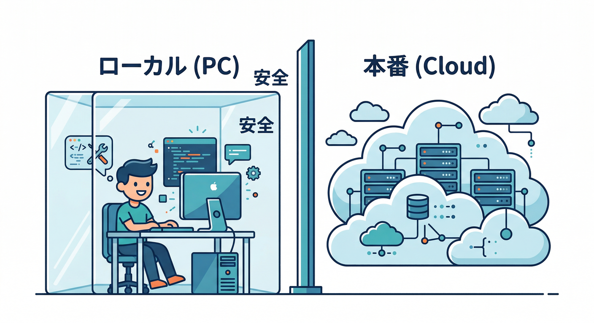
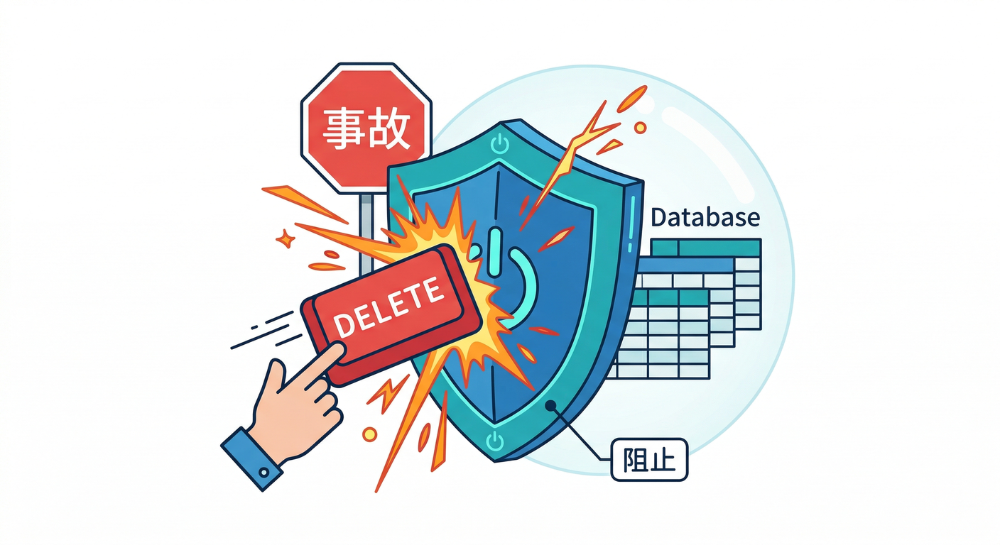
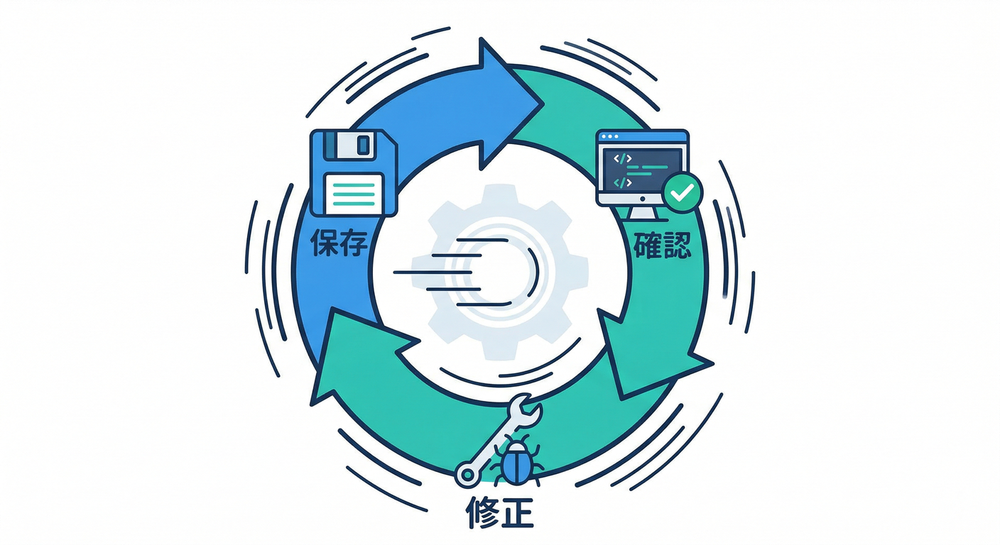
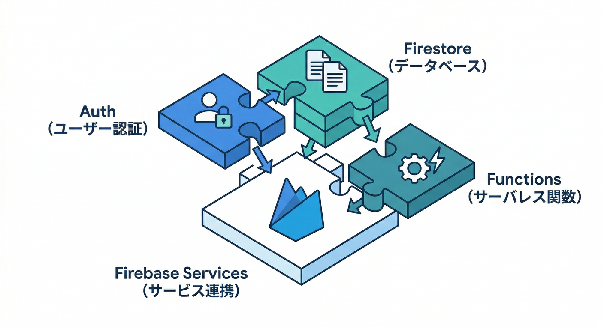
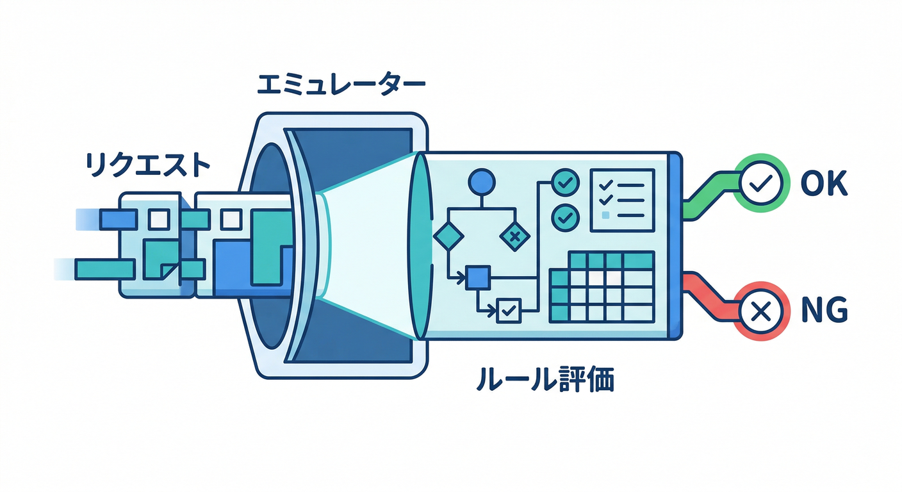
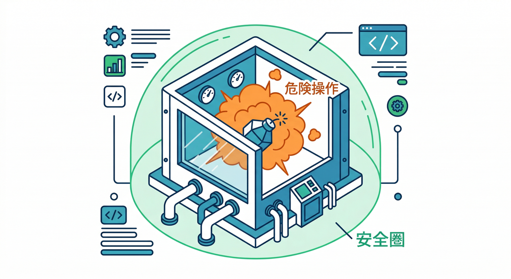

# 第1章　エミュレータって何がうれしいの？🧪✨

この章は「まず“意味”をつかむ回」です😊
細かい設定は後の章でやるので、ここでは **“なぜエミュレータが開発を幸せにするのか”** を体に入れます💪✨

---

## この章のゴール🎯

読み終わったら、こんな説明ができればOK👇

* **Emulator Suite＝ローカルで動く“Firebaseっぽい環境セット”** だと説明できる🧠
* **本番に触らずに試せるのが最大の価値**って言える🧯
* **UIで何が見えるのか**（データ・リクエスト・ルール評価など）をイメージできる👀🔍

（ここが言えたら、次章以降が爆速で進みます⚡）

---

## Emulator Suiteを一言でいうと…🧪



**「本番Firebaseに触らずに、ローカルで同じように動かしてテストできる仕組み」**です🧯✨
Auth / Firestore / Functions などを“ローカルで動く版”としてまとめて使える感じ！([Firebase][1])

しかも、**Emulator Suiteには専用のUI（管理画面）も付いてる**ので、目で見ながらデバッグできます👀✨([Firebase][1])

---

## 何がうれしいの？ベスト5🏆✨

### ① 本番事故を防げる🧯（いちばん大事）



* 「データ消した😱」「ルール間違えて公開した😱」みたいな **取り返しのつかない事故**を、ローカルで回避できます。

### ② 速い⚡（待ち時間が減る）



* デプロイを待たずに、ローカルで **保存→確認→修正** のループが回るので、体感速度が上がります🏃‍♂️💨

### ③ お金・クォータの不安が減る💸➡️🙂

* “試行錯誤”は回数が増えがち。ローカルに寄せると安心です。

### ④ 目で追える👀（初心者に超やさしい）

* Emulator UIで「今なにが起きた？」が見えます。
  たとえば Firestore は **Requests タブで、リクエストと Rules の評価結果まで追える**んです🧾🔍([Firebase][2])

### ⑤ 同じ初期状態から何度でも試せる🔁

* テストって「毎回同じ状態から始められる」だけで強くなります💪
  この教材でも、後半で **import/export** で再現性を作ります🧪

---

## ローカルで動くFirebaseたち🧩（ざっくり把握でOK）



Emulator Suite は複数サービスのエミュレータをまとめて扱えます。代表どころは👇([Firebase][1])

* 🔐 Authentication
* 🗃️ Cloud Firestore
* 🌊 Realtime Database
* 🧊 Cloud Storage for Firebase
* ⚙️ Cloud Functions
* 🌐 Hosting
* 📩 Pub/Sub
* 🧩 Extensions

「え、そんなに？」って思ったら正解です😂
だからこそ **“まとめてローカルで回す”** のが強いんですね。

---

## Emulator UIって何が見えるの？👀✨



エミュレータを起動すると、ブラウザで **Emulator Suite UI** が開けます（既定は `http://localhost:4000`） ([Firebase][3])

ここで見えるもの（イメージ）👇

* 🔐 Auth：テストユーザーの作成・ログイン確認
* 🗃️ Firestore：データ／クエリ結果／そして **Requests**
* ⚙️ Functions：ログ、呼び出し状況
* 🧾 Rules：拒否された理由の手がかり（後の章で深掘り！）

特に初心者が感動しやすいのはこれ👇
**Firestore → Requests タブで、各リクエストと Security Rules の評価まで見える**👀🧾([Firebase][2])
「なんで弾かれたの？」が、推理じゃなく“確認”になります😄

---

## ちょい先取り：AIと組み合わせると、さらに爆速🤖💨

この教材はAI導入済みなので、ここが強いです🔥

### 🤖 AIが得意なこと（例）


* 「本番で怖い操作」を洗い出して、**事故らない手順**に落とす
* Security Rules を“それっぽく”作る → 人間がレビューして直す🛡️
* seed（初期データ投入）方針やテスト観点を提案してもらう🧠

### 🧰 Gemini CLI / エージェント × Firebase の接続（MCP）

最近のFirebaseは **MCPサーバーや Gemini CLI 拡張**など「AI支援開発」をかなり前に出してます。
たとえば Firestore は **Gemini CLI用の拡張（MCP toolbox / Firestore extension）**が用意されていて、エージェントから扱う導線が案内されています([Google Cloud Documentation][4])。さらに Gemini CLI の Firestore 拡張は **必要なMCPサーバーを自動で入れる**ことも説明されています([Firebase][5])。

### 🧩 FirebaseのAIサービスそのものも絡める

アプリ側のAI機能としては、**Firebase AI Logic で Gemini / Imagen を使った機能を組み込める**と案内されています([Firebase][6])。
この教材のミニ題材「自動整形ボタン」は、まさにここにつながります✍️✨（ローカルで安全に試せる形に分解していきます）

---

## 手を動かす🖐️：Emulator UIを“見学”しよう👀🎒

まだ起動してなくても大丈夫！今は「入口」を知るだけでOKです😊

1. ブラウザで `http://localhost:4000` を開く（起動していればUIが出ます）([Firebase][3])
2. 画面のメニューで Firestore を選ぶ
3. **Requests タブ**があるか探す
4. 「リクエストが並ぶ」「Rules評価が見える」…という未来を想像する😄([Firebase][2])

「今日は表示できなかった🥲」でもOK！
第3章でちゃんと起動します🚀

---

## ミニ課題🎯：「本番でやると怖い操作」を3つ書き出そう😱➡️🧪



ノートにこれを3つ書いてみてください👇（短文でOK）

* 😱 **怖い操作**：
* 🧯 **何が起きる？**：
* 🧪 **エミュならどう安全？**：

例（こんな感じ）👇

* 😱「本番のFirestoreで削除」→ 🧯戻せない → 🧪ローカルなら消してもOK
* 😱「Rulesを緩めすぎ」→ 🧯全公開事故 → 🧪ローカルで拒否/許可を検証
* 😱「Functionsが暴発して通知連打」→ 🧯ユーザー体験崩壊 → 🧪ローカルでログ確認

---

## Geminiに投げる用プロンプト例🤖📝（コピペOK）

```text
あなたはFirebase初心者向け講師です。
「ログイン→メモCRUD→Functionsで自動整形」を作っています。

質問：
1) 本番でやると危ない操作を3つ、初心者向けに挙げて
2) それぞれ、Emulator Suiteを使うとどう安全に試せるかを書いて
3) Emulator UIで初心者が見るべきポイント（Auth/Firestore/Functions）を箇条書きで
```

AIの答えは“叩き台”なので、**「それ本当に危ない？」を自分の言葉で直す**のがポイントです🛠️🙂

---

## チェック✅（3つ答えられたら勝ち🎉）

* Q1. Emulator Suiteって何？（一言で）
* Q2. 何が一番うれしい？（理由つきで）
* Q3. Emulator UIで「初心者が見ると得する場所」はどこ？

目標回答のイメージ👇

* A1「本番に触らずローカルでFirebaseを動かして試せるやつ」([Firebase][1])
* A2「事故らない。試行錯誤しても本番が汚れない」([Firebase][1])
* A3「FirestoreのRequestsでリクエストとRules評価が見える」([Firebase][2])

---

## ついでに超重要な“2026の空気”だけ🌬️🧠

* **Node.js v24 は Active LTS**です（2026-02-09更新の公式表）([Node.js][7])
* Firebase CLI は **Node 24 対応が追加**されています（CLIリリースノート）([Firebase][8])

つまり「最新Nodeでローカル開発」も現実的になってきてます👍✨

---

次の第2章では、必要なものをそろえて **“エミュを動かす準備”** に入ります⚙️🚀

[1]: https://firebase.google.com/docs/emulator-suite "Introduction to Firebase Local Emulator Suite"
[2]: https://firebase.google.com/docs/emulator-suite/install_and_configure "Install, configure and integrate Local Emulator Suite  |  Firebase Local Emulator Suite"
[3]: https://firebase.google.com/docs/emulator-suite/connect_and_prototype "Connect your app and start prototyping  |  Firebase Local Emulator Suite"
[4]: https://docs.cloud.google.com/firestore/native/docs/connect-ide-using-mcp-toolbox "Use Firestore with MCP, Gemini CLI, and other agents  |  Firestore in Native mode  |  Google Cloud Documentation"
[5]: https://firebase.google.com/docs/ai-assistance/gcli-extension "Firebase extension for the Gemini CLI  |  Develop with AI assistance"
[6]: https://firebase.google.com/docs/ai-logic "Gemini API using Firebase AI Logic  |  Firebase AI Logic"
[7]: https://nodejs.org/en/about/previous-releases "Node.js — Node.js Releases"
[8]: https://firebase.google.com/support/release-notes/cli "Firebase CLI Release Notes"
