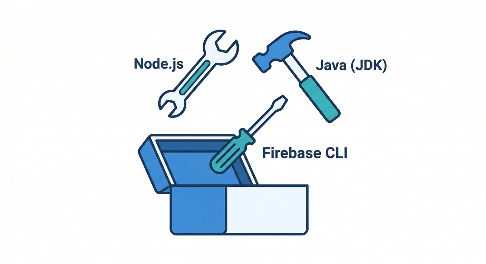
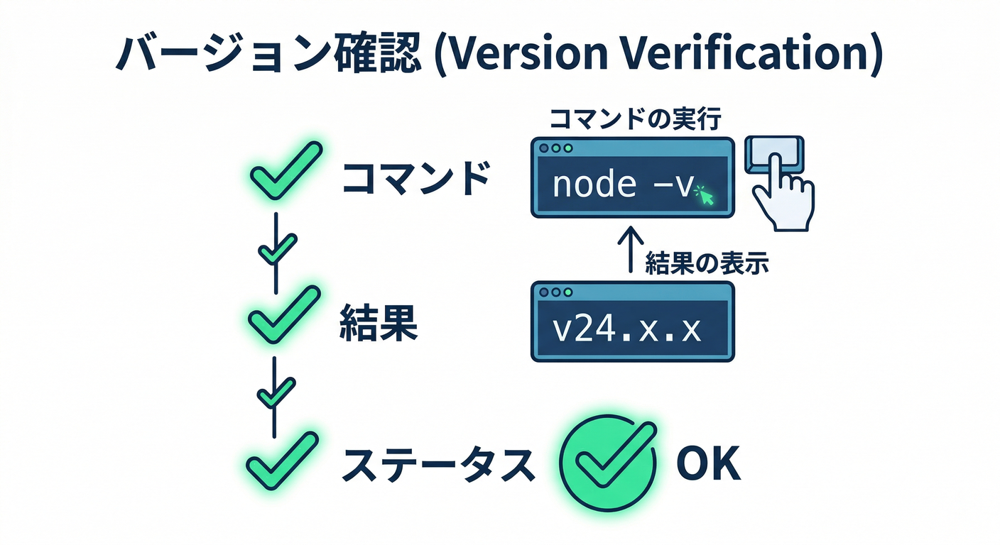
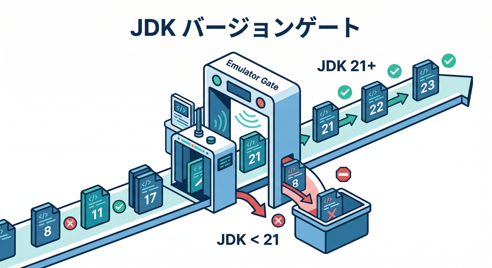
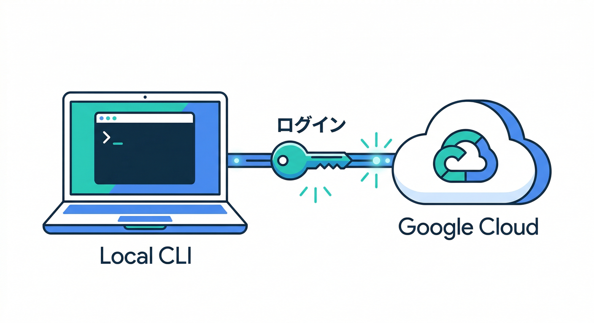
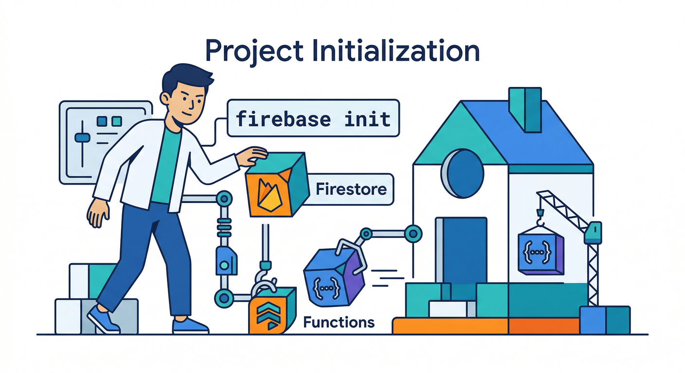
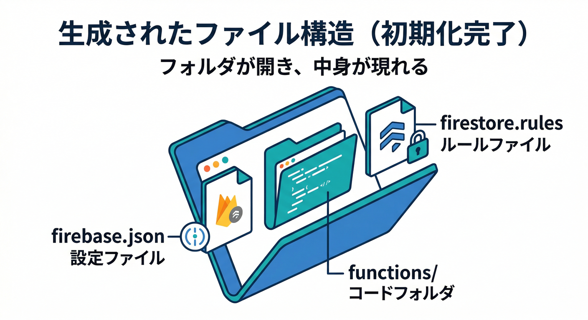

# 第2章　インストール＆初期セットアップ⚙️🧪（ここで“爆速の土台”を作る）

この章のゴールはシンプル👇
**「Emulator Suite を動かすための必須ツールを入れて、`firebase init` まで到達する」**です🔥

---

## この章で出てくる“3点セット”🧰✨



* **Node.js**：Firebase CLI を動かす中心エンジン（CLIは Node 18 以上が要件）([Firebase][1])
* **Java（JDK）**：エミュレータが内部で使う（昔より条件が上がって、**Java 21 未満は非対応**になりました）([Firebase][2])
* **Firebase CLI**：`firebase init` / `firebase emulators:*` の司令塔（npm で入れるのが定番）([Firebase][1])

> ちなみに、エミュレータのインストール手順として「`firebase init emulators`」が案内されています([Firebase][3])
> （最初は必要なバイナリをダウンロードするので、初回だけ少し時間がかかりがち💿）

---

## 2-0　まず“入ってるか”を秒速チェック⚡👀



ターミナル（PowerShellでもOK）でこれ👇

```bash
node -v
npm -v
java -version
firebase --version
```

* `node` と `npm` が出れば Node はOK👌
* `java -version` が出れば Java はOK👌
* `firebase --version` が出れば CLI はOK👌

ここで **`firebase` が無い**なら、次へ進もう🏃‍♂️💨

---

## 2-1　Node.js を入れる📦🟢（LTSでOK）

Node は “安定板（LTS）” を選ぶのが一番ラクです🙂
今のLTSラインは **v24 系**が「Active LTS」として案内されています([Node.js][4])

インストール後に、もう一回チェック👇

```bash
node -v
npm -v
```

✅ ここで **Node 18+** が満たせていれば CLI 要件クリアです([Firebase][1])

---

## 2-2　Java（JDK）を入れる☕🧱（“21以上”が安全）



エミュレータ周りは Java が必要です（Firestore Emulator などが裏で使うイメージ）📌
古い資料だと「JDK 11+」と書かれていることがあるんですが、CLIの変更で **Java 21 未満はエミュ起動非対応**になっています([Firebase][2])
なのでここは迷わず **JDK 21 以上**でいきましょう✅

入れたら確認👇

```bash
java -version
```

---

## 2-3　Firebase CLI を入れる🧰🔥（npmで一発）

公式の案内はこれ👇（グローバルインストール）([Firebase][1])

```bash
npm install -g firebase-tools
firebase --version
```

💡もし「更新したい」なら、同じコマンドをもう一回やるだけでOK（だいたい最新版になります）🆙

---

## 2-4　ログインする🔑🌐（ブラウザが開けない時のワザも）



普通はこれ👇

```bash
firebase login
```

でも、リモート環境等で「ローカルでブラウザが開けない」ケースがあります。
そのときは公式でも `--no-localhost` が案内されています([Firebase][1])

```bash
firebase login --no-localhost
```

---

## 2-5　プロジェクト用フォルダを作る📁✨（ここから“教材の本体”）

好きな場所に作ってOK。例👇

```bash
mkdir memo-ai-local
cd memo-ai-local
```

---

## 2-6　`firebase init` をやる🎛️🧪（ここがこの章のメイン！）



まずは初期化👇

```bash
firebase init
```

すると「何を使う？」って聞かれます（チェックボックス式）✅
この教材のミニ題材（ログイン→メモ→整形→ローカルテスト）に寄せるなら、まずはこのへんを選ぶとスムーズ👇

* **Firestore**
* **Functions**
* **Emulators**
* （余裕があれば）**Hosting**

👀ポイント：**Emulators は `firebase init emulators` でも初期化できる**、というのが公式の流れです([Firebase][3])
（`firebase init` から入っても、結局やることは同じ感じ👍）

### Functions の選び方（超初心者向けの安全ルート）🧯

* 言語は **TypeScript** を選ぶ（この教材の本線）
* Lint は「後で整える」でもOKだけど、迷うなら有効でOK🙂
* dependencies のインストールは “Yes” でOK（勝手に揃う）

※ 最近の CLI では **Cloud Functions の Node.js 24 ランタイム対応**なども追加されてます([Firebase][5])
（ローカルの Node と “本番ランタイム” は別物なので、ここは後の章で整理するよ🧠）

### Emulators の選び方🧪

この教材で使う候補はだいたい👇

* Authentication Emulator
* Firestore Emulator
* Functions Emulator

ポートはデフォルトで進めてOK（あとで変えられる）🔧
（エミュレータは初回にダウンロードが走るので、ここで「何か落としてるな〜」ってなります💿）

---

## 2-7　できあがりの“目印ファイル”を確認👀✅



`firebase init` が成功してると、だいたいこんな子たちができます👇

* `firebase.json`（エミュ設定の中心）
* `.firebaserc`（プロジェクトIDのひも付け）
* `functions/`（関数のコード置き場）
* `firestore.rules` / `firestore.indexes.json`（Firestore選んでれば）

ここまで来たら、**第3章で「起動してUIを見る🚀」に進める状態**です👏

---

## 🤖AIを“第2章から”混ぜるコツ（つまずき即死回避🧯）


ここ超大事。初心者が詰まりやすいのは「エラー文が怖い」問題😱
でも今は **Gemini にエラーを貼るだけでほぼ進めます**✨

## 使えるテンプレ（コピペ用）📋💨

* 「このエラーを“文系向け”に説明して」
* 「原因を3つに絞って、確認コマンドも出して」
* 「直す手順を、最短ルート→安全ルートの順で」

さらに、Firebase には **MCP サーバー**が用意されていて、**Gemini CLI / エージェントから Firebase 操作を補助**できる流れが公式で案内されています。しかも **Antigravity がサポート対象に入っています**([Firebase][6])
加えて Gemini CLI 側の Firebase 拡張は、`/firebase:init` みたいな“初期化系のショートカット”も提供しています([Firebase][7])

> つまり第2章は「AIに初期化の叩き台を作らせて、人間が確認して進める」がめちゃ強い💪🤖

---

## ミニ課題🎯🧩（5分）

次の3つを満たして、スクショ or メモを残そう📸📝

1. `node -v` と `java -version` の結果が出る
2. `firebase --version` の結果が出る
3. `firebase init` が終わって、フォルダに `firebase.json` ができてる

---

## チェック✅（声に出して言えたら勝ち🏆）

* 「Firebase CLI は npm で入れる」って言える([Firebase][1])
* 「エミュは Java 21+ じゃないと詰む可能性がある」って言える([Firebase][2])
* 「`firebase init` と `firebase init emulators` の役割の違いがなんとなく分かる」([Firebase][3])
* 「詰まったら Gemini にエラー貼って“原因3つ＋確認コマンド”で切り分けできる」🤖([Firebase][6])

---

## よくある詰まりポイント集🧯（ここだけ見れば復活できる）

* `firebase` が見つからない → **新しいターミナルを開き直す**（PATH反映）→ダメなら `npm install -g firebase-tools` を再実行([Firebase][1])
* `java` が見つからない → JDK入れ直し＋ `java -version` が通るか確認
* エミュ起動で Java 関連のエラー → **Java 21 未満**の可能性が高い（まずここを疑う）([Firebase][2])
* ログインでブラウザが開けない → `firebase login --no-localhost` を試す([Firebase][1])

---

次の章（第3章）は、いよいよ **`firebase emulators:start` で起動して、Emulator UI を見に行く🚀👀** だよ！

[1]: https://firebase.google.com/docs/cli "Firebase CLI reference  |  Firebase Documentation"
[2]: https://firebase.google.com/support/release-notes/cli "Firebase CLI Release Notes"
[3]: https://firebase.google.com/docs/emulator-suite/install_and_configure "Install, configure and integrate Local Emulator Suite  |  Firebase Local Emulator Suite"
[4]: https://nodejs.org/en/about/previous-releases?utm_source=chatgpt.com "Node.js Releases"
[5]: https://firebase.google.com/support/release-notes/cli?utm_source=chatgpt.com "Firebase CLI Release Notes"
[6]: https://firebase.google.com/docs/ai-assistance/mcp-server "Firebase MCP server  |  Develop with AI assistance"
[7]: https://firebase.google.com/docs/ai-assistance/gcli-extension "Firebase extension for the Gemini CLI  |  Develop with AI assistance"
