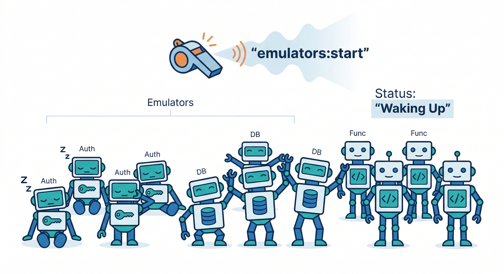
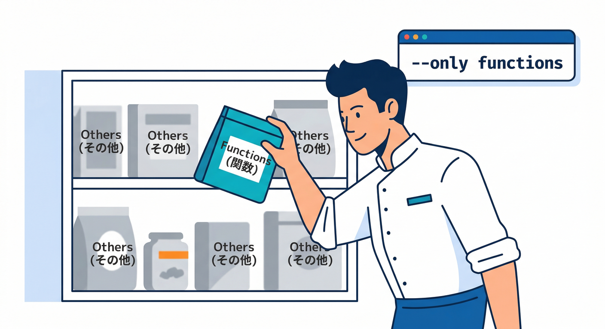
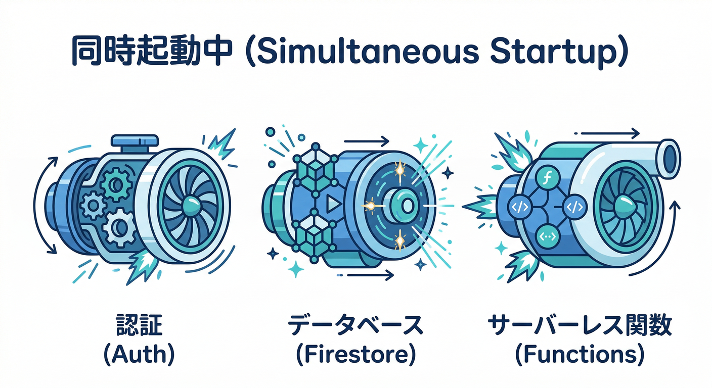
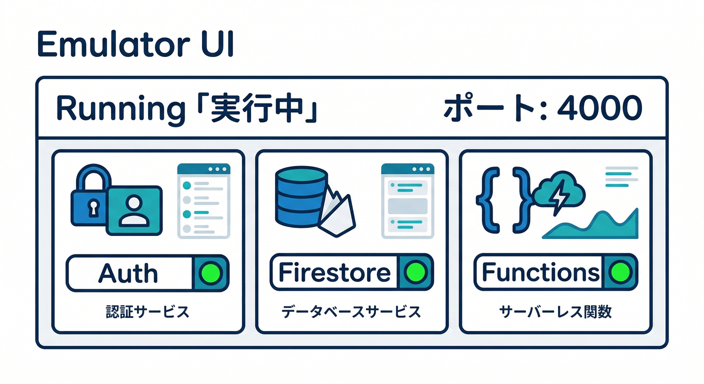
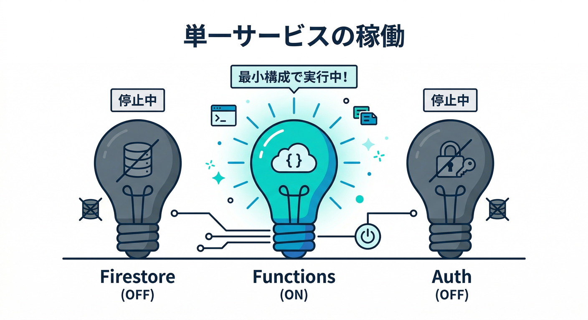
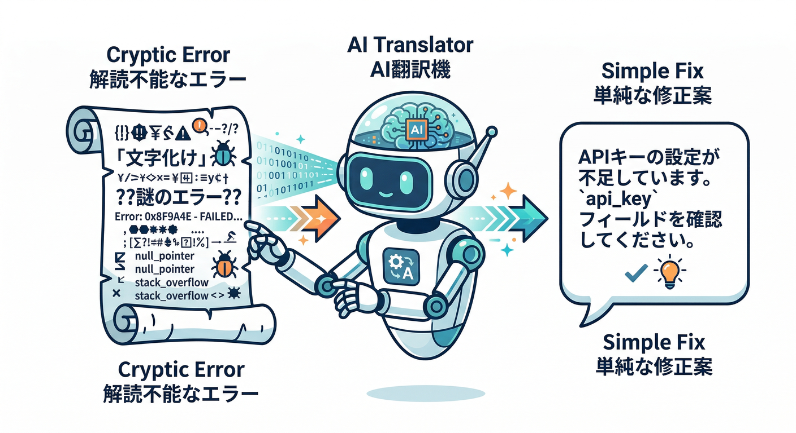

# 第3章　起動コマンド入門：まずは動かす！🚀🧪

この章のゴール🎯
「エミュレータを起動する → ブラウザのUIで“動いてる”を確認する → 必要なものだけ起動できる（`--only`）」まで行ければOKです🙆‍♂️✨
（まだアプリ側の接続は第4章でやるので、ここは“起動と確認”に集中します！）

---

## 1) `firebase emulators:start`って何するコマンド？🤔💡



`firebase emulators:start` は、あなたのプロジェクトで初期化（`firebase init`）されているエミュレータ達をまとめて起動するコマンドだよ🧰🔥
どれを起動するかは基本「プロジェクトの設定（`firebase.json` など）」で決まります。([Firebase][1])

そして起動後は、ブラウザで見られる管理UI（Emulator Suite UI）が立ち上がって、状態やログを確認できるのが強い💪👀
UIはデフォルトだと `http://localhost:4000` です（ただし最終的にはターミナル出力を正とするのが安全）([Firebase][2])

---

## 2) 今日いちばん大事：`--only` の考え方🔑✨



全部起動すると重い・うるさい・迷子になりがち😵‍💫
そこで「必要なサービスだけ起動する」のが `--only` です🔀

* ✅ 例：Functions だけ起動したい
  `firebase emulators:start --only functions` ([Firebase][1])
* ✅ 例：Auth / Firestore / Functions だけ起動したい
  `firebase emulators:start --only auth,firestore,functions`

> 使い分けのコツ🧠
>
> * 「今は起動確認だけ」→ まず `--only` で最小にする
> * 「動作確認で連携見たい」→ 必要な組み合わせだけ増やす

---

## 3) ハンズオン：3つ同時に起動してUIを見る👀🚀

### Step A：プロジェクトのフォルダに入る📁

`firebase.json` がいるフォルダで実行します。まずは現在地チェック🧭

```powershell
cd path\to\your\project
dir
```

ついでに “道具が動くか” だけ軽く確認（詰まった時の切り分けがラク）🔍

```powershell
firebase --version
node -v
java -version
```

> Emulator Suite のインストール要件として Node と Java が必要です。([Firebase][3])
> さらに Firestore エミュレータは将来的に Java 21 を要求する予定、という注意も出ています（古いJavaでエラーが出たらここが原因になりやすい）🧯([Firebase][4])

### Step B：起動！🚀（Auth/Firestore/Functions）



```powershell
firebase emulators:start --only auth,firestore,functions
```

起動に成功すると、ターミナルにだいたいこんな雰囲気のメッセージが出ます👇

* “All emulators ready! …”
* “View Emulator UI at [http://localhost:4000](http://localhost:4000)” ([Firebase][5])

### Step C：ブラウザで Emulator UI を開く🌐👀



`http://localhost:4000` を開くと、Overview（ダッシュボード）で “どのエミュが起動中か” がカードで見えます🧩✨([Firebase][2])

見る場所はここだけでOK👇

* **Authentication**：ユーザーが作れそうな画面がある（後の章で使う）🔐🙂
* **Firestore**：データ/リクエストが見える（後の章で神になる）🗃️⚡
* **Functions**：関数ログが流れる（後の章で主役）⚙️🔥

### Step D：停止🛑

止めるときは、起動したターミナルで **Ctrl + C**。
「止まったか不安😨」なら、ブラウザのUIが更新されなくなる＆ターミナルがプロンプトに戻るので分かります👌

---

## 4) ミニ課題：Functionsだけ起動してみる🎯⚙️



「最小構成で起動できる」を体に覚えさせるやつです💪😄

```powershell
firebase emulators:start --only functions
```

* ターミナル出力に **関数のURL形式**が出ることがあります
  URLはだいたい `http://$HOST:$PORT/$PROJECT/$REGION/$NAME` の形（デフォルト例だと 5001 ポート）([Firebase][6])
* UIも `http://localhost:4000` で見られます([Firebase][2])

「Functionsしか起動してないのにUIも出るの？」ってなるけど、UIは“監視画面”なので一緒に来る感じです😄📺

---

## 5) よくある詰まりポイント集🧯（ここだけ見れば復帰できる）

### ① “起動するエミュが無い” 系😵‍💫

`firebase emulators:start` が「起動するものが無い」っぽい時は、そもそもエミュ設定が入ってない可能性あり。
`firebase init emulators` で選んだエミュが `firebase.json` に書かれていくイメージです🧩([Firebase][3])

### ② ポートが埋まってる🚧


`EADDRINUSE` みたいなのが出たら「そのポート、誰か使ってる」って意味です😇
対処は2つ：

* そのポートを使ってるアプリを閉じる
* `firebase init emulators`（または `firebase.json`）でポート変更する ([Firebase][3])

UIのポートもデフォルト4000だけど、ターミナルに“実際のURL”が出るのでそこを見るのが確実👀([Firebase][2])

### ③ Node は新しすぎてもコケることがある⚠️

Node.js 自体は v24 が Active LTS（2026-02時点）だけど、`firebase-tools` 側が Node 24 対応を進行中…みたいな話も出ています🧩([Node.js][7])
一方で、Functions/CLI は Node 20/22 を “fully support” と明記してます。なので迷ったら Node 22（または20）に寄せると事故りにくいです✅([Firebase][5])

### ④ Java が古いと Firestore エミュで詰む☕

Firestore エミュは「近い将来 Java 21 が必要」って注意が出ています。謎エラーのときはここ疑うと早いです🧯([Firebase][4])

---

## 6) AIで“起動→原因特定→復帰”を爆速にする🤖💨



エミュレータはログが命！でも初心者だとログが怖い😱
そこでAIに“翻訳”させます🪄

しかも **Firebase MCP server** は、AIツール（Antigravity / Gemini CLI など）からFirebase操作やドキュメント参照を手伝える仕組みとして案内されています🧠✨([Firebase][8])

おすすめの使い方（コピペ用）📋👇

* 「この `firebase emulators:start` のログを貼るので、失敗原因を“1行”で言って→次にやる操作を3つ」
* 「`--only` の正しい使い分けを、初心者向けに例つきで説明して」([Firebase][1])
* 「ポート競合っぽい。Windowsで“どのプロセスが使ってるか”確認する手順を出して（安全なコマンドだけ）」

> AIのコツ🧠
> **AIの提案＝叩き台**。最終判断は“ターミナルの事実”で決めるのが安定です😄🔍

---

## 7) チェック✅（この章の合格ライン）

次を自分の言葉で言えたら勝ち🏆✨

* `firebase emulators:start` は「初期化されたエミュ達を起動する」([Firebase][1])
* `--only` は「必要なものだけ起動する」([Firebase][1])
* UIは基本 `http://localhost:4000`、でも最終的にはターミナル出力を見る ([Firebase][2])
* Firestore=8080、Auth=9099、Functions=5001 あたりが“よく見るデフォルト”で、URL形式も説明できる🧠([Firebase][9])

---

次の第4章では、React側から「本番に飛ばない安全スイッチ🔀」を入れて、**アプリがエミュに繋がる瞬間**を作りにいきます🔥🧩

[1]: https://firebase.google.com/docs/functions/local-emulator?utm_source=chatgpt.com "Run functions locally | Cloud Functions for Firebase - Google"
[2]: https://firebase.google.com/docs/emulator-suite/connect_and_prototype?utm_source=chatgpt.com "Connect your app and start prototyping - Firebase"
[3]: https://firebase.google.com/docs/emulator-suite/install_and_configure?utm_source=chatgpt.com "Install, configure and integrate Local Emulator Suite - Firebase"
[4]: https://firebase.google.com/docs/emulator-suite/connect_firestore?utm_source=chatgpt.com "Connect your app to the Cloud Firestore Emulator - Firebase"
[5]: https://firebase.google.com/docs/functions/get-started?utm_source=chatgpt.com "Get started: write, test, and deploy your first functions - Firebase"
[6]: https://firebase.google.com/docs/emulator-suite/connect_functions?utm_source=chatgpt.com "Connect your app to the Cloud Functions Emulator - Firebase"
[7]: https://nodejs.org/en/about/previous-releases?utm_source=chatgpt.com "Node.js Releases"
[8]: https://firebase.google.com/docs/ai-assistance/mcp-server?utm_source=chatgpt.com "Firebase MCP server | Develop with AI assistance - Google"
[9]: https://firebase.google.com/docs/emulator-suite/connect_auth?utm_source=chatgpt.com "Connect your app to the Authentication Emulator - Firebase"
