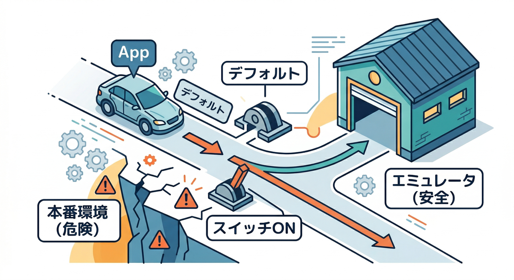
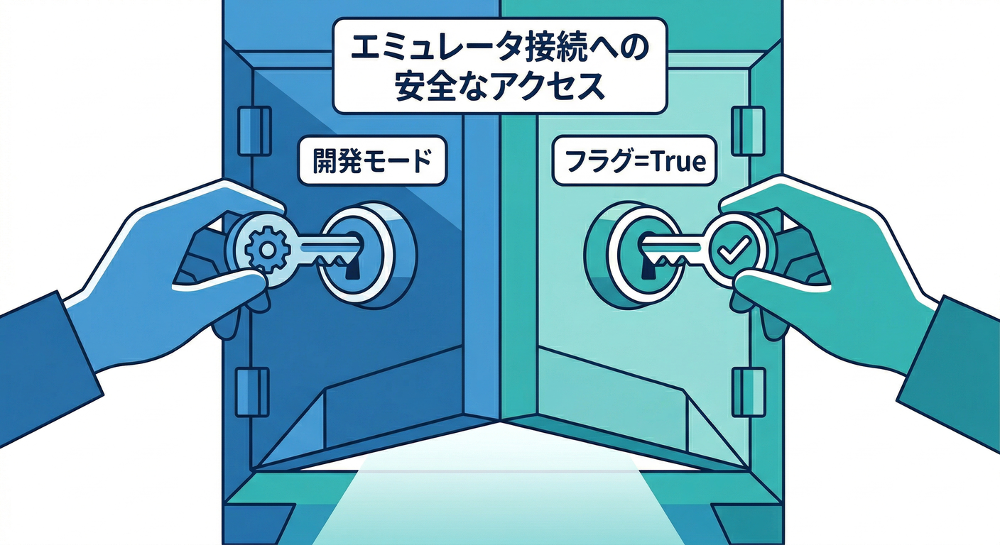
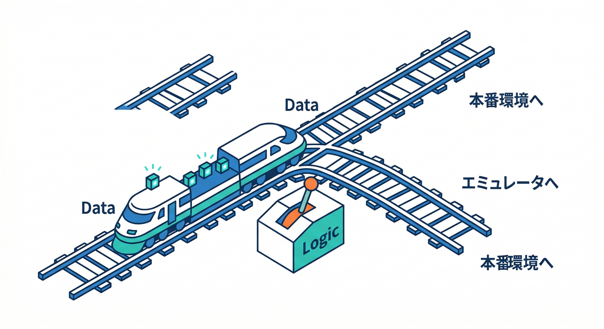
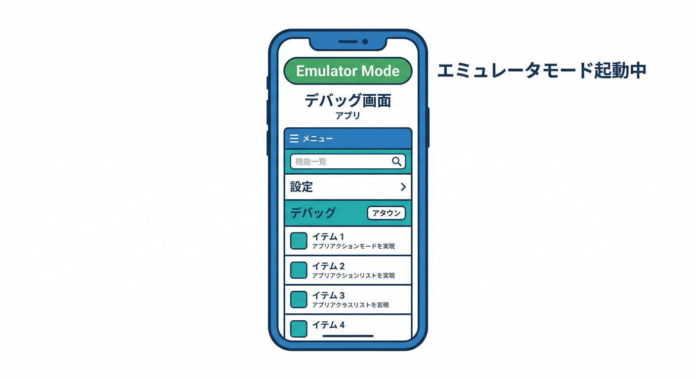
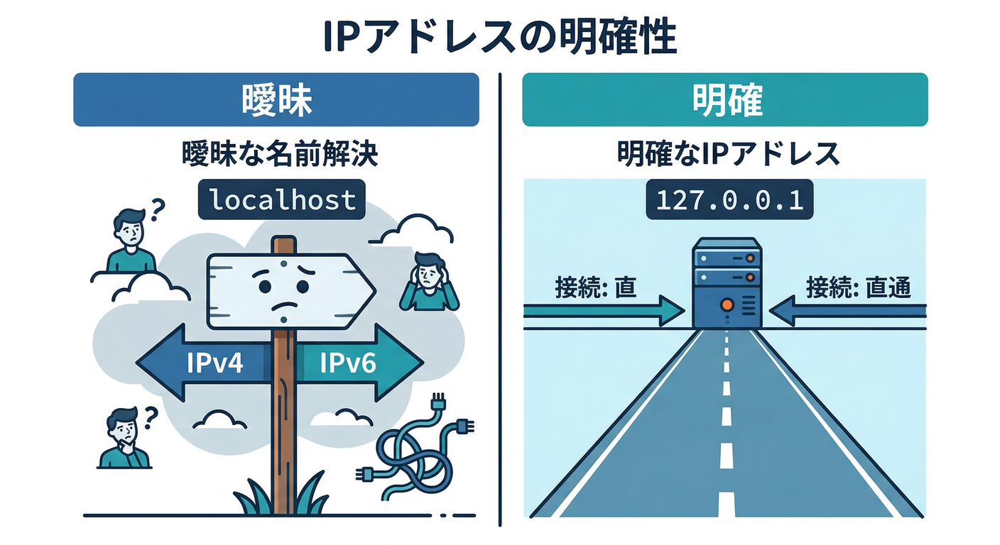
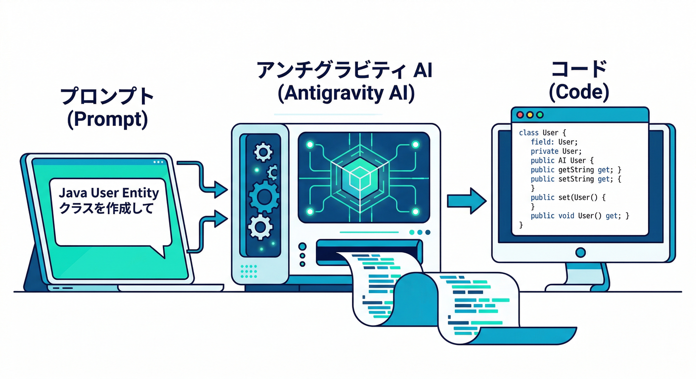

# 第4章　“安全スイッチ”を作る：接続先を切り替えよう🔀🧠

この章はひとことで言うと――
**「開発中はエミュレータへ✅／それ以外は本番へ✅」を、事故らない形で“自動で”切り替える仕組み**を作ります😄🧯

---

## 今日のゴール🎯✨

* ローカル開発中だけ、アプリが **Auth / Firestore / Functions** を **Emulator Suite** に向ける🧪
* 画面に **「いまエミュレータ接続中だよ！」バッジ** を出して、心理的にも安全にする🟩👀
* うっかり本番へ書き込む事故を、仕組みで潰す💣➡️🛡️

---

## まず大事な感覚：Firebaseは“何もしないと本番へ行く”🚨



Web SDK は、放っておくと **本番プロジェクト**へ接続します。
だから **「開発中だけエミュへ接続するコード」**が、いわば“安全スイッチ”なんです🧯🔌

ちなみに、エミュレータを動かす側には **Node.js と Java(JDK)** が必要です（要件は公式に明記）。([Firebase][1])
（細かいバージョンは章2〜3で整ってる前提でOK👌）

---

## 1) スイッチ設計：どう切り替える？🔀🧠



初心者におすすめはこの **2段ロック** です🔐🔐

1. **開発モード判定**（例：Viteの `DEV`）
2. さらに **明示フラグ**（例：`VITE_USE_EMULATORS=true`）

これで、たとえ開発モードでも **フラグを立てなければ本番**にできるので、安心感が段違いです😌✨

---

## 2) 手を動かす🖐️：`.env.local` に安全スイッチを作る🧷

プロジェクト直下に `.env.local` を作って、こう👇

```env
VITE_USE_EMULATORS=true
```

* `.env.local` は **ローカル専用**にしやすいので「うっかり本番でON」が起きにくい👍✨
* 本番ビルドでは “基本OFF” の運用にしやすいです🧠

---

## 3) 手を動かす🖐️：Firebase初期化に「エミュ接続」を差し込む⚙️



`src/lib/firebase.ts`（名前は好みでOK）を作って、**初期化を1箇所に集約**します📦✨
ポイントは **「1回だけ接続するガード」** を入れること（ReactのHMRで二重実行しがち😵‍💫）


```ts
// src/lib/firebase.ts
import { initializeApp } from "firebase/app";

import { getAuth, connectAuthEmulator } from "firebase/auth";
import { getFirestore, connectFirestoreEmulator } from "firebase/firestore";
import { getFunctions, connectFunctionsEmulator } from "firebase/functions";

// ✅ ここはあなたの firebaseConfig（章2〜3で用意済みの想定）
const firebaseConfig = {
  // apiKey: import.meta.env.VITE_FIREBASE_API_KEY,
  // ...
};

const app = initializeApp(firebaseConfig);

export const auth = getAuth(app);
export const db = getFirestore(app);
export const functions = getFunctions(app);

// ✅ “安全スイッチ”
const useEmulators =
  import.meta.env.DEV && import.meta.env.VITE_USE_EMULATORS === "true";

// ✅ 二重接続ガード（HMR対策）
const g = globalThis as unknown as { __emulatorsConnected?: boolean };

export function connectToEmulatorsIfNeeded() {
  if (!useEmulators) return { useEmulators: false };

  if (g.__emulatorsConnected) return { useEmulators: true };

  const host = "127.0.0.1";

  // Auth は URL 形式（http://...）で渡すのがポイント
  connectAuthEmulator(auth, `http://${host}:9099`);

  // Firestore / Functions は host と port を分けて渡す
  connectFirestoreEmulator(db, host, 8080);
  connectFunctionsEmulator(functions, host, 5001);

  g.__emulatorsConnected = true;
  return { useEmulators: true };
}
```

この “3つの接続関数” は、公式ドキュメントで案内されている定番APIです🧠✨

* Auth：`connectAuthEmulator(auth, "http://127.0.0.1:9099")` ([Firebase][2])
* Firestore：`connectFirestoreEmulator(db, host, port)`([Firebase][2])
* Functions：`connectFunctionsEmulator(functions, host, port)`([Firebase][3])

> 🔥 さらに安心Tips：Authエミュの公式は「**デモ用プロジェクトを使うと、誤って本番へ…の不安が減る**」という趣旨の案内もしてます。怖がりさんはここまでやると安心度MAX😄🛡️([Firebase][2])

---

## 4) 手を動かす🖐️：アプリ起動時に“接続する”🚀

`src/main.tsx`（または App 初期化の入口）で1回呼びます。

```ts
// src/main.tsx
import React from "react";
import ReactDOM from "react-dom/client";
import App from "./App";
import { connectToEmulatorsIfNeeded } from "./lib/firebase";

const { useEmulators } = connectToEmulatorsIfNeeded();

ReactDOM.createRoot(document.getElementById("root")!).render(
  <React.StrictMode>
    <App useEmulators={useEmulators} />
  </React.StrictMode>
);
```

---

## 5) 仕上げ🟩：画面に「エミュ接続中」バッジを出す👀



事故防止の最後の一押しはこれです。**目に見える安全**🧯✨

```tsx
// src/App.tsx
type Props = { useEmulators: boolean };

export default function App({ useEmulators }: Props) {
  return (
    <div>
      {useEmulators && (
        <div style={{ padding: 8, marginBottom: 12, border: "2px solid #22c55e" }}>
          🧪🟩 Emulator Mode：Auth/Firestore/Functions に接続中！
        </div>
      )}
      <h1>メモアプリ</h1>
      {/* ここから先は章5〜で作るログイン/CRUDへ */}
    </div>
  );
}
```

---

## 6) “ハマりどころ”だけ先に潰す🧯

## ✅ `localhost` じゃなく `127.0.0.1` を使う理由



環境によって `localhost` が IPv6 側に寄って「あれ繋がらない😵」が起きることがあります。
なのでこの章は最初から `127.0.0.1` 固定でOK👌（あとで好みで調整）

## ✅ Functions エミュが動いてるのに、呼べない

**プロジェクトID**がズレてると沼りがち！
Functionsエミュの接続は「アクティブなプロジェクトIDがローカル起動と一致してること」を前提に説明されています。([Firebase][3])

## ✅ Javaの話が出て混乱した…

Firebaseのエミュ（Emulator Suite）は JDK 11+ が要件。([Firebase][1])
一方で、別系統のエミュ（例：Firestore Emulator を gcloud 側で使う話）では Java 21 要件に向かう注意書きが出ています。([Firebase][2])
→ この教材の流れでは **まず Emulator Suite を安定運用**できればOKです😄👍

---

## 7) ミニ課題🎯（5〜10分）

## ミニ課題A🧪

起動時にバッジへ「どのエミュがONか」を表示してみよう✨
例：`Auth ✅ Firestore ✅ Functions ✅`

## ミニ課題B🧯

`.env.local` の `VITE_USE_EMULATORS` を `false` にして、
バッジが消えることを確認しよう（＝安全スイッチ動作確認）🔀✅

---

## 8) チェック✅（言えたら勝ち😄）

* 「**何もしないと本番へ行く**」から、開発中だけエミュへ切り替える必要がある
* 切り替えは **“開発モード + 明示フラグ”** みたいに、二重にすると事故が減る
* `connectAuthEmulator / connectFirestoreEmulator / connectFunctionsEmulator` を **初期化1箇所で1回だけ**呼ぶのがコツ([Firebase][2])

---

## 9) AIで爆速化🤖💨（Antigravity / Gemini CLI）



ここ、AIがめちゃ得意です✨
**「安全スイッチの雛形」**は生成が速いし、人間はレビューに集中できます👀🧠

## 使いどころ①：雛形コードを作らせる✍️

* Firebase MCP server には、開発用のプロンプトやツールが用意されていて、Gemini CLI から `/firebase:init` みたいに呼べます。([Firebase][4])
* さらに Google Antigravity に MCP を追加して、エージェントに「このプロジェクトにFirebaseをリンクして」みたいに任せる流れも紹介されています。([The Firebase Blog][5])

おすすめ指示文（そのまま投げてOK）👇

* 「React+Vite+Firebaseで、`VITE_USE_EMULATORS` が true の時だけ Auth/Firestore/Functions を 127.0.0.1 のエミュに接続するコードを作って。HMRで二重接続しないガードも入れて。画面に Emulator Mode バッジも出して。」

## 使いどころ②：設定ミスをレビューさせる🔍

* 「この `firebase.ts` の落とし穴ある？本番でエミュに繋がる可能性ある？」
* 「ポート番号は `firebase.json` と一致してる？」（ここはAIに確認させると早い⚡）

> AIは便利だけど、最後の安全確認は人間がやるのが最強です😄🛡️

---

次の第5章は、このスイッチを使って **Auth Emulator でログインを成立**させに行きます🔐🙂

[1]: https://firebase.google.com/docs/emulator-suite/install_and_configure?utm_source=chatgpt.com "Install, configure and integrate Local Emulator Suite - Firebase"
[2]: https://firebase.google.com/docs/emulator-suite/connect_firestore "Connect your app to the Cloud Firestore Emulator  |  Firebase Local Emulator Suite"
[3]: https://firebase.google.com/docs/emulator-suite/connect_functions "Connect your app to the Cloud Functions Emulator  |  Firebase Local Emulator Suite"
[4]: https://firebase.google.com/docs/ai-assistance/mcp-server "Firebase MCP server  |  Develop with AI assistance"
[5]: https://firebase.blog/posts/2025/11/firebase-mcp-and-antigravity/ "Antigravity and Firebase MCP accelerate app development"
