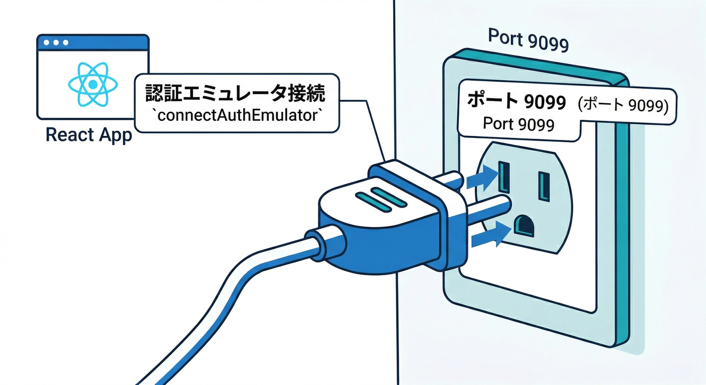
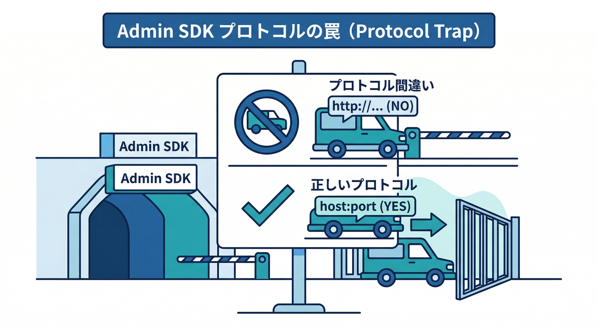

# 第5章　Auth Emulator：ログインをローカルで成立させる🔐🙂

この章は「ログインが通る」だけじゃなくて、**“ログイン状態”を土台に、次のFirestore/Roles/Functionsに進める状態**を作る回だよ〜🧩✨
（Authが入ると、アプリが一気に“現実アプリ感”出るやつ🔥）

---

## この章でできるようになること🎯

* React（Web SDK）を **Auth Emulator（通常 9099）** に接続できる🔌
* Emulator UI で **テストユーザー作成 → ログイン** ができる🧑‍💻✅ ([Firebase][1])
* 「いま誰がログインしてる？」を画面に出せる（uid表示）👀
* “よくある事故”を回避できる（本番Authへ飛ばない、など）🧯

---

## まずイメージ🧠✨（Auth Emulatorって何してくれるの？）


Auth Emulatorは、**メール/パスワード・匿名・メールリンク**などのログインをローカルで試せるし、**Google等のIDP（外部プロバイダ）認証フローのテスト**もできるよ🙌 ([Firebase][1])

ただし大事な注意として、エミュレータのトークンは本番と同じ前提で扱わないでね（エミュ向けの動きがある）。Admin SDK側も **`FIREBASE_AUTH_EMULATOR_HOST`** でエミュ接続に切り替わる設計になってるよ🧯 ([Firebase][1])

---

## 読む📖：Auth Emulatorの“特徴”を3つだけ覚える🧠


1. **アプリ側は接続先を変えるだけ**（Webなら `connectAuthEmulator`）でOK🔁 ([Firebase][1])
2. **Emulator UI からテストユーザーを作れる**（超ラク）🧑‍🔧 ([Firebase][1])
3. Admin SDK は **環境変数で自動的にエミュへ**（HTTPスキーム無しが重要）🌱 ([Firebase][1])

---

## 手を動かす🖐️：Auth Emulatorでログインを成立させよう🚀

## ① エミュレータ起動（Auth + UI）🧪

もう前章までで起動できてるはずだけど、Authを確実に含めるならこんな感じ👇
（UIはだいたい 4000 で立つことが多いよ👀）

```bash
firebase emulators:start --only auth,ui
```

---

## ② React側：`connectAuthEmulator` を入れる🔌🙂



**ポイントは1つだけ**：`connectAuthEmulator()` は **Authを使う前**（ログイン処理より前）に呼ぶこと！🧠
Web用の接続例は公式も `http://127.0.0.1:9099` を載せてるよ。([Firebase][1])

`src/firebase.ts` 例👇（Vite想定で `import.meta.env.DEV` を使うやつ）

```ts
import { initializeApp } from "firebase/app";
import { getAuth, connectAuthEmulator } from "firebase/auth";

const firebaseConfig = {
  // ここはあなたの設定（第2章で作ったやつ）
};

const app = initializeApp(firebaseConfig);

export const auth = getAuth(app);

// ✅ 開発中だけエミュへ
if (import.meta.env.DEV) {
  connectAuthEmulator(auth, "http://127.0.0.1:9099", {
    disableWarnings: true,
  });
}
```

* `disableWarnings: true` は「エミュ警告を黙らせる」オプションだよ🙂 ([GitHub][2])
* `127.0.0.1` と `localhost` を混ぜると、ブラウザ周りでややこしくなることがあるので、**どっちかに統一**が安全👍

---

## ③ いちばん簡単：メール/パスワードのログインUIを作る📧🔑


最低限これだけあればOK！っていうReactコンポーネント例👇
（「作成」「ログイン」「ログアウト」「今のユーザー表示」まで全部入り✨）

```tsx
import { useEffect, useState } from "react";
import {
  createUserWithEmailAndPassword,
  signInWithEmailAndPassword,
  signOut,
  onAuthStateChanged,
  User,
} from "firebase/auth";
import { auth } from "./firebase";

export function AuthPanel() {
  const [email, setEmail] = useState("test@example.com");
  const [password, setPassword] = useState("Passw0rd!");
  const [user, setUser] = useState<User | null>(null);
  const [msg, setMsg] = useState<string>("");

  useEffect(() => {
    return onAuthStateChanged(auth, (u) => setUser(u));
  }, []);

  const signup = async () => {
    setMsg("");
    try {
      await createUserWithEmailAndPassword(auth, email, password);
      setMsg("✅ ユーザー作成できた！");
    } catch (e: any) {
      setMsg(`❌ 作成失敗: ${e.code ?? e.message}`);
    }
  };

  const login = async () => {
    setMsg("");
    try {
      await signInWithEmailAndPassword(auth, email, password);
      setMsg("✅ ログインできた！");
    } catch (e: any) {
      setMsg(`❌ ログイン失敗: ${e.code ?? e.message}`);
    }
  };

  const logout = async () => {
    await signOut(auth);
    setMsg("👋 ログアウトした！");
  };

  return (
    <div style={{ padding: 16, maxWidth: 520 }}>
      <h3>🔐 Auth Emulator ログイン</h3>

      <label>
        Email：
        <input value={email} onChange={(e) => setEmail(e.target.value)} />
      </label>
      <br />

      <label>
        Password：
        <input
          value={password}
          type="password"
          onChange={(e) => setPassword(e.target.value)}
        />
      </label>

      <div style={{ display: "flex", gap: 8, marginTop: 8 }}>
        <button onClick={signup}>ユーザー作成</button>
        <button onClick={login}>ログイン</button>
        <button onClick={logout}>ログアウト</button>
      </div>

      <hr />

      <div>
        <div>📌 状態：{user ? "ログイン中" : "未ログイン"}</div>
        {user && (
          <>
            <div>🆔 uid：{user.uid}</div>
            <div>📧 email：{user.email}</div>
          </>
        )}
        {msg && <p>{msg}</p>}
      </div>
    </div>
  );
}
```

---

## ④ Emulator UIでテストユーザー作成（最短ルート）🧑‍🔧🧪


アプリから作るのもOKだけど、まずはUIで作っちゃうのが速い⚡

1. Emulator UI を開く（起動時に表示されるUIのURL）👀
2. **Authentication** タブへ
3. **Add user** でメール/パスワードを入れて作成✅ ([Firebase][1])

これで、さっきの `signInWithEmailAndPassword` でログインできるようになるよ🙂

---

## デバッグ👀🔍：「どこ見ればいい？」チェックリスト

* 画面に `uid` が出た？ → 出たらAuthは成功🎉
* Emulator UI の Authentication にユーザーが増えた？ → 成功の証拠📌 ([Firebase][1])
* 失敗したら `e.code` を表示して原因を特定（例：`auth/invalid-credential` とか）🧩

---

## よくある罠🪤（ここで詰まりがち😵‍💫）

## 罠1：`connectAuthEmulator` を後から呼んでる

Auth SDKは一度動き出すと、接続先が中途半端になることがあるよ💥
✅ **最初に呼ぶ**（`getAuth()` の直後くらいが安全）

## 罠2：`localhost` と `127.0.0.1` が混ざってる

同じPCでも“別物扱い”になって、挙動がややこしくなることがある😇
✅ URLを統一（公式例は `127.0.0.1`）([Firebase][1])

## 罠3：Admin SDK側のエミュ接続が `http://` 付き



Admin SDKは `FIREBASE_AUTH_EMULATOR_HOST="127.0.0.1:9099"` みたいに、**プロトコル無し**が条件だよ⚠️ ([Firebase][1])

---

## ちょい足し🌱：ユーザー“種まき”をAIで作って爆速に🤖💨


「毎回UIでユーザー作るのダルい…」ってなるので、**seedスクリプト**を用意すると最強🔥
しかも今は、Firebase MCP server が **Authユーザー管理もできる**って明記されてるから、AIに手伝わせやすいよ✌️ ([Firebase][3])

さらに Gemini CLI のFirebase拡張は、Firebase MCP server を自動で入れて、スラッシュコマンド（例：`/firebase:init` や `/firebase:deploy`）も提供されてるよ🧠✨ ([Firebase][4])

**Geminiへのお願い例（コピペ用）**👇

* 「Auth Emulator 用の seed-users.ts を作って。`FIREBASE_AUTH_EMULATOR_HOST` を使って、3人分のユーザー（メール/パス）を作成。実行コマンドもつけて。」
* 「ログイン周りのエラーコード別の原因と対処を、学習者向けに1ページにまとめて。」

---

## ミニ課題🎯（15〜20分で終わるやつ）

1. **UIでテストユーザー作成** → Reactでログイン✅

* 成功条件：画面に `uid` が出る🎉

2. **アプリからユーザー作成**（`createUserWithEmailAndPassword`）→ ログアウト → 再ログイン🔁

* 成功条件：Emulator UIにユーザーが増える👀

3. （余裕あれば）**Geminiに“ログイン設計の注意点”を箇条書き10個**作らせて、自分で3つ改善案を書く🧠✨

---

## チェック✅（言えたら勝ち！）

* 「Auth Emulatorに繋ぐコードは `connectAuthEmulator()`」って言える🙂 ([Firebase][1])
* Emulator UIからユーザー作成してログインできる🧪 ([Firebase][1])
* Admin SDKは `FIREBASE_AUTH_EMULATOR_HOST`（プロトコル無し）で切替って言える🌱 ([Firebase][1])
* AIには“作らせて終わり”じゃなくて、人間がレビューする姿勢で使える🤖✅ ([Firebase][4])

---

## 本日時点のバージョン目安🧾（迷子防止）

* TypeScript は npm の最新が **5.9.3**（2025-09-30公開）になってるよ🧩 ([npm][5])
* Node.js は **v22系がActive LTS**、**v24系がMaintenance LTS** の扱い（リリース表ベース）📦 ([Node.js][6])
* Cloud側の “Cloud Run functions” のランタイム表では **Node.js 24/22/20** や **Python 3.13/3.12/3.11/3.10** が掲載されてるよ☁️ ([Google Cloud Documentation][7])

---

次の章（Firestore Emulator）に進むと、**「ログインしてる人のメモだけ見える」**が作れて一気に楽しくなるよ🗃️⚡
必要なら、この章のコードを「教材向けにさらに噛み砕いた版（図解つき）」にも整形するよ〜📚✨

[1]: https://firebase.google.com/docs/emulator-suite/connect_auth?utm_source=chatgpt.com "Connect your app to the Authentication Emulator - Firebase"
[2]: https://github.com/angular/angularfire/issues/3222?utm_source=chatgpt.com "Auth Emulator not enabled until \"connectAuthEmulator\" is ..."
[3]: https://firebase.google.com/docs/ai-assistance/mcp-server?utm_source=chatgpt.com "Firebase MCP server | Develop with AI assistance - Google"
[4]: https://firebase.google.com/docs/ai-assistance/gcli-extension "Firebase extension for the Gemini CLI  |  Develop with AI assistance"
[5]: https://www.npmjs.com/package/typescript?activeTab=versions&utm_source=chatgpt.com "typescript"
[6]: https://nodejs.org/en/about/previous-releases?utm_source=chatgpt.com "Node.js Releases"
[7]: https://docs.cloud.google.com/functions/docs/runtime-support "Runtime support  |  Cloud Run functions  |  Google Cloud Documentation"
