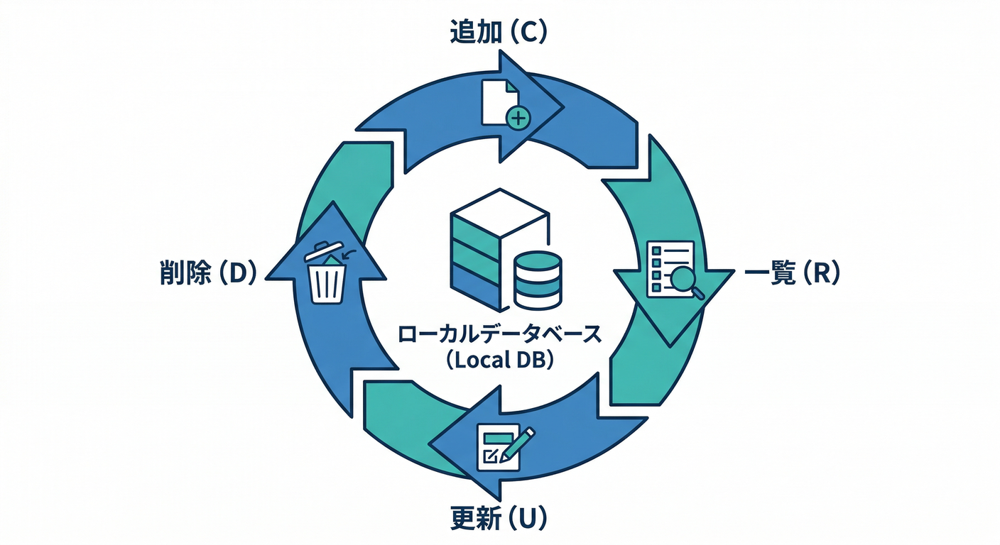
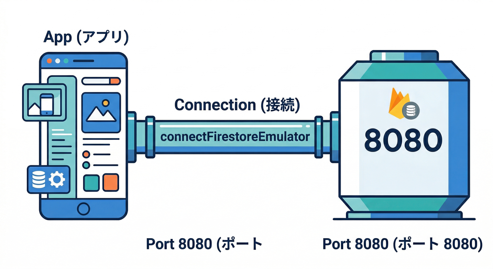
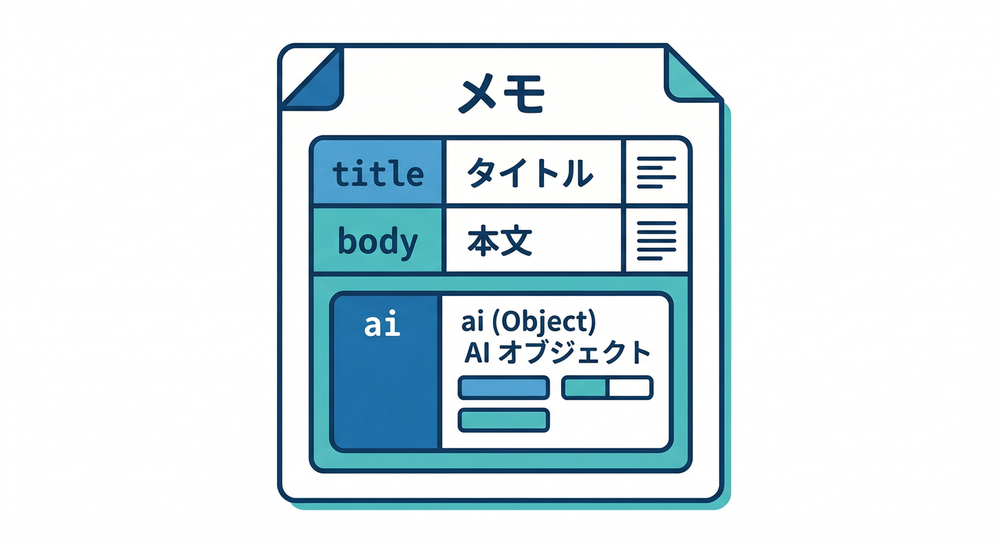
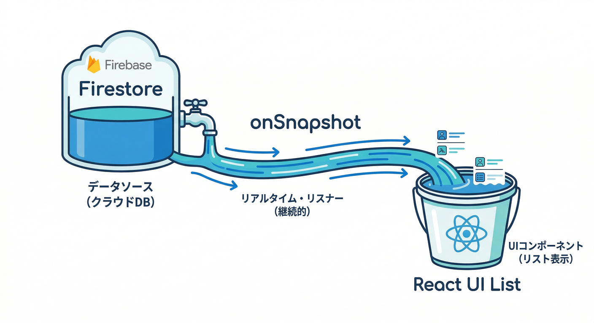
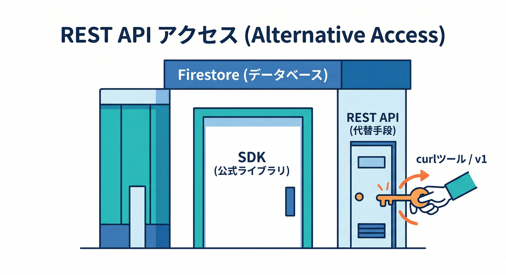

# 第6章　Firestore Emulator：CRUDをローカルで爆速体験🗃️⚡

この章は「**メモCRUD**（追加・一覧・更新・削除）が、ローカルだけで気持ちよく回る！」を体で覚える回です😄✨
ついでに、あとでAI整形（Functions/AI Logic/Genkit）につなげやすい“置き場所”も先に作っておきます🤖🧩

---

## この章でできるようになること🎯

* Firestore を **エミュレータに接続**できる🔌✨ ([Firebase][1])
* `users/{uid}/memos` にメモを **追加・一覧・更新・削除**できる📝⚡
* Firestore エミュの **REST入口**（`/v1`）を「へぇ〜そういうのあるんだ」で把握できる🌐👀 ([Firebase][1])

---

## 1) Firestore をエミュレータへ接続する🔀🧠



まず「アプリの Firestore がローカルに向く」状態にします。Web SDK は `connectFirestoreEmulator()` でOKです👍 ([Firebase][1])

```ts
// src/lib/firebase.ts（例）
import { initializeApp } from "firebase/app";
import { getAuth } from "firebase/auth";
import { getFirestore, connectFirestoreEmulator } from "firebase/firestore";

const firebaseConfig = {
  // ここはあなたの設定（第4章の“安全スイッチ”で使ったやつ）
};

const app = initializeApp(firebaseConfig);

export const auth = getAuth(app);
export const db = getFirestore(app);



// “開発中だけ”エミュへ（安全スイッチの発想）
if (import.meta.env.DEV) {
  connectFirestoreEmulator(db, "127.0.0.1", 8080);
}
```

ポイント💡

* `connectFirestoreEmulator(db, "127.0.0.1", 8080)` が基本形です。 ([Firebase][1])
* Firestore エミュは起動時に **デフォルトDB**を作り、`firebase.json` 設定があれば **named database** も作ります（さらに REST/SDK 呼び出しで暗黙に作られることもあります）。 ([Firebase][1])

---

## 2) 今回のメモの置き場を決める🗂️✨



ここは初心者ほど迷子になりがちなので、固定しちゃいましょう😄

**パス（おすすめ）**

* `users/{uid}/memos/{memoId}`

**ドキュメント例（フィールド）**

* `title: string`（タイトル）
* `body: string`（本文）
* `status: "draft" | "published"`（下書き/公開）←ミニ課題で使う🎯
* `createdAt / updatedAt`（日時：`serverTimestamp()`）⏱️
* `ai`（あとでAI整形の結果を入れる箱）🤖

  * `ai.polished`（整形済み本文）
  * `ai.summary`（要約）
  * `ai.tags`（タグ配列）

「最初からAIフィールド作るの早くない？」→ 早いけど、**あとで追加すると型もUIもズレがち**なので、箱だけ先に置いとくと楽です🧠✨
Firebase AI Logic はクライアントSDKで生成AI機能を組み込めて、より柔軟にやるなら Genkit も選べます（ローカルツールも用意されてる方向性）。 ([Firebase][2])

---

## 3) CRUD を実装する🛠️⚡（まず“動く”を最優先）


## 3-1) まずはリポジトリ関数を作る📦

```ts
// src/lib/memoRepo.ts
import {
  collection,
  doc,
  addDoc,
  deleteDoc,
  onSnapshot,
  orderBy,
  query,
  serverTimestamp,
  updateDoc,
} from "firebase/firestore";
import type { User } from "firebase/auth";
import { db } from "./firebase";

export type MemoStatus = "draft" | "published";

export type Memo = {
  id: string;
  title: string;
  body: string;
  status: MemoStatus;
  createdAt?: unknown;
  updatedAt?: unknown;
  ai?: {
    polished?: string;
    summary?: string;
    tags?: string[];
  };
};

const memosCol = (uid: string) => collection(db, "users", uid, "memos");

export async function createMemo(
  user: User,
  input: { title: string; body: string; status?: MemoStatus }
) {
  const ref = await addDoc(memosCol(user.uid), {
    title: input.title,
    body: input.body,
    status: input.status ?? "draft",
    createdAt: serverTimestamp(),
    updatedAt: serverTimestamp(),
    ai: { polished: "", summary: "", tags: [] },
  });
  return ref.id;
}

export function listenMemos(user: User, cb: (memos: Memo[]) => void) {
  const q = query(memosCol(user.uid), orderBy("updatedAt", "desc"));
  return onSnapshot(q, (snap) => {
    cb(snap.docs.map((d) => ({ id: d.id, ...(d.data() as any) })));
  });
}

export async function updateMemo(
  user: User,
  id: string,
  patch: Partial<Pick<Memo, "title" | "body" | "status" | "ai">>
) {
  const ref = doc(db, "users", user.uid, "memos", id);
  await updateDoc(ref, { ...patch, updatedAt: serverTimestamp() });
}

export async function deleteMemo(user: User, id: string) {
  const ref = doc(db, "users", user.uid, "memos", id);
  await deleteDoc(ref);
}
```

ここまでできたら勝ちです🏆✨
リアルタイムで一覧が更新される（`onSnapshot`）ので、体験としても気持ちいいやつです😆⚡

---

## 3-2) React 側で “追加→一覧→更新→削除” をつなぐ⚛️🧩



超ミニ構成でいきます（見た目はあとで整える！）🙂

```tsx
// src/pages/MemoPage.tsx（例）
import { useEffect, useState } from "react";
import { createMemo, deleteMemo, listenMemos, updateMemo, type Memo } from "../lib/memoRepo";
import { auth } from "../lib/firebase";

export default function MemoPage() {
  const user = auth.currentUser; // 第5章でログイン済み想定
  const [memos, setMemos] = useState<Memo[]>([]);
  const [title, setTitle] = useState("");
  const [body, setBody] = useState("");

  useEffect(() => {
    if (!user) return;
    const unsub = listenMemos(user, setMemos);
    return () => unsub();
  }, [user?.uid]);

  if (!user) return <div>ログインしてね🙂🔐</div>;

  return (
    <div style={{ padding: 16, maxWidth: 720 }}>
      <h2>メモ📝</h2>

      <div style={{ display: "grid", gap: 8, marginBottom: 16 }}>
        <input value={title} onChange={(e) => setTitle(e.target.value)} placeholder="タイトル" />
        <textarea value={body} onChange={(e) => setBody(e.target.value)} placeholder="本文" rows={4} />
        <button
          onClick={async () => {
            if (!title.trim()) return;
            await createMemo(user, { title, body, status: "draft" });
            setTitle(""); setBody("");
          }}
        >
          追加➕
        </button>
      </div>

      <ul style={{ display: "grid", gap: 12, padding: 0, listStyle: "none" }}>
        {memos.map((m) => (
          <li key={m.id} style={{ border: "1px solid #ccc", borderRadius: 8, padding: 12 }}>
            <div style={{ display: "flex", justifyContent: "space-between", gap: 8 }}>
              <b>{m.title}</b>
              <span>状態: {m.status}</span>
            </div>
            <p style={{ whiteSpace: "pre-wrap" }}>{m.body}</p>

            <div style={{ display: "flex", gap: 8 }}>
              <button onClick={() => updateMemo(user, m.id, { status: m.status === "draft" ? "published" : "draft" })}>
                状態切替🔁
              </button>
              <button onClick={() => updateMemo(user, m.id, { body: m.body + "\n（追記）" })}>
                追記✍️
              </button>
              <button onClick={() => deleteMemo(user, m.id)}>削除🗑️</button>
            </div>
          </li>
        ))}
      </ul>
    </div>
  );
}
```

これで、ローカルだけで CRUD が回ります🧪⚡
しかも本番の課金やデータ事故にビクビクしなくてOKなのが最高です😌🧯

---

## 4) REST入口（おまけ）🌐👀



Firestore エミュは **REST エンドポイント**も持っています。ベースは `http://localhost:8080/v1`、パスは
`/projects/{project_id}/databases/{database_id}/documents/...` という形です。 ([Firebase][1])

## 一覧取得（例：users コレクション）

```bash
curl -X GET "http://localhost:8080/v1/projects/my-project-id/databases/(default)/documents/users"
```

（↑この形が公式に載ってる“入口の例”です） ([Firebase][1])

## DB全消し（テスト前に“初期化”したい時）🧨➡️🧼

エミュには **全消し専用のREST**があります（本番には無いタイプ！）。 ([Firebase][1])

```bash
curl -v -X DELETE "http://localhost:8080/emulator/v1/projects/firestore-emulator-example/databases/(default)/documents"
```

Windows で PowerShell派なら、こういう感じでもOKです👇

```powershell
Invoke-RestMethod -Method Delete "http://localhost:8080/emulator/v1/projects/firestore-emulator-example/databases/(default)/documents"
```

「テスト前に毎回まっさらにする」って、開発が一気に安定します🧠🔁

---

## 5) 爆速で回すコツ3つ⚡🧠

1. **`onSnapshot` を軸にする**👂✨
   画面が勝手に更新されるので、動作確認が速いです（一覧が“生きる”）。

2. **テストの前後にDB全消し**🧼🧨
   エミュは REST でフラッシュできるので「同じ初期状態」からやり直しが簡単です。 ([Firebase][1])

3. **必要になったら import/export**📦🔁
   `emulators:export` / `--import` / `--export-on-exit` が用意されています。 ([Firebase][1])
   （このへんは第10章で“完全自動化”に寄せます😄）

---

## 6) つまずきポイント集🪤😵‍💫➡️😄

* **エミュ停止でデータが消える**🫥
  Firestore エミュはシャットダウンで中身がクリアされます。必要なら export/import を使うのが安心です。 ([Firebase][1])

* **インデックスが本番と違う**📚
  エミュは複合インデックスを追跡せず、クエリが通ってしまうことがあります。本番に当てたときの確認も忘れずに。 ([Firebase][1])

* **トランザクションが完全一致じゃない場合がある**🔄
  同時書き込み系は挙動がズレたり、ロック解除に時間がかかったりすることがあります（テストのタイムアウト調整が必要になるケースあり）。 ([Firebase][1])

* **（最新トピック）Firestore エミュは今後 Java 21 を要求予定**☕🆙
  「急に動かなくなった！」を避けるため、JDK更新の意識だけ持っておくと安心です。 ([Firebase][1])

---

## 🤖 AIコーナー：Firestore を“AI整形の舞台”にする下ごしらえ🧩✨


## 目的🎯

次の章で Functions や AI Logic/Genkit に進んだとき、
「AIが整形した結果を Firestore に保存して、画面が更新される」流れが自然につながります🤖➡️🗃️➡️🖥️

## 今日やること（軽め）🍃

* `ai.polished / ai.summary / ai.tags` の箱を **すでに作った**（create時に空でOK）✅
* “AIっぽい値”を手で入れて **画面に出る**のを確認してみよう😄

たとえば、1件だけこう更新👇

```ts
await updateMemo(user, memoId, {
  ai: {
    polished: "【整形済み】読みやすい文章にしました✨",
    summary: "要約：〜です📌",
    tags: ["学習", "メモ", "下書き"],
  },
});
```

「AIの実呼び出し」は後でやります（AI Logic/Genkit側はモデルやツールも進化するので、切替前提で設計するのが安全）🤝
Firebase AI Logic や Genkit の公式導線はここで押さえておけばOKです。 ([Firebase][2])

さらに、Gemini CLI や MCP Toolbox を使うと、自然言語で Firestore を触る導線もあります（AI支援の開発体験がかなり変わるやつ！）。 ([Google Cloud Documentation][3])

---

## ミニ課題🎯：「状態（下書き/公開）」をちゃんと活用しよう🙂📌

* `status` を `"draft" | "published"` で保存✅
* 一覧で `status` を表示✅
* ボタンで切替（draft⇄published）✅

余裕があれば✨

* `published` だけ表示するフィルタ（`where("status","==","published")`）を追加🔍

---

## チェック✅（3つ言えたらクリア！）

* `connectFirestoreEmulator()` でローカルに向けられる🧠🔌 ([Firebase][1])
* `onSnapshot` で一覧がリアルタイム更新される👀⚡
* Firestore エミュには `http://localhost:8080/v1` の REST 入口があるのを知ってる🌐🧪 ([Firebase][1])

---

次の第7章は「Emulator UIでデバッグ」なので、ここで作った CRUD があると **ログもリクエストも超おもしろく**見えます👀🔍🔥

[1]: https://firebase.google.com/docs/emulator-suite/connect_firestore "Connect your app to the Cloud Firestore Emulator  |  Firebase Local Emulator Suite"
[2]: https://firebase.google.com/docs/ai-logic?utm_source=chatgpt.com "Gemini API using Firebase AI Logic - Google"
[3]: https://docs.cloud.google.com/firestore/native/docs/connect-ide-using-mcp-toolbox?utm_source=chatgpt.com "Use Firestore with MCP, Gemini CLI, and other agents"
