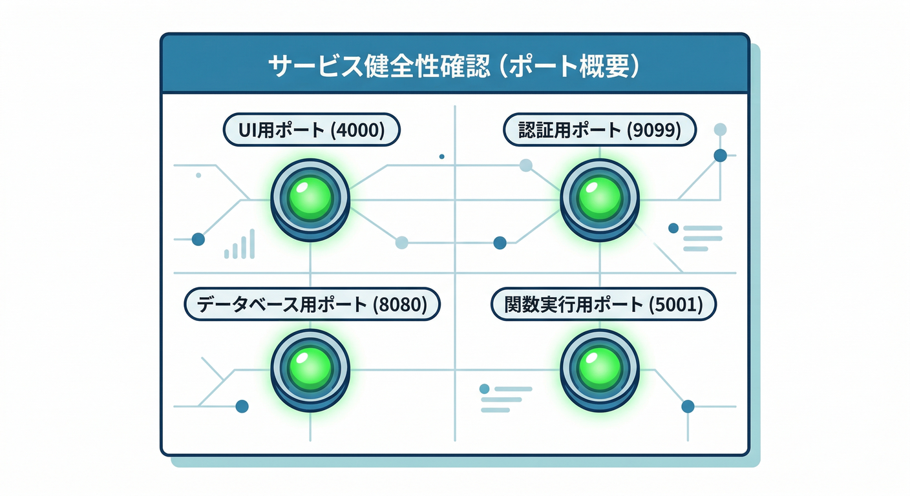
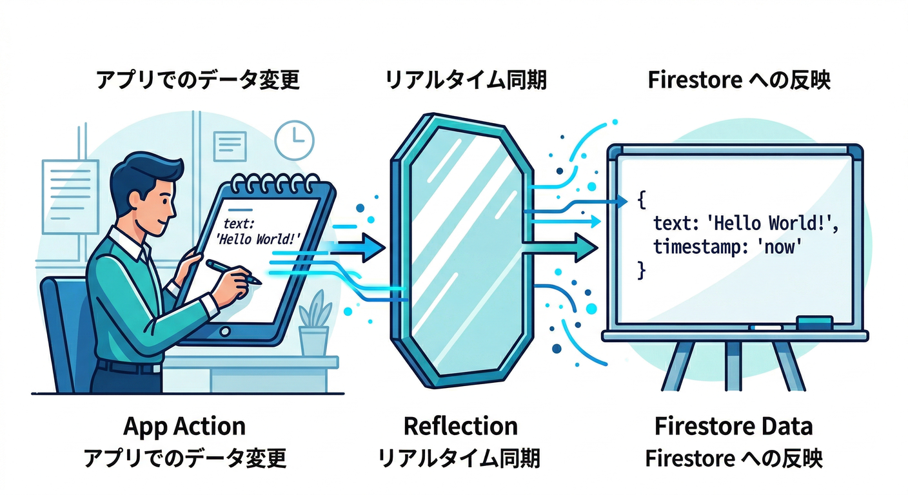
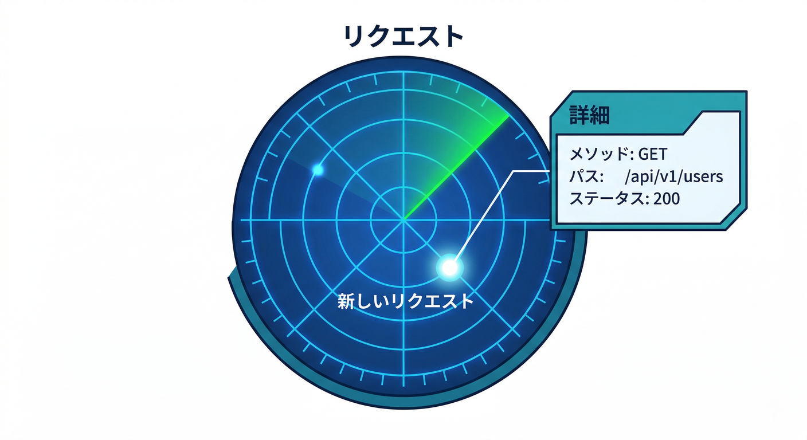
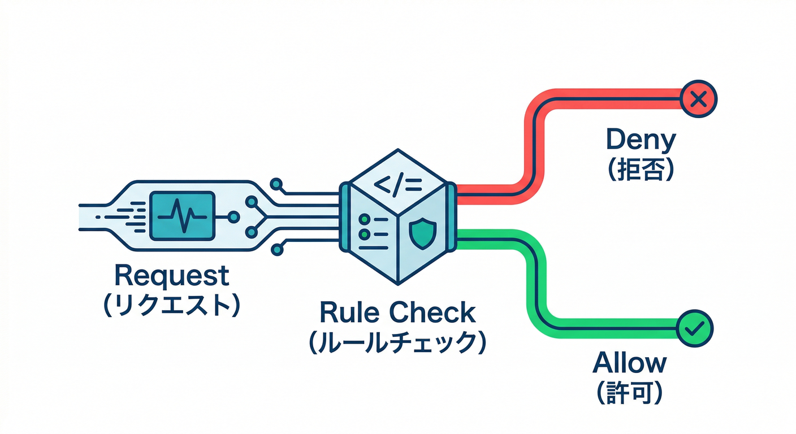
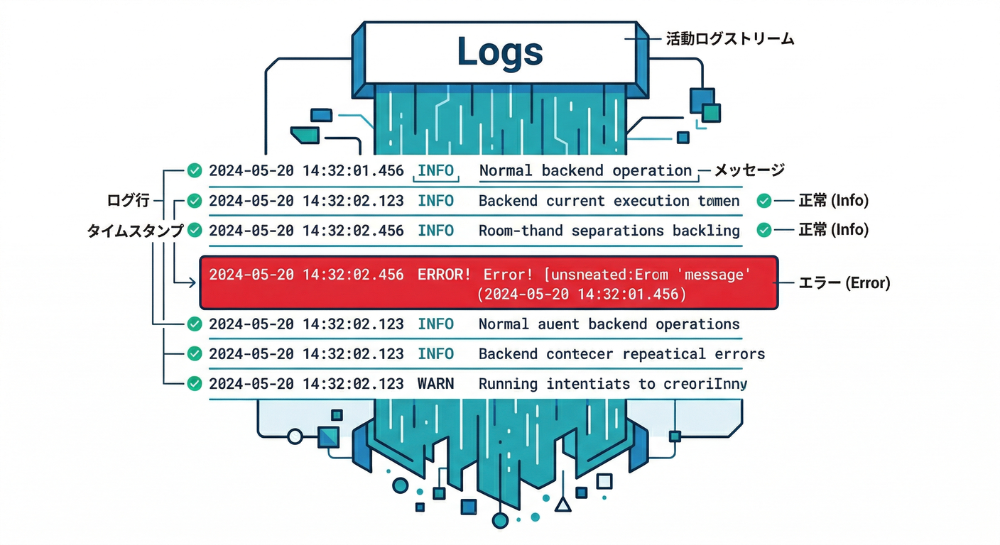
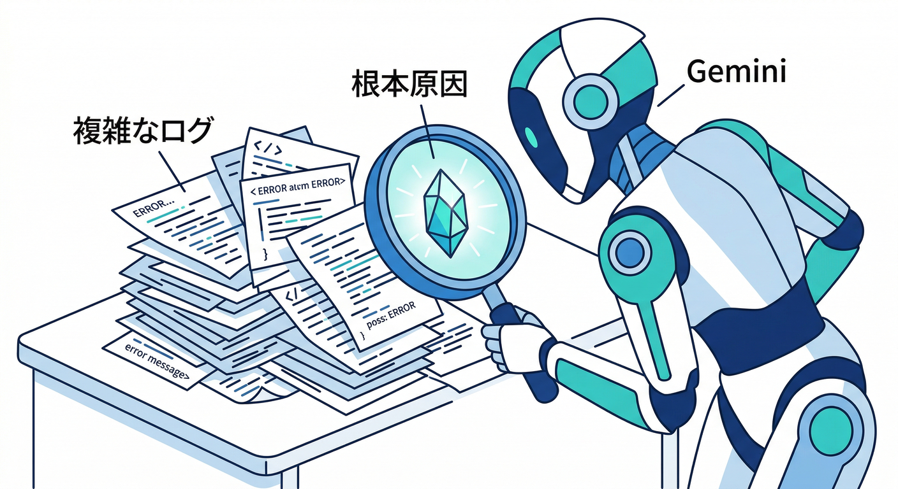

# 第7章　Emulator UIでデバッグ：目で追う👀🔍

この章は「**画面操作 → Firestore/Functions の裏側で何が起きたか**」を、**Emulator Suite UIで“見える化”**して追いかけられるようになる回だよ🧠✨
Emulator Suite UI は、ざっくり言うと「Firebaseコンソールがローカルに来た感じ」だと思ってOK🙌（UIは既定で `http://localhost:4000`） ([Firebase][1])

---

## 今日のゴール🎯

* 「いまの操作で **どの読み書きが飛んだ？**」を **Requests で説明**できる👀
* ルールで弾かれたときに「**どの条件が false だった？**」を **評価トレースで特定**できる🛡️
* Functions が絡むときに「**ログから原因を拾える**」ようになる🧯([Firebase][1])

---

## 1) まず Emulator UI を開こう🚪✨


エミュレータ起動時に、UIも一緒に立ち上がるよ（UIの既定ポートは 4000）([Firebase][1])

```bash
firebase emulators:start --only auth,firestore,functions
```

起動ログに「UI のURL」が出るので、それをブラウザで開く（だいたい `http://localhost:4000`） ([Firebase][1])

---

## 2) Overview で「生きてるか」を30秒点検✅👀



UI を開いたらまず **Overview** でチェック🩺✨
ここで「どのエミュが起動してて」「何番ポートか」が見えるのが強い🔥

よく使う既定ポート（教材で迷子になりやすいとこ）👇

* Emulator Suite UI：4000
* Auth：9099
* Firestore：8080
* Functions：5001 ([Firebase][2])

💡ここでのコツ：
「思ってたのと違うポート」でも焦らないでOK！CLIログとUIの表示が“答え”🧠✨

---

## 3) Firestore の **Data** で「DBの中身」を見る🗃️👓



**Firestore → Data** を開くと、ローカルのFirestoreに入ってるドキュメントが見えるよ📚✨
つまり…

* アプリでメモ追加 → **Data に増える**
* アプリで更新 → **Data の中身が変わる**
* アプリで削除 → **Data から消える**

この3つが揃うと「CRUDできてる感」が一気に出る😄🔥

---

## 4) 本番級に便利！Firestore の **Requests** で“何が飛んだか”を見る📡👀



この章の主役はここ👇
**Firestore → Requests** で、アプリから飛んだリクエストを **リアルタイム**に見れるよ💥
しかも **Security Rules の評価トレース**まで付いてくるのが最強🛡️✨([Firebase][3])

## 4-1) まず「観察用の操作」をやってみよう🖐️

アプリ側で、次を順番に実行してみてね👇

1. メモ一覧を開く（読む）📖
2. メモを1件追加（書く）✍️
3. タイトルだけ更新（書く）🛠️
4. 削除（書く）🗑️

その直後に **Requests** を見ると、「今の操作がここに出る！」ってなる👀✨

## 4-2) Requests で見るポイントはこの5つ🔍✨

リクエストをクリックして詳細を開いたら、次をチェック👇

* **いつ起きた？**（タイムスタンプ）⏱️
* **何をした？**（読み取り/書き込みっぽさ）📖✍️
* **どこを触った？**（コレクション/ドキュメントのパス）🧭
* **認証つき？**（ログインしてるユーザーで実行されてるか）👤
* **Rules は通った？**（ALLOW / DENY と、その理由）🛡️

特に最後！
Requests には「各リクエストに対して行われた Rules 評価」が含まれるよ、って公式が明言してる👍([Firebase][3])

---

## 5) Rules 評価トレースの読み方🧠🧾



Rules で弾かれたときって、初心者あるあるでこうなる👇
「え、なんでダメなの？😵‍💫」

そこで **Requests の評価トレース**！
Firestore Emulator は、Requests で **評価シーケンス（どの条件を見て、どこで落ちたか）**を可視化できるよ👀✨([Firebase][3])

## “推理ゲーム”の型（これだけ覚えればOK）🕵️‍♂️✨

1. **DENY になったリクエスト**を選ぶ
2. 詳細の中で「**どの条件が false だったか**」を探す
3. false の原因を 1行で言語化する（例：「uid が違う」など）
4. 直す場所を決める

* ルール？🛡️
* フロントの書き込み内容？✍️
* ログイン状態？👤

---

## 6) Logs タブで “裏側の声” を聞く📣🔥



UI の **Logs** タブは、Functions を含めた「裏側のログ」をまとめて見れる感じで便利だよ🧯✨
公式の流れでも「Firestore の Requests を見たら、次は Logs で Functions がエラー出してないか確認しよう」って書かれてる👍([Firebase][1])

## ありがちな見つけもの🔎

* `console.log()` の出力（処理が通った合図）✅
* 例外（stack trace が出る）💥
* “呼ばれてない” の証拠（ログが一切出ない）👻

---

## 7) AIでデバッグを“爆速化”する🤖💨（でも最後は自分の目👀）



ここからが2026っぽい攻め方🔥
ログやRequestsの詳細って、文章量が多くて読むのが疲れる…😇
そこで **Gemini CLI** や **AI Agent** に「整理」だけ任せるのが強い💪

しかも Firebase には、AIツールに Firebase 操作を渡せる **Firebase MCP server** が用意されてるよ🧩
さらに **Gemini CLI の Firebase 拡張**は、MCP server のセットアップや、Firebase開発向けの“定型プロンプト（slash commands）”まで提供してる✌️([Firebase][4])

## 使い方のコツ（安全運転🧯）

* ✅ AIには「ログ/Requests を要約させる」「原因候補を箇条書きさせる」
* ✅ 自分は「UIで事実確認する」
* ❌ AIの言い切りをそのまま信じてRulesを大改造しない（事故る）😇

### 例：AIに投げるネタ（コピペ用）🧪

* Requests の詳細（DENY になったやつ）
* Logs のエラー（stack trace）
* 直前にやった画面操作（“メモ保存ボタン押した”など）

---

## ミニ課題🎯（10分で終わるやつ😄）

1. **一覧→追加→更新→削除**をやる🖐️
2. Firestore → Requests を開いて、各操作で「何が飛んだか」をメモ📝

   * 例）「一覧：読取」「追加：書込」みたいな雑でOK🙆‍♂️
3. わざと1回だけ失敗させる（例：未ログインで書き込み、など）😈
4. Requests の評価トレースを見て、**“失敗理由を1文”**で書く🧠🧾

---

## チェック✅（できたら勝ち🎉）

* Emulator UI を開ける（URL/ポートで迷わない）([Firebase][1])
* Overview で、Auth/Firestore/Functions が動いてるのを確認できる([Firebase][2])
* Firestore Data で、CRUDの結果を目視できる👀
* Firestore Requests で、操作に対応するリクエストを見つけられる👣
* DENY のとき、Rules評価トレースで「どこが false か」見つけられる🛡️([Firebase][3])
* Logs で Functions のエラー有無を確認できる🧯([Firebase][1])

---

## つまずき救急箱🧯🚑

## UIが開けない（`localhost:4000` がダメ）😵‍💫

* まずは **CLIログに出たURL**を開く（そこが正）([Firebase][1])
* 4000 が他アプリと衝突してたら、`firebase.json` で UIポートを変えられるよ（`emulators.ui.port`）([Firebase][2])

```json
{
  "emulators": {
    "ui": { "enabled": true, "port": 4400 }
  }
}
```

## Requests が増えすぎて混乱する😇

* リアルタイム購読（監視系）を使うと、操作1回でも“動きが多く見える”ことがあるよ👀
* そんなときは「今の操作の直後に出た1件」を狙ってクリック→詳細、がコツ🎯

---

## 参考（この章の根拠）📚✨

* UI の既定URL（`http://localhost:4000`）と、Firestore Requests / Logs の見どころ([Firebase][1])
* Emulator の既定ポート一覧、`firebase.json` の `emulators.ui.port` 例([Firebase][2])
* Firestore Requests で Rules 評価トレースを可視化できる説明([Firebase][3])
* Gemini CLI拡張と Firebase MCP server（AI支援）([Firebase][5])

---

次の章（Rules入門🛡️😇）に行く前に、もしよければ：
「今のミニ課題のメモ（操作→Requestsの観察結果）」を貼ってくれたら、**“読み書きの意味”を一緒に整理**して、Rules設計へスムーズに繋げるよ✌️✨

[1]: https://firebase.google.com/docs/emulator-suite/connect_and_prototype "Connect your app and start prototyping  |  Firebase Local Emulator Suite"
[2]: https://firebase.google.com/docs/emulator-suite/install_and_configure "Install, configure and integrate Local Emulator Suite  |  Firebase Local Emulator Suite"
[3]: https://firebase.google.com/docs/firestore/security/test-rules-emulator?utm_source=chatgpt.com "Test your Cloud Firestore Security Rules - Firebase - Google"
[4]: https://firebase.google.com/docs/ai-assistance/mcp-server?utm_source=chatgpt.com "Firebase MCP server | Develop with AI assistance - Google"
[5]: https://firebase.google.com/docs/ai-assistance/gcli-extension?utm_source=chatgpt.com "Firebase extension for the Gemini CLI"
