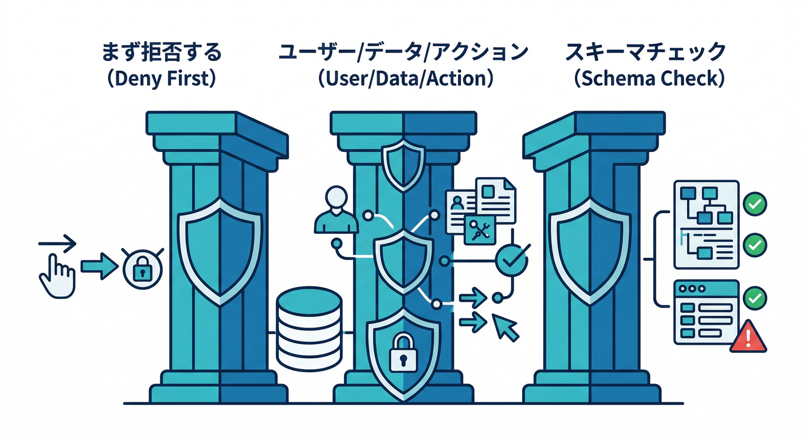
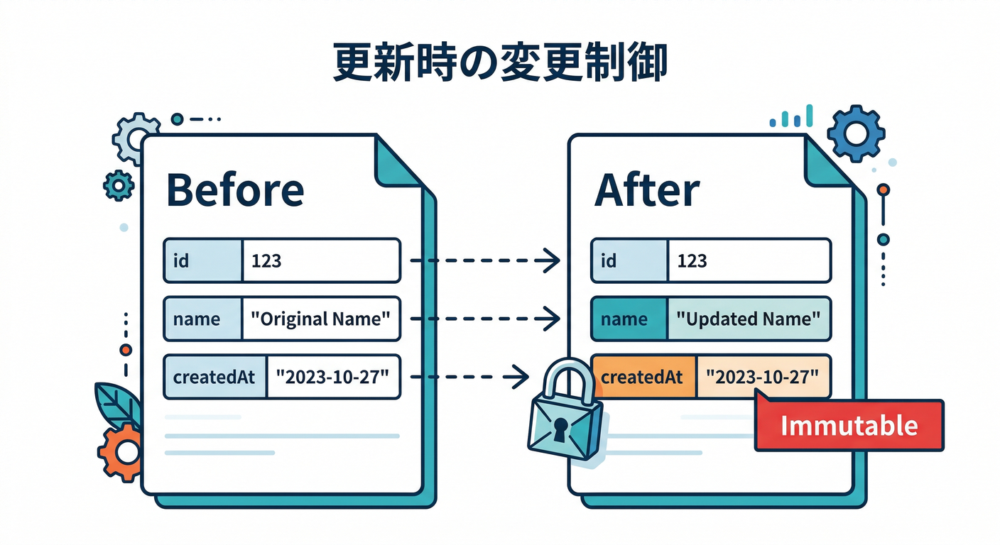

# 第8章　Rules入門：まず“事故らない形”を覚える🛡️😇

この章はひとことで言うと、**Firestore の入口に「門番🧑‍✈️」を置く練習**だよ！
アプリ（React）から Firestore に投げた **全部の読み書き**は、先に **Security Rules** で「通していい？」って審査される仕組みになってるんだ🧠✨（これがないと“誰でも読める・書ける”事故が起きる）([Firebase][1])

---

## 🎯 この章のゴール（できたら勝ち！）

* ✅ **自分のメモだけ** 読める（他人のメモは読めない）
* ✅ **必須フィールドが欠けた書き込みは拒否**できる（title が空、とか）
* ✅ 変更した Rules が効いて、挙動が変わるのをエミュレータで体験する

---

## 1) Rulesの超ざっくりイメージ🧠🚪


Rules は、ざっくりこの形👇（Firestore/Storage 共通の考え方）

* `match`：どのパスに対するルール？（例：`/users/{uid}/memos/{memoId}`）
* `allow`：どの操作を許可？（`read/write` や `get/list/create/update/delete`）
* 条件式：`request`（これから来るリクエスト）や `resource`（今あるデータ）を見て判断するよ👀([Firebase][1])

---

## 2) まず覚える“事故らない3原則”🛡️✨



## 原則A：基本は **deny（拒否）から** 🔒

「とりあえず全部OK」は卒業！
本番前にちゃんと締めないと、データ漏えい・改ざんの入口になるよ😱([Firebase][2])

## 原則B：許可は **“誰が・どのデータを・何する”** をセットで考える👤🗂️

* 誰が：ログインしてる？（`request.auth != null`）
* どのデータ：その人のデータ？（`request.auth.uid == userId`）
* 何する：読むだけ？作る？更新？削除？🧩

## 原則C：Firestoreはスキーマレス → **Rulesで最低限の型＆必須チェック** ✅

Firestore は DB 自体が「必須フィールド」や「型」を強制してくれない。
だから Rules で **keys / hasAll / hasOnly / 型チェック** を入れるのが超大事🧱([Firebase][3])

---

## 3) ミニ題材アプリのデータ設計（今回はこっちで行く）🗃️📝

初心者に一番わかりやすいのはコレ👇

* `/users/{uid}/memos/{memoId}` にメモを置く
  → **パスに uid が入る**から「本人だけ許可」が書きやすい💡

メモのドキュメント例（イメージ）👇

* `title: string`
* `body: string`
* `createdAt: timestamp`
* `updatedAt: timestamp`
* `formattedBody: string`（あとで Functions の自動整形で埋めてもOK）

---

## 4) ハンズオン🖐️：Rulesで「自分のメモだけOK」を作る🔐🙂

## 4-1) Rulesファイルの“骨組み”を作る🦴


Firestore Rules は、まずこれが基本形だよ👇（`rules_version = '2'` が現行の前提）([Firebase][1])

```ts
rules_version = '2';

service cloud.firestore {
  match /databases/{database}/documents {

    // ここに match を積み上げていく！

  }
}
```

---

## 4-2) 本人判定の関数を作る（読みやすさ爆上がり）📈✨


Rules は長くなるほど事故りやすいから、**関数化**が正義👍([Firebase][1])

```ts
rules_version = '2';

service cloud.firestore {
  match /databases/{database}/documents {

    function signedIn() {
      return request.auth != null;
    }

    function isOwner(userId) {
      return signedIn() && request.auth.uid == userId;
    }

    match /users/{userId}/memos/{memoId} {
      allow read: if isOwner(userId);
    }
  }
}
```

ここまででまずは
✅ **自分のメモは読める**
❌ **他人のメモは読めない**
が作れる！

> ちなみに `read` は `get` と `list`（=クエリ）をまとめた便利書き方だよ🧠([Firebase][1])

---

## 4-3) 書き込みも許可する（create/update/delete）✍️🧨→🧯

次に “書ける” を入れる。ただし **本人だけ** ね🙂

```ts
match /users/{userId}/memos/{memoId} {
  allow read: if isOwner(userId);
  allow create: if isOwner(userId) && validMemoCreate();
  allow update: if isOwner(userId) && validMemoUpdate();
  allow delete: if isOwner(userId);
}
```

で、肝心の **validMemoCreate / validMemoUpdate** を作る👇

---

## 5) バリデーション入門✅：「必須フィールドが無い書き込み」を拒否する


## 5-1) create の最低限バリデーション（必須＆余計なキー禁止）🧱

`keys().hasAll()` で必須
`keys().hasOnly()` で「余計なの混ぜるな」
ができるよ🔥([Firebase][3])

```ts
function validMemoCreate() {
  let d = request.resource.data;

  // 必須フィールドが揃ってる？
  let requiredOk = d.keys().hasAll(['title', 'body', 'createdAt', 'updatedAt']);

  // 余計なフィールドを混ぜてない？
  let onlyOk = d.keys().hasOnly([
    'title', 'body', 'createdAt', 'updatedAt', 'formattedBody'
  ]);

  // 型チェック（最低限）
  let typesOk =
    d.title is string &&
    d.body is string &&
    d.createdAt is timestamp &&
    d.updatedAt is timestamp &&
    (!('formattedBody' in d) || d.formattedBody is string);

  // 文字数チェック（雑でも入れると事故が減る）
  let sizeOk = d.title.size() > 0 && d.title.size() <= 100;

  return requiredOk && onlyOk && typesOk && sizeOk;
}
```

> `request.resource.data` は「書き込み後の候補データ」だよ🧠（create/update で超使う）([Firebase][3])

---

## 5-2) update の最低限バリデーション（“変えていい項目だけ”）🛠️



更新はここが事故ポイント💥
**勝手に `createdAt` を改ざん**とか、**知らないフィールドを追加**とかが起きがち。

Firestore Rules には「差分（diff）」で変更フィールドを絞る方法があるよ✅
`request.resource.data.diff(resource.data).affectedKeys().hasOnly([...])` みたいに書ける([Firebase][3])

```ts
function validMemoUpdate() {
  let newData = request.resource.data;
  let oldData = resource.data;

  // 変更していいフィールドだけに制限（例）
  let fieldsOk =
    newData.diff(oldData).affectedKeys().hasOnly(['title', 'body', 'updatedAt', 'formattedBody']);

  // createdAt は固定（改ざん禁止）
  let createdAtOk = newData.createdAt == oldData.createdAt;

  // 型チェック（更新後データでチェック）
  let typesOk =
    newData.title is string &&
    newData.body is string &&
    newData.createdAt is timestamp &&
    newData.updatedAt is timestamp &&
    (!('formattedBody' in newData) || newData.formattedBody is string);

  // title 空は禁止
  let sizeOk = newData.title.size() > 0 && newData.title.size() <= 100;

  return fieldsOk && createdAtOk && typesOk && sizeOk;
}
```

---

## 6) “見える化”しよう👀：Emulator UIで「なぜ拒否？」を追う🔎🧾

Firestore エミュレータは、**リクエストごとの Rules 評価トレース**を UI で見られるのが強い！
Firestore → **Requests** タブで、どのルールが true/false になったか追えるよ🧠([Firebase][4])

使い方のコツ👇

* ❌ わざと失敗させる（title を空にして create とか）
* Requests でそのリクエストを開く
* 「どの条件が落ちたか」を 1つずつ直す🔧✨

---

## 7) 超大事な注意⚠️：「サーバー側（Admin SDK）はRulesを素通り」問題


Rules は基本、**Web/モバイルのクライアントSDKからのアクセス**を守るもの。
一方で、**サーバー用ライブラリ（Server SDK / REST / RPC など）は Rules をバイパス**する前提があるよ（= IAM 側の世界）([Firebase][5])

だから、あとで Functions（自動整形）をやるときは👇

* クライアントからの直アクセス：Rules で守る🛡️
* Functions 側の書き込み：Functions のコード側で検証（＋IAM）🧰

…って “守る層” が違うのを覚えよう🙂

---

## 8) AIも混ぜよう🤖💨：Rulesのたたき台＆穴チェックを加速

## 8-1) Gemini CLI で Rules の雛形を作らせる✍️⚡

Gemini CLI には Firebase 向け拡張があって、**Security Rules の生成・検証・テスト**を助けるプロンプト群に繋がるよ。これは **Firebase MCP server** を使う仕組みとして案内されてる🧠🔌([Firebase][6])

やりたい依頼例（イメージ）👇

* 「このコレクション構造で、本人だけ read/write の Rules を作って」
* 「create は title/body/createdAt/updatedAt 必須、余計なフィールド禁止」
* 「update は createdAt 固定、更新可能フィールドを title/body/updatedAt のみに」

※AIが出した Rules は **そのまま採用せず**、必ず Requests トレースで確認してね🧯

## 8-2) Firestore の中身（実データ）を AI で確認して設計を固める🗂️🤝

Firestore は MCP Toolbox / Firestore 拡張で、AI から自然言語でデータ確認しやすくなる流れが強いよ（Gemini CLI から Firestore 操作を助ける話が出てる）([Google Cloud Documentation][7])
Rules は「データ構造が曖昧」だと一瞬で破綻するから、ここが効く✨

---

## 9) ミニ課題🎯（10〜20分）

## 課題A：他人のメモを読めないのを確認🙂→😈→🚫

1. 自分でメモを作る
2. **別ユーザー**（Auth Emulator で作成）でログイン
3. 他人の `/users/{uid}/memos` を読もうとして失敗するのを確認
4. Requests で「どの条件が落ちたか」を 1文で説明📝

## 課題B：必須フィールド欠けを拒否✅

* title を空で create → 拒否される
* body を missing で create → 拒否される
* Requests で「どの条件が落ちたか」説明📝

---

## 10) チェック✅（ここまでできた？）

* ✅ Rules が **門番**だと説明できる([Firebase][1])
* ✅ `request.auth.uid == userId` の意味がわかる🙂
* ✅ `keys().hasAll()` / `hasOnly()` で **必須＆余計禁止**が書けた([Firebase][3])
* ✅ Requests で **評価トレース**を見て「なぜ拒否？」を追えた([Firebase][4])

---

## 次章へのチラ見せ👀✨

次は「Rules の見える化」をさらに深掘りして、**Rulesテスト（自動テスト）**へ繋げるよ！
`@firebase/rules-unit-testing` が “auth を偽装できて” テストが超ラク、って公式で推されてる🔥([Firebase][8])

[1]: https://firebase.google.com/docs/rules/rules-language "Security Rules language  |  Firebase Security Rules"
[2]: https://firebase.google.com/docs/firestore/security/insecure-rules "Fix insecure rules  |  Firestore  |  Firebase"
[3]: https://firebase.google.com/docs/firestore/security/rules-fields "Control access to specific fields  |  Firestore  |  Firebase"
[4]: https://firebase.google.com/docs/firestore/security/test-rules-emulator "Test your Cloud Firestore Security Rules  |  Firebase"
[5]: https://firebase.google.com/docs/firestore/security/test-rules-emulator?utm_source=chatgpt.com "Test your Cloud Firestore Security Rules - Firebase - Google"
[6]: https://firebase.google.com/docs/ai-assistance/prompt-catalog/write-security-rules "AI Prompt: Write Firebase Security Rules  |  Develop with AI assistance"
[7]: https://docs.cloud.google.com/firestore/native/docs/connect-ide-using-mcp-toolbox?utm_source=chatgpt.com "Use Firestore with MCP, Gemini CLI, and other agents"
[8]: https://firebase.google.com/docs/rules/unit-tests "Build unit tests  |  Firebase Security Rules"
