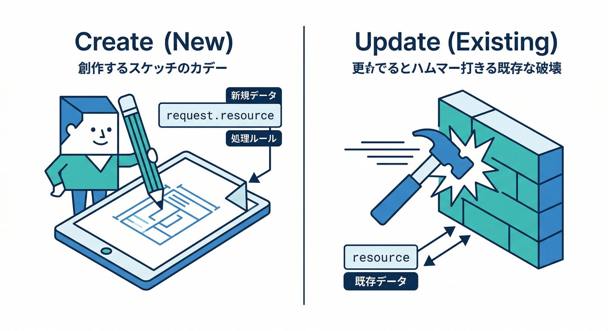
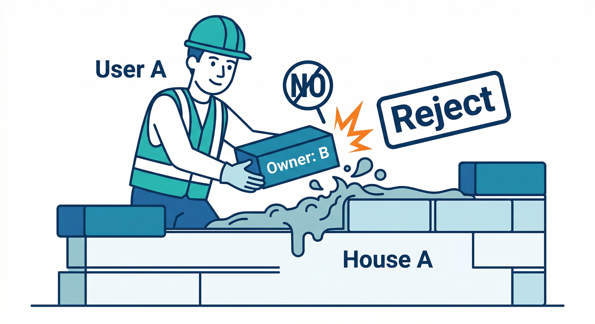
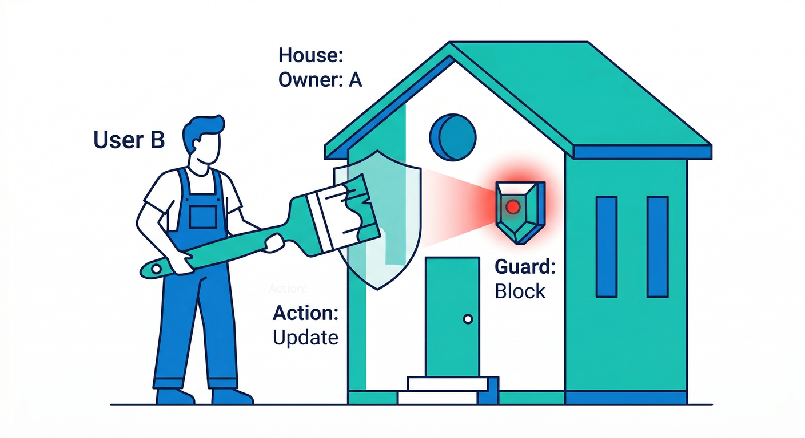
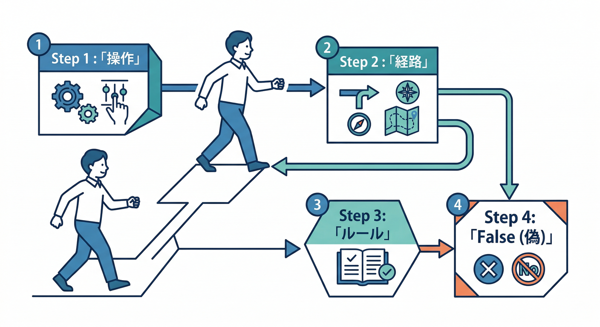
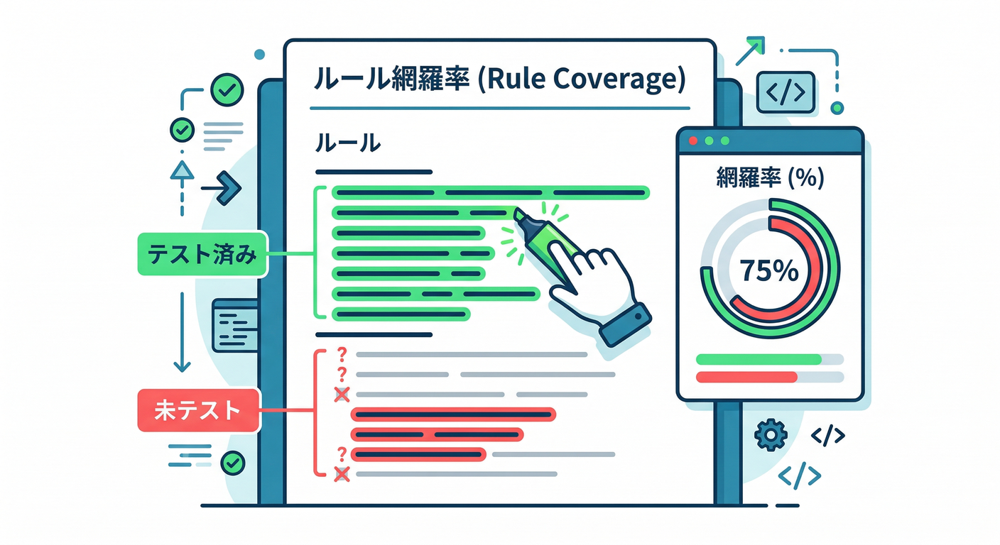

# 9章　Rulesの“見える化”：評価トレースを読む🧠🧾

この章のゴールはシンプル！
**「Missing or insufficient permissions」みたいな拒否が出たときに、Emulator UI の “評価トレース” を読んで、原因を1行で説明できる**ようになることです😄✨
（Firestore のリクエストごとに Rules が評価され、どこかで拒否されると“そのリクエスト全体が失敗”します）([Firebase][5])

---

## この章でできるようになること🎯

* どの `match` / `allow` が効いて（あるいは効かなくて）弾かれたかを特定できる🔎
* `resource.data` と `request.resource.data` の使い分けを、失敗から逆算して理解できる🧩
* 「直すのは Rules？それともクライアントの書き込みデータ？」を切り分けできる⚖️

---

## 1) まず“わざと失敗”のネタを用意しよう💥（ここが一番学べる）


## 例：メモ用の Firestore Rules（chapter8 の続き想定）🛡️



ポイントはこれ👇

* **create** のときは「まだ既存データがない」ので、基本は `request.resource.data` を見る
* **update** のときは「既存データ＝`resource.data`」も見られる

```text
// firestore.rules（例）
rules_version = '2';
service cloud.firestore {
  match /databases/{database}/documents {
    match /memos/{memoId} {

      function signedIn() {
        return request.auth != null;
      }

      function isOwner() {
        // 既存データの ownerId と、ログイン uid が一致するか
        return signedIn() && resource.data.ownerId == request.auth.uid;
      }

      function validNewMemo() {
        // 作成時に必要な形（title が空じゃない、ownerId が uid と一致、など）
        return signedIn()
          && request.resource.data.ownerId == request.auth.uid
          && request.resource.data.title is string
          && request.resource.data.title.size() > 0;
      }

      allow read: if isOwner();
      allow create: if validNewMemo();
      allow update, delete: if isOwner();
    }
  }
}
```

---

## 2) Emulator UI で “拒否された理由” を見に行く👀🧪

## Emulator UI を開く🌐

Emulator Suite UI は既定で **4000番**です（設定で変更もできます）([Firebase][6])

```text
http://localhost:4000
```

---

## 3) 実験①：未ログインで読み取り → 弾かれる🔐➡️⛔


## やること🖐️

1. アプリ側でログアウト状態にする（または未ログインでアクセス）🙂
2. メモ一覧を読み込む（`getDocs()` など）📄
3. エラーが出たら Emulator UI を開く👀

## UIで見る場所🧭

* Emulator UI → **Firestore** → **Requests**
* 失敗したリクエスト（Denied / 403っぽいもの）をクリック
* すると **Rules の評価（どの条件が true/false だったか）を可視化**できます✨([Firebase][5])

## 読み解きポイント🧠

* `signedIn()` が **false** → それに依存する `isOwner()` も false
* だから `allow read: if isOwner();` が通らない → **拒否**

✅ ここで言える1文：
**「未ログインだから `request.auth` が null で、所有者チェックが false になって読めない」** 😄

---

## 4) 実験②：ownerId をわざとズラして作成 → 弾かれる🧨



## React/TS 側（わざと間違える例）🧪

ログイン中の uid と違う ownerId を送ってみます（ダメな例）😈

```ts
import { doc, setDoc, serverTimestamp } from "firebase/firestore";
import { getAuth } from "firebase/auth";
import { db } from "./firebase"; // 初期化済み想定

export async function createMemoBadOwner() {
  const uid = getAuth().currentUser?.uid;
  if (!uid) throw new Error("not signed in");

  const memoRef = doc(db, "memos", crypto.randomUUID());

  await setDoc(memoRef, {
    ownerId: "someone-else", // ←わざとズラす！
    title: "hello",
    body: "test",
    updatedAt: serverTimestamp(),
  });
}
```

## UIの読み方（ここが本番）🔥

Requests の評価トレースで、だいたいこういう流れになります👇

* `match /memos/{memoId}` までは合ってる✅
* `allow create: if validNewMemo()` の中へ
* `request.resource.data.ownerId == request.auth.uid` が **false** ❌
* → allow が成立しない → **拒否**⛔

✅ ここで言える1文：
**「作成データの ownerId がログイン uid と一致しないので create が弾かれた」** 🧾✨

---

## 5) 実験③：他人のメモを update → 弾かれる🕵️‍♂️➡️⛔



“他人のメモ”は、作れなくても **UI や seed で作った前提**にしてOKです（章17で seed もやるやつ）🌱

update は `isOwner()` を通す設計なので、トレースでは：

* `resource.data.ownerId == request.auth.uid` が **false** ❌
* → `allow update` が通らず拒否

✅ ここで言える1文：
**「更新は既存データの ownerId を見る設計で、uid が一致しないから update が拒否された」** 😄

---

## 6) “評価トレース”の読み方テンプレ🧩（迷子になったらこれだけ）



拒否されたら、次の順で見ていくと早いです💨

1. **どの操作？**（read / create / update / delete）
2. **どのパス？**（`/memos/{id}` など）
3. **どの allow を通したい？**（たとえば create）
4. **allow 条件の中で “最初に false になった式” を探す**🔎
5. **直す場所を決める**

   * 本当は通していい操作なのに弾かれてる → Rules を直す🛠️
   * 本当は弾きたいのに通っちゃう → Rules を固くする🧱
   * データ形が悪い（title空、ownerId不整合） → クライアントを直す🧼

---

## 7) よくある“ハマり”集😵‍💫➡️😄

## ハマり①：create なのに `resource.data` を見てる

create の時点では “既存ドキュメント” がないので、`resource` が期待通りじゃないことがあります。
**作成データの検証は `request.resource.data`** が基本だよ、ってトレースが教えてくれます🧠✨

## ハマり②：Admin SDK で試して「Rulesが効かない？」となる

サーバー用のライブラリ（Admin SDK / サーバーSDK）は **Security Rules をバイパス**します。なので「Requests に Rules 評価が出ない／拒否されない」方向の混乱が起きがち⚠️
（これは仕様です）([Firebase][5])

---

## 8) “見える化”をさらに強くする：Rule Coverage も見てみよう📈🧪



Firestore エミュには **Rule coverage レポート**もあります。
どのルール行がテスト中に通ったか、ざっくり把握できて気持ちいいやつ😄✨([Firebase][5])

（URL例はドキュメントの形式に合わせてるので、あなたの projectId に置き換えてね）

```text
http://localhost:8080/emulator/v1/projects/<projectId>:ruleCoverage.html
```

---

## 9) AIで加速🤖💨（“トレース読む→直す候補を出す”を一瞬で）

ここ、AIがめちゃくちゃ得意です✨
とくに **Gemini CLI + Firebase 拡張**には、Security Rules を生成するスラッシュコマンドがあります（Firestore / Storage）。([Firebase][7])

```text
/firestore:generate_security_rules
/storage:generate_security_rules
```

> コツ：そのまま採用せず、**あなたがトレースで確認してから**取り込むのが安全🧯
> （この機能は Preview として案内されています）([Firebase][7])

さらに、Google が案内している **Firebase MCP サーバー**は、Gemini CLI やエージェントから Firebase 操作を助ける仕組みとして提供されています。([Firebase][7])
やり方としては例えば👇

* 「拒否された Requests の内容（操作・パス・データ）」「今の rules」「期待する挙動」を貼る
* AIに「どの条件が false っぽい？」「安全に直すならどうする？」を聞く
* あなたはトレースで答え合わせ✅

---

## ミニ課題🎯（10分でできる）

次の3つを **わざと失敗**させて、拒否理由を “1文” で書いてください📝✨

1. 未ログインで read（一覧表示）🔐
2. create で `title` を空にする🧾
3. update で ownerId が違うドキュメントを触る🕵️‍♂️

---

## チェック✅（ここまで来たら合格🎉）

* Emulator UI の **Firestore → Requests** から、拒否リクエストの **Rules 評価トレース**を開ける([Firebase][5])
* トレースを読んで「どの条件が false で弾かれたか」を言える🧠
* create/update で見るべきデータが違う（`request.resource` と `resource`）の感覚がつかめた🧩
* Admin SDK は Rules 対象外、を理解して混乱しない([Firebase][5])

---

次の第10章（データの初期化と再現）に進むと、**“毎回同じ失敗を再現して、毎回同じ場所で直せる”**ようになって、デバッグ速度が一気に上がるよ🚀🔁

[1]: https://chatgpt.com/c/6994bb19-6b1c-83ab-8b01-460c3fe3125a "エミュレーターで安全確認"
[2]: https://chatgpt.com/c/6995854b-b1d8-83aa-9901-077e94a5852e "第16章 ローカル検証"
[3]: https://chatgpt.com/c/69931db8-8b90-83a5-b01a-fa5bb7c0a753 "Rulesテストの基本"
[4]: https://chatgpt.com/c/69932362-1fa0-83a5-a2d8-84b4c3ef63df "Firebaseセキュリティルール"
[5]: https://firebase.google.com/docs/firestore/security/test-rules-emulator "Test your Cloud Firestore Security Rules  |  Firebase"
[6]: https://firebase.google.com/docs/emulator-suite/install_and_configure "Install, configure and integrate Local Emulator Suite  |  Firebase Local Emulator Suite"
[7]: https://firebase.google.com/docs/ai-assistance/prompt-catalog/write-security-rules "AI Prompt: Write Firebase Security Rules  |  Develop with AI assistance"
