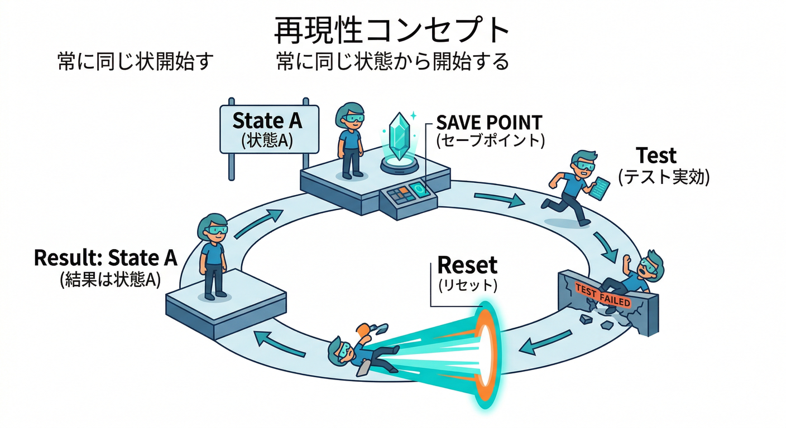
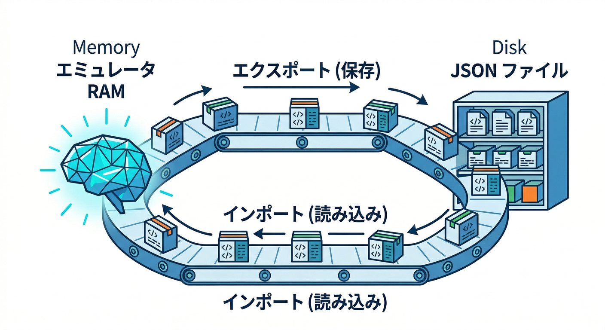
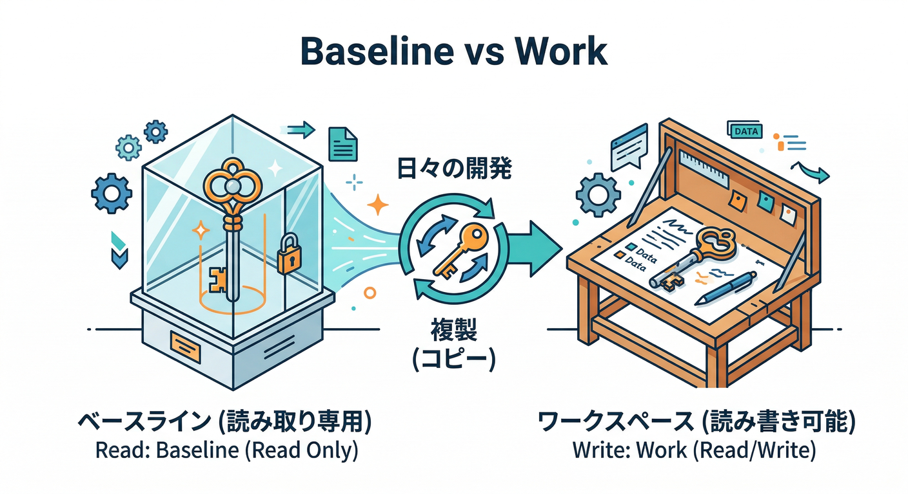
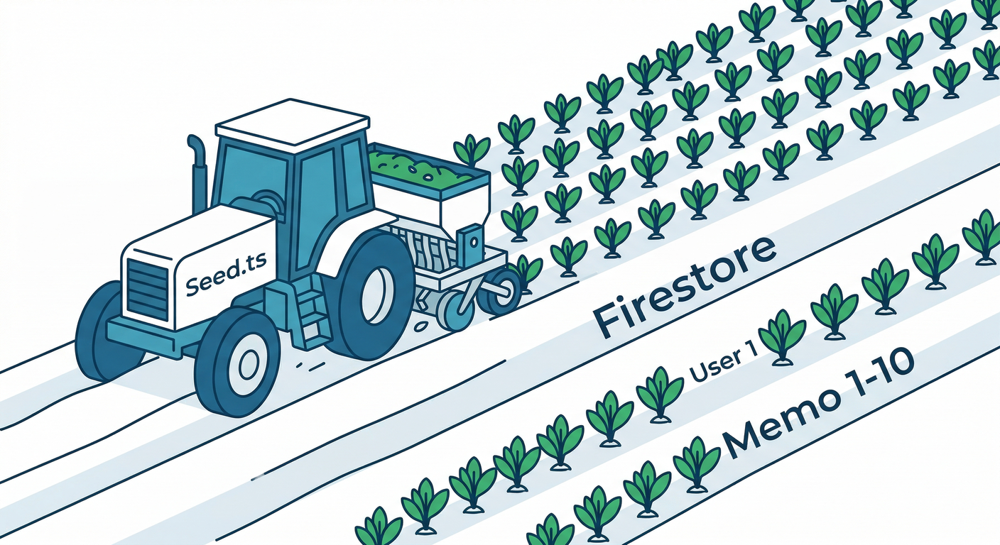
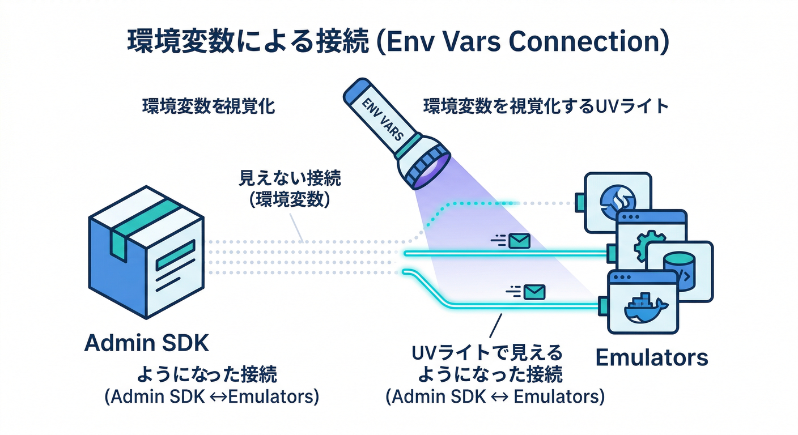
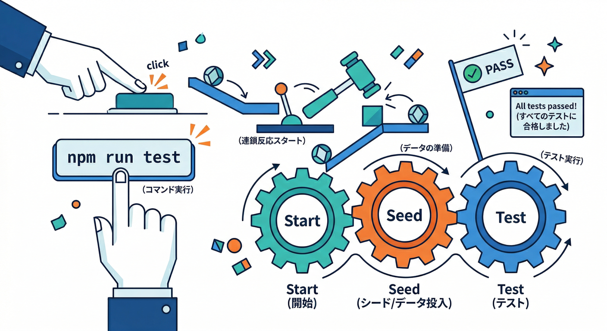

# 第10章　データの初期化と再現：同じ状態から何度でも🧪🔁

この章はズバリ…**「毎回まったく同じ初期状態でテストできる」**を作ります💪✨
エミュレータ開発って、気づくとデータが増えたり壊れたりして「昨日は動いたのに😇」が起きがち。
それを**最小の手間**でゼロにします🧯🔥

---

## この章のゴール🎯



* 起動するたびに **同じユーザー＋同じメモ10件** から始められる🧪🔁
* 「いまの状態を保存」→「いつでも復元」ができる📦↩️
* ついでに、テスト用の“種まき”をワンコマンド化できる🏃‍♂️💨

ポイントはこの2系統👇

1. **import/export（スナップショット方式）**：今の状態を丸ごと保存して復元
2. **seed（種まき方式）**：毎回スクリプトで同じデータを作る

どっちも使います😄✨（使い分けが超大事）

---

## 1) まずはスナップショット方式：import / export 🧳📦



## 重要仕様（ここだけ暗記でOK）🧠

* エクスポートできる対象は **Auth / Firestore / RTDB / Storage** のデータ📤
* 起動時に `--import` を使うと、**エミュレータのメモリ上のデータは上書き**されます（= 初期化に最適）🧽✨
* `--export-on-exit` を付けると、終了時に自動で保存してくれます🧲
* 保存先フォルダには `firebase-export-metadata.json` が入ります（これが“目印”）🪪

このへんは公式のコマンド説明がそのまま根拠です📘([Firebase][1])

---

## 手を動かす①：終了時に自動保存する（最速で便利）🚀

まずは「作業中に増えたデータが、再起動で消えない」状態にします🙂

```bash
firebase emulators:start --only auth,firestore,functions --export-on-exit=./.emulator-data/work
```

* `./.emulator-data/work` に終了時スナップショットが残ります📦✨
* これで「今日はここまで」→「明日続き」が超楽になります😄

`--export-on-exit=...` の挙動は公式に明記されています([Firebase][1])

---

## 手を動かす②：保存した状態から復元する（巻き戻し）⏪🧪

```bash
firebase emulators:start --only auth,firestore,functions --import=./.emulator-data/work
```

* `--import` は **エミュレータのデータを上書き**するので、復元に向いてます🧽
* 逆に言うと、いまのメモリ上の状態は置き換わります（ここ大事）([Firebase][1])

---

## 手を動かす③：「いつでも戻れる初期状態」を別フォルダに作る（超おすすめ）🛟✨



ここがこの章のキモです👇
**baseline（固定の初期状態）** と **work（作業中の状態）** を分けます。

* `./.emulator-data/baseline` … いつでも戻れる初期状態（固定）🧊
* `./.emulator-data/work` … 日々の作業状態（可変）🧪

起動コマンドはこう👇

```bash
firebase emulators:start --only auth,firestore,functions --import=./.emulator-data/baseline --export-on-exit=./.emulator-data/work
```

* 起動時：baseline を読み込む（= 毎回同じスタート）🧊
* 終了時：work に保存（= 今日の作業が残る）📦

`--import` と `--export-on-exit` を別パスにできるのも公式に書かれてます🧠([Firebase][1])

---

## 2) 次は種まき方式：seedスクリプトで「毎回同じ10件」🌱🗃️



スナップショットは便利だけど、**「中身がブラックボックス」**になりやすいです🤔
そこで seed を用意しておくと、

* データの作り方がコードで読める📖
* 10件を20件に増やす、とかが一瞬でできる⚡
* CI（自動テスト）に持っていきやすい🏗️

になります😄✨

## seedのコツ（初心者向け必勝）🏆

* **UIDを固定**（例：`uid_test_001`）🔐
* メモIDも固定か、規則で作る（`memo_01`〜`memo_10`）🧾
* 日付も固定にすると“完全に同じ”が作れる（テストが安定）📅✅

---

## 手を動かす④：Admin SDK をエミュレータに向ける（環境変数）🎯



Admin SDK は、環境変数があると自動でエミュレータに接続してくれます👍

* Auth：`FIREBASE_AUTH_EMULATOR_HOST`（プロトコル無し！）([Firebase][2])
* Firestore：`FIRESTORE_EMULATOR_HOST`（プロトコル無し！）([Firebase][3])

PowerShell例👇

```powershell
$env:FIREBASE_AUTH_EMULATOR_HOST="127.0.0.1:9099"
$env:FIRESTORE_EMULATOR_HOST="127.0.0.1:8080"
node .\scripts\seed.mjs
```

「`http://` を付けないでね」は公式の注意書きです🧠([Firebase][2])

---

## 手を動かす⑤：seedスクリプト例（ユーザー1人＋メモ10件）🧑‍💻🗃️


ここは“雰囲気をつかむ用”のミニ例です👇
（実際はあなたの構成に合わせてファイル分割してOK）

```ts
// scripts/seed.ts（例）
// 目的：Authにテストユーザー1人、Firestoreにメモ10件を作る

import admin from "firebase-admin";

const PROJECT_ID = process.env.GCLOUD_PROJECT ?? "demo-emulator";

admin.initializeApp({ projectId: PROJECT_ID });

async function main() {
  const uid = "uid_test_001";
  const email = "test001@example.com";

  // 1) Auth: ユーザー作成（既にあればスキップ）
  try {
    await admin.auth().getUser(uid);
  } catch {
    await admin.auth().createUser({
      uid,
      email,
      password: "Passw0rd!",
      displayName: "テスト太郎",
    });
  }

  // 2) Firestore: memos コレクションに 10件作成（固定ID）
  const db = admin.firestore();
  const base = new Date("2026-01-01T00:00:00.000Z");

  const batch = db.batch();
  for (let i = 1; i <= 10; i++) {
    const id = `memo_${String(i).padStart(2, "0")}`;
    const ref = db.collection("memos").doc(id);

    batch.set(ref, {
      ownerUid: uid,
      title: `メモ ${i}`,
      body: `これはテスト用メモ ${i} です。`,
      createdAt: new Date(base.getTime() + i * 60_000), // 1分ずつ増える固定時刻
      status: i % 2 === 0 ? "published" : "draft",
    });
  }
  await batch.commit();

  console.log("✅ seed 完了：ユーザー1人＋メモ10件");
}

main().catch((e) => {
  console.error(e);
  process.exit(1);
});
```

* `createdAt` を固定基準から作ってるのは「毎回同じ」を作るためです📌🙂
* “同じ初期状態”が作れると、デバッグが急にラクになります👀✨

Firestore 側は `FIRESTORE_EMULATOR_HOST` があると自動接続、という公式説明が根拠です([Firebase][3])
Auth 側も同様です([Firebase][2])

---

## 3) ワンコマンド化：npm scripts で「毎回同じ」ボタンを作る🔘✨



おすすめはこの3つだけ置くこと👇

* `emu:baseline` … baseline から開始して work に保存（ふだんの開発）🧊➡️🧪
* `seed` … 種まき（ユーザー＋メモ10件）🌱
* `emu:test` … 起動→seed→テスト→終了（CIに近い）🏃‍♂️💨

`emulators:exec` は「起動→スクリプト→自動停止」に向いてる、と公式にも書かれてます([Firebase][1])

例👇

```json
{
  "scripts": {
    "emu:baseline": "firebase emulators:start --only auth,firestore,functions --import=./.emulator-data/baseline --export-on-exit=./.emulator-data/work",
    "seed": "node ./dist/scripts/seed.js",
    "emu:test": "firebase emulators:exec \"npm run seed && npm test\" --only auth,firestore,functions"
  }
}
```

※ `seed` は TypeScript をビルドして `dist` を叩く想定（第12章の話に繋がります🧱🙂）

---

## 4) AIでさらに加速：Antigravity / Gemini CLI で“叩き台”を秒速生成🤖💨

ここ、ちゃんと公式に「そういう連携ができる」って書かれてます👇

* **Firebase MCP server** を使うと、AIツールが Firebase の作業を手伝える（Authユーザー管理、Firestore操作、Rules理解など）([Firebase][4])
* そのMCPクライアントとして **Antigravity** や **Gemini CLI** が挙げられていて、**Firebase CLI** の `npx firebase-tools@latest mcp` を使う構成も説明されています([Firebase][4])
* さらに「AI prompt catalog（プロンプト集）」も用意されていて、MCP対応AI（AntigravityやGemini CLIなど）から使える、と案内されています([Firebase][5])

この章での“AIの使いどころ”はココ👇（超実用）

* ✅ seed スクリプトの雛形を作らせる（固定ID/固定UID/固定時刻まで指定して）
* ✅ 「テスト用メモ本文」を自然な文章で10件分作らせて **JSONに保存**（以後はそのJSONを使う）
* ✅ `package.json` の scripts を整理させる（emu:baseline / emu:test など）

ただし鉄則はこれ😇
**AIは“生成担当”→人間が“レビュー担当”**（特に Rules と初期データは事故ると混乱するので🧯）

---

## ミニ課題🎯：「毎回同じユーザー＋同じメモ10件」から始める🧪🔁

やることはシンプル👇

1. seed を実行してユーザー1人＋メモ10件を作る🌱
2. その状態を `./.emulator-data/baseline` に保存する📦
3. 次回以降は `--import=baseline` で必ず同じスタートにする🧊

保存（エクスポート）はこれ👇（上書き確認を省略したいなら `--force`）([Firebase][1])

```bash
firebase emulators:export ./.emulator-data/baseline --force
```

---

## チェック✅（ここまで来たら勝ち！）

* `--import` で “同じ初期状態” に戻せる（上書きされるのも理解）🧠([Firebase][1])
* `--export-on-exit` で “今日の作業状態” を保存できる📦([Firebase][1])
* baseline / work を分けて、いつでも巻き戻せる🛟✨([Firebase][1])
* Admin SDK を環境変数で Auth/Firestore エミュレータへ向けられる🔐🗃️([Firebase][2])
* `emulators:exec` で「起動→処理→終了」を自動化できる🏃‍♂️💨([Firebase][1])

---

次の第11章では、この“再現できる土台”の上で **Functions Emulator** を動かして、裏側コードもローカルで回していきます⚙️🔥

[1]: https://firebase.google.com/docs/emulator-suite/install_and_configure "Install, configure and integrate Local Emulator Suite  |  Firebase Local Emulator Suite"
[2]: https://firebase.google.com/docs/emulator-suite/connect_auth?utm_source=chatgpt.com "Connect your app to the Authentication Emulator - Firebase"
[3]: https://firebase.google.com/docs/emulator-suite/connect_firestore?utm_source=chatgpt.com "Connect your app to the Cloud Firestore Emulator - Firebase"
[4]: https://firebase.google.com/docs/ai-assistance/mcp-server "Firebase MCP server  |  Develop with AI assistance"
[5]: https://firebase.google.com/docs/ai-assistance/prompt-catalog "AI prompt catalog for Firebase  |  Develop with AI assistance"
