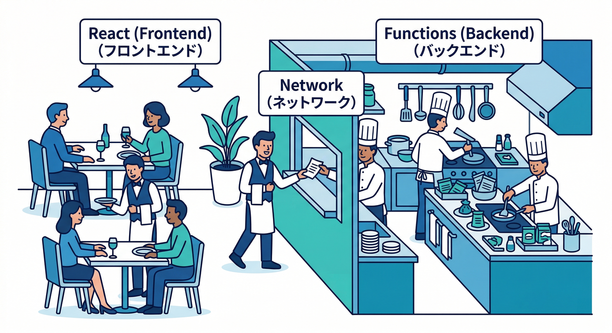
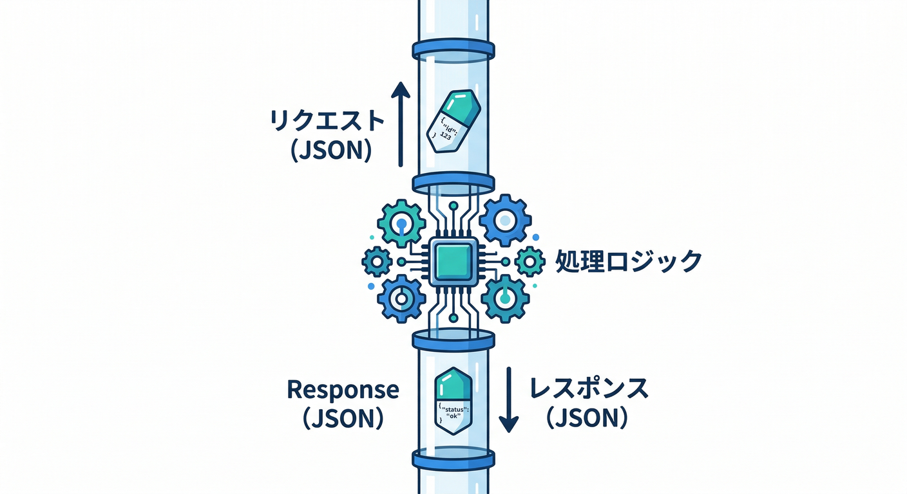
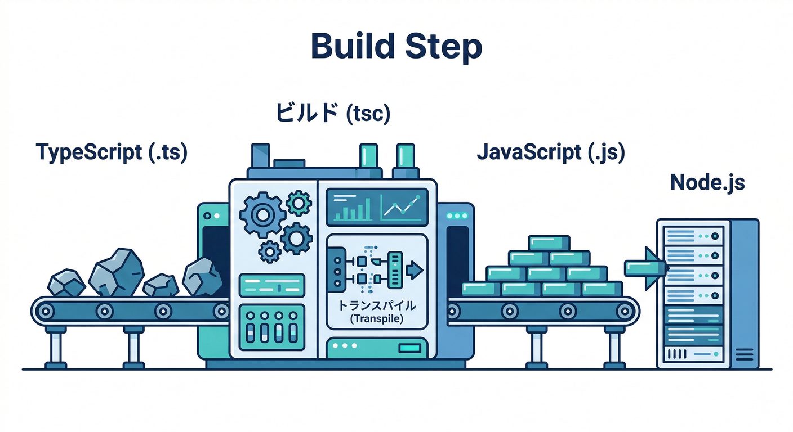
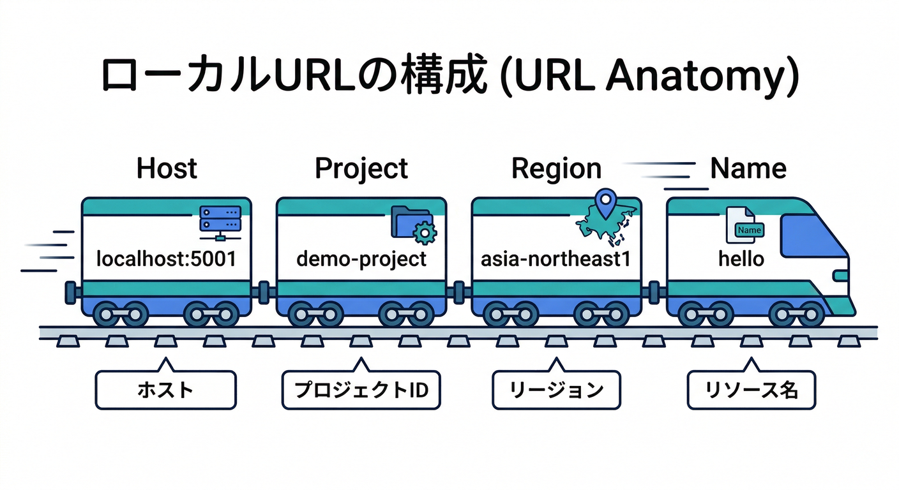
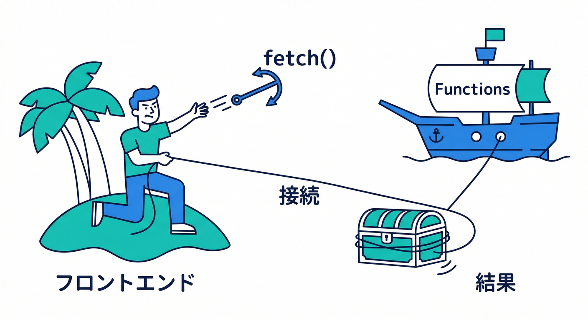
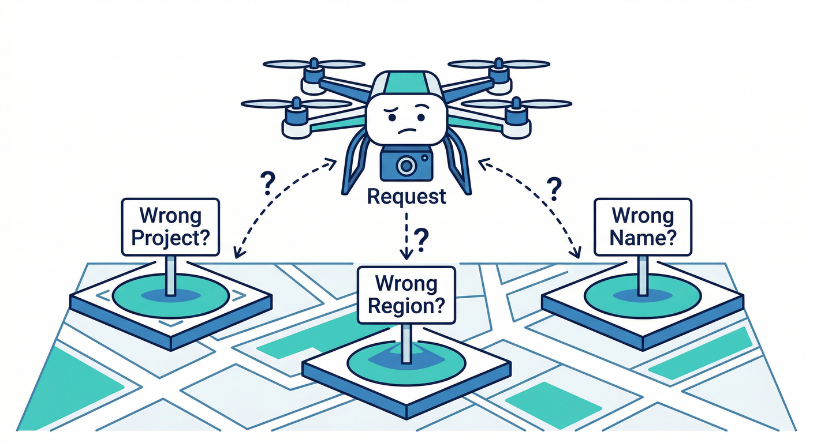
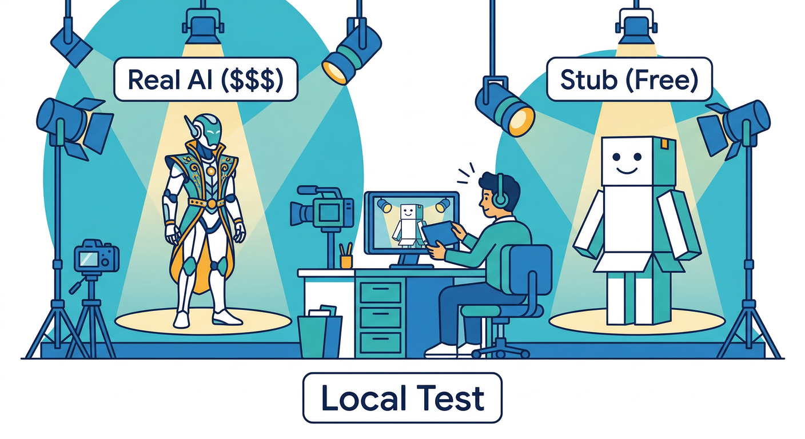

# 第11章　Functions Emulator：裏側コードをローカルで動かす⚙️🔥

この章は「裏側（Functions）」を **デプロイせずに** ローカルで動かして、**URL叩いて動作確認できる**ところまで持っていきます🚀
（“本番に上げる前に、まずローカルで安全に壊す🧪” が正義！）

---

## この章のゴール🎯✨

* Functions をローカル起動して、**HTTP 関数を自分で叩いて動作確認**できる🙌
* 「どのURLで呼ぶの？」「ログはどこ？」が分かる👀
* ついでに **React からエミュ関数へ接続**できる（最小）🔌
* AI を混ぜる場合の「安全な設計（スタブ/切替）」の考え方が持てる🤖🧩

> Functions Emulator では、HTTP / callable / task queue / そして Auth・Firestore・Storage・Pub/Sub などのイベントトリガー系もローカルで再現できます🔥（対応トリガーの種類が多いのが強み）([Firebase][1])
> さらに Emulator Suite のUIは既定で `http://localhost:4000` から見れます👀([Firebase][2])

---

## 1) まずは全体像をイメージ🧠🗺️



## Functions Emulatorが得意なこと💪

* **「裏側だけ」**をローカルで起動して、素早く検証できる⚡([Firebase][1])
* エミュURL（あとで出す）を叩くだけで、**HTTP関数の動作確認**ができる🔨([Firebase][3])
* さらに他のエミュ（Auth/Firestore…）も一緒に起動すれば、**連携テスト**に伸ばせる🧪([Firebase][1])

## よくある勘違い😵‍💫➡️😄

* 「Reactのローカルサーバ＝Functions」じゃないよ！
  React はUI、Functions は裏側。**別プロセス**で動くよ⚙️
* “どのURLで叩くか” は決まった形がある（次で覚える）🧠([Firebase][3])

---

## 2) ハンズオン：HTTP関数 `/hello` を作って叩く🚀📨

ここから「手を動かす🖐️」パート！

## 2-1. `hello` 関数を追加する🧩



Functions のコード（TypeScript想定）に、まず **超シンプルなHTTP関数**を追加します。

```ts
// functions/src/index.ts
import { onRequest } from "firebase-functions/v2/https";

export const hello = onRequest(
  { region: "asia-northeast1" },
  (req, res) => {
    const name = String(req.query.name ?? "world");
    res.json({
      ok: true,
      message: `Hello, ${name}!`,
      serverTime: new Date().toISOString(),
    });
  }
);
```

ポイント💡

* `region` を指定したら、**呼び出しURLにも region が入る**（これ忘れると 404 になりがち😇）
* 返すのは JSON にしとくとデバッグがラク📦

---

## 2-2. いったん“ビルドの儀式”をする🧱✨



TypeScript はそのままでは実行されないので、**まず1回だけ**ビルドします（深掘りは次章でやるよ🧡）。

```bash
cd functions
npm install
npm run build
cd ..
```

> ローカル実行では、TypeScript/React などの “トランスパイルが必要なコード” は **watch（監視）**を使うのが定番、という注意が公式にもあります👀([Firebase][1])

---

## 2-3. Functions Emulator を起動する🔥

まずは Functions だけでOK！（連携は後で伸ばす）

```bash
firebase emulators:start --only functions
```

> `--only functions` の起動はこの章のチェック項目そのものだね✅([Firebase][1])

---

## 2-4. URL を叩いて動作確認する🔨🌐



**HTTP関数の呼び出しURLの形**はこれ👇（超大事！）

* `http://HOST:PORT/PROJECT_ID/REGION/FUNCTION_NAME`

公式の説明にもこのフォーマットが載ってます🧠([Firebase][3])
（例として `https://localhost:5001/PROJECT/us-central1/helloWorld` みたいな形も紹介されています）([Firebase][3])

なので今回の `hello` は、だいたいこんな感じ：

```text
http://127.0.0.1:5001/<あなたのPROJECT_ID>/asia-northeast1/hello?name=Komiyanma
```

### 叩き方（例）🖱️🧪

**ブラウザ**でURLを開く → JSON が返ればOK🙆‍♂️

または **PowerShell** で：

```powershell
Invoke-RestMethod "http://127.0.0.1:5001/<PROJECT_ID>/asia-northeast1/hello?name=Komiyanma"
```

---

## 2-5. ログを見る👀🧾

* まずは起動してるターミナルにログが出るよ🧾
* さらに Emulator Suite UI（既定 `http://localhost:4000`）でも見える👀 ([Firebase][2])

---

## 3) React から Functions Emulator へ接続する🔌⚛️



「UI（React）→ 裏側（Functions）」がつながると、一気に“アプリ感”が出る✨

## 3-1. Functions をエミュに向ける（最小）🔁

```ts
import { getFunctions, connectFunctionsEmulator, httpsCallable } from "firebase/functions";

const functions = getFunctions();
connectFunctionsEmulator(functions, "127.0.0.1", 5001);

const callHello = httpsCallable(functions, "hello"); // ※ onCall ではないので後述の別案が安全
```

> `connectFunctionsEmulator(functions, host, port)` の形は公式に載っています✅([Firebase][3])

⚠️注意（大事）

* `httpsCallable()` は **callable（onCall系）**向けが基本。
  今回の `hello` は HTTP（onRequest）なので、React 側は **fetch** で叩くのが一番わかりやすいよ🙂

## 3-2. HTTP関数を fetch で叩く（おすすめ）🧠✨

```ts
const projectId = "<PROJECT_ID>";
const region = "asia-northeast1";

export async function fetchHello(name: string) {
  const url = `http://127.0.0.1:5001/${projectId}/${region}/hello?name=${encodeURIComponent(name)}`;
  const res = await fetch(url);
  if (!res.ok) throw new Error(`HTTP ${res.status}`);
  return res.json() as Promise<{ ok: boolean; message: string; serverTime: string }>;
}
```

---

## 4) ミニ課題🎯：「/hello」で JSON を返す関数を完成させよう✨

やることはこれだけ！でも達成感はデカい💥

* `/hello` が JSON を返す
* `?name=` を渡すと挨拶が変わる
* Emulator UI かターミナルでログが見える
* React 側から叩けたら最高🙌

---

## 5) チェック✅（理解できたら勝ち！）

* Functions Emulator を `firebase emulators:start --only functions` で起動できる([Firebase][1])
* 呼び出しURLが `HOST:PORT/PROJECT/REGION/NAME` の形だと説明できる([Firebase][3])
* Emulator Suite UI が `http://localhost:4000`（既定）で開ける ([Firebase][2])
* TypeScript はビルド（またはwatch）が必要、という感覚がある([Firebase][1])

---

## 6) よくある詰まりポイント集🧯😇

## 6-1. 404 になる😭



* URLの **PROJECT_ID** が違う
* URLの **region** が違う（`asia-northeast1` にしたのに `us-central1` で叩いてる等）
* 関数名が違う（`hello` のつもりが `helloWorld` 叩いてる等）

## 6-2. 変更したのに反映されない😵‍💫

* TypeScript をビルドしてない
* watch（`tsc -w`）を使ってない
  → “監視ビルド”が次章の主役だよ🧱([Firebase][1])

## 6-3. ポート競合で起動しない🔥

* 5001（Functions）や 4000（UI）が他アプリと衝突
  → どのポートを使うかは、起動ログに出る＆設定で変えられるよ🧠([Firebase][4])

---

## 7) 発展：デバッグを“止めて見る”🪲🧠（おまけ）

「中で何が起きてるか、1行ずつ見たい！」って時はこれ👇

```bash
firebase emulators:start --only functions --inspect-functions
```

`--inspect-functions` を付けると、Node のインスペクタでデバッグしやすくなります（その代わり **直列実行**になったり挙動が変わる点は注意）([Firebase][4])

---

## 8) AIを絡めるコツ🤖🧩（“壊さず試す”設計）

## 8-1. まずは「スタブ（ダミーAI）」で安全に🧯



AI を呼ぶ処理は、ローカルの段階では **固定のダミー結果**を返す設計にしておくと、課金事故や外部要因でテストが壊れるのを防げます🙂
AIモデルは更新・廃止が起きるので、モデル名切替を Remote Config で逃がすのがおすすめ、という方針も公式で強調されています📌([Firebase][5])

## 8-2. Genkit を callable として呼ぶ構成もアリ🧠✨

Cloud Functions for Firebase には、Genkit の Flow を callable function として包む `onCallGenkit` が用意されています🤖📞([Firebase][6])
（いきなり本格AIに行く前に、**“呼び出しの形だけ先に固める”**のに便利！）

## 8-3. Gemini CLI + MCP で“叩き台づくり”を爆速に⚡

* Firebase の MCP サーバーは、エージェントや CLI（Gemini CLI など）が Firebase の情報や手順にアクセスするための仕組みとして案内されています🧰([Firebase][1])
* Gemini CLI の Firebase 拡張は、**MCP サーバーの導入・設定を助ける**用途が明記されています🧩([Firebase][1])

おすすめの使い方（超現実的）👇

* 「`hello` 関数のテスト手順を PowerShell で書いて」
* 「/hello が 404 になる原因候補をチェックリスト化して」
* 「スタブAI→本物AIに差し替える設計案を3パターン出して」
  → **AIに叩き台を作らせて、人間が安全レビュー**が鉄板だよ🔍✅

---

## 9) ついでに：ランタイム目安（2026時点の“今”）🧠🧾

「どの言語がどこで動くの？」を迷子にしないための最短まとめ！

* Cloud Functions for Firebase（FirebaseのFunctions）

  * Node.js は **20 / 22 をフルサポート**、18 は 2025 早期に deprecated の流れ([Firebase][7])
  * Python も対応していて、**3.10〜3.13 をサポート（既定は 3.13）**([Firebase][7])
* さらに別ルート（Cloud Run functions）側では、例えば **.NET 8** や **Python 3.12** の更新が出てきます（Firebase連携は Admin SDK 経由が王道）([Firebase][8])

---

## 次章へのつなぎ🧱➡️😄

次の第12章は、今日ちょっと触れた **「TypeScriptのビルドと起動の流れ」**を、事故らない運用（watch・ショートカット・再起動ルール）まで整理して、**“毎回迷わない形”**に仕上げるよ🔥

---

## 参考（公式）📚

* Cloud Functions をローカルで動かす（Functions Emulator）([Firebase][1])
* Functions Emulator への接続方法・URLフォーマット([Firebase][3])
* Emulator Suite UI（既定 `localhost:4000`）([Firebase][2])
* Functions のサポートランタイム（Node 20/22、Python 3.10〜3.13 など）([Firebase][7])
* Firebase MCP / Gemini CLI 拡張（AI支援）([Firebase][1])
* Firebase AI Logic（モデル更新・App Check・Remote Config の考え方）([Firebase][5])
* Genkit を callable として呼ぶ `onCallGenkit`([Firebase][6])

[1]: https://firebase.google.com/docs/functions/local-emulator "Run functions locally  |  Cloud Functions for Firebase"
[2]: https://firebase.google.com/docs/emulator-suite/connect_and_prototype?utm_source=chatgpt.com "Connect your app and start prototyping - Firebase"
[3]: https://firebase.google.com/docs/emulator-suite/connect_functions "Connect your app to the Cloud Functions Emulator  |  Firebase Local Emulator Suite"
[4]: https://firebase.google.com/docs/emulator-suite/install_and_configure?utm_source=chatgpt.com "Install, configure and integrate Local Emulator Suite - Firebase"
[5]: https://firebase.google.com/docs/ai-logic/solutions/overview "Overview: Firebase AI Logic solutions  |  Firebase AI Logic"
[6]: https://firebase.google.com/docs/functions/oncallgenkit "Invoke Genkit flows from your App  |  Cloud Functions for Firebase"
[7]: https://firebase.google.com/docs/functions/get-started "Get started: write, test, and deploy your first functions  |  Cloud Functions for Firebase"
[8]: https://firebase.google.com/docs/functions/manage-functions "Manage functions  |  Cloud Functions for Firebase"
