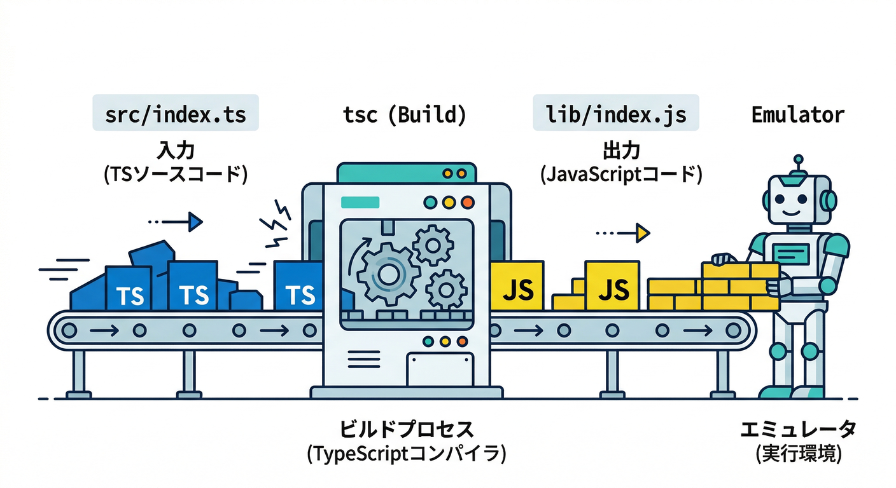
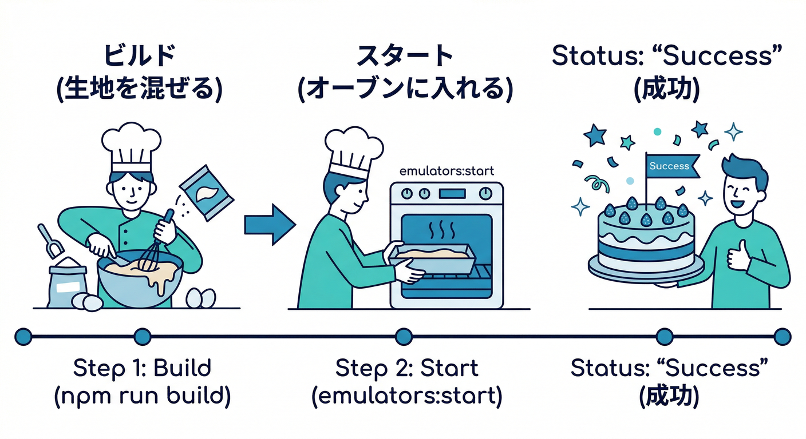
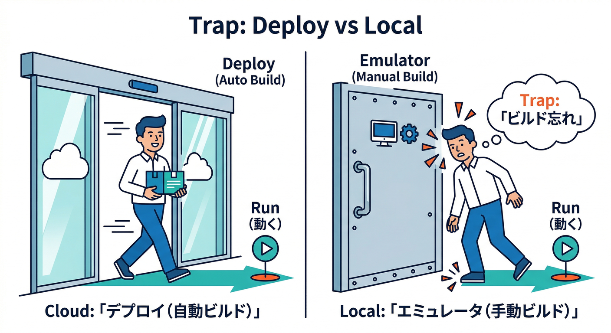
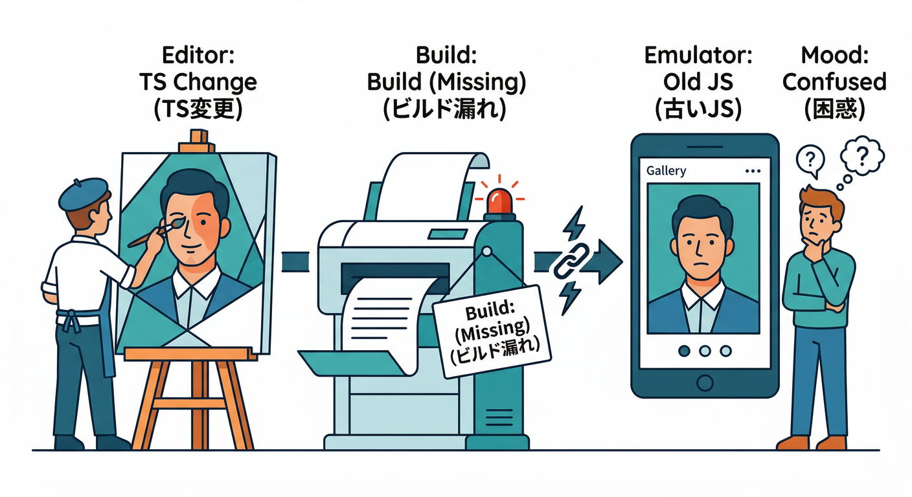
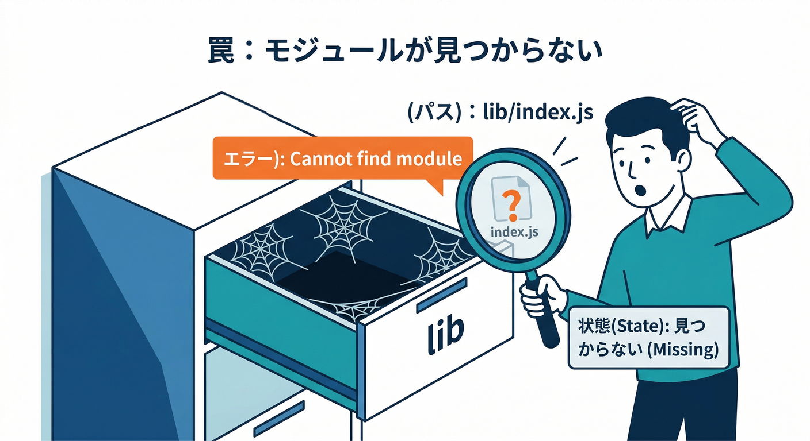
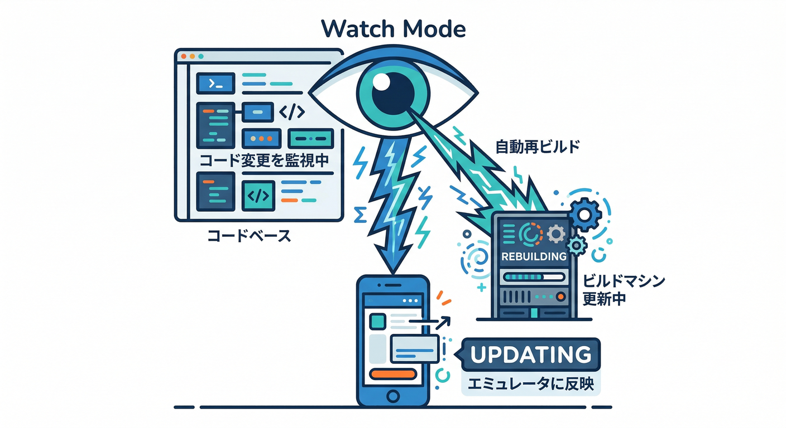
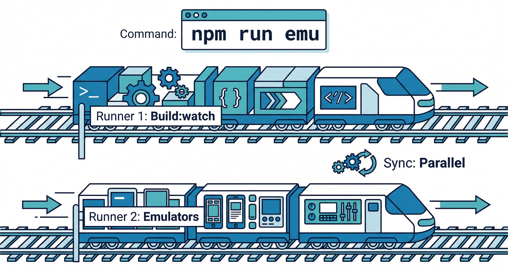

# 第12章　TypeScript Functionsの罠：ビルドと起動の流れ🧱😵‍💫➡️😄

この章は「TypeScriptで書いたFunctionsを、ローカルで確実に動かす」ための **“つまずき回避マニュアル”** だよ〜🧯✨
結論から言うと、**TSはそのままでは動かない → いったんJSにしてから起動**、これだけ覚えればOK🙆‍♂️

---

## この章でできるようになること🎯

* **TS→JS（ビルド）→エミュ起動**の流れを、口で説明できる🗣️✨
* 「起動したのに反映されない😇」を **秒速で直せる** 🔧⚡
* **ワンコマンド運用**（`npm run emu`的な）を作れる🚀
* Gemini系AI（CLI/エージェント）で **ログ解析・スクリプト整備** を爆速化できる🤖💨 ([Firebase][1])

---

## 読む📖：まず“罠”の正体（頭の中の図）🧠🗺️



TypeScriptのFunctionsは、だいたいこんな形になるよ👇
（テンプレ生成でもこの考え方は同じ！） ([Firebase][2])

* `functions/src/index.ts`（あなたが書くTS）
* `tsc`でコンパイル
* `functions/lib/index.js`（実際にエミュが読むJS）

つまり…

**エミュレータが見てるのは TS じゃなくて「ビルド後のJS」** 😵‍💫
だから **ビルドしてないと、更新が反映されない**（もしくは起動に失敗する）ってワケ🧱

---

## 手を動かす🖐️：最短の成功ルート（まずこれで勝つ）🚀✨



## ① 先にビルドする🧱

プロジェクトのルートで👇（PowerShellでもOK）

```bash
npm --prefix functions run build
```

## ② それからエミュを起動する🧪

（ミニ題材アプリ想定で auth/firestore/functions をまとめて）

```bash
firebase emulators:start --only auth,firestore,functions
```

これで **“TSをJSにしてから起動”** が成立！🎉
Firebaseの公式ドキュメントでも、TypeScript関数をエミュするには **事前にコンパイルが必要** だと案内されてるよ ([Firebase][2])

---

## 罠①：「デプロイでは動くのに、ローカルでは動かない」😇



ここが超あるある💥

## なぜ起きる？

デプロイ時は `firebase.json` の **predeploy** でビルドを走らせる作りが多いんだけど…
エミュ起動時にそれが自動で走るとは限らない（＝ビルド忘れで詰む）って感じ🙃 ([Firebase][2])

## 直し方（いちばん確実）

* 起動前に `npm --prefix functions run build`
* もしくは後述の **watch運用** にする

---

## 罠②：「起動したのに反映されない」😵‍💫（ホットリロード勘違い）



Firebase Local Emulator Suite は **Functionsのコード変更を拾ってくれる** んだけど、TypeScriptの場合は前提があるよ👇
**“JSにトランスパイルされた結果が更新されてること”** が必要！ ([Firebase][3])

つまり、TSだけ編集して「反映されない！」ってなるのは自然現象😂

---

## 罠③：「Cannot find module 'lib/index.js'」系（ビルド成果物の迷子）🧟‍♂️



よくあるエラー例👇

* `Cannot find module .../functions/lib/index.js`
* `Functions codebase could not be analyzed...`

## 原因はだいたい2つ🍵

1. **ビルドしてない**（libが存在しない）
2. **出力先の設定ズレ**（`tsconfig.json` の `outDir` と `package.json` の `main` が噛み合ってない）

## 直し方✅

* まずビルド：`npm --prefix functions run build`
* 次に確認：`functions/package.json` の `main` が `lib/index.js` を指してるか
* さらに確認：`functions/tsconfig.json` の `outDir` が `lib` になってるか

テンプレ構成でも「src→lib」前提で説明されてるよ ([Firebase][2])

---

## 罠④：「ローカルのNodeと、本番ランタイムが違う」🧊

ローカルは最新の Node.js を入れがちだけど、Functionsの本番ランタイムは別枠だよ〜🧠

* Cloud Functions for Firebase は **Node.js 20 / 22 をサポート**（Node 18は非推奨の流れ） ([Firebase][4])
* でもローカルでは **Node.js 24（LTS）** みたいな状況が普通に起きる ([Firebase][4])

## 対策（やさしいやつ）🙂

* 「ローカルだけの最新機能」を使いすぎない（本番で爆発しがち💥）
* `functions/package.json` の `engines.node` を 20/22 に合わせる（教材としても安全） ([Firebase][4])

---

## ここからが本番：おすすめ運用 3つ🧰✨（つまずきゼロへ）

## 運用A：単発ビルド→起動（いちばん堅い）🧱✅

```bash
npm --prefix functions run build
firebase emulators:start --only auth,firestore,functions
```

「今から動かすぞ！」ってときに最強💪

---

## 運用B：2ターミナルで watch（いちばん快適）👀⚡



ターミナル①：TSを監視ビルド

```bash
npm --prefix functions run build -- --watch
```

もし `build` が `lint && tsc` みたいになってて watch が微妙なら、`functions/package.json` に watch 用を足すのが楽👇

```json
{
  "scripts": {
    "build": "npm run lint && tsc",
    "build:watch": "tsc --watch"
  }
}
```

ターミナル②：エミュ起動

```bash
firebase emulators:start --only auth,firestore,functions
```

公式ドキュメントでも **TypeScriptは `tsc -w` などでトランスパイルしておく** ことが推奨されてるよ ([Firebase][3])

---

## 運用C：ワンコマンド化（“教材らしさ”MAX）🚀📦



ルートの `package.json` にこういうのを追加すると便利✨
（Windowsでも `npm --prefix` が安定しやすい👍）

```json
{
  "scripts": {
    "emu": "npm --prefix functions run build && firebase emulators:start --only auth,firestore,functions"
  }
}
```

さらに watch まで一発にしたいなら、`concurrently` を使うのが定番（Windowsでも楽）😄
（※インストールは `npm i -D concurrently` ）

```json
{
  "scripts": {
    "emu:watch": "concurrently -k \"npm --prefix functions run build:watch\" \"firebase emulators:start --only auth,firestore,functions\""
  }
}
```

---

## AIで加速🤖💨：Gemini CLI / MCP を“ビルド罠”に使う

ここ、かなり効くよ🔥

## 1) Gemini CLI にFirebase拡張を入れる🧩

Firebase公式が、Gemini CLI用の拡張を用意していて
入れると **MCPサーバーの自動セットアップ** とか、Firebase向けのプロンプトが増えるよ ([Firebase][1])

## 2) Firebase MCP server で“ログ解析→修正案”を出させる🔍

例えば、こう頼むのが強い👇（文章でOK）

* 「Functions emulator のログ貼るので、原因と修正手順を3つに絞って」
* 「tsconfig の outDir と package.json の main がズレてないか確認して」
* 「Windows向けに `npm --prefix` で動く scripts を提案して」

MCPは “Firebaseを扱うAIツールを強化する仕組み” として案内されてるよ ([Firebase][5])

## 3) FirebaseのAIサービスも意識（将来の“AI整形ボタン”へ）🧠✨

この教材の後半で使う「AI整形」系は、モデル更新や置き換えが起きることがあるので
**“モデル切替できる設計”** を前提にすると安心😄
（例：モデルの退役日が明記されてるケースがある） ([Firebase][6])

---

## ミニ課題🎯：ビルドの必要性を“体感”する（めちゃ大事）🔥

## やること💡

1. Functionsに `formatMemo` を追加
2. ビルドしてエミュ起動
3. 返す文字を変える
4. **ビルドしないと反映されない** を体で理解する😂

## 例：`functions/src/index.ts` に追加（HTTP関数）

（テンプレがv2系ならこの形が合いやすい👍）

```ts
import { onRequest } from "firebase-functions/v2/https";

export const formatMemo = onRequest((req, res) => {
  const text = String(req.query.text ?? "");
  const formatted = text.trim().replace(/\s+/g, " ");
  res.json({
    before: text,
    after: formatted,
    reason: "余分な空白をつぶして整形したよ🧼✨",
  });
});
```

## 動かし方🧪

```bash
npm --prefix functions run build
firebase emulators:start --only functions
```

起動ログにURLが出るので、ブラウザで叩く（例）👇
`...?text=  hello   world  ` みたいにして結果を見る👀✨

次に `reason` を変えてみて、**ビルドしないと変わらない** → **watch運用にすると変わる** を確認できたら勝ち🏆

---

## チェック✅（できたら次へGO）

* TSを書いても、エミュが読むのは「ビルド後のJS」って説明できる🧠
* 「反映されない」時に、まず `npm --prefix functions run build` が出てくる⚡
* watch運用（2ターミナル or `concurrently`）が作れた🚀
* AI（Gemini CLI/MCP）にログを渡して原因切り分けできる🤖🔍 ([Firebase][1])

---

次の章（環境変数・秘密情報）に行く前に、もし今の状態で **“よく出るログ”** があったら貼ってくれたら、MCP/Gemini前提で「最短で直す手順」に落として返すよ😄🧯

[1]: https://firebase.google.com/docs/ai-assistance/gcli-extension "Firebase extension for the Gemini CLI  |  Develop with AI assistance"
[2]: https://firebase.google.com/docs/functions/typescript "Use TypeScript for Cloud Functions  |  Cloud Functions for Firebase"
[3]: https://firebase.google.com/docs/functions/local-emulator "Run functions locally  |  Cloud Functions for Firebase"
[4]: https://firebase.google.com/docs/functions/get-started "Get started: write, test, and deploy your first functions  |  Cloud Functions for Firebase"
[5]: https://firebase.google.com/docs/ai-assistance/mcp-server "Firebase MCP server  |  Develop with AI assistance"
[6]: https://firebase.google.com/docs/ai-logic "Gemini API using Firebase AI Logic  |  Firebase AI Logic"
