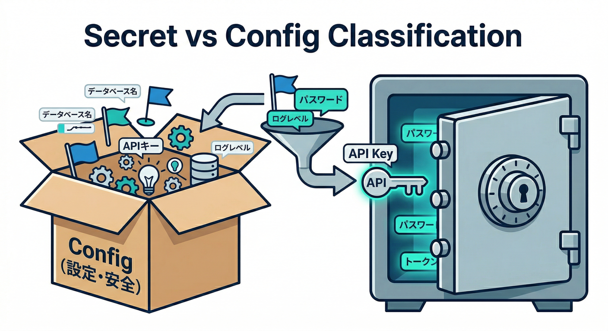
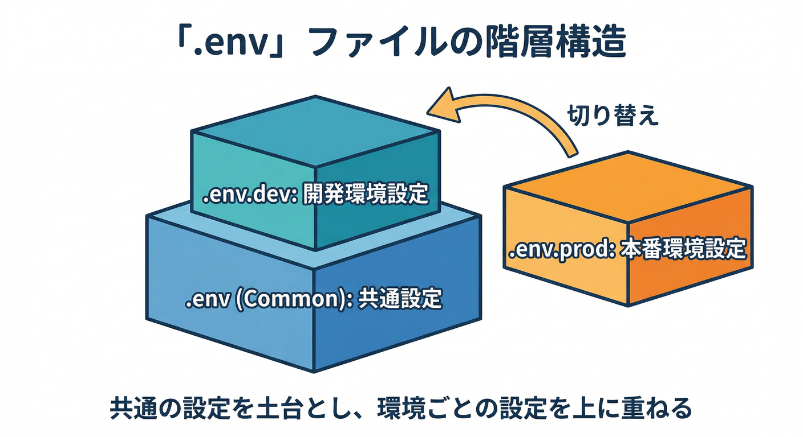
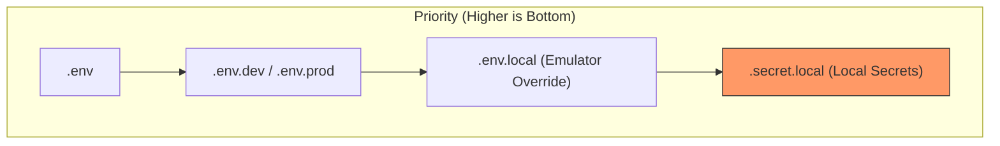
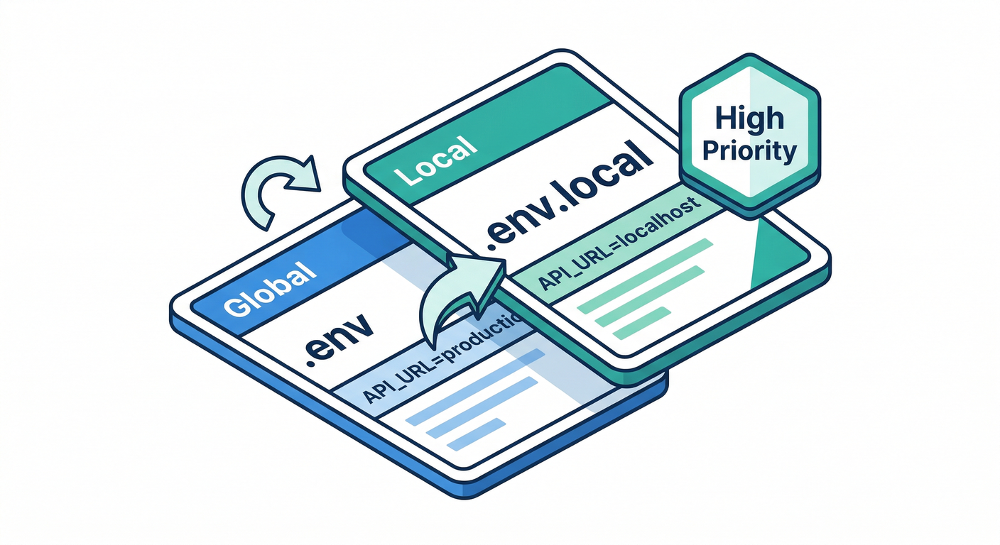
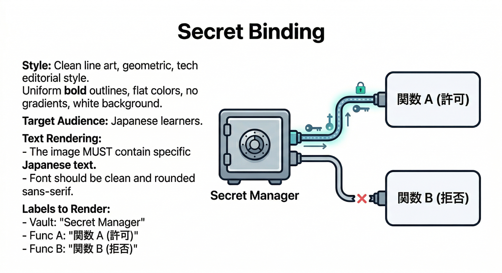
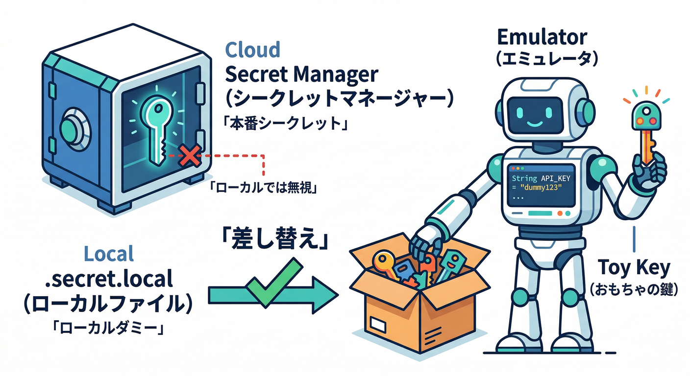
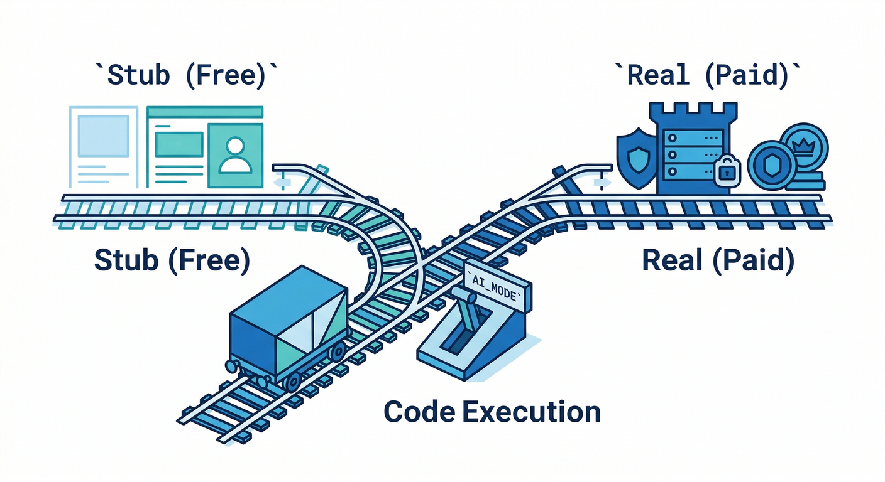
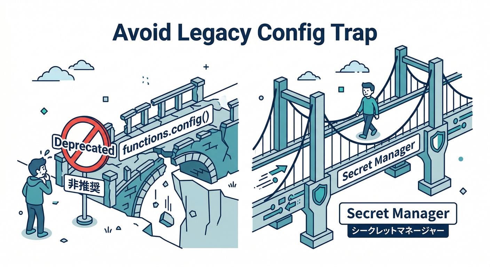

# 第13章　環境変数と秘密情報：ローカルでも事故らない🧪🔐

この章は「**ローカルで動いてるのに、うっかり本番の秘密を触った**」「**APIキーをGitに入れてしまった**」みたいな事故を、先に潰す回です😇🧯
結論から言うと――

* **ただの設定値** 👉 `.env` / `.env.dev` / `.env.prod` などでOK ✅
* **秘密（課金や権限につながるもの）** 👉 **Secret Manager + secretsバインド** が基本 ✅
* **エミュレータだけで差し替えたい秘密** 👉 `.secret.local` が最強 ✅ ([Firebase][1])

（ここで言う「Functions」は Firebase の Cloud Functions for Firebase のことだよ🧩）

---

## 今日のゴール🎯✨

* `.env` と `.env.local` の役割が言える🙂
* 秘密を **Secret Manager** に入れて、**関数にだけ渡す**（バインド）仕組みが分かる🔐
* ローカルでだけ秘密を差し替える `.secret.local` が使える🧪
* AI（Genkit / Gemini系）を使う時に「秘密を漏らさない設計」ができる🤖🛡️

---

## 1) まず「秘密」と「秘密じゃない」を分けよう🧠🔎



## ✅ 秘密じゃないものの例

* `ENV=dev` / `FEATURE_X=true` みたいな **動作モード**
* 画面表示の切り替え用フラグ
* Firebase Webアプリの `apiKey` などの **Firebase設定**（これは“秘匿情報”扱いではない、ただし利用制限は大事）([Firebase][2])

> 「Firebaseの apiKey は見えてもOK」だけど、
> **“外部AIのAPIキー”** や **決済キー** は別物だよ⚠️🔥（＝課金・権限に直結）

## ❌ 秘密の例

* 外部AIサービスのAPIキー（例：Gemini API key）
* 決済/メール送信/CRMなどのトークン
* DB接続情報、サービスアカウント鍵、強い権限のトークン

---

## 2) `.env` の基本ルール🙂🧾





Cloud Functions for Firebase は **dotenv形式**の `.env` を読み込めて、コード側は `process.env` で参照できるよ🧩([Firebase][1])
さらに **プロジェクト（またはエイリアス）別**に `.env.dev` / `.env.prod` みたいに分けられるのが便利✨([Firebase][1])

例：`functions/.env`（みんな共通の“ただの設定”だけ入れる）

```ini
ENVIRONMENT=dev
AI_MODE=stub
```

コードから読む（Node/TypeScript例）

```ts
import { onRequest } from "firebase-functions/v2/https";

export const envCheck = onRequest((req, res) => {
  res.json({
    env: process.env.ENVIRONMENT ?? "unknown",
    aiMode: process.env.AI_MODE ?? "unknown",
  });
});
```

---

## 3) ローカルだけ上書きする `.env.local` が神🧪🔀



エミュレータ起動時、**`.env.local` は `.env` や `.env.<project or alias>` より優先**されるよ💪([Firebase][1])

例：`functions/.env.local`（ローカルだけAIを必ずスタブに）

```ini
AI_MODE=stub
ENVIRONMENT=local
```

これで、うっかり本物のAI呼び出し（＝課金）をしにくくなる😄💸🧯

---

## 4) `.env` に「秘密」を入れちゃダメ🙅‍♂️🔐

公式にもハッキリ書いてあって、`.env` は **安全な秘密保管庫ではない**よ⚠️
Git管理に入った瞬間、事故の温床🥲([Firebase][1])

なので秘密はこうする👇

## ✅ 秘密は Secret Manager + secretsバインド

Cloud Functions for Firebase は **Google Cloud Secret Manager** と統合されていて、秘密を安全に扱えるよ🔐([Firebase][1])

---

## 5) 秘密を安全に使う最短手順🚀🔑



## ステップA：秘密を登録する

例：Gemini APIキーを登録（対話で値を入れる）

```bash
firebase functions:secrets:set GOOGLE_GENAI_API_KEY
```

「APIキーは課金される可能性があるから漏らさないでね」って注意まで書いてあるやつ😇([Firebase][3])

## ステップB：その秘密が必要な関数だけに渡す

**ポイント：`secrets: [...]` を書いた関数だけが読める**🧠
（書き忘れると `process.env.SECRET_NAME` が `undefined` になる）([Firebase][1])

```ts
import { onRequest } from "firebase-functions/v2/https";

export const callAI = onRequest(
  { secrets: ["GOOGLE_GENAI_API_KEY"] },
  async (req, res) => {
    // ✅ secretsバインドした関数だけ参照できる
    const key = process.env.GOOGLE_GENAI_API_KEY;

    // ⚠️ 絶対にログやレスポンスへ出さない
    res.json({ ok: true, hasKey: !!key });
  }
);
```

---

## 6) エミュレータで秘密を差し替える `.secret.local` 🧪🧰



エミュレータは（権限がある場合）本番のSecret Managerを見に行こうとすることがあるんだけど、
CI環境などで失敗するケースがあるよね🤝💦

そこで `.secret.local` で **ローカル専用の秘密**に差し替えられる！([Firebase][1])

例：`functions/.secret.local`

```ini
GOOGLE_GENAI_API_KEY="dummy-local-key"
```

これでローカルではダミーキー、本番ではSecret Manager、って分けられる🧯✨([Firebase][1])

---

## 7) AIを絡めた実戦ミニ題材🤖🪄



ここから「自動整形ボタン（Functions）」に直結させるよ🔥
**AIの呼び出しは2モード**にするのが安心：

* `AI_MODE=stub` 👉 ローカルは固定JSONを返す（課金ゼロ・安定）🙂
* `AI_MODE=real` 👉 本番だけ本物のAIを呼ぶ（秘密はSecret Manager）🔐

```ts
import { onRequest } from "firebase-functions/v2/https";

export const formatMemo = onRequest(
  { secrets: ["GOOGLE_GENAI_API_KEY"] },
  async (req, res) => {
    const mode = process.env.AI_MODE ?? "stub";

    if (mode === "stub") {
      return res.json({
        mode,
        formatted: "【スタブ】ここに整形結果っぽい文章が入るよ🙂",
        reason: "ローカルなので安全のためスタブ応答",
      });
    }

    // realモード：本物のAIを呼ぶ想定（この章では骨組みだけ）
    const key = process.env.GOOGLE_GENAI_API_KEY;
    if (!key) return res.status(500).json({ error: "missing AI key" });

    // ⚠️ keyをログに出さない！
    // TODO: Genkit等でAI呼び出し
    return res.json({ mode, formatted: "【real】AI整形結果（仮）" });
  }
);
```

---

## 8) Genkit まで一気に繋ぐならこう🧩🤖

Genkit の `onCallGenkit` を使うチュートリアルでも、**秘密は Secret Manager に入れて**、関数に `secrets` で渡す流れになってるよ✅([Firebase][3])
しかも例が「Gemini APIキーを漏らすと課金される可能性があるから危ない」ってめちゃ現実的😄💸([Firebase][3])

---

## 9) ついでに大事な地雷🧨😵‍💫



## ✅ 予約済みの環境変数名を使わない

`.env` に **FIREBASE_** / **X_GOOGLE_** などの予約プレフィックスや、予約キーがあるよ。踏むと変な挙動になるので避けよう🧯([Firebase][1])

## ✅ `functions.config()` は卒業方向

`functions.config()` は非推奨で、**2027年3月以降は新規デプロイが失敗する**予定だよ⚠️
今から作る教材は Secret Manager 方式に寄せた方が安全🙌([Firebase][1])

---

## 10) AIで“漏洩チェック”をする🕵️‍♂️🤖

Gemini CLI の Firebase拡張は、Firebaseのドキュメント参照やコード支援、さらに **Firebase AI Logic を使ったGemini APIの安全な利用コード生成**みたいなプロンプト例まで用意されてるよ🧩([Firebase][4])

おすすめの使い方👇（この章の目的にドンピシャ）

* 「`functions/.env` と `.env.local` と `.secret.local` の運用ルールを文章化して」📝
* 「`.gitignore` に入れるべきものを提案して」🧯
* 「ログに秘密が出ないようにコードをレビューして」👀🔐

---

## ミニ課題🎯🧪

1. `AI_MODE=stub` のとき、必ず固定JSONを返すようにする🙂
2. `AI_MODE=real` のときだけ `secrets` を使うルートに入る🔐
3. レスポンスにもログにも **秘密の値を絶対に出さない**（`hasKey: true` くらいまで）🫥✅

---

## チェック✅✨

* `.env.local` が `.env` より強いのを説明できる🧠([Firebase][1])
* 秘密は Secret Manager + `secrets:` で「必要な関数だけ」に渡せる🛡️([Firebase][1])
* ローカルは `.secret.local` で秘密を差し替えられる🧪([Firebase][1])
* Firebaseの `apiKey` と「外部AIのAPIキー」を混同しない🙂🧠([Firebase][2])

---

## おまけ：ランタイム小ネタ🧾🧩

* Cloud Functions for Firebase と Firebase CLI は **Node.js 20/22 をフルサポート**（Node 18は非推奨の流れ）([Firebase][5])
* 「.NETで関数」系は Cloud Run functions 側の文脈になって、**.NET 8** が 2nd gen でGAになった記録があるよ🧠([Google Cloud Documentation][6])

---

次の章（連携テスト）に向けて、もしよければ👇も一緒に作れるよ🙂🔥
「**`.gitignore` と `.env.example` のテンプレ**」＋「**AI_MODEの切り替え手順書**」を教材用に整えて、章末付録にしちゃおう📎✨

[1]: https://firebase.google.com/docs/functions/config-env "Configure your environment  |  Cloud Functions for Firebase"
[2]: https://firebase.google.com/docs/projects/api-keys "Learn about using and managing API keys for Firebase  |  Firebase Documentation"
[3]: https://firebase.google.com/docs/functions/oncallgenkit "Invoke Genkit flows from your App  |  Cloud Functions for Firebase"
[4]: https://firebase.google.com/docs/ai-assistance/gcli-extension "Firebase extension for the Gemini CLI  |  Develop with AI assistance"
[5]: https://firebase.google.com/docs/functions/get-started?utm_source=chatgpt.com "Get started: write, test, and deploy your first functions - Firebase"
[6]: https://docs.cloud.google.com/functions/docs/release-notes?utm_source=chatgpt.com "Cloud Run functions (formerly known as Cloud Functions ..."
