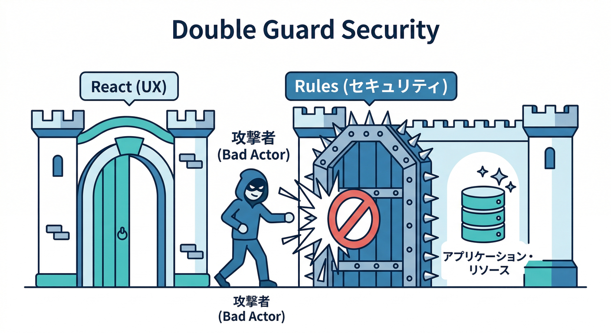
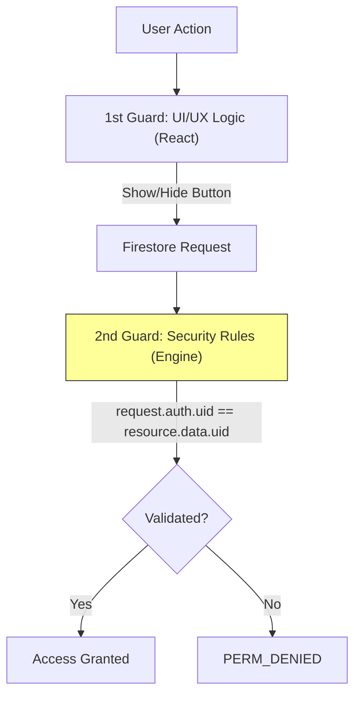
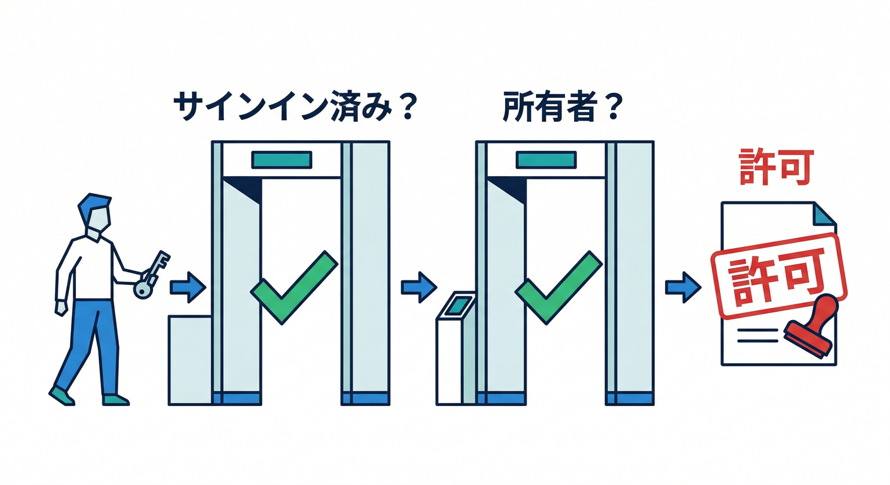
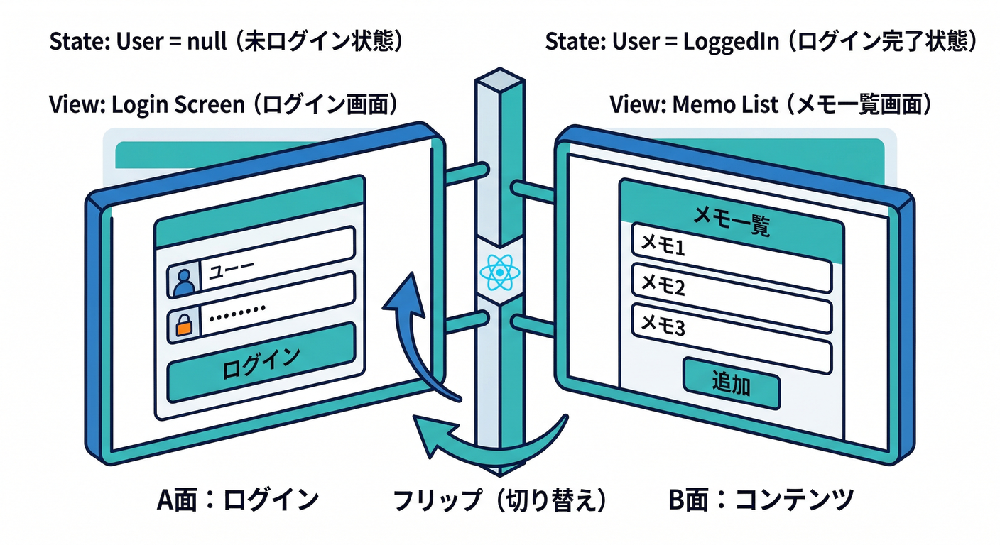
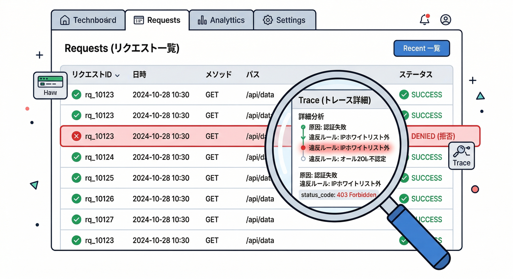

# 第14章　連携テスト①：Auth × Firestore（本人だけ読める）👮‍♂️🗃️

この章は「**ログインしてる人だけが、自分のメモだけ見られる**」を、**ローカルで安全に**作って確かめます🧪✨
ポイントはこれ👇

* 画面（React）が「それっぽく」隠しても、**それだけじゃダメ**🙅‍♂️
* 最後は必ず **Firestore Security Rules** が門番になる🛡️
* そして **Emulator UI** で「なぜOK/NGになったか」を目で追える👀🧾 ([Firebase][1])

---

## 今日のゴール🎯

1. 未ログインだと、メモ一覧が **読めない** 🔒
2. ログインすると、自分のメモだけ **読める** 🗃️
3. 他人のメモを読もうとすると、**Rulesで確実に拒否** 🛑
4. Emulator UI の **Requests** で、拒否理由を追跡できる👀 ([Firebase][1])

---

## 1) まず “二重ガード” の考え方🧠🔐





「本人だけ読める」を本当に強くするには、ガードを2枚にします👇

* **1枚目（UX）**：React側で「ログインしてないなら見せない」🙂
* **2枚目（本命）**：Firestore Rules で「本人以外の読み書きを拒否」👮‍♂️

Firestore は **Auth と Rules を組み合わせて**ユーザー単位のアクセス制御を作るのが基本だよ、って公式も強調してます📚 ([Firebase][2])

---

## 2) “本人判定” のためのデータ設計（最小）🗂️✍️


今回はコレクションをこうします👇

* `memos/{memoId}`

  * `uid`: 作成者のUID（**超重要**）
  * `title`: タイトル
  * `body`: 本文
  * `updatedAt`: 更新日時（まずは型が合えばOK）

なぜ `uid` が必須？🤔
→ Rules は「このデータの持ち主は誰？」を **データから判断** するので、持ち主情報が必要なんだね🧠✨

---

## 3) ルールを書く：本人だけ read/write 🛡️🧾



Firestore Rules の条件は、`request.auth` を使って「ログインしてる？」や「uid一致する？」を判定できます🔑 ([Firebase][3])

まずは初心者に優しい、でも堅い最小ルール👇（`firestore.rules` 例）

```rules
rules_version = '2';
service cloud.firestore {
  match /databases/{database}/documents {

    function signedIn() {
      return request.auth != null;
    }

    function isOwner() {
      return signedIn() && resource.data.uid == request.auth.uid;
    }

    match /memos/{memoId} {

      // 読む：ログイン済み かつ 持ち主だけ
      allow get, list: if isOwner();

      // 作る：ログイン済み かつ 作成uidが自分
      allow create: if signedIn()
                    && request.resource.data.uid == request.auth.uid;

      // 更新/削除：ログイン済み かつ 既存データの持ち主だけ
      allow update, delete: if isOwner();
    }
  }
}
```

> ✅ これで「他人のメモを読む」「他人のuidで作る」は、フロントが頑張っても通りません💪🔥

---

## 4) React側：エミュレータ接続＆ログイン状態で画面を切り替える🔌🙂

## 4-1) Auth / Firestore をエミュへ向ける🧪


Web SDK で Auth エミュレータに繋ぐには `connectAuthEmulator` を使います🔐 ([Firebase][4])
Firestore は `connectFirestoreEmulator` でOK🗃️ ([Firebase][1])

```ts
import { initializeApp } from "firebase/app";
import { getAuth, connectAuthEmulator } from "firebase/auth";
import { getFirestore, connectFirestoreEmulator } from "firebase/firestore";

const app = initializeApp(firebaseConfig);

export const auth = getAuth(app);
export const db = getFirestore(app);

// 例：開発時だけエミュに接続（やり方は第4章の“安全スイッチ”で作った形に合わせてOK）
if (import.meta.env.DEV) {
  connectAuthEmulator(auth, "http://127.0.0.1:9099");
  connectFirestoreEmulator(db, "127.0.0.1", 8080);
}
```

> 🔥 ここがズレると全部ハマるので、まずはここだけ丁寧に！
> Auth は URL 形式（`http://...`）で渡すのがWeb SDKの定番です🧠 ([Firebase][4])

---

## 4-2) ログインしてないなら「見せない」画面にする🙈➡️🙂



```tsx
import { onAuthStateChanged, User } from "firebase/auth";
import { useEffect, useState } from "react";
import { auth } from "./firebase";

export function App() {
  const [user, setUser] = useState<User | null>(null);

  useEffect(() => onAuthStateChanged(auth, setUser), []);

  if (!user) {
    return (
      <div>
        <h1>メモアプリ📝</h1>
        <p>ログインすると自分のメモが見られます🔐</p>
        {/* ここにログインUI（Email/Passwordなど） */}
      </div>
    );
  }

  return <MemoList uid={user.uid} />;
}
```

これが **1枚目のガード（UX）** だよ🙂✨
でも本丸は次👇

---

## 5) Firestore側：自分のメモだけ取得する（でもRulesが本命）🗃️🔍

クエリは “自分のuidで絞る” のが基本🧩

```ts
import { collection, query, where, getDocs } from "firebase/firestore";
import { db } from "./firebase";

export async function loadMyMemos(uid: string) {
  const q = query(
    collection(db, "memos"),
    where("uid", "==", uid),
  );

  const snap = await getDocs(q);
  return snap.docs.map(d => ({ id: d.id, ...d.data() }));
}
```

ここで大事な一言📣
👉 **この絞り込みは“便利”だけど“安全”ではない**
安全は Rules が担保します🛡️（だから二重ガードが強い）

---

## 6) 連携テスト：わざと “悪いこと” してみよう😈➡️🧪

ここからが楽しいところ😄🎮

## 6-1) テストユーザーを作る（Emulator UI）👤✨


Emulator Suite には UI があって、Authのユーザーも手で作れます🖱️ ([Firebase][5])

* Emulator UI を開く
* **Authentication** タブ → **Add user**
* 2人作る（例：Aさん / Bさん）

（UIがローカルのFirebaseコンソールみたいに使える、って位置づけです🙂） ([Firebase][6])

## 6-2) Aでログインしてメモを作る📝

作成時は必ず `uid: user.uid` を入れる！

## 6-3) BでログインしてAのメモを読もうとしてみる🕵️‍♂️

やり方は2つ👇

* **ズルいUI**を作って `memoId` を直打ちで `getDoc()` する
* もしくは “Aのuidでwhere” してみる（UIからはできないけどコードで）

結果は……
✅ **Rulesで拒否される**（これが正解）🛑🔥

---

## 7) 失敗の理由を “目で見る” ：Requestsタブで追跡👀🧾



Firestore エミュレータは **Requests Monitor** で、リクエストと Rules 評価の流れが見えます👀✨ ([Firebase][1])

見る場所👇

* Emulator UI → **Firestore** → **Requests**
* 拒否されたリクエストをクリック
* 「どの match に入って、どの条件が false だったか」を追う🧠

これができるようになると、Rulesが一気に怖くなくなります😄💪

---

## 8) ミニ課題🎯：未ログイン時のUXを “ちゃんと優しく” する🙂💡

## お題📝

未ログインのときにこうしてみて👇

* 「ログインすると自分のメモが見られるよ🔐」を表示
* ログインボタン（Email/PasswordでもOK）を置く
* もし Firestore で権限エラーが出たら、
  “怖いエラー文” をそのまま出さずに
  「権限がありませんでした🙏（ログイン状態を確認してね）」に置き換える

## 追加チャレンジ🔥（できたら神）

* 「デモ用ログイン（A/B）」のボタンを2つ置く
  → ボタン1つでログインできると、検証が爆速になります🚀

---

## 9) チェック✅（できたら合格🎉）

* [ ] 未ログインだとメモ一覧が出ない🔒
* [ ] ログインすると自分のメモだけ見える🙂
* [ ] 他人のメモを読もうとすると拒否される🛑
* [ ] Requestsで「なぜ拒否か」を説明できる👀🧠 ([Firebase][1])
* [ ] 「UIの制限はUX」「Rulesが本命セキュリティ」と言える🛡️

---

## 🤖 AIで加速コーナー：Rulesの叩き台→人間レビュー✍️✨

最近のFirebaseは、AI支援（MCPサーバーやGemini CLI拡張）で **ドキュメント参照や作業支援** を強化してます🤖💨 ([Firebase][7])

## 使いどころ（この章で超相性いいやつ）🧩

* 「memosのRulesを“本人だけ”にしたい。穴がない？」をAIにレビューさせる
* 「弾かれるケース（失敗テスト）」のアイデアを出してもらう
* 「Rulesを読みやすく関数化して」みたいな整形を頼む

例：Gemini CLIに投げるプロンプト案👇

```bash
gemini --prompt "Firestore Security Rulesで、memos/{memoId} を本人(uid一致)だけ read/write 可能にしたい。createは request.resource.data.uid == request.auth.uid を必須。典型的な抜け穴がないかレビューして、改善案を箇条書きで。"
```

> ⚠️ ただしAIが出したRulesは、そのまま採用しないで
> **Emulator UIのRequestsで必ず検証** → 人間がOK出す、が最強です💪👀 ([Firebase][6])

---

## 次章につながる予告📨⚡

次は **「Firestoreイベント → Functions自動処理」** で、
メモ追加をトリガーに “自動整形” が回る世界に入ります🔥🧩

[1]: https://firebase.google.com/docs/emulator-suite/connect_firestore?utm_source=chatgpt.com "Connect your app to the Cloud Firestore Emulator - Firebase"
[2]: https://firebase.google.com/docs/firestore/security/get-started?utm_source=chatgpt.com "Get started with Cloud Firestore Security Rules - Firebase"
[3]: https://firebase.google.com/docs/firestore/security/rules-conditions?utm_source=chatgpt.com "Writing conditions for Cloud Firestore Security Rules - Firebase"
[4]: https://firebase.google.com/docs/emulator-suite/connect_auth?utm_source=chatgpt.com "Connect your app to the Authentication Emulator - Firebase"
[5]: https://firebase.google.com/docs/emulator-suite?utm_source=chatgpt.com "Introduction to Firebase Local Emulator Suite"
[6]: https://firebase.google.com/docs/emulator-suite/connect_and_prototype?utm_source=chatgpt.com "Connect your app and start prototyping - Firebase"
[7]: https://firebase.google.com/docs/ai-assistance/mcp-server?utm_source=chatgpt.com "Firebase MCP server | Develop with AI assistance - Google"
