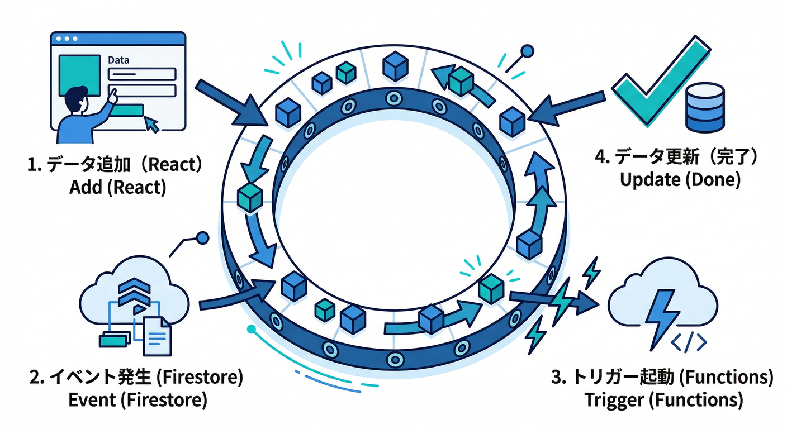
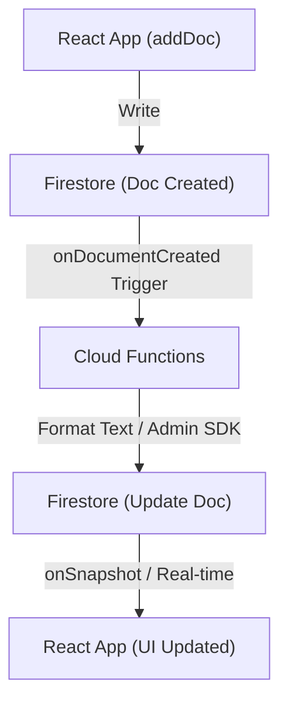
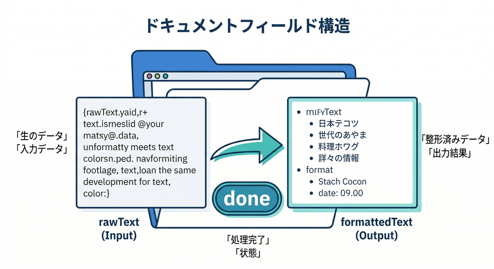
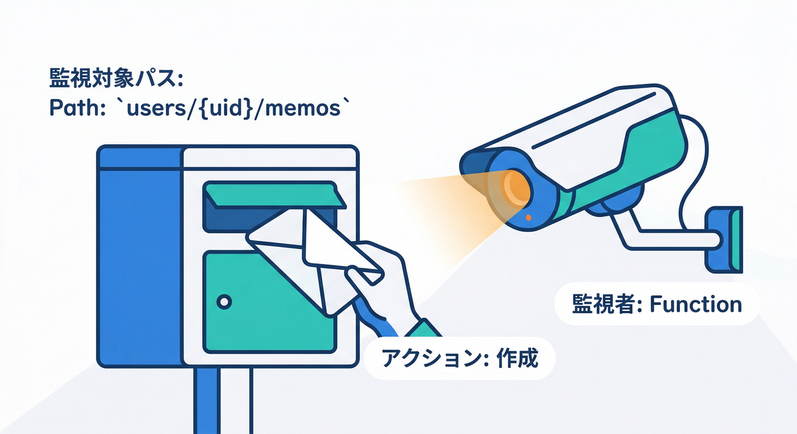
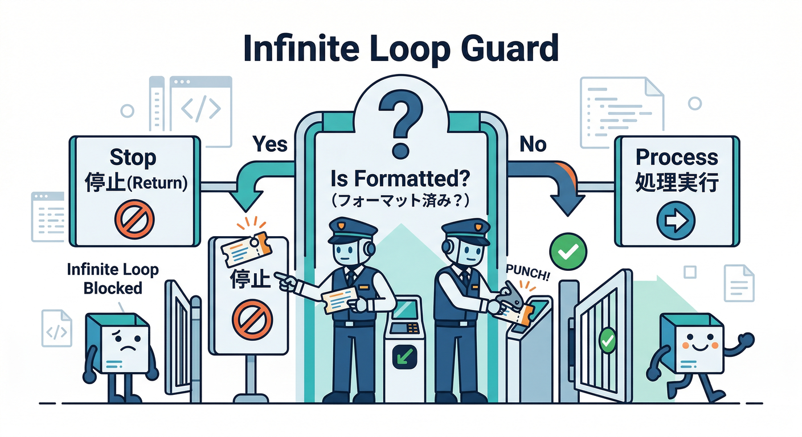
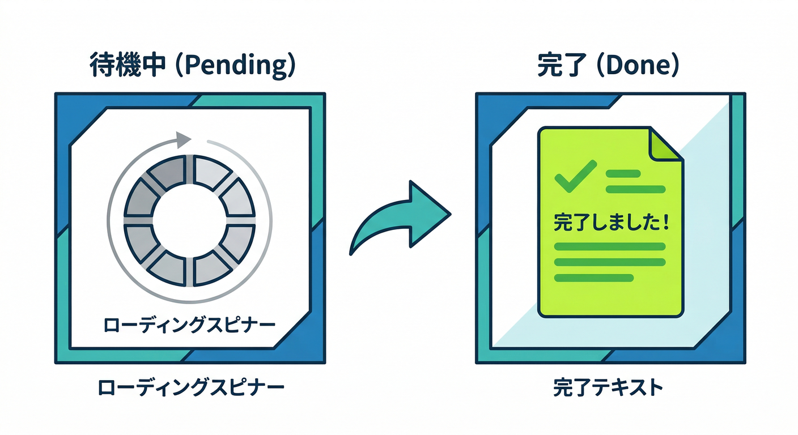
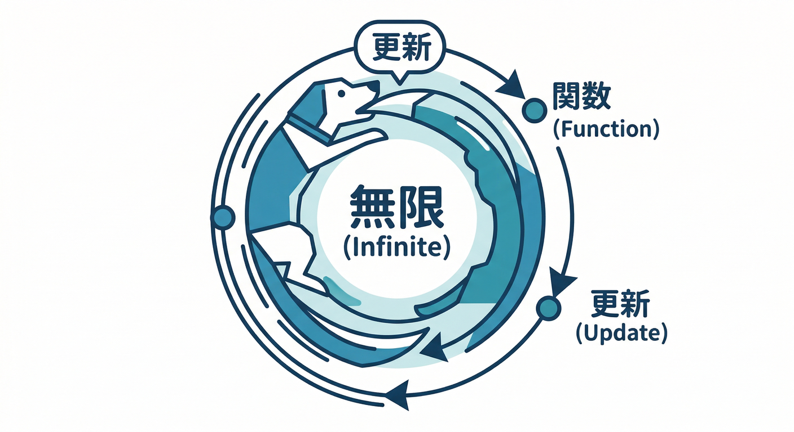

# 第15章　連携テスト②：Firestoreイベント → Functions自動処理⚡📨

## この章のゴール🎯✨

* メモを追加したら **勝手にFunctionsが動く** のを体感する😆⚡
* Firestoreのドキュメントに **整形済みフィールド**（例：`formattedText`）が自動で入る✅
* Emulator UIで「いつ」「どの関数が」「何をしたか」を追える👀🧾([Firebase][2])

---

## まずイメージ図🧠🗺️（これが“イベント駆動”）





1. Reactでメモ追加📝
2. Firestoreに新規ドキュメント作成📄
3. Firestoreイベント発生⚡
4. Functions（Firestoreトリガー）が自動実行🤖
5. `formattedText` や `formatStatus` を追記して保存✅
6. 画面が更新されて整形結果が見える👀✨

Firestoreのイベントは「ドキュメントが変わった」ことをトリガーに動きます（**同じ内容の“空振り更新”はイベントにならない**、などのクセもあります）([Firebase][3])

---

## 1) データ設計：まずフィールドを決めよう🧩🗃️



今回のメモをこんな形にします（最小構成）👇

* `rawText`：ユーザーが入力した生の文章📝
* `formattedText`：Functionsが整形した結果✨
* `formatStatus`：`"pending" | "done" | "error"`（進捗が見える）🚦
* `createdAt`：作成時刻⏰
* `updatedAt`：更新時刻⏰

おすすめは **ユーザー配下のサブコレクション**👇
`users/{uid}/memos/{memoId}`（第14章の「本人だけ読める」にも繋がるやつ👮‍♂️）

---

## 2) Functions側：Firestore “作成イベント”で動く関数を書く⚙️🔥



Firestoreの2nd gen トリガーは `onDocumentCreated` などを使います🧠
（イベント種類の一覧も公式で整理されています）([Firebase][4])

## 2-1. 例：メモ作成時に整形する（TypeScript）



`functions/src/index.ts`（または `src/triggers/formatMemo.ts`）にこんな感じでOK👇

```ts
import { onDocumentCreated } from "firebase-functions/v2/firestore";
import { initializeApp } from "firebase-admin/app";
import { getFirestore, FieldValue } from "firebase-admin/firestore";

initializeApp();
const db = getFirestore();

// 例: users/{uid}/memos/{memoId} が "作成" されたら走る
export const formatMemoOnCreate = onDocumentCreated(
  "users/{uid}/memos/{memoId}",
  async (event) => {
    const snap = event.data;
    if (!snap) return;

    const { uid, memoId } = event.params;
    const data = snap.data() as {
      rawText?: string;
      formattedText?: string;
      formatStatus?: string;
    };

    // ✅ リトライ等でも安全に（すでに整形済みなら何もしない）
    if (data.formattedText) return;

    const raw = (data.rawText ?? "").trim();

    // ✅ 空ならエラー扱い（好みで pending に戻すでもOK）
    if (!raw) {
      await snap.ref.set(
        {
          formatStatus: "error",
          formattedText: "",
          updatedAt: FieldValue.serverTimestamp(),
          formatError: "rawText is empty",
        },
        { merge: true }
      );
      return;
    }

    // ✅ まずは“AIなし”でも良い：確実に動く整形
    const formatted = simpleFormat(raw);

    // ✅ 同じドキュメントへ追記（onCreate なので無限ループしにくい）
    await snap.ref.set(
      {
        formattedText: formatted,
        formatStatus: "done",
        formattedAt: FieldValue.serverTimestamp(),
        updatedAt: FieldValue.serverTimestamp(),
        formattedBy: "formatMemoOnCreate",
        debug: { uid, memoId },
      },
      { merge: true }
    );
  }
);

function simpleFormat(text: string): string {
  // 余分な空白を整えて、行頭・末尾をスッキリ
  const normalized = text
    .replace(/\r\n/g, "\n")
    .split("\n")
    .map((line) => line.trim())
    .join("\n")
    .replace(/[ \t]+/g, " ")
    .trim();

  // 例：先頭に「整形済み」ラベルを付ける（教材なので分かりやすさ優先✨）
  return `✅整形済み\n${normalized}`;
}
```

ポイント👇

* `event.params` で `{uid, memoId}` を取れます（v2は event にまとまる感じ）([Stack Overflow][5])
* **Firestore & Functions のエミュレータを両方起動していれば、追加設定なしでトリガーが動きます**([Firebase][1])
* 2nd gen は Eventarc 経由で動くので、ローカルでも Eventarc エミュレータ連携が出てきます（環境変数 `EVENTARC_EMULATOR` などの話）([Firebase][6])

---

## 3) React側：メモを “pending” で作って、結果を待つ🕐🖥️



「追加→自動整形→画面反映」を分かりやすくするために、作成直後はこうしておくのがコツです👇

```ts
import { addDoc, collection, serverTimestamp } from "firebase/firestore";
import { db } from "./firebase"; // いつものやつ

export async function createMemo(uid: string, rawText: string) {
  const memosCol = collection(db, "users", uid, "memos");
  await addDoc(memosCol, {
    rawText,
    formattedText: "",
    formatStatus: "pending",
    createdAt: serverTimestamp(),
    updatedAt: serverTimestamp(),
  });
}
```

表示側は `formatStatus` を見て👇

* `pending`：整形中…🌀
* `done`：整形結果を表示✨
* `error`：失敗メッセージ😭

って出すと、「自動処理が回ってる感」が爆上がりします📈😆

---

## 4) エミュレータで動作確認：ここが今日のメイン🧪🚀

## 4-1. 起動（Auth/Firestore/Functions）


```bash
firebase emulators:start --only auth,firestore,functions
```

すると👇

* Firestore への書き込み → Functions がトリガーされる
* Functions が Admin SDK で Firestore に書く → それもエミュレータに向く
  みたいな“連鎖”がローカルで起きます🔥([Firebase][2])

## 4-2. 目で追う👀（Emulator UI）

* Functions のログ：`formatMemoOnCreate` が走ったか？🧾
* Firestore のドキュメント：`formattedText` / `formatStatus` が入ったか？✅

「メモ追加したら数秒後に `done` になる」…これが見えたら勝ちです🏆✨

---

## 5) よくある事故ポイント😱➡️対策✅

## 事故①：トリガーが動かない🥲

チェック順はこれ👇

* Firestore と Functions **両方** 起動してる？（片方だけだと連携しない）([Firebase][1])
* 関数のパス `"users/{uid}/memos/{memoId}"` は実データと一致してる？🧩
* Functions 側がビルドされてる？（TSならビルド忘れがち）🧱😵‍💫（第12章の話）

## 事故②：無限ループ（更新→トリガー→更新→…）♾️🔥



* 今回は `onDocumentCreated` なので起きにくいけど、将来 `onDocumentUpdated` を使うと起きがち😱
* 対策は鉄板：

  * 「すでに `formattedText` があるなら return」
  * 「`formatStatus==="done"` なら何もしない」

## 事故③：意図しない“空振り更新”で期待したイベントが出ない🤔

Firestoreは「内容が変わってない更新」はイベントにならないことがあります🧠
（テストで“同じ値をsetしてるだけ”だと、発火しないケースが出ます）([Firebase][3])

---

## 6) AIを混ぜるならここがスマート🤖✨

この章の時点では「確実に動く」ことが最優先なので、まずは `simpleFormat()` のような **決定的な整形** でOKです👌
そのうえで、次の一歩としてAIを混ぜるなら👇

## 6-1. “AI整形”を Functions の中に差し込む🧩🤖

* `USE_AI_FORMATTER=true` のときだけ AI を呼ぶ
* ローカルではダミー整形（無料・安全）
* 本番でだけ AI（FirebaseのAI機能）を呼ぶ

Firebase側のAI機能（AI関連の機能群）や、AIアプリを作るための Genkit も公式導線があります([Firebase][7])

## 6-2. Gemini CLI / Antigravity で“デバッグ爆速”💨🧠

ローカルで詰まったら、AIにこう頼むのが強いです👇

* 「このログで、Firestoreトリガーが発火しない原因を推理して」🕵️
* 「無限ループを避けるガード条件を追加して」🛡️
* 「`formatStatus` を使ったUXの出し分け例をReactで」🎨

Firebase MCP server は Antigravity や Gemini CLI などと連携できる仕組みとして公式に案内されています([Firebase][8])
さらに Firestore を Gemini CLI などのエージェントから扱う導線（MCP Toolbox）もあります([Google Cloud Documentation][9])

> コツ：AIは“正解を当てる”より「叩き台」「原因の候補出し」が得意😄
> 最後の判断は人間がやる、が安全です🧑‍🔧✅

---

## ミニ課題🎯🔥（15分でできる）

どれか1つやればOK👍

1. `formattedText` だけじゃなく、`summary`（1行要約）も作る📝✨
2. `formatStatus="pending"` の間は、UIでスピナー🌀を出す
3. 失敗時に `formatError` を画面に表示して、再試行ボタンを付ける🔁😄

---

## チェック✅（できたらクリア🎉）

* メモを追加したら **何もしなくても** Functions が動いた⚡
* Firestoreドキュメントに `formattedText` と `formatStatus="done"` が入った✅
* Emulator UI で「関数が走ったログ」を見つけられた👀🧾([Firebase][2])
* 「無限ループ対策（ガード条件）」を説明できる🛡️😄

---

次の第16章で、これを **`emulators:exec` で“起動→テスト→終了”まで自動化**して、一気に“開発速度”が上がります🏃‍♂️💨🔥

[1]: https://firebase.google.com/docs/emulator-suite/connect_firestore?utm_source=chatgpt.com "Connect your app to the Cloud Firestore Emulator - Firebase"
[2]: https://firebase.google.com/docs/functions/local-emulator?utm_source=chatgpt.com "Run functions locally | Cloud Functions for Firebase - Google"
[3]: https://firebase.google.com/docs/functions/firestore-events?utm_source=chatgpt.com "Cloud Firestore triggers | Cloud Functions for Firebase - Google"
[4]: https://firebase.google.com/docs/firestore/extend-with-functions-2nd-gen?hl=ja&utm_source=chatgpt.com "Cloud Functions（第 2 世代）による Cloud Firestore の拡張"
[5]: https://stackoverflow.com/questions/77770758/how-to-get-context-params-in-v2-firebase-functions?utm_source=chatgpt.com "How to get context.params in V2 firebase functions"
[6]: https://firebase.google.com/docs/emulator-suite/connect_functions?utm_source=chatgpt.com "Connect your app to the Cloud Functions Emulator - Firebase"
[7]: https://firebase.google.com/docs/ai?utm_source=chatgpt.com "AI | Firebase Documentation"
[8]: https://firebase.google.com/docs/ai-assistance/mcp-server?utm_source=chatgpt.com "Firebase MCP server | Develop with AI assistance - Google"
[9]: https://docs.cloud.google.com/firestore/native/docs/connect-ide-using-mcp-toolbox?utm_source=chatgpt.com "Use Firestore with MCP, Gemini CLI, and other agents"
