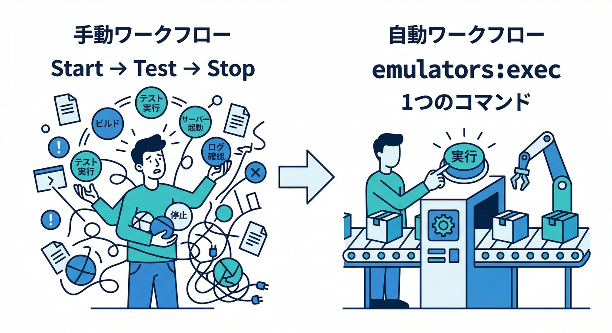
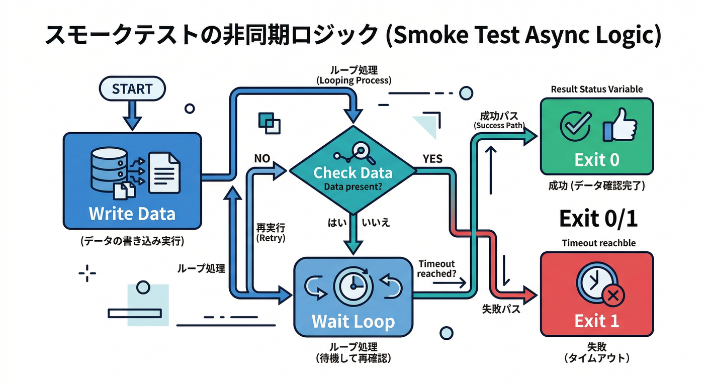
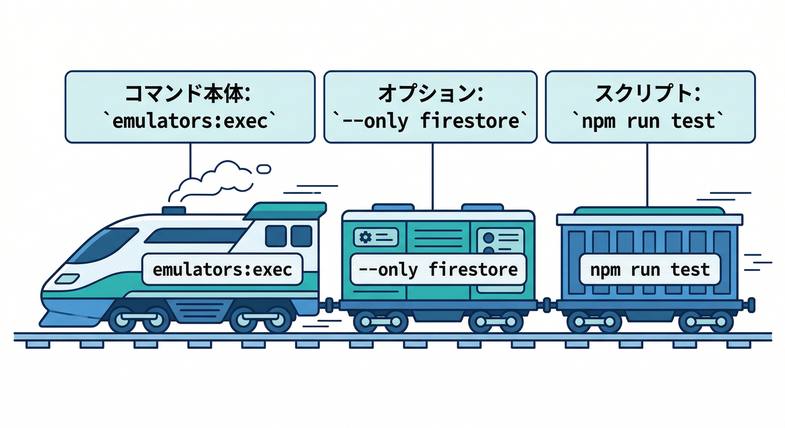
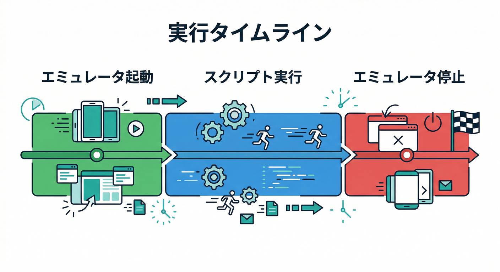
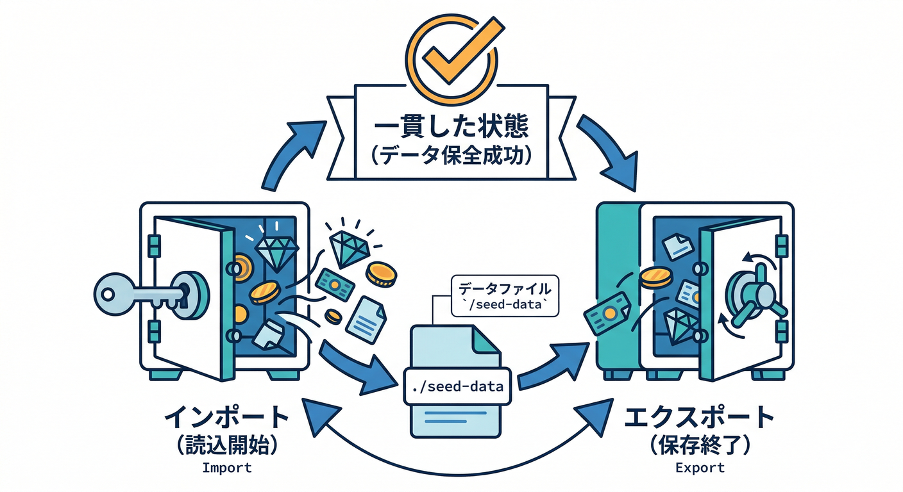
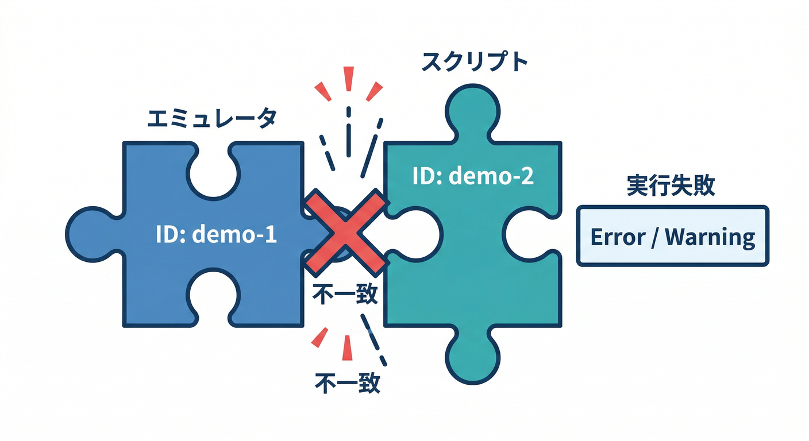
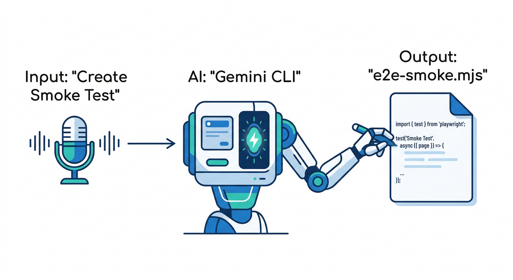

# 第16章　テスト実行を自動化：`emulators:exec` で一気通貫🏃‍♂️💨🧪

この章は「**エミュ起動 → テスト実行 → 自動終了**」をワンコマンド化して、**“毎回同じ手順で安全に検証できる”**状態を作ります✨
`firebase emulators:exec` は、指定したスクリプトを走らせ終わったらエミュを止めてくれるので、CI（自動テスト）にも相性がいいです🤖✅ ([Firebase][1])

---

## 読む📖　`emulators:exec` の考え方（なにが嬉しい？）🧠✨



普段の手動フローって、だいたいこうです👇

1. エミュ起動する
2. 別ターミナルでテスト走らせる
3. 終わったら止める（止め忘れてポートが…😇）

`emulators:exec` はこれを **まとめて** やってくれます：

* `firebase.json` に設定されたエミュを起動
* スクリプト（テスト）を実行
* スクリプトが終わったら **エミュも自動停止** 🛑 ([Firebase][1])

さらに、よく使うオプションが強い💪

* `--only`：必要なエミュだけ起動（速い⚡） ([Firebase][1])
* `--import` / `--export-on-exit`：毎回同じ初期データでテスト（再現性MAX🔁） ([Firebase][1])
* `--log-verbosity`：ログを静かにして見やすく（QUIET/SILENT など） ([Firebase][1])
* `--inspect-functions`：Functions をデバッグしやすく（ただし **直列実行モード**になるので挙動が少し変わる⚠️） ([Firebase][1])
* `--ui`：テスト中も Emulator UI を起動して目視デバッグ👀 ([Firebase][1])

---

## 手を動かす🖐️　E2Eスモークテストを1本作る🔥（Firestore → Functions 自動処理）

ここでは第15章で作った想定の「メモ追加 → Functionsが整形 → Firestoreに書き戻し」が、**ローカルでちゃんと回るか**を“機械に判定”させます✅

### 1) まずはテスト用スクリプトを作る🧪



例：`tools/e2e-smoke.mjs`（Nodeで動く1ファイルテスト）

```js
// tools/e2e-smoke.mjs
import { initializeApp } from "firebase-admin/app";
import { getFirestore } from "firebase-admin/firestore";

const projectId =
  process.env.GCLOUD_PROJECT ||
  process.env.FIREBASE_PROJECT ||
  "demo-emulator";

// エミュに向ける（ここがポイント！）
process.env.FIRESTORE_EMULATOR_HOST ||= "127.0.0.1:8080";

initializeApp({ projectId });
const db = getFirestore();

const sleep = (ms) => new Promise((r) => setTimeout(r, ms));

async function main() {
  const docRef = db.collection("memos").doc("smoke-1");

  // ① メモを作る（= Firestoreイベントが発火する想定）
  await docRef.set({
    text: "hello emulator!",
    createdAt: Date.now(),
  });

  // ② Functions が書き戻す想定のフィールドを待つ
  // （例：formattedText / formatted / normalized など、あなたの第15章実装に合わせて変更OK）
  const expectedField = "formattedText";

  for (let i = 0; i < 40; i++) {
    const snap = await docRef.get();
    const data = snap.data();

    if (data && data[expectedField]) {
      console.log("✅ E2E OK:", data[expectedField]);
      process.exit(0);
    }
    await sleep(200);
  }

  console.error("❌ Timeout: Functions の書き戻しが確認できませんでした");
  process.exit(1);
}

main().catch((e) => {
  console.error("❌ E2E Error:", e);
  process.exit(1);
});
```

ポイントはこれ👇

* **Firestore に書いたあと、Functions が書き戻すまで“ちょい待つ”**（非同期なので）
* 成功したら `exit(0)`、失敗したら `exit(1)`（これが **CIで超大事**）🎯

ちなみに Functions 側が TypeScript なら、エミュ実行中に自動で再読み込みされますが、**TSのトランスパイルは先に必要**（`tsc -w` などの話）です。([Firebase][2])

---

### 2) `package.json` にコマンドを用意する🧰✨



```json
{
  "scripts": {
    "test:e2e": "node ./tools/e2e-smoke.mjs",
    "emulators:e2e": "firebase emulators:exec --only firestore,functions \"npm run test:e2e\""
  }
}
```

* `--only firestore,functions` で最小構成にして高速化⚡ ([Firebase][1])
* `npm run emulators:e2e` を叩くだけで **一気通貫**🏃‍♂️💨

---

### 3) 実行してみよう🚀（PowerShellでもOK）



```markdown
timeline
    title emulators:exec Lifecycle
    section Lifecycle
    Start : Initialize Emulators (Firestore, Functions, etc.)
    Running : Execute Script (npm run test:e2e)
    Finish : Script finish (exit 0/1)
    Cleanup : Automatic Stop all Emulators
```

```bash
npm run emulators:e2e
```

成功すると：

* 途中ログが流れて
* 最後に `✅ E2E OK` が出て
* エミュが自動で止まります🛑✨ ([Firebase][1])

---

## ミニ課題🎯　“自動テストっぽさ”を強化しよう💪😄

1. **わざと失敗させる**

   * Functions 側で書き戻しフィールド名を変える（例：`formattedText` → `formatted_text`）
   * テストが `exit(1)` で落ちるのを確認🧨

2. **ログを静かにする**

   * うるさければ `--log-verbosity=QUIET` を付ける🔇 ([Firebase][1])

3. **UIを付けて目視デバッグ**

   * `--ui` を付けて、テスト中に Emulator UI でリクエストやデータを見る👀 ([Firebase][1])

---

## もう一段上👑　データ固定（import/export）で“再現性100%”へ🔁🧪



テストは「毎回同じ初期状態」が正義です⚖️✨
`emulators:exec` でも、次のセットが使えます👇

* `--import=./seed-data`：起動時にデータ投入
* `--export-on-exit=./seed-data`：終了時にデータ保存

エクスポート先には `firebase-export-metadata.json` が入ります📦 ([Firebase][1])

例：

```bash
firebase emulators:exec --only firestore,functions --import=./seed-data --export-on-exit=./seed-data "npm run test:e2e"
```

---

## つまづきポイント😵‍💫➡️😄　（ここだけ押さえると強い）

### ✅ 1) Project ID がズレると、連携が壊れやすい🧩💥



エミュは「同じプロジェクトIDで動いてる前提」で、UIや各エミュ同士が連携します。複数IDが混ざると警告も出ます⚠️ ([Firebase][1])
`--project` を使う／ユニットテスト側の projectId 設定と揃える、がコツです。([Firebase][1])

### ✅ 2) Functions ↔ Firestore の“連鎖”はエミュでも起きる🔥

Admin SDK が Firestore に書くと、Firestore エミュに流れて、そこから別の Functions が起動…みたいな **クロス連携**ができます。([Firebase][2])
（今回のE2Eはまさにそれ！）

### ✅ 3) たまに「テスト中だけトリガー止めたい」もある🧯

Firestone の全消しをしたいのに `onDelete` が暴れる…みたいな時は、Emulator Hub API でトリガーON/OFFもできます（上級だけど超便利）🧰 ([Firebase][1])

---

## チェック✅　ここまでできたら勝ち🏆✨

* `emulators:exec` が「起動→テスト→終了」をまとめる理由を説明できる
* テストの成功/失敗を **終了コード**で返せる（CI対応🤖）
* `--only` / `--import` / `--export-on-exit` を用途で使い分けできる ([Firebase][1])

---

## AIでさらに加速🤖💨（Gemini CLI / Firebase MCP / Studio）



ここからは「テスト自動化を作る作業」自体をAIに手伝わせます✨

* **Firebase MCP server** を入れると、AIツールが Firebase プロジェクトや Auth ユーザー、Firestore、Rules、FCM などを扱えるようになります（Antigravity / Gemini CLI / Firebase Studio など対応）([Firebase][3])
* **Gemini CLI** は Firebase拡張を入れるのが推奨で、入れると MCP の設定＋コンテキストが整います🧠✨ ([Firebase][3])
* **Firebase Studio** 側も、AIでコード/ドキュメント作成だけじゃなく、ユニットテスト作成や実行、依存関係の解決まで支援できるよ🛠️([Firebase][4])

Gemini CLI 例（コード生成の叩き台用）👇

```bash
gemini extensions install https://github.com/gemini-cli-extensions/firebase/
```

AIに頼むプロンプト例（コピペ用）📝🤖

* 「`emulators:exec` 用に、Firestore→FunctionsのE2Eスモークテストを1本。成功でexit0、失敗でexit1。`tools/e2e-smoke.mjs` と `package.json` scripts まで作って」
* 「テストがタイムアウトする時の原因候補を、ログから推理して修正案を3つ出して」

---

必要なら次のメッセージで、あなたの第15章の Functions 実装（書き戻しフィールド名とか）に合わせて、**このE2Eを“完全に一致した形”**にチューニングした版もそのまま書くよ😄🔧

[1]: https://firebase.google.com/docs/emulator-suite/install_and_configure "Install, configure and integrate Local Emulator Suite  |  Firebase Local Emulator Suite"
[2]: https://firebase.google.com/docs/functions/local-emulator "Run functions locally  |  Cloud Functions for Firebase"
[3]: https://firebase.google.com/docs/ai-assistance/mcp-server "Firebase MCP server  |  Develop with AI assistance"
[4]: https://firebase.google.com/docs/studio "Firebase Studio"
