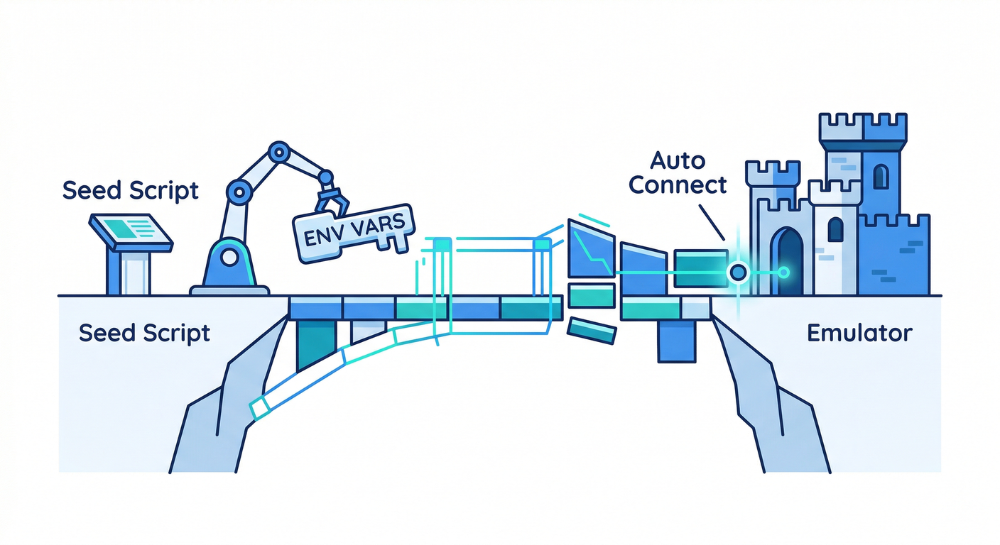
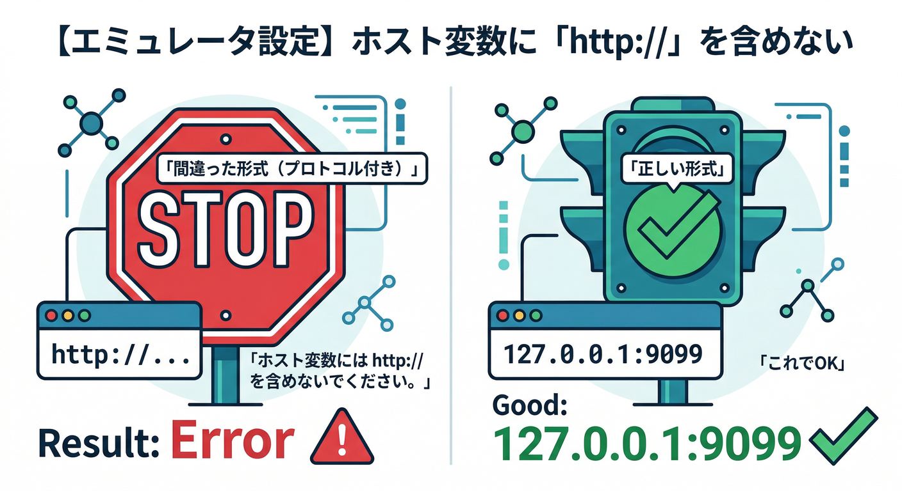
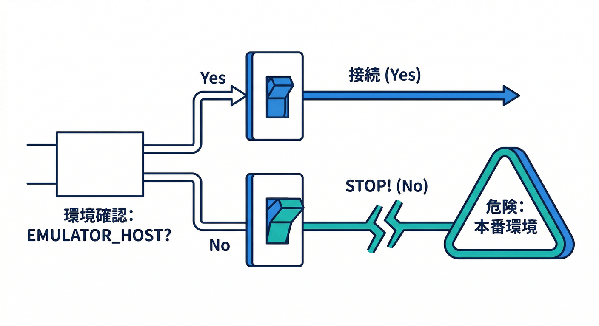
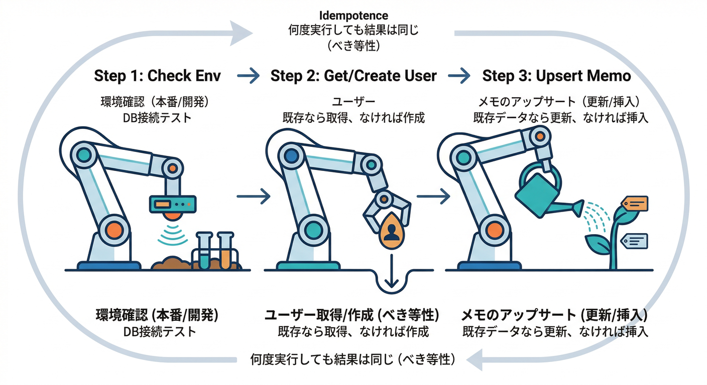
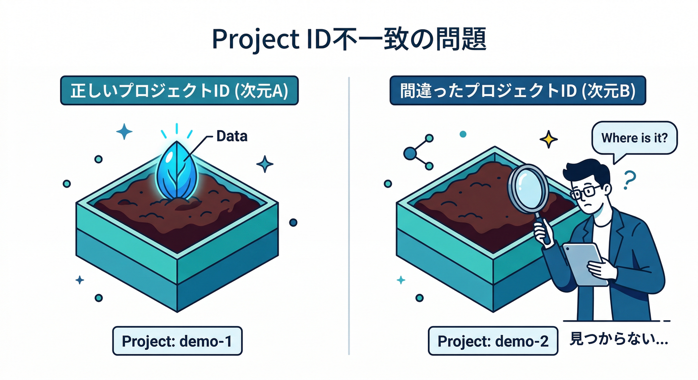

# 第17章　サーバーSDKでもエミュにつなぐ：Admin SDK視点🧠🧰

## この章のゴール🎯

フロント（Web SDK）だけじゃなく、**“裏側の道具”＝Admin SDK** からもエミュレータに接続して、テスト用ユーザーやメモデータを**一発で“種まき（seed）”**できるようになります🌱✨
ここまでできると、ローカル開発が「毎回同じ初期状態でスタート」できて強いです💪🧪

---

## 読む📖：Admin SDKってなに？なんで要るの？🤔


Admin SDKは、ざっくり言うと **管理者の権限でFirebaseを操作できるサーバー用SDK** です🧰✨

* ✅ テストユーザーを自動生成できる（Auth）👤
* ✅ Firestoreにテストデータを“直に”流し込める（seed）🗃️
* ✅ 「このユーザーは管理者」みたいな **カスタムクレーム** も付けられる👑
* ⚠️ 逆に言うと、**Security Rulesを“素通り”できる**ので、扱いは丁寧に（だからエミュレータでやるのが最高）🛡️

そして超重要ポイント👇
**Admin SDKは、環境変数をセットすると“自動で”エミュレータに接続**します（Auth / Firestore / Storage）。しかも **`http://` は付けない**のが罠です⚠️
（Auth: `FIREBASE_AUTH_EMULATOR_HOST` / Firestore: `FIRESTORE_EMULATOR_HOST` / Storage: `FIREBASE_STORAGE_EMULATOR_HOST`）([Firebase][1])

---

## 手を動かす🖐️：seedスクリプトを作って、エミュに流し込む🌱🚀

## 1) まずは「seed専用スクリプト置き場」を作る📁

プロジェクト直下に、例えばこんな感じで作ります👇

* `tools/seed/`（好きな場所でOK）

  * `package.json`
  * `seed.ts`
  * `.env.local`（任意）

---

## 2) seed用の依存を入れる📦✨

TypeScriptでサクッと動かすために、`firebase-admin` と実行ツール（例：`tsx`）を入れます🧩
（TypeScriptは現行系だと 5.9 系の話題が中心です。）([Microsoft for Developers][2])

```bash
cd tools/seed
npm init -y
npm i firebase-admin
npm i -D tsx typescript
```

> Nodeは今どき **v24 が Active LTS** として扱われています（ローカル学習の基準にしやすい）([Node.js][3])

---

## 3) エミュレータ接続の“核”＝環境変数を用意する🔌🧠



**ここが第17章の主役**です👑
Admin SDKは、次の環境変数があると **勝手にエミュに繋がります**。([Firebase][1])

* Auth → `FIREBASE_AUTH_EMULATOR_HOST="127.0.0.1:9099"`
* Firestore → `FIRESTORE_EMULATOR_HOST="127.0.0.1:8080"`
* Storage → `FIREBASE_STORAGE_EMULATOR_HOST="127.0.0.1:9199"`（今回は触るだけでもOK）
* さらに事故防止に → `GCLOUD_PROJECT="（あなたのローカル用projectId）"`



> ⚠️ **`http://` を付けない**（付けると動かない原因になりがち）([Firebase][1])

PowerShellならこんな感じ👇

```powershell
$env:GCLOUD_PROJECT="demo-local"
$env:FIREBASE_AUTH_EMULATOR_HOST="127.0.0.1:9099"
$env:FIRESTORE_EMULATOR_HOST="127.0.0.1:8080"
$env:FIREBASE_STORAGE_EMULATOR_HOST="127.0.0.1:9199"
```

---

## 4) seed.ts を書く✍️（ユーザー作成＋メモ投入）



ポイントは2つです👇

1. **何回実行しても壊れない（冪等）**
2. **エミュ接続が無いなら即停止（本番事故防止）**🧯

```ts
// tools/seed/seed.ts
import admin from "firebase-admin";

function mustEnv(name: string) {
  const v = process.env[name];
  if (!v) throw new Error(`Missing env: ${name}`);
  return v;
}

// ✅ 事故防止：エミュ接続が無いなら止める
mustEnv("FIREBASE_AUTH_EMULATOR_HOST");
mustEnv("FIRESTORE_EMULATOR_HOST");
const projectId = mustEnv("GCLOUD_PROJECT");

if (!admin.apps.length) {
  admin.initializeApp({ projectId });
}

const auth = admin.auth();
const db = admin.firestore();

type SeedUser = { email: string; displayName: string };
const users: SeedUser[] = [
  { email: "alice@example.com", displayName: "Alice" },
  { email: "bob@example.com", displayName: "Bob" },
];

async function getOrCreateUser(u: SeedUser) {
  try {
    return await auth.getUserByEmail(u.email);
  } catch {
    return await auth.createUser({
      email: u.email,
      displayName: u.displayName,
      password: "Passw0rd!Passw0rd!", // エミュ専用のテスト用
    });
  }
}

async function upsertMemo(uid: string, memoId: string, title: string, body: string) {
  const ref = db.collection("memos").doc(`${uid}_${memoId}`);
  await ref.set(
    {
      uid,
      title,
      body,
      status: "draft",
      createdAt: admin.firestore.FieldValue.serverTimestamp(),
      updatedAt: admin.firestore.FieldValue.serverTimestamp(),
      // “整形済み”系フィールドを後の章のFunctionsで埋める想定🧩
      formatted: null,
    },
    { merge: true }
  );
}

async function main() {
  console.log("🌱 Seeding start...");
  for (const u of users) {
    const user = await getOrCreateUser(u);

    // 例：Bobを“管理者っぽい扱い”にしてみる（教材ネタ用）👑
    if (u.email === "bob@example.com") {
      await auth.setCustomUserClaims(user.uid, { role: "admin" });
    }

    await upsertMemo(user.uid, "001", "はじめてのメモ", "エミュで安全にCRUDするぞ〜🧪");
    await upsertMemo(user.uid, "002", "次にやること", "Functionsで自動整形ボタン作る🔥");
  }
  console.log("✅ Seeding done!");
}

main().catch((e) => {
  console.error("❌ Seed failed:", e);
  process.exitCode = 1;
});
```



---

## 5) 実行する🏃‍♂️💨（方法は2通り）


### A. ふつうに「起動してから流す」方式🧪

1つ目のターミナルでエミュ起動：

```bash
firebase emulators:start --only auth,firestore
```

別ターミナルで、さっきの環境変数をセットしてから seed 実行：

```bash
cd tools/seed
npx tsx seed.ts
```

### B. `emulators:exec` で「起動→実行→終了」一気通貫⚡

テスト自動化の流れに乗せやすい方式です🏁
`emulators:exec` は公式のテスト導線でも紹介されています。([Firebase][4])

```bash
firebase emulators:exec --only auth,firestore "cd tools/seed && npx tsx seed.ts"
```

---

## つまずきポイント🧩😵‍💫➡️😄

## ❶ `http://` を付けちゃう問題

環境変数は **プロトコル無し**が正解です（例：`127.0.0.1:9099`）。([Firebase][1])

## ❷ projectId がズレて「別世界」にseedしてる問題🌍



`GCLOUD_PROJECT` が無い/違うと、思ってた場所にデータが出ないことがあります。
**seed用に projectId を固定**して、チーム内でも同じ値にすると安心です🧠

## ❸ Functionsエミュ内と、単体スクリプトで挙動が違う問題

Functionsエミュの中で動くコードは、`initializeApp()` 時に projectId などが自動で入ることがあります。([Firebase][5])
でも seed スクリプトは “単体実行” なので、**自分で `GCLOUD_PROJECT` をセット**するのが安定です👍

## ❹ Storage まで触りたいときの注意⚠️

Storageも同じく `FIREBASE_STORAGE_EMULATOR_HOST` で自動接続です（プロトコル無し）。([Firebase][6])
（※言語SDKによって対応状況が違う話題もあるので、教材では「まずNode中心」で攻めるのが安全です🧯）

---

## ミニ課題🎯：seedを“ワンコマンド化”しよう🧪🔁

やることはこれ👇

1. `tools/seed/package.json` にスクリプトを追加
2. `firebase emulators:exec` と組み合わせて、**毎回まっさら状態→seed→テスト**へ繋ぐ準備✨

例：

```json
{
  "name": "seed-tools",
  "private": true,
  "type": "module",
  "scripts": {
    "seed": "tsx seed.ts"
  },
  "dependencies": {
    "firebase-admin": "^13.0.0"
  },
  "devDependencies": {
    "tsx": "^4.0.0",
    "typescript": "^5.9.0"
  }
}
```

---

## チェック✅（できたら勝ち！🏆）

* ✅ Admin SDKが何を“でき過ぎちゃう”か説明できる（Rules素通り）🛡️
* ✅ `FIREBASE_AUTH_EMULATOR_HOST` / `FIRESTORE_EMULATOR_HOST` をセットして seed できた🌱([Firebase][1])
* ✅ 環境変数に `http://` を付けるとダメな理由を知ってる⚠️([Firebase][1])
* ✅ seedを複数回実行してもデータが増殖しない（冪等）🔁
* ✅ `emulators:exec` で一気通貫できる🏃‍♂️💨([Firebase][4])

---

## おまけ：Geminiでseed設計を爆速にするコツ🤖💡

次章（AIで加速）に繋げる“軽い仕込み”として、Geminiにこう頼むと良いです👇

* 🧠 「memos コレクションのフィールド設計案を出して」
* 🧪 「seedを冪等にするための docId ルール案を3つ」
* 🧯 「本番事故を防ぐガード（環境変数チェック）のテンプレ」

AIが出した案は、**そのまま実行せず**「危険（本番接続）」「重複（増殖）」「個人情報（実メール）」を人間がチェックしてから採用が鉄則です✅✨

---

## ちょいメモ：クラウドFunctionsのランタイム感覚🧾

この章はローカルseed中心だけど、後でFunctionsに寄せるときの目安👇
Cloud Functions for Firebase は **Node.js 22/20（18はdeprecated）**、Python は `firebase.json` の runtime 指定で **python310 / python311** が例示されています。([Firebase][7])

（※ローカルのNodeは v24 Active LTS が扱いやすい、という住み分けになります🧠）([Node.js][3])

[1]: https://firebase.google.com/docs/emulator-suite/connect_auth?utm_source=chatgpt.com "Connect your app to the Authentication Emulator - Firebase"
[2]: https://devblogs.microsoft.com/typescript/announcing-typescript-5-9/?utm_source=chatgpt.com "Announcing TypeScript 5.9"
[3]: https://nodejs.org/en/about/previous-releases?utm_source=chatgpt.com "Node.js Releases"
[4]: https://firebase.google.com/docs/firestore/security/test-rules-emulator?hl=ja&utm_source=chatgpt.com "Cloud Firestore セキュリティ ルールをテストする - Firebase"
[5]: https://firebase.google.com/docs/emulator-suite/connect_firestore?utm_source=chatgpt.com "Connect your app to the Cloud Firestore Emulator - Firebase"
[6]: https://firebase.google.com/docs/emulator-suite/connect_storage?utm_source=chatgpt.com "Connect your app to the Cloud Storage for Firebase Emulator"
[7]: https://firebase.google.com/docs/functions/manage-functions "Manage functions  |  Cloud Functions for Firebase"
