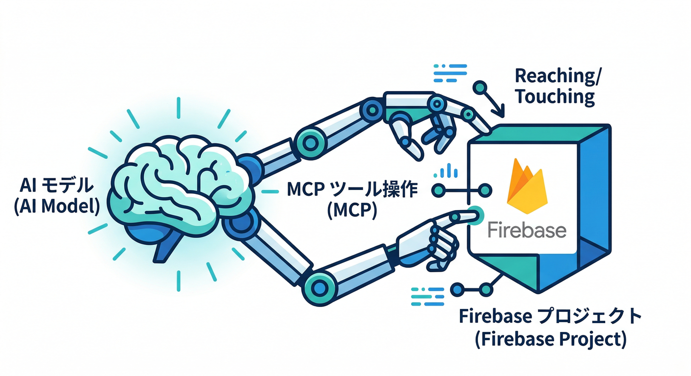
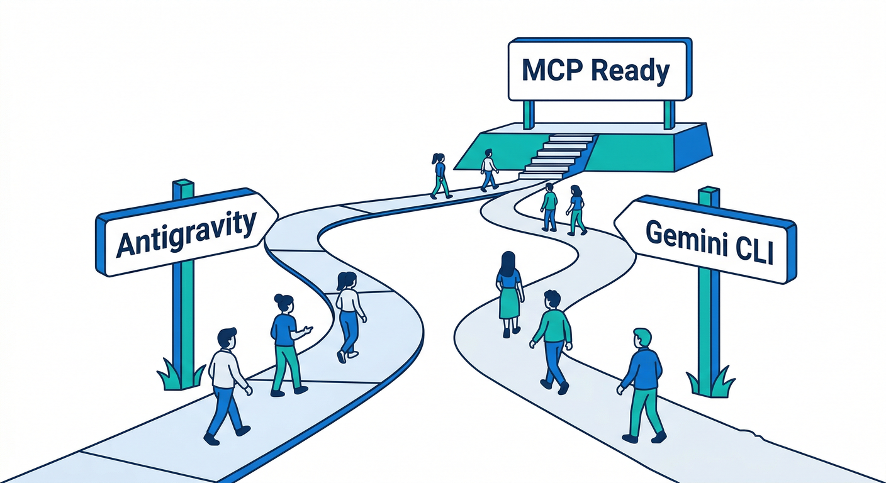
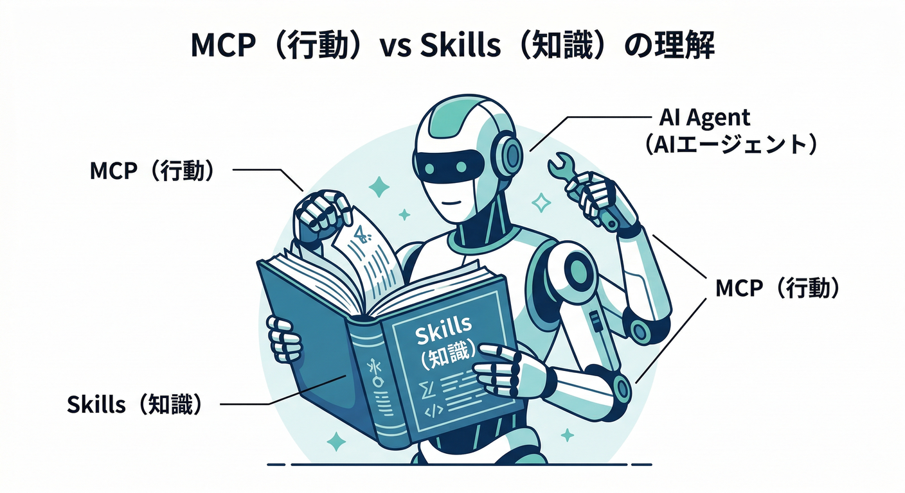
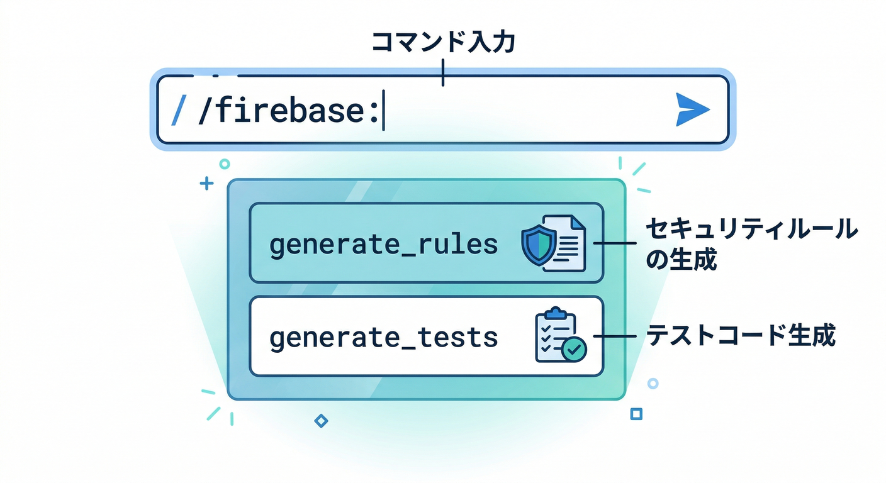
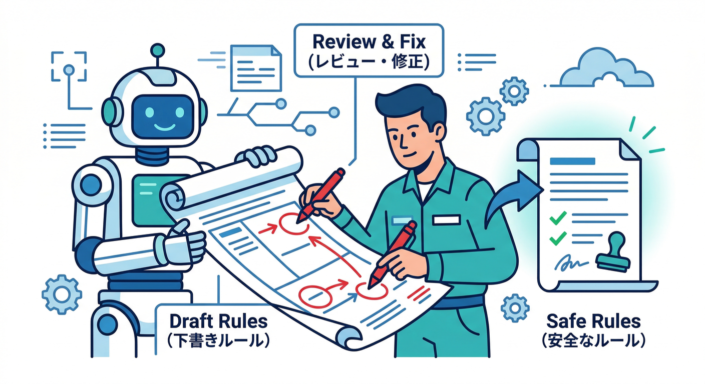
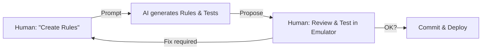
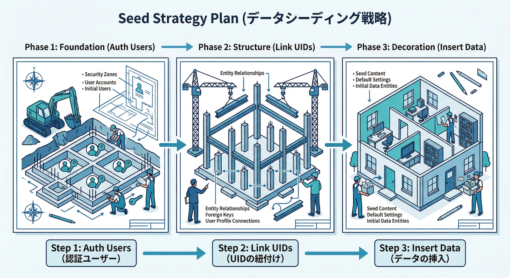
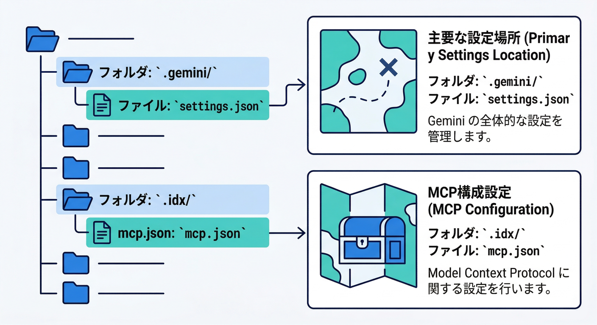

# 第18章　AIを開発に混ぜる：Firebase MCP × Geminiで加速🤖💨

## この章のゴール🎯

* AIが **Firebaseの操作・設定・提案**を手伝える状態にする（= MCPで“手”を渡す）🦾
* AIに **Security Rulesとテストの叩き台**を作らせて、あなたが安全に仕上げる🛡️✅
* AIに **seed（初期データ投入）方針**を作らせて、`emulators:exec` につながる形にする🏃‍♂️💨

---

## 1) まずMCPって何？（超ざっくり）🧠



MCP（Model Context Protocol）は、AI（LLM/エージェント）が外部ツールやデータに安全に接続するための“共通ルール”みたいなものです🔌
Firebase側は **Firebase MCP server** を用意していて、AIツールから **Firebaseプロジェクトや設定**にアクセスしやすくしてます。([Firebase][1])

ポイントはこれ👇

* **AIに「口」だけじゃなく「手」も渡せる**（プロジェクト情報取得・設定作業など）🧰
* でも **AIは間違える**ので、**叩き台→人間レビュー**が大前提🛑👀（コミットこまめ推奨）([Firebase][2])

---

## 2) セットアップ：Antigravity / Gemini CLI どっちでもOK⚙️✨



### A. Antigravity側でMCPを入れる（最短）🚀

Antigravityのエージェント画面から **MCP Servers → Firebase → Install** の流れで入れられます。([Firebase][1])
（内部的には `firebase-tools@latest mcp` を `npx` で起動する設定になります）

### B. Gemini CLIで入れる（おすすめの“王道”）👑

Firebase公式としては、**Gemini CLI用のFirebase拡張**を入れるのが推奨です。入れると **MCP設定も一緒に整う**のが強い🧩([Firebase][1])

```bash
gemini extensions install https://github.com/gemini-cli-extensions/firebase/
```

([Firebase][1])

### C. 手動設定（「仕組み」を理解したい人向け）🔧

Gemini CLIは `.gemini/settings.json` を読んでMCPサーバーを起動できます。([Firebase][1])

```json
{
  "mcpServers": {
    "firebase": {
      "command": "npx",
      "args": ["-y", "firebase-tools@latest", "mcp"]
    }
  }
}
```

([Firebase][1])

> ちなみに **Firebase Studioの対話チャット**側は `.idx/mcp.json`、**Gemini CLI**は `.gemini/settings.json` みたいに、使うファイルが違う点は覚えておくと迷子になりにくいよ🗺️([Firebase][3])

---

## 3) 追加ブースト：Firebase agent skillsも入れる🧠➡️🦾



MCPが「手」なら、**Agent Skills**は「Firebaseのやり方の教科書をAIに渡す」イメージ📚
両方あると、**“正しいやり方”で“実作業”まで走りやすい**です。([Firebase][4])

* Antigravity（skills CLI）

```bash
npx skills add firebase/agent-skills
```

([Firebase][4])

* Gemini CLI（拡張として）

```bash
gemini extensions install https://github.com/firebase/agent-skills
```

([Firebase][4])

---

## 4) ハンズオン①：Rules & テストをAIに“下書き”させる🛡️🧪

ここが一番おいしいところ😋
**AIに「Rulesの設計 + テスト雛形」を作らせて、あなたがレビューして完成**の流れにします。

### 4-1. Gemini CLIで「スラッシュコマンド」を呼ぶ🧩



Firebase拡張を入れていると、事前プロンプトが **`/firebase:...`** として使えます。
たとえば Security Rules生成はこれ👇([Firebase][2])

* `/firebase:generate_security_rules`（Firestore/StorageのRules生成とテスト）([Firebase][2])

やり方は簡単で、Gemini CLIで `/firebase:` と打ち始めると候補が出ます🧠✨([Firebase][2])

### 4-2. AIへのお願い文（コピペOK）📝🤖





（Gemini CLIやAntigravityのチャットにそのまま投げる）

* 「いまのミニアプリは `memo` をFirestoreに保存してる。**ログインユーザー本人のメモだけ read/write** できるRulesにしたい。**必要フィールドが欠けてるwriteは拒否**したい。`/firebase:generate_security_rules` を使ってRules案とテスト雛形を作って。出力したら、**危ない点（過剰許可/穴）も自分で指摘**して。」

👉 ここでAIがRulesとテストを出してくるので、あなたは👇をチェック✅

* `allow read, write: if true;` みたいな事故がないか😱
* `request.auth != null` と `request.auth.uid` で所有者チェックしてるか👮‍♂️
* `request.resource.data` の必須フィールド検証が入ってるか🧾

---

## 5) ハンズオン②：seed（初期データ投入）方針をAIに作らせる🌱🧠



第17章で作った「seedスクリプト」を、**AIに“再利用しやすい形”に整えてもらう**のがコツです✨

### 5-1. AIへのお願い文（コピペOK）📝🤖

* 「EmulatorのAuth/Firestoreに対して、**テストユーザー3人＋メモ10件**を毎回同じ状態で作りたい。`emulators:exec` で回せるように、**seedの手順（Auth作成→UID紐づけ→Firestore投入）**を提案して。`npm run seed` みたいなコマンド設計も考えて。」

### 5-2. 仕上げのコツ🎛️

* seedは **1回で全部作って終わる**（何度も叩いても壊れにくい）🔁
* 失敗したら **全削除→seed** に戻せる導線を用意🧯
* `emulators:exec` に繋げると「起動→seed→テスト→終了」が芸術になる🏃‍♂️💨

---

## 6) ミニ課題🎯（10〜20分）

**AIが作ったRulesを、人間の目で“1段安全”にする**🛡️✨

1. `/firebase:generate_security_rules`（または同等の依頼）でRules案を作らせる([Firebase][2])
2. あなたがレビューして、**「穴があったのでこう直した」**を1行メモ📝
3. テストを1本追加（例：他人のメモを読もうとして拒否される）🚫

---

## 7) チェック✅（この章の合格ライン）

* MCPが「AIがFirebaseを触る入口」だと説明できる🔌🧠([Firebase][1])
* Gemini CLIでFirebase拡張を入れられる（or `.gemini/settings.json` を理解）🛠️([Firebase][1])
* `/firebase:` 系のスラッシュコマンドが使えることを知ってる🧩([Firebase][2])
* AIの出力をそのまま採用せず、**叩き台→レビュー**で安全に進められる👀✅([Firebase][2])
* Agent Skillsを入れると精度と効率が上がるイメージが持てる📚🦾([Firebase][4])

---

## 8) よくある罠（先に潰す）🧯😵‍💫



* **AIが“本番っぽい操作”を提案する** → まずはエミュで再現、差分はコミットで守る🧪🔒([Firebase][2])
* **設定ファイルの場所が混ざる** → 対話チャットは `.idx/mcp.json`、Gemini CLIは `.gemini/settings.json` を意識🗂️([Firebase][3])
* **知識だけで手が動かない** → MCP（手）＋Skills（教科書）の両方で解決しやすい🤝([Firebase][4])

---

次の第19章は、ここで作った流れをそのまま使って、**AI Logic/Genkit を「壊さず試す」モード設計（モック/実呼び分け）**に繋げるとめちゃ気持ちいいです🧩🤖✨

[1]: https://firebase.google.com/docs/ai-assistance/mcp-server "Firebase MCP server  |  Develop with AI assistance"
[2]: https://firebase.google.com/docs/ai-assistance/prompt-catalog?hl=ja "Firebase の AI プロンプト カタログ  |  Develop with AI assistance"
[3]: https://firebase.google.com/docs/studio/mcp-servers "Connect to Model Context Protocol (MCP) servers  |  Firebase Studio"
[4]: https://firebase.google.com/docs/ai-assistance/agent-skills "Firebase agent skills  |  Develop with AI assistance"
