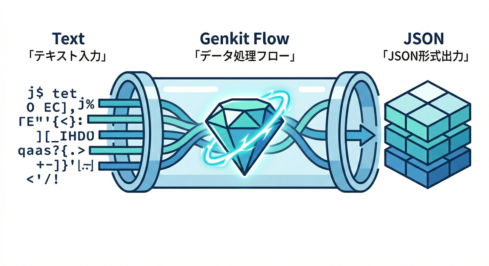
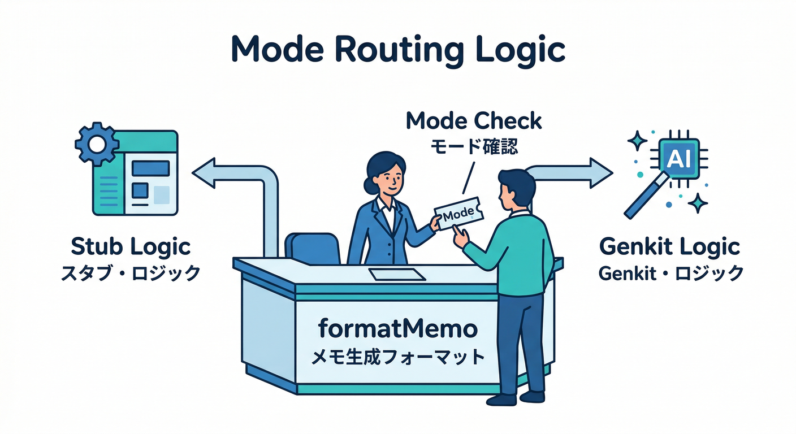
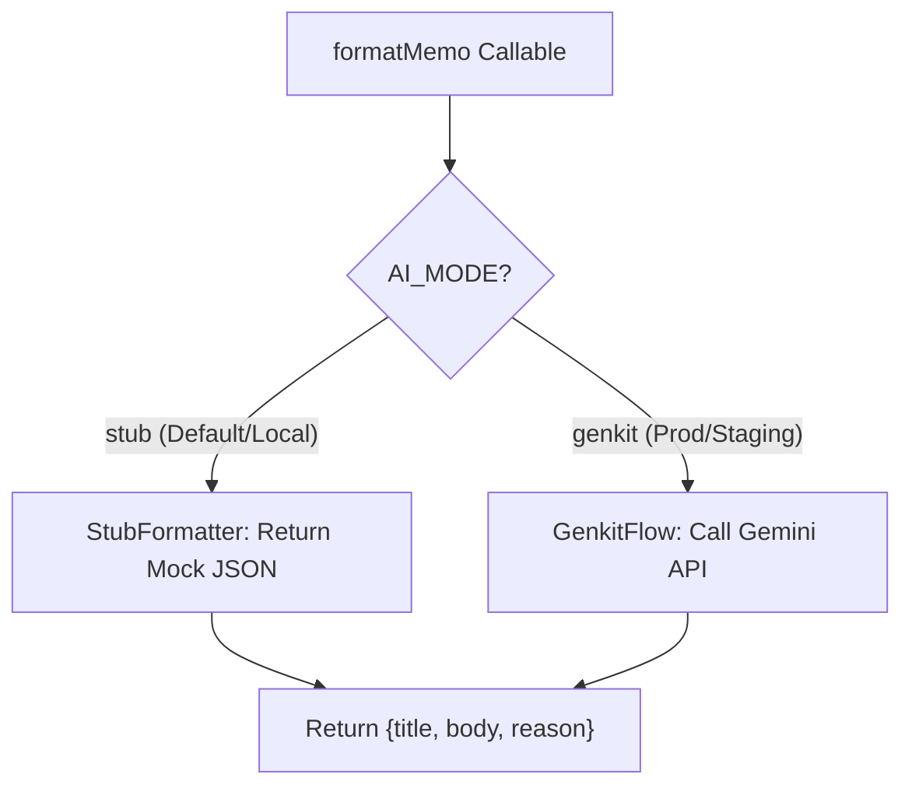
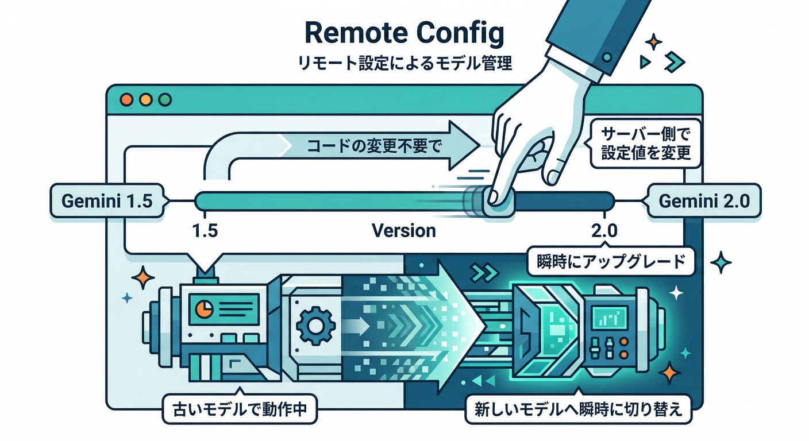
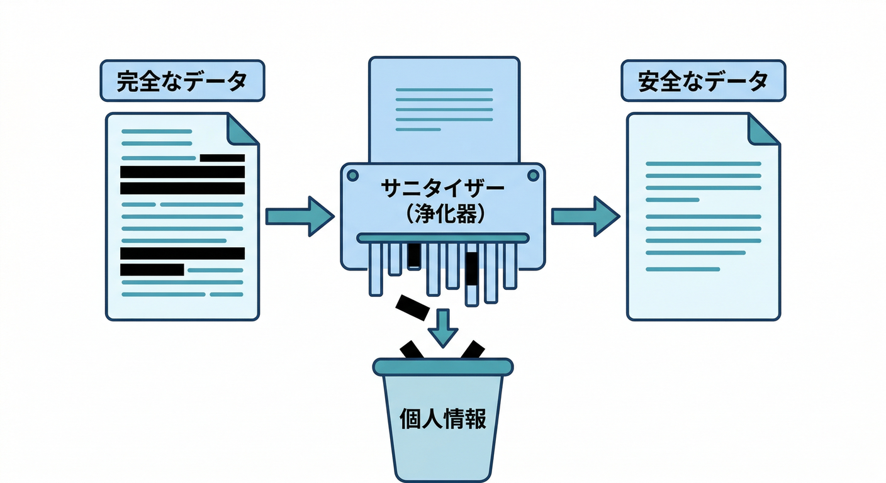

# 第19章　AIサービスも絡める：AI Logic/Genkitを“壊さず試す”🧩🤖

この章はひとことで言うと――
**「ローカルは“安全に速く”、AIは“切り替え可能に”して、開発とテストを爆速にする」**回です🧪⚡

---

## この章のゴール🎯✨

* 「AI整形ボタン」を押したときに、**ローカルではダミー整形**で確実に動く（課金も事故もゼロ）🧯
* 本番だけ、**Genkit か AI Logic の“本物AI”**を呼ぶ（安全に切替）🔀🤖
* AIの出力を **JSONにして検証**し、UIに反映できる（壊れにくい）🧱✅

---

## 読む📖：まず“壊さない設計”を頭に入れる🧠🔧

## 1) Emulator は「Firebase部分」を完璧に再現してくれるけど…🧪

Auth / Firestore / Functions みたいな“Firebaseの土台”はローカルで回せる一方、**生成AIそのものはエミュレータで完全再現できない**ことが多いです。だから **AIだけは“呼び出し方を設計で守る”**のがコツになります🧯🔩 ([Firebase][5])

## 2) AIは「3段階」で試すと強い💪🤖


この章では、AIをこう分けます👇

* **Lv1：ダミーAI（ローカル用）**🧪
  いつも同じ結果を返す → UI/Firestore/Rulesの検証が超ラク
* **Lv2：Genkit（ローカルでもデバッグしやすい）**🛠️
  Dev UI で入力/出力を確認しやすい（“AI部分の開発体験”が良い） ([Genkit][6])
* **Lv3：本番AI（AI Logic / Vertex AI / Gemini等）**🌩️
  秘密情報・課金・モデル変更・安全対策を入れて運用する ([Firebase][5])

## 3) “モデル名は変わる前提”で作る🌀

モデルは更新・終了があります。たとえば AI Logic のモデル参照では、**Gemini 2.0 Flash / Flash-Lite が 2026-03-31 に廃止予定**、置き換えとして **Gemini 2.5 Flash-Lite** が推奨…みたいな案内が出ています📅⚠️ 
→ だから「コードにモデル名をベタ書き」より、**後から差し替え可能**にしておくのが安全です（Remote Config で切替、など）🔀 ([Firebase][5])

---

## 手を動かす🖐️：まず“ダミーAI整形”を作ってローカルを完成させる🧪🧯

ここは最重要です🔥
**AIを呼ばなくてもアプリが完成して動く**状態にします。

## 19-1）Functions 側に「AI整形の入口」を作る🚪🤖

**やりたいこと：**

* Callable Functions に `formatMemo` を作る
* ローカルでは `AI_MODE=stub` のとき **ダミー整形**を返す
* 返り値は **JSON（title/body/reason）** に統一する

### 例：`functions/src/ai/formatter.ts`（AI切替スイッチ）🔀


```ts
// functions/src/ai/formatter.ts
export type AiFormatResult = {
  title: string;
  body: string;
  reason: string;
};

export type MemoInput = { title: string; body: string };

export interface AiFormatter {
  format(input: MemoInput): Promise<AiFormatResult>;
}

class StubFormatter implements AiFormatter {
  async format(input: MemoInput): Promise<AiFormatResult> {
    // いつも同じ“それっぽい整形”を返す（テストが安定する）
    const body = input.body
      .trim()
      .replace(/\r\n/g, "\n")
      .replace(/[ \t]+/g, " ")
      .split("\n")
      .filter(Boolean)
      .map((line) => `・${line}`)
      .join("\n");

    return {
      title: input.title.trim() || "（無題）",
      body,
      reason: "ローカル用ダミー整形：UIとFirestore連携の確認が目的",
    };
  }
}

export function createFormatter(): AiFormatter {
  const mode = (process.env.AI_MODE || "stub").toLowerCase();
  if (mode === "stub") return new StubFormatter();

  // 本章後半で Genkit 実装に差し替える
  throw new Error(`AI_MODE=${mode} is not configured yet`);
}
```

👉 ここまでで「AIっぽい結果」は出せます✨
**まだAIは呼んでない**ので、ローカルは安全です🧯

---

## 19-2）Callable Functions `formatMemo` を実装する📣🧾

* ログインしてる人だけ使えるようにする（Auth連携）🔐
* 受け取ったメモを整形して返す
* （余裕があれば）整形結果をFirestoreにも保存🗃️

```ts
// functions/src/index.ts
import { onCall, HttpsError } from "firebase-functions/v2/https";
import { createFormatter } from "./ai/formatter";

export const formatMemo = onCall(async (req) => {
  const uid = req.auth?.uid;
  if (!uid) throw new HttpsError("unauthenticated", "ログインしてね🙂");

  const title = String(req.data?.title ?? "");
  const body = String(req.data?.body ?? "");

  if (!body.trim()) throw new HttpsError("invalid-argument", "本文が空だよ📝");

  const formatter = createFormatter();
  const result = await formatter.format({ title, body });

  return result; // {title, body, reason}
});
```

---

## 19-3）React 側：「整形ボタン」→ Callable を叩く🔘⚡

```ts
import { getFunctions, httpsCallable, connectFunctionsEmulator } from "firebase/functions";

const functions = getFunctions();
connectFunctionsEmulator(functions, "127.0.0.1", 5001);

export async function callFormatMemo(title: string, body: string) {
  const fn = httpsCallable(functions, "formatMemo");
  const res = await fn({ title, body });
  return res.data as { title: string; body: string; reason: string };
}
```

UIでは「整形結果」「理由（reason）」を表示すると、**動作確認がめっちゃ楽**です👀✨

---

## ここでミニ課題🎯🔔（まずはローカルで完成させる）

* `reason` をUIに表示して、**“いま stub で動いてる”**のが分かるようにする👀
* 返ってきた `body` をプレビュー表示（整形前/整形後を並べると楽しい）🪄📝

---

## 次へ🧠：Genkit で「本物AI」に差し替える（でも壊さない）🛠️🤖

ここからが第19章の本番🔥
**入口（formatMemo）は変えずに、中身だけ差し替える**のがコツです🔁

## 19-4）Genkit Flow を作る🧩



Firebase公式の案内では、Genkit Flow は `genkit` + `@genkit-ai/googleai` を使い、Flow を `onCallGenkit` で包むやり方が紹介されています📌
`onCallGenkit` は Callable Functions の機能を持ちつつ、**ストリーミングやJSON応答も自動サポート**、App Check 強制も宣言的にできます🛡️✨ ([Firebase][7])

### 例：`functions/src/genkit/formatMemoFlow.ts`（JSON出力の流れ）🧾🤖

```ts
import { genkit, z } from "genkit";
import { googleAI, gemini15Flash } from "@genkit-ai/googleai";

// ここは“モデル名が変わる前提”で、あとで差し替えやすくするのがコツ🌀
const ai = genkit({
  plugins: [googleAI()],
  model: gemini15Flash,
});

export const FormatMemoOutput = z.object({
  title: z.string(),
  body: z.string(),
  reason: z.string(),
});

export const formatMemoFlow = ai.defineFlow(
  {
    name: "formatMemoFlow",
    inputSchema: z.object({ title: z.string(), body: z.string() }),
    outputSchema: FormatMemoOutput,
  },
  async (input) => {
    const prompt = `
あなたはメモ整形アシスタントです。
次のメモを読みやすく整形し、必ず JSON で返してください。

- title は短く
- body は箇条書き中心
- reason には、整形方針を1文で

title: ${input.title}
body:
${input.body}
`.trim();

    const res = await ai.generate(prompt, { output: { schema: FormatMemoOutput } });
    return res.output!;
  }
);
```

※ `generate()` / `output.schema` の書き方は Genkit の世代で差が出やすいので、まずは **「JSONを返す」設計**を守るのが勝ちです🧱✨（細部は公式サンプルに寄せて調整） ([Firebase][7])

---

## 19-5）`onCallGenkit` で Callable として公開する📣🤖

```ts
import { onCallGenkit } from "firebase-functions/https";
import { defineSecret } from "firebase-functions/params";
import { formatMemoFlow } from "./genkit/formatMemoFlow";

// Gemini API キーは Secret Manager に置く（コードに直書きしない）🔐
const apiKey = defineSecret("GOOGLE_GENAI_API_KEY");

export const formatMemoAI = onCallGenkit(
  {
    secrets: [apiKey],
    enforceAppCheck: true,              // App Check を強制できる🛡️
    consumeAppCheckToken: true,         // 使い捨てトークン（強めの守り）🧯
  },
  formatMemoFlow
);
```

この “Secret + App Check” の考え方は、公式ページでも強く推されている安全策です🔐🛡️ ([Firebase][7])

---

## 19-6）最終的に「入口は formatMemo のまま」にする🔁✨





今は `formatMemo`（stub）と `formatMemoAI`（Genkit）で2つありますが、運用ではこうすると気持ちいいです👇

* `formatMemo` は常にUIから呼ぶ“入口”
* 中で `AI_MODE` を見て

  * stub → ダミー整形
  * genkit → `formatMemoAI` 相当の処理に振る
    …みたいに **API面を固定**します📌（フロントを壊さない！）

---

## さらに一歩🪄：AI Logic を混ぜると「運用がラク」になる話📦🤖

## 19-7）プロンプトは“サーバー側で管理”が安心🧯


Firebase AI Logic には **Server Prompt Templates** があり、

* **プロンプトをアプリに埋め込まず**
* サーバー側で管理して
* 更新を回しやすくする
  …みたいな方向性が紹介されています🧩✨ ([The Firebase Blog][8])

ただし現時点のベストプラクティスとして、**テンプレはチャット/ツール呼び出しなど未対応の機能がある**（＝万能ではない）ので、複雑な処理は Genkit のほうがやりやすい場面もあります🛠️🤔 ([Firebase][9])

## 19-8）モデル切替は Remote Config などで“後から変えられる”設計へ🔀



AI Logic 側でも「モデルが更新・切替される」前提の設計が重要です🌀
Remote Config でモデル名（や温度、出力長）を切替できる発想はかなり強いです📌 ([Firebase][5])

---

## 壊さないための安全メモ🧠🧯（めっちゃ大事）

## ✅ 1) “AIに渡すデータ”は最小限にする



メモ本文でも、個人情報が混じるなら要注意⚠️
「必要な部分だけ」を渡すクセをつけると事故が減ります🚧

## ✅ 2) “AIが決めていいこと”を減らす（プロンプトインジェクション対策）🛡️

たとえば、AIに「どのドキュメントを読む？」を決めさせるのは危険。
**ドキュメントIDやUIDの決定はサーバー側で固定**して、AIは整形だけ担当にするのが安全です👮‍♂️✨（AIエージェント/ツール呼び出しの注意点としても語られています） ([The Firebase Blog][10])

## ✅ 3) ローカルは stub をデフォルトにする

“うっかり本物AIを呼んでしまう”が一番あるある😇

* `AI_MODE` 未設定 → **stub**
* 本番だけ `AI_MODE=genkit`
  この向きが安心です🧯

---

## ミニ課題🎯🤖（AIをテスト可能に分解できたら勝ち）

1. `formatMemo` が返す JSON に `score`（0〜100）を追加してみよう📈

* stub は固定で 80
* Genkit は理由に応じて変える（適当でOK）

2. UI側で `reason` と `score` を表示して、**“なぜその整形になったか”**が分かるようにしよう👀✨

---

## チェック✅（この章のゴール確認）

* [ ] ローカルは **AIを呼ばず**に整形機能が動く🧪
* [ ] 本番だけ **Genkit / AI Logic** を呼べるように“切替”できる🔀
* [ ] AIの出力を **JSONで受けてUIに反映**できる🧾✨
* [ ] モデル変更・廃止があっても「差し替え」で耐えられる🌀 

---

## 参考：ランタイムの目安🧠🧾（迷子防止）

* Cloud Functions for Firebase の Node.js は **20 / 22** が案内されています🟩 ([Firebase][11])
* Python は **3.10〜3.13** がサポート、**3.13 がデフォルト**という案内があります🐍 ([Firebase][12])
* そしてAI開発補助として、Firebase CLI には **MCP 関連の experimental コマンド**が追加されています（Gemini CLI やエージェント連携の流れ）🤝🤖 ([Firebase][13])

---

次の第20章では、この「切替スイッチ式AI」も含めて、**ローカル→検証用→本番**へ“昇華”する手順書を仕上げて、安心して運用に持ち込みます🏁🧾✨

[1]: https://chatgpt.com/c/6995854b-b1d8-83aa-9901-077e94a5852e "第16章 ローカル検証"
[2]: https://chatgpt.com/c/699681d8-c70c-83a3-9652-837583365402 "エミュレータの魅力解説"
[3]: https://chatgpt.com/c/6994bb19-6b1c-83ab-8b01-460c3fe3125a "エミュレーターで安全確認"
[4]: https://chatgpt.com/c/6992a9ba-8974-83a6-bb3b-18e9c95c8ed1 "第19章 Emulator練習"
[5]: https://firebase.google.com/docs/ai-logic "Gemini API using Firebase AI Logic  |  Firebase AI Logic"
[6]: https://genkit.dev/docs/devtools/ "Developer Tools | Genkit"
[7]: https://firebase.google.com/docs/functions/oncallgenkit "Invoke Genkit flows from your App  |  Cloud Functions for Firebase"
[8]: https://firebase.blog/posts/2025/12/server-prompt-templates-ai-logic/ "Secure your prompts and iterate faster with server prompt templates for Firebase AI Logic"
[9]: https://firebase.google.com/docs/ai-logic/server-prompt-templates/manage-templates "Manage templates  |  Firebase AI Logic"
[10]: https://firebase.blog/posts/2025/12/securing-ai-agents "Securing AI agents and tool calls"
[11]: https://firebase.google.com/docs/functions/manage-functions?utm_source=chatgpt.com "Manage functions | Cloud Functions for Firebase - Google"
[12]: https://firebase.google.com/docs/functions/get-started?utm_source=chatgpt.com "Get started: write, test, and deploy your first functions - Firebase"
[13]: https://firebase.google.com/support/release-notes/cli "Firebase CLI Release Notes"
