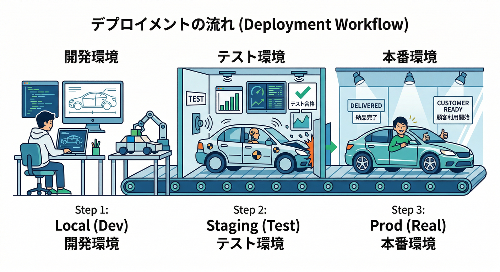
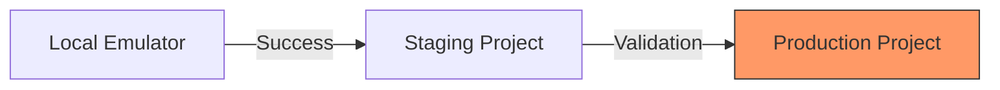
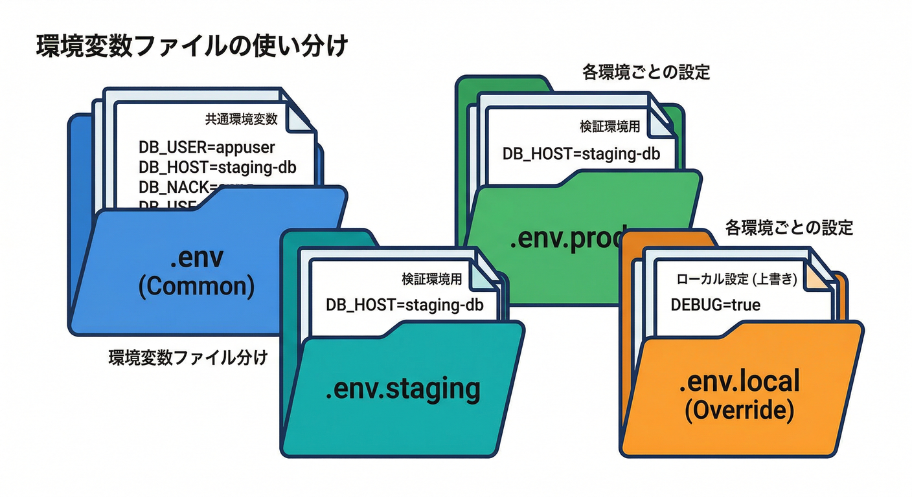
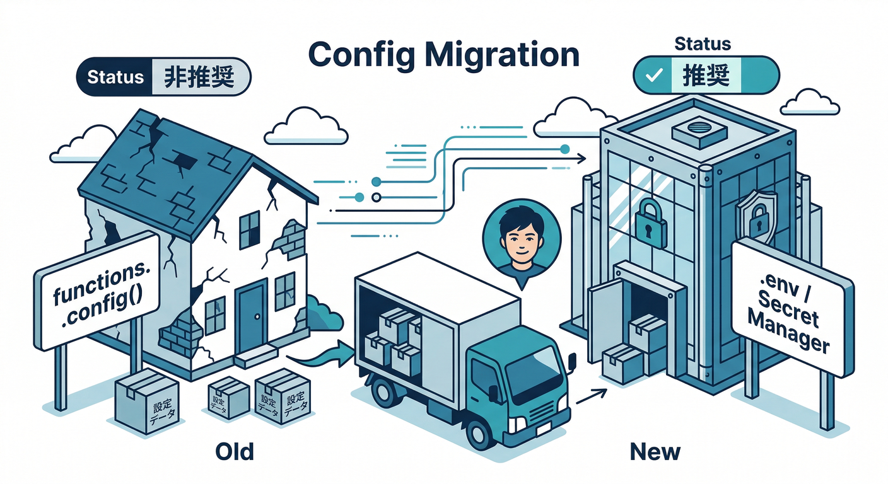
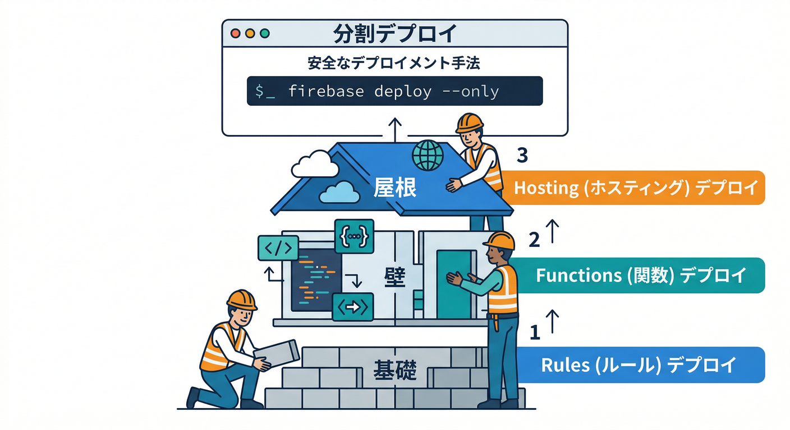
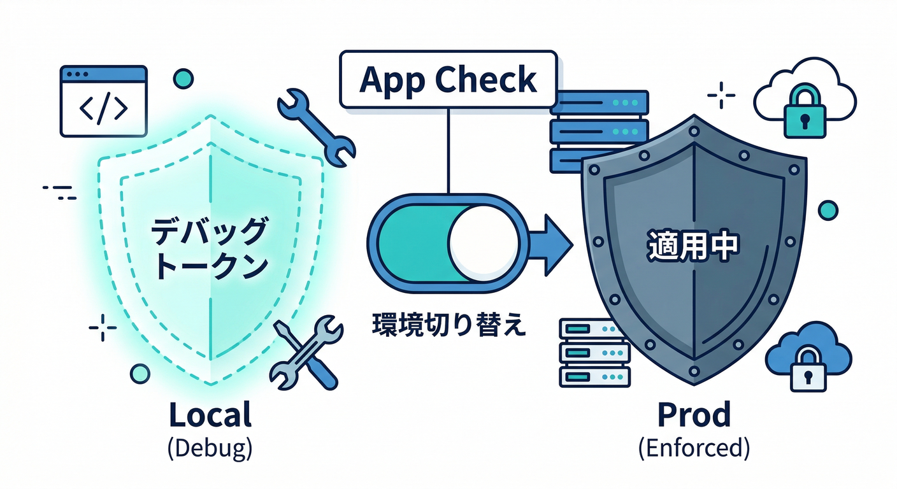
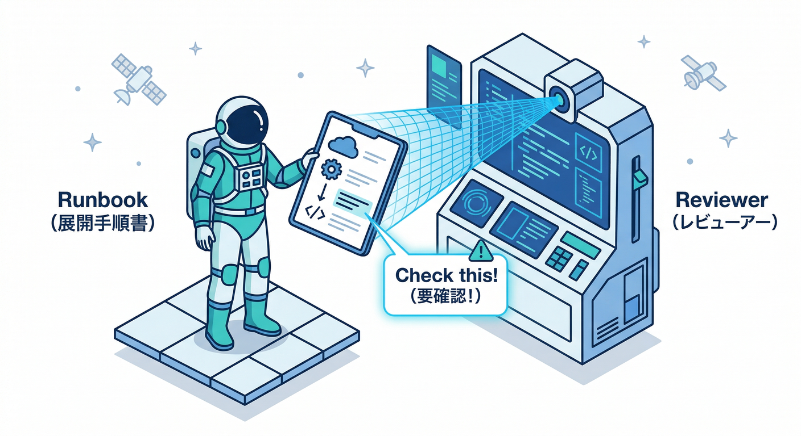
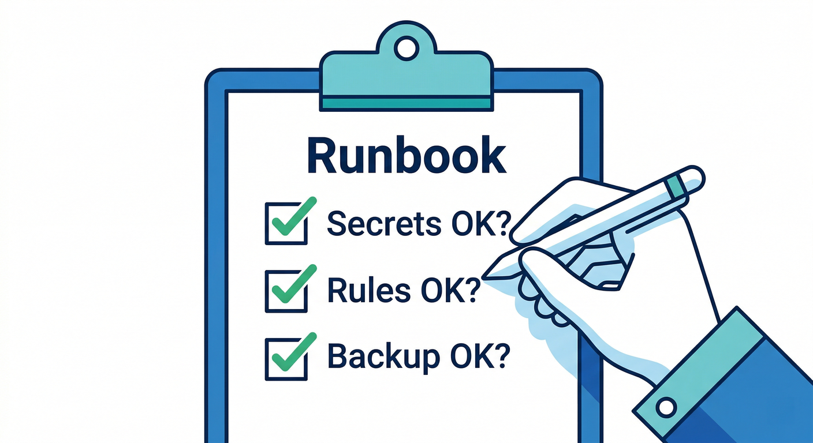

# 第20章　ローカル→本番へ昇華：移行手順書を完成させる🧾🏁

## この章でできるようになること🎯

* **検証用（staging）→本番（prod）** の順に、安全に出せる🚦
* “ローカルでだけOKなコード/設定”を見つけて、**本番で事故らない形**に直す🛡️
* デプロイ前後にやることを **チェックリスト化**して、未来の自分を救う🦸‍♂️✨
* AI（Gemini / Agent Skills / MCP）に「確認役」をやらせて、見落としを減らす🤖🔍 ([Firebase][1])

---

## 1) まず“昇華で差が出る場所”を押さえる🧠⚠️

ローカル→本番で、ズレが出やすいのはだいたいここ👇

## A. 接続先の切り替えミス🔀😱

* `connectAuthEmulator` / Firestore Emulator 接続などが **本番でも生きてる**と即アウト💥
* “開発だけON”の安全スイッチが必要（第4章で作ったやつを最終点検）✅

## B. 環境変数・Secrets（いちばん事故る）🔐💣

* ローカルは `.env.local` で上書きできるけど、本番は **デプロイで載る値が正義**👑
* Secrets は **Secret Manager** 連携が王道（値をコードやGitに置かない）🧊
* `.secret.local` でローカルだけ別値にできるのも強い💪 ([Firebase][2])

## C. ルール（Rules）とロールバック🛡️↩️

* Hosting はロールバックできるけど、**Rules はロールバック不可**（だから慎重に！）😇 ([Firebase][3])

## D. 課金・権限・ビルドまわり💳🏗️

* Cloud Run functions 系は **ビルド処理が課金対象になりうる**ので、Cloud Billing が必要になります💳 ([Google Cloud Documentation][4])
* App Hosting 系も Billing が必要で、リンクするとプランが上がる動きが明記されています📌 ([Firebase][5])

---

## 2) “検証→本番”の2段階を作る🚦🚦





## Step 2-1. プロジェクトを2つ用意する🧪➡️🔥

* `staging`（検証）…まずここで動かして壊す🥊
* `prod`（本番）…OKが出たものだけ入れる🏆

## Step 2-2. 環境変数のファイルを分ける📁✨



Functions の環境設定は、**プロジェクト（またはalias）別に .env を分けられます**。
例：`.env.dev` / `.env.prod`、ローカル上書きは `.env.local` ✅ ([Firebase][2])

（イメージ）

* `functions/.env`（共通）
* `functions/.env.staging`（検証専用）
* `functions/.env.prod`（本番専用）
* `functions/.env.local`（エミュ専用：最強の上書き🦾）

さらに Secrets が必要なら、`.secret.local` でローカルだけ別値にできるのも超便利です🔐✨ ([Firebase][2])

---

## 3) “functions.config”を使ってたら今すぐ卒業🎓🚪



昔の `functions.config()` は、**非推奨→将来的にデプロイ失敗**の流れが明記されています⚠️
（新規デプロイが失敗する期限も書かれてるので、教材でもここは強めに扱うのが安全です）([Firebase][2])

代わりにおすすめは👇

* **パラメータ化（Parameterized configuration）**：型が付きやすく、デプロイ時チェックが効く✅ ([Firebase][2])
* **dotenv（.env）**：シンプルに環境変数で渡す✅ ([Firebase][2])
* **Secret Manager**：本気の秘密はここ🔐 ([Firebase][2])

---

## 4) デプロイを“分割”して安全に進める🧯🪜



いきなり全部デプロイしない！
Firebase CLI は **対象を絞ってデプロイ**できます👍 ([Firebase][3])

例（必要なものだけ）👇

```bash
## Functions だけ
firebase deploy --only functions

## Hosting だけ
firebase deploy --only hosting

## Firestore のルール/インデックスだけ
firebase deploy --only firestore
```

「まず staging に Rules → Functions → Hosting」の順で出して、動いたら prod に同じ順で出す…みたいに、**壊れた時に戻りやすい順番**にすると安心です🧠✨

⚠️ 重要：Hosting はロールバックできるけど、**Rules はロールバックできません**。だから staging で Rules を徹底的に揉むのが大事です🙏 ([Firebase][3])

---

## 5) App Check の“本番スイッチ”を忘れない🧿🔒



ローカルや開発中は **debug provider / debug token** を使えるけど、
本番では「ちゃんと守る」モードに上げる必要があります🛡️

* Web の App Check には **デバッグ用の仕組み**が用意されています（開発向け）🧪 ([ISSUE][6])
* “開発の便利”を本番に持ち込まないチェックが必要です（Runbook に必ず入れる）✅

---

## 6) AIを“移行の安全係”として使う🤖🦺



ここが2026っぽい強み💪✨
**AIにデプロイ前レビュー**をやらせると、見落としが減ります。

## Step 6-1. Agent Skills + MCP で「手順書の叩き台」を作らせる🧩

Firebase の **Agent Skills** は「Firebase作業に強い知識モジュール」だよ、って公式が説明してます📚 ([Firebase][7])
MCP server は「AIツールが Firebase プロジェクト操作を手伝えるようにする仕組み」です🔧 ([Firebase][1])

ブログでは **Skills と MCP を一緒に使うのがおすすめ**って書き方になってるので、教材でもこのペアで紹介すると自然です👍 ([The Firebase Blog][8])

叩き台プロンプト例（そのまま投げてOK）👇

```text
あなたは移行手順書のレビュワーです。
次を満たす「staging→prod移行Runbook」をチェックリスト形式で作って：
- connectAuthEmulator / Firestore Emulator 接続が本番で無効になっているか
- .env / .env.<alias> / .env.local / .secret.local の使い分け
- Secret Manager の利用（秘密をGitに置かない）
- firebase deploy を --only で段階デプロイする流れ
- Rules はロールバック不可なので staging で検証を厚く
- App Check の debug provider を本番で無効化
- デプロイ後のスモークテスト項目（ログイン、CRUD、AI整形ボタン）
```

## Step 6-2. “AI整形ボタン”の本番モード確認🧩🤖

第19章で作った「ダミー応答↔実AI呼び出し」の2モード設計は、そのまま移行の要になります。
本番でモデルや設定が変わっても耐えるように、**環境変数/パラメータで切替**にしておくのが安心です🔁✨ ([Firebase][2])

---

## 7) 仕上げ：移行手順書（Runbook）テンプレ🧾✅



最後に、これをコピペして自分用に育てて完成🎉
（チェックが増えるほど、未来が楽になります😄）

```text
## ローカル→本番 移行Runbook（staging→prod）

## 0. 前提確認
- [ ] Emulator接続コードが “開発時だけ” 有効になっている（本番では無効）
- [ ] functions.config() を使っていない（使っていたら移行済み）
- [ ] Secrets は Secret Manager / .secret.local で扱えている

## 1. staging デプロイ（段階）
- [ ] Firestore Rules/Indexes を staging に deploy
- [ ] Functions を staging に deploy（.env.staging がロードされる）
- [ ] Hosting を staging に deploy

## 2. staging スモークテスト（最低限）
- [ ] ログインできる
- [ ] メモ CRUD（作成/一覧/更新/削除）が動く
- [ ] 自動整形ボタンが動く（AI: ダミーor実AIのどちらか想定通り）
- [ ] ルール違反が弾かれる（他人のメモが読めない等）
- [ ] App Check が staging で想定通り（debug利用の範囲が適切）

## 3. prod デプロイ（stagingと同じ順）
- [ ] Firestore を prod に deploy
- [ ] Functions を prod に deploy（.env.prod がロードされる）
- [ ] Hosting を prod に deploy

## 4. prod スモークテスト
- [ ] staging と同じ項目を確認
- [ ] App Check の debug provider / debug token が本番で無効になっている
- [ ] ログ（Functions/Hosting）にエラーが出ていない

## 5. もし壊れたら（復旧）
- [ ] Hosting は rollback できる（手順を書く）
- [ ] Rules は rollback できないので staging での検証を強化する
- [ ] どの deploy で壊れたかを記録して次回改善
```

※ 「Hosting はロールバック可能」「Rules はロールバック不可」「--only で段階デプロイできる」は、公式CLIドキュメントに沿った注意点として入れておくと超強いです🧯✨ ([Firebase][3])
※ `.env.<alias>` / `.env.local` / `.secret.local` の運用は、環境設定の公式ガイドに沿ってるので安心です🔐📌 ([Firebase][2])

---

## ミニ課題🎯（10〜20分）

* 上の Runbook を自分のプロジェクト用に編集して、**「staging→prod」手順を1ページで説明**できるようにする📝✨
* AI（Gemini）に Runbook をレビューさせて、**抜けを3つ見つけて追加**する🤖➕✅ ([Firebase][7])

## チェック✅

* 「本番で差が出るポイント（接続・Secrets・Rules・App Check・課金）」を、1分で説明できる⏱️🙂
* デプロイを **分割（--only）**して安全に進める理由が言える🧯 ([Firebase][3])
* `functions.config()` を卒業して、**将来のデプロイ失敗を回避**できている🎓✨ ([Firebase][2])

---

必要なら、この第20章の Runbook を「あなたのミニ題材アプリ仕様（メモ項目やAI整形の戻りJSONなど）」に合わせて、**完全カスタム版（そのまま教材に貼れる形）**に整形して出しますよ🛠️📚✨

[1]: https://firebase.google.com/docs/ai-assistance/mcp-server "Firebase MCP server  |  Develop with AI assistance"
[2]: https://firebase.google.com/docs/functions/1st-gen/config-env-1st "Configure your environment (1st gen)  |  Cloud Functions for Firebase"
[3]: https://firebase.google.com/docs/cli "Firebase CLI reference  |  Firebase Documentation"
[4]: https://docs.cloud.google.com/functions/docs/building?utm_source=chatgpt.com "Build process overview | Cloud Run functions"
[5]: https://firebase.google.com/docs/studio/deploy-app?utm_source=chatgpt.com "Publish your app with Firebase Studio - Google"
[6]: https://i-ssue.com/topics/f99bf027-1075-49f0-8358-b80c4c88d76f "Firebase Deploy --onlyを使った特定機能のデプロイガイド | ISSUE"
[7]: https://firebase.google.com/docs/ai-assistance/agent-skills "Firebase agent skills  |  Develop with AI assistance"
[8]: https://firebase.blog/posts/2026/02/ai-agent-skills-for-firebase "Better code, fewer tokens: Introducing Agent Skills for Firebase"
