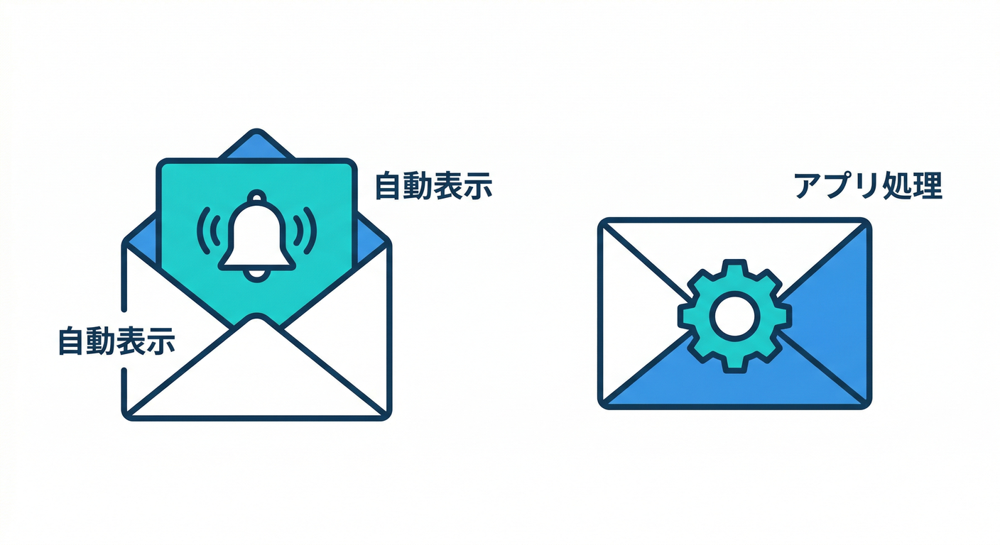
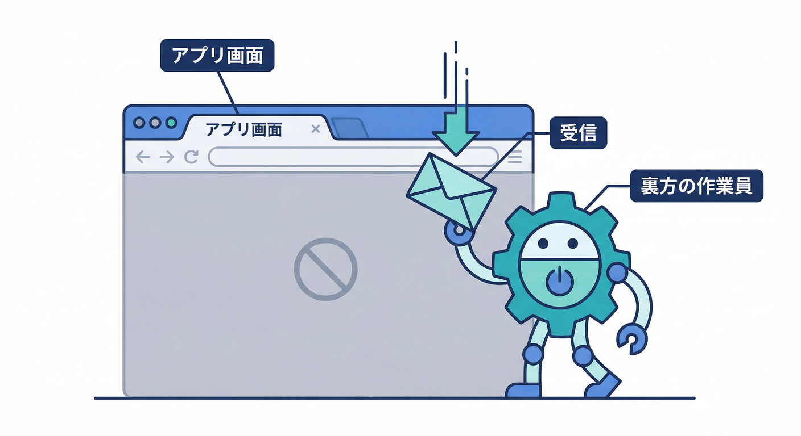
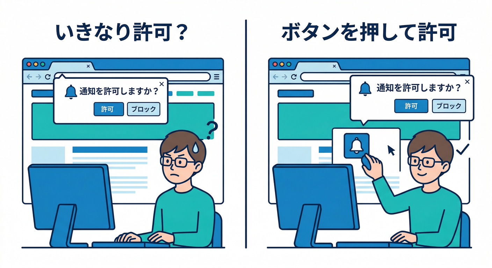
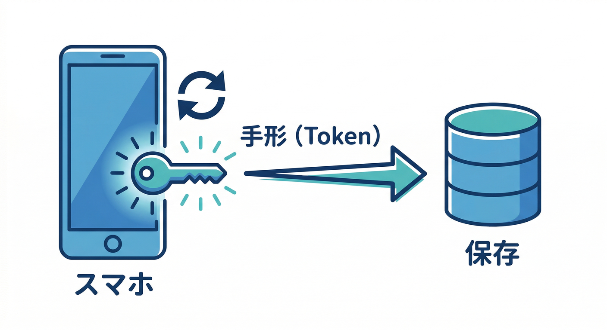
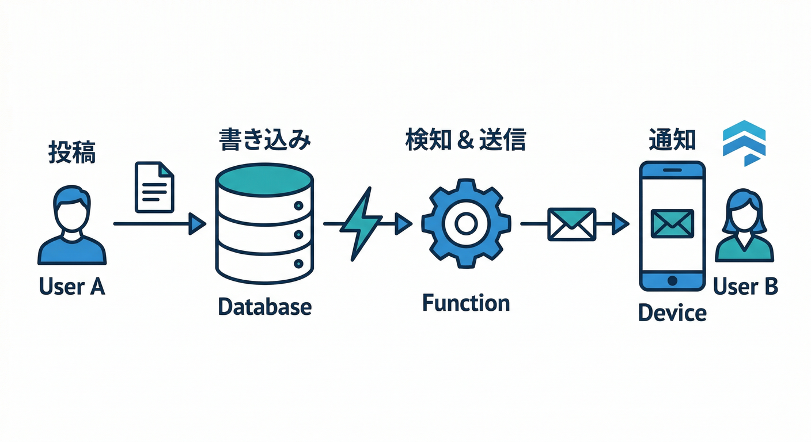
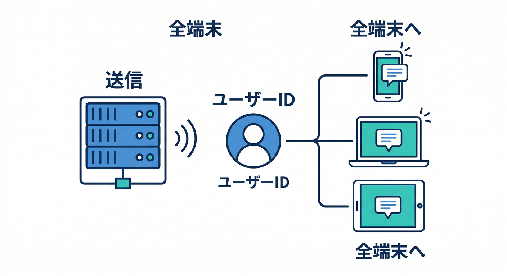
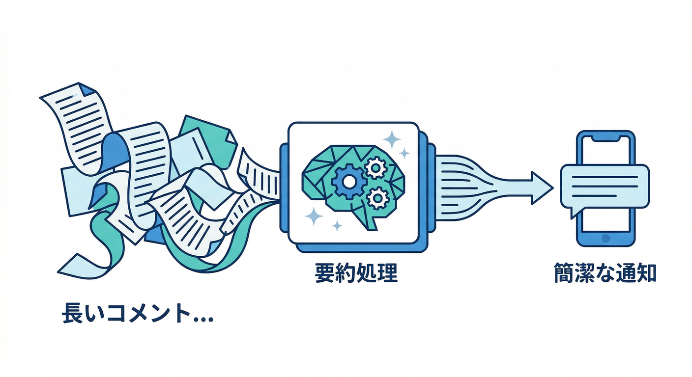

# 通知：FCMで“使われるアプリ”に近づく📣🔔：20章アウトライン

---

## この教材の核になる一次情報（最新前提）📚🔎

* Firebase Cloud Messagingは、通知（表示される系）とデータ（アプリ側で処理する系）の両方を送れます。ターゲットは **端末トークン / グループ / トピック**が基本です📬 ([Firebase][1])

* メッセージは大きく **notification / data**。どちらも基本は **最大 4096 bytes**（ただしコンソール送信は制限あり）で、用途で使い分けます🧩 ([Firebase][2])
* サーバー送信は **Firebase Admin SDK か FCM HTTP v1 API**が中心（レガシーよりv1が前提）です🚀 ([Firebase][1])
* Webの受信は **Service Worker** が重要ポイント（フォアグラウンド/バックグラウンドで扱いが変わる）🧑‍🚒🧩 ([Firebase][3])

* 「許可ダイアログの出し方」でブロック率が激変します。いきなり出さず、価値が伝わるタイミングで出すのが王道です🙅‍♂️➡️🙆‍♀️ ([web.dev][4])

* 送信側の実装はNode中心でもOK。サーバー実行環境のランタイムは、たとえば Cloud Functions for Firebase で **Node.js 22/20（18はdeprecated）**を選べます⚙️ ([Firebase][5])
* もし **.NET / Python** で送信ロジックをやりたい場合は、Cloud Run の “functions ランタイム” 側で **.NET 8 / Python 3.13 など**を選べます（選択肢が広い）🐍🟦 ([Google Cloud Documentation][6])
* Firebase AI Logic はGemini/Imagenをアプリから安全に呼ぶ入口として整理されていて、通知文生成にも相性がいいです🤖📝 ([Firebase][7])
* Google Antigravity は「エージェントが計画→実装→検証」まで回す思想の開発基盤として説明されています🛸 ([Google Codelabs][8])
* Gemini CLI はターミナルから調査・修正・テスト生成などを支援する流れが公式に整理されています💻✨ ([Google Cloud Documentation][9])

---

### 第1章：通知って何が嬉しいの？“使われるアプリ”の正体🌱

* **読む**📖：通知＝「呼び戻し」ではなく「助け舟」になると強い
* **手を動かす**🖱️：アプリ内で「通知が来たら嬉しい場面」を3つ書き出す
* **ミニ課題**🎯：コメント通知の“嬉しい瞬間”を1文で言語化
* **チェック**✅：通知が「自分の都合」になってない？

### 第2章：通知が“うざい”は設計で防げる😇🧯

* **読む**📖：許可の取り方・頻度・内容が3大地雷
* **手を動かす**🖱️：許可を出す“タイミング”を画面遷移図に入れる
* **ミニ課題**🎯：「通知ONにする理由」をUI文言で作る
* **チェック**✅：初回アクセスでいきなり許可を求めてない？

### 第3章：FCMの全体像（送る側・受ける側・IDの話）🧩📮

* **読む**📖：トークン/トピック/送信サーバーの役割
* **手を動かす**🖱️：誰がどの情報を持つか（図でOK）
* **ミニ課題**🎯：「コメント→誰に→何を→どこから送る」を1枚図に
* **チェック**✅：クライアントに“秘密鍵”を置く設計になってない？

### 第4章：React側の下準備（通知スイッチの置き場）🎛️⚛️

* **読む**📖：通知は“機能”じゃなく“設定”として置く
* **手を動かす**🖱️：設定画面に「通知ON/OFF」トグルを追加
* **ミニ課題**🎯：ONの時だけ「テスト通知」ボタンが出るUIに
* **チェック**✅：ユーザーが自分でOFFできる導線ある？

### 第5章：権限リクエストのUX（押した時だけ出す）🙆‍♀️🔔

* **読む**📖：押しボタン方式が分かりやすい（ブロック減らす）
* **手を動かす**🖱️：「通知を有効化」ボタンで初めて許可を出す
* **ミニ課題**🎯：拒否された時の“次の一手”メッセージを用意
* **チェック**✅：拒否後の復帰導線がある？

### 第6章：Web Pushの要：Service Workerを“味方”にする🧑‍🚒🧩

* **読む**📖：バックグラウンド受信はSWが担当
* **手を動かす**🖱️：SWファイルを用意し、受信ログを出す
* **ミニ課題**🎯：SWが動いてる証拠（コンソールで確認）を取る
* **チェック**✅：フォア/バックで処理が分かれてるのを理解できた？

### 第7章：FCMトークン取得→Firestore保存（端末IDを預かる）🗃️🔑

* **読む**📖：トークンは“端末ごとの宛先”

* **手を動かす**🖱️：トークン取得→ユーザー配下に保存
* **ミニ課題**🎯：同一ユーザーで2トークン保存できる設計にする
* **チェック**✅：保存先が「ユーザー単位」になってる？

### 第8章：トークン更新・無効化・重複（地味だけど超重要）🧯🌀

* **読む**📖：トークンは変わる。古いのを握り続けると事故る
* **手を動かす**🖱️：更新時に上書き/追加ルールを決めて実装
* **ミニ課題**🎯：トークンに `createdAt / lastSeen / platform` を付ける
* **チェック**✅：古いトークン掃除の方針ある？

### 第9章：フォアグラウンド受信（アプリ内通知の気持ちよさ）📲✨

* **読む**📖：画面を見てる時は“静かに”出すのが優しい
* **手を動かす**🖱️：受信→トースト/バッジ更新
* **ミニ課題**🎯：受信ログを「開発用パネル」に見える化
* **チェック**✅：通知が画面操作を邪魔してない？

### 第10章：バックグラウンド受信（通知を表示してクリック対応）🔔👉

* **読む**📖：通知表示と「クリック後の遷移」がセット
* **手を動かす**🖱️：通知クリックで該当コメントページへ
* **ミニ課題**🎯：コメントID入りのリンク（深い導線）を作る
* **チェック**✅：押したら“正しい場所”に飛べる？

### 第11章：通知の種類（notification/data）を使い分ける🧩⚖️

* **読む**📖：自動表示したい？アプリで制御したい？
* **手を動かす**🖱️：コメント通知は「表示＋必要データ」を両方持たせる
* **ミニ課題**🎯：payloadの設計メモを作る（短く！）
* **チェック**✅：4096bytes制限意識できてる？

### 第12章：テスト送信（コンソールからまず当てる）🧪🎯

* **読む**📖：いきなりコード送信より、まず当てて動作確認
* **手を動かす**🖱️：トークン宛にテスト通知→端末に届く
* **ミニ課題**🎯：届かなかった時の原因候補を3つ書く
* **チェック**✅：受信できる“最低ライン”が作れた？

### 第13章：送信サーバーの基本（Admin SDK / HTTP v1）🏗️📤

* **読む**📖：送信は“信頼できる場所”からだけ
* **手を動かす**🖱️：送信手段を「Functionsで送る」に決めて準備
* **ミニ課題**🎯：送信の入力（to/タイトル/本文/URL）を1つの型に
* **チェック**✅：クライアントから直接送れない設計になってる？

### 第14章：コメント通知の最小実装（Firestoreトリガーで送る）⚡📝➡️🔔

* **読む**📖：イベント駆動＝「起きたら勝手に動く」

* **手を動かす**🖱️：コメント作成→投稿者へ通知
* **ミニ課題**🎯：自分への通知は送らない（当たり前ルール）
* **チェック**✅：誰に送るかロジックがブレてない？

### 第15章：複数端末・複数トークンへの送信（現実アプリ感）📱💻📨

* **読む**📖：人はPC/スマホ/タブレットを持つ
* **手を動かす**🖱️：ユーザーの全トークンにまとめて送信

* **ミニ課題**🎯：失敗したトークンだけ除外する動きに
* **チェック**✅：1個失敗で全失敗になってない？

### 第16章：“うざくならない”制御（まとめる・間引く・寿命を付ける）😇⏳

* **読む**📖：連投通知は嫌われる。まとめる/抑えるが正義
* **手を動かす**🖱️：短時間に複数コメント→1通にまとめる（簡易でOK）
* **ミニ課題**🎯：TTL（期限）を決める（例：24hで価値ゼロなら捨てる）
* **チェック**✅：通知が“情報価値のある期間”だけ飛んでる？

### 第17章：配信の健康診断（エラー・無効トークン掃除）🧹🧯

* **読む**📖：送信は「成功率の運用」
* **手を動かす**🖱️：送信結果をログに残して、無効トークンを消す
* **ミニ課題**🎯：削除する条件を1行で言えるように
* **チェック**✅：失敗が積み上がらない設計？

### 第18章：AIで“通知文”を整える（短い・伝わる・安全）🤖📝✨

* **読む**📖：通知文は短距離走。AIで「要点だけ」にできる

* **手を動かす**🖱️：コメント本文→短い通知文に変換（AI Logic）
* **ミニ課題**🎯：NGワード/個人情報っぽい文字をマスクする
* **チェック**✅：通知に“出しちゃダメ”が混ざってない？

### 第19章：AIで“送る/送らない”判定を賢くする（簡易ワークフロー）🧠🔀

* **読む**📖：全部送る＝スパム。価値がある時だけ送る
* **手を動かす**🖱️：AIに「重要度」を判定させて、低ければ送らない
* **ミニ課題**🎯：判定理由も一緒に記録（後で改善できる）
* **チェック**✅：人間が後から検証できるログがある？

### 第20章：発展コース（.NET/Python送信・運用・次の一手）🚀🟦🐍

* **読む**📖：送信ロジックはNode以外でも運べる（Cloud Run系）
* **手を動かす**🖱️：送信モジュールを「言語に依存しない設計」に整理
* **ミニ課題**🎯：やるならどれ？（Node/ .NET / Python）を決めて理由を書く
* **チェック**✅：移植しても“同じ品質（抑制/掃除/ログ）”を保てる？

---

## 章を作る時の“型”（毎章共通テンプレ）📘✨

各章はこの4ブロックで固定すると、学ぶ側が迷子になりません😄

* **読む**：5分で概念（例え話OK）📖
* **手を動かす**：10分で実装（小さく）🖱️
* **ミニ課題**：5分で“ちょい応用”🎯
* **チェック**：理解確認3つ✅

---

[1]: https://firebase.google.com/docs/cloud-messaging "Firebase Cloud Messaging"
[2]: https://firebase.google.com/docs/cloud-messaging/customize-messages/set-message-type "Firebase Cloud Messaging message types"
[3]: https://firebase.google.com/docs/cloud-messaging/web/get-started?utm_source=chatgpt.com "Get started with Firebase Cloud Messaging in Web apps"
[4]: https://web.dev/articles/permissions-best-practices?utm_source=chatgpt.com "Web permissions best practices | Articles"
[5]: https://firebase.google.com/docs/functions/manage-functions "Manage functions  |  Cloud Functions for Firebase"
[6]: https://docs.cloud.google.com/run/docs/runtimes/function-runtimes?hl=ja "Cloud Run functions ランタイム  |  Google Cloud Documentation"
[7]: https://firebase.google.com/docs/ai-logic?utm_source=chatgpt.com "Gemini API using Firebase AI Logic - Google"
[8]: https://codelabs.developers.google.com/getting-started-google-antigravity "Getting Started with Google Antigravity  |  Google Codelabs"
[9]: https://docs.cloud.google.com/gemini/docs/codeassist/gemini-cli?utm_source=chatgpt.com "Gemini CLI | Gemini for Google Cloud"
