# 第01章：通知って何が嬉しいの？“使われるアプリ”の正体🌱

## この章のゴール🎯

* 通知の役割を「アプリ側の都合」ではなく「ユーザーの得」から説明できるようになる😊
* “通知が来たら嬉しい場面”を3つ言語化できるようになる📝
* その3つを「どんな通知にするか（短く・正確に・邪魔しない）」の方向に落とし込める🧭

---

## 読む📖✨ 通知＝“呼び戻し”じゃなく“助け舟”だと強い
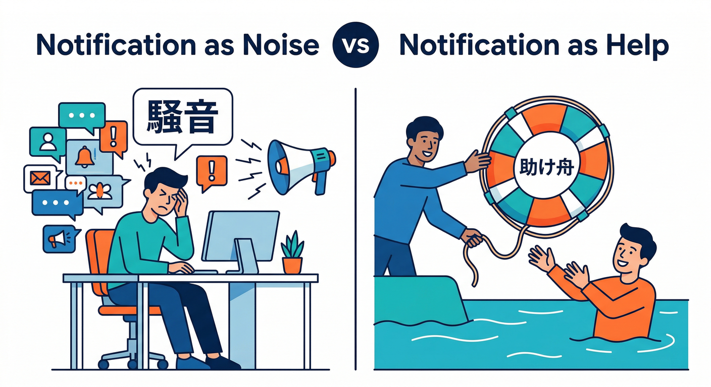

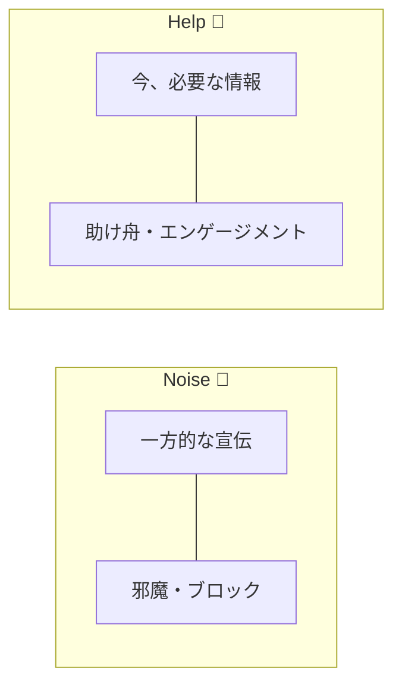

## 1) 通知が強い理由は「今、必要」だから⏰🚤

通知って、アプリの宣伝じゃなくて「今これを知ってると得する」情報を届ける手段なんだよね。
たとえば「新しいコメントが付いたよ」は、今見れば会話が続いて楽しいし、後で見ても価値が下がるかもしれない。

FCMはまさにこういう“タイミングが命”のメッセージを、いろんな端末に届ける仕組みとして整理されてるよ📮✨ ([Firebase][1])

---

## 2) 通知の2タイプを、ざっくり知っておく🧩

通知には大きく2つの役割があるよ：
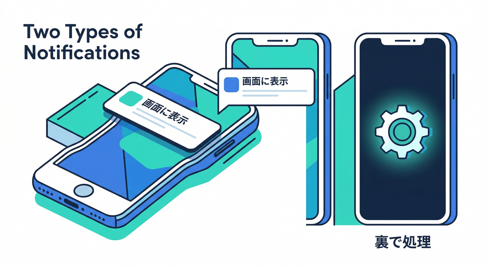

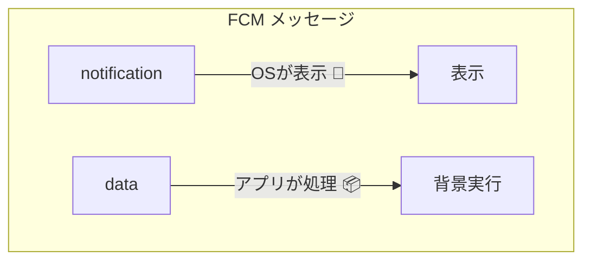

* **画面に出して「気づかせる」**（ユーザーに見えるやつ）🔔
* **データを渡して「アプリ側で処理する」**（表示はアプリが決める）📦

FCMのメッセージも、こういう考え方で **notification / data** の形に分かれる（両方混ぜることもある）って整理されてるよ🧠 ([Firebase][2])
そして**ペイロードは基本 4096 bytes 上限**なので、通知に“全部詰め込む”のはやめようね、という思想もここで覚えておくと後がラク😇 ([Firebase][2])

> 第1章では「へぇ〜」でOK。
> 実装で本気になるのは第11章あたりからで大丈夫🙆‍♀️

---

## 3) 「許可ダイアログ」は“価値が伝わってから”が王道🙅‍♂️➡️🙆‍♀️
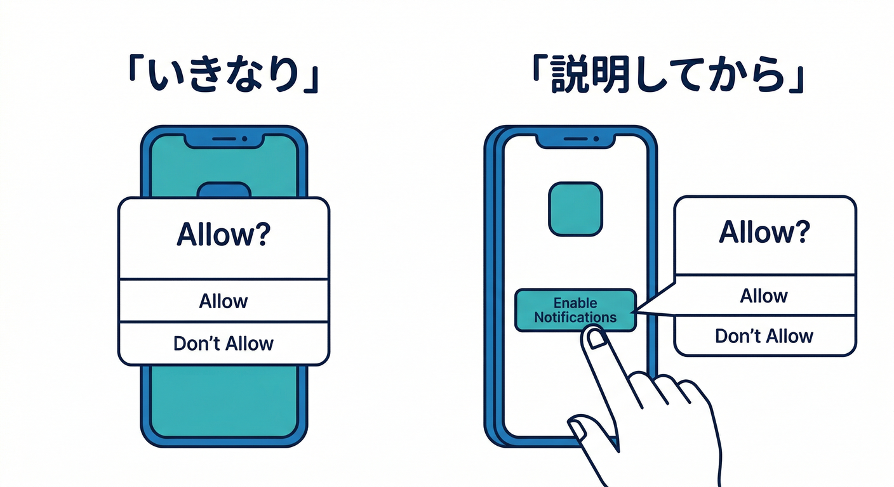

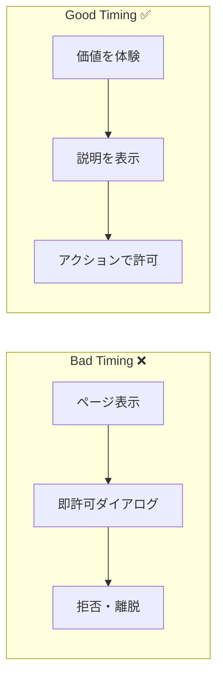

Web通知は許可が要るよね。ここ、めっちゃ大事。
許可の出し方が雑だと、ブロックされて終わる…😭

Chromeなどの調査・ユーザー研究を踏まえて、**価値が伝わる前に許可を求めない**／**必要な瞬間に説明してから許可を出す**のが推奨されてるよ📌 ([web.dev][3])

---

## 4) つまり「使われるアプリ」は、通知の目的がズレてない🎯

通知が“使われる”方向に効くのは、だいたいこの3つに当てはまるとき👇
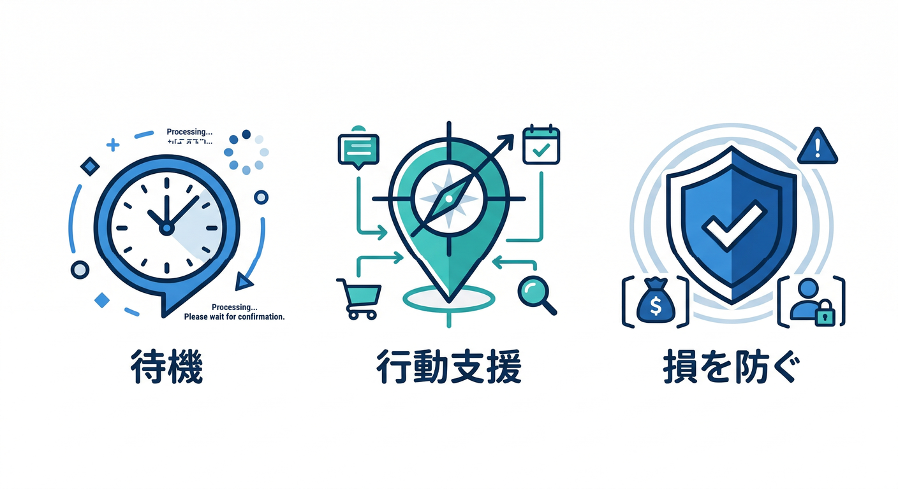

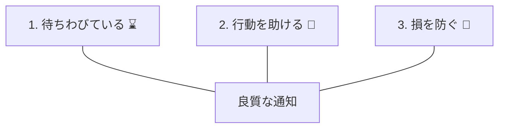

1. **ユーザーが待ってる**（返信・結果・進捗など）💬
2. **ユーザーの行動を助ける**（期限・到着・在庫・手続きなど）🧭
3. **ユーザーの損を防ぐ**（エラー・失敗・期限切れなど）🧯

逆にダメなのはこれ👇

* 「アプリを開いて！」だけの通知（ユーザー得が薄い）🥲
* いつでもいい内容を、急に割り込ませる（邪魔）😵‍💫
* 量が多い（スパム扱い）🧨

---

## 手を動かす🖱️📝 「通知が来たら嬉しい場面」を3つ書き出す

ここはコードじゃないよ！“設計の筋トレ”💪✨
メモ帳でもOK。以下の型で3つ書いてみてね👇

## 書き出しテンプレ🧩

* **いつ**：どんなタイミング？（例：コメントが付いた直後）⏱️
* **誰に**：誰が嬉しい？（例：投稿者、メンションされた人）👤
* **何が起きた**：事実はなに？（例：〇〇さんがコメント）📌
* **嬉しい理由**：ユーザー目線で1行（例：すぐ返すと会話が続く）😊
* **許可を出すタイミング**：どこで価値を説明する？（例：通知スイッチONを押したとき）🔔

## 例（コメント通知）💬🔔

* いつ：投稿にコメントが付いた直後
* 誰に：投稿者
* 何が起きた：新しいコメント
* 嬉しい理由：すぐ返すと会話が盛り上がる
* 許可タイミング：設定画面で「コメント通知ON」押下時（価値説明→許可） ([web.dev][3])

---

## ミニ課題🎯✨ 「嬉しい瞬間」を“1文”で言語化する

さっきの3つのうち、いちばん強い1つを選んで、これを完成させてね👇
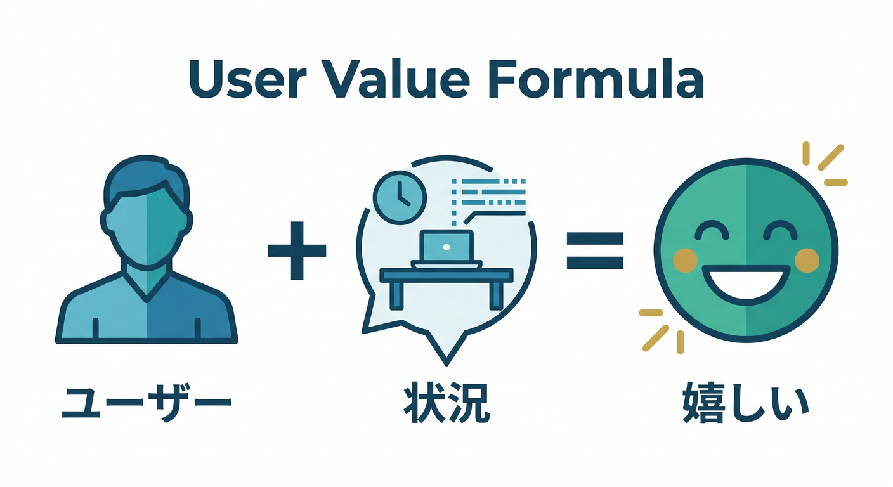

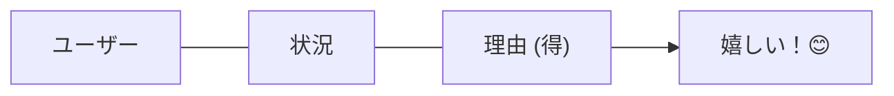

* **「（ユーザー）は、（状況）になったら、（理由）だから、通知があると嬉しい」**

例：
「投稿者は、コメントが付いたら、すぐ返すと会話が続くから、通知があると嬉しい」😊💬

---

## チェック✅😇 通知が「自分の都合」になってない？

次の3つにYESなら、方向性はだいぶ良いよ🙌

* ✅ ユーザーの得が1行で言える
* ✅ “今知らせる意味”がある（遅いと価値が落ちる）
* ✅ 許可を出す前に「価値」を説明する流れになってる ([web.dev][3])

---

## よくある落とし穴🕳️🧯

* **落とし穴A：最初の画面で即許可** → ブロックされやすい😭 ([web.dev][3])
* **落とし穴B：通知文が長い** → 4096 bytes制限もあるし、読まれない🥲 ([Firebase][2])
* **落とし穴C：「誰に送るか」が曖昧** → 後で地獄（第3章で整理するよ）🌀

---

## AIでここを爆速にする🤖💡

第1章の段階でもAIはめちゃ使えるよ。ポイントは「通知の価値を言語化」と「文面の短縮」📝✨

## 1) 通知の“嬉しさ”を発掘する🧠🔎

* Antigravityは「エージェントが計画→実装→検証」まで回す“ミッションコントロール”思想として説明されてるので、アイデア出し→候補整理が得意だよ🛸 ([Google Codelabs][4])
* Gemini CLIも、ターミナルから調査や文章作りを支援する流れが公式に整理されてるよ💻✨ ([Google Cloud Documentation][5])

おすすめの頼み方（コピペ用）👇
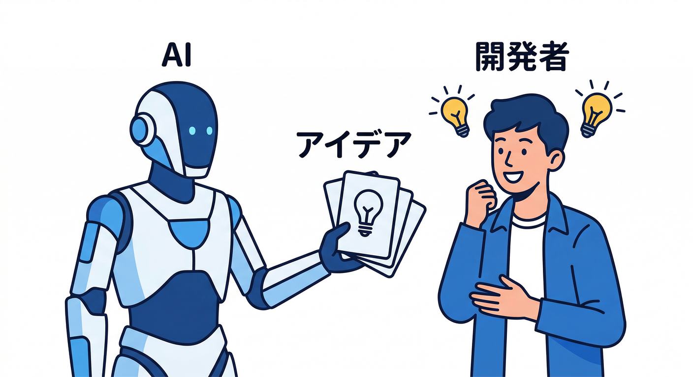

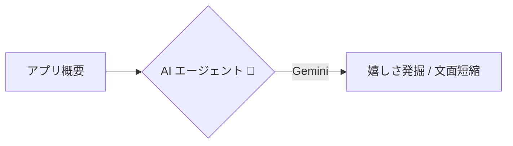

* 「コメント通知が“嬉しい瞬間”を10個出して、ユーザー得が強い順に並べて」
* 「通知許可を求める前に出す説明文（1〜2行）を3案出して。押したくなるけど誇張しないで」

## 2) 通知文を短く安全にする🚦✂️

Firebase AI Logic は、アプリから安全にGemini/Imagenにアクセスする入口として整理されていて、文章の要約や言い換えと相性がいいよ🤖📝 ([Firebase][6])
※モデルの入れ替わり等も案内されてるので、教材としても“最新追従が必要な領域”って認識が持てる（大事）📆 ([Firebase][6])

---

## 次章へのつながり🔗📘

第1章で作った「嬉しい場面3つ」は、次章でこう進化するよ👇

* 第2章：その嬉しさを壊さない“うざくならない設計”へ😇🧯
* 第3章：誰に送る？をトークン/トピックの世界観に落とす🧩📮
* 第4〜5章：React側の通知スイッチ＆許可UXに着地🎛️⚛️

---

必要なら、第1章の「3つの場面」をあなたのアプリ案（メモ/コメント/プロフィール画像など）に寄せた“具体例セット”として、こちらで10案くらい作って、そこから選べる形にもできるよ📣🧩

[1]: https://firebase.google.com/docs/cloud-messaging?utm_source=chatgpt.com "Firebase Cloud Messaging"
[2]: https://firebase.google.com/docs/cloud-messaging/customize-messages/set-message-type?utm_source=chatgpt.com "Firebase Cloud Messaging message types - Google"
[3]: https://web.dev/articles/permissions-best-practices?utm_source=chatgpt.com "Web permissions best practices"
[4]: https://codelabs.developers.google.com/getting-started-google-antigravity?utm_source=chatgpt.com "Getting Started with Google Antigravity"
[5]: https://docs.cloud.google.com/gemini/docs/codeassist/gemini-cli?utm_source=chatgpt.com "Gemini CLI | Gemini for Google Cloud"
[6]: https://firebase.google.com/docs/ai-logic?utm_source=chatgpt.com "Gemini API using Firebase AI Logic - Google"
