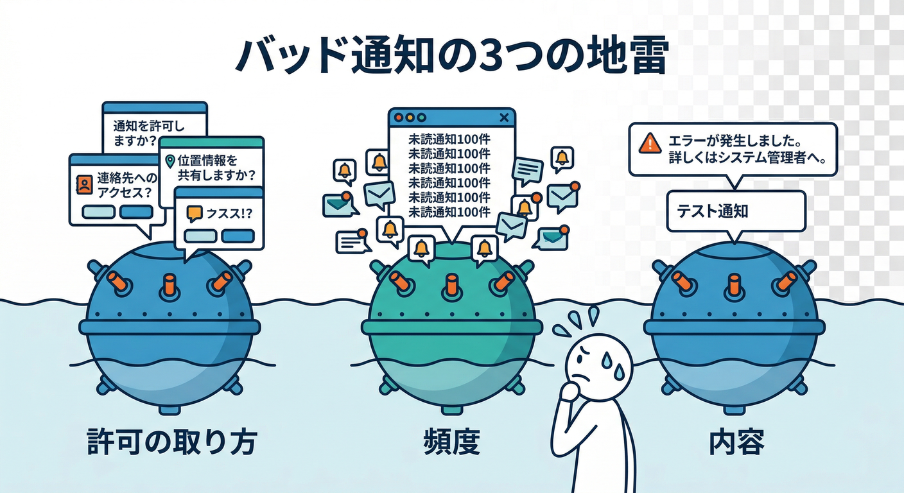
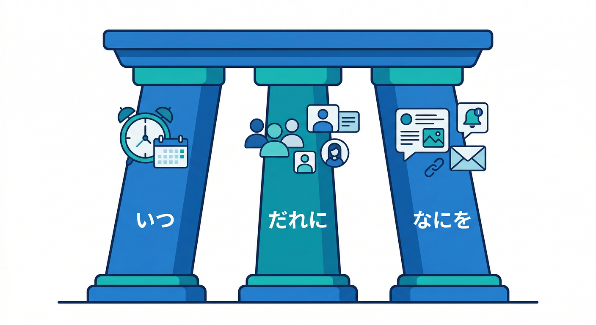
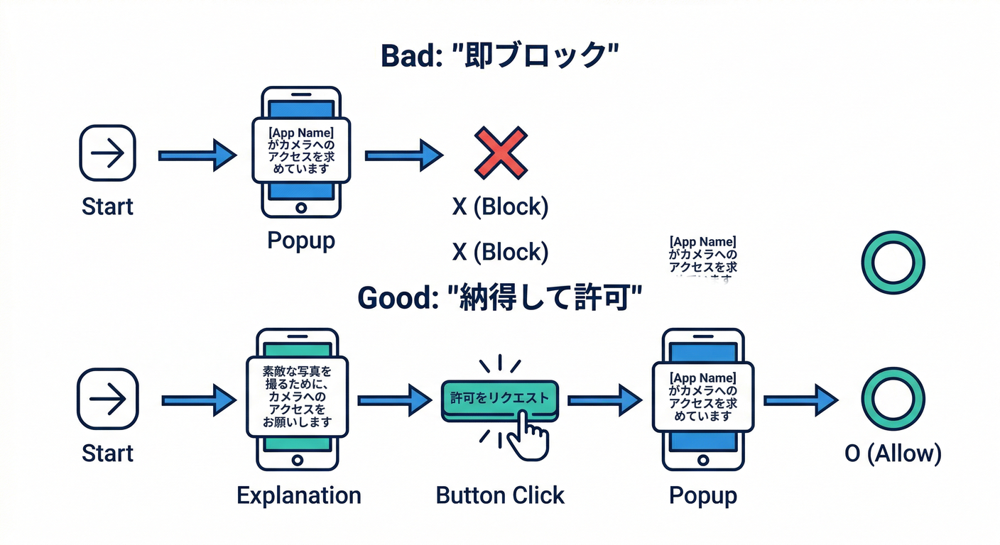
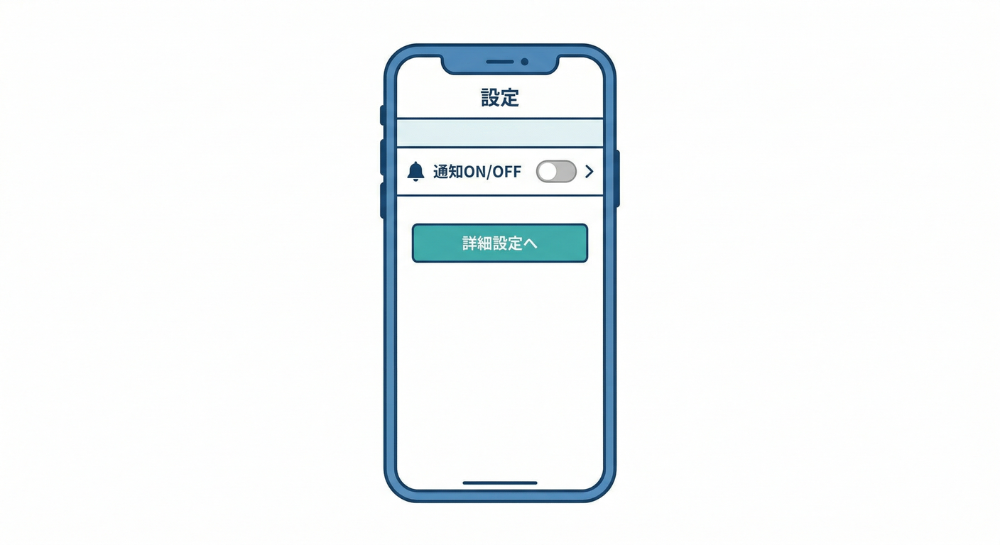
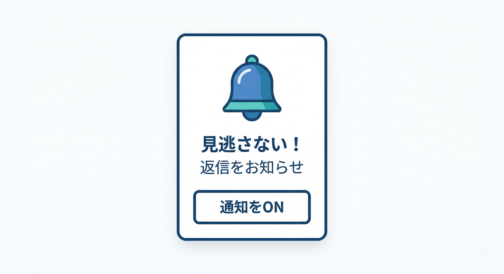
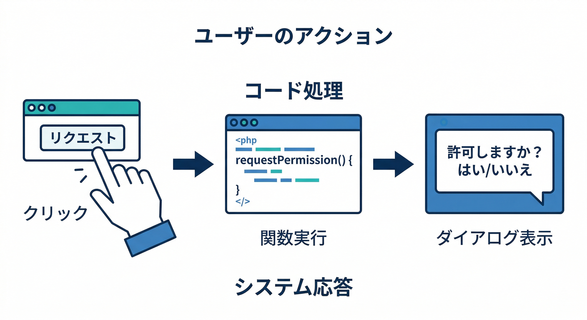
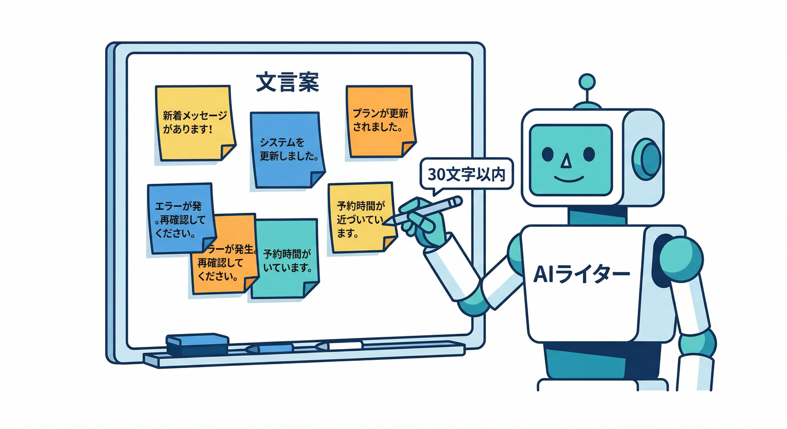

# 第02章：通知が“うざい”は設計で防げる😇🧯

この章は「FCMの技術」より先に、**通知が嫌われないための設計**を固めます📣
通知は「呼び戻し」じゃなくて「助け舟」になると最強です🚣‍♂️✨
でも設計を雑にすると、秒でブロックされます🙅‍♀️💥（そして二度と戻れないことも…）

---

## 2-1. まず結論：地雷はこの3つ💣💣💣


1. **許可の取り方**（いきなり許可ダイアログ出す）
2. **頻度**（連投・夜中・どうでもいい通知）
3. **内容**（長い・曖昧・押しても得しない）

特に「許可の取り方」は即死級です😇
ブラウザの通知許可は、**ユーザー操作（ボタン押下など）に紐づけて出すのが基本**で、将来的には“操作なしで許可要求”がより厳しく制限される方向です🧑‍⚖️🔔 ([MDN Web Docs][1])
そして許可を求める前に「何が嬉しいのか」を伝えるのが王道です📣 ([web.dev][2])

---

## 2-2. “うざくならない”通知の合言葉（設計の骨組み）🦴✨


通知を出す前に、毎回この3点を決めます🧠

* **いつ**：今知らせる価値ある？（今じゃなくて良くない？）⏰
* **だれに**：本当にこの人？（関係者だけ？）🎯
* **なにを**：1行で要点、タップしたら続きが見れる📌

そして「頻度」を守るために、最低限これ👇

* **まとめる**：5件コメント→1通にまとめる📦
* **間引く**：同じ種類は間隔をあける✂️
* **寿命**：24時間で価値ゼロなら送らない⏳

（この“制御”は後の章でFunctions側に実装していくイメージです⚡）

---

## 読む（5分）📖✨：許可ダイアログは“最後に出す”が正解🙆‍♀️🔔

## ✅ ダメな例（ブロック一直線）🙅‍♂️

* 初回アクセス即：
  「通知を許可しますか？」（価値説明ゼロ）
  → ユーザー「知らんがな」→ ブロック😇

## ✅ 良い例（同意が取りやすい）🙆‍♀️


* ユーザーが「通知が必要な場面」に到達した瞬間に：

  1. アプリ内で先に説明（**ソフト許可**）
  2. 「有効にする」ボタンを押したら
  3. そこで初めてOS/ブラウザの許可ダイアログ（**ハード許可**）

この流れは、web.devでも「不要な許可ダイアログを減らし、拒否（block）を減らす」方向のベストプラクティスとして整理されています🧭✨ ([web.dev][2])

---

## 手を動かす（10分）🖱️⚛️：許可を出す“タイミング”を画面遷移図に入れる

ここではコードより先に、**画面遷移**を決めます✍️（超大事！）

## ① 画面遷移図（文章でOK）🗺️


こんな感じにします👇

* `/settings`（設定）⚙️

  * 「通知」セクション 📣

    * トグル：通知を有効にする（※最初はOFF）
    * クリック → `/settings/notifications/intro`
* `/settings/notifications/intro`（価値説明）✨

  * 例：

    * 「コメント返信を見逃さない」💬
    * 「いつでもOFFにできます」🧯
    * 「夜はまとめて控えめにします」🌙
  * ボタン：「通知を有効にする」🔔

    * 押したら **許可ダイアログ**（ユーザー操作に紐づく） ([MDN Web Docs][1])
* 成功したら `/settings` に戻して

  * 「テスト通知を送る」ボタンを表示（後の章で実装）🧪

## ② “ソフト許可”用のUI文言（まずは仮で置く）📝


次の3行だけでOKです（短いほど強い）💪

* 見逃したくない更新だけお知らせします📣
* 通知はいつでもOFFにできます🧯
* 夜中の連投はしません🌙

> ここで長文を書くと、読む前に閉じられます😇
> 通知文も同じで、FCMはペイロードにサイズ上限があるので「短く」が得です✂️（通知/データとも基本 4096 bytes。コンソール送信はさらに文字数制限あり） ([Firebase][3])

## ③（ミニ実装）許可リクエストは“ボタン押した時だけ”にする🔔


React側で、**押した時だけ** `Notification.requestPermission()` を呼ぶ形にします。

```ts
// クリックしたときだけ呼ばれる想定（初回アクセスでは絶対に呼ばない）
export async function requestNotificationPermission(): Promise<NotificationPermission> {
  if (!("Notification" in window)) return "denied"; // そもそも非対応

  // すでに決まってるなら、そのまま返す（無駄に聞かない）
  if (Notification.permission !== "default") return Notification.permission;

  // ここが「ユーザー操作に紐づく」タイミングで呼ばれるのが重要
  const permission = await Notification.requestPermission();
  return permission;
}
```

ポイントはこれだけ👇

* **初回アクセスで呼ばない**🙅‍♀️
* **ボタン押下の中で呼ぶ**🙆‍♀️（ユーザー操作に紐づける） ([MDN Web Docs][1])
* **すでに許可/拒否が決まってたら再要求しない**🧠（しつこいのは嫌われる）

---

## ミニ課題（5分）🎯📝：「通知ONにする理由」をUI文言で作る（AIも使う🤖✨）


ここはAIの出番です🔥
**Firebase AI Logic**を使うと、アプリから安全にGeminiを呼んで「短い・伝わる・圧がない」文言を作りやすいです🤖🧩 ([Firebase][4])

## ① AIに出すお題（そのまま使ってOK）🧠

* 条件：

  * 1文は **全角30文字以内**
  * 圧をかけない（命令しない）
  * “得”が伝わる
  * 夜中配慮・いつでもOFFもどこかで触れる

```text
あなたはプロダクトのUXライターです。
Webアプリの通知許可を取る前の説明文を作ってください。

目的: コメント返信を見逃さない
トーン: 親しみやすい / 圧がない / うざくない
制約: 1文は全角30文字以内、候補を10個
必須要素: 「見逃さない」「いつでもOFF」「夜は控えめ」を全体でカバー
出力: 箇条書き
```

（AI Logicで実装するのは後の章でもOK。ここは“文言設計”の練習です📝）

## ② Gemini CLIで雑に候補を増やす（手早い）💻✨

```bash
gemini --prompt "上の条件で候補10個。さらに“より柔らかい版”も10個。"
```

Gemini CLIは、調査・文章作成・修正の反復に強いので、文言づくりの速度が上がります🚀 ([Google Cloud Documentation][5])
（そしてAntigravity系の「計画→実装→検証」ループと相性がいいです🛸🔁） ([Google Codelabs][6])

---

## チェック（理解確認）✅✅✅

1. **初回アクセス直後に許可ダイアログを出してない？** 🙅‍♀️
   → “価値説明→ボタン→許可”の順になってる？ ([web.dev][2])

2. **ユーザーがOFFできる導線がある？** 🧯
   → 設定画面に「通知OFF」が常にある？

3. **通知文は短く、押した後に得がある？** 📌
   → 1行で要点＋詳細はアプリ内で見せる（サイズ面でも有利） ([Firebase][3])

---

次の第3章では、ここで作った設計を土台にして「送る側・受ける側・ID（トークン/トピック）」の全体像をつなげます🧩📮
第2章がしっかりしてると、後の実装が全部ラクになりますよ😄🔥

[1]: https://developer.mozilla.org/en-US/docs/Web/API/Notifications_API/Using_the_Notifications_API?utm_source=chatgpt.com "Using the Notifications API - MDN Web Docs"
[2]: https://web.dev/articles/permissions-best-practices?utm_source=chatgpt.com "Web permissions best practices | Articles"
[3]: https://firebase.google.com/docs/cloud-messaging/customize-messages/set-message-type?utm_source=chatgpt.com "Firebase Cloud Messaging message types - Google"
[4]: https://firebase.google.com/docs/ai-logic?utm_source=chatgpt.com "Gemini API using Firebase AI Logic - Google"
[5]: https://docs.cloud.google.com/gemini/docs/codeassist/gemini-cli?utm_source=chatgpt.com "Gemini CLI | Gemini for Google Cloud"
[6]: https://codelabs.developers.google.com/getting-started-google-antigravity?utm_source=chatgpt.com "Getting Started with Google Antigravity"
