# 第3章：FCMの全体像（送る側・受ける側・IDの話）🧩📮

## この章のゴール🎯

* **送る側**（サーバー）と**受ける側**（ブラウザ/アプリ）の役割分担を、1枚で説明できるようになる🗣️✨
* **ID/鍵/トークン**の「公開OK」と「絶対NG」を見分けられるようになる🔐✅
* 「コメント通知」を例に、**どこから誰に何を送るか**の道筋が描けるようになる🧠➡️📣

---

## 1) 登場人物（FCMの“班分け”）👥🧩
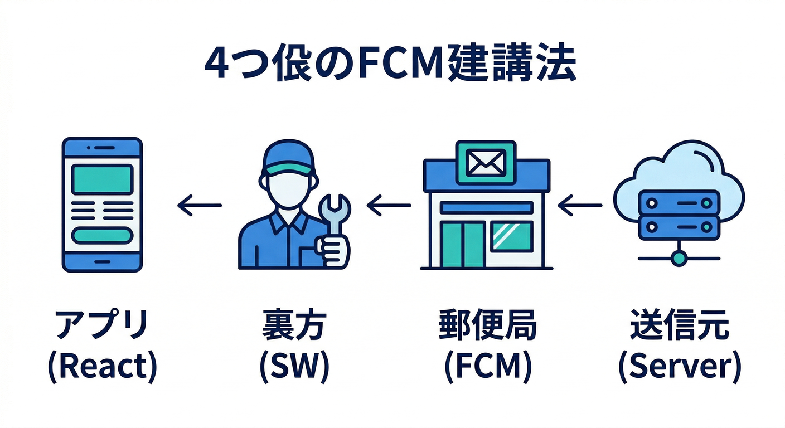

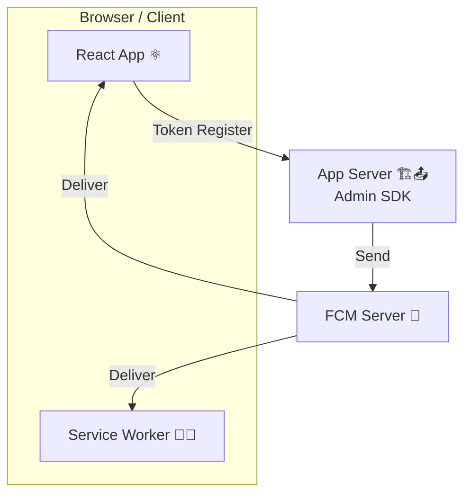

FCMはざっくり **4人** で回ってます👇

1. **クライアント（Reactアプリ）** ⚛️

   * 通知を受け取る（フォアグラウンドの処理など）
   * **端末トークン（registration token）** を取得する📱💻
2. **Service Worker** 🧑‍🚒

   * ブラウザが裏にいる時（バックグラウンド）に受け取って、通知表示の主役になる
   * Web Pushの要！🧩 ([Firebase][1])
3. **FCM（Firebase側）** 📮

   * “宛先”に向けて配達してくれる郵便局みたいな存在
4. **送信サーバー（信頼できる場所）** 🏗️📤

   * Admin SDK か HTTP v1 API で送る（いまは **v1が前提**）([Firebase][2])
   * **秘密（サービスアカウント等）を持つのはココだけ** 🔥

---

## 2) ざっくり全体フロー（3レーン図）🛣️🛣️🛣️
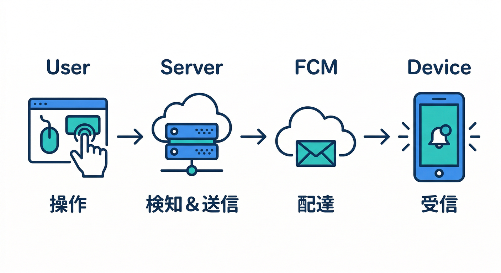

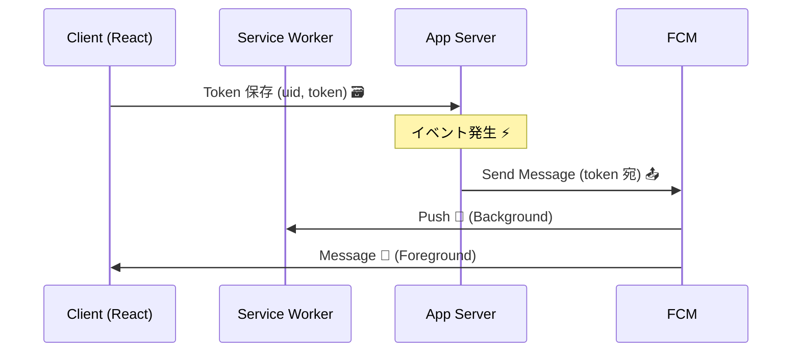

「受け取り準備」→「イベント発生」→「送信」→「受信」の一本道にするとこう👇

```text
[ユーザー操作] 
   ↓
(React) 通知をONにする → 許可 → token取得
   ↓ tokenを保存（Firestoreなど）🗃️
────────────────────────────────────
コメントが付いた！📝（Firestoreに新規ドキュメント）
   ↓
(送信サーバー) Firestoreトリガー等で検知⚡
   ↓
Admin SDK / HTTP v1 で FCMへ送信📤
   ↓
(FCM) 宛先へ配達📮
   ↓
(ブラウザ)
  ├─ フォアグラウンド：React側で受けてUI更新✨
  └─ バックグラウンド：Service Workerが受けて通知表示🔔
```

WebのFCMでは **VAPIDキー**（Web Push用の資格証）が絡みます。「プロジェクトに鍵ペアを紐付ける」やつです🔑
クライアントは **公開鍵（public key）** を使う側、というイメージでOKです👌 ([Firebase][1])

---

## 3) “宛先”の種類：トークン / トピック / 条件 🎯📬
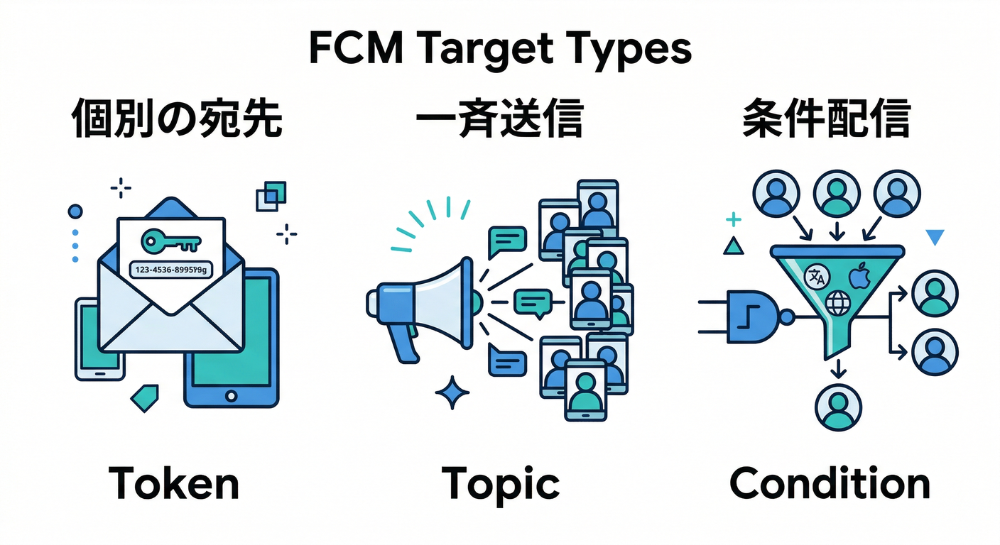

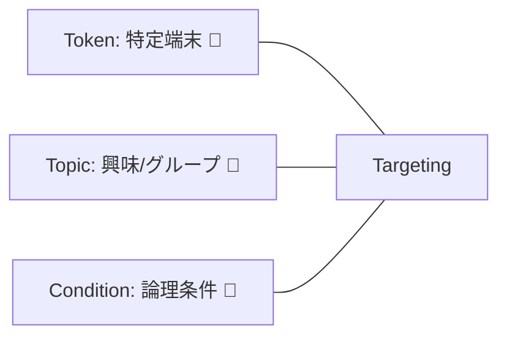

FCMのターゲット指定は基本これ👇

## A. 端末トークン（registration token）📱🎫

* **「この端末のこのアプリ」宛の住所ラベル**
* 1人がPC/スマホ両方使うなら、**ユーザー1人に複数トークン**が自然📱💻✨
* トークンは変わることがあるので、更新・掃除が後で効いてきます🧹🧯（第8章・第17章でガッツリ）

## B. トピック（topic）📣🗞️

* **「メーリングリスト」**みたいに、同じ興味の人へ一斉送信
* 送信は Admin SDK / HTTP v1 の両方でOK ([Firebase][3])
* Webのトピック購読には、運用面の注意（スロットル/制限）もあるので「多用しすぎない」設計が安全🧯([status.firebase.google.com][4])

## C. 条件（condition）🧠🔀

* 「AにもBにも興味ある人」みたいな **論理式で配る**やつ
* 例：`'news' in topics && ('sports' in topics || 'music' in topics)` みたいな感じ（雰囲気だけ覚えればOK）

---

## 4) IDの話（ここが混乱ポイント！）🧩🧾
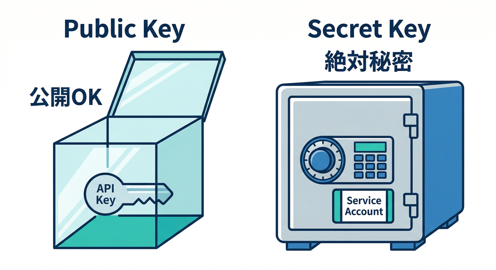

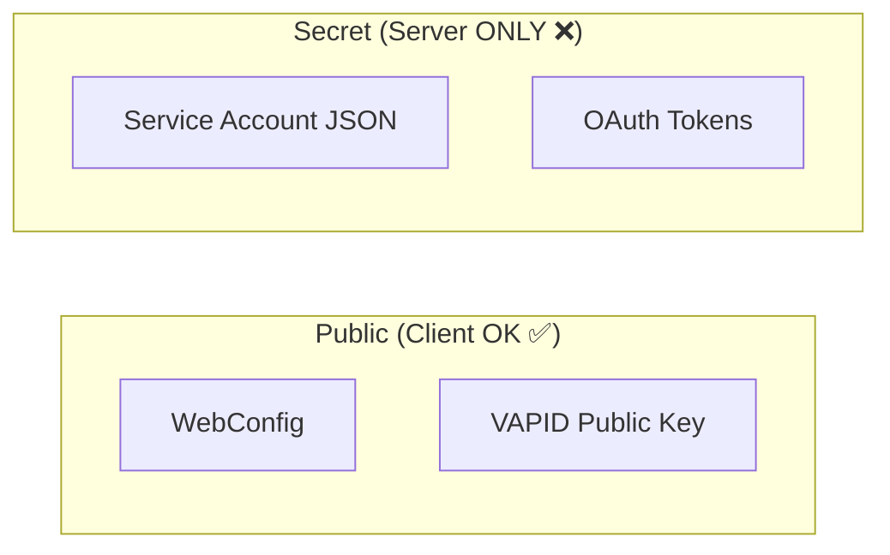

「どれが公開で、どれが秘密か」を整理すると勝ちです🏆✨

## ✅ 公開してOK（クライアントに入って当たり前）🌞

* **FirebaseのWeb設定（firebaseConfig）**：`apiKey` や `projectId` など

  * 名前が “apiKey” でも **秘密鍵ではない**（誤解しやすい😇）
* **VAPID公開鍵**（Web Push用）：クライアントが `getToken()` 等で使う側 ([Firebase][1])

## ❌ 絶対に出しちゃダメ（サーバー専用）🔥🔒

* **サービスアカウントJSON**（秘密のかたまり）
* **Admin SDKの秘密**（実質、強い権限を持つ）
* HTTP v1 API を叩くための **OAuthアクセストークン**（サーバー側で作る）([Firebase][5])

ここが第3章の最重要チェックです👇
👉 **「通知を送りたい気持ち」が先走って、クライアントに秘密を置かない** 😇🧯

---

## 5) メッセージの“送り方”2択（サーバー側）📤⚙️
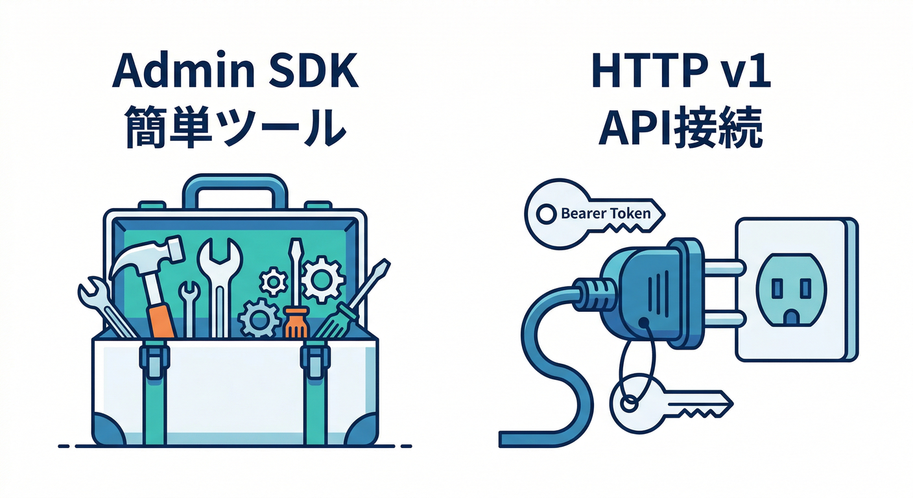

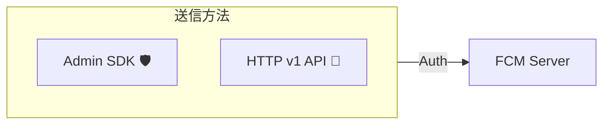

## ① Admin SDK（いちばん楽で安全寄り）🛡️

* トークン宛・複数トークン宛（マルチキャスト）・トピック宛などが揃ってる
* 例：**最大500トークン**へ同報、**最大500メッセージ**のまとめ送信などができる ([Firebase][2])

## ② FCM HTTP v1 API（仕組みを理解すると強い）🧠💪

* エンドポイントは `.../v1/projects/{projectId}/messages:send` の形
* 認証は **Bearer（OAuth）** で送る ([Firebase][5])

---

## 6) Web通知の“空気”も最新事情あり🌬️🔔

ブラウザ側は「許可の取り方」をミスるとブロック率が跳ねます🙅‍♂️➡️🙆‍♀️
**ユーザー操作（クリック等）に紐づけて許可を出す**のが王道です🧠 ([MDN Web Docs][6])

さらに最近の動きとして、**ChromeがPush APIのレート制限を段階展開**し始めています。
「通知を乱発するサイト」を抑える方向なので、**“うざくならない設計”はガチで重要**になってきます😇⛔ ([Chrome for Developers][7])

---

## 7) AIを絡めると、FCM設計が一段ラクになる🤖📝✨

ここからが“2026っぽい”ところ💡

## A. Firebase AI Logicで「短くて伝わる通知文」を作る📝➡️✨

* アプリからGemini/Imagenを呼ぶ導線として整理されていて、通知文生成と相性いいです🤖
* 例えば「コメント本文→通知用に短縮」「個人情報っぽい文字をマスク」みたいな下ごしらえができます🧤🫧 ([Firebase][8])

## B. Antigravity / Gemini CLIで「図・設計・チェック」を一気に作る🛸💻

* Antigravityは“エージェントが計画→実装→検証”まで回す思想の開発基盤として紹介されています🧠🛠️ ([Google Codelabs][9])
* Gemini CLIはターミナルから調査・修正・テスト生成などを支援する流れが公式に整理されています💻✨ ([Google Cloud Documentation][10])

**おすすめの使い方（プロンプト例）**👇
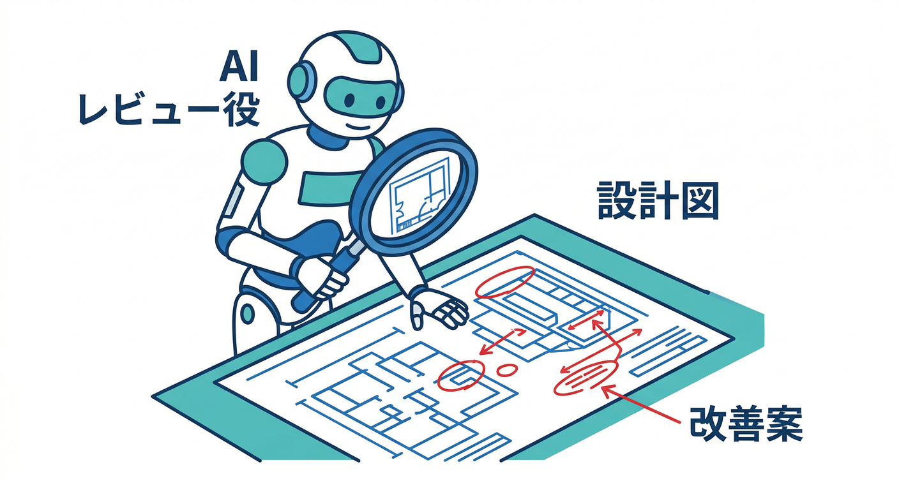

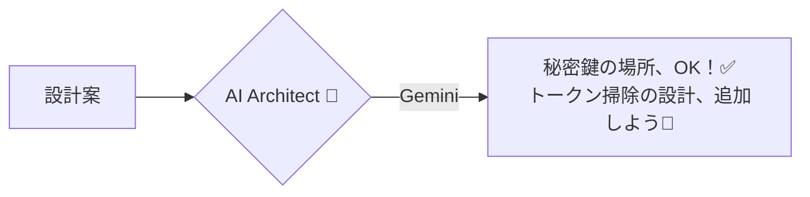
（そのまま貼ってOKの「指示文」になってます）

```text
あなたはFirebase/FCMの設計レビュー役です。
「Web(React) + FCM + Firestore + 送信サーバー」でコメント通知を作ります。

1) 送る側/受ける側/保存先/秘密情報 の役割分担を箇条書き
2) “クライアントに置いちゃダメ”な情報を列挙して危険度も付ける
3) 1枚図（Mermaid）で全体像を出す
4) トークン複数端末、無効トークン掃除、通知頻度抑制 の観点で改善案を3つ
```

---

## 手を動かす🖱️（10分）🧩✍️

## ステップ1：あなたのアプリの“登場人物”を埋める👥

下のテンプレを、自分の言葉で埋めてください（図じゃなく文字でもOK）👇

* 受ける側（React）がやること：
* Service Workerがやること：
* FCMがやってくれること：
* 送る側（サーバー）がやること：
* Firestoreに保存するもの（例：token）：

## ステップ2：“公開OK/秘密NG”を線引きする🔐✂️

次の2列を作って、単語を振り分けるだけでOK👇

* 公開してOK：`firebaseConfig / VAPID公開鍵 / projectId ...`
* 絶対NG：`サービスアカウントJSON / OAuthトークン / Admin権限 ...` ([Firebase][5])

---

## ミニ課題🎯（5分）📝➡️🔔

**「コメント → 誰に → 何を → どこから送る」** を1枚にします📄✨
テンプレはこれ👇（矢印だけでOK！）

```text
イベント：コメントが作成された
  ↓ どこで検知？
送信サーバー：＿＿＿＿＿＿＿＿＿＿
  ↓ 何を参照？
宛先：＿＿＿＿＿＿＿＿＿＿（token / topic / condition）
  ↓ payloadには何を入れる？
通知タイトル：＿＿＿＿＿＿＿＿＿＿
通知本文：＿＿＿＿＿＿＿＿＿＿
遷移URL/ID：＿＿＿＿＿＿＿＿＿＿
  ↓ どこに届く？
受信：フォア(React) / バック(SW) どっち？＿＿＿＿＿＿
```

---

## チェック✅（理解確認）🧠✨

1. **クライアントに秘密（サービスアカウント等）を置いてない？** 🔥
2. **トークン＝ユーザー1人に1個**って決め打ちしてない？（複数端末あるよね📱💻）
3. Webの通知で **Service Worker** と **VAPID** の位置づけ、説明できる？🧑‍🚒🔑 ([Firebase][1])
4. 最近のChrome事情（通知乱発へのレート制限）を踏まえて、**“送る価値”を設計に入れられてる？** 😇⛔ ([Chrome for Developers][7])

---

必要なら、この第3章の「1枚図（Mermaid）」をあなたの教材用に“完成版”としてこちらで作って貼れますよ🗺️✨（次の章でその図を実装へ落とすと、めちゃ気持ちよく進みます⚡）

[1]: https://firebase.google.com/docs/cloud-messaging/web/get-started?utm_source=chatgpt.com "Get started with Firebase Cloud Messaging in Web apps"
[2]: https://firebase.google.com/docs/cloud-messaging/send/admin-sdk?utm_source=chatgpt.com "Send a Message using Firebase Admin SDK"
[3]: https://firebase.google.com/docs/cloud-messaging/send-topic-messages?utm_source=chatgpt.com "Send Messages to Topics | Firebase Cloud Messaging - Google"
[4]: https://status.firebase.google.com/summary?utm_source=chatgpt.com "Incidents - Firebase Status Dashboard"
[5]: https://firebase.google.com/docs/cloud-messaging/send/v1-api?utm_source=chatgpt.com "Send a Message using FCM HTTP v1 API - Firebase - Google"
[6]: https://developer.mozilla.org/en-US/docs/Web/API/Notifications_API/Using_the_Notifications_API?utm_source=chatgpt.com "Using the Notifications API - MDN Web Docs"
[7]: https://developer.chrome.com/blog/web-push-rate-limits?utm_source=chatgpt.com "Increasing web push notification value with rate limits | Blog"
[8]: https://firebase.google.com/docs/ai-logic?utm_source=chatgpt.com "Gemini API using Firebase AI Logic - Google"
[9]: https://codelabs.developers.google.com/getting-started-google-antigravity?utm_source=chatgpt.com "Getting Started with Google Antigravity"
[10]: https://docs.cloud.google.com/gemini/docs/codeassist/gemini-cli?utm_source=chatgpt.com "Gemini CLI | Gemini for Google Cloud"
