# 第4章：React側の下準備（通知スイッチの置き場）🎛️⚛️

この章でやるのは「通知を受け取りたい/やめたい」をユーザーが自分で選べる **“設定UI”** を作ることです😊
ここでのポイントは1つだけ👇

* ✅ **スイッチ = アプリ内設定（自分の意思）**
* ✅ **ブラウザ許可 = OS/ブラウザの権限（仕組み）**
* ❌ この章では **まだ許可ダイアログは出さない**（次章でやる）
  許可は「ユーザー操作のタイミングで出す」が王道です📣([web.dev][1])

---

## 1) 読む：スイッチは「ON/OFF」じゃなく“状態マシン”っぽく考える🧠🧩
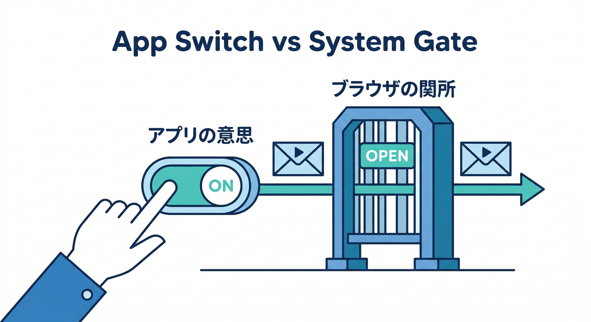

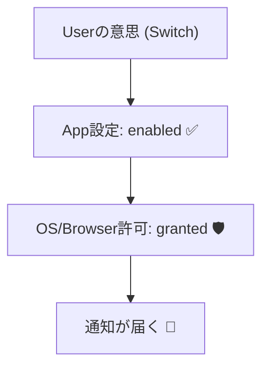

通知って、実は状態が3つあります👇（Webの通知許可の状態）

1. `default`（未選択）😶
2. `granted`（許可）🙆‍♀️
3. `denied`（拒否）🙅‍♂️

そして、あなたのアプリ側の意思（スイッチ）もあります👇

* `enabled: true/false`（受け取りたい/受け取りたくない）

つまり **「アプリ設定」×「ブラウザ許可」** の掛け算で、見せるUIが変わります🎛️✨
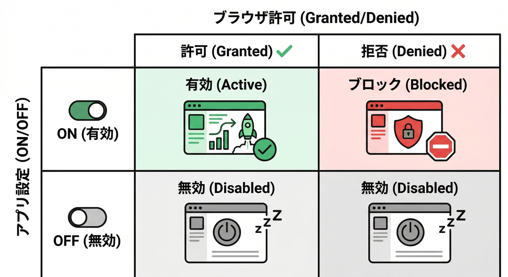

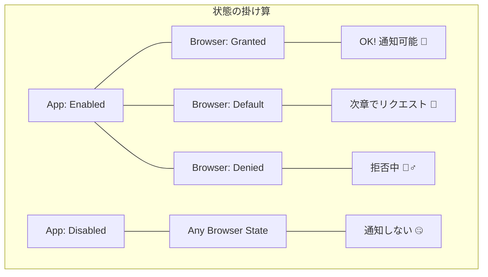
この分離ができると、次章で権限リクエストを足してもUIが崩れません👍

---

## 2) 手を動かす：設定画面に「通知ON/OFF」＋ 状態表示 を作る🛠️⚛️

ここではまず、Reactに **通知設定パネル** を作って、

* スイッチの状態を `localStorage` に保存（簡単でOK）🧺
* `Notification.permission` を読んで「いま許可されてる？」を表示👀
* スイッチONのときだけ「テスト通知」ボタンを出す🎯

までやります。

---

## 2-1. まずは設定の保存・読み込み（localStorage）🧺
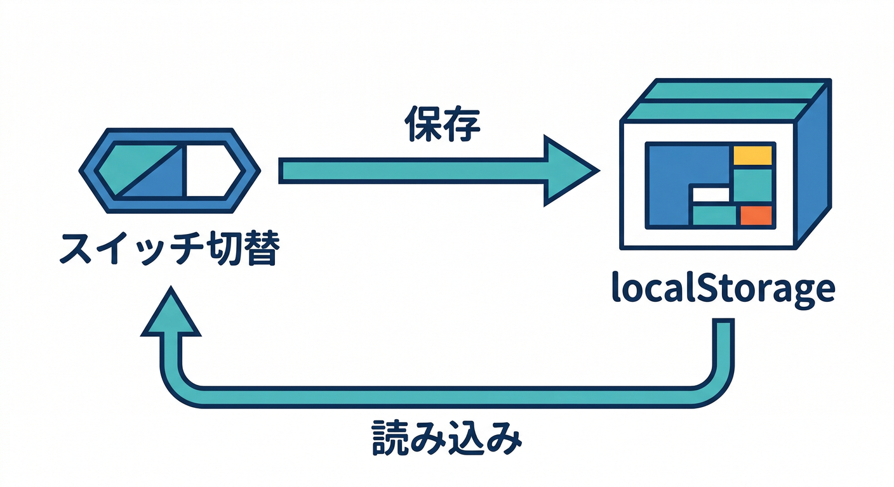

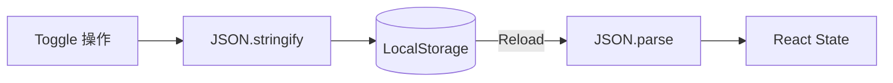

```tsx
// src/features/notifications/prefs.ts
export type AppNotificationPrefs = {
  enabled: boolean;   // アプリ内の意思（ON/OFF）
  updatedAt: number;  // いつ変えたか（デバッグに便利）
};

const KEY = "notif:prefs:v1";

export function loadPrefs(): AppNotificationPrefs {
  try {
    const raw = localStorage.getItem(KEY);
    if (!raw) return { enabled: false, updatedAt: Date.now() };
    const parsed = JSON.parse(raw) as Partial<AppNotificationPrefs>;
    return {
      enabled: Boolean(parsed.enabled),
      updatedAt: Number(parsed.updatedAt ?? Date.now()),
    };
  } catch {
    return { enabled: false, updatedAt: Date.now() };
  }
}

export function savePrefs(p: AppNotificationPrefs) {
  localStorage.setItem(KEY, JSON.stringify(p));
}

export function getBrowserPermission():
  | NotificationPermission
  | "unsupported" {
  if (!("Notification" in window)) return "unsupported";
  return Notification.permission; // 'default' | 'granted' | 'denied'
}
```

---

## 2-2. “それっぽい”スイッチコンポーネント（アクセシブル寄り）🧷✨
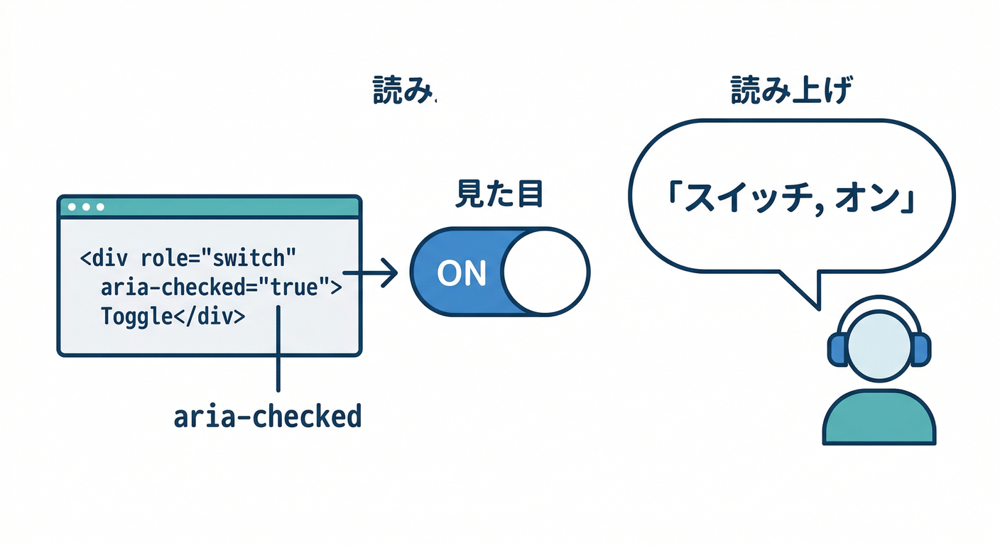

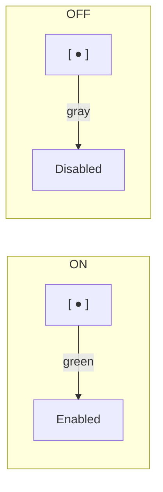

```tsx
// src/features/notifications/Switch.tsx
type Props = {
  label: string;
  description?: string;
  checked: boolean;
  onChange: (v: boolean) => void;
  disabled?: boolean;
};

export function Switch({
  label,
  description,
  checked,
  onChange,
  disabled,
}: Props) {
  return (
    <div className="flex items-start justify-between gap-3">
      <div className="min-w-0">
        <div className="font-medium">{label}</div>
        {description && (
          <div className="text-sm text-gray-600">{description}</div>
        )}
      </div>

      <button
        type="button"
        role="switch"
        aria-checked={checked}
        disabled={disabled}
        onClick={() => onChange(!checked)}
        className={[
          "relative h-8 w-14 rounded-full transition",
          disabled ? "opacity-50 cursor-not-allowed" : "cursor-pointer",
          checked ? "bg-green-600" : "bg-gray-300",
        ].join(" ")}
      >
        <span
          className={[
            "absolute top-1 h-6 w-6 rounded-full bg-white transition",
            checked ? "left-7" : "left-1",
          ].join(" ")}
        />
      </button>
    </div>
  );
}
```

---

## 2-3. 設定画面本体：スイッチ＋状態表示＋テストボタン🎛️🔔
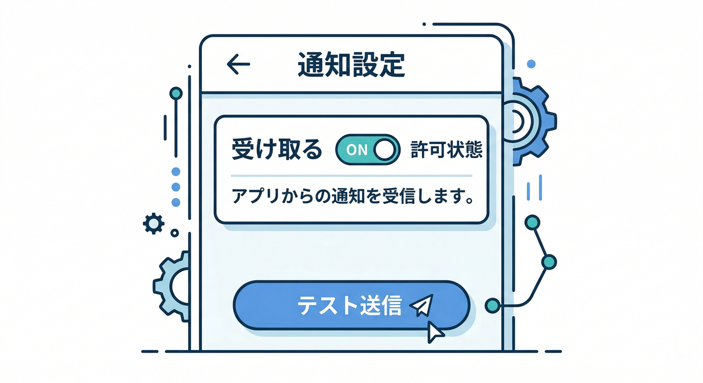

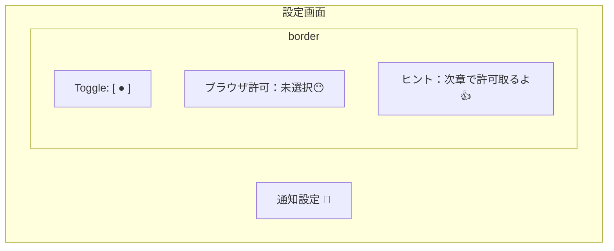

```tsx
// src/features/notifications/NotificationSettings.tsx
import { useEffect, useMemo, useState } from "react";
import { getBrowserPermission, loadPrefs, savePrefs } from "./prefs";
import { Switch } from "./Switch";

function permissionLabel(p: ReturnType<typeof getBrowserPermission>) {
  if (p === "unsupported") return "このブラウザは通知に未対応🥲";
  if (p === "granted") return "許可済み🙆‍♀️";
  if (p === "denied") return "拒否中🙅‍♂️（ブラウザ設定で変更）";
  return "未選択😶（次章で許可を取る）";
}

export function NotificationSettings() {
  const [prefs, setPrefs] = useState(loadPrefs());

  // 毎回読む：次章で requestPermission したあと即反映したいから👀
  const permission = getBrowserPermission();

  useEffect(() => {
    savePrefs(prefs);
  }, [prefs]);

  const appEnabled = prefs.enabled;

  const canTest =
    appEnabled && permission === "granted";

  const hint = useMemo(() => {
    if (permission === "unsupported") return "別ブラウザ/別端末だといけるかも…！🧭";
    if (!appEnabled) return "OFFなら一切通知しない。安心😌";
    if (permission === "denied") return "拒否中はアプリ側ONでも通知できないよ💦";
    if (permission === "default") return "次章で“押した時だけ”許可を出すよ👍";
    return "OK！通知できる状態🎉";
  }, [appEnabled, permission]);

  const onToggle = (v: boolean) => {
    setPrefs({ enabled: v, updatedAt: Date.now() });
  };

  const onTest = async () => {
    // ここでは「FCM」じゃなく「ローカル通知」で雰囲気チェックだけ✨
    // Push(FCM) の受信は Service Worker などが絡むので後半でやるよ🧑‍🚒
    if (!("Notification" in window)) {
      alert("このブラウザは通知未対応でした🥲");
      return;
    }
    if (Notification.permission !== "granted") {
      alert("まず次章で通知の許可を取ろう！🙆‍♀️🔔");
      return;
    }
    new Notification("テスト通知だよ🔔", {
      body: "スイッチON/OFFのUIはOK！次はFCMにつなぐぞ〜🚀",
    });
  };

  return (
    <div className="max-w-xl space-y-4">
      <h1 className="text-xl font-bold">通知設定🔔</h1>

      <div className="rounded-xl border p-4 space-y-3">
        <Switch
          label="通知を受け取る"
          description="まずはアプリ内の意思。許可ダイアログは次章で出すよ🧩"
          checked={appEnabled}
          onChange={onToggle}
          disabled={permission === "unsupported"}
        />

        <div className="text-sm">
          <div>
            ブラウザ許可：<span className="font-medium">{permissionLabel(permission)}</span>
          </div>
          <div className="text-gray-600 mt-1">{hint}</div>
        </div>
      </div>

      {appEnabled && (
        <div className="rounded-xl border p-4 space-y-3">
          <div className="font-medium">テスト通知🎯</div>

          <button
            type="button"
            onClick={onTest}
            className={[
              "px-4 py-2 rounded-lg border",
              canTest ? "hover:bg-gray-50" : "opacity-60 cursor-not-allowed",
            ].join(" ")}
            disabled={!canTest}
          >
            テスト通知を鳴らす🔔
          </button>

          {!canTest && (
            <div className="text-sm text-gray-600">
              ※ まだ許可がないので押せません。次章で許可を取ったら解放されます🔓✨
            </div>
          )}
        </div>
      )}
    </div>
  );
}
```

> 💡「許可ダイアログは“いきなり出さない”」が大事！
> 押した時だけ出すとブロック率が下がりやすいです🙌([web.dev][1])

---

## 3) 次章以降につながる「差し込み口」だけ先に作っておく🧩🔌
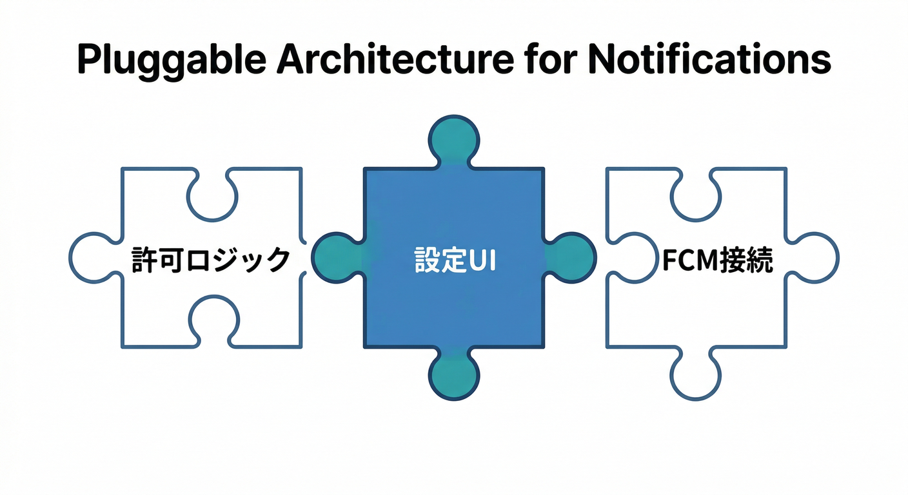

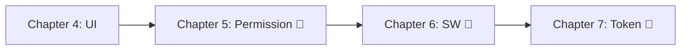

この章のUIは、次のパーツをあとから刺せる形にしてあります👇

* 第5章：スイッチONのタイミングで **許可リクエスト**（ユーザー操作で）📣([web.dev][1])
* 第6章：Web Pushの要、**Service Worker** へ🧑‍🚒
* 第7章：FCMトークン取得 → Firestore保存（端末の宛先）📮
  ※WebではVAPIDキーなどの設定も絡みます🔑([Firebase][2])

---

## 4) AIで「通知スイッチ周りの文言」を強くする🤖📝✨

## 4-1. Gemini CLIで “説明文” を量産して選ぶ💻✨

Gemini CLIはターミナルから調査や文言作りを手伝える設計が公式に整理されています💡([Google Cloud Documentation][3])
さらに Google の Antigravity は「エージェントが計画→実装→検証」まで回す思想の開発基盤として紹介されています🛸([Google Codelabs][4])

例（文言案づくり）👇

```bat
gemini --model gemini-3-flash-preview --prompt "通知設定画面の説明文を、やさしい口調で3案。『いきなり許可を出さない理由』も一言入れて。"
```

## 4-2. Firebase AI Logicで “アプリ内” から文言生成（後でA/Bもしやすい）🧠📲
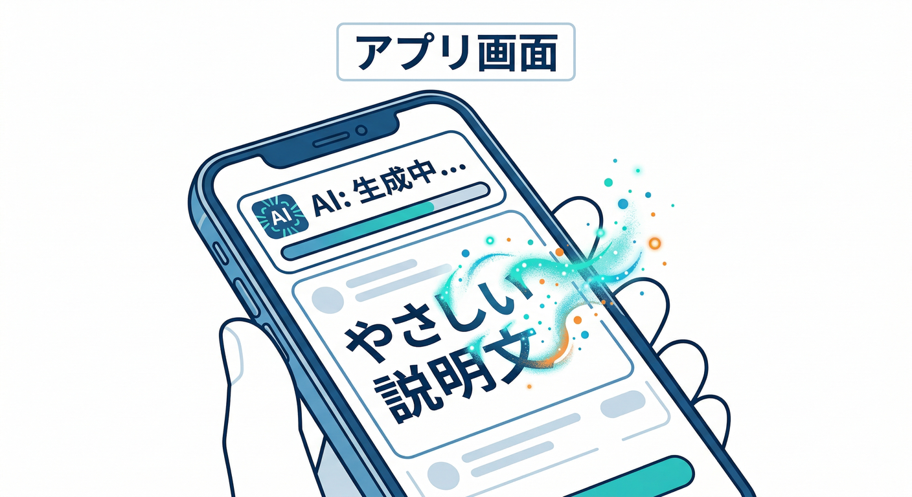

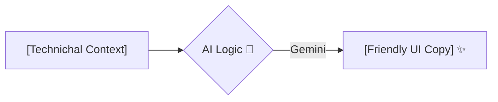

Firebase AI Logic は Web SDK で `firebase/ai` から使えて、`generateContent` でテキスト生成できます🤖([Firebase][5])
また、公式ガイドに **モデル更新の注意**（例：Gemini 2.0 Flash / Flash-Lite は 2026-03-31 で退役予定）も明記されています📌([Firebase][5])

```ts
import { getAI, getGenerativeModel, GoogleAIBackend } from "firebase/ai";

// 例：説明文をAIに作らせる（ざっくり）
const ai = getAI(firebaseApp, { backend: new GoogleAIBackend() });
const model = getGenerativeModel(ai, { model: "gemini-2.5-flash" });

const result = await model.generateContent(
  "通知設定の説明文を、短く、やさしく、絵文字入りで1案"
);
const text = result.response.text();
```

---

## 5) ミニ課題🎯：ONの時だけ「テスト通知」ボタンが出るUIにする✨

やることはもう実装済みの形ですが、追加でレベルアップ👇

* ✅ ONのとき、ボタンが表示される
* ✅ さらに「許可がある時だけ押せる」
* ✅ ヒント文で「次章で許可取るよ」が伝わる

---

## 6) チェック✅（3つ答えられたら勝ち！）

1. 「アプリ内スイッチ」と「ブラウザ許可」を分けて考えられる？🎛️
2. 許可ダイアログを “勝手に出さない” 理由を言える？🙅‍♂️➡️🙆‍♀️([web.dev][1])
3. ONでも `denied` なら通知できない…をUIで説明できてる？🧯

---

次の第5章では、ここで作ったスイッチに **“押した時だけ許可を出す”** を合体させて、いよいよ通知の入口を開けます🔓🔔

[1]: https://web.dev/articles/permissions-best-practices?utm_source=chatgpt.com "Web permissions best practices | Articles"
[2]: https://firebase.google.com/docs/cloud-messaging/web/get-started?utm_source=chatgpt.com "Get started with Firebase Cloud Messaging in Web apps"
[3]: https://docs.cloud.google.com/gemini/docs/codeassist/gemini-cli?utm_source=chatgpt.com "Gemini CLI | Gemini for Google Cloud"
[4]: https://codelabs.developers.google.com/getting-started-google-antigravity?utm_source=chatgpt.com "Getting Started with Google Antigravity"
[5]: https://firebase.google.com/docs/ai-logic/get-started "Get started with the Gemini API using the Firebase AI Logic SDKs  |  Firebase AI Logic"
