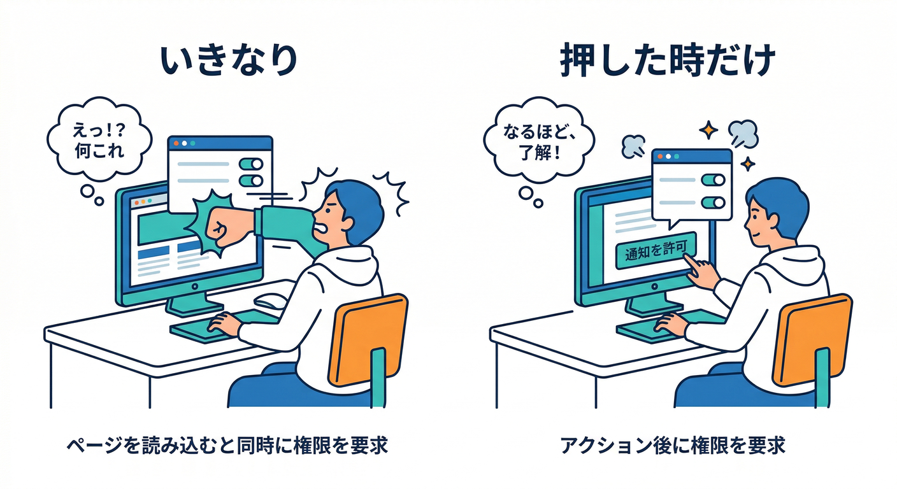
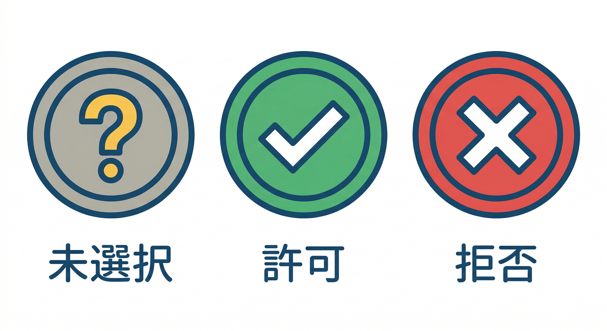
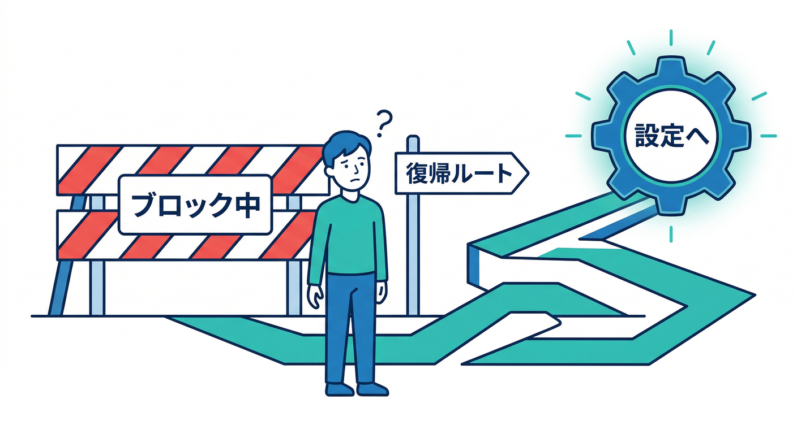
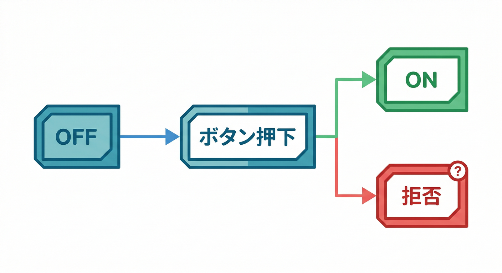
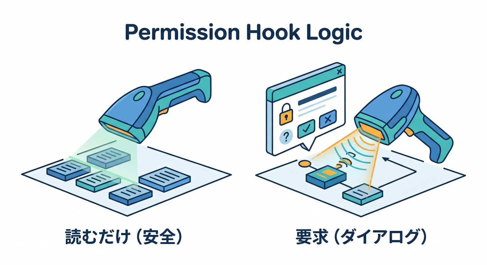
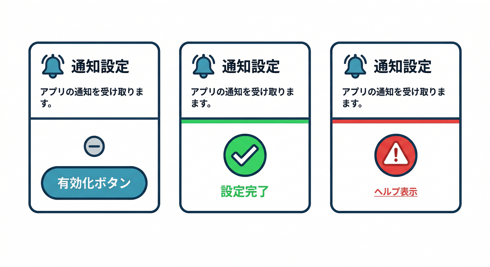
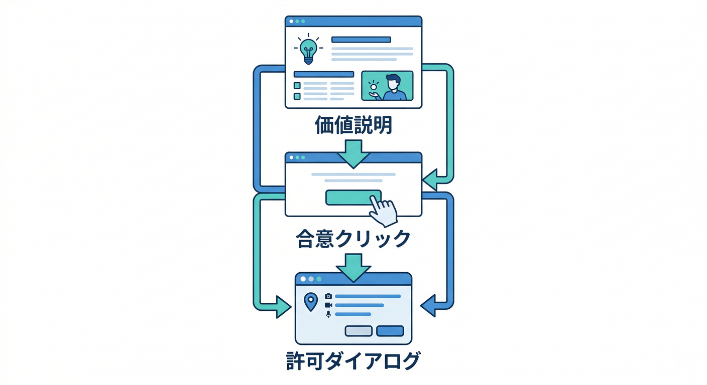

# 第5章：権限リクエストのUX（押した時だけ出す）🙆‍♀️🔔

この章のゴールはこれ👇

* ユーザーが**自分の意思で押した瞬間だけ**、ブラウザの許可ダイアログが出る✨
* **拒否された後**も「戻ってこれる導線」を用意できる🧯
* 「いきなり許可ください🙏」をやめて、**ブロック率を下げる**💪
  （ブラウザ的にも推奨されるやり方です）([Chrome for Developers][1])

---

## 読む📖：なぜ「押した時だけ」が最強なの？😇

## 1) “ページ開いた瞬間に許可”は嫌われやすい🙅‍♂️


* ブラウザのベストプラクティスとしても「**ユーザーが欲しいと思ったタイミングで**」が推奨です🧠([web.dev][2])
* Web Push の流れとしても「ユーザーの**クリック等の操作（ジェスチャー）**で許可を取る」が基本です🖱️([web.dev][3])

## 2) 許可状態は3つだけ（まずこれ覚える）🧩


* `default`：まだ決めてない（未選択）
* `granted`：許可✅
* `denied`：拒否（ブロック）⛔
  この判定は `Notification.permission` で見られます📌([MDN Web Docs][4])

## 3) 「拒否された時の復帰導線」があるだけで優しい🥹


拒否って、**悪意**じゃなくて「よく分からないから怖い」だけのことが多いです😅
だから、拒否後にこうする👇

* “通知が必要になったら、設定からいつでもONにできます”
* “やり方はこちら” みたいな案内（アプリ内ヘルプ）
  これも推奨パターンとして整理されています🧯([web.dev][2])

---

## 手を動かす🖱️：Reactで「押した時だけ許可」を実装しよう⚛️🔔

ここでは **設定画面に「通知を有効化」ボタン**を置き、押したら `Notification.requestPermission()` を呼びます。
※ `requestPermission()` はユーザー操作中に呼ぶのが推奨です🖱️([MDN Web Docs][4])

---

## 0) UIの状態設計（いちばん大事）🎛️


通知スイッチは、こういう状態遷移にすると迷子になりにくいです🧭

* **OFF（default）** →（説明を読んで）→ **有効化ボタン押す**
* → ブラウザ許可ダイアログ

  * `granted` → **ON状態**✅
  * `denied` → **拒否状態**⛔（復帰導線を表示）

---

## 1) まず「許可状態」を読むフックを作る🪝


```tsx
import { useCallback, useEffect, useMemo, useState } from "react";

type NotifPermission = NotificationPermission | "unsupported";

export function useNotificationPermission() {
  const [permission, setPermission] = useState<NotifPermission>("unsupported");

  const isSupported = useMemo(() => {
    return typeof window !== "undefined" && "Notification" in window;
  }, []);

  const refresh = useCallback(() => {
    if (!isSupported) {
      setPermission("unsupported");
      return;
    }
    setPermission(Notification.permission); // "default" | "granted" | "denied"
  }, [isSupported]);

  const request = useCallback(async () => {
    if (!isSupported) return "unsupported" as const;

    // ✅ ユーザー操作（クリック等）の中で呼ぶ
    const result = await Notification.requestPermission();
    setPermission(result);
    return result;
  }, [isSupported]);

  useEffect(() => {
    refresh(); // 読むだけならOK（許可ダイアログは出ない）
  }, [refresh]);

  return { permission, isSupported, refresh, request };
}
```

ポイント👇

* `Notification.permission` を読むだけではダイアログは出ません（安全）
* ダイアログが出るのは `requestPermission()` のときだけ🔔([MDN Web Docs][5])

---

## 2) 設定画面に「有効化ボタン」を置く（ここが第5章の主役）🥇


```tsx
import React, { useMemo, useState } from "react";
import { useNotificationPermission } from "./useNotificationPermission";

export function NotificationSettingsCard() {
  const { permission, isSupported, request } = useNotificationPermission();
  const [busy, setBusy] = useState(false);

  const label = useMemo(() => {
    if (!isSupported) return "このブラウザでは通知が使えません";
    if (permission === "granted") return "通知は有効です ✅";
    if (permission === "denied") return "通知がブロックされています ⛔";
    return "通知はまだOFFです";
  }, [permission, isSupported]);

  const canAsk = isSupported && permission === "default";
  const isGranted = permission === "granted";
  const isDenied = permission === "denied";

  const onEnableClick = async () => {
    setBusy(true);
    try {
      const result = await request();
      // result は "granted" | "denied" | "default" | "unsupported"
      // ここでは「許可の結果に応じてUIを変える」だけでOK
    } finally {
      setBusy(false);
    }
  };

  return (
    <div style={{ border: "1px solid #ddd", borderRadius: 12, padding: 16 }}>
      <h3 style={{ marginTop: 0 }}>通知設定 🔔</h3>
      <p style={{ margin: "8px 0" }}>{label}</p>

      {!isSupported && (
        <p style={{ margin: "8px 0" }}>
          💡 ヒント：別のブラウザや端末で試してみてね
        </p>
      )}

      {canAsk && (
        <>
          <p style={{ margin: "8px 0" }}>
            📣 コメントが付いたら知らせます。見逃し防止に便利だよ！
          </p>
          <button onClick={onEnableClick} disabled={busy}>
            {busy ? "許可を確認中..." : "通知を有効化する 🙆‍♀️"}
          </button>
        </>
      )}

      {isGranted && (
        <p style={{ margin: "8px 0" }}>
          🎉 OK！次の章で「トークン取得 → Firestore保存」に進もう！
        </p>
      )}

      {isDenied && (
        <DeniedHelp />
      )}
    </div>
  );
}

function DeniedHelp() {
  return (
    <div style={{ marginTop: 12, padding: 12, background: "#fafafa", borderRadius: 10 }}>
      <p style={{ margin: 0 }}>
        ⛔ ブロック中みたい…でも大丈夫！<br />
        🔧 ブラウザの「サイト設定」から通知を許可に戻せます。<br />
        📌 いまは困らないなら、必要になったタイミングで戻してOKだよ🙂
      </p>
    </div>
  );
}
```

ここでやってることは超シンプル👇

* **許可が未決定（default）のときだけ**「通知を有効化」ボタンを見せる
* 押したら `requestPermission()` を呼ぶ（＝押した時だけ出る）
* `denied` になったら **復帰導線**を出す🧯

「ページロード時に許可ダイアログ」は避けようね、というのが推奨です🚫([Chrome for Developers][1])

---

## 3) もう一段うまくする：先に“価値説明”を挟む（ブロック減る）📣➡️🙆‍♀️

最強パターンはこれ👇


1. まずアプリ内で「通知ONにすると何が得？」を説明（ミニポップアップでもOK）
2. “いいね、ONにする” を押したら
3. **ブラウザ許可ダイアログ**

この流れが「ユーザーの納得→許可」になりやすいです🧠([web.dev][2])

---

## ミニ課題🎯：拒否された時の“次の一手”メッセージを作ろう🧯

次の3パターンを用意して、アプリに入れてみてください✍️

1. **軽い版**🙂

* 「必要になったら、いつでもここからONにできます」

2. **手順付き版**🧭

* 「ブラウザの🔒（鍵）→ サイトの設定 → 通知 を“許可”に」

3. **安心させる版**🫶

* 「通知は“コメントが付いた時だけ”送ります。広告みたいなのは送りません」
  （※ここで“送る内容の約束”は、後の章の設計にも効いてきます✨）

## Geminiで文言づくりを爆速にする💻✨

* Gemini CLI に「丁寧・短い・不安を煽らない」条件で文言案を複数出させる
* その中から“人間が選ぶ”のが安全で速いです👍
  （許可率に関わる場所なので、テキトーに1案で決めないのがコツ）([web.dev][2])

---

## チェック✅：この章をクリアした判定🎉

* [ ] ページを開いただけでは、許可ダイアログが出ない😌（＝勝ち）
* [ ] 「通知を有効化する」ボタンを押した時だけ出る🔔([MDN Web Docs][4])
* [ ] `default / granted / denied` でUIが分岐できてる🧩([MDN Web Docs][5])
* [ ] `denied` のときに、復帰導線（やり方 or ヘルプ）が出せてる🧯([web.dev][2])

---

## 次章へのつなぎ🔜（ちょい予告）🧑‍🚒🧩

許可が取れたら、次に必要なのは **Service Worker と FCMトークン** です。
Web Push はここが心臓部なので、第6章でしっかり味方にします🔥
（FCM Webは VAPID キーなど「Web Push 設定」も絡みます）([firebase.google.com][6])

[1]: https://developer.chrome.com/docs/lighthouse/best-practices/notification-on-start?utm_source=chatgpt.com "Requests the notification permission on page load | Lighthouse"
[2]: https://web.dev/articles/permissions-best-practices?utm_source=chatgpt.com "Web permissions best practices | Articles"
[3]: https://web.dev/articles/push-notifications-overview?utm_source=chatgpt.com "Push notifications overview | Articles"
[4]: https://developer.mozilla.org/en-US/docs/Web/API/Notifications_API?utm_source=chatgpt.com "Notifications API - MDN Web Docs - Mozilla"
[5]: https://developer.mozilla.org/en-US/docs/Web/API/Notification/requestPermission_static?utm_source=chatgpt.com "Notification: requestPermission() static method - Web APIs"
[6]: https://firebase.google.com/docs/cloud-messaging/web/get-started?utm_source=chatgpt.com "Get started with Firebase Cloud Messaging in Web apps"
