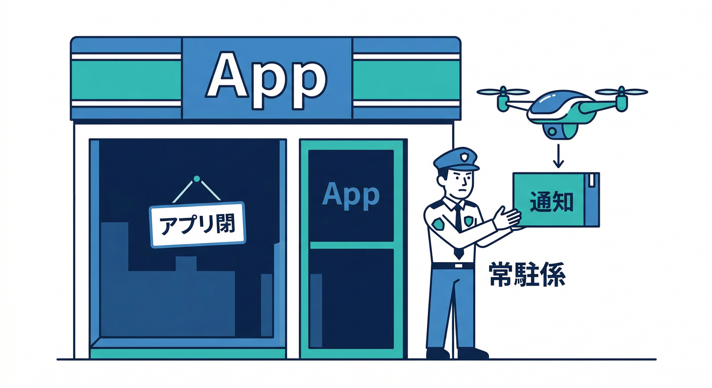
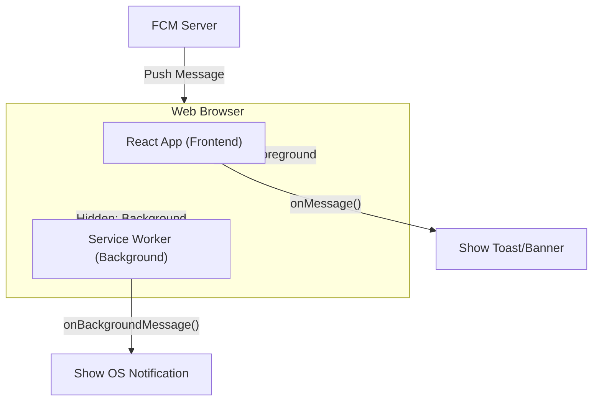
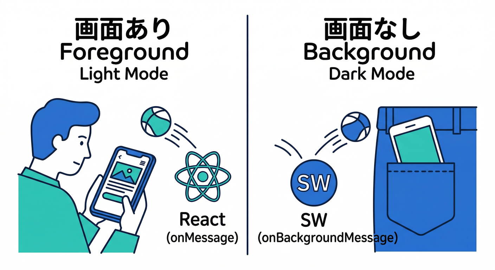
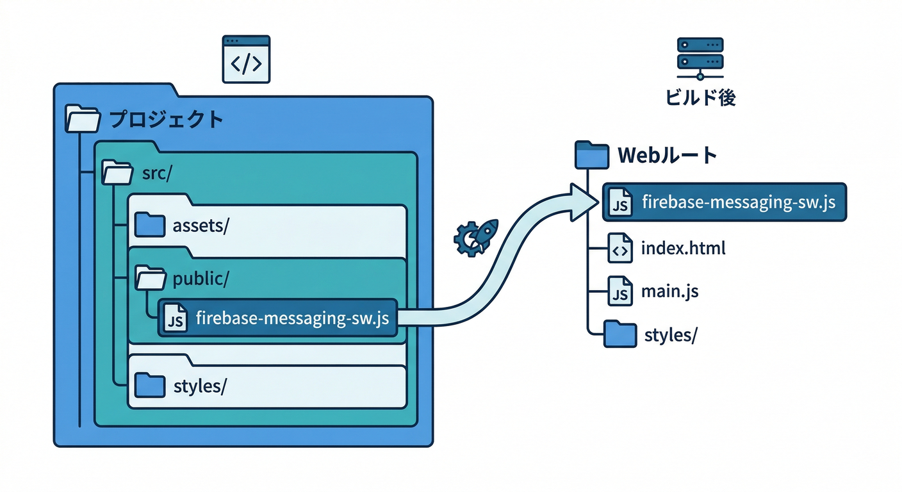
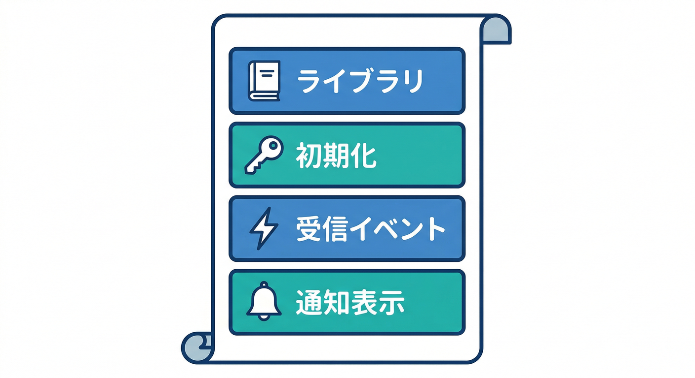
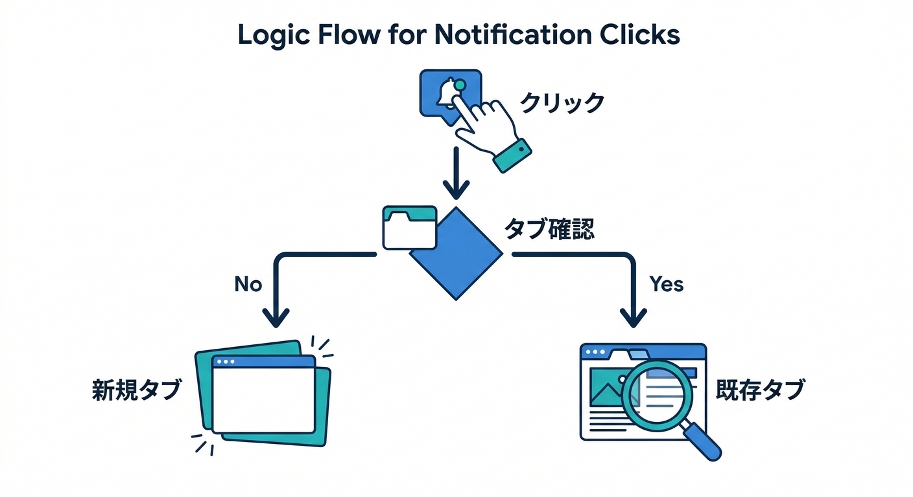
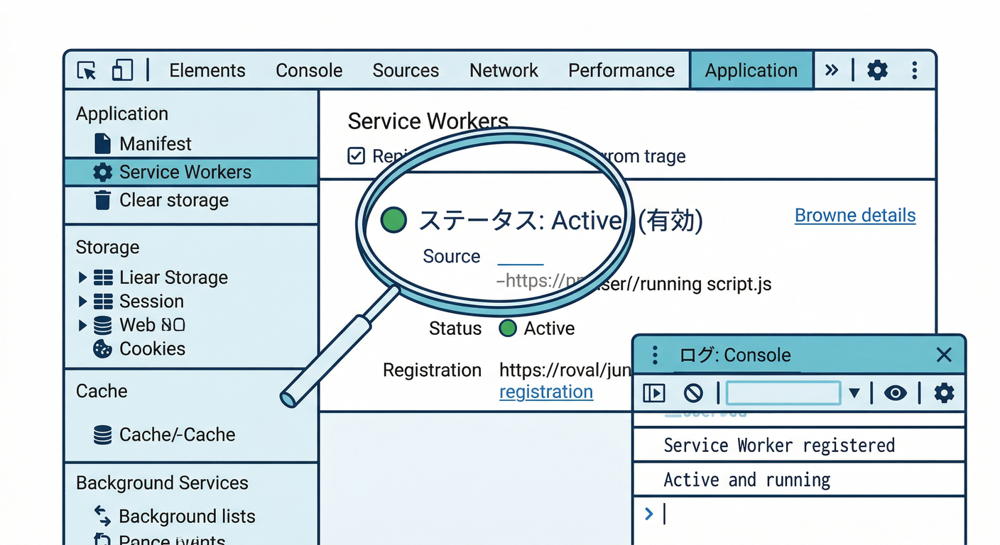
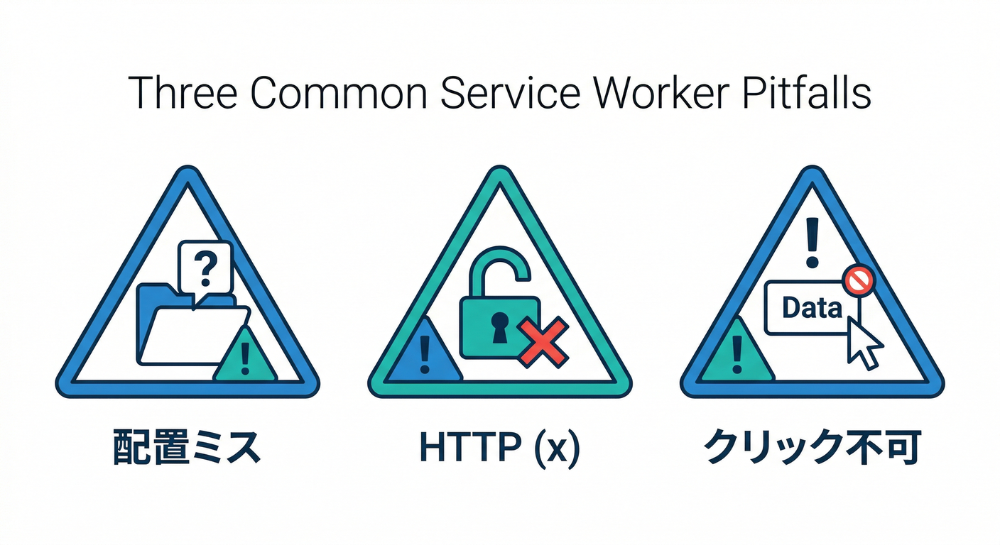

# 第6章：Web Pushの要！Service Workerを“味方”にする🧑‍🚒🧩

この章はひとことで言うと、「**アプリが開いてない時（バックグラウンド）でも通知を受け取って表示できるようにする**」回です🔔✨
その主役が **Service Worker（SW）** です。

---

## できるようになること🎯

* Service Worker が **何を担当してるか** が分かる🧠
* `firebase-messaging-sw.js` を正しい場所に置ける📁
* バックグラウンド受信で **ログが出てる証拠** を取れる👀
* 通知のクリックで **狙ったページへ飛ばす** 入口が作れる👉

---

## 読む📖：Service Workerって何者？（超ざっくり）

## SWは「裏方の常駐係」🕵️‍♂️





ブラウザで Push 通知を扱うには、Push API + Service Worker が基本セットです。
Firebaseの Web 通知（FCM）も同じで、**HTTPS配信**が前提になります🔐（Service Worker 自体が HTTPS 前提の仕組み）([Firebase][1])

## フォアグラウンドとバックグラウンドの分担💡



* **フォアグラウンド**（ページ見てる最中）→ React 側で受け取れる（`onMessage`）📲
* **バックグラウンド**（タブ閉じた/別タブ/最小化）→ **SW が受け取って通知表示**する🔔

`onMessage` をちゃんと受けたい場合でも、`firebase-messaging-sw.js` を用意する流れが公式で案内されています([Firebase][2])

---

## 手を動かす🖱️：SWを作って「動いてる証拠」を取ろう👣

## 1) `firebase-messaging-sw.js` を “Webルート” に置く📌



FCM Web は **`firebase-messaging-sw.js` が必要**で、トークン取得前に「ドメイン直下（ルート）」に置く説明になっています([Firebase][1])

React（Vite想定）だとだいたいこう👇

* `public/firebase-messaging-sw.js` ✅（ビルド後にドメイン直下へコピーされる）

---

## 2) まずは最小の Service Worker を書く🧩（ログ＆通知表示）



> ポイント：SW でモジュラーSDK（ESM）を使うにはバンドルが必要になりがちなので、最初は **compat（importScripts方式）** がラクです🧠
> 公式も「SWでモジュラーSDKを使うならバンドルが必要」という注意を書いてます([Firebase][2])

`public/firebase-messaging-sw.js` にこれ👇（まず動かす版）

```js
/* firebase-messaging-sw.js */

// ✅ ここは「自分の firebase のバージョン」に合わせてOK（例の数字は公式サンプルの一例）
importScripts('https://www.gstatic.com/firebasejs/10.13.2/firebase-app-compat.js');
importScripts('https://www.gstatic.com/firebasejs/10.13.2/firebase-messaging-compat.js');

// ✅ あなたの Firebase config（React側と同じやつ）
firebase.initializeApp({
  apiKey: "YOUR_API_KEY",
  authDomain: "YOUR_PROJECT.firebaseapp.com",
  projectId: "YOUR_PROJECT_ID",
  messagingSenderId: "YOUR_SENDER_ID",
  appId: "YOUR_APP_ID",
});

const messaging = firebase.messaging();

// 🧑‍🚒 バックグラウンドで届いたときに呼ばれる（新API）
messaging.onBackgroundMessage((payload) => {
  console.log("[firebase-messaging-sw.js] bg payload:", payload);

  // notification でも data でも雑に落ちない取り出し方✨
  const title = payload?.notification?.title ?? "お知らせ";
  const body = payload?.notification?.body ?? payload?.data?.body ?? "";
  const link = payload?.fcmOptions?.link ?? payload?.data?.link ?? "/";

  // 🔔 自分で通知を出す（カスタムできる）
  self.registration.showNotification(title, {
    body,
    data: { link }, // クリックで使う
    // icon: "/icons/icon-192.png",
  });
});

// 👉 通知クリックでページへ（深い導線の入口）
self.addEventListener("notificationclick", (event) => {
  event.notification.close();
  const link = event.notification?.data?.link || "/";

  event.waitUntil((async () => {
    const clientList = await clients.matchAll({ type: "window", includeUncontrolled: true });

    // すでに開いてるタブがあれば、それを前面に（+ 遷移）
    for (const client of clientList) {
      if ("focus" in client) {
        await client.focus();
        if ("navigate" in client) await client.navigate(link);
        return;
      }
    }

    // なければ新しいタブ
    if (clients.openWindow) await clients.openWindow(link);
  })());
});
```

✅ これで「バックグラウンド受信 → ログ → 通知表示 → クリックで遷移」の骨格ができます🔥


`onBackgroundMessage` を使うのが今の推奨ルートです([Firebase][2])

---

## 3) React 側：`getToken()` のときに SW を “指定” できる（任意）🧷

基本は `firebase-messaging-sw.js` がルートにあれば動きますが、`getToken` は **`vapidKey` と `serviceWorkerRegistration` をオプションで受け取れる**ので、挙動が怪しいときは「明示指定」が強いです💪([Firebase][3])

```ts
import { getMessaging, getToken } from "firebase/messaging";

export async function getFcmToken() {
  const messaging = getMessaging();

  const swReg = await navigator.serviceWorker.register("/firebase-messaging-sw.js");

  const token = await getToken(messaging, {
    vapidKey: import.meta.env.VITE_FCM_VAPID_KEY,
    serviceWorkerRegistration: swReg,
  });

  return token;
}
```

※ VAPIDキーはコンソールで作成して使います（Cloud Messaging → Web Push certificates）([Firebase][1])

---

## 4) 動作確認：まず “証拠” を取りに行く👀🧾

## ✅ SW が入ったか確認（WindowsのChrome/Edge）



1. DevTools → **Application** → **Service Workers**
2. `firebase-messaging-sw.js` が見える
3. “Inspect” で SW のコンソールが開く（ここに `console.log` が出る）✨

## ✅ テスト通知を投げる

FCMの「バックグラウンド受信」は、公式も「バックグラウンドで受け取ったメッセージは通知表示がトリガーになる」流れで説明しています([Firebase][4])
トークンが取れているなら、Firebase コンソールのテスト送信でOKです([Firebase][1])

---

## よくある罠🧯（ハマりポイントだけ先に潰す）



## 罠1：`firebase-messaging-sw.js` がルートにいない📁💥

→ ルートに置く説明が明確にあります（トークン取得前に必要）([Firebase][1])
Viteなら `public/` が正解になりやすいです👍

## 罠2：HTTPで試してる🔓

→ FCM Web は HTTPS 前提です([Firebase][1])

## 罠3：クリックで飛ばない（or 変な場所へ）🌀

* `fcm_options.link` を使うと通知クリックでページを開ける説明があります（ただし **HTTPS URLのみ**）([Firebase][4])
* **dataメッセージは `fcm_options.link` が効かない**ので、SW 側で `notificationclick` を書いて制御するのが安定です([Firebase][4])

---

## ミニ課題🎯：SWが動いてる“証拠写真”を完成させよう📸✨

1. バックグラウンド受信した時に、通知タイトルに「✅BG受信」って付ける
2. payload の `data.link` に `/comments/xxx` を入れて、クリックでそこに飛ばす
3. SWコンソールに payload 全体が出てるスクショ（証拠）を残す👀

---

## チェック✅（3つだけ）

* SW のコンソールに `bg payload` が出た？👀
* 通知が出た？（タイトル/本文が想定通り？）🔔
* クリックで狙ったページに飛んだ？👉

---

## AI活用（Antigravity / Gemini CLI）🤖🛸 ここが効く！

* Googleの Antigravity は「エージェントが計画→実装→調査」まで回す思想が説明されています🛸([Google Codelabs][5])
* Gemini CLI はターミナルから調査・デバッグまで支援する前提で整理されています💻✨([Google Cloud Documentation][6])

おすすめの投げ方（コピペ用）👇

* 「`firebase-messaging-sw.js` が読み込まれてるか、Chrome DevTools の見方を手順化して」
* 「FCM Webで `getToken` が null の時の原因候補を “優先順” で並べて」
* 「SWの `notificationclick` が効かない時、ありがちな原因（スコープ/既存タブ/HTTPS）を洗って」

---

次の第7章で「トークン取得→Firestore保存」へ進むと、通知が“現実のアプリ”っぽくなって一気に気持ちよくなります📣✨

[1]: https://firebase.google.com/docs/cloud-messaging/web/get-started "Get started with Firebase Cloud Messaging in Web apps"
[2]: https://firebase.google.com/docs/cloud-messaging/web/receive-messages?hl=ja "ウェブアプリでメッセージを受信する  |  Firebase Cloud Messaging"
[3]: https://firebase.google.com/support/release-notes/js "Firebase JavaScript SDK Release Notes"
[4]: https://firebase.google.com/docs/cloud-messaging/web/receive-messages "Receive messages in Web apps  |  Firebase Cloud Messaging"
[5]: https://codelabs.developers.google.com/getting-started-google-antigravity?utm_source=chatgpt.com "Getting Started with Google Antigravity"
[6]: https://docs.cloud.google.com/gemini/docs/codeassist/gemini-cli?utm_source=chatgpt.com "Gemini CLI | Gemini for Google Cloud"
