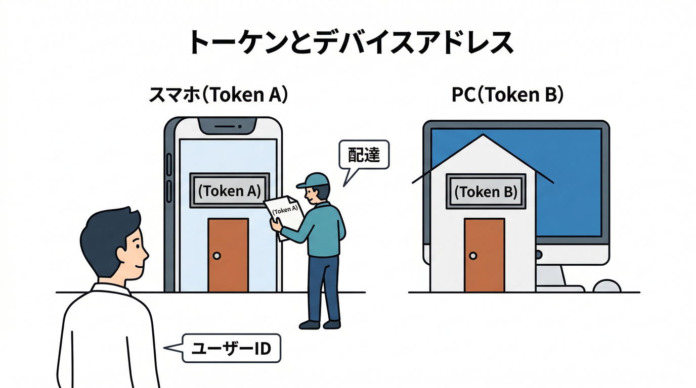
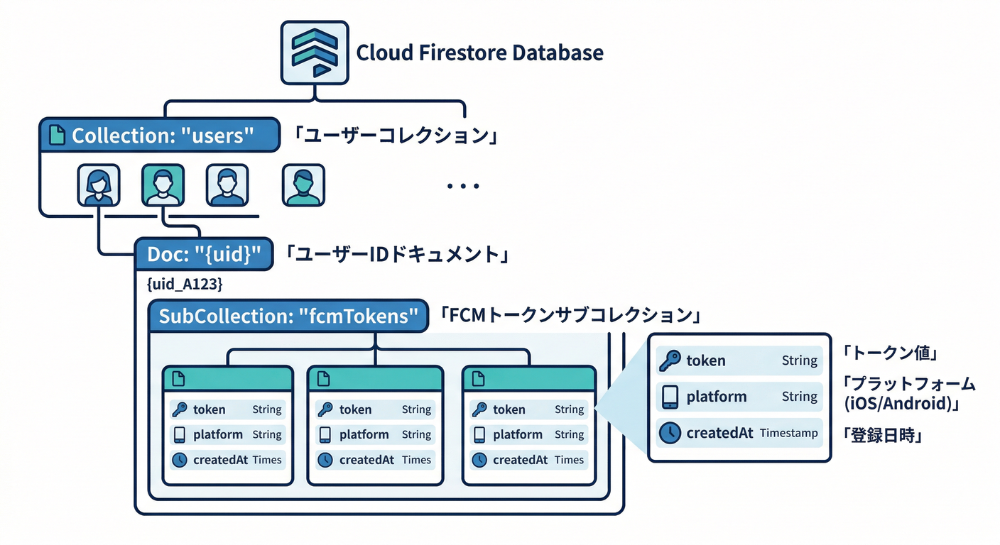
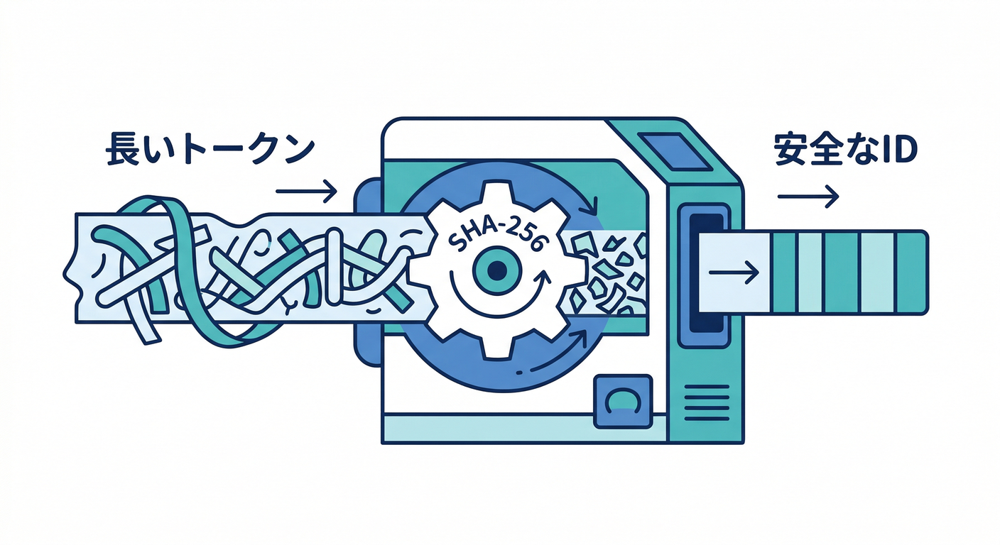
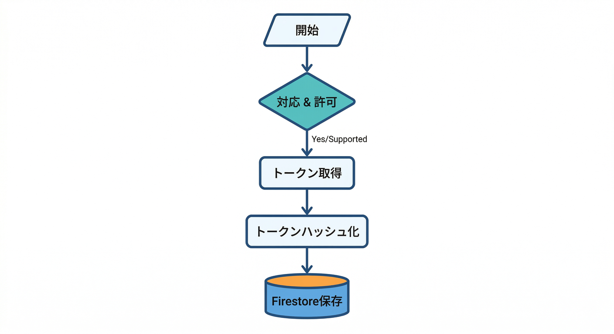
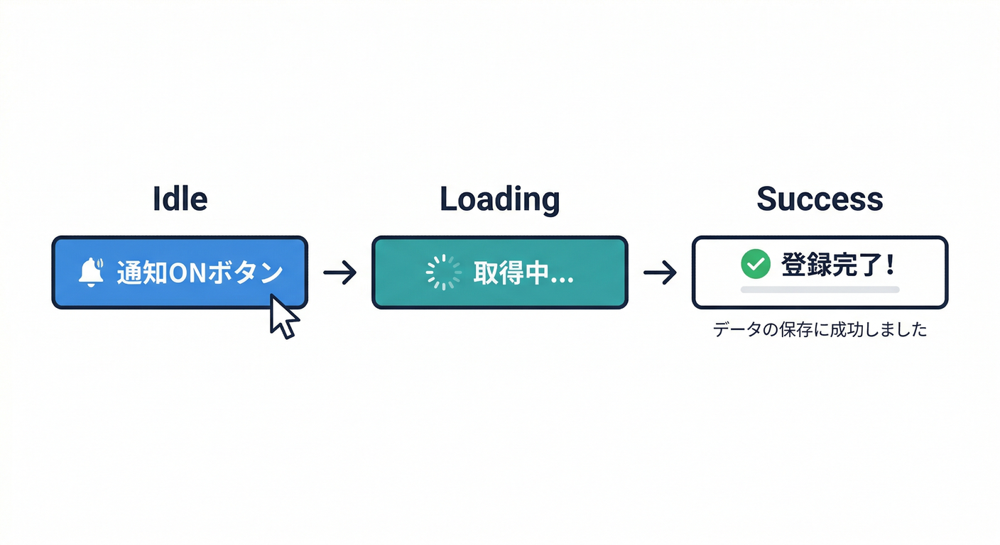
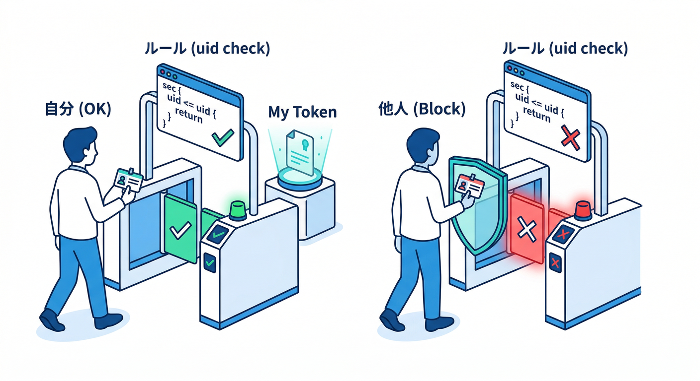
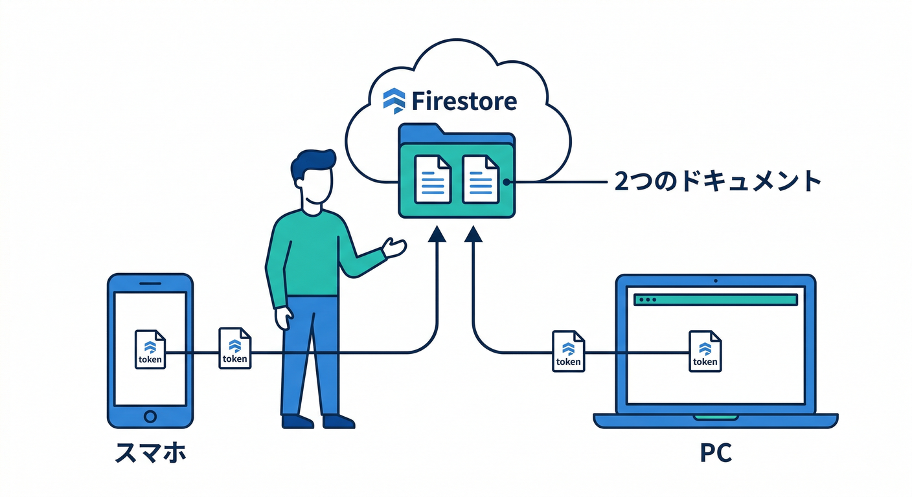

# 第7章：FCMトークン取得→Firestore保存（端末IDを預かる）🗃️🔑

この章の主役は **FCMトークン**（＝「この端末（このブラウザ）に送ってね」の宛先ID）です📮✨
通知って“人”に送ってる気がするけど、実際はまず **端末（ブラウザ）** に送るんだよね。だから **同じユーザーでも複数トークン** を持つのが普通です（スマホ＋PC＋別ブラウザ…）📱💻🧩

---

## 1) まず理解：トークンは“端末の住所”🏠📬



* トークンは **Web Push/FCM が通知を届けるための宛先**。ログインIDとは別物だよ🙌
* Web でトークンを取るには、基本 **HTTPS** が必要（ローカルは例外的にOK扱いのことが多い）🔒 ([Firebase][1])
* `getToken()` は、初回はネットワーク問い合わせをして、以後は **キャッシュから返す** 動きになる（＝毎回新規発行じゃない）📦✨ ([Firebase][1])
* そして超大事：トークン取得の前に、ルートに `firebase-messaging-sw.js`（Service Worker）が必要📄🧑‍🚒 ([Firebase][1])

---

## 2) Firestoreの保存設計（ここが“現実アプリ感”の第一歩）🧠✨



おすすめはこの形👇（ユーザー配下に “端末の住所録” を持たせる）

* `users/{uid}/fcmTokens/{tokenId}`

  * `token`: 実トークン文字列
  * `platform`: `"web"`
  * `createdAt`: serverTimestamp
  * `lastSeenAt`: serverTimestamp
  * `userAgent`: `navigator.userAgent`（雑に端末判別したい時に便利）

## tokenIdは“ハッシュ”推奨 🔐



トークンをそのままドキュメントIDにすると、文字に `/` が混ざったときアウト（FirestoreのドキュメントIDは `/` を含められない）⚠️ ([Firebase][2])
なので **SHA-256でハッシュ化**して `tokenId` にしちゃうのが安全でキレイです✨

---

## 3) 実装：トークン取得 → Firestoreへ保存 🛠️🔥



ここから「手を動かす」パートだよ💪😄
（React/TS想定、Firebase JS SDKのMessaging/Firestoreを使う）

## 3-1. `fcm.ts`（トークン取得＆保存のユーティリティ）🧩

```ts
// src/lib/fcm.ts
import { getMessaging, getToken, isSupported, deleteToken } from "firebase/messaging";
import { doc, setDoc, serverTimestamp } from "firebase/firestore";
import { db } from "./firebase"; // 既に作ってある前提（initializeApp + getFirestore）

// 文字列 -> SHA-256(hex) にして tokenId を作る
async function sha256Hex(input: string): Promise<string> {
  const data = new TextEncoder().encode(input);
  const hash = await crypto.subtle.digest("SHA-256", data);
  return [...new Uint8Array(hash)].map((b) => b.toString(16).padStart(2, "0")).join("");
}

export type SaveTokenOptions = {
  uid: string;
  vapidKey: string;
};

export async function ensureWebFcmTokenSaved(opts: SaveTokenOptions): Promise<string | null> {
  // まず「このブラウザはFCM対応？」を確認（Safari等で効いてくる）🧯
  if (!(await isSupported())) return null;

  // 通知許可（この章では“押した時だけ出す”方式が前提）🔔
  const permission = await Notification.requestPermission();
  if (permission !== "granted") return null;

  const messaging = getMessaging();

  // getToken: 初回はネットワーク問い合わせ、以後はキャッシュから返る挙動📦
  // ※ service worker は既に用意されている想定（第6章の成果物）🧑‍🚒
  const token = await getToken(messaging, { vapidKey: opts.vapidKey });
  if (!token) return null;

  const tokenId = await sha256Hex(token);

  // users/{uid}/fcmTokens/{tokenId} に保存（複数端末に対応できる）📱💻
  await setDoc(
    doc(db, "users", opts.uid, "fcmTokens", tokenId),
    {
      token,
      platform: "web",
      userAgent: navigator.userAgent,
      // 初回だけ作りたい時もあるけど、初心者は merge + timestamp でOK🙆‍♀️
      createdAt: serverTimestamp(),
      lastSeenAt: serverTimestamp(),
    },
    { merge: true }
  );

  return token;
}

// 通知OFF時など「端末の住所録から抜ける」処理（deleteToken + Firestore削除は次章で強化）🧹
export async function revokeWebFcmToken(vapidKey: string): Promise<boolean> {
  if (!(await isSupported())) return false;
  const messaging = getMessaging();
  const token = await getToken(messaging, { vapidKey });
  if (!token) return true;
  // deleteToken は Messaging API にある🧯
  return await deleteToken(messaging);
}
```

ポイントまとめ✨

* `isSupported()` で「そもそも対応ブラウザ？」を先に見る（地味に親切）🧯 ([Firebase][3])
* `getToken()` は “取れたらそれを保存” でOK。初回は問い合わせ、次からキャッシュ📦 ([Firebase][1])
* トークンは変わることがあるので、**保存時に `lastSeenAt` を更新**しておくと運用がラク（後で掃除できる）🧹 ([Firebase][4])

---

## 3-2. React側：通知ONボタンを押したら保存🎛️⚛️



```tsx
// src/components/NotificationSettings.tsx
import { useState } from "react";
import { ensureWebFcmTokenSaved } from "../lib/fcm";
import { useAuth } from "../lib/useAuth"; // uid を取れる想定（自作HookでOK）

const VAPID_KEY = import.meta.env.VITE_FIREBASE_VAPID_KEY as string;

export function NotificationSettings() {
  const { user } = useAuth();
  const [status, setStatus] = useState<string>("");

  const onEnable = async () => {
    if (!user) {
      setStatus("ログインしてから試してね🙂");
      return;
    }
    setStatus("トークン取得中…🔑");
    const token = await ensureWebFcmTokenSaved({ uid: user.uid, vapidKey: VAPID_KEY });
    if (!token) {
      setStatus("通知が有効化できなかったよ（権限拒否 or 非対応）🧯");
      return;
    }
    setStatus("OK！この端末を通知先として登録したよ📮✨");
  };

  return (
    <div style={{ display: "grid", gap: 8 }}>
      <button onClick={onEnable}>通知を有効化する🔔</button>
      <div>{status}</div>
    </div>
  );
}
```

---

## 4) Firestoreルール（最低限ここまでは守る）🛡️🔥



「自分のトークンは自分だけが触れる」ルールにするよ👍
`request.auth.uid == userId` っていう定番の書き方が基本🧩 

```js
// firestore.rules（例）
rules_version = '2';
service cloud.firestore {
  match /databases/{database}/documents {

    match /users/{userId}/fcmTokens/{tokenId} {
      allow read, write: if request.auth != null && request.auth.uid == userId;
    }
  }
}
```

> ここは後で強化できるよ（フィールド検証、`platform == "web"` 強制、サイズ制限、App Check連携など）😄🧱
> App CheckはWebだと reCAPTCHA v3/Enterprise などを使って「正規アプリからのアクセスっぽい？」を判定できる（ざっくり不正対策）🧿 ([Firebase][5])

---

## 5) AIで爆速チェック（“それっぽいけど間違い”を潰す）🤖🔍

## Gemini in Firebase：設計レビューに便利🧠

コンソールのGeminiは「質問→整理」に強いけど、**もっともらしい間違い**もありえるので最終チェックは自分で✅（PIIも入れない） ([Firebase][6])
例：

* 「このトークン保存設計で複数端末対応できてる？」
* 「ルールを最小から強化するなら何から？」

## Google Antigravity：実装を“作業単位”で回せる🚀

Antigravityは、エージェントが **計画→実装→検証→反復**まで回す思想の “agentic開発” を前提にしてる🛸 ([Google Codelabs][7])
この章なら、例えば

* 「`fcm.ts` をプロジェクトに合わせて統合して」
* 「トークンが保存されているか確認するデバッグ画面も作って」
  みたいに頼むと、作業がまとまって進みやすいよ💡

## Gemini CLI（Firebaseプロンプトカタログ）：型・ルール・手順の叩き台に🧰

FirebaseのAIプロンプトカタログには、`/firebase:*` みたいな“用途別”の入り口が用意されてる（初速が上がる）⚡ ([Firebase][3])
→ 生成物はそのまま採用せず、**必ず手元で動作確認**してね😉

---

## ミニ課題🎯：同一ユーザーで「2トークン」保存できる？📱💻



1. 同じアカウントで、別ブラウザ（またはシークレット）でもログイン
2. どちらも「通知を有効化する🔔」を押す
3. Firestoreで `users/{uid}/fcmTokens` に **2ドキュメント**増えたら成功🎉

**コツ**：`userAgent` を保存しておくと「どれがどの端末？」が雑に見分けられるよ👀✨

---

## チェック✅（この章のゴール確認）

* トークンは「ユーザーID」じゃなく「端末の宛先」って説明できる？📮
* `users/{uid}/fcmTokens/{tokenId}` で複数端末を自然に扱えてる？📱💻
* ルールが「自分のトークンは自分だけ」になってる？🛡️ 

---

次の第8章で、ここで作った保存ロジックを **更新・無効化・重複排除**まで仕上げて「運用できる通知」に進化させるよ🧯🌀

[1]: https://firebase.google.com/docs/cloud-messaging/web/get-started "Get started with Firebase Cloud Messaging in Web apps"
[2]: https://firebase.google.com/docs/firestore/quotas "Usage and limits  |  Firestore  |  Firebase"
[3]: https://firebase.google.com/docs/ai-assistance/prompt-catalog?hl=ja "Firebase の AI プロンプト カタログ  |  Develop with AI assistance"
[4]: https://firebase.google.com/docs/cloud-messaging/manage-tokens "Best practices for FCM registration token management  |  Firebase Cloud Messaging"
[5]: https://firebase.google.com/docs/rules/basics "Basic Security Rules  |  Firebase Security Rules"
[6]: https://firebase.google.com/docs/ai-assistance/gemini-in-firebase/try-gemini "Try Gemini in the Firebase console  |  Gemini in Firebase"
[7]: https://codelabs.developers.google.com/getting-started-google-antigravity "Getting Started with Google Antigravity  |  Google Codelabs"
