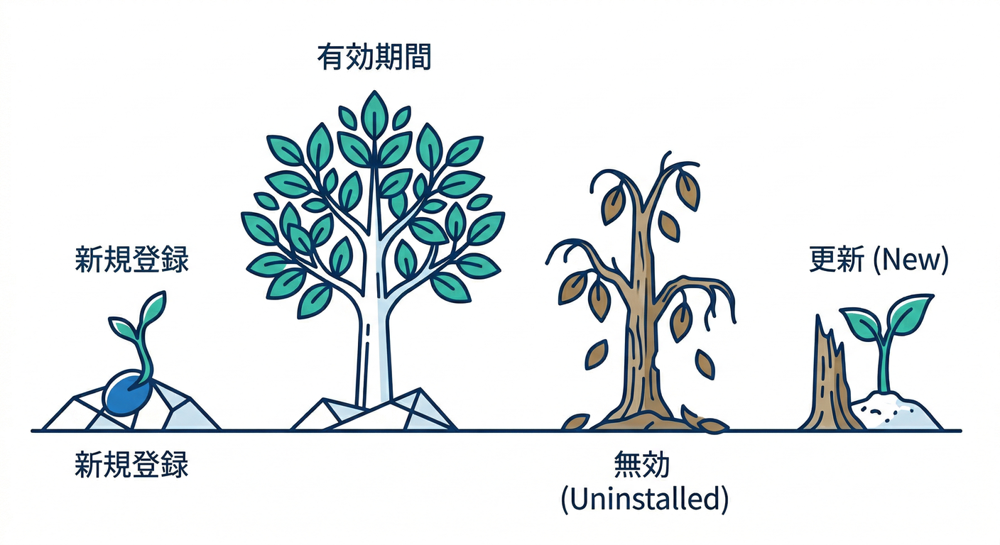
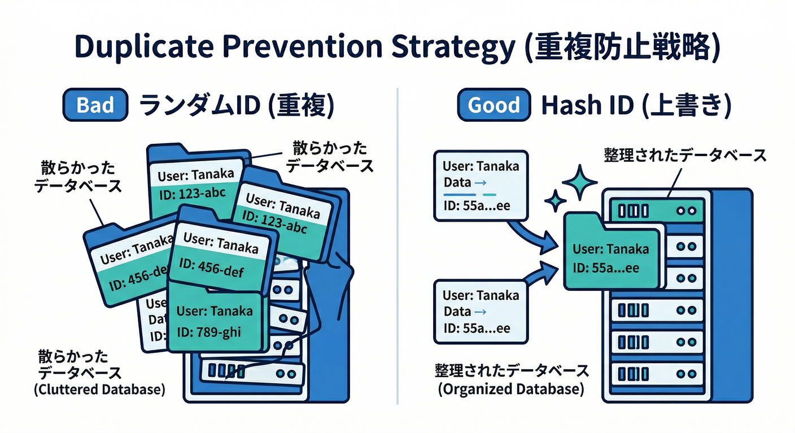
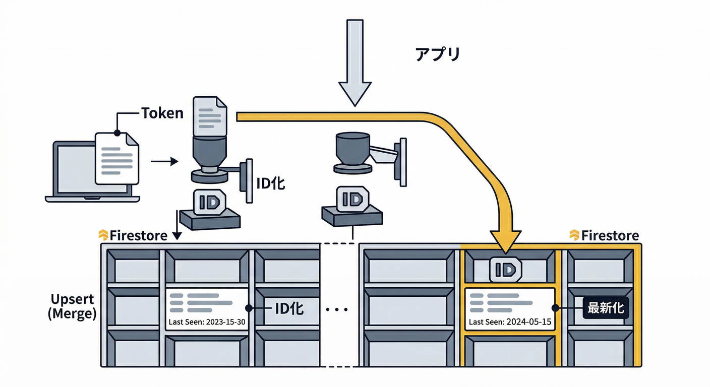
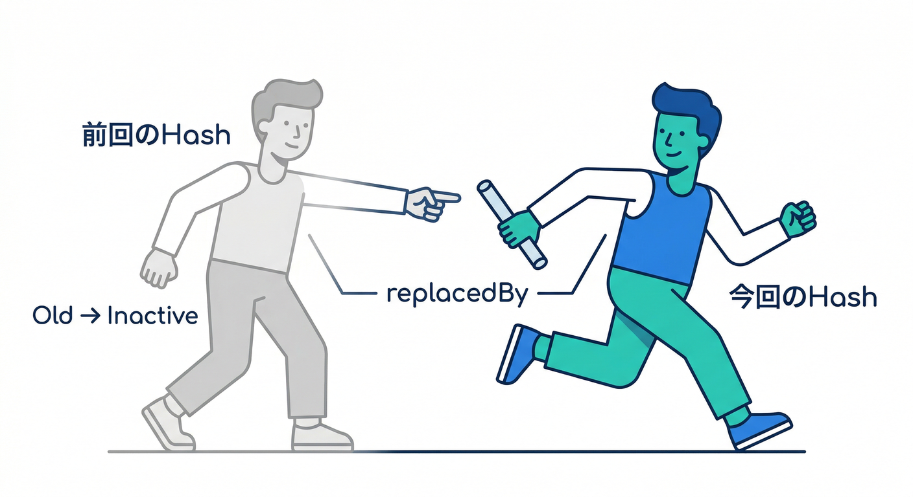
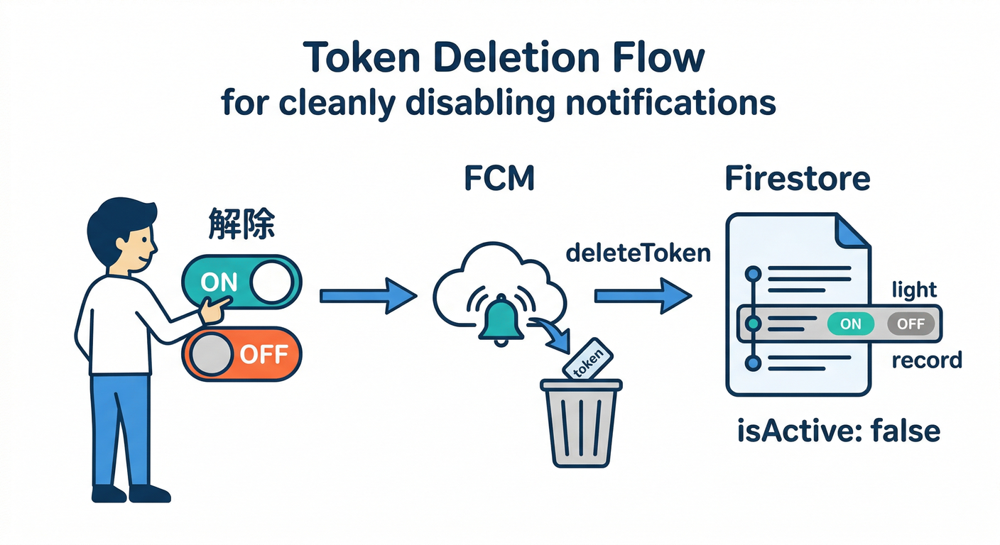
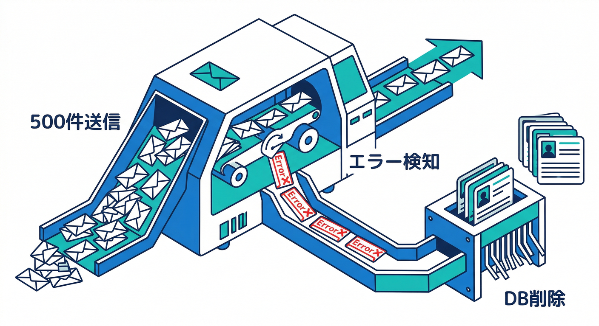

# 第8章：トークン更新・無効化・重複（地味だけど超重要）🧯🌀

この章、見た目は地味だけど「通知の成功率」と「運用コスト」を決める“心臓部”です🫀✨
古いトークンを握り続けると、**届かない通知にお金と時間を溶かす**し、コンソールの配信率も“見かけ上”ガクッと落ちます📉😇（実際にそういう落ち方をするよ、という注意が公式にあります）([Firebase][1])

---

## 読む📖：トークンは「変わる」し「死ぬ」💀➡️🆕



まず前提として、FCMの**登録トークン（registration token）**は固定じゃないです🔑🌀
無効になる理由は色々あって、たとえば「アプリが登録解除」「（モバイルなら）アンインストール」「トークン期限切れ」「運用都合で更新」などがありえます。([Firebase][2])

そして送信側では、無効トークン宛てに送ると典型的にこういう扱いになります👇

* **Not registered / UNREGISTERED**：そのトークンはもう使えない（消してOK）🧹
* **Invalid registration token / INVALID_ARGUMENT**：トークン形式が変、または（HTTP v1なら）条件次第で“そのトークンは死んでる”サイン⚠️([Firebase][2])

> つまり結論：
> **「トークンを保存する」だけだと半分。**
> **「更新する」「重複させない」「死んだら消す」までがセット**です🧩✅

---

## 手を動かす🖱️：1つの“正解パターン”を実装しよう（Web + Firestore）⚛️🗃️



ここでは Web（React）での **安全な保存設計** を作ります💪
ポイントは3つ👇

1. **ドキュメントIDを“トークンそのもの”にしない**（変な文字や長さが怖い）😅
2. 代わりに **tokenHash（SHA-256）** をIDにして、重複を物理的に潰す🔨
3. **createdAt / lastSeen / platform** を必ず付ける（掃除の判断材料）🧼🧠

## 1) Firestoreの形（おすすめ）🧱

* `users/{uid}/fcmTokens/{tokenHash}`

  * `token`: string（実トークン）
  * `platform`: `"web"`
  * `createdAt`: serverTimestamp
  * `lastSeen`: serverTimestamp
  * `permission`: `"granted" | "denied" | "default"`
  * `userAgent`: string（軽くでOK）
  * `isActive`: boolean
  * `replacedBy`: string | null（新しいtokenHash）

これで、同じ端末が複数タブで暴れても「同じ tokenHash に上書き」になるので、重複が激減します🧯✨

---

## 2) クライアント側：トークン取得→ハッシュ化→Firestoreにupsert🔁



FCM Webは `getToken()` でトークン取得、不要になったら `deleteToken()` が基本です🧩
（この2つは公式APIリファレンスに明記されています）([Firebase][3])

```ts
// src/lib/fcmToken.ts
import { getFirestore, doc, setDoc, serverTimestamp, updateDoc } from "firebase/firestore";
import { getMessaging, getToken, deleteToken, isSupported } from "firebase/messaging";
import { getAuth } from "firebase/auth";

const VAPID_KEY = import.meta.env.VITE_FIREBASE_VAPID_KEY as string; // 例

function toHex(buffer: ArrayBuffer) {
  return [...new Uint8Array(buffer)].map((b) => b.toString(16).padStart(2, "0")).join("");
}

async function sha256(text: string) {
  const data = new TextEncoder().encode(text);
  const hash = await crypto.subtle.digest("SHA-256", data);
  return toHex(hash);
}

export async function ensureFcmTokenUpsert() {
  if (!(await isSupported())) return { ok: false, reason: "messaging_not_supported" as const };

  const auth = getAuth();
  const user = auth.currentUser;
  if (!user) return { ok: false, reason: "not_logged_in" as const };

  // 権限状態（Webの通知はユーザーがいつでも変えられる）
  const permission = Notification.permission; // "granted" | "denied" | "default"
  if (permission !== "granted") {
    // ここでは「トークン取得しない」方針にしておく（押し付けないUX）🙂
    return { ok: false, reason: "permission_not_granted" as const, permission };
  }

  const messaging = getMessaging();

  // 重要：getTokenは“最新トークンを確保する”動き。定期的な取得が推奨される考え方もあります📆
  const token = await getToken(messaging, { vapidKey: VAPID_KEY });
  const tokenHash = await sha256(token);

  const db = getFirestore();
  const tokenRef = doc(db, "users", user.uid, "fcmTokens", tokenHash);

  // 重複に強い upsert（同じtokenHashなら同じ場所に書く）
  await setDoc(
    tokenRef,
    {
      token,
      platform: "web",
      permission,
      userAgent: navigator.userAgent,
      isActive: true,
      // 初回だけ作りたい createdAt は「無ければ作る」風にするのが理想だけど
      // シンプルに毎回 set でもOK（教材では分かりやすさ優先）
      createdAt: serverTimestamp(),
      lastSeen: serverTimestamp(),
      replacedBy: null,
    },
    { merge: true }
  );

  // 端末内に「前回のtokenHash」を覚えて、変化を検知する（任意）
  const prevHash = localStorage.getItem("fcmTokenHash");
  if (prevHash && prevHash !== tokenHash) {
    // 前のトークンは “置き換えられた” 扱いにする（掃除しやすい）
    const prevRef = doc(db, "users", user.uid, "fcmTokens", prevHash);
    await updateDoc(prevRef, {
      isActive: false,
      replacedBy: tokenHash,
      lastSeen: serverTimestamp(),
    }).catch(() => {
      // 既に消えててもOK（握りつぶす）
    });
  }
  localStorage.setItem("fcmTokenHash", tokenHash);

  return { ok: true, tokenHash };
}
```



```ts
export async function disableFcmForThisDevice() {
  if (!(await isSupported())) return { ok: false, reason: "messaging_not_supported" as const };

  const auth = getAuth();
  const user = auth.currentUser;
  if (!user) return { ok: false, reason: "not_logged_in" as const };

  const messaging = getMessaging();

  // deleteToken は「この端末の購読を解除＆トークン削除」するAPIです🧨
  const deleted = await deleteToken(messaging); // Promise<boolean>
  // 公式の deleteToken 説明：トークン削除して購読解除:contentReference[oaicite:4]{index=4}

  // Firestore側も“この端末の前回tokenHash”だけは掃除しておく🧹
  const tokenHash = localStorage.getItem("fcmTokenHash");
  if (tokenHash) {
    const db = getFirestore();
    const tokenRef = doc(db, "users", user.uid, "fcmTokens", tokenHash);
    await setDoc(tokenRef, { isActive: false, permission: Notification.permission, lastSeen: serverTimestamp() }, { merge: true })
      .catch(() => {});
    localStorage.removeItem("fcmTokenHash");
  }

  return { ok: true, deleted };
}
```



## ここが“効いてる”ポイント🧠✨

* `tokenHash` をdocIDにして **重複を構造で潰す**🔨
* `lastSeen` があるから「最近使ってない端末」を判定できる👀
* `replacedBy` があると「更新の履歴」が追える📜

ちなみに「トークンは運用側で更新されることもある」し、「定期的に取り直す」発想が公式ブログでも推奨されています（例として “毎月 getToken する”）。([The Firebase Blog][4])
Webでも同じで、アプリ起動時や設定画面を開いた時に `ensureFcmTokenUpsert()` を呼ぶのが堅いです📌

---

## 送信側で“死んだトークンを消す”🧹⚡（これが最重要）



複数トークンにまとめて送る場合、Admin SDKは **最大500トークン**まで一度に送れます📨（上限も明記）([Firebase][5])
そしてレスポンスは「入力トークンの順番と対応」するので、失敗したトークンだけ拾えます。([Firebase][5])

さらに、Cloud Functions for Firebase の Node.js ランタイムは **Node.js 22 / 20（18はdeprecated）** が選べます。([Firebase][6])
（送信処理をNodeで書くのが一番スムーズ👍）

```ts
// functions/src/sendToUser.ts（イメージ）
import * as admin from "firebase-admin";
admin.initializeApp();

export async function sendToUserAllTokens(uid: string, payload: { title: string; body: string }) {
  const db = admin.firestore();

  const snap = await db.collection("users").doc(uid).collection("fcmTokens")
    .where("isActive", "==", true)
    .get();

  const tokens = snap.docs.map(d => d.data().token as string).filter(Boolean);
  if (tokens.length === 0) return { sent: 0, cleaned: 0 };

  // 500個まで（超えたら分割）
  const chunk = tokens.slice(0, 500);

  const message = {
    tokens: chunk,
    notification: { title: payload.title, body: payload.body },
    data: { kind: "comment", uid },
  };

  const res = await admin.messaging().sendEachForMulticast(message);

  let cleaned = 0;

  // responses は tokens と同じ順番対応:contentReference[oaicite:9]{index=9}
  await Promise.all(res.responses.map(async (r, i) => {
    if (r.success) return;

    const code = (r.error as any)?.code as string | undefined;

    // 代表例：
    // - messaging/registration-token-not-registered（もう死んだ）
    // - messaging/invalid-registration-token（形式が変）
    // エラーコードの説明：無効トークン/Not registered の考え方は公式にある:contentReference[oaicite:10]{index=10}
    if (code === "messaging/registration-token-not-registered" || code === "messaging/invalid-registration-token") {
      const badToken = chunk[i];

      // token → tokenHash の逆引きはできないので、ここは設計で楽にする：
      // 1) Firestore側に tokenHash だけでなく token も置いてる
      // 2) token が一致する doc を探して消す（indexが必要なら貼る）
      const q = await db.collection("users").doc(uid).collection("fcmTokens")
        .where("token", "==", badToken)
        .limit(5)
        .get();

      await Promise.all(q.docs.map(d => d.ref.delete()));
      cleaned += q.size;
    }
  }));

  return { sent: res.successCount, cleaned };
}
```

> これで “死んだトークンを握り続けて配信率が落ちる問題” を根本から抑えられます🧯✨
> 古いトークン宛て送信が続くと、配信率の数字も汚れるよ…という注意が公式ガイドにあります。([Firebase][1])

---

## ミニ課題🎯：トークンに「観測用メタデータ」を足して、掃除ルールを言語化しよう🧠🧹


次の3つを追加してみてください👇

1. `lastSeen` を **起動時に必ず更新**（=“最近使ってる端末”が分かる）📆
2. `platform` を `"web"` 固定でOK（将来モバイル混ざっても崩れない）📱💻
3. `permission` を保存（“拒否された端末”は通知対象から外す判断ができる）🙅‍♀️🔕

おまけ：掃除ルール例🧼

* `isActive=false` は即削除してもOK
* `lastSeen` が60日以上前なら “休眠端末” 扱いで削除（運用ポリシー次第）
  ※ 休眠端末の扱い・更新頻度の考え方は公式ブログの例が参考になります。([The Firebase Blog][4])

---

## チェック✅：理解できたか3問で確認🙂

1. トークンが無効になる理由を2つ言える？（例：登録解除、期限切れ…）([Firebase][2])
2. 重複を防ぐために「tokenHashをdocIDにする」メリットを説明できる？🧠
3. 送信失敗時に `messaging/registration-token-not-registered` が出たら、DBから何をする？🧹([Firebase][2])

---

## AIで“運用の面倒”を減らす🤖✨（Gemini CLI / AI Logic）

## Gemini CLI：ログ→原因推定を秒速にする💻🔍

Gemini CLI はターミナルから調査・修正・テスト生成まで支援する流れが公式に整理されています。([Google Cloud Documentation][7])
たとえばこんなお願いが強いです👇

* 「この sendEachForMulticast の失敗コード一覧から、削除すべきトークン条件を提案して」🧠
* 「Firestoreの fcmTokens 設計、重複や掃除の観点で穴ない？」🧯
* 「この関数にユニットテスト案を作って」🧪

## Firebase AI Logic：エラー要約ボットを作れる🤖📝

Firebase AI Logic は Gemini/Imagen をアプリから扱う入口として提供されています。([Firebase][8])
たとえば「直近24時間の送信失敗ログ」をAIに要約させて、

* 多い失敗コードランキング
* たぶん設定ミス系（VAPID/SW）っぽい
* たぶん寿命/無効トークン系っぽい
  みたいに整理してくれると、運用が一気にラクになります📊✨

---

## 次章へのつながり🔗

第9章では「フォアグラウンド受信」で、アプリ内トーストやバッジ更新を“気持ちよく”作ります📲✨
でもそれ、**第8章がちゃんとできてると成功率が上がって気持ちよさも増える**んですよね😄🔥

---

* [theverge.com](https://www.theverge.com/news/822833/google-antigravity-ide-coding-agent-gemini-3-pro?utm_source=chatgpt.com)
* [theverge.com](https://www.theverge.com/news/692517/google-gemini-cli-ai-agent-dev-terminal?utm_source=chatgpt.com)

[1]: https://firebase.google.com/docs/cloud-messaging/manage-tokens "Best practices for FCM registration token management  |  Firebase Cloud Messaging"
[2]: https://firebase.google.com/docs/cloud-messaging/error-codes "FCM Error Codes  |  Firebase Cloud Messaging"
[3]: https://firebase.google.com/docs/reference/js/messaging_ "@firebase/messaging  |  Firebase JavaScript API reference"
[4]: https://firebase.blog/posts/2023/04/managing-cloud-messaging-tokens/ "Managing Cloud Messaging Tokens"
[5]: https://firebase.google.com/docs/cloud-messaging/send/admin-sdk "Send a Message using Firebase Admin SDK  |  Firebase Cloud Messaging"
[6]: https://firebase.google.com/docs/functions/manage-functions "Manage functions  |  Cloud Functions for Firebase"
[7]: https://docs.cloud.google.com/gemini/docs/codeassist/gemini-cli?utm_source=chatgpt.com "Gemini CLI | Gemini for Google Cloud"
[8]: https://firebase.google.com/docs/ai-logic?utm_source=chatgpt.com "Gemini API using Firebase AI Logic - Google"
