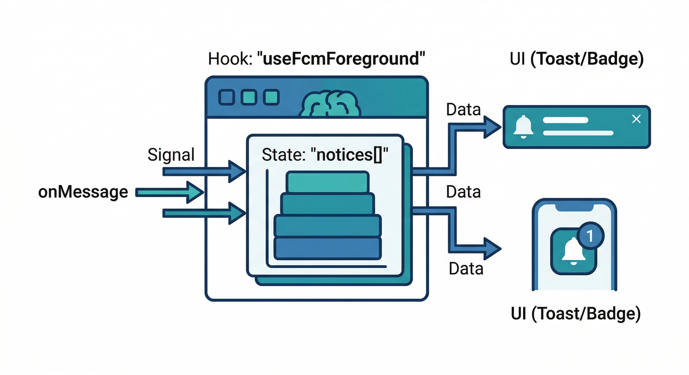
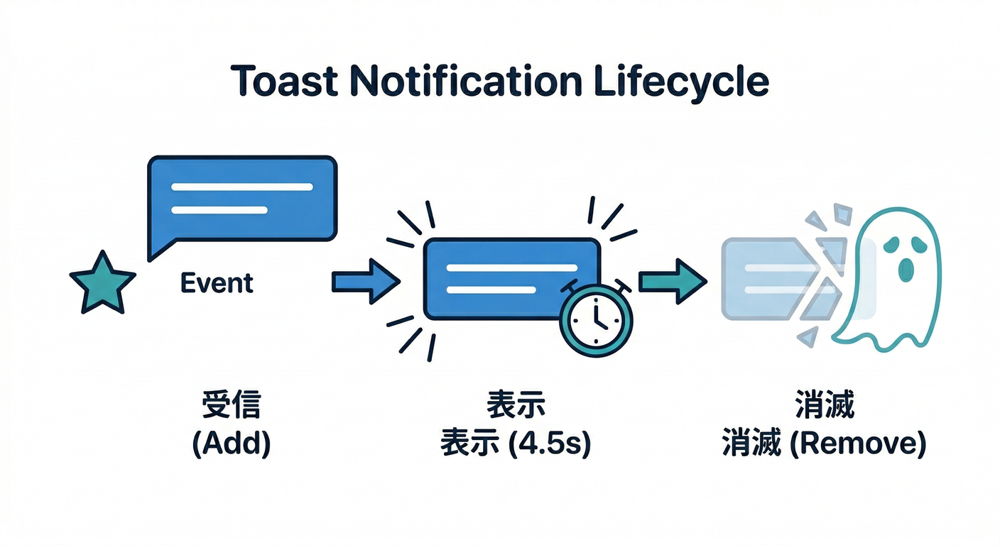
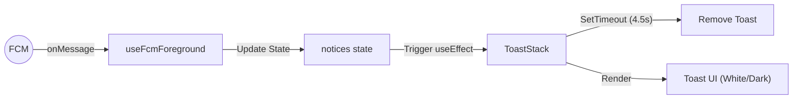
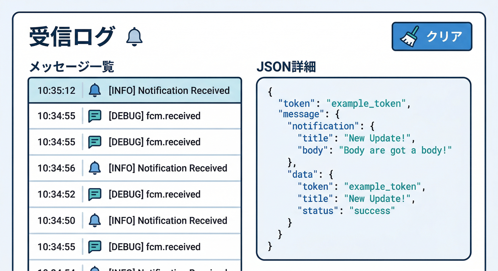
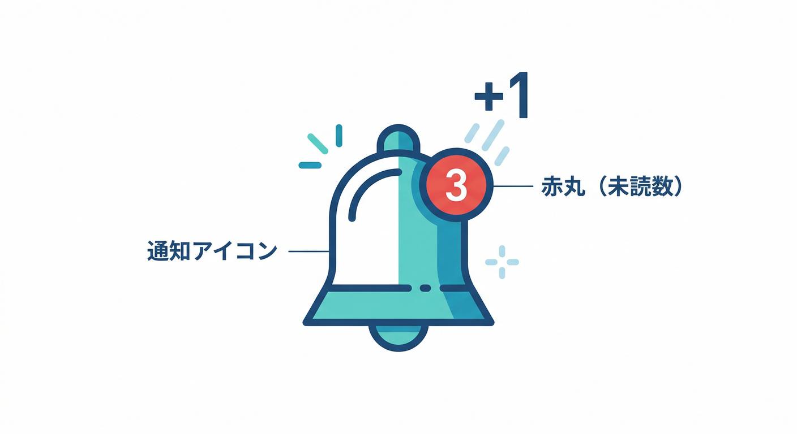
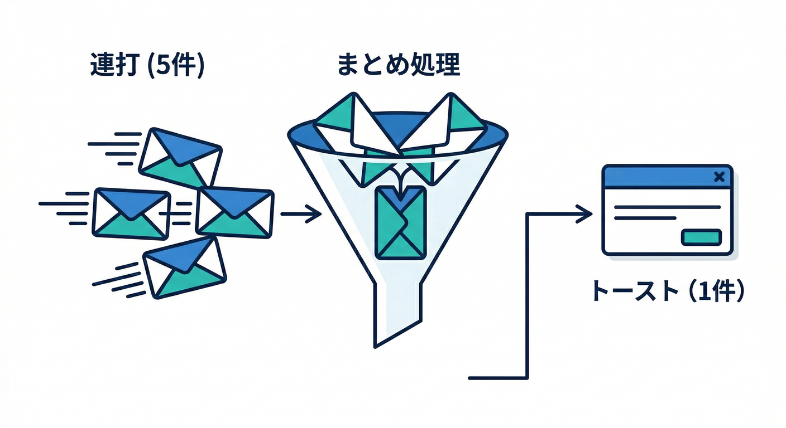
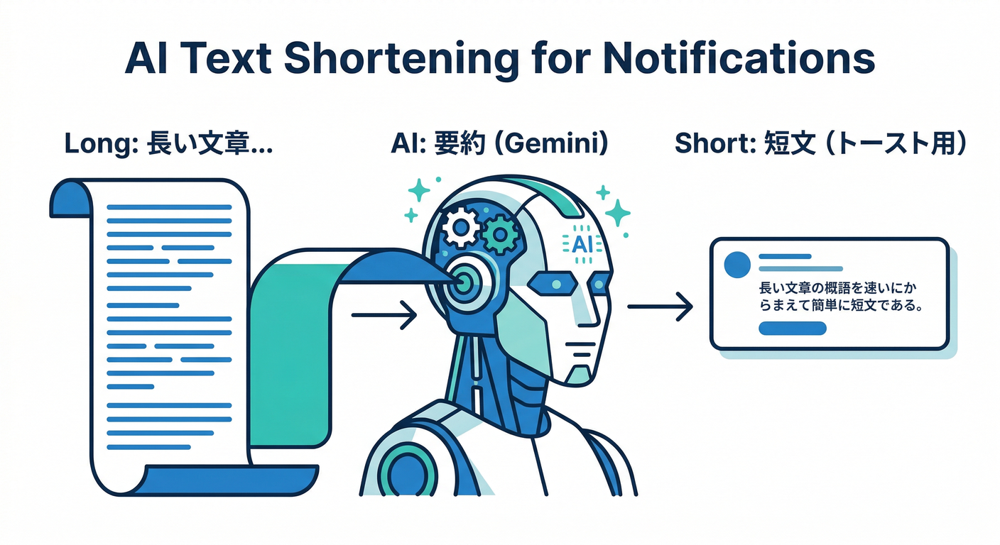

# 第9章：フォアグラウンド受信（アプリ内通知の気持ちよさ）📲✨

この章のゴールはこれ👇
**アプリを見てる最中（フォアグラウンド）にFCMが届いたら、OS通知じゃなく「アプリ内のやさしい通知（トースト）」で気持ちよく反応する**こと！😄🍞
さらに、**受信ログを“開発用パネル”に見える化**して、デバッグが爆速になります🧪⚡

---

## 1) 読む 📖：フォアグラウンド受信って何が嬉しいの？😊

## フォアグラウンド＝「いま画面を見てる」状態👀

Firebase公式でも、ページが**フォアグラウンド（フォーカスあり）**か、**バックグラウンド/閉じてる**かで挙動が変わるよ、と整理されています。フォアグラウンドなら **`onMessage`** でページ側が受け取ります📨✨ ([Firebase][1])

* フォアグラウンド：`onMessage` ✅
* バックグラウンド：Service Worker 側（`onBackgroundMessage` など）🧑‍🚒 ([Firebase][1])

## “アプリ内通知”が気持ちいい理由🍀


アプリを操作してる最中に、OS通知がドン！は **ちょっと邪魔**になりがち😅
だから、フォアグラウンドでは…

* 画面の隅に **小さくトースト**🍞
* バッジ（未読数）を **静かに更新**🔴
* クリックしたら **該当コメントへスッ**👉

…みたいに「邪魔しないけど分かる」が最強です💪✨

> ちなみに `onMessage` は「フォーカス中に受信したとき」だけじゃなく、Service Worker が作った通知をユーザーがクリックしてアプリが前面に来たときにも呼ばれるケースがあるよ、って公式に書かれてます🧠 ([Firebase][1])

---

## 2) 手を動かす 🖱️：受信 → トースト/バッジ更新 → 開発パネル表示

ここからは **React + TypeScript** で「気持ちいい受信」を作ります💻⚛️
（第6章〜第8章で、SW・権限・トークン保存までできてる前提の流れ）

---

## ステップA：`onMessage` を “Reactで安全に” 受ける🎣



まずは「受信の入口」を hooks にします。
ポイントはこれ👇

* ブラウザによって Push/FCM が使えない場合があるので `isSupported()` で分岐すると安心🧯 ([Firebase][2])
* `onMessage()` は購読解除（unsubscribe）もできるので、Reactの `useEffect` でちゃんと片付ける🧹 ([Firebase][2])
* フォアグラウンド受信には `firebase-messaging-sw.js` が必要（または既存SWを `getToken` に渡す）という注意が公式にあるよ📌 ([Firebase][1])

## 1) `src/lib/firebaseApp.ts`

```ts
import { initializeApp } from "firebase/app";

export const firebaseApp = initializeApp({
  apiKey: "YOUR_API_KEY",
  authDomain: "YOUR_AUTH_DOMAIN",
  projectId: "YOUR_PROJECT_ID",
  messagingSenderId: "YOUR_SENDER_ID",
  appId: "YOUR_APP_ID",
});
```

## 2) `src/lib/messaging.ts`

```ts
import { firebaseApp } from "./firebaseApp";
import { getMessaging, isSupported, type Messaging } from "firebase/messaging";

export async function getMessagingOrNull(): Promise<Messaging | null> {
  if (!(await isSupported())) return null; // Safariなど環境差の安全策🧯
  return getMessaging(firebaseApp);
}
```

## 3) `src/hooks/useFcmForeground.ts`

```tsx
import { useEffect, useMemo, useState } from "react";
import { onMessage, type MessagePayload } from "firebase/messaging";
import { getMessagingOrNull } from "../lib/messaging";

export type InAppNotice = {
  id: string;
  receivedAt: number;
  title: string;
  body?: string;
  data?: Record<string, string>;
};

function toNotice(payload: MessagePayload): InAppNotice {
  const title = payload.notification?.title ?? "通知";
  const body = payload.notification?.body;
  const data = payload.data as Record<string, string> | undefined;

  return {
    id: crypto.randomUUID(),
    receivedAt: Date.now(),
    title,
    body,
    data,
  };
}

export function useFcmForeground() {
  const [notices, setNotices] = useState<InAppNotice[]>([]);
  const [unread, setUnread] = useState(0);

  useEffect(() => {
    let unsubscribe = () => {};

    (async () => {
      const messaging = await getMessagingOrNull();
      if (!messaging) return;

      // フォアグラウンドで届いたメッセージを受け取る📩
      unsubscribe = onMessage(messaging, (payload) => {
        const notice = toNotice(payload);

        setNotices((prev) => [notice, ...prev].slice(0, 30)); // 最新30件だけ残す🧠
        setUnread((n) => n + 1);
      });
    })();

    return () => unsubscribe();
  }, []);

  const api = useMemo(
    () => ({
      notices,
      unread,
      markAllRead: () => setUnread(0),
      clearNotices: () => setNotices([]),
    }),
    [notices, unread]
  );

  return api;
}
```

---

## ステップB：トーストUI（邪魔しない通知）を作る🍞✨





## 4) `src/components/ToastStack.tsx`

```tsx
import { useEffect, useState } from "react";
import type { InAppNotice } from "../hooks/useFcmForeground";

type Toast = InAppNotice & { ttlMs: number };

export function ToastStack({ notices }: { notices: InAppNotice[] }) {
  const [toasts, setToasts] = useState<Toast[]>([]);

  // 新着通知が来たらトーストに流す🍞
  useEffect(() => {
    const newest = notices[0];
    if (!newest) return;

    setToasts((prev) => [{ ...newest, ttlMs: 4500 }, ...prev].slice(0, 5));
  }, [notices]);

  // 自動で消す⌛
  useEffect(() => {
    if (toasts.length === 0) return;
    const timers = toasts.map((t) =>
      window.setTimeout(() => {
        setToasts((prev) => prev.filter((x) => x.id !== t.id));
      }, t.ttlMs)
    );
    return () => timers.forEach((id) => window.clearTimeout(id));
  }, [toasts]);

  if (toasts.length === 0) return null;

  return (
    <div style={{ position: "fixed", right: 16, bottom: 16, width: 360, zIndex: 9999 }}>
      {toasts.map((t) => (
        <div
          key={t.id}
          style={{
            marginTop: 10,
            padding: 12,
            borderRadius: 12,
            background: "rgba(20,20,20,0.92)",
            color: "white",
            boxShadow: "0 10px 30px rgba(0,0,0,0.25)",
          }}
        >
          <div style={{ fontWeight: 700, fontSize: 14 }}>{t.title}</div>
          {t.body && <div style={{ marginTop: 6, fontSize: 13, opacity: 0.9 }}>{t.body}</div>}
          {t.data?.commentId && (
            <div style={{ marginTop: 8, fontSize: 12, opacity: 0.8 }}>
              🔗 commentId: {t.data.commentId}
            </div>
          )}
        </div>
      ))}
    </div>
  );
}
```

> コツ💡：フォアグラウンドで **OS通知（Notification API）を無理に出さない**ほうが自然です🙂
> “画面見てるんだから、アプリ内でそっと”がちょうどいい✨

---

## ステップC：バッジ＆“開発用パネル”で見える化👀🧪



## 5) `src/components/FcmDevPanel.tsx`

```tsx
import type { InAppNotice } from "../hooks/useFcmForeground";

export function FcmDevPanel({
  open,
  notices,
  onClear,
}: {
  open: boolean;
  notices: InAppNotice[];
  onClear: () => void;
}) {
  if (!open) return null;

  return (
    <div
      style={{
        position: "fixed",
        left: 16,
        bottom: 16,
        width: 520,
        maxHeight: 360,
        overflow: "auto",
        zIndex: 9999,
        background: "white",
        borderRadius: 12,
        boxShadow: "0 10px 30px rgba(0,0,0,0.15)",
        border: "1px solid #eee",
      }}
    >
      <div style={{ padding: 12, borderBottom: "1px solid #eee", display: "flex", gap: 8 }}>
        <div style={{ fontWeight: 800 }}>🧪 FCM 受信ログ</div>
        <button onClick={onClear} style={{ marginLeft: "auto" }}>
          🧹 クリア
        </button>
      </div>

      <div style={{ padding: 12 }}>
        {notices.length === 0 ? (
          <div style={{ opacity: 0.7 }}>まだ受信なし📭</div>
        ) : (
          notices.map((n) => (
            <div key={n.id} style={{ padding: 10, borderBottom: "1px dashed #eee" }}>
              <div style={{ fontSize: 12, opacity: 0.7 }}>
                ⏱ {new Date(n.receivedAt).toLocaleTimeString()}
              </div>
              <div style={{ fontWeight: 700 }}>{n.title}</div>
              {n.body && <div style={{ marginTop: 4 }}>{n.body}</div>}
              {n.data && (
                <pre style={{ marginTop: 8, fontSize: 12, background: "#fafafa", padding: 10, borderRadius: 8 }}>
                  {JSON.stringify(n.data, null, 2)}
                </pre>
              )}
            </div>
          ))
        )}
      </div>
    </div>
  );
}
```

## 6) `src/App.tsx`（例：設定画面に組み込む感じ）



```tsx
import { useState } from "react";
import { useFcmForeground } from "./hooks/useFcmForeground";
import { ToastStack } from "./components/ToastStack";
import { FcmDevPanel } from "./components/FcmDevPanel";

export default function App() {
  const { notices, unread, markAllRead, clearNotices } = useFcmForeground();
  const [devOpen, setDevOpen] = useState(false);

  return (
    <div style={{ padding: 18 }}>
      <h1>通知設定🎛️</h1>

      <div style={{ marginTop: 12, display: "flex", gap: 10, alignItems: "center" }}>
        <button onClick={() => setDevOpen((v) => !v)}>
          {devOpen ? "🙈 開発パネルを閉じる" : "👀 開発パネルを開く"}
        </button>

        <button onClick={markAllRead}>✅ 未読を0にする</button>

        <div style={{ marginLeft: "auto" }}>
          🔴 未読: <b>{unread}</b>
        </div>
      </div>

      <ToastStack notices={notices} />
      <FcmDevPanel open={devOpen} notices={notices} onClear={clearNotices} />
    </div>
  );
}
```

---

## 3) ミニ課題 🎯：「受信を“気持ちよく”仕上げる」3点セット✨



次の3つ、どれも“現実アプリ感”が出ます😄

1. **連打耐性**🧯：同じ `commentId` が短時間に来たら、トーストは1つにまとめる
2. **操作の邪魔をしない**🫧：トーストは 4〜5秒で消えて、画面中央には出さない
3. **深い導線の仕込み**🔗：`data.commentId` があるなら「コメントへ移動」ボタンをトーストに付ける（遷移は次章で本格化👣）

> ブラウザ側でも Web Push はレート制限など“うざい運用”を嫌う方向に進んでるので、アプリ設計でちゃんと優しくするのは超大事です🙂📉 ([Chrome for Developers][3])

---

## 4) チェック ✅：ハマりがちな罠を先に潰す🧠🧯

* [ ] **`onMessage` が呼ばれるのはフォアグラウンド中心**だと理解できた？（背景はSW側） ([Firebase][1])
* [ ] フォアグラウンド受信のために **`firebase-messaging-sw.js` が必要（または既存SWを `getToken` に渡す）**って把握できた？ ([Firebase][1])
* [ ] ブラウザ差で詰まらないように `isSupported()` を入れた？🧯 ([Firebase][2])
* [ ] 受信ログが「見える」ようになって、デバッグ速度が上がった？👀⚡

---

## おまけ：AIで“通知文を短くする”をチラ見せ🤖📝✨（任意）



「通知本文が長い」「言い回しを整えたい」って時、受信後に **Firebase AI Logic** で“短文化”できます（第18章で本格的にやるやつの先取り）😄
公式のWeb例では `firebase/ai` と `getGenerativeModel()` / `generateContent()` が出てきます📌 ([Firebase][4])

```ts
import { firebaseApp } from "./firebaseApp";
import { getAI, getGenerativeModel, GoogleAIBackend } from "firebase/ai";

const ai = getAI(firebaseApp, { backend: new GoogleAIBackend() });
const model = getGenerativeModel(ai, { model: "gemini-2.5-flash" });

export async function shortenForToast(text: string) {
  const prompt = `次の文章を通知向けに短くして。最大50文字。個人情報っぽいものは伏せ字にしてね。\n\n${text}`;
  const result = await model.generateContent(prompt);
  return result.response.text();
}
```

> 注意⚠️：毎回AIに投げると遅延＆コストが出やすいので、
> **「長い時だけ」「開発中だけ」「サーバー側で事前生成」**みたいに段階運用が現実的です🧠💰

---

## さらに加速：Gemini CLI / Antigravity で“実装と検証”を一気に回す🚀

* **Gemini CLI** はターミナル上でエージェント的に「バグ修正・新機能・テスト強化」まで回せる、と公式が説明してます🧰✨（Cloud Shellでも使えるよ） ([Google Cloud Documentation][5])
* **Antigravity** は “Mission Control” 的にエージェントを管理して、計画→実装→検証まで支援する思想が整理されてます🛸🧠 ([Google Codelabs][6])

この章だと、たとえば👇みたいなお願いが強いです😄

* 「`useFcmForeground` に重複排除（commentIdで5秒以内はまとめる）を追加して」
* 「ToastStackに“コメントへ移動”ボタンを付けて（commentIdがある時だけ）」
* 「受信payloadの型をきれいにして、DevPanelの表示を見やすくして」

---

次の第10章では、いよいよ **バックグラウンド受信（通知表示＆クリック遷移）**に突入です🔔👉
この第9章の“アプリ内通知”があると、前面でも背面でも「一貫して気持ちいい」通知体験になりますよ〜😄✨

[1]: https://firebase.google.com/docs/cloud-messaging/web/receive-messages "Receive messages in Web apps  |  Firebase Cloud Messaging"
[2]: https://firebase.google.com/docs/reference/js/messaging_?utm_source=chatgpt.com "firebase/messaging - JavaScript API reference - Google"
[3]: https://developer.chrome.com/blog/web-push-rate-limits?utm_source=chatgpt.com "Increasing web push notification value with rate limits | Blog"
[4]: https://firebase.google.com/docs/ai-logic/get-started "Get started with the Gemini API using the Firebase AI Logic SDKs  |  Firebase AI Logic"
[5]: https://docs.cloud.google.com/gemini/docs/codeassist/gemini-cli "Gemini CLI  |  Gemini for Google Cloud  |  Google Cloud Documentation"
[6]: https://codelabs.developers.google.com/getting-started-google-antigravity "Getting Started with Google Antigravity  |  Google Codelabs"
