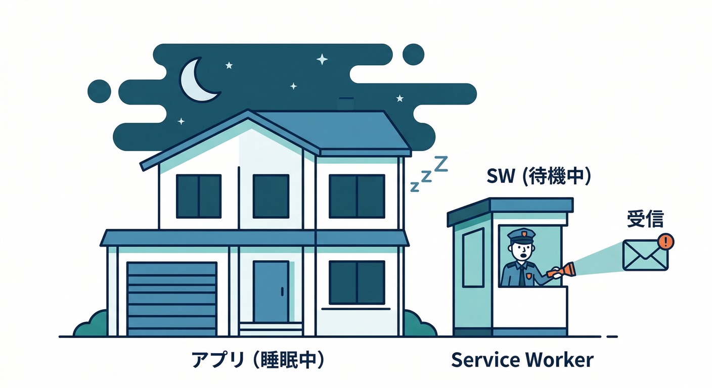
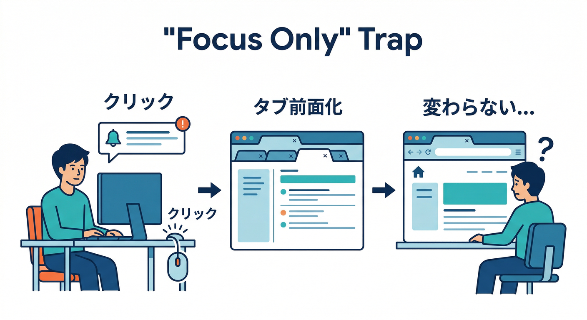
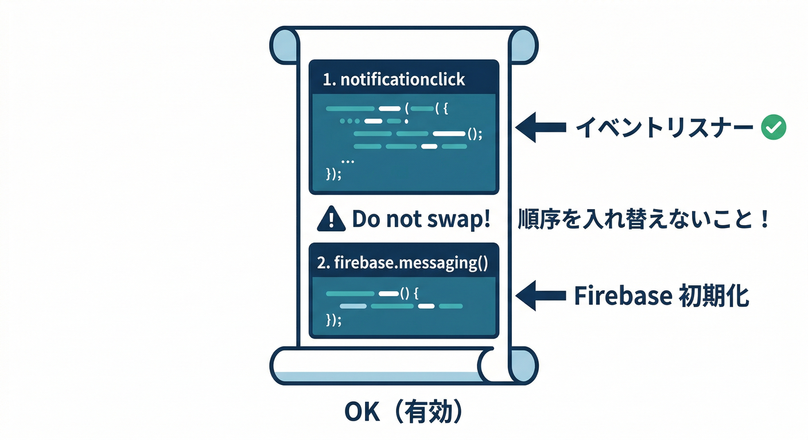
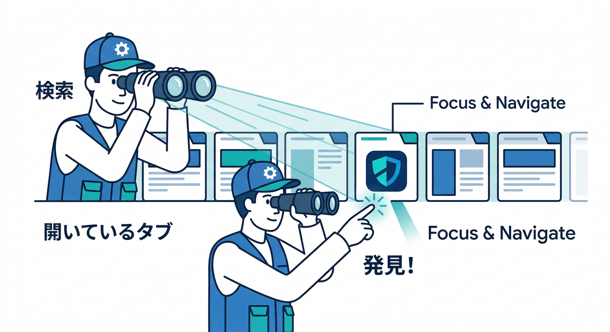
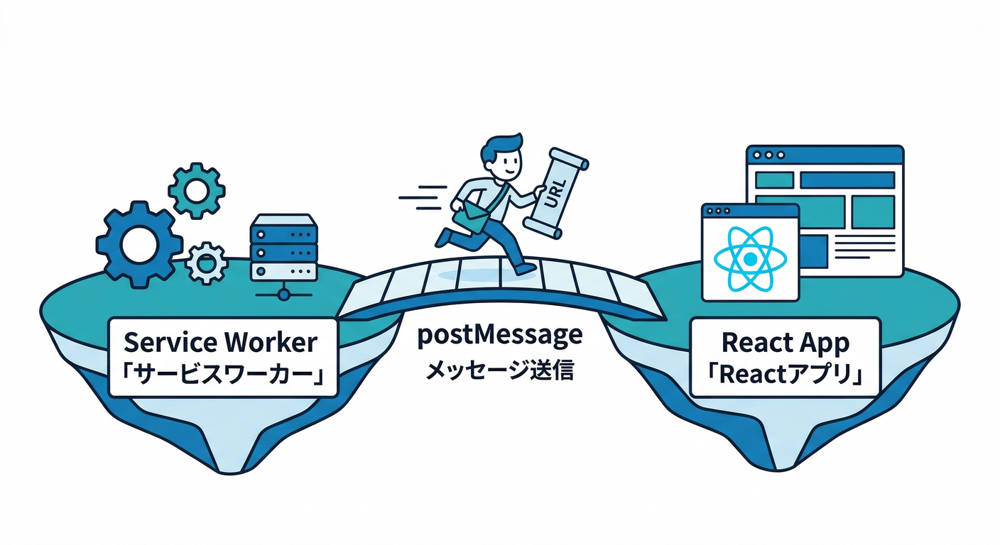
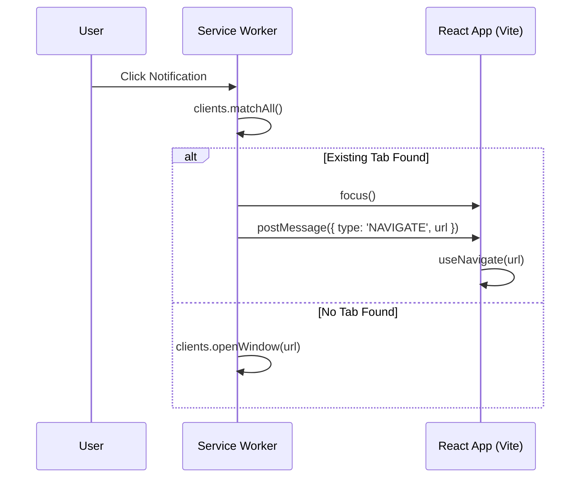
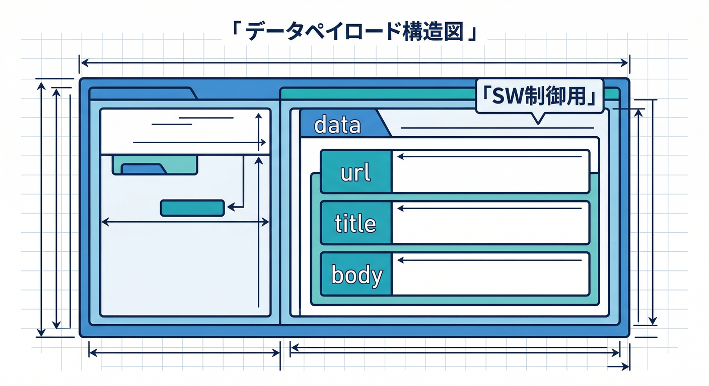
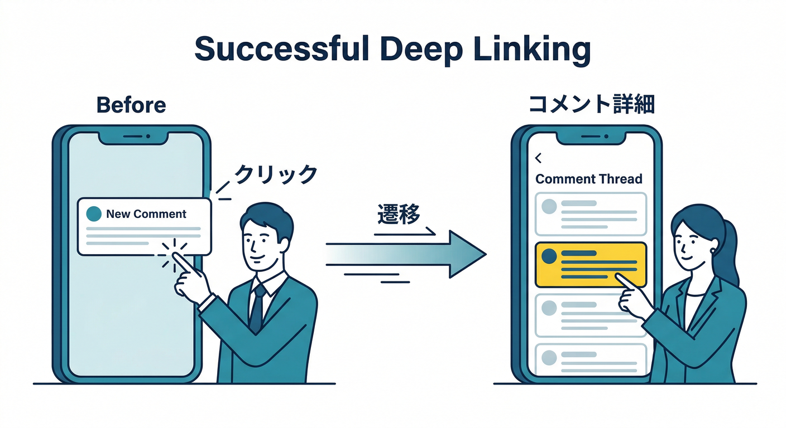

# 第10章：バックグラウンド受信（通知を表示してクリック対応）🔔👉

この章のゴールはこれ👇
**「アプリを閉じてても/別タブでも通知が出る」→「押したら“該当コメント”に飛べる」** を完成させることです✨
（しかも **“すでにタブが開いてる時”** もちゃんと狙った場所へ！）

---

## 読む（5分）📖✨ なにが難しいの？

## 1) バックグラウンドは Service Worker の世界🧑‍🚒



Web のプッシュ通知は、アプリ本体（React）が寝てる時は **Service Worker（SW）** が受けます。
FCM も Web ではこの SW に「バックグラウンド受信の入口」を用意します。([Firebase][1])

## 2) “クリックしたら遷移”は、実は罠がある🪤😵



FCM の `fcm_options.link` を使うと「クリックでページを開く/フォーカスする」まではやってくれます。
ただし **同じページがすでに開いていると、そのタブを前面に出すだけ** になりやすく、**「別ページ（コメント詳細）へ移動」が弱い**です。([Firebase][1])

さらに、クリック動作を自分でカスタムしたい時は超重要ポイント👇
**`notificationclick` を “FCM のライブラリを読み込む前” に書かないと、上書きされることがある**
…って公式がハッキリ注意しています。([Firebase][1])

## 3) “深い導線（コメントID付き）”は data を持たせるのが強い🔗🧩

* `data` メッセージは **`fcm_options.link` が使えない** ので、URL は `payload.data.url` などで渡して **SW で表示＆クリック処理** が王道です。([Firebase][1])
* クリック処理は `notificationclick` イベントで拾えます。([MDN ウェブドキュメント][2])

---

## 手を動かす（10分）🖱️🔥 “通知を出す→押したらコメントへ” を作る

ここでは **「firebase-messaging-sw.js」** を育てます🌱
（FCM はこのファイルが **ドメイン直下**にある前提で動きます）([Firebase][3])

---

## Step 1) `firebase-messaging-sw.js` に “クリック処理” を最初に書く🧷👆



ポイントは2つ👇

1. **最初に** `notificationclick` を登録（←超重要）([Firebase][1])
2. 既存タブがあれば **focus** して、SPA なら **postMessage** で「そのタブに遷移して！」を頼む（これが気持ちいい😆）

```js
// public/firebase-messaging-sw.js

// ✅ 1) クリック処理は “いちばん上” に置く（FCMに上書きされにくくする）
// 公式も「先に notificationclick を処理してね」と注意してるよ 🧯
self.addEventListener("notificationclick", (event) => {
  event.notification.close();

  const rawUrl = event.notification?.data?.url ?? "/";
  const url = new URL(rawUrl, self.location.origin).toString(); // 同一オリジンに寄せて安全に🛡️

  event.waitUntil(
    (async () => {
      // すでに開いてるタブを探す（なければ新規で開く）
      const windowClients = await clients.matchAll({
        type: "window",
        includeUncontrolled: true,
      });
```



```js
      for (const client of windowClients) {
        // 既存タブがある → まず前面へ
        if ("focus" in client) {
          await client.focus();

          // SPAなら “そのタブ側” に遷移をお願いする（フルリロードを避けやすい✨）
          client.postMessage({ type: "NAVIGATE", url });

          // もし postMessage を受け取らない構成なら、navigate() を使う手もある
          // await client.navigate(url);

          return;
        }
      }

      // タブが無い → 新しく開く
      await clients.openWindow(url);
    })()
  );
});
```

* `clients.matchAll()` は「同一オリジンのクライアントを列挙」できます。([MDN ウェブドキュメント][4])
* `clients.openWindow()` は「通知クリックから開く」が超定番です。([MDN ウェブドキュメント][5])
* 既存タブへ “移動” したい時は `WindowClient.navigate()` も使えます（ただしリロード寄り）。([MDN ウェブドキュメント][6])
* `focus()` は「そのタブを前面へ」。([MDN ウェブドキュメント][7])

---

## Step 2) 同じファイルで FCM のバックグラウンド受信 → showNotification🧑‍🚒🔔

次は “受信した payload から通知を作る” です。
公式は `onBackgroundMessage` → `self.registration.showNotification()` の流れを推しています。([Firebase][1])

```js
// public/firebase-messaging-sw.js（続き）

// ✅ 2) ここから下で FCM を読み込む（クリック処理より後ろ！）
importScripts("https://www.gstatic.com/firebasejs/10.13.2/firebase-app-compat.js");
importScripts("https://www.gstatic.com/firebasejs/10.13.2/firebase-messaging-compat.js");
// ↑ 公式サンプルではこの形式。数字は “使ってるSDKの版” に合わせてね。:contentReference[oaicite:12]{index=12}

firebase.initializeApp({
  apiKey: "YOUR_API_KEY",
  authDomain: "YOUR_AUTH_DOMAIN",
  projectId: "YOUR_PROJECT_ID",
  messagingSenderId: "YOUR_SENDER_ID",
  appId: "YOUR_APP_ID",
});

const messaging = firebase.messaging();

// ✅ 3) バックグラウンドで届いたら、通知を自前で作る
messaging.onBackgroundMessage((payload) => {
  console.log("[firebase-messaging-sw.js] background payload:", payload);

  // dataメッセージ想定：url / title / body を運ぶ
  const title =
    payload?.notification?.title ??
    payload?.data?.title ??
    "新しいコメント 📝";

  const body =
    payload?.notification?.body ??
    payload?.data?.body ??
    "コメントが追加されました！";

  const url = payload?.data?.url ?? "/";

  self.registration.showNotification(title, {
    body,
    icon: "/icons/icon-192.png",
    data: { url }, // 👈 クリック時に使う “深い導線” をここに入れる
  });
});
```

✅ これで、**バックグラウンド受信 → 通知表示 → data.url を持った通知** ができました！
`showNotification()` は SW 上で通知を出す正規APIです。([MDN ウェブドキュメント][8])

---

## Step 3) React 側で “NAVIGATE メッセージ” を受けてルーティングする⚛️📨➡️🧭





通知クリック → SW が `postMessage({type:"NAVIGATE", url})` を投げてます。
それを React 側で受け取って、ルータで移動します✨

（例：React Router を想定。ページ最上流のコンポーネントでOK）

```ts
// App.tsx など（ルーティングできる場所）

import { useEffect } from "react";
import { useNavigate } from "react-router-dom";

export function App() {
  const navigate = useNavigate();

  useEffect(() => {
    if (!navigator.serviceWorker) return;

    const handler = (event: MessageEvent) => {
      const { type, url } = (event.data ?? {}) as { type?: string; url?: string };
      if (type !== "NAVIGATE" || !url) return;

      // 同一オリジンだけ許可（安全）🛡️
      const u = new URL(url);
      if (u.origin !== window.location.origin) return;

      // SPAとして遷移（リロード無しで気持ちいい✨）
      navigate(u.pathname + u.search + u.hash);
    };

    navigator.serviceWorker.addEventListener("message", handler);
    return () => navigator.serviceWorker.removeEventListener("message", handler);
  }, [navigate]);

  return (
    // ... routes ...
    null
  );
}
```

これで、**「既存タブがある時」も“正しいコメントページ”に飛べる**ようになります🥳

---

## Step 4) 送信側（次章以降）に備えて payload 設計メモ🧠🗒️



この章で SW が期待するのは超シンプル👇

* `data.url`（例：`/posts/POST_ID?comment=COMMENT_ID`）
* `data.title` / `data.body`（通知文）
* 余裕があれば `data.commentId` など（将来の分析/ログ用）

FCM の公式も「data メッセージなら SW で通知を作れるよ」路線です。([Firebase][1])

---

## ミニ課題（5分）🎯🔥 “コメントID入りの深い導線” を完成させよう



1. `data` に `postId` と `commentId` を入れる
2. SW で `url` を組み立てる（例：`/posts/${postId}#comment-${commentId}`）
3. 通知クリックでそこへジャンプ✨

お手本の SW 側だけ👇

```js
const postId = payload?.data?.postId;
const commentId = payload?.data?.commentId;

const url =
  postId && commentId
    ? `/posts/${postId}#comment-${commentId}`
    : "/notifications";
```

---

## チェック（3分）✅👀 できたら勝ち！

* ✅ 通知が出る（アプリを見てない時に出る）
* ✅ 通知を押すと **正しいコメント** に飛べる
* ✅ すでにタブが開いてる時も **“フォーカスだけ” で終わらず**、目的地に行ける
* ✅ `notificationclick` がファイル上部にある（上書き回避）([Firebase][1])

---

## よくあるハマり（超ある）🧯😇

## ハマり1：クリック処理を書いたのに効かない😵

→ `notificationclick` が **FCM読み込みより後ろ**にあると、上書きされることがある（公式注意！）([Firebase][1])

## ハマり2：通知クリックで “タブは前に出る” のに “ページが変わらない”🤔

→ `fcm_options.link` の仕様として **既存タブがあれば前面化**が優先されがち。
深い導線は `data.url` + `notificationclick`（この章の方式）で安定しやすいです。([Firebase][1])

## ハマり3：タブが見つからない扱いになって毎回新規タブが増える🫠

→ `clients.matchAll({ includeUncontrolled: true })` を付けると改善することが多いです。([MDN ウェブドキュメント][4])

---

## AI活用（この章でもちゃんと効く）🤖✨

## ✅ Gemini CLI：SW の安全強化を一気にやる🔧

例：

* 「`data.url` が外部URLだったら捨てる」
* 「`postId/commentId` の時だけ組み立てる」
* 「ログを見やすくする」

…みたいな “地味に大事” を、AIにまとめてやってもらうのが速いです💨

## ✅ Firebase AI Logic：通知文は “送信側” で賢く作るのが正解📝⚡

SW は基本「通知を出す係」なので、**文面生成は Cloud 側で作って payload に詰める**のが安全で楽です。
この教材の後半（第18章以降）で、AI Logic を使って「短く・安全に・要点だけ」に整えるのに繋がります🤖🧼

---

必要なら、あなたのアプリのルーティング（コメントページのURL設計：`/posts/:id#comment-...` なのか `?comment=` なのか）に合わせて、**“最短でバグらないURL形式”**に寄せた完成版の `firebase-messaging-sw.js` も出しますよ🔧✨

[1]: https://firebase.google.com/docs/cloud-messaging/web/receive-messages "Receive messages in Web apps  |  Firebase Cloud Messaging"
[2]: https://developer.mozilla.org/ja/docs/Web/API/ServiceWorkerGlobalScope/notificationclick_event?utm_source=chatgpt.com "ServiceWorkerGlobalScope: notificationclick イベント - Web API"
[3]: https://firebase.google.com/docs/cloud-messaging/web/get-started "Get started with Firebase Cloud Messaging in Web apps"
[4]: https://developer.mozilla.org/en-US/docs/Web/API/Clients/matchAll?utm_source=chatgpt.com "Clients: matchAll() method - Web APIs - MDN - Mozilla"
[5]: https://developer.mozilla.org/en-US/docs/Web/API/Clients/openWindow?utm_source=chatgpt.com "Clients: openWindow() method - Web APIs - MDN Web Docs"
[6]: https://developer.mozilla.org/en-US/docs/Web/API/WindowClient/navigate?utm_source=chatgpt.com "WindowClient: navigate() method - Web APIs - MDN Web Docs"
[7]: https://developer.mozilla.org/en-US/docs/Web/API/WindowClient/focus?utm_source=chatgpt.com "WindowClient: focus() method - Web APIs - MDN Web Docs"
[8]: https://developer.mozilla.org/ja/docs/Web/API/ServiceWorkerRegistration/showNotification?utm_source=chatgpt.com "ServiceWorkerRegistration.showNotification() - Web API | MDN"
