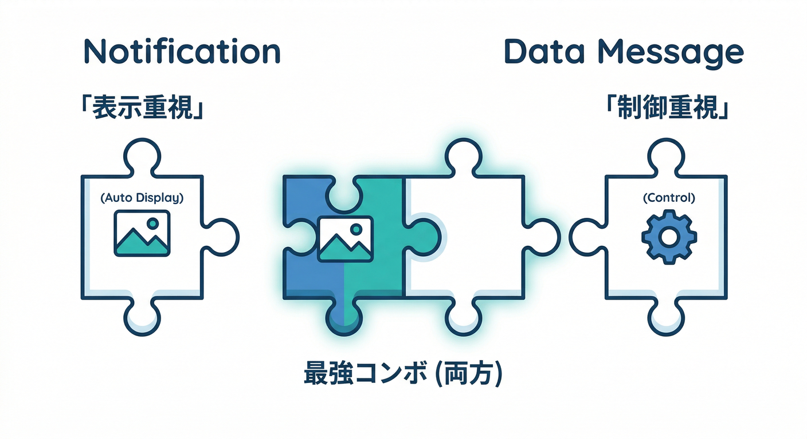
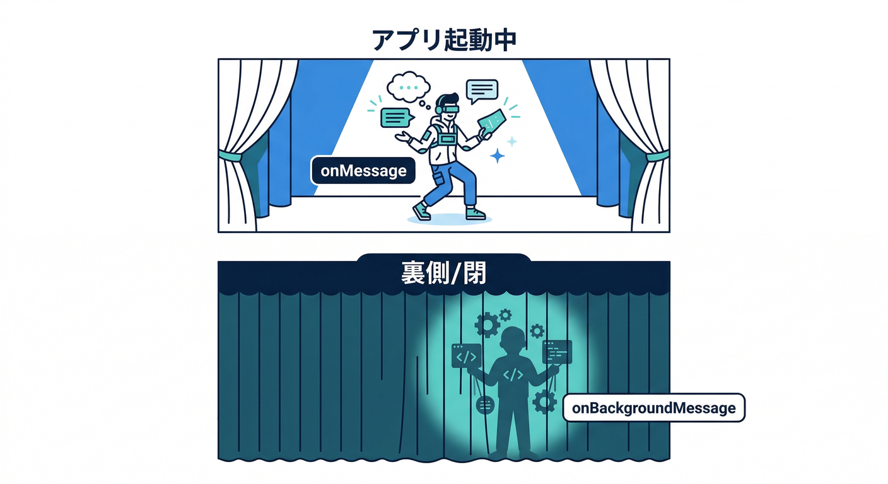
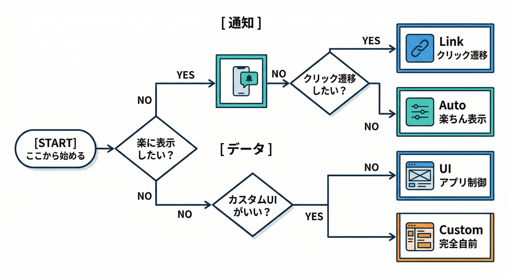
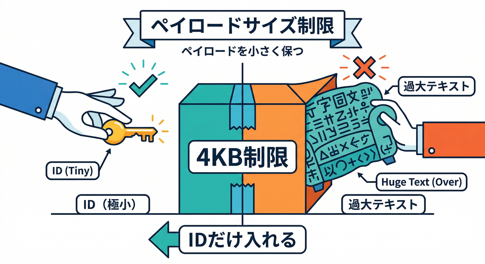
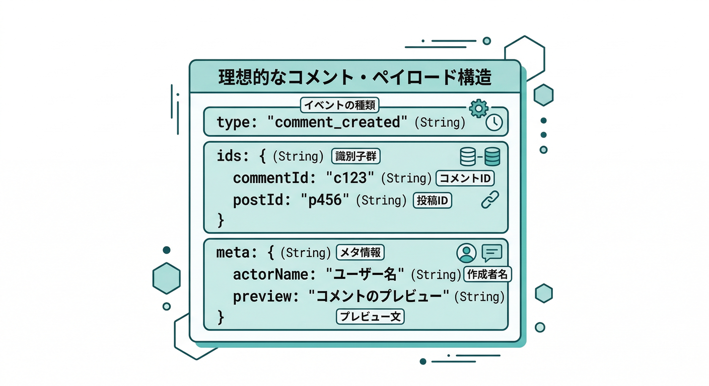
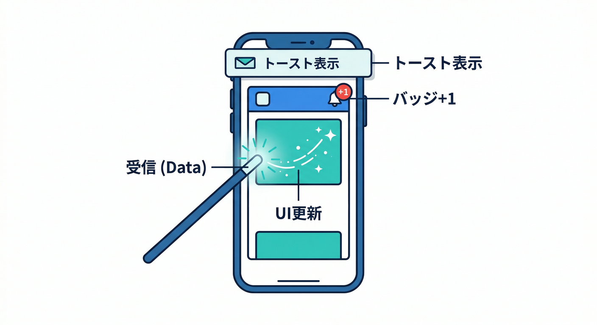
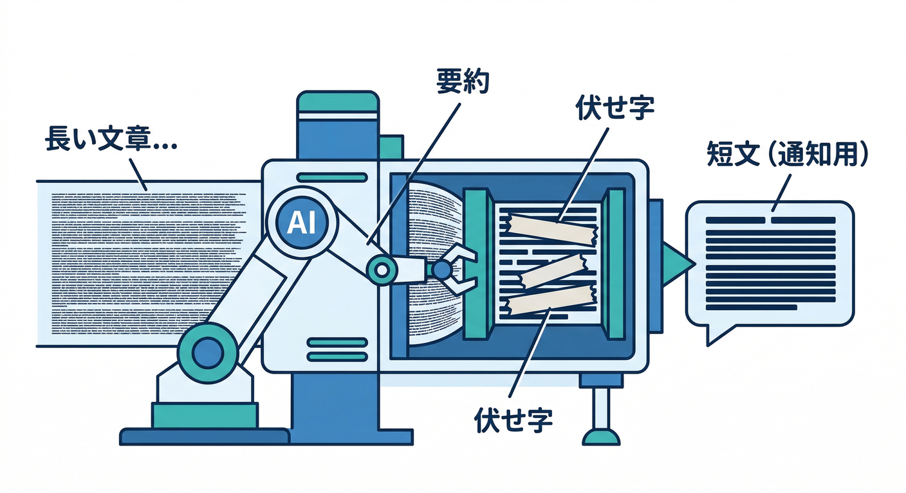

# 第11章：通知の種類（notification/data）を使い分ける🧩⚖️

この章はひとことで言うと、**「通知を“勝手に出してほしい”のか、アプリで“握って制御したい”のか**を決めて、FCMの `notification` と `data` を上手に混ぜる回です🔔🧠

---

## 1) まず結論：迷ったら「notification + data」からでOK🙆‍♀️✨



FCMのメッセージは大きく2種類です👇

* **notification**：OS/ブラウザが“通知表示”を助けてくれる（楽ちん）🔔
* **data**：アプリが“中身をどう扱うか”自由に決められる（強い）🧩

そして重要ポイント：

* **最大サイズは両方とも 4096 bytes（約4KB）**（ただしコンソール送信は **1000文字制限**あり）([Firebase][1])
* **notification + data を両方入れる**と、

  * **フォアグラウンド**：アプリが両方の中身を受け取って自由に処理できる
  * **バックグラウンド**：通知は表示されて、**dataは“タップされた時”に扱われる**（この性質を利用すると気持ちいい）([Firebase][1])

---

## 2) Web（React）での挙動：ここだけは覚えて勝ち🏆🌐



Webは「タブが前にあるかどうか」で挙動が分かれます👀

* **前（フォアグラウンド）**：ページ側の `onMessage` が受ける📩
* **裏/閉じてる（バックグラウンド）**：Service Worker 側の `onBackgroundMessage` が受ける🧑‍🚒

しかもWebは、**notification か “両方” のメッセージだと通知が自動表示されやすい**、という強い特徴があります（データだけだと“自分で通知表示”が必要になることが多い）([Firebase][2])

さらにWebだけの超実用ポイント👇

* 通知クリックでアプリに戻すリンクは **`webpush.fcm_options.link`** が便利🧷
* でも **dataメッセージ単体は `fcm_options.link` をサポートしない**ので、

  * **dataにも通知を付ける**（＝notification + data）
  * もしくは **Service Worker で showNotification を自前実装**
    のどっちかが王道です🧠([Firebase][2])

---

## 3) 使い分けの判断表🗺️🧩



| やりたいこと                         | おすすめ                                             | 理由                           |
| ------------------------------ | ------------------------------------------------ | ---------------------------- |
| とにかく通知を出したい（最短）                | notificationのみ                                   | 表示はおまかせで楽🔔                  |
| 通知クリックで“特定ページ”へ飛ばしたい（Web）      | notification + data + `webpush.fcm_options.link` | 自動表示＋リンクが強い🧷([Firebase][2]) |
| 画面内のUI更新（バッジ/トースト/一覧差し替え）もやりたい | notification + data（or dataのみ）                   | dataがあると制御できる🧠              |
| 通知表示の見た目/条件を“完全に自前”で握りたい       | dataのみ + SWで通知表示                                 | 代わりに実装が増える🧑‍🚒              |

---

## 4) payload設計のコツ：4KBに勝つ🥊📦



**通知は短距離走**です🏃💨
4KB制限があるので（しかもJSONは意外と膨らむ）、やることはだいたいこれ👇

* ✅ 通知に入れるのは **タイトル/本文（短い）**
* ✅ dataに入れるのは **“あとで取りに行けるID”**（例：`commentId`, `postId`）
* ✅ 詳細本文は **Firestoreから取りに行く**（通知は“入口”）🚪🗃️

そして地味に大事👇
**dataの値は「文字列だけ」**が基本です（キーも値もstring）([Firebase][3])
なので、数値やbooleanを入れたい時は `"1"` / `"true"` みたいに文字列化します🙂

---

## 5) 今回の題材：コメント通知の“いい感じpayload”例📝🔔



**目標**：「通知として見える」＋「アプリがわかる情報も持ってる」✨

**dataに入れたい最小セット（おすすめ）**👇

* `type`: `"comment_created"` みたいなイベント種別
* `commentId`: FirestoreのコメントID
* `postId`: 親（記事/投稿）ID
* `url`: クリック後に開きたいURL（Webで超便利）
* `actorName`: 誰がコメントしたか（表示用）
* `preview`: 本文の短い抜粋（短く！）

---

## 6) 手を動かす①：TypeScriptでpayload型を作る🧱✨

「文字列しか来ない」前提で型を作ると、事故が減ります🧯

```ts
// FCM data payload（全部 string）
export type CommentNotifyData = {
  type: "comment_created";
  commentId: string;
  postId: string;
  url: string;        // 例: "/posts/abc#comment-xyz"
  actorName: string;  // 例: "こみやんま"
  preview: string;    // 例: "いい感じ…"
};
```

---

## 7) 手を動かす②：React（フォアグラウンド）で受け取ってUI更新📲✨



フォアグラウンドでは `onMessage` が来ます📩([Firebase][2])
やりたいのはこの2つ👇

* トーストを出す🍞✨
* 画面の未読バッジやコメント一覧を更新する🧷

```ts
import { getMessaging, onMessage } from "firebase/messaging";

const messaging = getMessaging();

onMessage(messaging, (payload) => {
  // payload.data があれば、ここでUI更新できる
  const data = payload.data as unknown as Partial<Record<string, string>>;

  if (data?.type === "comment_created") {
    // 例：トースト表示（あなたのUI実装に合わせて）
    console.log("コメント通知:", data.actorName, data.preview);

    // 例：必要なら Firestore から commentId で詳細取得 → 状態更新
  }
});
```

ポイント：`notification` の見た目はOS/ブラウザ任せになりがちなので、**アプリ内の気持ちよさ（トースト/バッジ）は data で作る**のがコツです😄

---

## 8) 手を動かす③：Service Worker（バックグラウンド）側の考え方🧑‍🚒🔔

バックグラウンドでは `onBackgroundMessage` が重要です🧩([Firebase][2])

* `notification` が付いてると **通知が自動表示されやすい**
* `data` だけだと **自分で通知を出す実装**が必要になることが多い

なので最初は **notification + data**にしておくとラクです😇([Firebase][2])

（もし data-only で“自前通知”したいなら、SWで `showNotification` を書く形になります🛠️）

---

## 9) 送信側のイメージ：notification + data + Webリンク🧷📤

Webだと **`webpush.fcm_options.link`** がかなり効きます（通知クリックでタブを前に出したり、新規タブで開いたり）([Firebase][2])

送信は信頼できる場所（Admin SDK / HTTP v1）からが基本です([Firebase][1])
ランタイムの目安としては：

* Functions（Firebase）のNodeは **22 / 20** がフルサポートで、**18はdeprecated**([Firebase][4])
* もし Cloud Run functions で言語を選ぶなら **.NET 8** や **Python 3.13** がGAになっています([Google Cloud Documentation][5])

---

## 10) ミニ課題：payload設計メモを作る（短く！）📝🎯

次の3点を1枚にまとめてください👇（箇条書きでOK）

1. **通知で見せる情報**（title/body に何を入れる？）🔔
2. **dataで渡す最小キー**（ID中心になってる？）🗝️
3. **4KBを超えそうな要素**（本文丸ごと入れてない？）🧯

---

## 11) AI活用：4KBと“短く伝わる通知文”の最強コンボ🤖✂️✨



通知文って、長いと読まれないし、4KBも食います😇
ここはAIがめちゃ得意です🔥

* Firebase AI Logic は、アプリから Gemini/Imagen を安全に使う入口として整理されています🧠([Firebase][6])
* 例えばコメント本文を「短い通知文（個人情報っぽい部分は伏せる）」に整形して、**title/body を圧縮**できます✂️📩

さらに、開発中の“作業支援”はこう👇

* Antigravity は「エージェントが計画→実装→検証」まで回す思想の開発基盤として説明されています🛸([Google Codelabs][7])
* Gemini CLI も Cloud Shell などで使える導線が整理されています💻✨([Google Cloud Documentation][8])

この章でのAIの使いどころは超シンプルでOK👇

* ✅ **通知文を短くする**（title 30文字、body 60文字…みたいな制約を守る）
* ✅ **payloadのキーを削る提案**をさせる（4KB節約）
* ✅ **“安全に出していい情報か”チェック**をさせる（個人情報っぽいのを伏せる）

---

## 12) チェック✅（理解できたら勝ち🎉）

* ✅ 「通知を勝手に出したい」＝ `notification`、 「アプリで制御したい」＝ `data` って言える？([Firebase][1])
* ✅ Webで `webpush.fcm_options.link` が便利で、data-only だと制約があるのを理解した？([Firebase][2])
* ✅ 4KB制限を意識して「IDだけ渡して詳細はFirestore」が言える？([Firebase][1])
* ✅ dataの値は基本 string しか入れない設計になってる？([Firebase][3])

---

次の第12章（テスト送信🧪🎯）に行く前に、今の段階では **「notification + data で送ると、フォアでUI更新できて、バックで通知も出せる」** って感覚が掴めてればOKです😄🔔✨

[1]: https://firebase.google.com/docs/cloud-messaging/customize-messages/set-message-type "Firebase Cloud Messaging message types"
[2]: https://firebase.google.com/docs/cloud-messaging/web/receive-messages "Receive messages in Web apps  |  Firebase Cloud Messaging"
[3]: https://firebase.google.com/docs/reference/admin/node/firebase-admin.messaging "firebase-admin.messaging package  |  Firebase Admin SDK"
[4]: https://firebase.google.com/docs/functions/manage-functions?utm_source=chatgpt.com "Manage functions | Cloud Functions for Firebase - Google"
[5]: https://docs.cloud.google.com/functions/docs/release-notes "Cloud Run functions (formerly known as Cloud Functions) release notes  |  Google Cloud Documentation"
[6]: https://firebase.google.com/docs/ai-logic "Gemini API using Firebase AI Logic  |  Firebase AI Logic"
[7]: https://codelabs.developers.google.com/getting-started-google-antigravity "Getting Started with Google Antigravity  |  Google Codelabs"
[8]: https://docs.cloud.google.com/gemini/docs/codeassist/gemini-cli "Gemini CLI  |  Gemini for Google Cloud  |  Google Cloud Documentation"
