# 第12章：テスト送信（コンソールからまず当てる）🧪🎯

この章は「**まず1回、確実に“届く”を作る**」がゴールです🙌
コード送信（Admin SDK / HTTP v1 / Functions）に入る前に、**Firebaseコンソールから“端末トークン宛”に当てて**、受信側（ブラウザ通知・Service Worker・権限）の最低ラインを固めます💪([Firebase][1])

---

## ✅ 今日のゴール（できたら勝ち）🏁✨

* ✅ Firebaseコンソールから「**Send test message**」で、**自分のFCMトークン**に通知を飛ばせる([Firebase][1])
* ✅ 「届かない」を、**原因の種類ごとに切り分け**できる（権限 / トークン / SW / 送信設定）🧯
* ✅ ついでにAI（Gemini）で、切り分けのスピードを爆上げする🤖⚡

---

## 読む（5分）📖🧠

## 1) なんで“コンソール送信”が最初に強いの？🧩

いきなりコードで送ると、**「送信コードが悪いのか？」「受信が悪いのか？」**が混ざって沼りがちです😵‍💫
コンソールのテスト送信なら、送信側の実装を一旦忘れて **“届くかどうか”だけ**に集中できます🧪([Firebase][1])

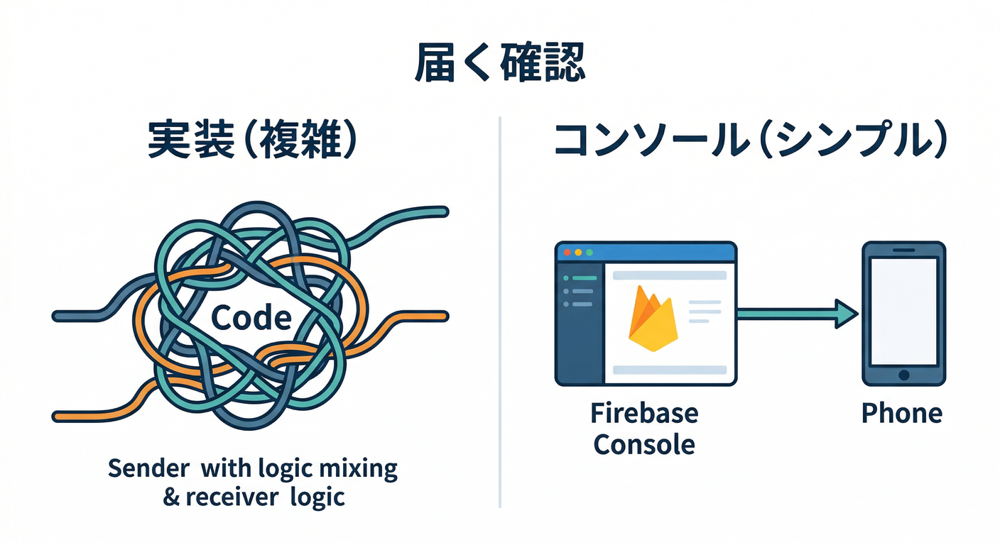

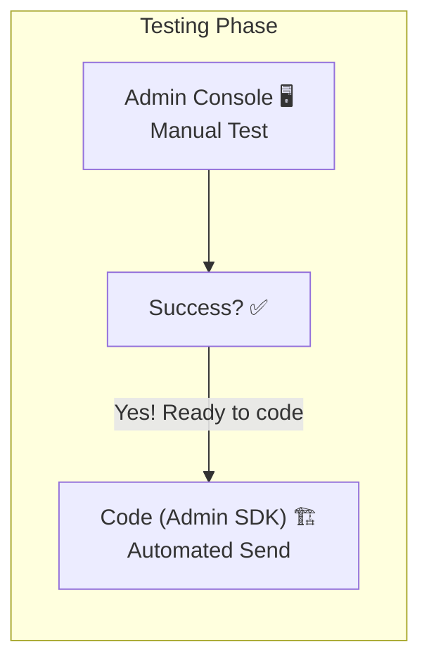

## 2) Web通知は「前面」と「背面」で動きが変わるよ🔁

Web（React）だと、ざっくり👇の2つに分かれます。

* **フォアグラウンド（画面見てる）**：アプリ内で受け取りやすい（`onMessage`など）📲
* **バックグラウンド（別タブ/最小化）**：**Service Worker**が超重要。通知表示もここが主役🧑‍🚒([Firebase][2])

そして公式のテスト手順でも「**アプリをバックグラウンドにして**」って書いてあります。ここ、地味に大事です😌([Firebase][1])

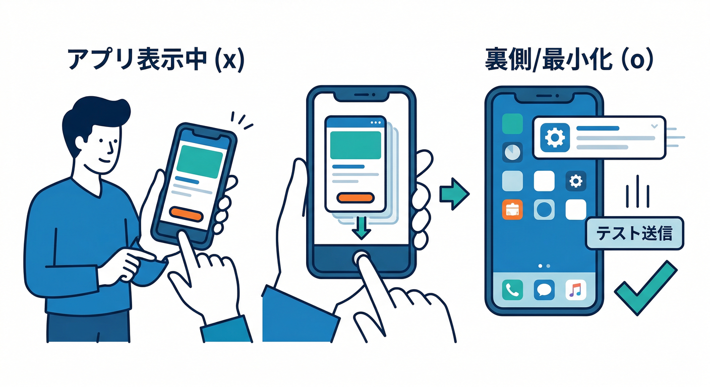

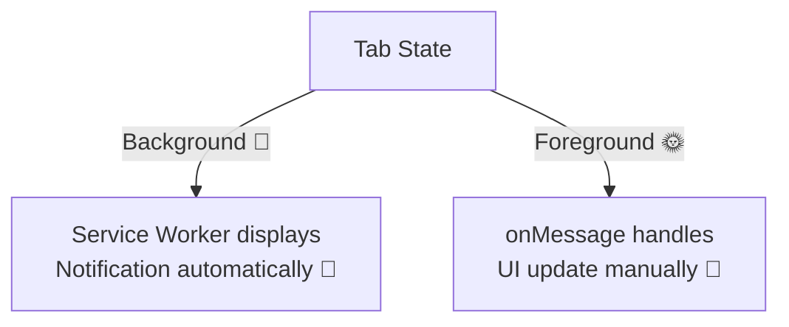

## 3) 送る内容の“サイズ制限”も軽く意識👀

FCMメッセージは用途で `notification / data` を使い分けます🧩([Firebase][3])
さらに **コンソール送信は本文が1000文字まで**、みたいな“コンソール特有の制限”もあります（まずは短文でOK）✂️([Firebase][3])

---

## 手を動かす（10分）🖱️🔥

## 手順A：トークンを“コピペできる状態”にする📋🔑

この章では **「今このPCのこのブラウザ」**のFCMトークンが必要です。
（前の章でFirestoreに保存しているなら、そこからコピーでOK👍）

もし「どこにも表示してない…！」なら、開発中だけUIに出すのが手っ取り早いです👇

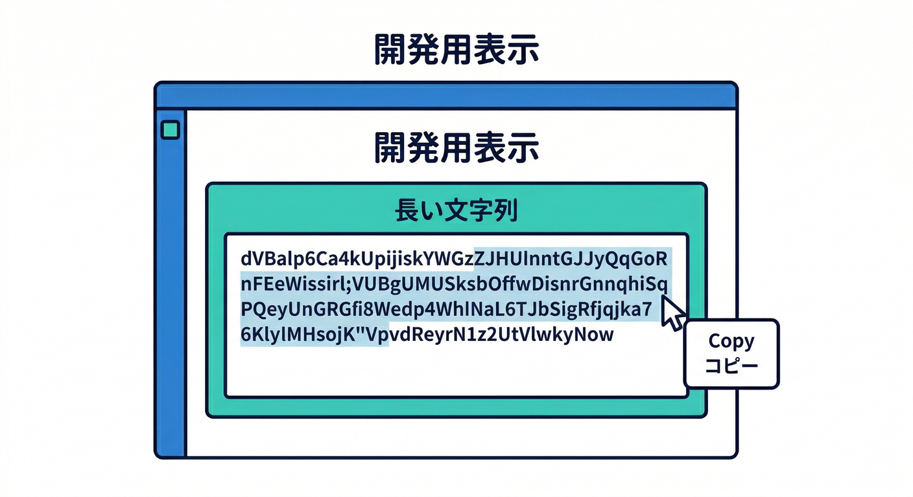

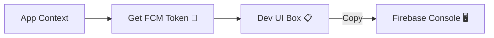

```tsx
// 例：開発用に token を画面に出す（本番では消すの推奨）
export function DevTokenBox({ token }: { token: string | null }) {
  if (!token) return <div>token まだ取れてないかも…</div>;
  return (
    <div style={{ padding: 12, border: "1px solid #ccc" }}>
      <div>FCM Token（開発用）</div>
      <textarea readOnly value={token} style={{ width: "100%", height: 120 }} />
    </div>
  );
}
```

## 手順B：Firebaseコンソールから「Send test message」する📨🧪

公式の流れはこの通りです（ほぼそのままやればOK）👇([Firebase][1])

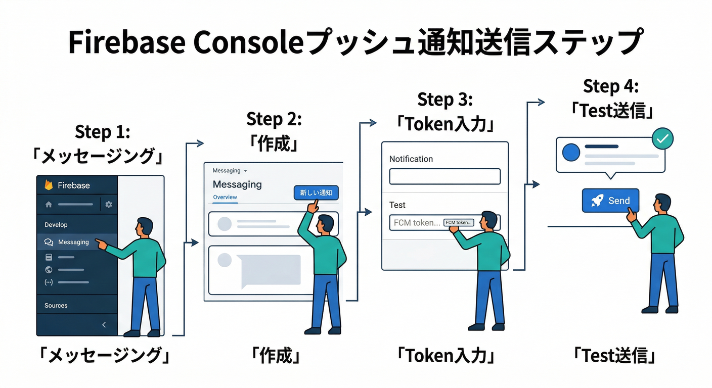

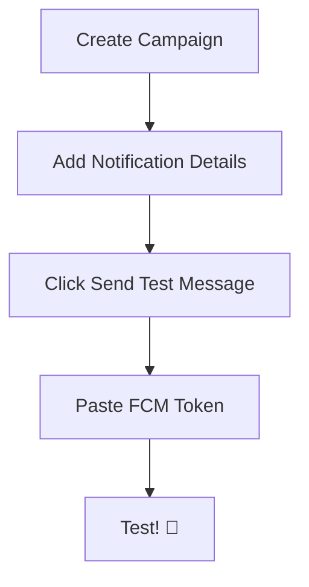

1. アプリを起動して、通知許可が通っている状態にする🔔
2. **アプリをバックグラウンドにする**（別タブに移動 or 最小化でOK）🪟([Firebase][1])
3. Firebaseコンソールの **Messaging** を開く🧭([Firebase][1])
4. 初回なら **Create your first campaign** → **Firebase Notification messages** を選ぶ🆕([Firebase][1])
   2回目以降なら **Campaigns** → **New campaign** → **Notifications** を選ぶ📝([Firebase][1])
5. タイトル/本文を入れる（まず短く！）✍️
6. 右ペインの **Send test message** を押す🧪([Firebase][1])
7. **Add an FCM registration token** にトークンを貼る📋([Firebase][1])
8. **Test** を押す🚀([Firebase][1])

👉 成功すると「バックグラウンドにいる端末」で通知が来ます🔔✨([Firebase][1])

## 手順C：届いたら“クリック→どこに飛ぶ？”まで軽く見る👆🧭

通知は「届いた」で終わりじゃなくて、**押したあとが本番**です。
ただしリンク（click action）周りは **HTTPSのURLだけ対応**みたいな注意もあるので、ここは後の章で詰めます🔒([Firebase][4])

---

## 届かない時の“最短切り分け”🧯⚡（ここ超重要）

「届かない」はだいたい **4系統**に分かれます👇
まずは上から順に潰すと速いです🏎️💨

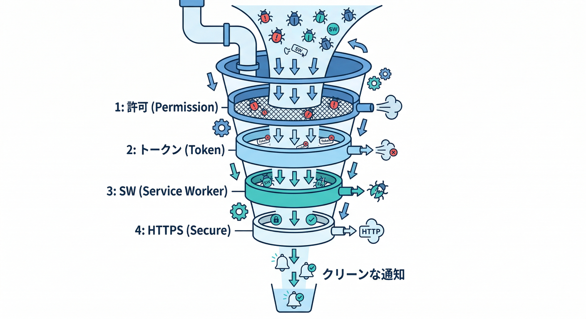

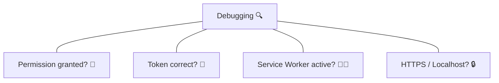

## ① 許可（Permissions）がブロックされてる🙅‍♂️🔔

ブラウザの通知許可が `granted` じゃないと、そもそも勝てません。

```ts
console.log(Notification.permission); // "granted" になってる？
```

* `denied`：ブラウザ設定でブロック中（サイト設定を見直す）⚙️
* `default`：まだ許可してない（“ボタン押した時だけ許可”のUXにするのが王道）🙂([Firebase][5])

## ② トークンが違う / 古い / コピペ事故😵‍💫📋

* 余計な空白が入ってない？（改行も）
* そのPC・そのブラウザのトークン？（別ブラウザのを貼ってない？）
* 端末を変えた / クリアした / 再インストールでトークンが変わってない？（トークンは変わり得ます🌀）

## ③ Service Worker が動いてない🧑‍🚒🧯

Web受信は **Service Workerが主役**です。ここが止まってると通知が死にます💥([Firebase][2])
DevTools の **Application → Service Workers** で、登録されてるか確認すると早いです👀

また、FCMのWeb手順ではトークン取得に `vapidKey` を使う例が出てきます（ここが抜けてても詰みがち）🔑([Firebase][1])

## ④ “安全なコンテキスト”じゃない（HTTPS/localhost問題）🔒🌐

Service Worker 自体が **HTTPS（またはlocalhost）前提**なので、そこを外すと動きません。
「localhostだと動くのに、公開環境で死ぬ」系はここが多いです😇([Software Engineering Stack Exchange][6])

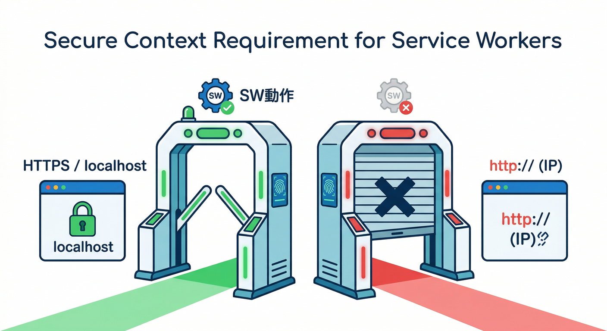

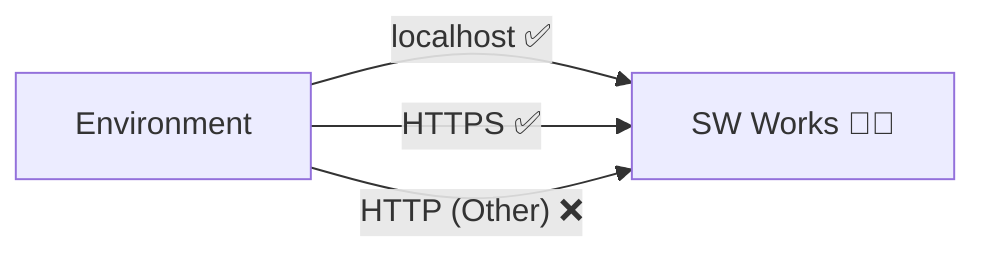

---

## Gemini（AI）で“届かない”を秒速で潰す🤖⚡

ここ、AI導入済みの強みです✌️
ログや状況を渡して「**原因候補→次の確認手順**」を出させると、デバッグがめちゃ速くなります💨

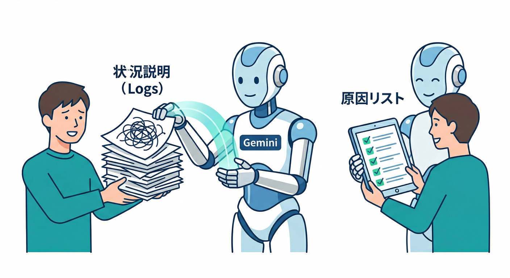

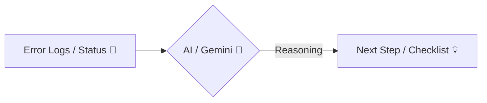

## ① Gemini CLI に相談する（状況をそのまま投げる）💻✨

例：こんな感じで「現象」と「確認済み」を箇条書きで渡すと強いです。

```bat
gemini --prompt "FCM Webのテスト通知が届きません。状況: Notification.permission=granted。FCMトークンは取得済みでコピペ。FirebaseコンソールのSend test messageでTest実行。Chrome/Edge。Service Worker登録状況の確認ポイントと、次に見るべきDevToolsの場所、ありがちな原因を優先度順に教えて。"
```

## ② さらに踏み込む：Firebase CLI の “AI連携”ネタ🧠🔌

最近のFirebase CLIには **AIアシスタントがFirebaseリソースとやり取りするための `firebase experimental:mcp`** が追加されています（AIで調査・点検の導線が増えてきてる感じ）🧪🧠([Firebase][7])
※この章では「知っておくと得」くらいでOK。次の章以降で効いてきます💡

---

## ミニ課題（5分）🎯📝

「届かなかった時の原因候補」を **3つ**、あなたの状況に合わせて書いてみてください✍️
例）

* ブラウザ通知がブロックされていた
* 貼ったトークンが別ブラウザのものだった
* Service Workerが未登録（or scope違い）だった

できたら、その3つを Gemini に投げて「どれから確認すべき？」って聞くと最短です🤖⚡

---

## チェック（理解確認）✅✅✅

* ✅ Firebaseコンソールの **Send test message** でトークン宛に送れる手順を言える([Firebase][1])
* ✅ 「バックグラウンドでテスト」が大事な理由を説明できる([Firebase][1])
* ✅ 届かない時に **許可→トークン→SW→HTTPS** の順で切り分けできる🧯([Software Engineering Stack Exchange][6])

---

## 次章へのつながり（ちょい予告）📌

次は「送信サーバー側（Admin SDK / HTTP v1 / Functions）」に入ります🏗️📤
Functionsに行くと Node.js も **22/20** が主役になってくるので、その辺も“最新前提”で進められます🚀([Firebase][8])

[1]: https://firebase.google.com/docs/cloud-messaging/web/get-started "Get started with Firebase Cloud Messaging in Web apps"
[2]: https://firebase.google.com/docs/cloud-messaging/web/receive-messages "Receive messages in Web apps  |  Firebase Cloud Messaging"
[3]: https://firebase.google.com/docs/cloud-messaging/customize-messages/set-message-type?utm_source=chatgpt.com "Firebase Cloud Messaging message types - Google"
[4]: https://firebase.google.com/docs/cloud-messaging/web/receive-messages?utm_source=chatgpt.com "Receive messages in Web apps | Firebase Cloud Messaging"
[5]: https://firebase.google.com/docs/cloud-messaging/understand-delivery?utm_source=chatgpt.com "Understanding message delivery | Firebase Cloud ... - Google"
[6]: https://softwareengineering.stackexchange.com/questions/378644/push-notifications-fcm-https-issue?utm_source=chatgpt.com "Push Notifications : FCM : Https Issue"
[7]: https://firebase.google.com/support/release-notes/cli "Firebase CLI Release Notes"
[8]: https://firebase.google.com/docs/functions/manage-functions "Manage functions  |  Cloud Functions for Firebase"
