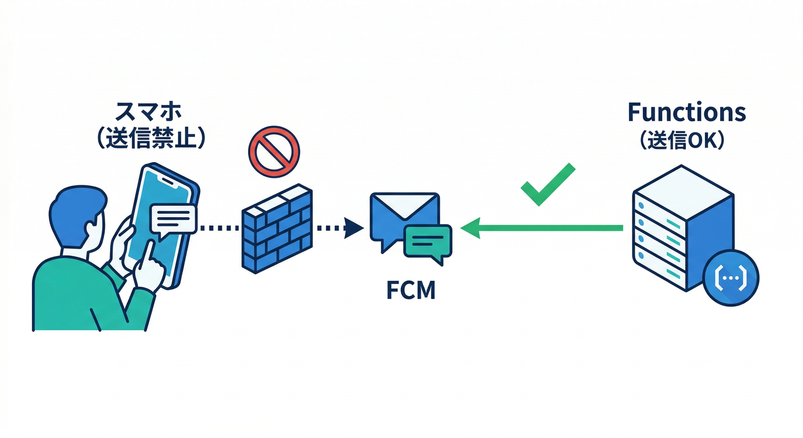
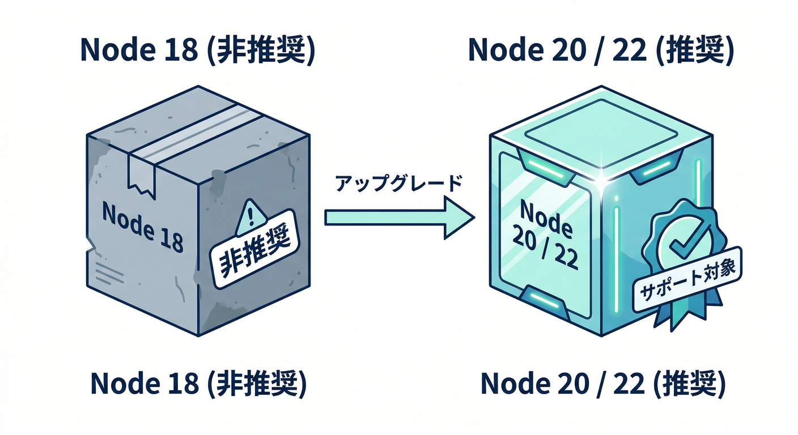
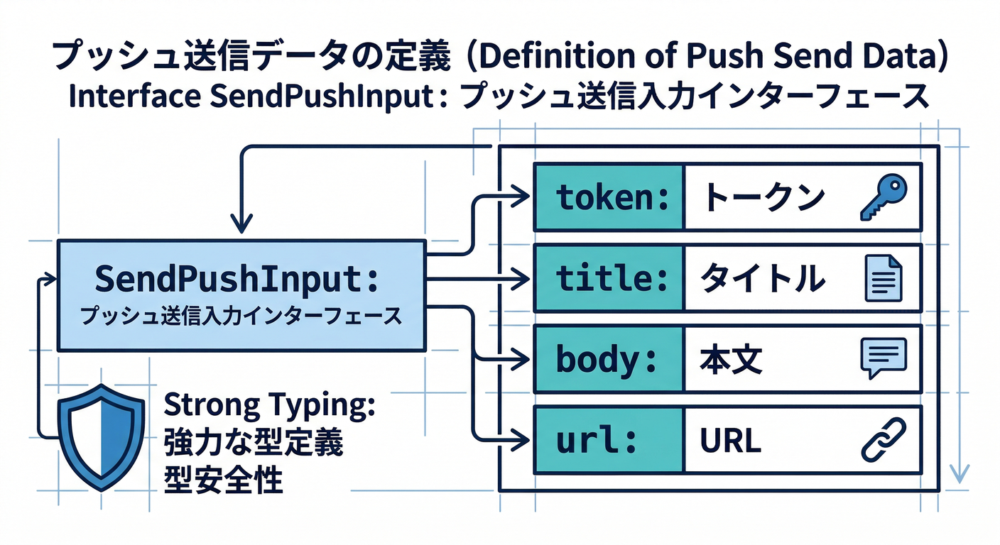
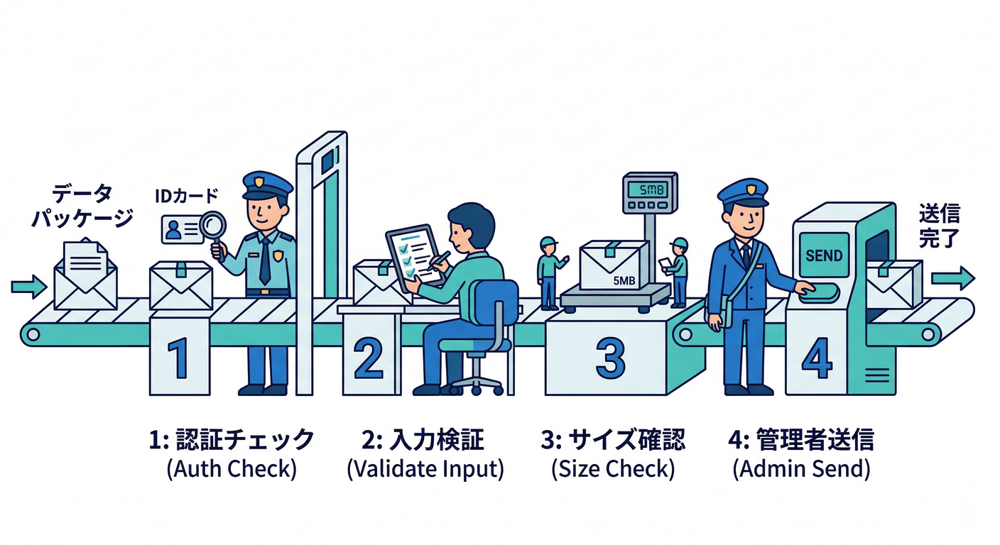
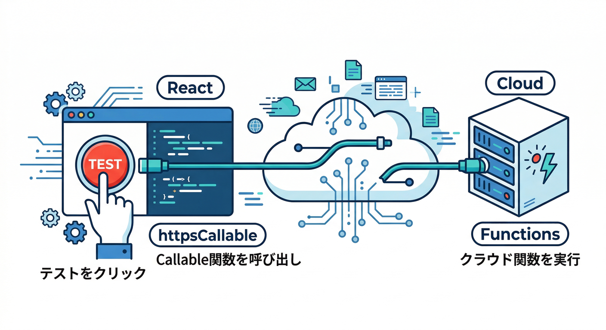
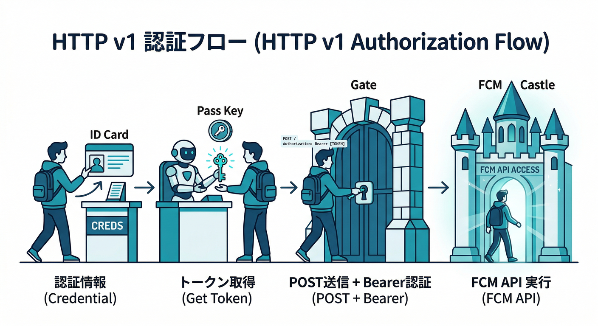
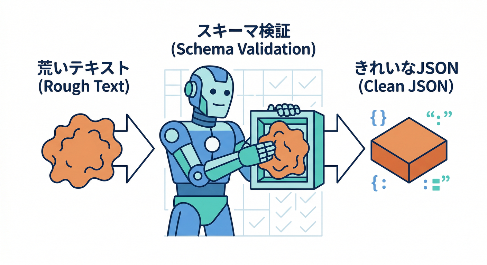

# 第13章：送信サーバーの基本（Admin SDK / HTTP v1）🏗️📤

この章でできるようになること🎯

* 「通知を送るのはサーバーだけ！」を守りつつ、**Functionsから安全にPush送信**できる✅
* 送信方法の2択（**Admin SDK** / **HTTP v1**）がスッと選べる🧠
* 「to（宛先）/ タイトル / 本文 / URL」を**型（TypeScript）で一発管理**できる🧩
* AIで「短く伝わる通知文」を作る入口も作れる🤖✨（本格運用は後章で育てる）

---

## 1) 読む📖：送信は「信頼できる場所」からだけ🧯

## まず大原則：クライアントから送らない🙅‍♂️

FCMは便利だけど、もしブラウザやアプリ（クライアント）から直接送れる設計にすると、**誰でも通知を乱発できる危険**が出ます。だから送信は、Cloud Functions などの「信頼できる環境」からやるのが基本です📌 ([Firebase][1])



---

## 送信手段は2つ（どっちも “v1 前提”）⚖️

* **① Firebase Admin SDK（おすすめ）**
  送信の面倒（認証や形式）をライブラリがやってくれる✨
  Node/TypeScriptで一番ラク＆事故りにくいです。 ([Firebase][2])

* **② FCM HTTP v1 API（プロトコル直叩き）**
  仕組みを理解したい・他言語（.NET/Python）で送りたい時の土台になる🧱
  送信先は `projects/*/messages:send` で、OAuth2（アクセストークン）で叩きます。 ([Firebase][3])

さらに大事：**旧レガシーAPIは卒業**（v1へ移行が前提）🚪➡️🚀 ([Firebase][4])

---

## メッセージの形：notification / data 🧩

* `notification`：OSが「通知表示」しやすい（見せる通知向き）🔔
* `data`：アプリ側で解釈して動く（画面遷移・内部処理向き）📦
  基本は **最大 4096 bytes** を意識（大きすぎると弾かれます）📏 ([Firebase][1])

---

## FunctionsのNodeランタイムも最新に🧠⚙️

Functions（Firebase）では **Node.js 22 / 20 がサポート**され、**Node.js 18 は deprecated（非推奨）**扱いです。 ([Firebase][5])



（教材的にも、ここは最新寄せでいきます🚀）

---

## 2) 手を動かす🖱️：Functionsで「テスト送信API」を作る🧪📤

ここでは **Admin SDK** で、最小の「送信ボタン用API」を作ります✅
（後章で Firestoreトリガー送信に育てる⚡）

---

## Step A：Functions側の準備📦

`functions/` ディレクトリがある前提で、依存を入れます。

```bash
cd functions
npm i firebase-admin firebase-functions
```

Nodeの指定（例：22）も入れておくと安心です🧷

```json
// functions/package.json（一部）
{
  "engines": { "node": "22" }
}
```

> もし「Cloud Messaging API が無効だよ」系で怒られたら、Google Cloud側で Cloud Messaging API を有効化する導線が公式に案内されています🔧 ([Firebase][2])

---

## Step B：送信入力を“型”にする🧩（これが後で効く）

今回の送信は「最低限これだけ」で十分👇



* token（宛先：端末トークン）
* title / body（通知文）
* url（クリック後に飛ばしたいURL）
* data（アプリで使う追加情報）

---

## Step C：Functions実装（onCall）📞✨



```ts
// functions/src/index.ts
import { onCall, HttpsError } from "firebase-functions/v2/https";
import { initializeApp } from "firebase-admin/app";
import { getMessaging } from "firebase-admin/messaging";

initializeApp();

type SendPushInput = {
  token: string;
  title: string;
  body: string;
  url?: string;
  data?: Record<string, string>;
};

// UTF-8のバイト数（4096 bytes制限チェック用）
function bytesUtf8(s: string) {
  return Buffer.byteLength(s, "utf8");
}

export const sendTestPush = onCall(
  { region: "asia-northeast1" },
  async (req) => {
    // ✅ ログインしてる人だけ使える（乱発防止の第一歩）
    if (!req.auth) {
      throw new HttpsError("unauthenticated", "ログインが必要です");
    }

    const input = (req.data ?? {}) as Partial<SendPushInput>;
    if (!input.token) throw new HttpsError("invalid-argument", "tokenが必要です");
    if (!input.title) throw new HttpsError("invalid-argument", "titleが必要です");
    if (!input.body) throw new HttpsError("invalid-argument", "bodyが必要です");

    // ✅ ざっくりサイズガード（notification/dataは最大4096 bytes目安）
    if (bytesUtf8(input.title) + bytesUtf8(input.body) > 3500) {
      throw new HttpsError("invalid-argument", "通知文が長すぎます（短くしてね）");
    }

    const message = {
      token: input.token,
      notification: {
        title: input.title,
        body: input.body,
      },
      data: {
        url: input.url ?? "",
        ...(input.data ?? {}),
      },
      // Webならリンクをここに入れるのが分かりやすい（クリック遷移用）
      webpush: input.url
        ? { fcmOptions: { link: input.url } }
        : undefined,
    };

    const messageId = await getMessaging().send(message);
    return { ok: true, messageId };
  }
);
```

* Admin SDKは **send()** で送れます📤 ([Firebase][2])
* 送信は “v1” の仕組みの上で動きます（Admin SDKが中をやってくれるイメージ）🚀 ([Firebase][6])

---

## Step D：Reactから呼び出す（テストボタン）🎛️⚛️



```ts
import { getFunctions, httpsCallable } from "firebase/functions";

const functions = getFunctions();
const sendTestPush = httpsCallable(functions, "sendTestPush");

await sendTestPush({
  token,
  title: "テスト通知だよ🔔",
  body: "届いたら勝ち！✨",
  url: "https://example.com/comments/abc"
});
```

これで「ボタン押したら通知」まで繋がります🎉
（届かない時は、後半の“詰まりポイント”へ👇）

---

## 3) もう1本：HTTP v1 を “理解用” に触ってみる🧠🔧（任意）

HTTP v1はこのエンドポイントにPOSTします👇 ([Firebase][3])

* `https://fcm.googleapis.com/v1/projects/PROJECT_ID/messages:send`

Functionsの中でやるなら、**アクセストークン取得 → fetch** の流れになります。
（仕組みが見えるので、.NET / Python に移植する時の道しるべにもなる🗺️）



```ts
import { onCall, HttpsError } from "firebase-functions/v2/https";
import { GoogleAuth } from "google-auth-library";

export const sendTestPushHttpV1 = onCall(async (req) => {
  if (!req.auth) throw new HttpsError("unauthenticated", "ログインが必要です");
  const { token, title, body } = req.data as { token: string; title: string; body: string };

  const auth = new GoogleAuth({
    scopes: ["https://www.googleapis.com/auth/firebase.messaging"],
  });
  const client = await auth.getClient();
  const at = await client.getAccessToken();
  const accessToken = typeof at === "string" ? at : at?.token;

  if (!accessToken) throw new HttpsError("internal", "アクセストークン取得に失敗");

  const projectId = process.env.GCLOUD_PROJECT;
  const url = `https://fcm.googleapis.com/v1/projects/${projectId}/messages:send`;

  const res = await fetch(url, {
    method: "POST",
    headers: {
      Authorization: `Bearer ${accessToken}`,
      "Content-Type": "application/json",
    },
    body: JSON.stringify({
      message: {
        token,
        notification: { title, body },
      },
    }),
  });

  if (!res.ok) {
    const text = await res.text();
    throw new HttpsError("internal", `送信失敗: ${res.status} ${text}`);
  }

  return { ok: true };
});
```

> こっちは「HTTP v1 の仕様ど真ん中」を叩いてる感覚。公式の v1 送信仕様はここが一次情報です📚 ([Firebase][3])

---

## 4) ミニ課題🎯：送信入力を “1つの型” に統一する📦✨

やることはシンプル👇

* `SendPushInput` を拡張して **to（宛先）を token / topic 両対応**にする
* `notification` と `data` を「用途で分ける」メモをコードコメントに残す📝
* 4096 bytes を意識して **短くするガード**を入れる📏 ([Firebase][1])

さらにAIで遊ぶ（ここが楽しい🤖✨）
React側で「通知文をAIで短くする」ボタンを作って、`title/body` を生成してからFunctionsへ送る！

Firebase AI Logic の structured output（JSON）を使うと、**返してほしい形（title/body）を固定**できます🧱 ([Firebase][7])



```ts
import { getAI, getGenerativeModel, GoogleAIBackend, Schema } from "firebase/ai";

// title/body を JSONで返させるスキーマ
const schema = Schema.object({
  properties: {
    title: Schema.string(),
    body: Schema.string(),
  },
});

const ai = getAI(firebaseApp, { backend: new GoogleAIBackend() });

const model = getGenerativeModel(ai, {
  model: "gemini-2.5-flash", // 例（モデルは入れ替わるので最新推奨を確認）
  generationConfig: {
    responseMimeType: "application/json",
    responseSchema: schema,
  },
});

const prompt = `
次のコメントを、通知向けに短くして。
- タイトルは20文字目安
- 本文は40文字目安
- 個人情報っぽいものは省く

コメント:
${commentText}
`;

const result = await model.generateContent(prompt);
const draft = JSON.parse(result.response.text());
```

⚠️モデルは入れ替わりがあるので、**retire（提供終了予定）**の案内も見てね📅
例：一部モデルが 2026-03-31 に retire 予定という注意が公式に出ています。 ([Firebase][7])

---

## 5) チェック✅：理解できたか3分テスト🧠

1. 「送信はサーバーだけ」の理由を一言で言える？🧯
2. Admin SDK と HTTP v1 の違いを説明できる？⚖️ ([Firebase][6])
3. notification と data の役割分担、言える？🔔📦 ([Firebase][1])
4. 4096 bytes 制限を意識して、短くする工夫を入れた？📏 ([Firebase][1])
5. Nodeランタイムを最新寄せ（22/20）にした？⚙️ ([Firebase][5])
6. Functionsは “ログイン必須” になってる？（乱発防止）🔐

---

## 6) よくある詰まりポイント🧩🧯

* **届かない**：権限がOFF / Service Worker未登録 / トークンが古い、が多い😇
* **送信エラー**：payloadが大きい・形式ミス・API無効化など📛 ([Firebase][1])
* **“レガシーで送れない？”**：今は v1 を前提に組む流れです🚀 ([Firebase][4])

---

次の第14章では、この「送れる状態」を使って、**Firestoreトリガー（コメント作成イベント）→自動通知**に進化させます⚡📝➡️🔔

[1]: https://firebase.google.com/docs/cloud-messaging/customize-messages/set-message-type "Firebase Cloud Messaging message types"
[2]: https://firebase.google.com/docs/cloud-messaging/send/admin-sdk "Send a Message using Firebase Admin SDK  |  Firebase Cloud Messaging"
[3]: https://firebase.google.com/docs/cloud-messaging/send/v1-api "Send a Message using FCM HTTP v1 API  |  Firebase Cloud Messaging"
[4]: https://firebase.google.com/docs/cloud-messaging/migrate-v1 "Migrate from legacy FCM APIs to HTTP v1  |  Firebase Cloud Messaging"
[5]: https://firebase.google.com/docs/functions/manage-functions "Manage functions  |  Cloud Functions for Firebase"
[6]: https://firebase.google.com/docs/cloud-messaging "Firebase Cloud Messaging"
[7]: https://firebase.google.com/docs/ai-logic/generate-structured-output "Generate structured output (like JSON and enums) using the Gemini API  |  Firebase AI Logic"
