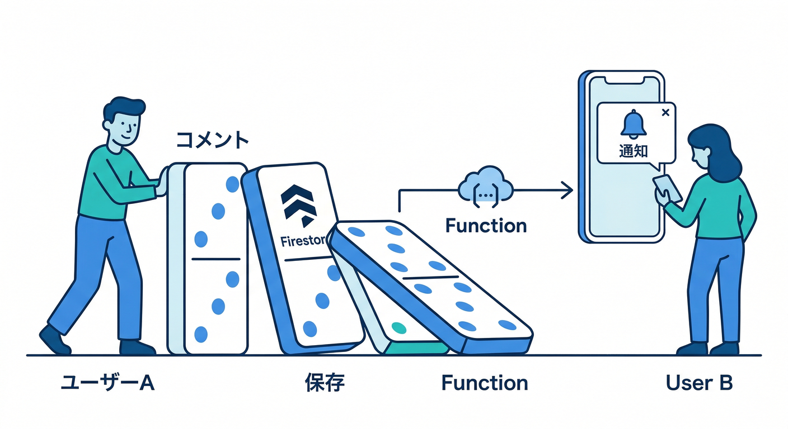
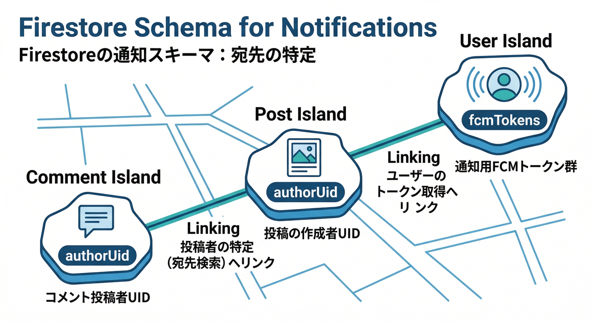
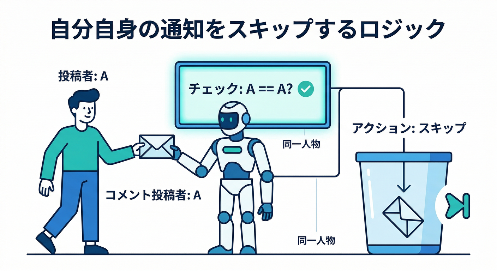
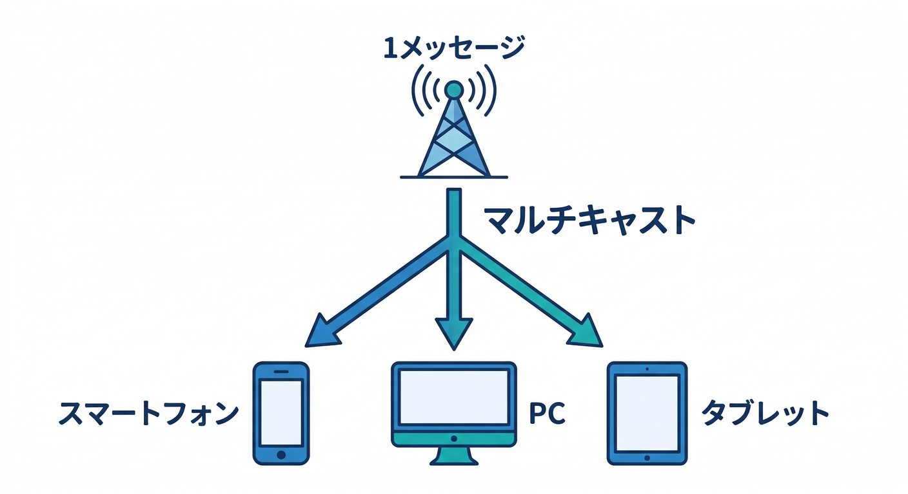
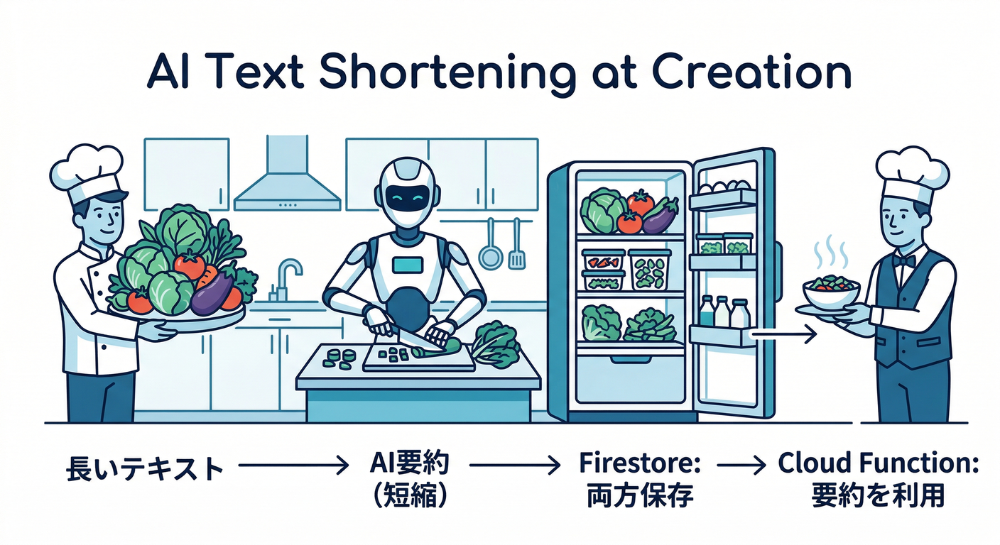
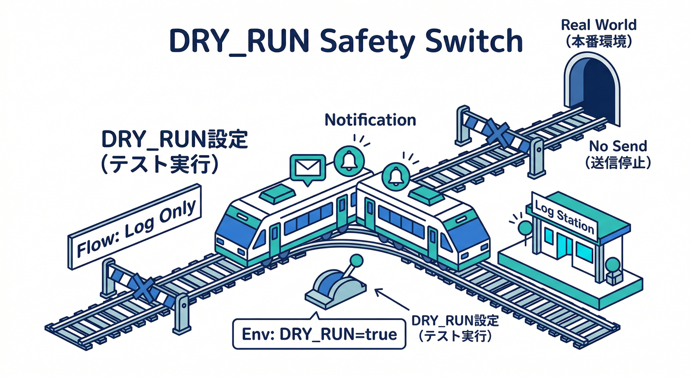
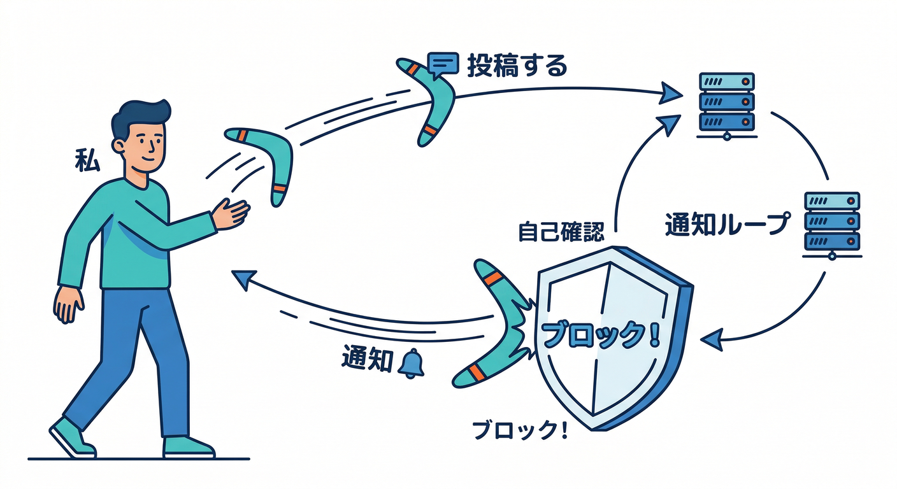

# 第14章：コメント通知の最小実装（Firestoreトリガーで送る）⚡📝➡️🔔

## ねらい（この章でできるようになること）🎯

* コメント作成（Firestore）を合図に、サーバー側が自動で動く（イベント駆動）って感覚がつかめる🧩
* 「誰に送る？」をブレずに決めて実装できる（まずは投稿者へ）🎯
* “自分への通知は送らない”みたいな当たり前ルールをコードにできる🙂✅
* 送信は **Cloud Functions（2nd gen / Cloud Runベース）** で回すイメージが持てる🚀 ([Firebase][1])

---

## 読む（5分）📖✨：イベント駆動ってなに？なんで通知と相性がいいの？

コメント通知って、こういう“反射神経の仕事”です👇

* ユーザーがコメントを書く📝
* Firestoreにコメントが保存される🗃️
* **保存された瞬間にサーバーが反応**して、通知を送る🔔⚡



これが **Firestoreトリガー**（例：`onDocumentCreated`）です。ドキュメントが最初に書き込まれた瞬間に発火します🔥 ([Firebase][2])

そして、通知の中身（payload）はデカすぎると弾かれます🙅‍♂️
**notification/data どちらも基本は最大 4096 bytes**（コンソール送信はさらに厳しめ）なので、通知文は短く作るのが正義です✂️✨ ([Firebase][3])

---

## 手を動かす（10〜15分）🖱️🔥：最小のコメント通知を作る

ここでは「投稿にコメントが付いたら、その投稿者に通知」を作ります📣
（“複数端末”や“掃除”は次章以降で強化するので、まずは届くところまで！）

---

## 1) Firestoreの形を決める（最小）🧱🗃️

最低限、こういう情報が欲しいです👇

* 投稿（post）には「投稿者UID」
* コメント（comment）には「コメントした人UID」「本文」「作成時刻」
* 端末トークンは users 配下に保存（第7章〜第8章の前提）🔑

例（イメージ）👇

```ts
// posts/{postId}
{
  authorUid: "POST_OWNER_UID",
  title: "お知らせ",
  createdAt: Timestamp
}

// posts/{postId}/comments/{commentId}
{
  authorUid: "COMMENTER_UID",
  body: "いいね！",
  createdAt: Timestamp,

  // ✅（オプション）AIで短くした通知用テキスト（後で使う）
  notifyText: "コメントが付きました: いいね！"
}

// users/{uid}/fcmTokens/{tokenId}
{
  token: "FCM_TOKEN_STRING",
  platform: "web",
  createdAt: Timestamp,
  lastSeen: Timestamp
}
```



---

## 2) Functions（2nd gen / TypeScript）でトリガーを書く⚡🧑‍💻

ポイントはこれだけです👇

* Firestoreの「commentsが作られた」をトリガーにする🔥 ([Firebase][2])
* comment を見て、post を引いて、投稿者UIDを取る🧩
* 「投稿者 === コメント者」なら送らない🙂（ミニ課題の核心）



* 投稿者のトークンを取って送る🔔

> Nodeのランタイムは **20 / 22** が軸で、18は早期にdeprecated扱いになっています📌 ([Firebase][4])

---

## 実装例：`notifyOnCommentCreated`（最小で“届く”版）📨✨

```ts
// functions/src/notifyOnCommentCreated.ts
import { onDocumentCreated } from "firebase-functions/v2/firestore";
import { logger } from "firebase-functions/logger";
import { initializeApp } from "firebase-admin/app";
import { getFirestore } from "firebase-admin/firestore";
import { getMessaging } from "firebase-admin/messaging";

initializeApp();

const db = getFirestore();

type Post = {
  authorUid: string;
  title?: string;
};

type Comment = {
  authorUid: string;
  body: string;
  notifyText?: string;
};

export const notifyOnCommentCreated = onDocumentCreated(
  "posts/{postId}/comments/{commentId}",
  async (event) => {
    // 1) コメント本体
    const snap = event.data;
    if (!snap) return;

    const { postId, commentId } = event.params;
    const comment = snap.data() as Comment;

    if (!comment?.authorUid || !comment?.body) {
      logger.warn("comment missing fields", { postId, commentId });
      return;
    }

    // 2) 投稿を引いて「誰に送る？」を決める
    const postRef = db.doc(`posts/${postId}`);
    const postSnap = await postRef.get();
    if (!postSnap.exists) {
      logger.warn("post not found", { postId });
      return;
    }
    const post = postSnap.data() as Post;

    const targetUid = post.authorUid;
    const commenterUid = comment.authorUid;

    // ✅ ルール：自分への通知は送らない
    if (targetUid === commenterUid) {
      logger.info("skip self notification", { postId, commentId, targetUid });
      return;
    }

    // 3) 送信先トークン取得（最小：全部取る）
    const tokensSnap = await db.collection(`users/${targetUid}/fcmTokens`).get();
    const tokens = tokensSnap.docs
      .map((d) => (d.data() as any).token as string)
      .filter(Boolean);

    if (tokens.length === 0) {
      logger.info("no tokens", { targetUid });
      return;
    }

    // 4) 通知文（短く！）
    // 4096 bytes 制限があるので、長文は入れない✂️
    const title = "コメントが付きました💬";
    const body =
      comment.notifyText ??
      (comment.body.length > 60 ? comment.body.slice(0, 60) + "…" : comment.body);

    // 5) 送る（複数トークンまとめて）
    const messaging = getMessaging();

    const multicastMessage = {
      tokens,
      notification: { title, body },
      data: {
        kind: "comment",
        postId,
        commentId,
        // クリック遷移に使うならURL等もここに
      },
      // webpush: { fcmOptions: { link: `/posts/${postId}#comment-${commentId}` } },
    };

    // ✅ ローカルで試す時に“実送信しない”安全スイッチ（任意）
    if (process.env.DRY_RUN === "true") {
      logger.info("DRY_RUN: would send", { targetUid, count: tokens.length, multicastMessage });
      return;
    }

    const res = await messaging.sendEachForMulticast(multicastMessage);

    logger.info("sent", {
      targetUid,
      successCount: res.successCount,
      failureCount: res.failureCount,
    });

    // 失敗の詳細は次章以降（無効トークン掃除）で本格対応🧹
  }
);
```



> `sendEachForMulticast()` は複数トークンにまとめて送れて便利です📱💻
> なお Admin SDK 側で `sendEach()` / `sendEachForMulticast()` の HTTP/2 対応などの変更も入ってきているので、SDKは新しめを保つのが安心です🔧 ([Firebase][5])

---

## `index.ts` に export を足す📦

```ts
// functions/src/index.ts
export { notifyOnCommentCreated } from "./notifyOnCommentCreated";
```

---

## 3) “AIで通知文を短くする”を最小で混ぜる（オプション）🤖✂️✨

ここ、めちゃ実用です👇
通知文って「短い・伝わる・危険な情報を出さない」が大事。
そこで **React側でコメント投稿時に AI で notifyText を作って Firestore に一緒に保存**すると、Functions側は超ラクになります😄



Firebaseの **Firebase AI Logic** は、アプリからGemini/Imagenへ安全にアクセスするための仕組みが整理されていて、App Check連携など“守り”も考えやすいです🛡️🤖 ([Firebase][6])

> この章では “入口だけ” 作って、深掘りは第18章でガッツリやるのが気持ちいいです🔥

---

## 4) ローカルで安全に試す🧪🧯（DRY_RUNで安心）

Functionsはローカルでも動かせます（Firebase CLIのFunctions emulator）🧪 ([Firebase][7])
さらに Firestore emulator と組み合わせると、投稿・コメント作成をローカルで再現できます🗃️

* `.env` に `DRY_RUN=true` を入れておくと、通知は送らずログだけになります✅
  Cloud Functions は `.env` を読めます📄 ([Firebase][8])



FireStore emulator接続は、Admin SDK が `FIRESTORE_EMULATOR_HOST` を見て自動接続するのも便利ポイントです🔌 ([Firebase][9])

---

## 5) デプロイ（届くか確認）🚀🔔

デプロイしたら、実際に

* コメント作成 → 投稿者端末に通知が出る
  を確認します👀✨

（この章のゴールは **“届く”** こと！ 次章で「複数端末」「掃除」「抑制」へ伸ばします📈）

---

## ミニ課題（5分）🎯🙂：自分への通知は“絶対に”送らない

もう入れてあるけど、ここが超重要です👇

* 投稿者が自分で自分の投稿にコメントした
* または、通知対象の計算ミス

こういうときに通知が飛ぶと、一気に“うざいアプリ”になります😇🧯



**`if (targetUid === commenterUid) return;`** が入ってるかチェック！✅

---

## チェック（3つ）✅✅✅

* コメント作成で **トリガーが1回動いているログ**が出た？👀
* 「誰に送る？」が **投稿者（owner）** でブレてない？🎯
* **通知文が短い**（長文を入れてない）＆payload制限を意識できた？✂️ ([Firebase][3])

---

## おまけ：Antigravity / Gemini CLI で爆速に固める💻🛸✨

* Antigravityは「計画→実装→検証」をエージェントで回す思想が整理されています🛸 ([Google Codelabs][10])
* Gemini CLIは調査・修正・テスト生成などの流れが公式にまとまってます💻✨ ([Google Cloud Documentation][11])

たとえば Gemini CLI にこう投げると便利です👇

* 「この関数に、二重送信防止（idempotency）を最小で入れて」🧯
* 「失敗トークンだけ抽出して削除候補を作る形にして」🧹
* 「payloadが4096 bytes超えないように短縮ロジックを強化して」✂️

---

必要なら、この第14章のコードを **“二重送信防止（超ミニ）”** まで入れた完成形（通知ログdocを `create` して二度目は弾くやつ）にアップグレードした版も、ここから一気に書けます🧩🔥

[1]: https://firebase.google.com/docs/firestore/extend-with-functions-2nd-gen "Extend Cloud Firestore with Cloud Functions (2nd gen)  |  Firebase"
[2]: https://firebase.google.com/docs/firestore/enterprise/extend-with-functions-2nd-gen?hl=ja "Cloud Functions（第 2 世代）を使用して Firebase を拡張する  |  Firestore"
[3]: https://firebase.google.com/docs/cloud-messaging/customize-messages/set-message-type "Firebase Cloud Messaging message types"
[4]: https://firebase.google.com/docs/functions/get-started "Get started: write, test, and deploy your first functions  |  Cloud Functions for Firebase"
[5]: https://firebase.google.com/support/release-notes/admin/node "Firebase Admin Node.js SDK Release Notes"
[6]: https://firebase.google.com/docs/ai-logic "Gemini API using Firebase AI Logic  |  Firebase AI Logic"
[7]: https://firebase.google.com/docs/functions/local-emulator?utm_source=chatgpt.com "Run functions locally | Cloud Functions for Firebase - Google"
[8]: https://firebase.google.com/docs/functions/config-env?utm_source=chatgpt.com "Configure your environment | Cloud Functions for Firebase"
[9]: https://firebase.google.com/docs/emulator-suite/connect_firestore?utm_source=chatgpt.com "Connect your app to the Cloud Firestore Emulator - Firebase"
[10]: https://codelabs.developers.google.com/getting-started-google-antigravity?utm_source=chatgpt.com "Getting Started with Google Antigravity"
[11]: https://docs.cloud.google.com/gemini/docs/codeassist/gemini-cli?utm_source=chatgpt.com "Gemini CLI | Gemini for Google Cloud"
