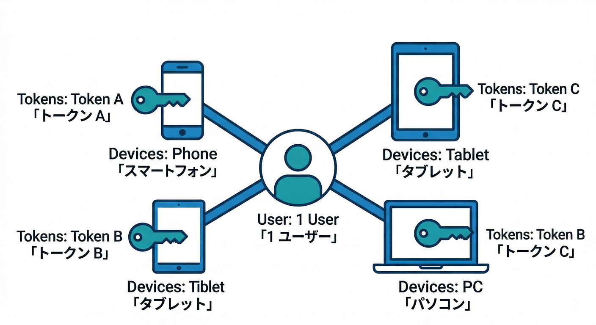
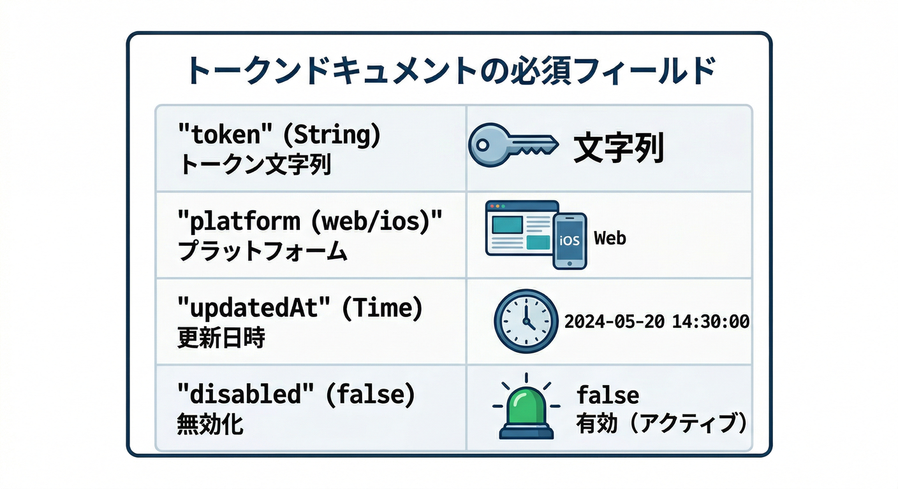
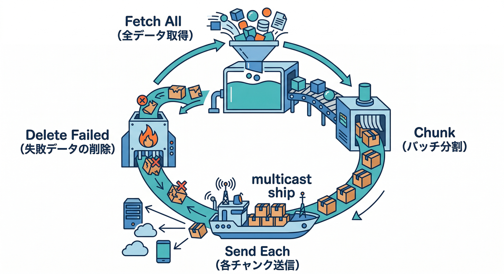
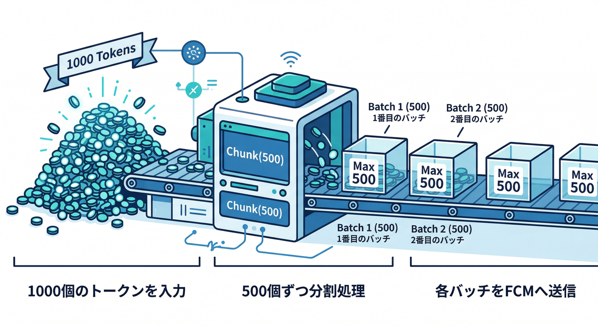
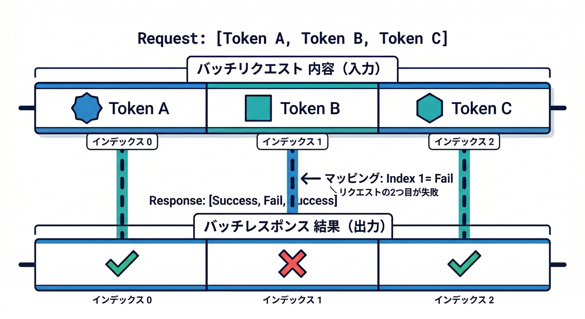
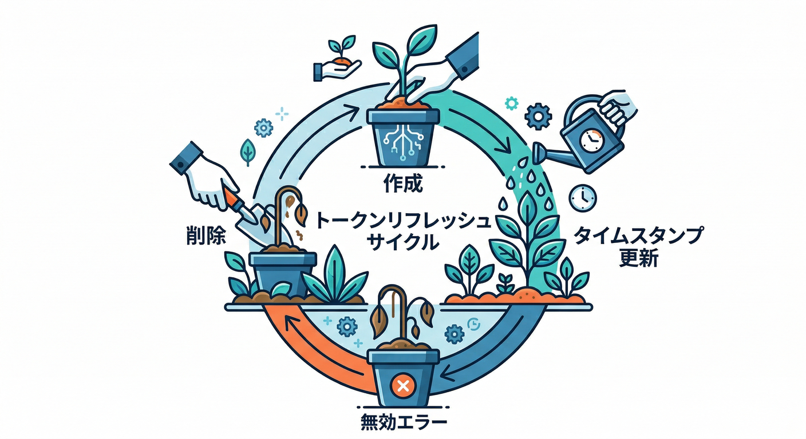
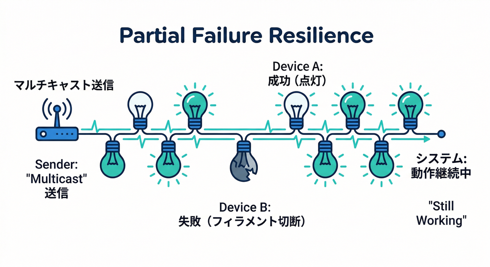

# 第15章：複数端末・複数トークンへの送信（現実アプリ感）📱💻📨

ゴール🎯：**同じユーザーが「スマホ＋PC＋タブレット」みたいに複数端末を持っていても、ちゃんと全部に通知が届く**ようにする！
しかも…**1つの端末が壊れてても、他は成功する**（部分失敗に強い）💪✨

---

## 読む（5分）📖✨「複数端末＝複数トークン」が基本ルール

* Firebase Cloud Messaging（FCM）は、端末（＝ブラウザやアプリの“インスタンス”）ごとに **登録トークン** を持ちます🔑
  つまり **ユーザー1人 = トークンが複数** は当たり前です📌



* 送信側（サーバー側）は、**ユーザーのトークン一覧を保存しておいて**、イベント発生時に全部へ送ります📨
  公式の Admin SDK は「複数トークンへ同じ通知」を送るAPIを用意していて、**1回の呼び出しで最大500トークンまで**です。([Firebase][1])

* そして超重要⚠️
  古いAPI（`sendMulticast` / `sendAll`）より、**`sendEachForMulticast()` を使う流れ**が定着しています。([Firebase][2])
  これにすると、**トークンごとの成功/失敗が分かる**ので「失敗したトークンだけ掃除🧹」ができます。([Firebase][1])

* トークンは放置すると腐ります🍞💥
  なので **timestamp（最終更新）を持って、定期的に更新＆古いのを削除**が推奨です。([Firebase][3])
  （Androidでは“長期非アクティブ”で失効扱いがあり得る、などの説明もあります）([Firebase][3])

---

## 手を動かす（10分）🖱️🔥「全トークン送信＋失敗トークンだけ除外」

ここでは Cloud Firestore に「ユーザー配下でトークンを複数持つ」形を想定します🗃️✨
（第7〜8章の保存ができている前提で、送信側を“複数対応”にアップグレード！）

---

## 1) Firestoreのトークン設計を“複数端末前提”にする🧩

おすすめ構造👇（サブコレで持つと整理しやすい！）

* `users/{uid}/fcmTokens/{tokenDocId}`

フィールド例（最低限＋便利セット）🧠✨



| フィールド        | 例                   | 目的             |
| ------------ | ------------------- | -------------- |
| `token`      | `"dX...:APA91b..."` | 実トークン🔑        |
| `platform`   | `"web"`             | 端末種別の目印📱💻    |
| `deviceId`   | `"b3f2-..."`        | 同一PCでも識別しやすい🪪 |
| `createdAt`  | serverTimestamp     | 初回登録の記録🕰️     |
| `updatedAt`  | serverTimestamp     | 「新しさ」の判定に使う⏳   |
| `lastSeenAt` | serverTimestamp     | 最終利用の気配👀      |
| `disabled`   | `false`             | 一時停止フラグ🛑      |

ポイント💡

* トークンは“変わる”ので、**`updatedAt` を必ず更新**したいです。([Firebase][3])
* docId をトークンそのままにするのが最短だけど、もし不安なら **hash化して docId にする**のもアリです🔒（スラッシュ等の混入回避）

---

## 2) Functions側：トークンを全部集めて、500個ずつ送る📤📦

送信は Cloud Functions for Firebase でやる想定（第14章の続き）⚡
ここから「複数トークン送信」にします。

## ✅ 送信ロジック（TypeScript / Node）例

```ts
import { onDocumentCreated } from "firebase-functions/v2/firestore";
import { initializeApp } from "firebase-admin/app";
import { getFirestore, FieldValue } from "firebase-admin/firestore";
import { getMessaging } from "firebase-admin/messaging";

initializeApp();
const db = getFirestore();
const messaging = getMessaging();

const TOKEN_BATCH = 500;

type TokenDoc = {
  token: string;
  disabled?: boolean;
  platform?: string;
  deviceId?: string;
};

function chunk<T>(arr: T[], size: number): T[][] {
  const out: T[][] = [];
  for (let i = 0; i < arr.length; i += size) out.push(arr.slice(i, i + size));
  return out;
}

export const notifyOnCommentCreated = onDocumentCreated(
  "posts/{postId}/comments/{commentId}",
  async (event) => {
    const snap = event.data;
    if (!snap) return;

    const comment = snap.data() as {
      postId: string;
      authorUid: string;
      text: string;
      notifyText?: string; // AIで短文化した文（後述）
    };

    // 例：投稿者へ通知（ここは第14章で作った「送り先決定ロジック」を使う想定）
    const targetUid = await resolvePostOwnerUid(comment.postId);
    if (!targetUid) return;

    // 自分への通知は送らない（第14章のルール）
    if (targetUid === comment.authorUid) return;

    // ① トークン一覧を取る
    const tokenSnap = await db
      .collection("users")
      .doc(targetUid)
      .collection("fcmTokens")
      .where("disabled", "!=", true)
      .get();

    const tokens = tokenSnap.docs
      .map((d) => ({ id: d.id, ...(d.data() as TokenDoc) }))
      .filter((t) => !!t.token);

    if (tokens.length === 0) return;

    // ② 500個ずつ送る（FCMは1回最大500トークン）📦
    // ※ sendEachForMulticast は最大500 tokens の multicast message を想定 :contentReference[oaicite:9]{index=9}
    const tokenStrings = tokens.map((t) => t.token);
    const batches = chunk(tokenStrings, TOKEN_BATCH);

    const title = "新しいコメント💬";
    const body = comment.notifyText ?? "コメントが届きました✨"; // AI短文化があれば使う

    // ③ 送信 → 失敗トークンだけ掃除🧹
    for (const batch of batches) {
      const message = {
        tokens: batch,
        notification: { title, body },
        data: {
          postId: comment.postId,
          // クリック遷移に必要な最小データだけ入れる（肥大化注意）
          clickAction: `/posts/${comment.postId}`,
        },
      };

      // 🔍 本番テスト怖い人は dryRun=true で「形式チェックだけ」もできるよ
      // messaging.sendEachForMulticast(message, true); // dry-run :contentReference[oaicite:10]{index=10}

      const res = await messaging.sendEachForMulticast(message);

      // token順に responses が返ってくる（どれが失敗したか分かる）:contentReference[oaicite:11]{index=11}
      const failed: string[] = [];
      res.responses.forEach((r, idx) => {
        if (!r.success) failed.push(batch[idx]);
      });

      if (failed.length > 0) {
        // 代表的な“消してOK”系：registration-token-not-registered
        // （公式ガイドも「無効なら削除」を推奨）:contentReference[oaicite:12]{index=12}
        await deleteInvalidTokens(targetUid, failed);
      }
    }

    // ④ “送った”記録（軽くでOK）
    await db.collection("users").doc(targetUid).set(
      { lastNotifiedAt: FieldValue.serverTimestamp() },
      { merge: true }
    );
  }
);

// --- ここから下は教材用のダミー（あなたの実装に置き換え）---

async function resolvePostOwnerUid(postId: string): Promise<string | null> {
  const postDoc = await db.collection("posts").doc(postId).get();
  const data = postDoc.data() as { ownerUid?: string } | undefined;
  return data?.ownerUid ?? null;
}

async function deleteInvalidTokens(targetUid: string, failedTokens: string[]) {
  // token文字列 -> ドキュメントIDが別の場合は、tokenでwhere検索して消す、などに変更してね
  // ここでは「tokenをdocIdにしてない」前提で token フィールドで削除する例
  const tokenCol = db.collection("users").doc(targetUid).collection("fcmTokens");

  // FirestoreはINクエリに上限があるので、必要なら分割してね
  //（教材ではシンプルに）
  const snap = await tokenCol.where("token", "in", failedTokens.slice(0, 10)).get();
  const batch = db.batch();
  snap.docs.forEach((d) => batch.delete(d.ref));
  await batch.commit();
}
```

⭐ここで押さえる3点だけ覚えればOK！



1. **最大500トークン**なので分割📦([Firebase][1])



2. **戻り値の順序がトークン順**なので、どれが失敗したか追える👣([Firebase][1])


3. **無効トークンは削除**して健康体を保つ🧹([Firebase][3])

---

## 3) 失敗トークン掃除の考え方🧹🧠



公式の考え方はこう👇

* トークンは時間で古くなるので、**timestampを持って更新**する([Firebase][3])
* 送信して **UNREGISTERED / INVALID_ARGUMENT** など（=もう無効）のケースは **削除してOK**([Firebase][3])
* エラーの意味を知っておくと「どれを消すべきか」が分かる📛([Firebase][4])

---

## （ちょいAI）通知文を“短く賢く”して、端末全部に配る🤖✨

第18章でガッツリやるけど、ここで“入口だけ”つけると気持ちいいです😄

やり方（超カンタン案）👇

* コメント作成時に、Firebase AI Logic で **通知向けの短文**を作る
* その短文を `notifyText` としてコメントに保存
* Functions は **その notifyText をそのまま全端末へ送る**📨

Firebase AI Logic は「アプリからGeminiへテキスト生成」できる導線が公式に整理されています。([Firebase][5])

---

## Gemini CLI / Antigravity で“実装の精度”を上げる🛸💻✨

* Google Antigravity は「エージェントが計画→実装→検証」まで回す思想の開発基盤として説明されています。([Google Codelabs][6])
* Gemini CLI はターミナルから調査・修正・テスト生成などを支援する公式ドキュメントがあります。([Google Cloud Documentation][7])

たとえば、こう聞くと“教材の穴”を埋めやすいです👇（例）

```bash
gemini --prompt "FCM sendEachForMulticast の戻り値(BatchResponse)を使って、無効トークンだけ消すTypeScript関数を書いて。FirestoreのIN制限にも配慮して。"
```

---

## ミニ課題（5分）🎯📌「1個失敗でも全体が死なない」を証明する



1. Firestoreに **わざとダミートークン**を1個混ぜる（例：`"xxx"`）😈
2. コメントを投稿して送信を走らせる
3. ログを見て、

   * 他の端末には届く✅
   * ダミーだけ失敗扱いになって削除される✅
     を確認！

（エラーの扱い・無効トークン削除の考え方は公式にもまとまっています）([Firebase][3])

---

## チェック（理解確認）✅✅✅

* ✅ ユーザーが複数端末を持つと、**トークンも複数**になる理由を説明できる？
* ✅ `sendEachForMulticast()` の **最大500トークン**制限に対応できてる？([Firebase][1])
* ✅ 送信結果から **失敗トークンだけ掃除**する流れが作れてる？([Firebase][3])

---

次の章（第16章）では、この“現実アプリ感”にさらに追い打ちをかけます😇🔥
**「まとめる・間引く・寿命を付ける（TTL）」**で、通知が“うざくならない”方向へ進化します🔔➡️💎

[1]: https://firebase.google.com/docs/cloud-messaging/send/admin-sdk "Send a Message using Firebase Admin SDK  |  Firebase Cloud Messaging"
[2]: https://firebase.google.com/support/release-notes/admin/node "Firebase Admin Node.js SDK Release Notes"
[3]: https://firebase.google.com/docs/cloud-messaging/manage-tokens "Best practices for FCM registration token management  |  Firebase Cloud Messaging"
[4]: https://firebase.google.com/docs/cloud-messaging/error-codes "FCM Error Codes  |  Firebase Cloud Messaging"
[5]: https://firebase.google.com/docs/ai-logic/generate-text "Generate text using the Gemini API  |  Firebase AI Logic"
[6]: https://codelabs.developers.google.com/getting-started-google-antigravity?utm_source=chatgpt.com "Getting Started with Google Antigravity"
[7]: https://docs.cloud.google.com/gemini/docs/codeassist/gemini-cli?utm_source=chatgpt.com "Gemini CLI | Gemini for Google Cloud"
