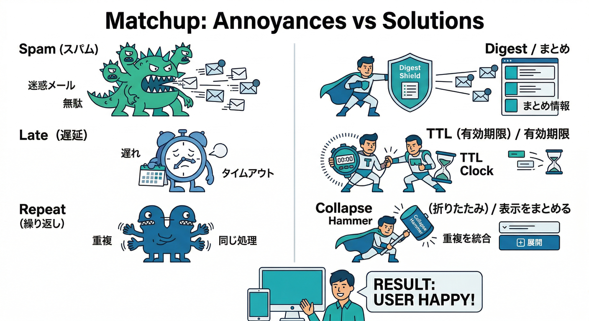
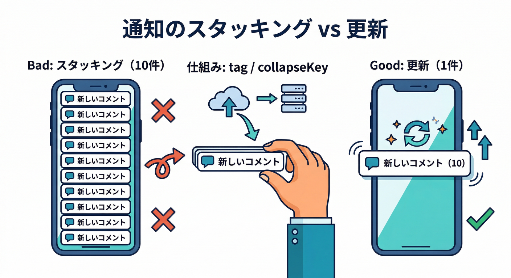
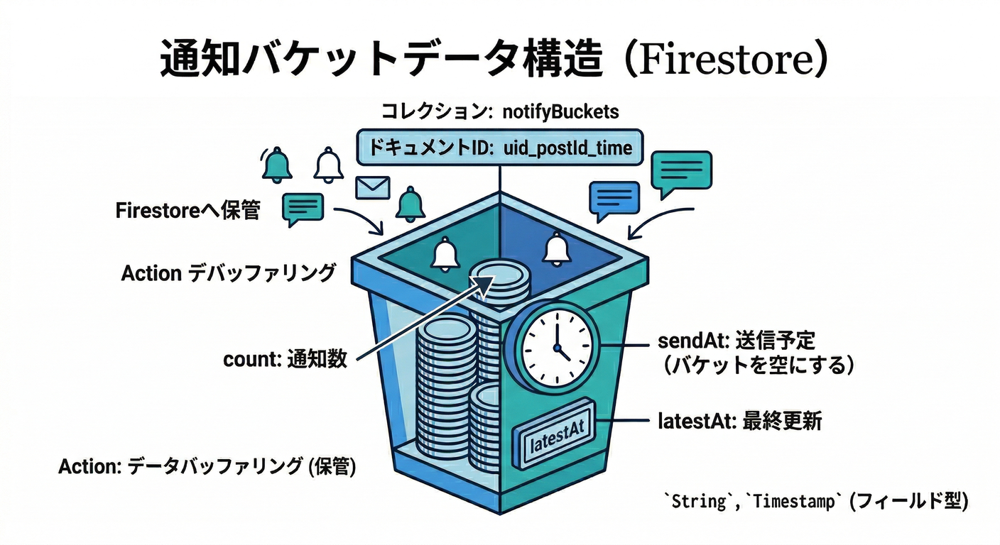
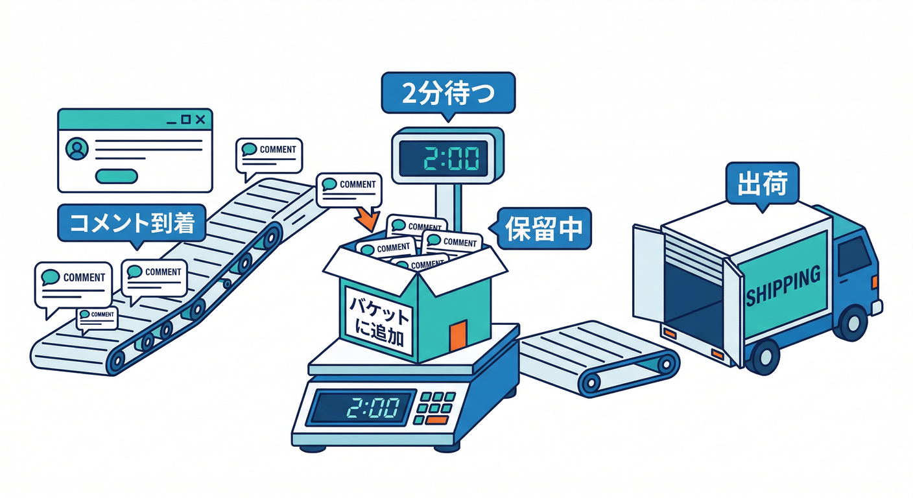
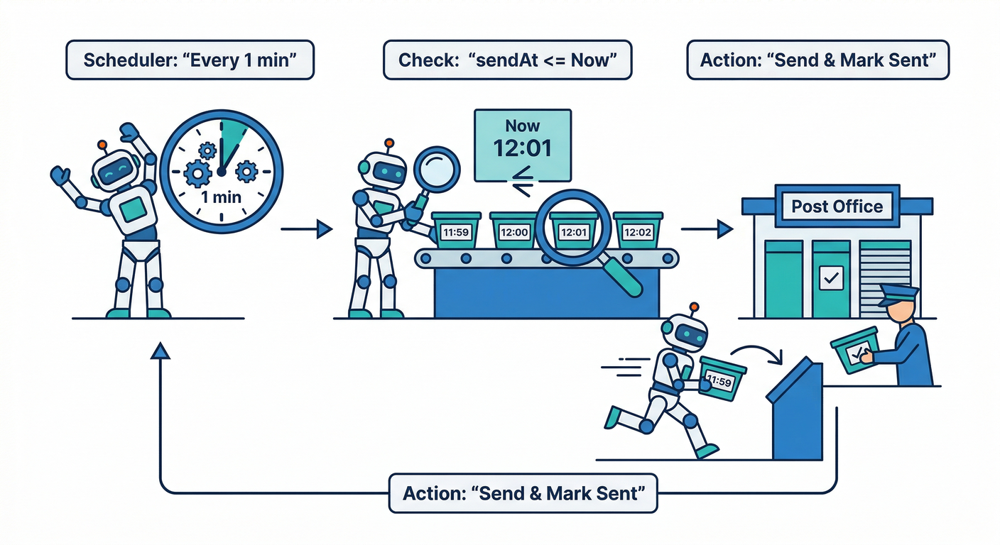
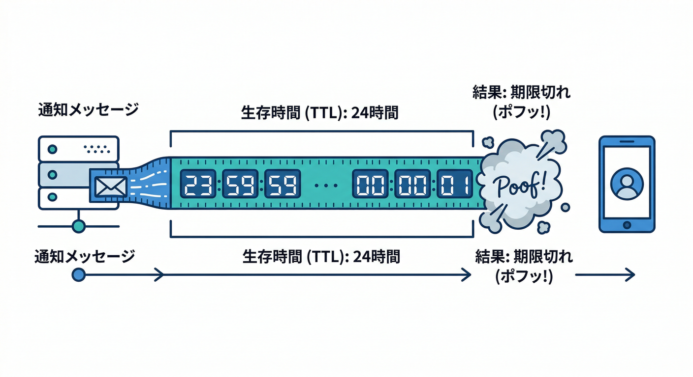
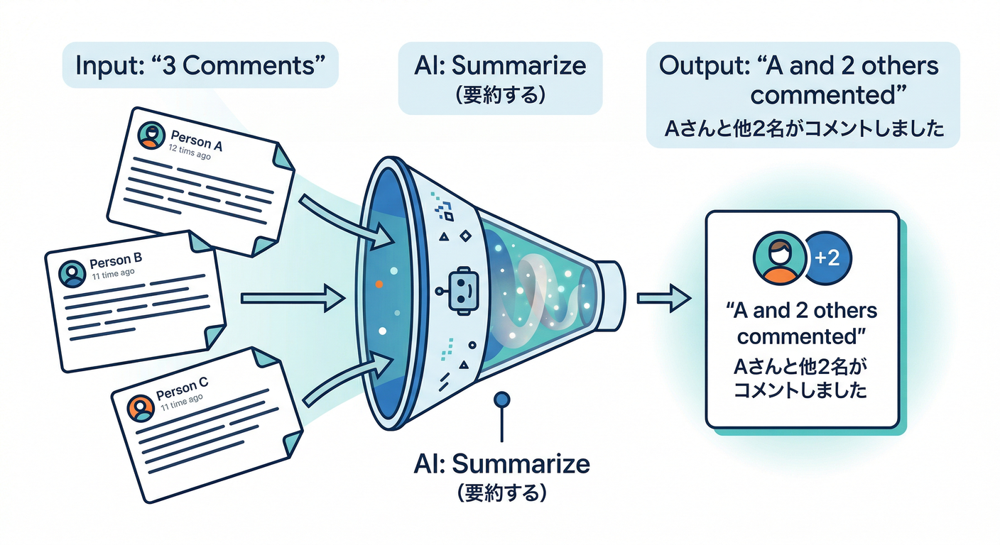

# 第16章：“うざくならない”制御（まとめる・間引く・寿命を付ける）😇⏳

この章のゴールはシンプルです👇
**「通知の価値は落とさず、通知の回数だけ賢く減らす」**を実装します📣✨

---

## 読む：通知が嫌われる3大パターンと、対抗策🧯

通知が“うざい”と言われるのは、だいたいこの3つです👇

1. **連投（同じ種類が短時間でドカドカ）**😵‍💫
2. **届くのが遅い（もう価値がない）**⌛
3. **同じ内容が何度も出てくる（古いのが残る）**🔁

そこで、制御のツマミ（レバー）を3つ使います👇



## ① まとめる（Digest）🧺

「2分で5件コメント」みたいなとき、**1通にまとめて**
「新着コメント5件！」だけ送るやつです📬✨

## ② 間引く（Cooldown / Rate limit）🪓

「1ユーザーにつき、同タイプ通知は**最短○分おき**」みたいに、**送れる頻度に上限**を作ります😇

## ③ 寿命を付ける（TTL）⏰

通知は“鮮度が命”。**期限切れなら届かない**ようにします。
FCMはメッセージの保持期間（TTL）を設定でき、**デフォルトは最大4週間**です（ただし使いどころで短くするのが正義）([Firebase][1])
Web Pushは `webpush.headers.TTL`、iOSは `apns-expiration`、Androidは `android.ttl` などで期限を付けられます([Firebase][1])

---

## “上書き”でさらに静かにする（地味に効く）🪄

「まとめる・間引く」と相性バツグンなのが **上書き（置き換え）**です。

## Android：collapseKey で「最後の1通だけ残す」📱

同じ `collapseKey` の通知は、**溜め込まず“最新だけ”に寄せられます**。
しかも **同時に保持される collapseKey は最大4種類**という仕様もあります（増やしすぎ注意）([Firebase][2])

## Android / Web：tag で「同じ通知枠を置き換える」🏷️

* Android は `android.notification.tag` が使えます([Firebase][3])
* Web Push も `tag` / `renotify` などの通知オプションを持てます

> 体感で言うと…
> **「通知が10個積み上がる」→「通知1個が更新され続ける」**になります😇✨



---

## 手を動かす：2分ウィンドウでまとめて、24時間TTLを付ける🧩🛠️

ここでは「コメント通知」を、**2分に1回のまとめ通知**にします📦
さらに **TTL=24時間**を付けて、古い価値ゼロ通知は捨てます🗑️⏰

---

## 手順1：Firestoreに“まとめ箱（バケツ）”を作る🪣🗃️

例：コレクション `notifyBuckets` に、**送信待ちのまとめ**を置きます。

* `uid`：送る相手
* `postId`：どの投稿のコメントか
* `count`：何件まとまった？
* `latestAt`：最新コメント時刻
* `sendAt`：いつ送る？（バケツの締め切り）
* `sentAt`：送ったら入れる（重複送信防止）



---

## 手順2：コメント作成トリガーで、バケツに積む🧺➕

（第14章の「コメント作成→通知」の入口に、**“すぐ送らない”分岐**を入れる感じです）

```ts
import { initializeApp } from "firebase-admin/app";
import { getFirestore, FieldValue, Timestamp } from "firebase-admin/firestore";
import { onDocumentCreated } from "firebase-functions/v2/firestore";

initializeApp();
const db = getFirestore();

const WINDOW_MS = 2 * 60_000; // 2分まとめ

function bucketKey(uid: string, postId: string, createdAtMs: number) {
  const bucketStart = Math.floor(createdAtMs / WINDOW_MS) * WINDOW_MS;
  return {
    id: `${uid}_${postId}_${bucketStart}`,   // "/"を避ける
    sendAtMs: bucketStart + WINDOW_MS,      // ウィンドウ終了で送る
  };
}

export const onCommentCreated = onDocumentCreated(
  "posts/{postId}/comments/{commentId}",
  async (event) => {
    const postId = event.params.postId as string;
    const data = event.data?.data();
    if (!data) return;

    const targetUid = data.postOwnerUid as string; // 例：投稿者に送る
    const actorUid = data.authorUid as string;     // 例：コメントした人
    if (!targetUid || !actorUid) return;

    // 自分の投稿に自分でコメント→通知しない（第14章ルール）
    if (targetUid === actorUid) return;

    const createdAt = data.createdAt?.toDate?.() ? data.createdAt.toDate() : new Date();
    const { id, sendAtMs } = bucketKey(targetUid, postId, createdAt.getTime());

    const ref = db.collection("notifyBuckets").doc(id);

    await db.runTransaction(async (tx) => {
      const snap = await tx.get(ref);
      const base = {
        uid: targetUid,
        postId,
        sendAt: Timestamp.fromMillis(sendAtMs),
        latestAt: Timestamp.fromDate(createdAt),
      };

      if (!snap.exists) {
        tx.set(ref, {
          ...base,
          count: 1,
          sentAt: null,
          createdAt: FieldValue.serverTimestamp(),
          updatedAt: FieldValue.serverTimestamp(),
        });
      } else {
        tx.update(ref, {
          ...base,
          count: FieldValue.increment(1),
          updatedAt: FieldValue.serverTimestamp(),
        });
      }
    });
  }
);
```

ポイント👀✨



* **“すぐ送らない”**で、まず箱に積む
* `sentAt` で **二重送信を防ぐ**（超大事）🧯

---

## 手順3：スケジュール関数で、期限が来た箱だけ送る📤⏱️



送るときに、**TTL（24h）** と **上書きキー（collapseKey / tag）** を付けます。

* TTL：古い通知は届かなくてOK（Webは `webpush.headers.TTL`、iOSは `apns-expiration`、Androidは `android.ttl`）([Firebase][1])
* collapseKey：Androidで“最新だけ”寄せる（最大4種類まで）([Firebase][2])
* tag：通知枠を置き換える（Android / Web）([Firebase][3])

```ts
import { getMessaging } from "firebase-admin/messaging";
import { onSchedule } from "firebase-functions/v2/scheduler";

const messaging = getMessaging();

const TTL_SEC = 24 * 60 * 60;
const TTL_MS  = TTL_SEC * 1000;

async function getUserTokens(uid: string): Promise<string[]> {
  const snap = await db.collection("users").doc(uid).collection("fcmTokens").get();
  return snap.docs.map(d => d.id); // 例：docIdをtokenにしてる設計
}

export const sendDueDigests = onSchedule("every 1 minutes", async () => {
  const now = Timestamp.now();

  const dueSnap = await db.collection("notifyBuckets")
    .where("sentAt", "==", null)
    .where("sendAt", "<=", now)
    .limit(50)
    .get();

  for (const doc of dueSnap.docs) {
    const b = doc.data() as any;
    const uid = b.uid as string;
    const postId = b.postId as string;
    const count = Number(b.count ?? 0);
    if (!uid || !postId || count <= 0) {
      await doc.ref.update({ sentAt: FieldValue.serverTimestamp(), note: "skip:invalid" });
      continue;
    }

    const tokens = await getUserTokens(uid);
    if (tokens.length === 0) {
      await doc.ref.update({ sentAt: FieldValue.serverTimestamp(), note: "skip:no_tokens" });
      continue;
    }

    // “同じ枠で上書き”用のキー（ユーザー×投稿単位）
    const key = `comment_${uid}_${postId}`;

    // ざっくり本文（第18章でAI整形に進化させると最高🤖✨）
    const title = "新しいコメント";
    const body  = count === 1 ? "コメントが1件届きました" : `コメントが${count}件届きました`;

    // iOS向けの期限（秒のUNIX時刻）※FCMの一次情報でも言及あり:contentReference[oaicite:8]{index=8}
    const apnsExpiration = String(Math.floor(Date.now() / 1000) + TTL_SEC);

    const message = {
      tokens,
      notification: { title, body },
      data: {
        postId,
        // クリック後に飛ばしたい場所（WebはSW側で解釈して遷移でもOK）
        path: `/posts/${postId}#comments`,
        bucketId: doc.id,
      },

      // Android：ttl(ms) + collapseKey + tag
      android: {
        ttl: TTL_MS,                  // Admin SDKはmsで指定できる:contentReference[oaicite:9]{index=9}
        collapseKey: key,             // 最大4種類までに抑える:contentReference[oaicite:10]{index=10}
        notification: {
          tag: key,                   // 同じ通知枠を置き換える:contentReference[oaicite:11]{index=11}
          notificationCount: count,   // バッジっぽく使える:contentReference[oaicite:12]{index=12}
        },
      },

      // Web Push：TTLヘッダ + tag（通知枠を置き換え）
      webpush: {
        headers: {
          TTL: String(TTL_SEC),       // WebはTTLヘッダで期限設定:contentReference[oaicite:13]{index=13}
        },
        notification: {
          tag: key,                   // tag/renotify などが使える
          renotify: false,
        },
        fcmOptions: {
          link: `/posts/${postId}#comments`,
        },
      },

      // iOS：apns-expiration で期限（TTL相当）
      apns: {
        headers: {
          "apns-expiration": apnsExpiration, // iOSはこのヘッダで期限:contentReference[oaicite:15]{index=15}
        },
      },
    };

    const res = await messaging.sendEachForMulticast(message as any);

    await doc.ref.update({
      sentAt: FieldValue.serverTimestamp(),
      successCount: res.successCount,
      failureCount: res.failureCount,
    });
  }
});
```

✅ これで起きること

* コメントが連投されても **2分に1通**🧺
* 古い通知は **24時間で自然消滅**⏰([Firebase][1])


* Android/Webは **同じ通知枠が更新される**（増殖しない）🏷️([Firebase][3])
* Androidは **collapseKeyで最新寄せ**（キー増やしすぎ注意）📱([Firebase][2])

---

## 🔥ミニ課題：AIで“まとめ通知の文面”を賢くする🤖📝

今の `body` は固定文でした。ここを「2分間の出来事」から短文生成に変えると一気にプロっぽいです😎✨



例）

* 1件 →「Aさんがコメントしました」
* 5件 →「Aさんほか4件の新着コメントがあります」
* 深夜帯 →「朝にまとめて通知（送らない）」←第19章にもつながる💡

ここで **Google の Firebase AI系を絡める**なら、通知文生成は相性◎です👇
**Firebase AI Logic** はアプリから Gemini/Imagen を呼ぶための仕組みや、App Check連携なども整理されています([Firebase][4])

さらに開発体験として、**Gemini CLI×Firebase拡張**で、セットアップやコード差し込みまでエージェント寄りに進める流れも公式に出ています（`/firebase:init` など）([The Firebase Blog][5])

---

## ✅チェック（理解確認）🧠✅

1. 「まとめる」「間引く」「TTL」それぞれ、**何を減らす作戦**？🧩
2. Androidの `collapseKey` を増やしすぎると、何が起きそう？（最大4種類）📱([Firebase][2])
3. Web PushでTTLを付ける場所はどこ？（ヘッダ）🌐([Firebase][1])

---

## おまけ：将来の拡張ネタ（第17章へ橋渡し）🌉🧹

送信結果 `failureCount` が出たら、次はこう進化できます👇

* 無効トークン掃除（運用で効く）🧹
* エラー理由で分岐（APNs/権限/削除済みなど）🧯

この続きが **第17章の“健康診断”**に直結します💪✨

[1]: https://firebase.google.com/docs/cloud-messaging/customize-messages/collapsible-message-types "Non-collapsible and collapsible messages  |  Firebase Cloud Messaging"
[2]: https://firebase.google.com/docs/reference/admin/node/firebase-admin.messaging.androidconfig "AndroidConfig interface  |  Firebase Admin SDK"
[3]: https://firebase.google.com/docs/reference/admin/node/firebase-admin.messaging.androidnotification "AndroidNotification interface  |  Firebase Admin SDK"
[4]: https://firebase.google.com/docs/ai-logic?utm_source=chatgpt.com "Gemini API using Firebase AI Logic - Google"
[5]: https://firebase.blog/posts/2025/10/ai-logic-via-gemini-cli/?utm_source=chatgpt.com "Add AI features to your app using Gemini CLI and ..."
