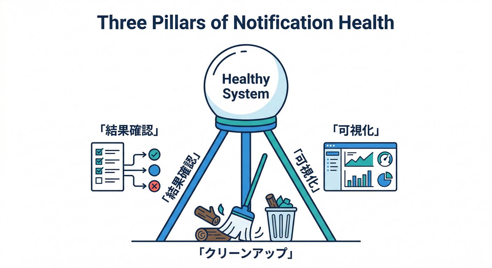
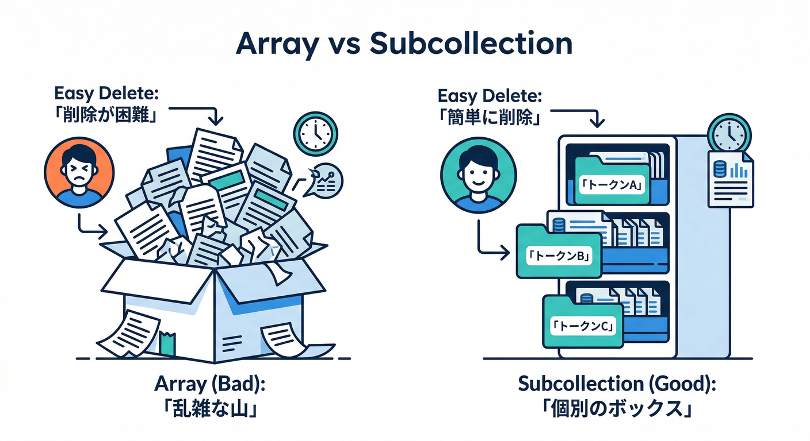
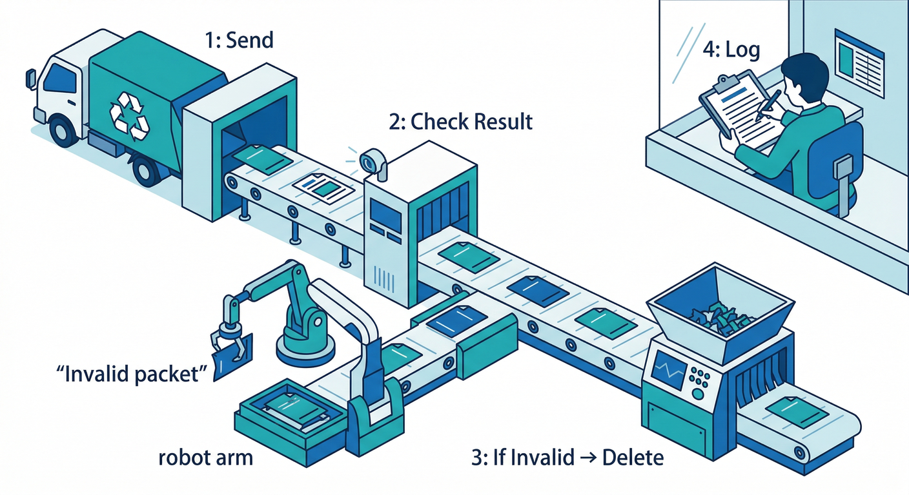
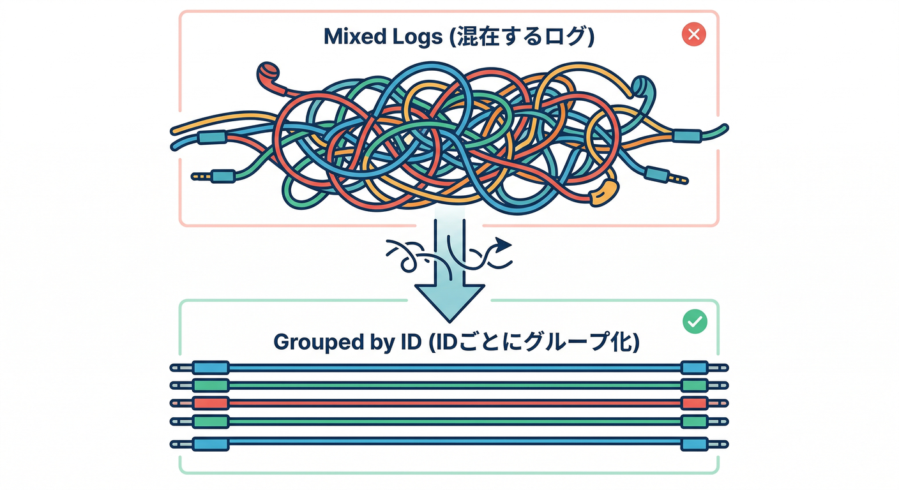
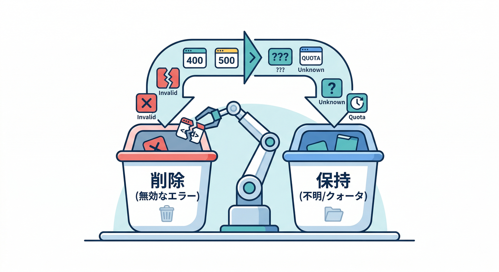
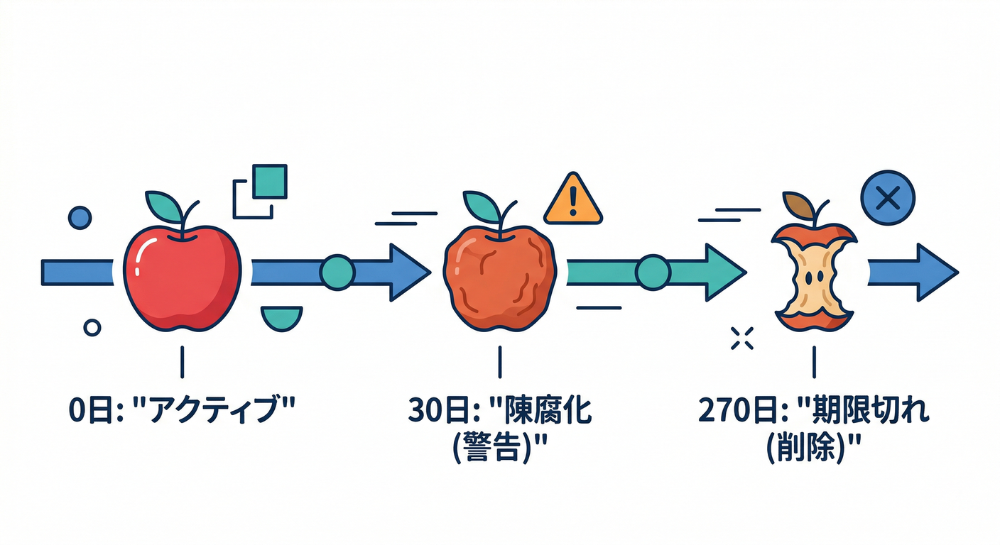
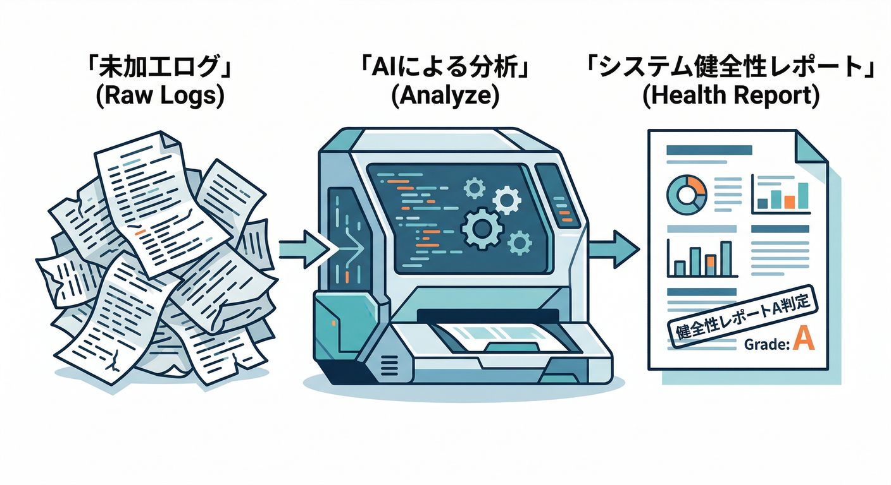

# 第17章：配信の健康診断（エラー・無効トークン掃除）🧹🧯

この章は「通知を送れる」から一歩進んで、**“送り続けられる（運用できる）”**にする回です📈✨
FCMは、放っておくと **無効トークン（もう存在しない宛先）**が自然に増えます。すると、ムダ打ちが増えて配信成績も“見かけ上”悪化しやすいです😵‍💫
だから **送信結果を見て、無効トークンを掃除する**のが王道です🧹💪 ([Firebase][1])

---

## 1) まずは“健康診断”の見取り図🩺🧩

通知配信の健康診断は、ざっくりこの3点だけ押さえればOKです👇



1. **送った結果（成功/失敗）を必ず受け取る**📦
   Admin SDKのマルチキャスト送信は、最大500トークンまで一括送信できて、**どのトークンが失敗したか**が戻ってきます（順番対応）📬 ([Firebase][2])
2. **「これは削除！」の失敗だけ確実に消す**🧹
   代表はこの2つ：

   * `messaging/invalid-registration-token`（トークンの形が不正）
   * `messaging/registration-token-not-registered`（トークンがもう登録されてない＝アプリ削除など）
     こういうのは **DBから消して、二度と送らない**が正解です✅ ([Firebase][3])
3. **ログを“見える化”して、あとから追えるようにする**👀
   Cloud Functionsのloggerは、レベル（info/warn/error）と**構造化データ**が使えて、後で分析がめちゃ楽になります📊 ([Firebase][4])

---

## 2) 手を動かす：送信結果をログ化して“無効トークン掃除”する🧹🔥

ここからは **TypeScript（Functions）**で実装します⚡
ポイントは「送信→レスポンス解析→掃除→ログ/保存」です🧠✨

---

## 2-1. Firestoreのトークン保存形式（掃除しやすいやつ）🗃️🔑

おすすめは「配列」より **サブコレクション**です。削除が超ラクだから🙂



* `users/{uid}/fcmTokens/{tokenId}`

  * `token`（実トークン）
  * `createdAt`
  * `lastSeenAt`（最後に生きてた確認）
  * `platform`（web など）
  * `lastErrorCode` / `lastErrorAt`（失敗の履歴）

> トークンは個人情報そのものではないけど、**ログにそのまま出すのは避けたい**ので、後で `tokenId`（ハッシュ）を使います🔒

---

## 2-2. 実装：送信＋掃除の共通関数を作る🧰✨

下のコードは「あるユーザーの全トークンに送って、失敗したトークンを掃除し、結果をログ＆Firestoreに残す」役です📌



```ts
import { getFirestore, FieldValue } from "firebase-admin/firestore";
import { getMessaging } from "firebase-admin/messaging";
import * as logger from "firebase-functions/logger";
import crypto from "crypto";

/** トークンをそのままIDにしない（ログやキーに出さない） */
function tokenId(token: string) {
  return crypto.createHash("sha256").update(token).digest("hex");
}

/** “削除してOK”判定（ここが第17章の肝🧠） */
function shouldDeleteTokenByErrorCode(code?: string) {
  return (
    code === "messaging/invalid-registration-token" ||
    code === "messaging/registration-token-not-registered"
  );
}

type SendResultSummary = {
  uid: string;
  successCount: number;
  failureCount: number;
  deletedTokenIds: string[];
  errorCodeCounts: Record<string, number>;
};

export async function sendToUserAndCleanup(params: {
  uid: string;
  title: string;
  body: string;
  url?: string;
}): Promise<SendResultSummary> {
  const db = getFirestore();
  const tokensSnap = await db.collection(`users/${params.uid}/fcmTokens`).get();

  // 送るトークン一覧
  const tokens: string[] = [];
  const tokenDocIds: string[] = []; // tokenIdと同じ想定（docId）
  tokensSnap.forEach((doc) => {
    const data = doc.data();
    if (data?.token) {
      tokens.push(String(data.token));
      tokenDocIds.push(doc.id);
    }
  });

  // トークン0件なら静かに終了（ここでエラーにしないのが運用向き🙂）
  if (tokens.length === 0) {
    logger.info("fcm_send_skip_no_tokens", { uid: params.uid });
    return { uid: params.uid, successCount: 0, failureCount: 0, deletedTokenIds: [], errorCodeCounts: {} };
  }

  const message = {
    tokens,
    notification: { title: params.title, body: params.body },
    data: params.url ? { url: params.url } : undefined,
  };

  // ここで“健康診断”の結果が返ってくる📦
  const res = await getMessaging().sendEachForMulticast(message);

  const deletedTokenIds: string[] = [];
  const errorCodeCounts: Record<string, number> = {};

  // 失敗したトークンをチェックして掃除
  const batch = db.batch();

  res.responses.forEach((r, idx) => {
    if (r.success) return;

    const code = r.error?.code ?? "unknown";
    errorCodeCounts[code] = (errorCodeCounts[code] ?? 0) + 1;

    const rawToken = tokens[idx];
    const id = tokenId(rawToken);
    const docRef = db.doc(`users/${params.uid}/fcmTokens/${id}`);

    // エラー履歴だけ残す（すぐ消さないケースもある）
    batch.set(
      docRef,
      { lastErrorCode: code, lastErrorAt: FieldValue.serverTimestamp() },
      { merge: true }
    );

    // “削除してOK”なら消す🧹
    if (shouldDeleteTokenByErrorCode(code)) {
      batch.delete(docRef);
      deletedTokenIds.push(id);
    }
  });

  // 結果ログをFirestoreにも保存（あとでReactで見える化できる👀）
  const logRef = db.collection("pushSendLogs").doc();
  batch.set(logRef, {
    uid: params.uid,
    successCount: res.successCount,
    failureCount: res.failureCount,
    deletedCount: deletedTokenIds.length,
    errorCodeCounts,
    createdAt: FieldValue.serverTimestamp(),
  });

  await batch.commit();

  // Cloud Loggingへ構造化ログ（分析しやすい形）📊
  logger.info("fcm_send_result", {
    uid: params.uid,
    successCount: res.successCount,
    failureCount: res.failureCount,
    deletedCount: deletedTokenIds.length,
    errorCodeCounts,
  });

  return {
    uid: params.uid,
    successCount: res.successCount,
    failureCount: res.failureCount,
    deletedTokenIds,
    errorCodeCounts,
  };
}
```

ここでの重要ポイントは2つだけ👇

* `sendEachForMulticast` は **どのトークンが失敗したか**返してくれる（順番が一致）📬 ([Firebase][2])
* `messaging/registration-token-not-registered` みたいな“終わったトークン”は **消す**🧹 ✅ ([Firebase][3])

---

## 2-3. 送信トリガー側から呼ぶ（コメント通知の中に差し込む）📝➡️🔔

第14章の「コメント作成トリガー」から、最後にこれを呼ぶだけでOKです👌
（関数名やパスは、あなたの教材の既存設計に合わせて読み替えてね🙂）

```ts
import { onDocumentCreated } from "firebase-functions/v2/firestore";
import { initializeApp } from "firebase-admin/app";
import { sendToUserAndCleanup } from "./sendToUserAndCleanup";

initializeApp();

export const notifyOnNewComment = onDocumentCreated(
  "posts/{postId}/comments/{commentId}",
  async (event) => {
    const comment = event.data?.data();
    if (!comment) return;

    const toUid = comment.toUid as string; // 通知先ユーザー（例）
    const fromUid = comment.fromUid as string;

    // 自分に送らないルール（第14章の復習🙂）
    if (toUid === fromUid) return;

    await sendToUserAndCleanup({
      uid: toUid,
      title: "新しいコメント💬",
      body: String(comment.text ?? "").slice(0, 80),
      url: `/posts/${event.params.postId}`,
    });
  }
);
```

Firestoreトリガー自体の考え方は、2nd genの公式ガイドにもまとまってます📘 ([Firebase][5])

---

## 3) “健康診断”の見方：ログで追う👀🧾

## 3-1. まずはFirebase CLIで見る（最短ルート）🚀

```bash
firebase functions:log --only notifyOnNewComment
```

Functionsのログは、Firebase CLIやCloud Loggingで見られます📜 ([Firebase][4])

---

## 3-2. ログが混ざって読みにくい問題（地味にハマる😇）

2nd gen（Cloud Runベース）は**同時処理**が起きるので、ログが交互に混ざることがあります🌀
でも最近のFirebase CLIでデプロイすると、**execution ID**をログに関連付けて追いやすくする仕組みも説明されています🔎 ([Firebase][4])



---

## 4) 失敗コードの“ざっくり辞書”📚🧠



* ✅ **消していい（掃除対象）**

  * `messaging/invalid-registration-token`
  * `messaging/registration-token-not-registered`
    → DBから削除🧹（再送してもムダ） ([Firebase][3])

* 🟡 **消さない（設定ミスや一時エラーの可能性）**

  * `SENDER_ID_MISMATCH`（送信者IDが違う系）
  * `Message too big`（payloadが大きい）
  * `messaging/unknown-error`（一時的かも）
    → まずログで増え方を見る👀（焦って全削除しない） ([Firebase][3])

---

## 5) もう1段よくする：古いトークンを“予防で間引く”🧯⏳

公式のトークン管理ベストプラクティスでは、

* **1か月以上つながってない端末トークンはstale（古い）**
* Androidでは **270日**の非アクティブでexpired扱い


  みたいな話が出てきます📆🧊 ([Firebase][1])

なので、やり方は2つ👇

* 「staleは送らない（でもすぐ消さず、しばらく保留）」🙂
* 「一定期間で削除」🧹

初心者コースならまずは **送信時掃除（この章の実装）**だけでも十分強いです💪✨

---

## 6) AIで“運用レポート”を自動生成する🤖📝📊

ここ、めちゃ楽できます😆

## 6-1. Firebase AI Logicで「今日の通知健康レポート」を作る🩺

Firestoreの `pushSendLogs` を数十件まとめて、
「成功率」「多いエラー」「次にやるべき対処」を短文で生成させる感じです📄✨



Firebase AI Logicは、Gemini/Imagenをアプリから扱う入口として整理されています🤖 ([Firebase][6])

## 6-2. Gemini CLIで“ログ分析の助っ人”を呼ぶ💻🔎

「このエラー増えてるんだけど原因候補は？」みたいな調査に強いです。CLIとして公式にまとまっています🛠️ ([Google Cloud Documentation][7])

## 6-3. Antigravityでエージェントに“診断手順書”を作らせる🛸🧠

エージェントが計画→実装→検証まで回す思想が整理されています📌 ([Google Codelabs][8])

> 注意：AIに投げるログは、トークンや個人情報っぽいものはマスクしてからが安心です🔒🙂

---

## ミニ課題🎯🧹（10分）

次のどれか1つだけでOK！

1. **削除条件を1行で言語化**する✍️
   例：「`registration-token-not-registered` は即削除、`unknown-error` は削除しない」
2. `pushSendLogs` に **successRate（成功率%）** を保存する📊
3. `lastErrorCode` が同じで **3回連続失敗したら削除**（簡易ルール）🧯

---

## チェック✅（理解できた？）

* [ ] 送信結果から「どのトークンが失敗したか」を取れてる？ ([Firebase][2])
* [ ] “削除すべき失敗”と“削除しない失敗”を分けられてる？ ([Firebase][3])
* [ ] ログ（構造化） or Firestore保存で、あとから原因追跡できる？ ([Firebase][4])

---

次の第18章は、この健康診断の上に「AIで通知文を整える（短い・伝わる・安全）」を乗せるので、**第17章でログと掃除ができてると気持ちよさが倍増**します🤖✨

[1]: https://firebase.google.com/docs/cloud-messaging/manage-tokens "Best practices for FCM registration token management  |  Firebase Cloud Messaging"
[2]: https://firebase.google.com/docs/cloud-messaging/send/admin-sdk "Send a Message using Firebase Admin SDK  |  Firebase Cloud Messaging"
[3]: https://firebase.google.com/docs/cloud-messaging/error-codes "FCM Error Codes  |  Firebase Cloud Messaging"
[4]: https://firebase.google.com/docs/functions/writing-and-viewing-logs "Write and view logs  |  Cloud Functions for Firebase"
[5]: https://firebase.google.com/docs/firestore/extend-with-functions-2nd-gen?utm_source=chatgpt.com "Extend Cloud Firestore with Cloud Functions (2nd gen)"
[6]: https://firebase.google.com/docs/ai-logic?utm_source=chatgpt.com "Gemini API using Firebase AI Logic - Google"
[7]: https://docs.cloud.google.com/gemini/docs/codeassist/gemini-cli?utm_source=chatgpt.com "Gemini CLI | Gemini for Google Cloud"
[8]: https://codelabs.developers.google.com/getting-started-google-antigravity?utm_source=chatgpt.com "Getting Started with Google Antigravity"
