# 第18章：AIで“通知文”を整える（短い・伝わる・安全）🤖📝✨

この章は「通知を**届かせる**」じゃなくて、届いた瞬間に「**読まれる**」通知にする回だよ📣✨
通知文は“短距離走”🏃💨 だから **短い・伝わる・安全** の3点セットで勝ちにいきます🙂👍

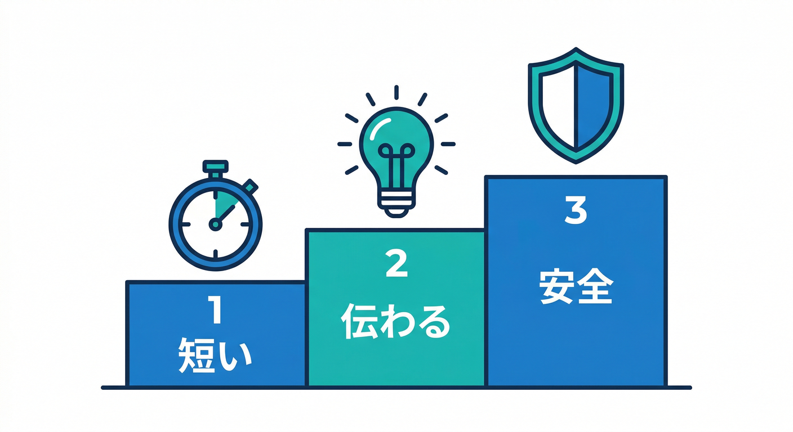

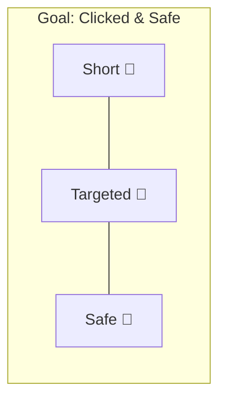

---

## この章のゴール🎯

* コメント本文（長文になりがち）を、通知で読める **短い文章** に変換できる🤏📝
* **個人情報っぽいもの**（メール/電話/住所っぽい文字列など）を出さないようにする🧯
* “AIに任せつつ”、最後はコードで **安全柵（ガードレール）** を作れる🚧🤖
* さらに、運用で困らないように **Remote Configでプロンプト/モデルを差し替え**できるように考える🔁🧠 ([Firebase][1])

---

## 読む📖：通知文って、なにが難しいの？🤔🔔

## 1) 通知の本文は「短いほど強い」💪🧩

FCMのメッセージは **notification**（表示される系）と **data**（アプリ側で処理する系）に分かれて、どっちも基本は **最大 4096 bytes**（ただしFirebaseコンソール送信は **1000文字制限**）という枠があります📦 ([Firebase][2])
でも“仕様上OK”でも、長い通知って読まれないんだよね…🥲

なのでこの教材では、通知文をこう割り切ります👇

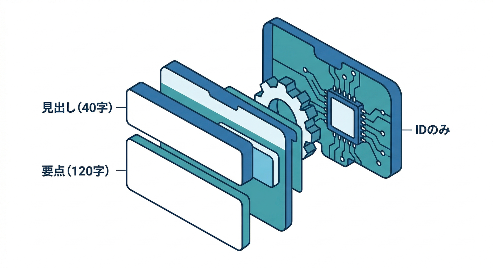

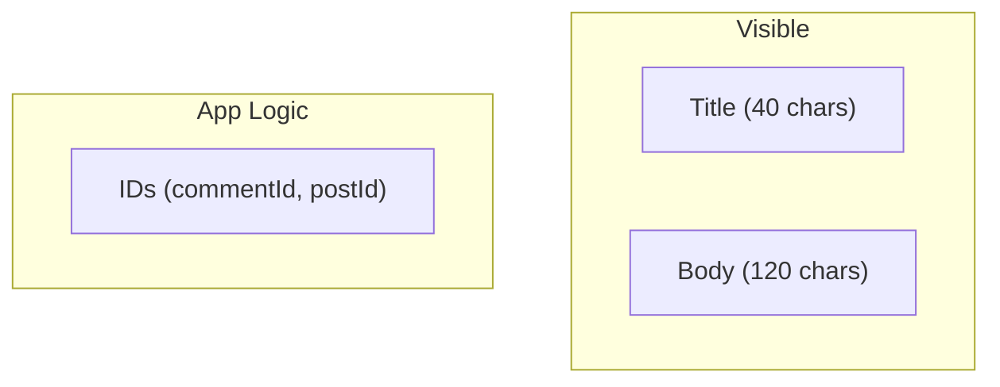

* **タイトル**：～40文字くらい（見出し）
* **本文**：～80〜120文字くらい（要点だけ）
* **data**：画面遷移に必要なIDだけ（例：commentId, postId）🧩

## 2) “安全”が最優先（通知はロック画面に出る）🔐📱

通知は、端末によってはロック画面にも出るよね。
つまり「**個人情報やNG表現が混ざると事故**」になりやすい⚠️

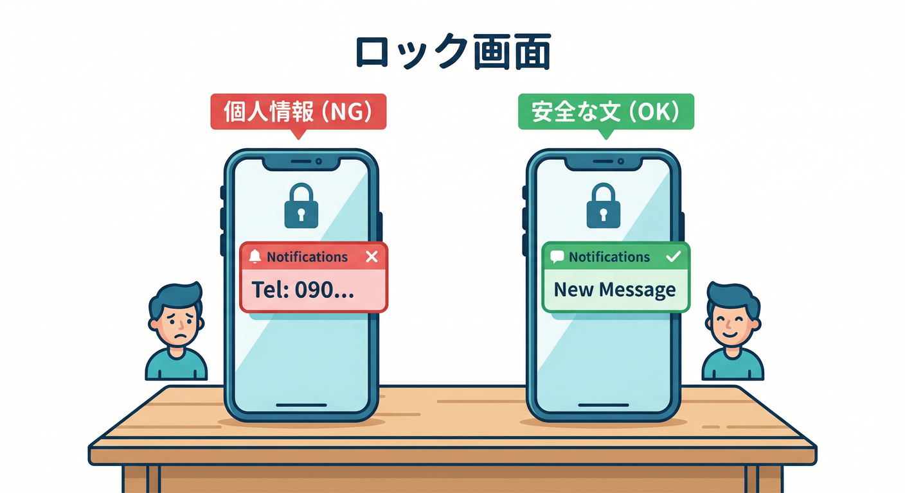

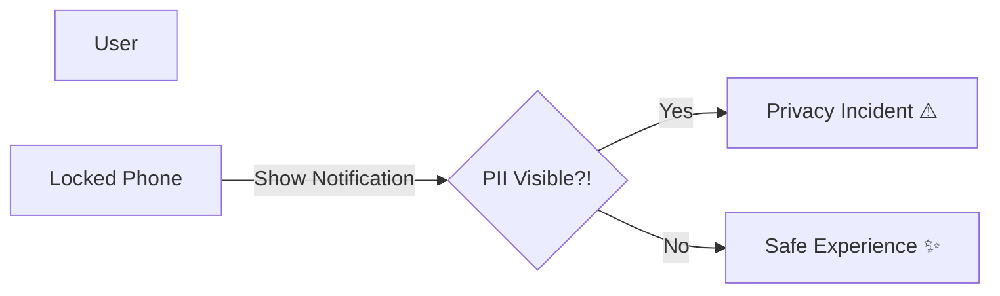

だからAIにお願いするときも、必ずこう言う✅

* **個人情報は出さない**（メール、電話、住所、URL、フルネームっぽいもの等）
* **短く要点だけ**
* **攻撃的/差別的な言い回しは避ける**
* もし危なそうなら、**無難な文に逃がす**（フォールバック）🧯

## 3) Firebase AI Logic と Genkit の立ち位置🧠✨

* **Firebase AI Logic**：アプリ（Web/モバイル）からGemini/Imagenを安全に呼ぶための仕組み。SDK＋プロキシ＋App Check連携などが揃ってるよ🛡️ ([Firebase][3])
* **Genkit**：サーバー側（Functions/Cloud Runなど）でAIワークフローを作るためのフレームワーク。より複雑な処理・運用向き🧰 ([Firebase][3])

今回の「コメント作成→自動で通知送信（第14章）」の流れに自然に混ぜるなら、**サーバー側（Functions）で整形**するのが王道です⚡🛠️


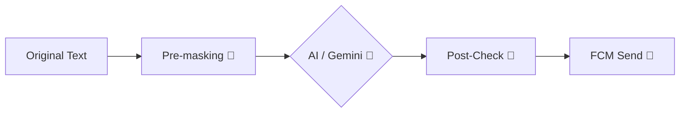
一方で「通知ON前にプレビューしたい」みたいなUI側の体験には **AI Logic** が相性いい、って感じ🙂

---

## 手を動かす🖱️：コメント本文 → 安全な通知文 を作る🤖📝🧯

ここからは “AI＋安全柵” のセットでいきます💡
流れはこれ👇

1. **前処理**：個人情報っぽいのを先にマスク（雑でもOK）🧽
2. **AI整形**：短く・要点だけ・安全に要約🧠
3. **後処理**：もう一回チェックして、危なければフォールバック🧯
4. **FCM送信**：notificationは短く、dataはIDだけ📦

---

## Step 1：まず「通知文の仕様」を決める📏🧩

おすすめの最小仕様（この教材のデフォルト）👇

* title：`"{表示名}さんからコメント"`（または固定で「新しいコメント」でもOK）
* body：要点だけ（最大120文字）
* data：`commentId`, `postId`, `url` など “画面遷移に必要なものだけ”
* NG：メール/電話/住所っぽい文字列、URL、過激表現、長文

> トピック送信を使う場合、payload上限が **2048 bytes** になる点も覚えておくと安心だよ📉 ([Firebase][4])

---

## Step 2：前処理（個人情報っぽいのを雑にマスク）🧽🔎

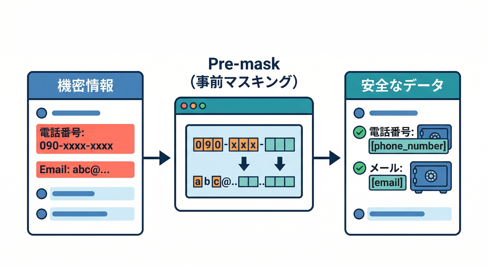

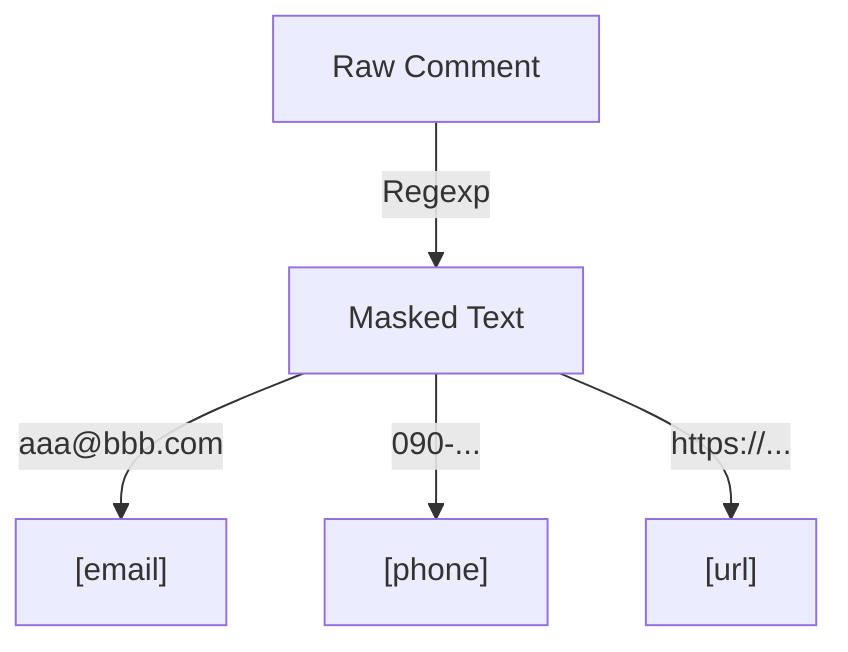

**「AIに渡す前」**に、最低限これだけやると事故率が下がる👍

```ts
// ざっくり版：完璧じゃなくてOK。事故を減らすのが目的🙂
export function preMask(text: string): string {
  return text
    .replace(/\b[A-Z0-9._%+-]+@[A-Z0-9.-]+\.[A-Z]{2,}\b/gi, "[email]") // email
    .replace(/\b\d{2,4}-\d{2,4}-\d{3,4}\b/g, "[phone]")              // phone
    .replace(/https?:\/\/\S+/g, "[url]")                             // url
    .replace(/\s+/g, " ")                                            // whitespace
    .trim();
}
```

---

## Step 3：AI整形（“短い・伝わる・安全” を指示する）🤖📝✨


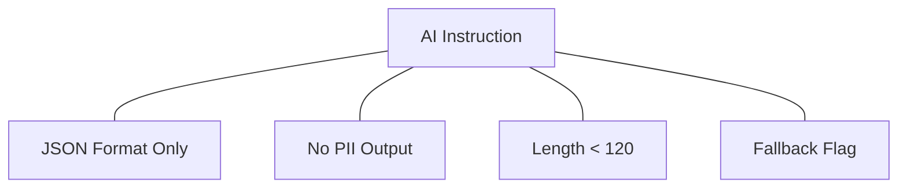

ここが本体！ポイントは **「出力形式」と「禁止事項」** をめちゃ明確にすること👮‍♂️

* 出力は **JSON固定**（タイトル・本文・危険フラグ）
* 個人情報やURLは **絶対に出さない**
* 本文は **120文字以内**
* ダメなら `safeFallback=true` を返す

```ts
// プロンプト（例）
// - “通知用の短文を作る”と役割を固定
// - ルールを箇条書きで強制
// - 出力はJSONだけにして、後段処理しやすくする🧩
export function buildSystemInstruction(maxBodyChars = 120) {
  return `
あなたは通知文の編集者です。
次のコメント本文から「通知で読める短文」を作ってください。

【ルール】
- 個人情報っぽいもの（メール/電話/住所/URL/フルネーム等）は絶対に含めない
- 攻撃的/差別的/性的/暴力的な表現は避ける（必要なら無難な表現に置き換える）
- 本文は最大 ${maxBodyChars} 文字
- 重要な要点だけを1文で
- 出力は必ずJSONのみ（説明文は禁止）

【出力JSON】
{
  "title": "string",
  "body": "string",
  "riskFlags": { "pii": boolean, "unsafeTone": boolean },
  "safeFallback": boolean
}
`.trim();
}
```

> Firebase AI Logic は「アプリからGemini/Imagenを安全に呼ぶ」ために、プロキシやApp Check連携、ユーザー単位のレート制限などの仕組みが用意されてるよ🛡️ ([Firebase][3])

---

## Step 4：後処理（最後は“コードで守る”🚧）🧯

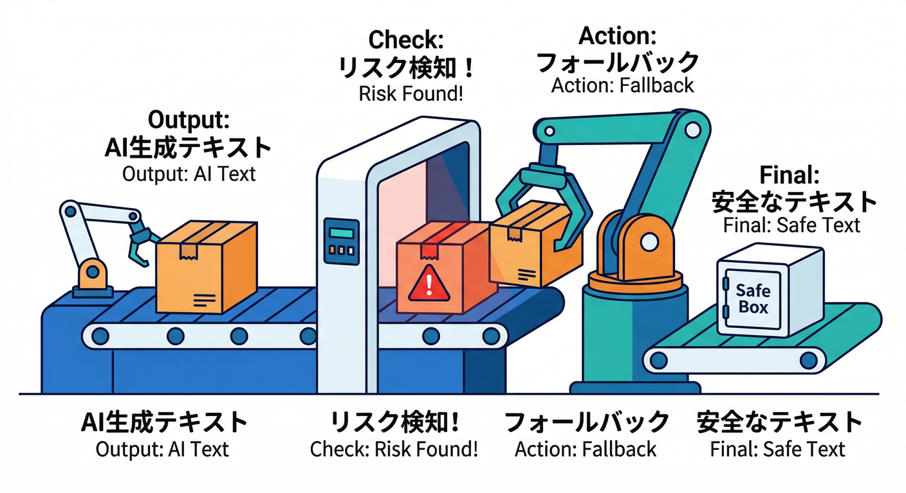

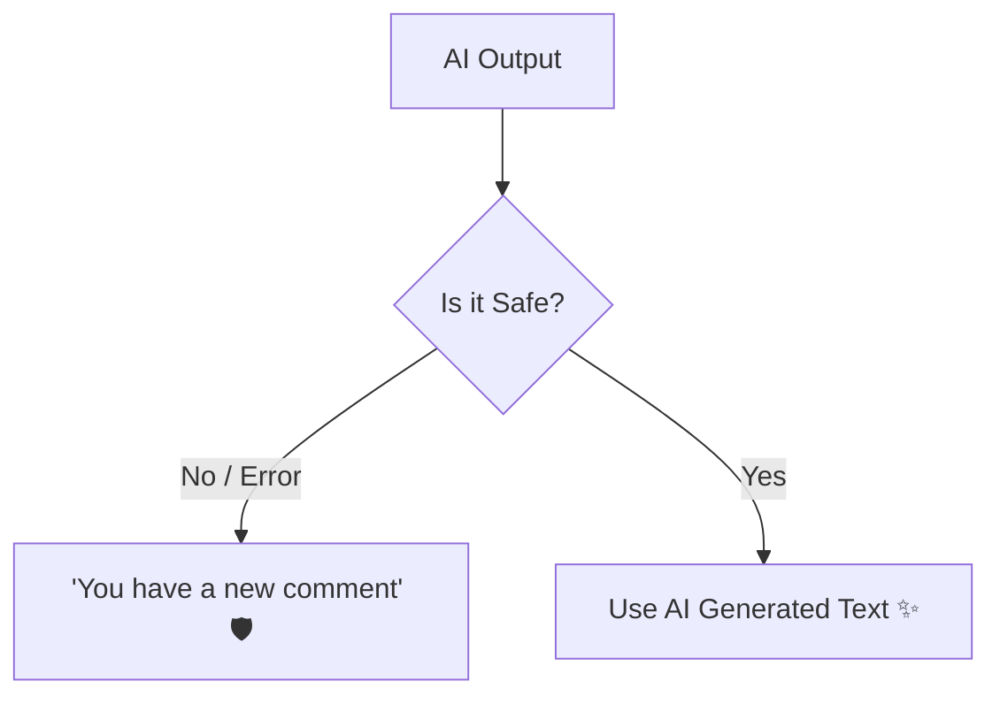

AIの結果を受け取ったら、**最後に必ず検査**します✅
（ここが“教材として超大事”ポイント！）

```ts
export type NotifCopy = {
  title: string;
  body: string;
  riskFlags: { pii: boolean; unsafeTone: boolean };
  safeFallback: boolean;
};

export function postCheckAndFix(copy: NotifCopy): NotifCopy {
  const fixed: NotifCopy = {
    ...copy,
    title: (copy.title ?? "").trim().slice(0, 60),
    body: (copy.body ?? "").trim().slice(0, 140),
  };

  // もう一回、危険パターン検出（簡易でOK）
  const hasEmail = /\b[A-Z0-9._%+-]+@[A-Z0-9.-]+\.[A-Z]{2,}\b/i.test(fixed.body);
  const hasPhone = /\b\d{2,4}-\d{2,4}-\d{3,4}\b/.test(fixed.body);
  const hasUrl = /https?:\/\/\S+/.test(fixed.body);

  if (hasEmail || hasPhone || hasUrl) {
    fixed.riskFlags.pii = true;
  }

  // 危険ならフォールバック（無難に逃げる🧯）
  if (fixed.safeFallback || fixed.riskFlags.pii || fixed.riskFlags.unsafeTone) {
    return {
      title: "新しいコメント",
      body: "新しいコメントが届きました。アプリで確認してください🙂",
      riskFlags: { pii: false, unsafeTone: false },
      safeFallback: true,
    };
  }

  // 空もフォールバック
  if (!fixed.body) {
    fixed.body = "新しいコメントが届きました🙂";
  }

  return fixed;
}
```

---

## Step 5：FCMに載せる（短く・IDだけ）📦🔔

FCMは notification/data の2系統。notificationは人間向け、dataはアプリ向け。
payload上限（4096 bytes、コンソールは1000文字、トピックは2048 bytes）を超えないようにね📏 ([Firebase][2])

```ts
// 例：送信する形（概念コード）
// notification: 画面に見える文
// data: 画面遷移に必要な情報だけ
const message = {
  token,
  notification: {
    title: copy.title,
    body: copy.body,
  },
  data: {
    commentId,
    postId,
    url, // ルーティング用（短く！）
  },
};
```

---

## ミニ課題🎯：NGワード＆個人情報マスクを“運用できる形”にする🧹🧠

やることはシンプル👇

1. NGワード（例：暴言ワード）を10個くらい決める🧾
2. `preMask` に「NGワード→[masked]」を追加する🧽
3. テスト用コメントを5つ作って、結果が安全かチェック✅

テスト用コメント例（わざと危険を混ぜる😈）👇

* 「メールは [aaa@example.com](mailto:aaa@example.com) です」
* 「電話 090-1234-5678 に連絡して」
* 「このURL見て https://…」
* 「住所は〇〇市〇〇…」
* 「（口が悪い）ムカつく」

目標は「通知に出ないこと」🙅‍♂️🔔

---

## チェック✅：ここまでできたら合格🎉

* 通知文が **短い（120文字以内）** になってる？🤏
* メール/電話/URLが **絶対に出てない**？🔐
* 危険っぽい時に **フォールバック** してる？🧯
* notification と data を **役割分担** できてる？🧩
* （余裕）Remote Configで **プロンプト/モデル名を差し替え**できる設計になってる？🔁 ([Firebase][1])

---

## ちょい補足：AIの“改善”を速く回す小ワザ🛸💻✨

* **Gemini CLI**：サンプルコメントを大量に作って「こう要約してほしい」を早回しで詰めるのに便利💨 ([Google Cloud Documentation][5])
* **Antigravity**：エージェントに「危険パターン列挙→テストケース生成→改善案」までやらせる、みたいな流れが作りやすい🧠🧪 ([Google Codelabs][6])

---

## 参考：ランタイムの“いま”だけ一言（最新確認）🧠⚙️

* Cloud Run functions のランタイム一覧は **2026-02-18更新**で、Node.jsは **24/22/20** などが載ってるよ📌 ([Google Cloud Documentation][7])
* Cloud Functions for Firebase 側のドキュメントでは Node.js **22/20** が主で、**18は非推奨**と明記されてる✅ ([Firebase][8])

> 「どの実行基盤を使ってるか」で選べるランタイムがズレるので、**自分のデプロイ先の“runtime support”を都度見る**のが安全だよ🙂🔎 ([Google Cloud Documentation][7])

---

次の第19章は、この章で作った通知文（＋安全フラグ）を使って「送る/送らない」を賢くするよ🧠🔀
もし第18章のコードを、第14章のFirestoreトリガーに“最小差分”で合体する形で書きたいなら、その形でつなげた完成例も出せるよ⚡📦

[1]: https://firebase.google.com/docs/remote-config/solutions/vertexai "Dynamically update your Firebase AI Logic app with Firebase Remote Config"
[2]: https://firebase.google.com/docs/cloud-messaging/customize-messages/set-message-type "Firebase Cloud Messaging message types"
[3]: https://firebase.google.com/docs/ai-logic "Gemini API using Firebase AI Logic  |  Firebase AI Logic"
[4]: https://firebase.google.com/docs/cloud-messaging/error-codes "FCM Error Codes  |  Firebase Cloud Messaging"
[5]: https://docs.cloud.google.com/gemini/docs/codeassist/gemini-cli?utm_source=chatgpt.com "Gemini CLI | Gemini for Google Cloud"
[6]: https://codelabs.developers.google.com/getting-started-google-antigravity?utm_source=chatgpt.com "Getting Started with Google Antigravity"
[7]: https://docs.cloud.google.com/functions/docs/runtime-support "Runtime support  |  Cloud Run functions  |  Google Cloud Documentation"
[8]: https://firebase.google.com/docs/functions/1st-gen/manage-functions-1st?hl=ja "関数を管理する（第 1 世代）  |  Cloud Functions for Firebase"
